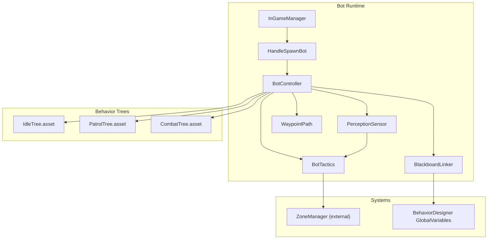
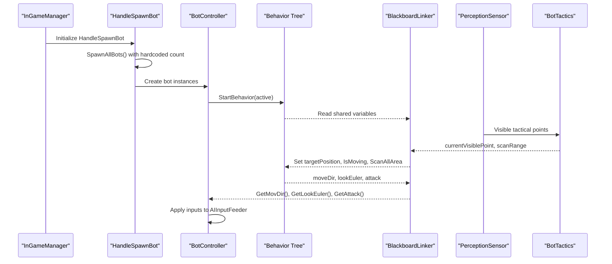
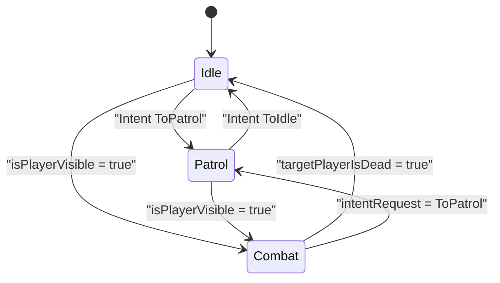
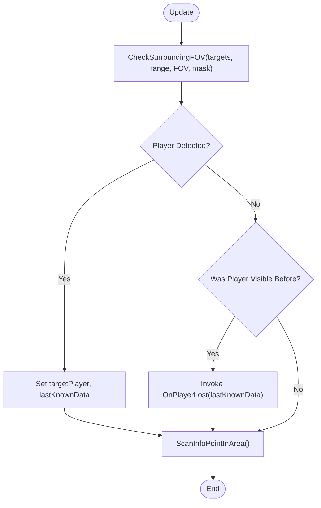
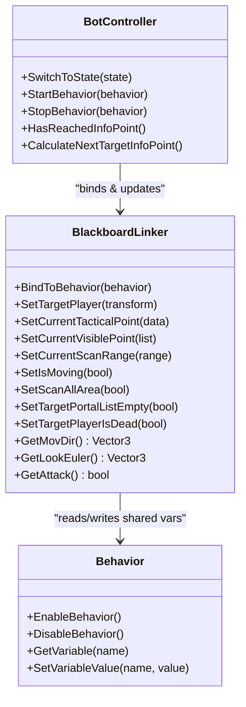
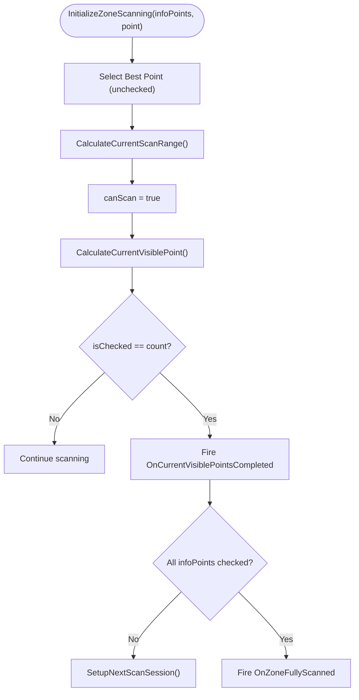
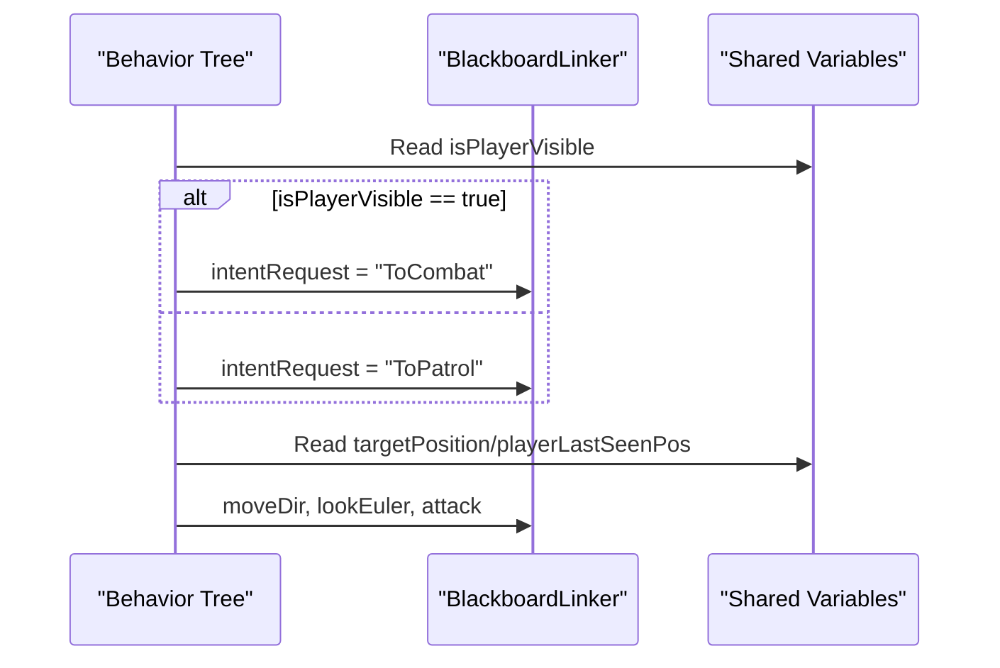
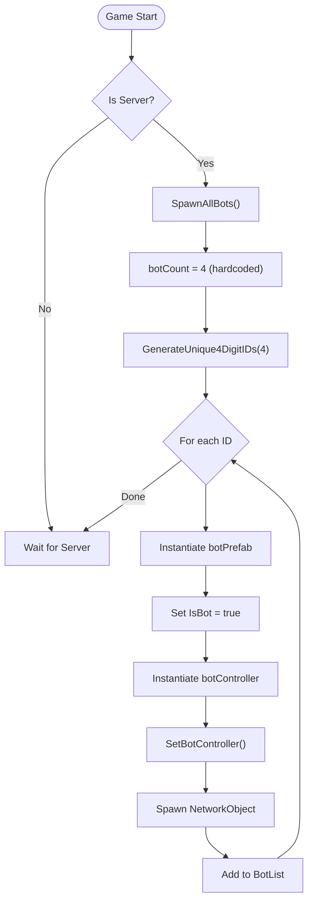
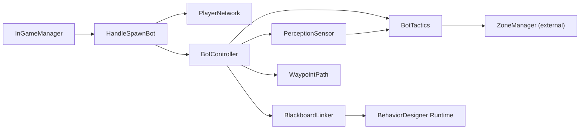

# AI Bot System

<cite>
**Referenced Files in This Document**
- [FSMState.cs](file://Assets/FPS-Game/Scripts/Bot/FSMState.cs)
- [BotController.cs](file://Assets/FPS-Game/Scripts/Bot/BotController.cs)
- [PerceptionSensor.cs](file://Assets/FPS-Game/Scripts/Bot/PerceptionSensor.cs)
- [BlackboardLinker.cs](file://Assets/FPS-Game/Scripts/Bot/BlackboardLinker.cs)
- [BotTactics.cs](file://Assets/FPS-Game/Scripts/Bot/BotTactics.cs)
- [WaypointPath.cs](file://Assets/FPS-Game/Scripts/Bot/WaypointPath.cs)
- [HandleSpawnBot.cs](file://Assets/FPS-Game/Scripts/System/HandleSpawnBot.cs)
- [InGameManager.cs](file://Assets/FPS-Game/Scripts/System/InGameManager.cs)
- [IdleTree.asset](file://Assets/FPS-Game/Scripts/Bot/Task/Tree Assets/IdleTree.asset)
- [PatrolTree.asset](file://Assets/FPS-Game/Scripts/Bot/Task/Tree Assets/PatrolTree.asset)
- [CombatTree.asset](file://Assets/FPS-Game/Scripts/Bot/Task/Tree Assets/CombatTree.asset)
- [BoolComparison.cs](file://Assets/Behavior%20Designer/Runtime/Tasks/Unity/Math/BoolComparison.cs)
</cite>

## Update Summary
**Changes Made**
- Updated bot spawning section to reflect the removal of LobbyManager dependency
- Added new section documenting the hardcoded bot count configuration
- Updated system architecture diagram to show simplified bot management flow
- Enhanced troubleshooting guide with bot spawning configuration guidance

## Table of Contents
1. [Introduction](#introduction)
2. [Project Structure](#project-structure)
3. [Core Components](#core-components)
4. [Architecture Overview](#architecture-overview)
5. [Detailed Component Analysis](#detailed-component-analysis)
6. [Dependency Analysis](#dependency-analysis)
7. [Performance Considerations](#performance-considerations)
8. [Troubleshooting Guide](#troubleshooting-guide)
9. [Conclusion](#conclusion)
10. [Appendices](#appendices)

## Introduction
This document explains the AI bot system built on a hybrid Finite State Machine (FSM) and Behavior Designer (BD) behavior trees. It covers:
- The FSM states (Idle, Patrol, Combat) and transitions
- How BD trees integrate with C# blackboard data via a dedicated linker
- The perception system that detects players and marks tactical points visible
- The tactical AI for spatial reasoning and scanning
- Configuration options for bot behavior parameters, perception ranges, and tactical decision-making
- Relationships with the zone system and networking
- Practical troubleshooting and performance tips

**Updated** The bot spawning system now uses a simplified approach with hardcoded defaults, removing the dependency on lobby-based bot configuration.

## Project Structure
The AI subsystem resides under Assets/FPS-Game/Scripts/Bot and integrates with Behavior Designer under Assets/Behavior Designer. The bot's runtime behavior is orchestrated by a controller that switches BD behaviors and feeds them via a blackboard linker. Perception and tactical scanning feed BD variables that drive movement, targeting, and scanning.

**Diagram sources**
- [BotController.cs:1-485](file://Assets/FPS-Game/Scripts/Bot/BotController.cs#L1-L485)
- [PerceptionSensor.cs:1-407](file://Assets/FPS-Game/Scripts/Bot/PerceptionSensor.cs#L1-L407)
- [BlackboardLinker.cs:1-332](file://Assets/FPS-Game/Scripts/Bot/BlackboardLinker.cs#L1-L332)
- [BotTactics.cs:1-456](file://Assets/FPS-Game/Scripts/Bot/BotTactics.cs#L1-L456)
- [WaypointPath.cs:1-71](file://Assets/FPS-Game/Scripts/Bot/WaypointPath.cs#L1-L71)
- [HandleSpawnBot.cs:1-80](file://Assets/FPS-Game/Scripts/System/HandleSpawnBot.cs#L1-L80)
- [InGameManager.cs:80-139](file://Assets/FPS-Game/Scripts/System/InGameManager.cs#L80-L139)
- [IdleTree.asset:1-34](file://Assets/FPS-Game/Scripts/Bot/Task/Tree Assets/IdleTree.asset#L1-L34)
- [PatrolTree.asset:1-40](file://Assets/FPS-Game/Scripts/Bot/Task/Tree Assets/PatrolTree.asset#L1-L40)
- [CombatTree.asset:1-40](file://Assets/FPS-Game/Scripts/Bot/Task/Tree Assets/CombatTree.asset#L1-L40)

**Section sources**
- [BotController.cs:1-485](file://Assets/FPS-Game/Scripts/Bot/BotController.cs#L1-L485)
- [PerceptionSensor.cs:1-407](file://Assets/FPS-Game/Scripts/Bot/PerceptionSensor.cs#L1-L407)
- [BlackboardLinker.cs:1-332](file://Assets/FPS-Game/Scripts/Bot/BlackboardLinker.cs#L1-L332)
- [BotTactics.cs:1-456](file://Assets/FPS-Game/Scripts/Bot/BotTactics.cs#L1-L456)
- [WaypointPath.cs:1-71](file://Assets/FPS-Game/Scripts/Bot/WaypointPath.cs#L1-L71)
- [HandleSpawnBot.cs:1-80](file://Assets/FPS-Game/Scripts/System/HandleSpawnBot.cs#L1-L80)
- [InGameManager.cs:80-139](file://Assets/FPS-Game/Scripts/System/InGameManager.cs#L80-L139)
- [IdleTree.asset:1-34](file://Assets/FPS-Game/Scripts/Bot/Task/Tree Assets/IdleTree.asset#L1-L34)
- [PatrolTree.asset:1-40](file://Assets/FPS-Game/Scripts/Bot/Task/Tree Assets/PatrolTree.asset#L1-L40)
- [CombatTree.asset:1-40](file://Assets/FPS-Game/Scripts/Bot/Task/Tree Assets/CombatTree.asset#L1-L40)

## Core Components
- FSMState: Defines initial and runtime state enums for the bot (commented in current code; see State enum in BotController).
- BotController: Orchestrates FSM transitions, starts/stops BD behaviors, and streams runtime values to the input feeder.
- PerceptionSensor: Detects players within FOV/range, tracks last-known positions, and marks visible tactical points.
- BlackboardLinker: Bridges C# blackboard values to BD shared variables and reads outputs from BD back to C#.
- BotTactics: Computes scan ranges, visible tactical points, and predicts zones based on last-known player data.
- WaypointPath: Supplies patrol waypoints for the bot.
- HandleSpawnBot: Manages bot spawning with hardcoded defaults (replacing lobby-based configuration).
- Behavior Trees: IdleTree, PatrolTree, and CombatTree define behavior logic and consume shared variables.

**Updated** Bot spawning is now handled by HandleSpawnBot with a hardcoded default of 4 bots, eliminating the need for lobby-based bot configuration.

**Section sources**
- [BotController.cs:7-57](file://Assets/FPS-Game/Scripts/Bot/BotController.cs#L7-L57)
- [PerceptionSensor.cs:10-42](file://Assets/FPS-Game/Scripts/Bot/PerceptionSensor.cs#L10-L42)
- [BlackboardLinker.cs:54-113](file://Assets/FPS-Game/Scripts/Bot/BlackboardLinker.cs#L54-L113)
- [BotTactics.cs:17-58](file://Assets/FPS-Game/Scripts/Bot/BotTactics.cs#L17-L58)
- [WaypointPath.cs:10-39](file://Assets/FPS-Game/Scripts/Bot/WaypointPath.cs#L10-L39)
- [HandleSpawnBot.cs:31-32](file://Assets/FPS-Game/Scripts/System/HandleSpawnBot.cs#L31-L32)
- [IdleTree.asset:13-34](file://Assets/FPS-Game/Scripts/Bot/Task/Tree Assets/IdleTree.asset#L13-L34)
- [PatrolTree.asset:13-40](file://Assets/FPS-Game/Scripts/Bot/Task/Tree Assets/PatrolTree.asset#L13-L40)
- [CombatTree.asset:13-40](file://Assets/FPS-Game/Scripts/Bot/Task/Tree Assets/CombatTree.asset#L13-L40)

## Architecture Overview
The system follows a deterministic FSM that delegates runtime control to Behavior Designer trees. Perception and tactics feed BD variables; BD outputs (movement, look, attack) are read by the linker and applied to the character controller. Bot spawning is now simplified with hardcoded defaults.

**Diagram sources**
- [InGameManager.cs:135](file://Assets/FPS-Game/Scripts/System/InGameManager.cs#L135)
- [HandleSpawnBot.cs:27-41](file://Assets/FPS-Game/Scripts/System/HandleSpawnBot.cs#L27-L41)
- [BotController.cs:281-329](file://Assets/FPS-Game/Scripts/Bot/BotController.cs#L281-L329)
- [BlackboardLinker.cs:195-221](file://Assets/FPS-Game/Scripts/Bot/BlackboardLinker.cs#L195-L221)
- [PerceptionSensor.cs:129-178](file://Assets/FPS-Game/Scripts/Bot/PerceptionSensor.cs#L129-L178)
- [BotTactics.cs:114-123](file://Assets/FPS-Game/Scripts/Bot/BotTactics.cs#L114-L123)

## Detailed Component Analysis

### FSM and State Transitions
- States: Idle, Patrol, Combat are managed by BotController's state machine.
- Transitions are initiated by BotController.SwitchToState(newState), which:
  - Stops the previous behavior
  - Starts the corresponding BD behavior
  - Seeds BD variables via BlackboardLinker
  - Updates patrol portals and scanning flags

**Diagram sources**
- [BotController.cs:230-275](file://Assets/FPS-Game/Scripts/Bot/BotController.cs#L230-L275)
- [IdleTree.asset:23-34](file://Assets/FPS-Game/Scripts/Bot/Task/Tree Assets/IdleTree.asset#L23-L34)
- [PatrolTree.asset:23-40](file://Assets/FPS-Game/Scripts/Bot/Task/Tree Assets/PatrolTree.asset#L23-L40)
- [CombatTree.asset:23-40](file://Assets/FPS-Game/Scripts/Bot/Task/Tree Assets/CombatTree.asset#L23-L40)

**Section sources**
- [BotController.cs:230-275](file://Assets/FPS-Game/Scripts/Bot/BotController.cs#L230-L275)
- [FSMState.cs:6-29](file://Assets/FPS-Game/Scripts/Bot/FSMState.cs#L6-L29)

### Perception System
- Detection pipeline:
  - Iterates nearby players within viewDistance and FOV
  - Casts ray to filter occlusions
  - Updates lastKnownData when a player is spotted
  - Emits OnPlayerLost with lastKnownData and OnTargetPlayerIsDead when the player dies
- Visible tactical points:
  - BotTactics exposes currentVisiblePoint; PerceptionSensor marks InfoPoint.isChecked when visible

**Diagram sources**
- [PerceptionSensor.cs:64-107](file://Assets/FPS-Game/Scripts/Bot/PerceptionSensor.cs#L64-L107)
- [PerceptionSensor.cs:129-178](file://Assets/FPS-Game/Scripts/Bot/PerceptionSensor.cs#L129-L178)
- [PerceptionSensor.cs:180-210](file://Assets/FPS-Game/Scripts/Bot/PerceptionSensor.cs#L180-L210)

**Section sources**
- [PerceptionSensor.cs:129-178](file://Assets/FPS-Game/Scripts/Bot/PerceptionSensor.cs#L129-L178)
- [PerceptionSensor.cs:180-210](file://Assets/FPS-Game/Scripts/Bot/PerceptionSensor.cs#L180-L210)

### Blackboard Linking Mechanism
- Binding:
  - BotController calls BlackboardLinker.BindToBehavior when switching behaviors
  - BindToBehavior seeds BD variables for IdleTree, PatrolTree, and CombatTree
- Reading outputs:
  - BlackboardLinker.GetValuesSharedVariables reads BD outputs (moveDir, lookEuler, attack)
- Variable updates:
  - Methods like SetTargetPlayer, SetCurrentTacticalPoint, SetCurrentVisiblePoint, SetCurrentScanRange, SetIsMoving, SetScanAllArea, SetTargetPortalListEmpty, SetTargetPlayerIsDead write to BD global/shared variables

**Diagram sources**
- [BotController.cs:281-329](file://Assets/FPS-Game/Scripts/Bot/BotController.cs#L281-L329)
- [BlackboardLinker.cs:86-113](file://Assets/FPS-Game/Scripts/Bot/BlackboardLinker.cs#L86-L113)
- [BlackboardLinker.cs:195-221](file://Assets/FPS-Game/Scripts/Bot/BlackboardLinker.cs#L195-L221)
- [BlackboardLinker.cs:254-329](file://Assets/FPS-Game/Scripts/Bot/BlackboardLinker.cs#L254-L329)

**Section sources**
- [BotController.cs:281-329](file://Assets/FPS-Game/Scripts/Bot/BotController.cs#L281-L329)
- [BlackboardLinker.cs:86-113](file://Assets/FPS-Game/Scripts/Bot/BlackboardLinker.cs#L86-L113)
- [BlackboardLinker.cs:195-221](file://Assets/FPS-Game/Scripts/Bot/BlackboardLinker.cs#L195-L221)
- [BlackboardLinker.cs:254-329](file://Assets/FPS-Game/Scripts/Bot/BlackboardLinker.cs#L254-L329)

### Tactical AI and Spatial Reasoning
- Zone prediction:
  - PredictMostSuspiciousZone computes dot product between player look direction and portal directions to infer likely escape/entry zone
- Scan range computation:
  - CalculateCurrentScanRange finds the largest angular gap among visible tactical points to define a scanning arc
- Scanning lifecycle:
  - InitializeZoneScanning sets up currentInfoPointsToScan and currentInfoPoint
  - SetupNextScanSession selects next best point and calculates scan range
  - Events fire when current visible points are scanned or zone is fully scanned

**Diagram sources**
- [BotTactics.cs:70-92](file://Assets/FPS-Game/Scripts/Bot/BotTactics.cs#L70-L92)
- [BotTactics.cs:114-123](file://Assets/FPS-Game/Scripts/Bot/BotTactics.cs#L114-L123)
- [BotTactics.cs:125-196](file://Assets/FPS-Game/Scripts/Bot/BotTactics.cs#L125-L196)
- [BotTactics.cs:239-283](file://Assets/FPS-Game/Scripts/Bot/BotTactics.cs#L239-L283)

**Section sources**
- [BotTactics.cs:198-237](file://Assets/FPS-Game/Scripts/Bot/BotTactics.cs#L198-L237)
- [BotTactics.cs:125-196](file://Assets/FPS-Game/Scripts/Bot/BotTactics.cs#L125-L196)
- [BotTactics.cs:239-283](file://Assets/FPS-Game/Scripts/Bot/BotTactics.cs#L239-L283)

### Behavior Trees Integration
- IdleTree:
  - Waits for a configured duration and then sets intentRequest to "ToPatrol"
- PatrolTree:
  - Checks isPlayerVisible; if true, transitions to combat
  - Otherwise repeats moving toward waypoints and increments index
- CombatTree:
  - If player is visible, moves toward last seen position
  - Else, sets intentRequest to "ToPatrol"

**Diagram sources**
- [IdleTree.asset:23-34](file://Assets/FPS-Game/Scripts/Bot/Task/Tree Assets/IdleTree.asset#L23-L34)
- [PatrolTree.asset:23-40](file://Assets/FPS-Game/Scripts/Bot/Task/Tree Assets/PatrolTree.asset#L23-L40)
- [CombatTree.asset:23-40](file://Assets/FPS-Game/Scripts/Bot/Task/Tree Assets/CombatTree.asset#L23-L40)
- [BoolComparison.cs:5-22](file://Assets/Behavior%20Designer/Runtime/Tasks/Unity/Math/BoolComparison.cs#L5-L22)

**Section sources**
- [IdleTree.asset:23-34](file://Assets/FPS-Game/Scripts/Bot/Task/Tree Assets/IdleTree.asset#L23-L34)
- [PatrolTree.asset:23-40](file://Assets/FPS-Game/Scripts/Bot/Task/Tree Assets/PatrolTree.asset#L23-L40)
- [CombatTree.asset:23-40](file://Assets/FPS-Game/Scripts/Bot/Task/Tree Assets/CombatTree.asset#L23-L40)
- [BoolComparison.cs:5-22](file://Assets/Behavior%20Designer/Runtime/Tasks/Unity/Math/BoolComparison.cs#L5-L22)

### Bot Spawning and Management
**Updated** The bot spawning system has been simplified to eliminate lobby dependencies:

- HandleSpawnBot manages bot creation with hardcoded defaults:
  - Uses a fixed bot count of 4 bots for all game modes
  - Generates unique 4-digit IDs for each bot instance
  - Creates bot controllers and network objects
  - Adds bots to the BotList dictionary for management
- InGameManager integrates HandleSpawnBot as a core component:
  - Initializes HandleSpawnBot during game setup
  - No longer requires lobby-based bot configuration
  - Simplified initialization process across all game modes

**Diagram sources**
- [HandleSpawnBot.cs:27-41](file://Assets/FPS-Game/Scripts/System/HandleSpawnBot.cs#L27-L41)
- [HandleSpawnBot.cs:43-55](file://Assets/FPS-Game/Scripts/System/HandleSpawnBot.cs#L43-L55)
- [InGameManager.cs:135](file://Assets/FPS-Game/Scripts/System/InGameManager.cs#L135)

**Section sources**
- [HandleSpawnBot.cs:31-32](file://Assets/FPS-Game/Scripts/System/HandleSpawnBot.cs#L31-L32)
- [HandleSpawnBot.cs:57-79](file://Assets/FPS-Game/Scripts/System/HandleSpawnBot.cs#L57-L79)
- [InGameManager.cs:135](file://Assets/FPS-Game/Scripts/System/InGameManager.cs#L135)

### Patrol Path and Waypoints
- WaypointPath loads the global waypoint list and supports index-based navigation
- BotController calculates a portal route using ZoneManager and iterates through portals
- Upon reaching a portal, it triggers scanning and updates BD variables

**Section sources**
- [WaypointPath.cs:33-39](file://Assets/FPS-Game/Scripts/Bot/WaypointPath.cs#L33-L39)
- [BotController.cs:331-354](file://Assets/FPS-Game/Scripts/Bot/BotController.cs#L331-L354)

## Dependency Analysis
- BotController depends on:
  - PerceptionSensor for player detection
  - BlackboardLinker for BD variable synchronization
  - BotTactics for tactical scanning and zone prediction
  - WaypointPath for patrol routing
- HandleSpawnBot depends on:
  - PlayerNetwork prefab for bot instantiation
  - BotController prefab for AI behavior attachment
  - NetworkObject for network synchronization
- InGameManager coordinates:
  - HandleSpawnBot initialization and integration
  - Simplified initialization process without lobby dependencies
- BlackboardLinker depends on:
  - BehaviorDesigner Runtime APIs to read/write shared variables
  - GlobalVariables for global transforms (e.g., botCamera)
- PerceptionSensor depends on:
  - PlayerRoot camera for FOV/raycast logic
  - BotTactics for visible point marking
- BotTactics depends on:
  - ZoneManager for zone graph and portal routing
  - InfoPoint visibility indices to compute scan ranges

**Diagram sources**
- [InGameManager.cs:135](file://Assets/FPS-Game/Scripts/System/InGameManager.cs#L135)
- [HandleSpawnBot.cs:8-9](file://Assets/FPS-Game/Scripts/System/HandleSpawnBot.cs#L8-L9)
- [BotController.cs:92-110](file://Assets/FPS-Game/Scripts/Bot/BotController.cs#L92-L110)
- [BlackboardLinker.cs:3,58](file://Assets/FPS-Game/Scripts/Bot/BlackboardLinker.cs#L3,L58)
- [PerceptionSensor.cs:43-46](file://Assets/FPS-Game/Scripts/Bot/PerceptionSensor.cs#L43-L46)
- [BotTactics.cs:198-237](file://Assets/FPS-Game/Scripts/Bot/BotTactics.cs#L198-L237)

**Section sources**
- [InGameManager.cs:135](file://Assets/FPS-Game/Scripts/System/InGameManager.cs#L135)
- [HandleSpawnBot.cs:8-9](file://Assets/FPS-Game/Scripts/System/HandleSpawnBot.cs#L8-L9)
- [BotController.cs:92-110](file://Assets/FPS-Game/Scripts/Bot/BotController.cs#L92-L110)
- [BlackboardLinker.cs:3,58](file://Assets/FPS-Game/Scripts/Bot/BlackboardLinker.cs#L3,L58)
- [PerceptionSensor.cs:43-46](file://Assets/FPS-Game/Scripts/Bot/PerceptionSensor.cs#L43-L46)
- [BotTactics.cs:198-237](file://Assets/FPS-Game/Scripts/Bot/BotTactics.cs#L198-L237)

## Performance Considerations
- Minimize BD variable churn:
  - BlackboardLinker.SafeSet avoids redundant writes by checking current values before assignment
- Reduce perception sampling cost:
  - Limit sampleDirectionCount and navMeshSampleMaxDistance
  - Disable debug gizmos in production
- Optimize scanning:
  - Precompute scan ranges and reuse currentScanRange
  - Early exit when isChecked counts reach thresholds
- Behavior lifecycle:
  - Stop behaviors before reassigning to prevent overlapping tasks
- Networking:
  - Keep BD variable updates minimal and deterministic to reduce synchronization overhead
- Bot spawning optimization:
  - Hardcoded bot count eliminates lobby query overhead
  - Simplified ID generation reduces computational complexity

**Updated** Bot spawning performance is improved by eliminating lobby queries and using hardcoded defaults.

## Troubleshooting Guide
Common issues and resolutions:
- Bot does not transition to Combat:
  - Verify isPlayerVisible is being set in BD variables and that PatrolTree/CombatTree read it
  - Confirm BlackboardLinker.BindToBehavior is invoked after switching behaviors
- Movement not applied:
  - Ensure GetMovDir() and GetLookEuler() are being read and forwarded to AIInputFeeder
  - Check that BD tasks write moveDir and lookEuler to shared variables
- Perception not detecting players:
  - Adjust viewDistance, FOV, and obstacleMask
  - Verify Physics.Raycast is not blocked by unintended colliders
- Scanning stalls:
  - Ensure OnCurrentVisiblePointsCompleted and OnZoneFullyScanned are firing
  - Confirm InfoPoint.isChecked flags are toggled during scanning
- Networking desync:
  - Synchronize only essential variables (e.g., targetPosition, IsMoving)
  - Avoid frequent global variable writes; batch updates per frame
- Bot spawning issues:
  - Verify HandleSpawnBot is properly attached to InGameManager
  - Check that botPrefab and botController references are correctly assigned
  - Ensure botCount remains at 4 for consistent behavior
  - Confirm unique ID generation is working correctly

**Updated** Added troubleshooting guidance for bot spawning configuration.

**Section sources**
- [BlackboardLinker.cs:254-329](file://Assets/FPS-Game/Scripts/Bot/BlackboardLinker.cs#L254-L329)
- [BotController.cs:122-171](file://Assets/FPS-Game/Scripts/Bot/BotController.cs#L122-L171)
- [PerceptionSensor.cs:129-178](file://Assets/FPS-Game/Scripts/Bot/PerceptionSensor.cs#L129-L178)
- [BotTactics.cs:239-283](file://Assets/FPS-Game/Scripts/Bot/BotTactics.cs#L239-L283)
- [HandleSpawnBot.cs:31-32](file://Assets/FPS-Game/Scripts/System/HandleSpawnBot.cs#L31-L32)

## Conclusion
The hybrid FSM-BT architecture cleanly separates high-level decision-making (FSM) from detailed runtime control (BD). Perception and tactics feed BD variables that govern movement and targeting, while the blackboard linker ensures robust synchronization. The simplified bot spawning system with hardcoded defaults eliminates lobby dependencies while maintaining reliable bot management. With careful tuning of perception ranges, scanning logic, and behavior lifecycles, the system delivers responsive and spatially aware AI.

**Updated** The system now operates with simplified bot management that removes lobby dependencies, making it more straightforward to configure and deploy across different game modes.

## Appendices

### Configuration Options
- PerceptionSensor
  - viewDistance: Maximum sight distance
  - obstacleMask: Layers to consider as occlusions
  - sampleDirectionCount: Number of directions sampled for search
- BotController
  - closeDistance: Threshold to consider a portal reached
- BotTactics
  - searchRadius: Radius around last-known player to scan
  - showDebugGizmos, debugColor: Visualization aids
- Behavior Trees
  - IdleTree: IdleDuration (shared float)
  - PatrolTree: isPlayerVisible (shared bool), waypointList (shared transform list), currentWaypointIndex (shared int)
  - CombatTree: isPlayerVisible (shared bool), targetPlayer (shared transform), playerLastSeenPos (shared vector3), visibilityTimeout (shared float)
- HandleSpawnBot
  - botCount: Hardcoded default of 4 bots (cannot be configured via lobby)
  - botPrefab: Reference to PlayerNetwork prefab for bot instantiation
  - botController: Reference to bot controller prefab for AI behavior attachment

**Updated** Added HandleSpawnBot configuration options and clarified hardcoded bot count limitation.

**Section sources**
- [PerceptionSensor.cs:12-36](file://Assets/FPS-Game/Scripts/Bot/PerceptionSensor.cs#L12-L36)
- [BotController.cs:76](file://Assets/FPS-Game/Scripts/Bot/BotController.cs#L76)
- [BotTactics.cs:20,34,35](file://Assets/FPS-Game/Scripts/Bot/BotTactics.cs#L20,L34,L35)
- [IdleTree.asset:24](file://Assets/FPS-Game/Scripts/Bot/Task/Tree Assets/IdleTree.asset#L24)
- [PatrolTree.asset:23-40](file://Assets/FPS-Game/Scripts/Bot/Task/Tree Assets/PatrolTree.asset#L23-L40)
- [CombatTree.asset:23-40](file://Assets/FPS-Game/Scripts/Bot/Task/Tree Assets/CombatTree.asset#L23-L40)
- [HandleSpawnBot.cs:31-32](file://Assets/FPS-Game/Scripts/System/HandleSpawnBot.cs#L31-L32)