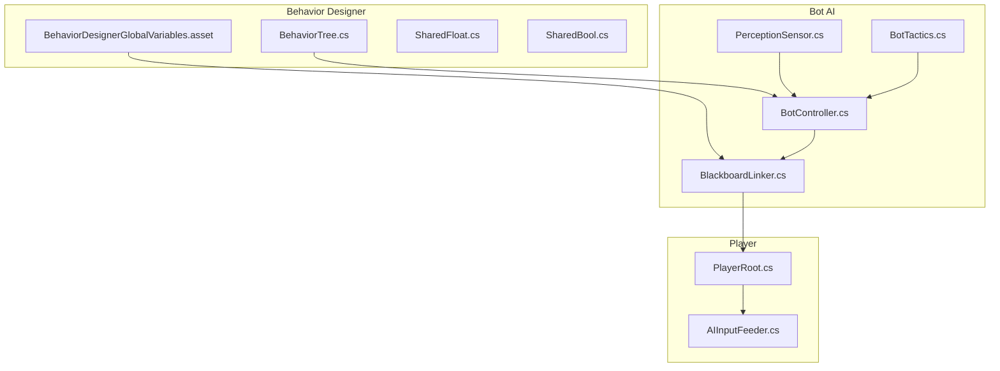
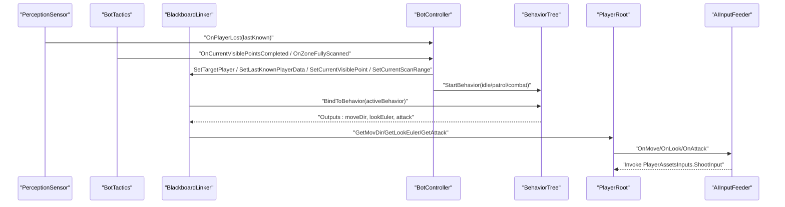
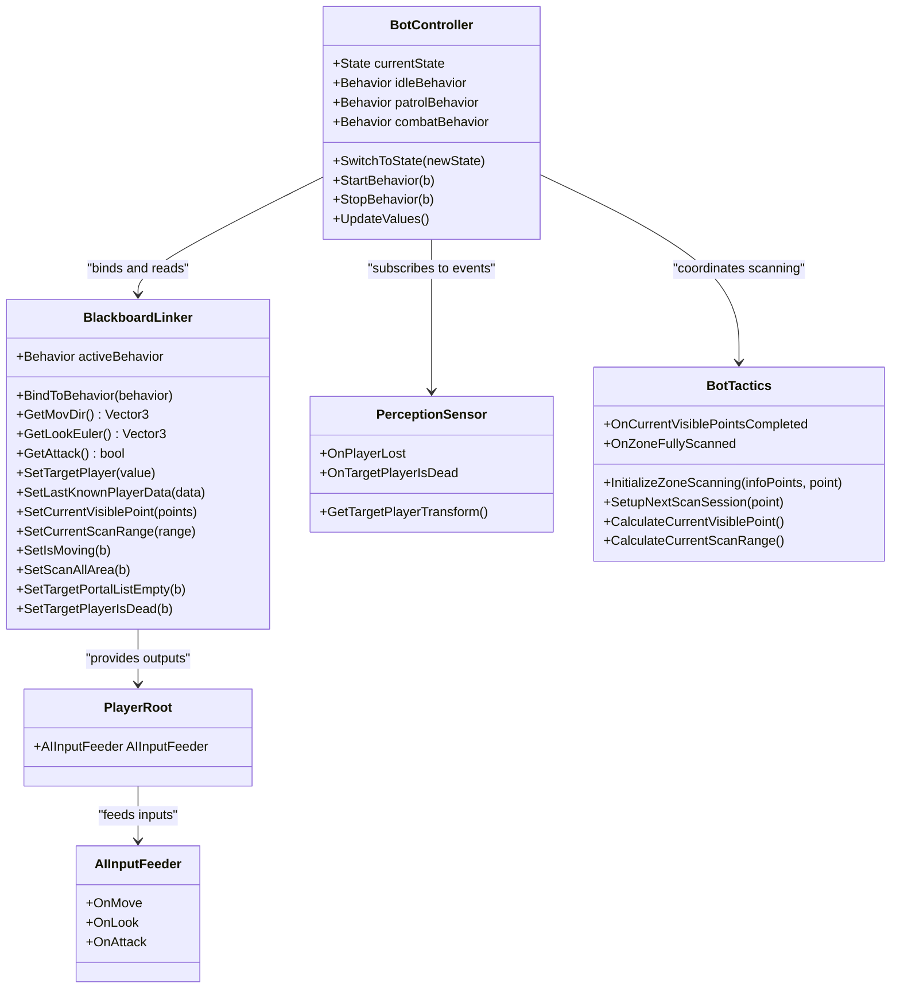
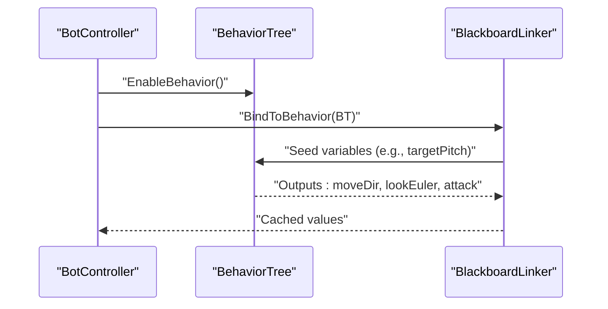
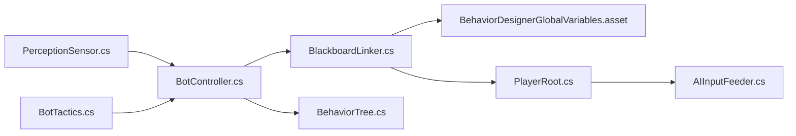

# Behavior Designer Integration

<cite>
**Referenced Files in This Document**
- [BlackboardLinker.cs](file://Assets/FPS-Game/Scripts/Bot/BlackboardLinker.cs)
- [AIInputFeeder.cs](file://Assets/FPS-Game/Scripts/Bot/AIInputFeeder.cs)
- [BotController.cs](file://Assets/FPS-Game/Scripts/Bot/BotController.cs)
- [PerceptionSensor.cs](file://Assets/FPS-Game/Scripts/Bot/PerceptionSensor.cs)
- [BotTactics.cs](file://Assets/FPS-Game/Scripts/Bot/BotTactics.cs)
- [PlayerRoot.cs](file://Assets/FPS-Game/Scripts/Player/PlayerRoot.cs)
- [BehaviorDesignerGlobalVariables.asset](file://Assets/Behavior Designer/Resources/BehaviorDesignerGlobalVariables.asset)
- [SharedFloat.cs](file://Assets/Behavior Designer/Runtime/Variables/SharedFloat.cs)
- [SharedBool.cs](file://Assets/Behavior Designer/Runtime/Variables/SharedBool.cs)
- [BehaviorTree.cs](file://Assets/Behavior Designer/Runtime/BehaviorTree.cs)
- [Idle.cs](file://Assets/Behavior Designer/Runtime/Tasks/Actions/Idle.cs)
- [PerformInterruption.cs](file://Assets/Behavior Designer/Runtime/Tasks/Actions/PerformInterruption.cs)
</cite>

## Table of Contents
1. [Introduction](#introduction)
2. [Project Structure](#project-structure)
3. [Core Components](#core-components)
4. [Architecture Overview](#architecture-overview)
5. [Detailed Component Analysis](#detailed-component-analysis)
6. [Dependency Analysis](#dependency-analysis)
7. [Performance Considerations](#performance-considerations)
8. [Troubleshooting Guide](#troubleshooting-guide)
9. [Conclusion](#conclusion)

## Introduction
This document explains the Behavior Designer integration that connects C# AI logic with Behavior Tree tasks in the game. It focuses on:
- Blackboard linking: synchronizing C# variables with Behavior Designer shared variables, including data type mapping and real-time updates.
- AI input feeding: translating Behavior Tree outputs into player controller inputs (movement, looking, attacking).
- Configuration options: behavior tree parameters, variable synchronization intervals, and input scaling factors.
- Relationships with the bot controller finite-state machine (FSM), perception system, and tactical AI.
- Common issues and troubleshooting strategies for behavior tree debugging and variable binding.

## Project Structure
The integration spans several systems:
- Behavior Designer runtime variables and trees
- Bot controller FSM orchestrating behavior activation
- Blackboard linker bridging BD shared variables and C# state
- Perception sensor and tactical AI supplying situational awareness
- Player root aggregating subsystems and feeding inputs to the player controller

**Diagram sources**
- [BehaviorTree.cs:1-11](file://Assets/Behavior Designer/Runtime/BehaviorTree.cs#L1-L11)
- [BehaviorDesignerGlobalVariables.asset:1-27](file://Assets/Behavior Designer/Resources/BehaviorDesignerGlobalVariables.asset#L1-L27)
- [SharedFloat.cs:1-8](file://Assets/Behavior Designer/Runtime/Variables/SharedFloat.cs#L1-L8)
- [SharedBool.cs:1-8](file://Assets/Behavior Designer/Runtime/Variables/SharedBool.cs#L1-L8)
- [BotController.cs:1-485](file://Assets/FPS-Game/Scripts/Bot/BotController.cs#L1-L485)
- [BlackboardLinker.cs:1-332](file://Assets/FPS-Game/Scripts/Bot/BlackboardLinker.cs#L1-L332)
- [PerceptionSensor.cs:1-407](file://Assets/FPS-Game/Scripts/Bot/PerceptionSensor.cs#L1-L407)
- [BotTactics.cs:1-456](file://Assets/FPS-Game/Scripts/Bot/BotTactics.cs#L1-L456)
- [PlayerRoot.cs:1-366](file://Assets/FPS-Game/Scripts/Player/PlayerRoot.cs#L1-L366)
- [AIInputFeeder.cs:1-29](file://Assets/FPS-Game/Scripts/Bot/AIInputFeeder.cs#L1-L29)

**Section sources**
- [BehaviorTree.cs:1-11](file://Assets/Behavior Designer/Runtime/BehaviorTree.cs#L1-L11)
- [BehaviorDesignerGlobalVariables.asset:1-27](file://Assets/Behavior Designer/Resources/BehaviorDesignerGlobalVariables.asset#L1-L27)
- [BotController.cs:64-110](file://Assets/FPS-Game/Scripts/Bot/BotController.cs#L64-L110)
- [BlackboardLinker.cs:54-113](file://Assets/FPS-Game/Scripts/Bot/BlackboardLinker.cs#L54-L113)
- [PlayerRoot.cs:159-296](file://Assets/FPS-Game/Scripts/Player/PlayerRoot.cs#L159-L296)
- [AIInputFeeder.cs:4-29](file://Assets/FPS-Game/Scripts/Bot/AIInputFeeder.cs#L4-L29)

## Core Components
- BlackboardLinker: binds Behavior Designer behaviors to C# state, seeds global/shared variables, reads outputs, and caches values to reduce redundant writes.
- BotController: orchestrates FSM states, starts/stops behaviors, feeds BD variables with perception and tactics data, and translates outputs to player inputs.
- PerceptionSensor: detects players, tracks last-known positions, raises events for loss-of-sight and death.
- BotTactics: computes scanning ranges, visible tactical points, and zone prediction for area search.
- PlayerRoot: aggregates subsystems and exposes AIInputFeeder for input delivery.
- AIInputFeeder: receives movement, look, and attack signals and invokes the player’s input actions.

**Section sources**
- [BlackboardLinker.cs:54-332](file://Assets/FPS-Game/Scripts/Bot/BlackboardLinker.cs#L54-L332)
- [BotController.cs:61-485](file://Assets/FPS-Game/Scripts/Bot/BotController.cs#L61-L485)
- [PerceptionSensor.cs:10-407](file://Assets/FPS-Game/Scripts/Bot/PerceptionSensor.cs#L10-L407)
- [BotTactics.cs:17-456](file://Assets/FPS-Game/Scripts/Bot/BotTactics.cs#L17-L456)
- [PlayerRoot.cs:159-366](file://Assets/FPS-Game/Scripts/Player/PlayerRoot.cs#L159-L366)
- [AIInputFeeder.cs:4-29](file://Assets/FPS-Game/Scripts/Bot/AIInputFeeder.cs#L4-L29)

## Architecture Overview
The integration follows a data-driven pipeline:
- Perception and tactics feed C# blackboard values to the BlackboardLinker.
- BlackboardLinker seeds Behavior Designer shared/global variables and reads outputs.
- BotController switches behaviors based on FSM state and coordinates synchronization.
- Outputs from Behavior Trees (moveDir, lookEuler, attack) are translated into player inputs via AIInputFeeder.

**Diagram sources**
- [PerceptionSensor.cs:23-107](file://Assets/FPS-Game/Scripts/Bot/PerceptionSensor.cs#L23-L107)
- [BotTactics.cs:52-283](file://Assets/FPS-Game/Scripts/Bot/BotTactics.cs#L52-L283)
- [BlackboardLinker.cs:86-221](file://Assets/FPS-Game/Scripts/Bot/BlackboardLinker.cs#L86-L221)
- [BotController.cs:281-329](file://Assets/FPS-Game/Scripts/Bot/BotController.cs#L281-L329)
- [AIInputFeeder.cs:12-28](file://Assets/FPS-Game/Scripts/Bot/AIInputFeeder.cs#L12-L28)

## Detailed Component Analysis

### Blackboard Linker
Responsibilities:
- Bind active Behavior Designer behavior and seed initial variables.
- Read outputs from Behavior Designer shared variables (e.g., moveDir, lookEuler, attack).
- Provide cached getters for downstream consumers (BotController).
- Safely set shared variables with type-aware comparisons to avoid unnecessary writes.

Key behaviors:
- Binding and seeding: [BindToBehavior:86-113](file://Assets/FPS-Game/Scripts/Bot/BlackboardLinker.cs#L86-L113)
- Reading outputs per behavior: [GetValuesSharedVariables:195-221](file://Assets/FPS-Game/Scripts/Bot/BlackboardLinker.cs#L195-L221)
- Type-aware setter with fallback: [SafeSet:254-329](file://Assets/FPS-Game/Scripts/Bot/BlackboardLinker.cs#L254-L329)
- Public getters for outputs: [GetMovDir/GetLookEuler/GetAttack:115-117](file://Assets/FPS-Game/Scripts/Bot/BlackboardLinker.cs#L115-L117)

Data type mapping:
- SharedBool: [SharedBool.cs:1-8](file://Assets/Behavior Designer/Runtime/Variables/SharedBool.cs#L1-L8)
- SharedFloat: [SharedFloat.cs:1-8](file://Assets/Behavior Designer/Runtime/Variables/SharedFloat.cs#L1-L8)
- SharedVector3 and SharedVector2 are used in the linker for movement and look outputs.
- SharedTransform is used for target camera/player references.

Real-time updates:
- Update loop reads BD outputs and caches them for consumption by BotController.

**Section sources**
- [BlackboardLinker.cs:54-332](file://Assets/FPS-Game/Scripts/Bot/BlackboardLinker.cs#L54-L332)
- [SharedBool.cs:1-8](file://Assets/Behavior Designer/Runtime/Variables/SharedBool.cs#L1-L8)
- [SharedFloat.cs:1-8](file://Assets/Behavior Designer/Runtime/Variables/SharedFloat.cs#L1-L8)

### AI Input Feeder
Responsibilities:
- Receives movement, look, and attack vectors from BlackboardLinker via BotController.
- Invokes the player’s input actions (e.g., shooting) through PlayerAssetsInputs.

Execution flow:
- Subscribes to OnMove/OnLook/OnAttack and stores latest values.
- On attack, triggers the player’s shoot action.

**Section sources**
- [AIInputFeeder.cs:4-29](file://Assets/FPS-Game/Scripts/Bot/AIInputFeeder.cs#L4-L29)
- [BotController.cs:122-171](file://Assets/FPS-Game/Scripts/Bot/BotController.cs#L122-L171)

### Bot Controller FSM and Behavior Coordination
Responsibilities:
- Manages three states: Idle, Patrol, Combat.
- Starts/stops Behavior Designer behaviors and binds them to BlackboardLinker.
- Feeds BD variables with perception and tactics data.
- Translates BD outputs into player inputs.

Behavior switching:
- [SwitchToState:230-275](file://Assets/FPS-Game/Scripts/Bot/BotController.cs#L230-L275)
- [StartBehavior:281-307](file://Assets/FPS-Game/Scripts/Bot/BotController.cs#L281-L307)
- [StopBehavior:313-329](file://Assets/FPS-Game/Scripts/Bot/BotController.cs#L313-L329)

Perception and tactics integration:
- [UpdateValues:122-171](file://Assets/FPS-Game/Scripts/Bot/BotController.cs#L122-L171) publishes look/move/attack to AIInputFeeder.
- [HasReachedInfoPoint:397-402](file://Assets/FPS-Game/Scripts/Bot/BotController.cs#L397-L402) and [CalculateNextTargetInfoPoint:404-414](file://Assets/FPS-Game/Scripts/Bot/BotController.cs#L404-L414) coordinate with BotTactics.
- [HandlePlayerLost:448-474](file://Assets/FPS-Game/Scripts/Bot/BotController.cs#L448-L474) and [OnTargetPlayerIsDead:476-480](file://Assets/FPS-Game/Scripts/Bot/BotController.cs#L476-L480) react to PerceptionSensor events.

**Section sources**
- [BotController.cs:61-485](file://Assets/FPS-Game/Scripts/Bot/BotController.cs#L61-L485)

### Perception Sensor and Tactical AI
PerceptionSensor:
- Detects players within FOV/range, handles raycast occlusion, and emits OnPlayerLost with last-known position.
- Maintains last known position data and supports area scanning coordination.

BotTactics:
- Computes scan ranges, visible tactical points, and predicts suspicious zones.
- Emits completion events to signal next steps in patrol/search.

Integration points:
- PerceptionSensor events consumed by BotController.
- BotTactics events consumed by BotController to drive behavior transitions and variable updates.

**Section sources**
- [PerceptionSensor.cs:10-407](file://Assets/FPS-Game/Scripts/Bot/PerceptionSensor.cs#L10-L407)
- [BotTactics.cs:17-456](file://Assets/FPS-Game/Scripts/Bot/BotTactics.cs#L17-L456)
- [BotController.cs:101-110](file://Assets/FPS-Game/Scripts/Bot/BotController.cs#L101-L110)
- [BotController.cs:434-482](file://Assets/FPS-Game/Scripts/Bot/BotController.cs#L434-L482)

### Player Root and Input Delivery
PlayerRoot:
- Aggregates subsystems and exposes AIInputFeeder for input delivery.
- Provides camera and zone context used by BlackboardLinker and PerceptionSensor.

**Section sources**
- [PlayerRoot.cs:159-366](file://Assets/FPS-Game/Scripts/Player/PlayerRoot.cs#L159-L366)

### Behavior Trees and Tasks
BehaviorTree wrapper:
- [BehaviorTree.cs:1-11](file://Assets/Behavior Designer/Runtime/BehaviorTree.cs#L1-L11)

Example tasks:
- Idle task returning Running status: [Idle.cs:1-14](file://Assets/Behavior Designer/Runtime/Tasks/Actions/Idle.cs#L1-L14)
- Interruption task performing immediate task interruptions: [PerformInterruption.cs:1-28](file://Assets/Behavior Designer/Runtime/Tasks/Actions/PerformInterruption.cs#L1-L28)

These tasks are executed by Behavior Designer during runtime and produce outputs synchronized via BlackboardLinker.

**Section sources**
- [BehaviorTree.cs:1-11](file://Assets/Behavior Designer/Runtime/BehaviorTree.cs#L1-L11)
- [Idle.cs:1-14](file://Assets/Behavior Designer/Runtime/Tasks/Actions/Idle.cs#L1-L14)
- [PerformInterruption.cs:1-28](file://Assets/Behavior Designer/Runtime/Tasks/Actions/PerformInterruption.cs#L1-L28)

## Architecture Overview

**Diagram sources**
- [BotController.cs:61-485](file://Assets/FPS-Game/Scripts/Bot/BotController.cs#L61-L485)
- [BlackboardLinker.cs:54-332](file://Assets/FPS-Game/Scripts/Bot/BlackboardLinker.cs#L54-L332)
- [PerceptionSensor.cs:10-407](file://Assets/FPS-Game/Scripts/Bot/PerceptionSensor.cs#L10-L407)
- [BotTactics.cs:17-456](file://Assets/FPS-Game/Scripts/Bot/BotTactics.cs#L17-L456)
- [PlayerRoot.cs:159-366](file://Assets/FPS-Game/Scripts/Player/PlayerRoot.cs#L159-L366)
- [AIInputFeeder.cs:4-29](file://Assets/FPS-Game/Scripts/Bot/AIInputFeeder.cs#L4-L29)

## Detailed Component Analysis

### Blackboard Variable Setup and Synchronization
- Global variables asset defines shared variables used across trees (e.g., targetCamera, lookEuler, attack): [BehaviorDesignerGlobalVariables.asset:15-26](file://Assets/Behavior Designer/Resources/BehaviorDesignerGlobalVariables.asset#L15-L26).
- BotController seeds the global camera target at startup: [GlobalVariables.Instance.SetVariable(...):96-99](file://Assets/FPS-Game/Scripts/Bot/BotController.cs#L96-L99).
- BlackboardLinker binds to the active behavior and seeds behavior-specific variables (e.g., targetPitch for IdleTree): [BindToBehavior:86-113](file://Assets/FPS-Game/Scripts/Bot/BlackboardLinker.cs#L86-L113).
- Real-time synchronization occurs in [GetValuesSharedVariables:195-221](file://Assets/FPS-Game/Scripts/Bot/BlackboardLinker.cs#L195-L221), reading lookEuler, moveDir, and attack per behavior.

Data type mapping:
- SharedBool for attack flag: [SharedBool.cs:1-8](file://Assets/Behavior Designer/Runtime/Variables/SharedBool.cs#L1-L8)
- SharedFloat for scalar values: [SharedFloat.cs:1-8](file://Assets/Behavior Designer/Runtime/Variables/SharedFloat.cs#L1-L8)
- SharedVector3 for movement and Euler look: used in [GetValuesSharedVariables:202-216](file://Assets/FPS-Game/Scripts/Bot/BlackboardLinker.cs#L202-L216)

**Section sources**
- [BehaviorDesignerGlobalVariables.asset:15-26](file://Assets/Behavior Designer/Resources/BehaviorDesignerGlobalVariables.asset#L15-L26)
- [BotController.cs:96-99](file://Assets/FPS-Game/Scripts/Bot/BotController.cs#L96-L99)
- [BlackboardLinker.cs:86-113](file://Assets/FPS-Game/Scripts/Bot/BlackboardLinker.cs#L86-L113)
- [BlackboardLinker.cs:195-221](file://Assets/FPS-Game/Scripts/Bot/BlackboardLinker.cs#L195-L221)
- [SharedBool.cs:1-8](file://Assets/Behavior Designer/Runtime/Variables/SharedBool.cs#L1-L8)
- [SharedFloat.cs:1-8](file://Assets/Behavior Designer/Runtime/Variables/SharedFloat.cs#L1-L8)

### Behavior Tree Execution Flow
- BotController selects and starts a BehaviorTree component per state: [StartBehavior:281-307](file://Assets/FPS-Game/Scripts/Bot/BotController.cs#L281-L307).
- BlackboardLinker binds to the active behavior to seed and read variables: [BindToBehavior:86-113](file://Assets/FPS-Game/Scripts/Bot/BlackboardLinker.cs#L86-L113).
- Example tasks include Idle returning Running and PerformInterruption for task control: [Idle.cs:1-14](file://Assets/Behavior Designer/Runtime/Tasks/Actions/Idle.cs#L1-L14), [PerformInterruption.cs:1-28](file://Assets/Behavior Designer/Runtime/Tasks/Actions/PerformInterruption.cs#L1-L28).

**Diagram sources**
- [BotController.cs:281-307](file://Assets/FPS-Game/Scripts/Bot/BotController.cs#L281-L307)
- [BlackboardLinker.cs:86-113](file://Assets/FPS-Game/Scripts/Bot/BlackboardLinker.cs#L86-L113)
- [Idle.cs:9-12](file://Assets/Behavior Designer/Runtime/Tasks/Actions/Idle.cs#L9-L12)
- [PerformInterruption.cs:12-18](file://Assets/Behavior Designer/Runtime/Tasks/Actions/PerformInterruption.cs#L12-L18)

### AI Input Translation Mechanism
- BotController translates BD outputs to player inputs:
  - Idle: publishes look updates: [UpdateValues:126-128](file://Assets/FPS-Game/Scripts/Bot/BotController.cs#L126-L128)
  - Patrol: publishes look and move: [UpdateValues:130-133](file://Assets/FPS-Game/Scripts/Bot/BotController.cs#L130-L133)
  - Combat: publishes look, move, and attack: [UpdateValues:142-145](file://Assets/FPS-Game/Scripts/Bot/BotController.cs#L142-L145)
- AIInputFeeder receives and applies inputs: [AIInputFeeder.cs:12-28](file://Assets/FPS-Game/Scripts/Bot/AIInputFeeder.cs#L12-L28)

**Section sources**
- [BotController.cs:122-171](file://Assets/FPS-Game/Scripts/Bot/BotController.cs#L122-L171)
- [AIInputFeeder.cs:12-28](file://Assets/FPS-Game/Scripts/Bot/AIInputFeeder.cs#L12-L28)

### Configuration Options
- Behavior Designer global variables:
  - Define shared variables (e.g., targetCamera, lookEuler, attack) in the asset: [BehaviorDesignerGlobalVariables.asset:15-26](file://Assets/Behavior Designer/Resources/BehaviorDesignerGlobalVariables.asset#L15-L26)
- BlackboardLinker:
  - Reads outputs every frame in [Update:190-193](file://Assets/FPS-Game/Scripts/Bot/BlackboardLinker.cs#L190-L193) and [GetValuesSharedVariables:195-221](file://Assets/FPS-Game/Scripts/Bot/BlackboardLinker.cs#L195-L221)
  - Uses type-aware setters to minimize redundant writes in [SafeSet:254-329](file://Assets/FPS-Game/Scripts/Bot/BlackboardLinker.cs#L254-L329)
- BotController:
  - Close-distance threshold for patrol waypoint arrival: [closeDistance](file://Assets/FPS-Game/Scripts/Bot/BotController.cs#L76)
  - State transitions and behavior selection: [SwitchToState:230-275](file://Assets/FPS-Game/Scripts/Bot/BotController.cs#L230-L275)
- PerceptionSensor:
  - Detection parameters (range, FOV, obstacles): [viewDistance, obstacleMask:19-21](file://Assets/FPS-Game/Scripts/Bot/PerceptionSensor.cs#L19-L21)
- BotTactics:
  - Search radius and scan range computation: [searchRadius](file://Assets/FPS-Game/Scripts/Bot/BotTactics.cs#L20)

Note: There are no explicit configurable intervals or scaling factors exposed in the linked files. Adjustments can be made by editing the code paths noted above.

**Section sources**
- [BehaviorDesignerGlobalVariables.asset:15-26](file://Assets/Behavior Designer/Resources/BehaviorDesignerGlobalVariables.asset#L15-L26)
- [BlackboardLinker.cs:190-221](file://Assets/FPS-Game/Scripts/Bot/BlackboardLinker.cs#L190-L221)
- [BlackboardLinker.cs:254-329](file://Assets/FPS-Game/Scripts/Bot/BlackboardLinker.cs#L254-L329)
- [BotController.cs:76](file://Assets/FPS-Game/Scripts/Bot/BotController.cs#L76)
- [BotController.cs:230-275](file://Assets/FPS-Game/Scripts/Bot/BotController.cs#L230-L275)
- [PerceptionSensor.cs:19-21](file://Assets/FPS-Game/Scripts/Bot/PerceptionSensor.cs#L19-L21)
- [BotTactics.cs:20](file://Assets/FPS-Game/Scripts/Bot/BotTactics.cs#L20)

## Dependency Analysis

**Diagram sources**
- [PerceptionSensor.cs:10-407](file://Assets/FPS-Game/Scripts/Bot/PerceptionSensor.cs#L10-L407)
- [BotTactics.cs:17-456](file://Assets/FPS-Game/Scripts/Bot/BotTactics.cs#L17-L456)
- [BotController.cs:61-485](file://Assets/FPS-Game/Scripts/Bot/BotController.cs#L61-L485)
- [BlackboardLinker.cs:54-332](file://Assets/FPS-Game/Scripts/Bot/BlackboardLinker.cs#L54-L332)
- [BehaviorDesignerGlobalVariables.asset:1-27](file://Assets/Behavior Designer/Resources/BehaviorDesignerGlobalVariables.asset#L1-L27)
- [BehaviorTree.cs:1-11](file://Assets/Behavior Designer/Runtime/BehaviorTree.cs#L1-L11)
- [PlayerRoot.cs:159-366](file://Assets/FPS-Game/Scripts/Player/PlayerRoot.cs#L159-L366)
- [AIInputFeeder.cs:4-29](file://Assets/FPS-Game/Scripts/Bot/AIInputFeeder.cs#L4-L29)

**Section sources**
- [BotController.cs:61-485](file://Assets/FPS-Game/Scripts/Bot/BotController.cs#L61-L485)
- [BlackboardLinker.cs:54-332](file://Assets/FPS-Game/Scripts/Bot/BlackboardLinker.cs#L54-L332)
- [PerceptionSensor.cs:10-407](file://Assets/FPS-Game/Scripts/Bot/PerceptionSensor.cs#L10-L407)
- [BotTactics.cs:17-456](file://Assets/FPS-Game/Scripts/Bot/BotTactics.cs#L17-L456)
- [PlayerRoot.cs:159-366](file://Assets/FPS-Game/Scripts/Player/PlayerRoot.cs#L159-L366)
- [AIInputFeeder.cs:4-29](file://Assets/FPS-Game/Scripts/Bot/AIInputFeeder.cs#L4-L29)

## Performance Considerations
- Minimize redundant writes: BlackboardLinker’s SafeSet compares values before assignment to avoid unnecessary updates.
- Frame-rate dependent updates: BlackboardLinker reads outputs every frame; ensure behavior outputs change infrequently to reduce overhead.
- Event-driven updates: Use PerceptionSensor and BotTactics events to trigger variable updates rather than polling continuously.
- Avoid excessive BD variable churn: Keep the number of shared variables minimal and reuse them across tasks.

[No sources needed since this section provides general guidance]

## Troubleshooting Guide

Common issues and resolutions:
- Variable synchronization conflicts
  - Symptom: Outputs not updating or stale values.
  - Checks:
    - Ensure active behavior is bound via [BindToBehavior:86-113](file://Assets/FPS-Game/Scripts/Bot/BlackboardLinker.cs#L86-L113).
    - Verify behavior name matches cases in [GetValuesSharedVariables:195-221](file://Assets/FPS-Game/Scripts/Bot/BlackboardLinker.cs#L195-L221).
    - Confirm shared variables exist in the Behavior Designer tree and match types (e.g., SharedBool for attack).
  - Related code paths:
    - [BehaviorDesignerGlobalVariables.asset:15-26](file://Assets/Behavior Designer/Resources/BehaviorDesignerGlobalVariables.asset#L15-L26)
    - [SharedBool.cs:1-8](file://Assets/Behavior Designer/Runtime/Variables/SharedBool.cs#L1-L8)

- Behavior tree performance bottlenecks
  - Symptom: Slow frame times during behavior execution.
  - Checks:
    - Reduce frequency of BD variable reads/writes by caching values (already handled in [GetValuesSharedVariables:195-221](file://Assets/FPS-Game/Scripts/Bot/BlackboardLinker.cs#L195-L221)).
    - Simplify tasks and avoid heavy computations inside OnUpdate.
  - Related code paths:
    - [BehaviorTree.cs:1-11](file://Assets/Behavior Designer/Runtime/BehaviorTree.cs#L1-L11)
    - [Idle.cs:1-14](file://Assets/Behavior Designer/Runtime/Tasks/Actions/Idle.cs#L1-L14)

- Input lag problems
  - Symptom: Delay between behavior outputs and player movement/looking.
  - Checks:
    - Confirm BotController publishes outputs in [UpdateValues:122-171](file://Assets/FPS-Game/Scripts/Bot/BotController.cs#L122-L171).
    - Ensure AIInputFeeder receives and applies inputs in [AIInputFeeder.cs:12-28](file://Assets/FPS-Game/Scripts/Bot/AIInputFeeder.cs#L12-L28).
  - Related code paths:
    - [PlayerRoot.cs:159-366](file://Assets/FPS-Game/Scripts/Player/PlayerRoot.cs#L159-L366)

- Behavior tree debugging
  - Use BD logging and task status inspection to verify task execution order.
  - Validate that [StartBehavior:281-307](file://Assets/FPS-Game/Scripts/Bot/BotController.cs#L281-L307) enables and runs the intended behavior.
  - Confirm that [BindToBehavior:86-113](file://Assets/FPS-Game/Scripts/Bot/BlackboardLinker.cs#L86-L113) seeds variables before execution.

**Section sources**
- [BlackboardLinker.cs:86-113](file://Assets/FPS-Game/Scripts/Bot/BlackboardLinker.cs#L86-L113)
- [BlackboardLinker.cs:195-221](file://Assets/FPS-Game/Scripts/Bot/BlackboardLinker.cs#L195-L221)
- [BehaviorDesignerGlobalVariables.asset:15-26](file://Assets/Behavior Designer/Resources/BehaviorDesignerGlobalVariables.asset#L15-L26)
- [SharedBool.cs:1-8](file://Assets/Behavior Designer/Runtime/Variables/SharedBool.cs#L1-L8)
- [BehaviorTree.cs:1-11](file://Assets/Behavior Designer/Runtime/BehaviorTree.cs#L1-L11)
- [Idle.cs:1-14](file://Assets/Behavior Designer/Runtime/Tasks/Actions/Idle.cs#L1-L14)
- [BotController.cs:122-171](file://Assets/FPS-Game/Scripts/Bot/BotController.cs#L122-L171)
- [AIInputFeeder.cs:12-28](file://Assets/FPS-Game/Scripts/Bot/AIInputFeeder.cs#L12-L28)
- [PlayerRoot.cs:159-366](file://Assets/FPS-Game/Scripts/Player/PlayerRoot.cs#L159-L366)

## Conclusion
The Behavior Designer integration couples C# AI logic with Behavior Tree tasks through a robust blackboard-linking mechanism. BlackboardLinker synchronizes shared/global variables and reads outputs efficiently, while BotController orchestrates behavior activation and translates outputs into player inputs via AIInputFeeder. PerceptionSensor and BotTactics supply essential situational awareness. By leveraging type-safe variable mapping, event-driven updates, and careful caching, the system achieves responsive and maintainable AI behavior.

[No sources needed since this section summarizes without analyzing specific files]