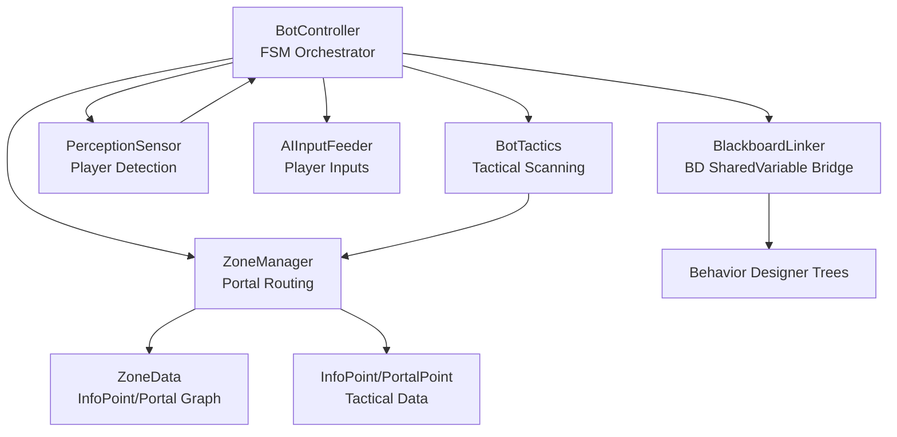
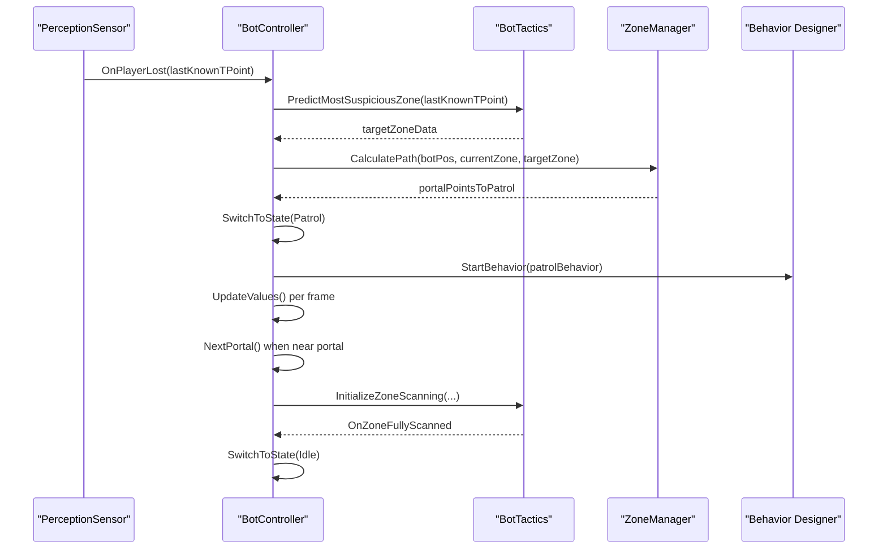
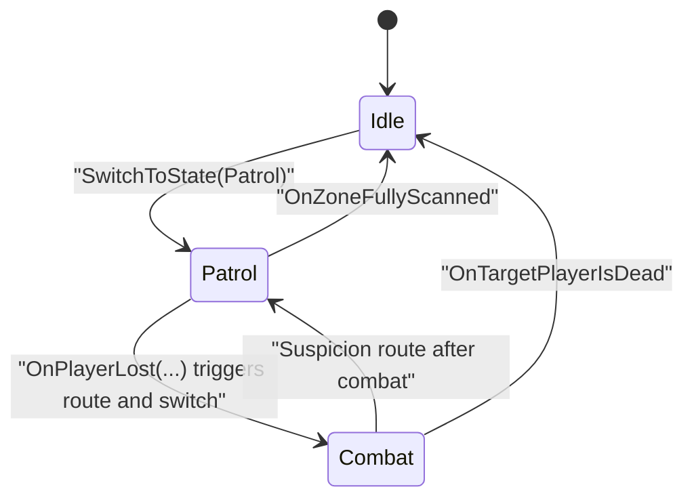
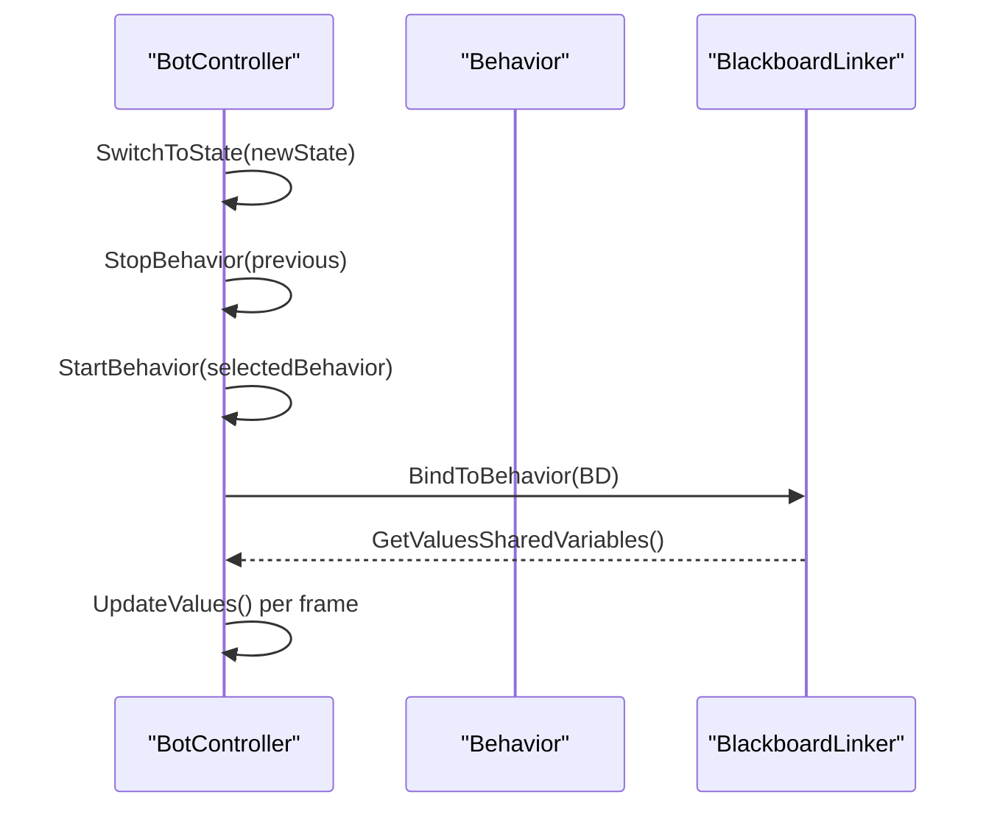
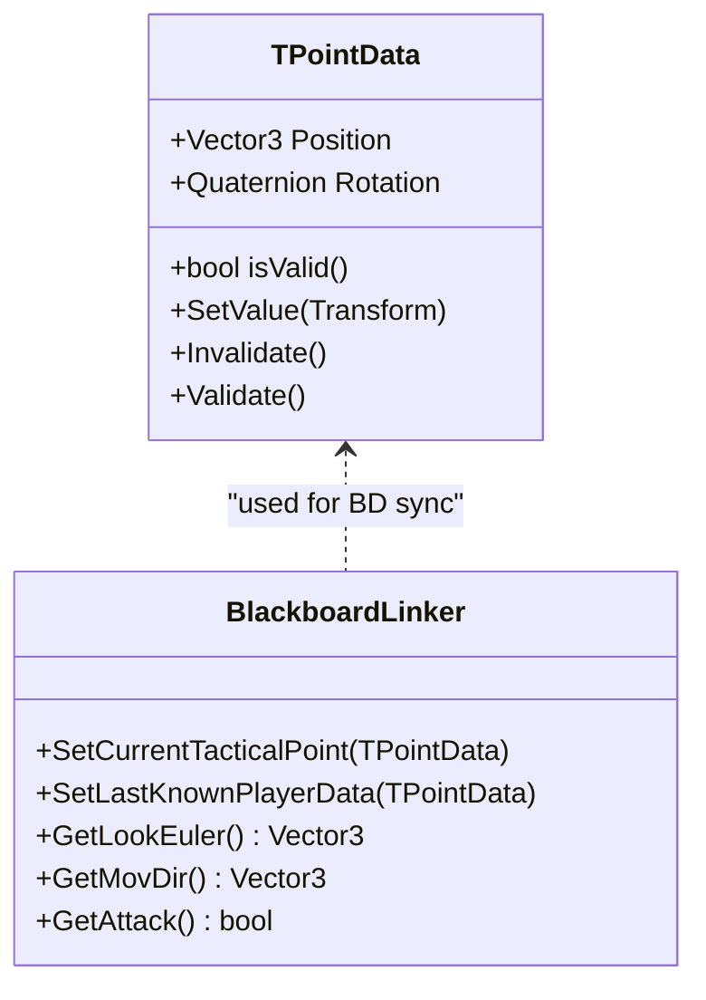
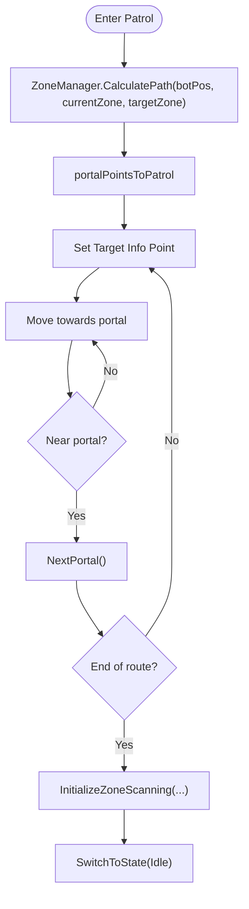
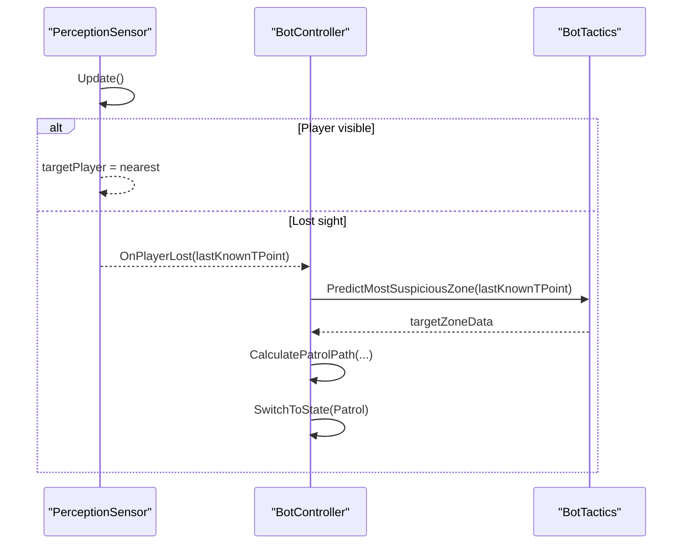
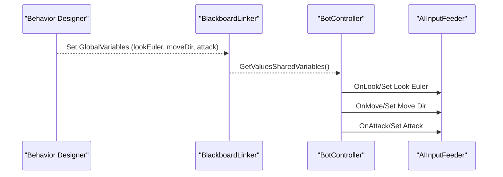
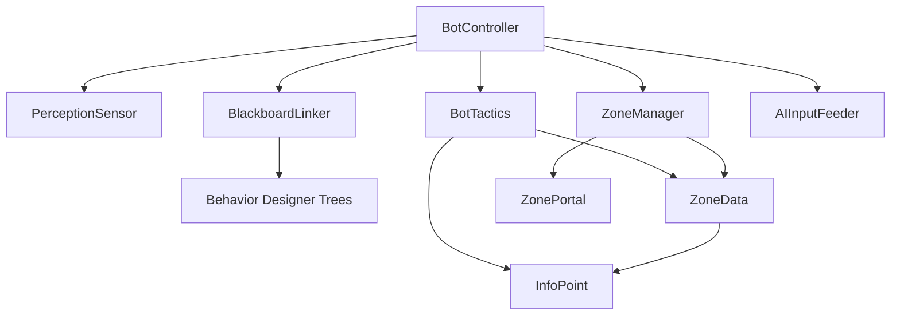
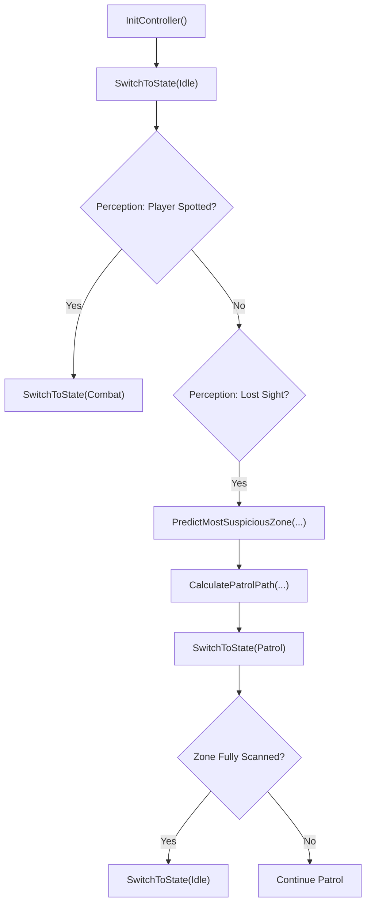

# Bot Controller & Finite State Machine

<cite>
**Referenced Files in This Document**
- [BotController.cs](file://Assets/FPS-Game/Scripts/Bot/BotController.cs)
- [FSMState.cs](file://Assets/FPS-Game/Scripts/Bot/FSMState.cs)
- [BlackboardLinker.cs](file://Assets/FPS-Game/Scripts/Bot/BlackboardLinker.cs)
- [PerceptionSensor.cs](file://Assets/FPS-Game/Scripts/Bot/PerceptionSensor.cs)
- [AIInputFeeder.cs](file://Assets/FPS-Game/Scripts/Bot/AIInputFeeder.cs)
- [BotTactics.cs](file://Assets/FPS-Game/Scripts/Bot/BotTactics.cs)
- [WaypointPath.cs](file://Assets/FPS-Game/Scripts/Bot/WaypointPath.cs)
- [ZoneData.cs](file://Assets/FPS-Game/Scripts/TacticalAI/Data/ZoneData.cs)
- [InfoPoint.cs](file://Assets/FPS-Game/Scripts/TacticalAI/Data/InfoPoint.cs)
- [ZonePortal.cs](file://Assets/FPS-Game/Scripts/System/ZonePortal.cs)
- [ZoneManager.cs](file://Assets/FPS-Game/Scripts/TacticalAI/Core/ZoneManager.cs)
</cite>

## Table of Contents
1. [Introduction](#introduction)
2. [Project Structure](#project-structure)
3. [Core Components](#core-components)
4. [Architecture Overview](#architecture-overview)
5. [Detailed Component Analysis](#detailed-component-analysis)
6. [Dependency Analysis](#dependency-analysis)
7. [Performance Considerations](#performance-considerations)
8. [Troubleshooting Guide](#troubleshooting-guide)
9. [Conclusion](#conclusion)
10. [Appendices](#appendices)

## Introduction
This document explains the bot controller finite state machine (FSM) that orchestrates AI behavior for bots in the game. It covers the three-state architecture (Idle, Patrol, Combat), state transitions, behavior activation/deactivation, and runtime state management. It documents the TPointData structure for tactical point handling, portal-based patrol routing, and state-specific behavior execution. It also describes configuration parameters, integration with perception sensors, blackboard linking, and tactical AI systems, along with practical examples from the codebase and guidance for common issues and performance optimization.

## Project Structure
The bot AI system is composed of several interconnected components:
- BotController: Central FSM orchestrator that manages states, behavior activation, and runtime updates.
- BlackboardLinker: Bridges C# runtime values to Behavior Designer shared variables.
- PerceptionSensor: Detects players, tracks last-known positions, and raises events for state transitions.
- AIInputFeeder: Receives state-driven inputs and feeds them into the player movement/shooting pipeline.
- BotTactics: Tactical scanning and scanning range calculation for area coverage during search.
- Tactical AI data and managers: ZoneData, InfoPoint, ZonePortal, and ZoneManager for portal routing and zone graph navigation.

**Diagram sources**
- [BotController.cs:62-485](file://Assets/FPS-Game/Scripts/Bot/BotController.cs#L62-L485)
- [BlackboardLinker.cs:54-332](file://Assets/FPS-Game/Scripts/Bot/BlackboardLinker.cs#L54-L332)
- [PerceptionSensor.cs:10-407](file://Assets/FPS-Game/Scripts/Bot/PerceptionSensor.cs#L10-L407)
- [AIInputFeeder.cs:4-29](file://Assets/FPS-Game/Scripts/Bot/AIInputFeeder.cs#L4-L29)
- [BotTactics.cs:17-456](file://Assets/FPS-Game/Scripts/Bot/BotTactics.cs#L17-L456)
- [ZoneManager.cs:9-841](file://Assets/FPS-Game/Scripts/TacticalAI/Core/ZoneManager.cs#L9-L841)
- [ZoneData.cs:30-122](file://Assets/FPS-Game/Scripts/TacticalAI/Data/ZoneData.cs#L30-L122)
- [InfoPoint.cs:8-40](file://Assets/FPS-Game/Scripts/TacticalAI/Data/InfoPoint.cs#L8-L40)

**Section sources**
- [BotController.cs:62-485](file://Assets/FPS-Game/Scripts/Bot/BotController.cs#L62-L485)
- [BlackboardLinker.cs:54-332](file://Assets/FPS-Game/Scripts/Bot/BlackboardLinker.cs#L54-L332)
- [PerceptionSensor.cs:10-407](file://Assets/FPS-Game/Scripts/Bot/PerceptionSensor.cs#L10-L407)
- [AIInputFeeder.cs:4-29](file://Assets/FPS-Game/Scripts/Bot/AIInputFeeder.cs#L4-L29)
- [BotTactics.cs:17-456](file://Assets/FPS-Game/Scripts/Bot/BotTactics.cs#L17-L456)
- [ZoneManager.cs:9-841](file://Assets/FPS-Game/Scripts/TacticalAI/Core/ZoneManager.cs#L9-L841)
- [ZoneData.cs:30-122](file://Assets/FPS-Game/Scripts/TacticalAI/Data/ZoneData.cs#L30-L122)
- [InfoPoint.cs:8-40](file://Assets/FPS-Game/Scripts/TacticalAI/Data/InfoPoint.cs#L8-L40)

## Core Components
- State enumeration and runtime state:
  - State enum defines Idle, Patrol, and Combat.
  - Runtime state is tracked in BotController and managed via SwitchToState.
- Behavior Designer integration:
  - BotController holds references to idle, patrol, and combat Behavior assets.
  - StartBehavior/StopBehavior activate/deactivate behaviors and bind BlackboardLinker to BD shared variables.
- Perception and state transitions:
  - PerceptionSensor detects player presence and emits OnPlayerLost with last-known TPointData.
  - BotController reacts to perception events to switch states and update patrol routes.
- AI input feeding:
  - AIInputFeeder receives state-driven vectors and triggers shooting actions.
- Tactical AI and portal routing:
  - ZoneManager computes portal-based patrol routes between zones.
  - BotTactics calculates scanning ranges and visible points for area coverage.

**Section sources**
- [BotController.cs:7-13, 82-87, 230-275, 281-329:7-13](file://Assets/FPS-Game/Scripts/Bot/BotController.cs#L7-L13)
- [BotController.cs:64-67, 281-329:64-67](file://Assets/FPS-Game/Scripts/Bot/BotController.cs#L64-L67)
- [PerceptionSensor.cs:23-25, 448-482:23-25](file://Assets/FPS-Game/Scripts/Bot/PerceptionSensor.cs#L23-L25)
- [AIInputFeeder.cs:4-29](file://Assets/FPS-Game/Scripts/Bot/AIInputFeeder.cs#L4-L29)
- [ZoneManager.cs:389-440](file://Assets/FPS-Game/Scripts/TacticalAI/Core/ZoneManager.cs#L389-L440)
- [BotTactics.cs:70-92, 114-123, 198-237:70-92](file://Assets/FPS-Game/Scripts/Bot/BotTactics.cs#L70-L92)

## Architecture Overview
The bot controller operates as a layered system:
- Perception layer detects targets and maintains last-known positions.
- Tactical layer computes likely zones and scanning ranges.
- FSM layer decides Idle/Patrol/Combat and activates appropriate Behavior Designer trees.
- BlackboardLinker synchronizes runtime values to BD shared variables.
- AIInputFeeder translates BD outputs into player actions.

**Diagram sources**
- [PerceptionSensor.cs:448-482](file://Assets/FPS-Game/Scripts/Bot/PerceptionSensor.cs#L448-L482)
- [BotController.cs:254-271, 331-354, 356-379:254-271](file://Assets/FPS-Game/Scripts/Bot/BotController.cs#L254-L271)
- [BotTactics.cs:198-237, 70-92:198-237](file://Assets/FPS-Game/Scripts/Bot/BotTactics.cs#L198-L237)
- [ZoneManager.cs:389-440](file://Assets/FPS-Game/Scripts/TacticalAI/Core/ZoneManager.cs#L389-L440)

## Detailed Component Analysis

### Three-State Architecture and Transitions
- Idle:
  - Initializes with no target and disables movement/attack.
  - Enters when switching from other states or at startup.
- Patrol:
  - Computes a portal-based route to a target zone.
  - Sets moving flag and target info point; advances to next portal upon arrival.
  - Starts scanning process at the end of the route.
- Combat:
  - Activates combat behavior and sets target player dead flag when applicable.
  - Feeds look/move/attack inputs to AIInputFeeder.

State transitions are driven by:
- Explicit state switching via OnSwitchState and SwitchToState.
- Perception events (OnPlayerLost) to trigger suspicion-based patrol routing.
- Tactical scanning completion events to return to Idle.

**Diagram sources**
- [BotController.cs:207-224, 230-275, 448-482:207-224](file://Assets/FPS-Game/Scripts/Bot/BotController.cs#L207-L224)
- [PerceptionSensor.cs:23-25, 448-482:23-25](file://Assets/FPS-Game/Scripts/Bot/PerceptionSensor.cs#L23-L25)
- [BotTactics.cs:52-53, 254-263:52-53](file://Assets/FPS-Game/Scripts/Bot/BotTactics.cs#L52-L53)

**Section sources**
- [BotController.cs:207-224, 230-275, 448-482:207-224](file://Assets/FPS-Game/Scripts/Bot/BotController.cs#L207-L224)
- [PerceptionSensor.cs:23-25, 448-482:23-25](file://Assets/FPS-Game/Scripts/Bot/PerceptionSensor.cs#L23-L25)
- [BotTactics.cs:52-53, 254-263:52-53](file://Assets/FPS-Game/Scripts/Bot/BotTactics.cs#L52-L53)

### Behavior Activation/Deactivation and Blackboard Linking
- StartBehavior:
  - Ensures the Behavior component is enabled and started.
  - Binds BlackboardLinker to synchronize BD shared variables.
- StopBehavior:
  - Safely disables behavior and optionally disables the component to prevent accidental restart.
- BlackboardLinker:
  - Seeds initial BD variables per behavior type.
  - Reads BD outputs (look/move/attack) and exposes them to BotController.
  - Updates global variables for target camera and tactical points.

**Diagram sources**
- [BotController.cs:281-329](file://Assets/FPS-Game/Scripts/Bot/BotController.cs#L281-L329)
- [BlackboardLinker.cs:86-113, 190-221:86-113](file://Assets/FPS-Game/Scripts/Bot/BlackboardLinker.cs#L86-L113)

**Section sources**
- [BotController.cs:281-329](file://Assets/FPS-Game/Scripts/Bot/BotController.cs#L281-L329)
- [BlackboardLinker.cs:86-113, 190-221:86-113](file://Assets/FPS-Game/Scripts/Bot/BlackboardLinker.cs#L86-L113)

### TPointData and Tactical Point Handling
- TPointData encapsulates a valid tactical point with position, rotation, and validity flag.
- Used to represent last-known player positions and scanned tactical points.
- BlackboardLinker exposes SetCurrentTacticalPoint and SetLastKnownPlayerData to BD.

**Diagram sources**
- [BotController.cs:16-57](file://Assets/FPS-Game/Scripts/Bot/BotController.cs#L16-L57)
- [BlackboardLinker.cs:128-137](file://Assets/FPS-Game/Scripts/Bot/BlackboardLinker.cs#L128-L137)

**Section sources**
- [BotController.cs:16-57](file://Assets/FPS-Game/Scripts/Bot/BotController.cs#L16-L57)
- [BlackboardLinker.cs:128-137](file://Assets/FPS-Game/Scripts/Bot/BlackboardLinker.cs#L128-L137)

### Portal-Based Patrol Routing
- ZoneManager calculates a shortest portal path between zones using a graph of portal connections.
- BotController requests a route from ZoneManager and sets the first portal as the target.
- As the bot reaches each portal, NextPortal advances the patrol list until the end, then initiates scanning.

**Diagram sources**
- [ZoneManager.cs:389-440](file://Assets/FPS-Game/Scripts/TacticalAI/Core/ZoneManager.cs#L389-L440)
- [BotController.cs:331-354, 342-354:331-354](file://Assets/FPS-Game/Scripts/Bot/BotController.cs#L331-L354)
- [BotTactics.cs:70-92](file://Assets/FPS-Game/Scripts/Bot/BotTactics.cs#L70-L92)

**Section sources**
- [ZoneManager.cs:389-440](file://Assets/FPS-Game/Scripts/TacticalAI/Core/ZoneManager.cs#L389-L440)
- [BotController.cs:331-354, 342-354:331-354](file://Assets/FPS-Game/Scripts/Bot/BotController.cs#L331-L354)
- [BotTactics.cs:70-92](file://Assets/FPS-Game/Scripts/Bot/BotTactics.cs#L70-L92)

### Perception Integration and Suspicion Handling
- PerceptionSensor checks field-of-view and obstacles to detect players.
- On loss of sight, emits OnPlayerLost with TPointData representing last-known position.
- BotController uses this to compute a suspicious zone, recalculate patrol route, and enter Patrol.

**Diagram sources**
- [PerceptionSensor.cs:64-107](file://Assets/FPS-Game/Scripts/Bot/PerceptionSensor.cs#L64-L107)
- [PerceptionSensor.cs:448-482](file://Assets/FPS-Game/Scripts/Bot/PerceptionSensor.cs#L448-L482)
- [BotController.cs:448-474, 254-271:448-474](file://Assets/FPS-Game/Scripts/Bot/BotController.cs#L448-L474)

**Section sources**
- [PerceptionSensor.cs:64-107, 448-482:64-107](file://Assets/FPS-Game/Scripts/Bot/PerceptionSensor.cs#L64-L107)
- [BotController.cs:448-474, 254-271:448-474](file://Assets/FPS-Game/Scripts/Bot/BotController.cs#L448-L474)

### AI Input Feeding and Behavior Tree Integration
- AIInputFeeder exposes OnMove, OnLook, OnAttack events consumed by BD trees.
- BlackboardLinker reads BD outputs (lookEuler, moveDir, attack) and exposes them to BotController.
- BotController writes these values to AIInputFeeder during each state’s update loop.

**Diagram sources**
- [BlackboardLinker.cs:190-221](file://Assets/FPS-Game/Scripts/Bot/BlackboardLinker.cs#L190-L221)
- [BotController.cs:122-171](file://Assets/FPS-Game/Scripts/Bot/BotController.cs#L122-L171)
- [AIInputFeeder.cs:4-29](file://Assets/FPS-Game/Scripts/Bot/AIInputFeeder.cs#L4-L29)

**Section sources**
- [BlackboardLinker.cs:190-221](file://Assets/FPS-Game/Scripts/Bot/BlackboardLinker.cs#L190-L221)
- [BotController.cs:122-171](file://Assets/FPS-Game/Scripts/Bot/BotController.cs#L122-L171)
- [AIInputFeeder.cs:4-29](file://Assets/FPS-Game/Scripts/Bot/AIInputFeeder.cs#L4-L29)

### Configuration Parameters and Tuning
- PerceptionSensor:
  - viewDistance: Maximum detection distance.
  - obstacleMask: Layers blocking line-of-sight.
  - sampleDirectionCount, sampleRadius, navMeshSampleMaxDistance: Search sampling for suspicious areas.
- BotController:
  - closeDistance: Threshold to consider a portal reached.
  - idleBehavior, patrolBehavior, combatBehavior: Behavior Designer assets.
  - sensor, blackboardLinker, botTactics: Runtime references.
- BotTactics:
  - searchRadius: Radius around last-known position for search.
  - currentScanRange: Left/right directions and angle range for scanning.
- ZoneData and InfoPoint:
  - Master lists of InfoPoint and PortalPoint define the tactical graph.
  - visibleIndices and priority drive visibility and scoring.

Practical tuning tips:
- Increase viewDistance for earlier spotting; adjust obstacleMask to match level geometry.
- Tune closeDistance to balance responsiveness vs. jitter at portal edges.
- Adjust searchRadius and scanning logic to balance thoroughness and performance.

**Section sources**
- [PerceptionSensor.cs:12-41](file://Assets/FPS-Game/Scripts/Bot/PerceptionSensor.cs#L12-L41)
- [BotController.cs:64-76, 76:64-76](file://Assets/FPS-Game/Scripts/Bot/BotController.cs#L64-L76)
- [BotTactics.cs:10-20, 40-48:10-20](file://Assets/FPS-Game/Scripts/Bot/BotTactics.cs#L10-L20)
- [ZoneData.cs:30-47](file://Assets/FPS-Game/Scripts/TacticalAI/Data/ZoneData.cs#L30-L47)
- [InfoPoint.cs:8-17](file://Assets/FPS-Game/Scripts/TacticalAI/Data/InfoPoint.cs#L8-L17)

## Dependency Analysis
Key dependencies and relationships:
- BotController depends on PerceptionSensor, BlackboardLinker, BotTactics, ZoneManager, and AIInputFeeder.
- BlackboardLinker depends on Behavior Designer shared variables and BD trees.
- BotTactics depends on ZoneData and InfoPoint structures and interacts with ZoneManager indirectly via route computation.
- PerceptionSensor depends on PlayerRoot camera and interacts with InGameManager for player lifecycle events.

**Diagram sources**
- [BotController.cs:64-76, 101-110:64-76](file://Assets/FPS-Game/Scripts/Bot/BotController.cs#L64-L76)
- [BlackboardLinker.cs:54-113](file://Assets/FPS-Game/Scripts/Bot/BlackboardLinker.cs#L54-L113)
- [BotTactics.cs:17-57](file://Assets/FPS-Game/Scripts/Bot/BotTactics.cs#L17-L57)
- [ZoneManager.cs:9-841](file://Assets/FPS-Game/Scripts/TacticalAI/Core/ZoneManager.cs#L9-L841)
- [ZoneData.cs:30-122](file://Assets/FPS-Game/Scripts/TacticalAI/Data/ZoneData.cs#L30-L122)
- [InfoPoint.cs:8-40](file://Assets/FPS-Game/Scripts/TacticalAI/Data/InfoPoint.cs#L8-L40)
- [ZonePortal.cs:5-37](file://Assets/FPS-Game/Scripts/System/ZonePortal.cs#L5-L37)

**Section sources**
- [BotController.cs:64-76, 101-110:64-76](file://Assets/FPS-Game/Scripts/Bot/BotController.cs#L64-L76)
- [BlackboardLinker.cs:54-113](file://Assets/FPS-Game/Scripts/Bot/BlackboardLinker.cs#L54-L113)
- [BotTactics.cs:17-57](file://Assets/FPS-Game/Scripts/Bot/BotTactics.cs#L17-L57)
- [ZoneManager.cs:9-841](file://Assets/FPS-Game/Scripts/TacticalAI/Core/ZoneManager.cs#L9-L841)
- [ZoneData.cs:30-122](file://Assets/FPS-Game/Scripts/TacticalAI/Data/ZoneData.cs#L30-L122)
- [InfoPoint.cs:8-40](file://Assets/FPS-Game/Scripts/TacticalAI/Data/InfoPoint.cs#L8-L40)
- [ZonePortal.cs:5-37](file://Assets/FPS-Game/Scripts/System/ZonePortal.cs#L5-L37)

## Performance Considerations
- Minimize BD variable churn:
  - BlackboardLinker avoids redundant updates by checking current values before assignment.
- Reduce perception overhead:
  - Use reasonable viewDistance and FOV; sample only when necessary.
- Optimize patrol routing:
  - Precompute and reuse portal paths; avoid recalculating unnecessarily.
- Batch scanning:
  - Use BotTactics’ scanning completion events to avoid continuous scanning loops.
- Frame-time budgeting:
  - Keep StartBehavior/StopBehavior operations off hot paths; initialize behaviors once per state change.

[No sources needed since this section provides general guidance]

## Troubleshooting Guide
Common issues and resolutions:
- State conflicts:
  - Ensure StopBehavior is called before starting a new behavior to prevent overlapping BD trees.
  - Verify SwitchToState guards against re-entry with the same state.
- Behavior initialization problems:
  - Confirm BlackboardLinker.BindToBehavior is invoked after enabling the Behavior component.
  - Check that BD shared variables exist and match expected types.
- Perception-related issues:
  - Validate obstacleMask includes walls/furniture; adjust viewDistance to avoid false negatives.
  - Ensure PerceptionSensor events are subscribed/unsubscribed properly to avoid leaks.
- Patrol routing anomalies:
  - Verify ZoneManager adjacency list and portal names align with ZoneData.
  - Confirm NextPortal increments and resets scanning flags appropriately.
- Performance bottlenecks:
  - Profile BD tree execution; reduce nested composites where possible.
  - Limit scanning frequency and use event-driven transitions instead of constant polling.

**Section sources**
- [BotController.cs:230-275, 281-329:230-275](file://Assets/FPS-Game/Scripts/Bot/BotController.cs#L230-L275)
- [BlackboardLinker.cs:86-113, 254-329:86-113](file://Assets/FPS-Game/Scripts/Bot/BlackboardLinker.cs#L86-L113)
- [PerceptionSensor.cs:48-62, 64-107:48-62](file://Assets/FPS-Game/Scripts/Bot/PerceptionSensor.cs#L48-L62)
- [ZoneManager.cs:442-466](file://Assets/FPS-Game/Scripts/TacticalAI/Core/ZoneManager.cs#L442-L466)

## Conclusion
The bot controller implements a robust, modular FSM that integrates perception, tactical AI, and Behavior Designer trees. The three-state model (Idle, Patrol, Combat) is enforced by explicit state switching, while BlackboardLinker ensures seamless synchronization between C# runtime and BD shared variables. Portal-based routing and scanning provide coherent patrol and search behaviors, and the system is designed for maintainability and performance. Proper configuration and event-driven design yield predictable, scalable AI behavior suitable for multiple bots.

[No sources needed since this section summarizes without analyzing specific files]

## Appendices

### Appendix A: State Transition Logic Flow

**Diagram sources**
- [BotController.cs:173-189, 230-275, 448-482:173-189](file://Assets/FPS-Game/Scripts/Bot/BotController.cs#L173-L189)
- [PerceptionSensor.cs:448-482](file://Assets/FPS-Game/Scripts/Bot/PerceptionSensor.cs#L448-L482)
- [BotTactics.cs:52-53, 254-263:52-53](file://Assets/FPS-Game/Scripts/Bot/BotTactics.cs#L52-L53)