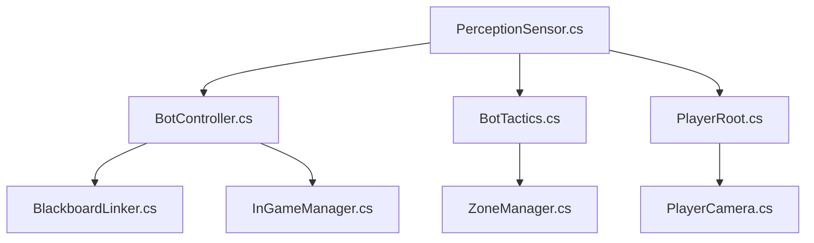
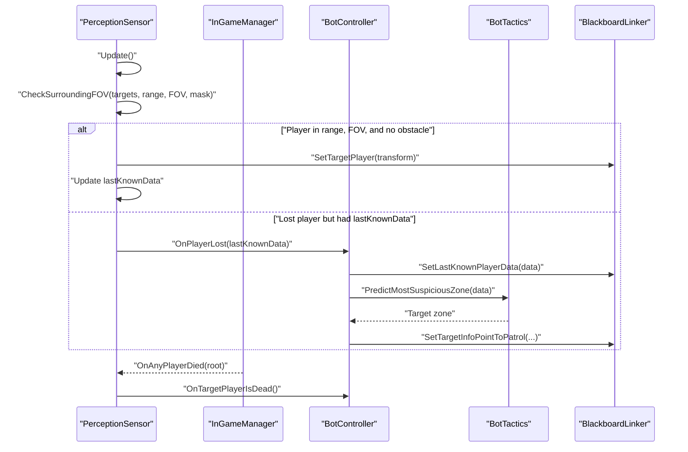
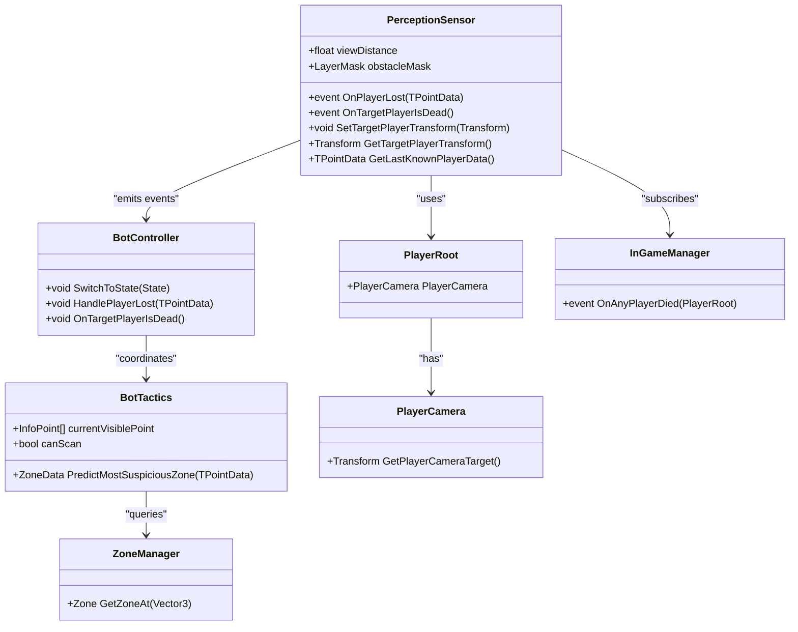

# Perception Sensor System

<cite>
**Referenced Files in This Document**
- [PerceptionSensor.cs](file://Assets/FPS-Game/Scripts/Bot/PerceptionSensor.cs)
- [BotController.cs](file://Assets/FPS-Game/Scripts/Bot/BotController.cs)
- [BotTactics.cs](file://Assets/FPS-Game/Scripts/Bot/BotTactics.cs)
- [BlackboardLinker.cs](file://Assets/FPS-Game/Scripts/Bot/BlackboardLinker.cs)
- [PlayerRoot.cs](file://Assets/FPS-Game/Scripts/Player/PlayerRoot.cs)
- [PlayerCamera.cs](file://Assets/FPS-Game/Scripts/Player/PlayerCamera.cs)
- [InGameManager.cs](file://Assets/FPS-Game/Scripts/System/InGameManager.cs)
- [ZoneManager.cs](file://Assets/FPS-Game/Scripts/TacticalAI/Core/ZoneManager.cs)
</cite>

## Table of Contents
1. [Introduction](#introduction)
2. [Project Structure](#project-structure)
3. [Core Components](#core-components)
4. [Architecture Overview](#architecture-overview)
5. [Detailed Component Analysis](#detailed-component-analysis)
6. [Dependency Analysis](#dependency-analysis)
7. [Performance Considerations](#performance-considerations)
8. [Troubleshooting Guide](#troubleshooting-guide)
9. [Conclusion](#conclusion)
10. [Appendices](#appendices)

## Introduction
This document explains the AI perception sensor system responsible for detecting player visibility and tracking player state. It covers line-of-sight detection algorithms, field-of-view (FOV) calculations, collision checking, and the event-driven architecture that notifies subscribers when a player is spotted or lost. It also documents configuration parameters, relationships with the bot controller state machine, behavior trees, and tactical AI zone prediction, along with practical guidance for tuning sensitivity and handling edge cases.

## Project Structure
The perception system spans several scripts under the Bot subsystem and integrates with player, game manager, and tactical AI systems:
- PerceptionSensor: Core visibility detection and event emission
- BotController: State machine orchestration and event subscription
- BotTactics: Tactical scanning, zone prediction, and visibility point management
- PlayerRoot and PlayerCamera: Player entity and camera target access
- InGameManager: Central game state and player lifecycle events
- ZoneManager: Zone graph and spatial reasoning for tactical predictions
- BlackboardLinker: Bridge between runtime state and Behavior Designer

**Diagram sources**
- [PerceptionSensor.cs:10-407](file://Assets/FPS-Game/Scripts/Bot/PerceptionSensor.cs#L10-L407)
- [BotController.cs:62-485](file://Assets/FPS-Game/Scripts/Bot/BotController.cs#L62-L485)
- [BotTactics.cs:17-456](file://Assets/FPS-Game/Scripts/Bot/BotTactics.cs#L17-L456)
- [PlayerRoot.cs](file://Assets/FPS-Game/Scripts/Player/PlayerRoot.cs)
- [PlayerCamera.cs](file://Assets/FPS-Game/Scripts/Player/PlayerCamera.cs)
- [InGameManager.cs](file://Assets/FPS-Game/Scripts/System/InGameManager.cs)
- [ZoneManager.cs](file://Assets/FPS-Game/Scripts/TacticalAI/Core/ZoneManager.cs)
- [BlackboardLinker.cs](file://Assets/FPS-Game/Scripts/Bot/BlackboardLinker.cs)

**Section sources**
- [PerceptionSensor.cs:10-407](file://Assets/FPS-Game/Scripts/Bot/PerceptionSensor.cs#L10-L407)
- [BotController.cs:62-485](file://Assets/FPS-Game/Scripts/Bot/BotController.cs#L62-L485)
- [BotTactics.cs:17-456](file://Assets/FPS-Game/Scripts/Bot/BotTactics.cs#L17-L456)
- [PlayerRoot.cs](file://Assets/FPS-Game/Scripts/Player/PlayerRoot.cs)
- [PlayerCamera.cs](file://Assets/FPS-Game/Scripts/Player/PlayerCamera.cs)
- [InGameManager.cs](file://Assets/FPS-Game/Scripts/System/InGameManager.cs)
- [ZoneManager.cs](file://Assets/FPS-Game/Scripts/TacticalAI/Core/ZoneManager.cs)
- [BlackboardLinker.cs](file://Assets/FPS-Game/Scripts/Bot/BlackboardLinker.cs)

## Core Components
- PerceptionSensor
  - Detects visible players within a configurable range and FOV
  - Performs raycast collision checks against an obstacle layer mask
  - Emits OnPlayerLost with last-known position/orientation and OnTargetPlayerIsDead when the target dies
  - Maintains lastKnownData for tactical zone prediction and search path generation
  - Provides helpers to compute horizontal FOV from camera settings and draw debug gizmos
- BotController
  - Subscribes to perception events and orchestrates state transitions
  - Updates Behavior Designer blackboard values and manages behavior activation
  - Handles last-known data propagation and tactical zone re-calculation
- BotTactics
  - Manages tactical scanning sessions, visible point sets, and scan ranges
  - Predicts the most suspicious zone based on last-known direction and portal geometry
  - Emits completion events to signal progress in scanning
- PlayerRoot and PlayerCamera
  - Provide the authoritative camera target transform used for FOV and raycasts
- InGameManager
  - Supplies the global list of players and fires death events consumed by the sensor
- ZoneManager
  - Provides spatial context for zone-based predictions and patrol routing

**Section sources**
- [PerceptionSensor.cs:10-407](file://Assets/FPS-Game/Scripts/Bot/PerceptionSensor.cs#L10-L407)
- [BotController.cs:62-485](file://Assets/FPS-Game/Scripts/Bot/BotController.cs#L62-L485)
- [BotTactics.cs:17-456](file://Assets/FPS-Game/Scripts/Bot/BotTactics.cs#L17-L456)
- [PlayerRoot.cs](file://Assets/FPS-Game/Scripts/Player/PlayerRoot.cs)
- [PlayerCamera.cs](file://Assets/FPS-Game/Scripts/Player/PlayerCamera.cs)
- [InGameManager.cs](file://Assets/FPS-Game/Scripts/System/InGameManager.cs)
- [ZoneManager.cs](file://Assets/FPS-Game/Scripts/TacticalAI/Core/ZoneManager.cs)

## Architecture Overview
The perception system follows an event-driven pattern:
- PerceptionSensor continuously scans nearby players, validates range/FOV/collision, and updates lastKnownData
- When a player is lost after being seen, OnPlayerLost is raised with TPointData
- When a player dies, OnTargetPlayerIsDead is raised
- BotController subscribes to these events, updates blackboard variables, and triggers tactical scanning or state transitions
- BotTactics calculates visible points, determines scan ranges, and predicts zones based on last-known direction

**Diagram sources**
- [PerceptionSensor.cs:64-107](file://Assets/FPS-Game/Scripts/Bot/PerceptionSensor.cs#L64-L107)
- [PerceptionSensor.cs:129-178](file://Assets/FPS-Game/Scripts/Bot/PerceptionSensor.cs#L129-L178)
- [BotController.cs:101-102](file://Assets/FPS-Game/Scripts/Bot/BotController.cs#L101-L102)
- [BotController.cs:448-474](file://Assets/FPS-Game/Scripts/Bot/BotController.cs#L448-L474)
- [BotTactics.cs:198-237](file://Assets/FPS-Game/Scripts/Bot/BotTactics.cs#L198-L237)
- [InGameManager.cs](file://Assets/FPS-Game/Scripts/System/InGameManager.cs)

## Detailed Component Analysis

### PerceptionSensor: Visibility Detection and Events
Key responsibilities:
- Range filtering: compares distance to detection threshold
- FOV filtering: projects direction onto forward vector and compares to cosine of half-angle
- Collision filtering: raycast test against obstacle layer mask
- Last-known tracking: stores transform and orientation when a player is first seen
- Event emission: OnPlayerLost with TPointData and OnTargetPlayerIsDead on death
- FOV computation: derives horizontal FOV from camera vertical FOV and aspect ratio
- Debug visualization: draws detection sphere, FOV cone, and lines to targets and tactical points

Configuration parameters exposed in the inspector:
- viewDistance: Maximum sight distance
- obstacleMask: LayerMask used for raycast collisions
- sampleDirectionCount, sampleRadius, navMeshSampleMaxDistance: Sampling parameters for search area exploration (commented out in current implementation)
- botToTPLineColor: Debug color for tactical point lines

Event-driven behavior:
- OnPlayerLost(TPointData): Emitted when a previously seen player is no longer visible and lastKnownData is valid
- OnTargetPlayerIsDead: Emitted when the subscribed target player dies

Usage patterns:
- Subscriber management: BotController subscribes to both events in Awake and unsubscribes in OnDestroy
- Target assignment: SetTargetPlayerTransform and GetTargetPlayerTransform enable external control
- Search path integration: SetCurrentSearchPath allows passing tactical waypoints to assist scanning

**Section sources**
- [PerceptionSensor.cs:10-407](file://Assets/FPS-Game/Scripts/Bot/PerceptionSensor.cs#L10-L407)
- [PerceptionSensor.cs:129-178](file://Assets/FPS-Game/Scripts/Bot/PerceptionSensor.cs#L129-L178)
- [PerceptionSensor.cs:243-247](file://Assets/FPS-Game/Scripts/Bot/PerceptionSensor.cs#L243-L247)
- [PerceptionSensor.cs:278-294](file://Assets/FPS-Game/Scripts/Bot/PerceptionSensor.cs#L278-L294)
- [PerceptionSensor.cs:48-62](file://Assets/FPS-Game/Scripts/Bot/PerceptionSensor.cs#L48-L62)
- [PerceptionSensor.cs:109-127](file://Assets/FPS-Game/Scripts/Bot/PerceptionSensor.cs#L109-L127)
- [PerceptionSensor.cs:296-324](file://Assets/FPS-Game/Scripts/Bot/PerceptionSensor.cs#L296-L324)

### BotController: State Machine and Event Handling
Responsibilities:
- Subscribes to perception events (OnPlayerLost, OnTargetPlayerIsDead)
- Orchestrates state transitions among Idle, Patrol, and Combat
- Updates Behavior Designer blackboard via BlackboardLinker
- Propagates last-known data and tactical targets to behavior tree

Event handling:
- OnPlayerLost(TPointData): Sets last-known data, predicts suspicious zone, recalculates patrol path, and prepares scanning
- OnTargetPlayerIsDead(): Flags target dead for behavior tree logic

Behavior integration:
- Starts/stops Behavior Designer behaviors per state
- Syncs camera transform to global variables for behavior tree consumption

**Section sources**
- [BotController.cs:62-485](file://Assets/FPS-Game/Scripts/Bot/BotController.cs#L62-L485)
- [BotController.cs:448-474](file://Assets/FPS-Game/Scripts/Bot/BotController.cs#L448-L474)
- [BotController.cs:476-481](file://Assets/FPS-Game/Scripts/Bot/BotController.cs#L476-L481)
- [BotController.cs:230-275](file://Assets/FPS-Game/Scripts/Bot/BotController.cs#L230-L275)

### BotTactics: Tactical Scanning and Zone Prediction
Responsibilities:
- Manages scanning sessions: initializes scanning from a given InfoPoint, selects next best points, and computes scan ranges
- Calculates current visible points from portal visibility indices
- Computes scan range by finding the largest angular gap between visible points
- Predicts the most suspicious zone using dot product between last-known direction and portal vectors
- Emits completion events when current visible points or entire zone are scanned

Integration points:
- Consumes current visible points from BotController and PerceptionSensor
- Uses ZoneManager to resolve zones and portals for prediction
- Coordinates with BlackboardLinker to feed scan ranges and targets to behavior tree

**Section sources**
- [BotTactics.cs:17-456](file://Assets/FPS-Game/Scripts/Bot/BotTactics.cs#L17-L456)
- [BotTactics.cs:114-123](file://Assets/FPS-Game/Scripts/Bot/BotTactics.cs#L114-L123)
- [BotTactics.cs:198-237](file://Assets/FPS-Game/Scripts/Bot/BotTactics.cs#L198-L237)
- [BotTactics.cs:239-283](file://Assets/FPS-Game/Scripts/Bot/BotTactics.cs#L239-L283)

### PlayerRoot and PlayerCamera: Camera Target Access
- PlayerRoot provides the root entity for each player
- PlayerCamera exposes the authoritative camera target transform used by PerceptionSensor for FOV and raycast origin

**Section sources**
- [PlayerRoot.cs](file://Assets/FPS-Game/Scripts/Player/PlayerRoot.cs)
- [PlayerCamera.cs](file://Assets/FPS-Game/Scripts/Player/PlayerCamera.cs)

### InGameManager: Player Lifecycle and Global State
- Supplies the global list of players and emits OnAnyPlayerDied when a player dies
- PerceptionSensor subscribes to this event to trigger OnTargetPlayerIsDead

**Section sources**
- [InGameManager.cs](file://Assets/FPS-Game/Scripts/System/InGameManager.cs)
- [PerceptionSensor.cs:52-61](file://Assets/FPS-Game/Scripts/Bot/PerceptionSensor.cs#L52-L61)

### ZoneManager: Spatial Reasoning for Predictions
- Provides zone graph and spatial context for zone-based predictions
- Used by BotTactics to resolve zones and portals during suspicious zone analysis

**Section sources**
- [ZoneManager.cs](file://Assets/FPS-Game/Scripts/TacticalAI/Core/ZoneManager.cs)
- [BotTactics.cs:206-237](file://Assets/FPS-Game/Scripts/Bot/BotTactics.cs#L206-L237)

## Dependency Analysis
The perception system exhibits clear separation of concerns:
- PerceptionSensor depends on PlayerRoot/PlayerCamera for accurate FOV/raycast origins
- BotController depends on PerceptionSensor events and BlackboardLinker for behavior synchronization
- BotTactics depends on BotController-provided data and ZoneManager for spatial reasoning
- InGameManager supplies global player state consumed by PerceptionSensor

**Diagram sources**
- [PerceptionSensor.cs:10-407](file://Assets/FPS-Game/Scripts/Bot/PerceptionSensor.cs#L10-L407)
- [BotController.cs:62-485](file://Assets/FPS-Game/Scripts/Bot/BotController.cs#L62-L485)
- [BotTactics.cs:17-456](file://Assets/FPS-Game/Scripts/Bot/BotTactics.cs#L17-L456)
- [PlayerRoot.cs](file://Assets/FPS-Game/Scripts/Player/PlayerRoot.cs)
- [PlayerCamera.cs](file://Assets/FPS-Game/Scripts/Player/PlayerCamera.cs)
- [InGameManager.cs](file://Assets/FPS-Game/Scripts/System/InGameManager.cs)
- [ZoneManager.cs](file://Assets/FPS-Game/Scripts/TacticalAI/Core/ZoneManager.cs)

**Section sources**
- [PerceptionSensor.cs:10-407](file://Assets/FPS-Game/Scripts/Bot/PerceptionSensor.cs#L10-L407)
- [BotController.cs:62-485](file://Assets/FPS-Game/Scripts/Bot/BotController.cs#L62-L485)
- [BotTactics.cs:17-456](file://Assets/FPS-Game/Scripts/Bot/BotTactics.cs#L17-L456)
- [PlayerRoot.cs](file://Assets/FPS-Game/Scripts/Player/PlayerRoot.cs)
- [PlayerCamera.cs](file://Assets/FPS-Game/Scripts/Player/PlayerCamera.cs)
- [InGameManager.cs](file://Assets/FPS-Game/Scripts/System/InGameManager.cs)
- [ZoneManager.cs](file://Assets/FPS-Game/Scripts/TacticalAI/Core/ZoneManager.cs)

## Performance Considerations
- Raycast cost: Each potential target incurs a single Physics.Raycast call; reduce target count by limiting scan radius and FOV
- FOV and range thresholds: Tighten viewDistance and narrow FOV to minimize per-frame checks
- Obstacle mask specificity: Narrow the obstacleMask to relevant layers to avoid unnecessary broad checks
- Sampling overhead: Sampling parameters exist but are commented out; enable only when necessary
- Frequency of event firing: OnPlayerLost is guarded to fire once per loss episode, preventing redundant work
- Behavior Designer integration: Avoid excessive blackboard updates; batch updates where possible

[No sources needed since this section provides general guidance]

## Troubleshooting Guide
Common issues and resolutions:
- False positives due to environmental occlusion
  - Verify obstacleMask includes only intended blocking layers
  - Increase raycast distance slightly to account for small gaps
  - Consider adding a second-order check (e.g., a second ray from above/below) if appropriate for the scene
- Frequent OnPlayerLost triggers
  - Increase viewDistance or FOV slightly to reduce edge-case misses
  - Ensure lastKnownData is preserved and valid before emitting OnPlayerLost
- Sensor not detecting players at edges of vision
  - Confirm camera forward alignment and that PlayerCamera.GetPlayerCameraTarget returns the correct transform
  - Adjust FOV calculation if the bot’s camera differs from the main camera
- Dead player not triggering OnTargetPlayerIsDead
  - Ensure InGameManager.Instance.OnAnyPlayerDied is firing and that the subscribed root matches the target
- Performance degradation during combat
  - Reduce sampleDirectionCount and sampleRadius if sampling is enabled
  - Limit FOV and range to visible extents only

**Section sources**
- [PerceptionSensor.cs:159-164](file://Assets/FPS-Game/Scripts/Bot/PerceptionSensor.cs#L159-L164)
- [PerceptionSensor.cs:89-104](file://Assets/FPS-Game/Scripts/Bot/PerceptionSensor.cs#L89-L104)
- [PerceptionSensor.cs:236-247](file://Assets/FPS-Game/Scripts/Bot/PerceptionSensor.cs#L236-L247)
- [PerceptionSensor.cs:52-61](file://Assets/FPS-Game/Scripts/Bot/PerceptionSensor.cs#L52-L61)
- [BotController.cs:101-102](file://Assets/FPS-Game/Scripts/Bot/BotController.cs#L101-L102)

## Conclusion
The perception sensor system combines efficient range/FOV/collision checks with robust event-driven communication to integrate tightly with bot state machines and tactical AI. By tuning detection radius, FOV angles, and obstacle layers, developers can balance accuracy and performance. Proper event subscription and blackboard synchronization ensure behavior trees receive timely and accurate state updates for responsive AI behavior.

[No sources needed since this section summarizes without analyzing specific files]

## Appendices

### Configuration Parameters Reference
- Detection range
  - Parameter: viewDistance
  - Purpose: Maximum distance for player detection
  - Typical tuning: Increase for open maps; decrease for dense environments
- Field-of-view angles
  - Parameter: Derived horizontal FOV from camera vertical FOV and aspect ratio
  - Purpose: Cone-shaped visibility region aligned with bot’s camera
  - Tuning tip: Match to gameplay expectations; wider FOV increases detection but may increase false positives
- Obstruction layers
  - Parameter: obstacleMask (LayerMask)
  - Purpose: Layers that block line-of-sight
  - Tuning tip: Include walls and props; exclude triggers and non-blocking geometry
- Detection delay and event behavior
  - Mechanism: OnPlayerLost fires once per loss episode; OnTargetPlayerIsDead fires upon player death
  - Tuning tip: Adjust viewDistance/FOV to minimize accidental triggers; ensure lastKnownData validity before emitting OnPlayerLost

**Section sources**
- [PerceptionSensor.cs:19-21](file://Assets/FPS-Game/Scripts/Bot/PerceptionSensor.cs#L19-L21)
- [PerceptionSensor.cs:236-247](file://Assets/FPS-Game/Scripts/Bot/PerceptionSensor.cs#L236-L247)
- [PerceptionSensor.cs:21-21](file://Assets/FPS-Game/Scripts/Bot/PerceptionSensor.cs#L21-L21)
- [PerceptionSensor.cs:24-25](file://Assets/FPS-Game/Scripts/Bot/PerceptionSensor.cs#L24-L25)
- [PerceptionSensor.cs:89-104](file://Assets/FPS-Game/Scripts/Bot/PerceptionSensor.cs#L89-L104)

### Example Patterns from the Codebase
- Sensor configuration
  - Assign target player transform and subscribe to events in BotController.Awake
  - Reference: [BotController.cs:92-110](file://Assets/FPS-Game/Scripts/Bot/BotController.cs#L92-L110)
- Detection range settings
  - Configure viewDistance and obstacleMask on PerceptionSensor
  - Reference: [PerceptionSensor.cs:19-21](file://Assets/FPS-Game/Scripts/Bot/PerceptionSensor.cs#L19-L21)
- Event handling patterns
  - OnPlayerLost: Update blackboard and recalculate patrol path
  - OnTargetPlayerIsDead: Flag target dead for behavior tree
  - References: [BotController.cs:448-481](file://Assets/FPS-Game/Scripts/Bot/BotController.cs#L448-L481)
- FOV calculation
  - Compute horizontal FOV from vertical FOV and aspect ratio
  - Reference: [PerceptionSensor.cs:236-247](file://Assets/FPS-Game/Scripts/Bot/PerceptionSensor.cs#L236-L247)

**Section sources**
- [BotController.cs:92-110](file://Assets/FPS-Game/Scripts/Bot/BotController.cs#L92-L110)
- [BotController.cs:448-481](file://Assets/FPS-Game/Scripts/Bot/BotController.cs#L448-L481)
- [PerceptionSensor.cs:19-21](file://Assets/FPS-Game/Scripts/Bot/PerceptionSensor.cs#L19-L21)
- [PerceptionSensor.cs:236-247](file://Assets/FPS-Game/Scripts/Bot/PerceptionSensor.cs#L236-L247)