# Tactical AI & Spatial Reasoning

<cite>
**Referenced Files in This Document**
- [BotTactics.cs](file://Assets/FPS-Game/Scripts/Bot/BotTactics.cs)
- [BotController.cs](file://Assets/FPS-Game/Scripts/Bot/BotController.cs)
- [ZoneManager.cs](file://Assets/FPS-Game/Scripts/TacticalAI/Core/ZoneManager.cs)
- [ZoneData.cs](file://Assets/FPS-Game/Scripts/TacticalAI/Data/ZoneData.cs)
- [InfoPoint.cs](file://Assets/FPS-Game/Scripts/TacticalAI/Data/InfoPoint.cs)
- [Zone.cs](file://Assets/FPS-Game/Scripts/System/Zone.cs)
- [TacticalPointBaker.cs](file://Assets/FPS-Game/Scripts/TacticalAI/PointBaker/TacticalPointBaker.cs)
- [InfoPointBaker.cs](file://Assets/FPS-Game/Scripts/TacticalAI/PointBaker/InfoPointBaker.cs)
- [CenterPointBaker.cs](file://Assets/FPS-Game/Scripts/TacticalAI/PointBaker/CenterPointBaker.cs)
- [TacticalPoints.cs](file://Assets/FPS-Game/Scripts/System/TacticalPoints.cs)
- [PerceptionSensor.cs](file://Assets/FPS-Game/Scripts/Bot/PerceptionSensor.cs)
</cite>

## Table of Contents
1. [Introduction](#introduction)
2. [Project Structure](#project-structure)
3. [Core Components](#core-components)
4. [Architecture Overview](#architecture-overview)
5. [Detailed Component Analysis](#detailed-component-analysis)
6. [Dependency Analysis](#dependency-analysis)
7. [Performance Considerations](#performance-considerations)
8. [Troubleshooting Guide](#troubleshooting-guide)
9. [Conclusion](#conclusion)
10. [Appendices](#appendices)

## Introduction
This document explains the tactical AI system that powers spatial reasoning and strategic decision-making for bots. It covers the zone-based architecture, zone scanning algorithms, portal routing, area coverage strategies, tactical point generation, visibility calculations, and suspicious zone prediction. It also documents configuration parameters, integration with the bot controller finite-state machine (FSM), behavior trees, and the perception system for threat assessment. Practical guidance is included for optimizing performance on large maps, handling dynamic environments, and balancing exploration versus pursuit.

## Project Structure
The tactical AI system is organized around:
- Zone-based data: ZoneData, InfoPoint, PortalPoint, and TacticalPoint
- Core orchestration: BotTactics and BotController
- Routing and graph: ZoneManager (Dijkstra over portals)
- Point baking and generation: PointBaker implementations and TacticalPoints
- Perception and state: PerceptionSensor and BotController FSM

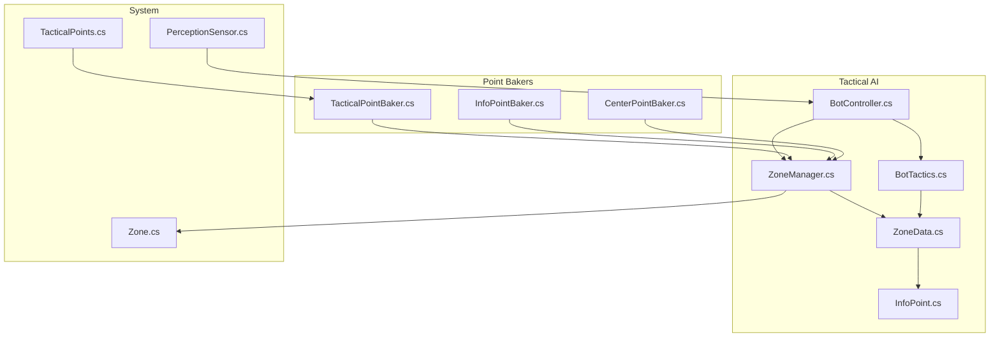

**Diagram sources**
- [ZoneManager.cs:1-841](file://Assets/FPS-Game/Scripts/TacticalAI/Core/ZoneManager.cs#L1-L841)
- [ZoneData.cs:1-122](file://Assets/FPS-Game/Scripts/TacticalAI/Data/ZoneData.cs#L1-L122)
- [InfoPoint.cs:1-40](file://Assets/FPS-Game/Scripts/TacticalAI/Data/InfoPoint.cs#L1-L40)
- [BotTactics.cs:1-456](file://Assets/FPS-Game/Scripts/Bot/BotTactics.cs#L1-L456)
- [BotController.cs:1-485](file://Assets/FPS-Game/Scripts/Bot/BotController.cs#L1-L485)
- [Zone.cs:1-249](file://Assets/FPS-Game/Scripts/System/Zone.cs#L1-L249)
- [TacticalPointBaker.cs:1-122](file://Assets/FPS-Game/Scripts/TacticalAI/PointBaker/TacticalPointBaker.cs#L1-L122)
- [InfoPointBaker.cs:1-153](file://Assets/FPS-Game/Scripts/TacticalAI/PointBaker/InfoPointBaker.cs#L1-L153)
- [CenterPointBaker.cs:1-89](file://Assets/FPS-Game/Scripts/TacticalAI/PointBaker/CenterPointBaker.cs#L1-L89)
- [TacticalPoints.cs:1-73](file://Assets/FPS-Game/Scripts/System/TacticalPoints.cs#L1-L73)
- [PerceptionSensor.cs](file://Assets/FPS-Game/Scripts/Bot/PerceptionSensor.cs)

**Section sources**
- [ZoneManager.cs:1-841](file://Assets/FPS-Game/Scripts/TacticalAI/Core/ZoneManager.cs#L1-L841)
- [ZoneData.cs:1-122](file://Assets/FPS-Game/Scripts/TacticalAI/Data/ZoneData.cs#L1-L122)
- [InfoPoint.cs:1-40](file://Assets/FPS-Game/Scripts/TacticalAI/Data/InfoPoint.cs#L1-L40)
- [BotTactics.cs:1-456](file://Assets/FPS-Game/Scripts/Bot/BotTactics.cs#L1-L456)
- [BotController.cs:1-485](file://Assets/FPS-Game/Scripts/Bot/BotController.cs#L1-L485)
- [Zone.cs:1-249](file://Assets/FPS-Game/Scripts/System/Zone.cs#L1-L249)
- [TacticalPointBaker.cs:1-122](file://Assets/FPS-Game/Scripts/TacticalAI/PointBaker/TacticalPointBaker.cs#L1-L122)
- [InfoPointBaker.cs:1-153](file://Assets/FPS-Game/Scripts/TacticalAI/PointBaker/InfoPointBaker.cs#L1-L153)
- [CenterPointBaker.cs:1-89](file://Assets/FPS-Game/Scripts/TacticalAI/PointBaker/CenterPointBaker.cs#L1-L89)
- [TacticalPoints.cs:1-73](file://Assets/FPS-Game/Scripts/System/TacticalPoints.cs#L1-L73)

## Core Components
- ZoneManager: Builds adjacency lists, computes shortest portal paths, and exposes zone/portals lookup. Implements Dijkstra over internal portal traversal costs.
- ZoneData: Holds per-zone master points (InfoPoint/TacticalPoint/PortalPoint), weights, center, and internal portal traversal edges.
- InfoPoint/PortalPoint/TacticalPoint: Typed point primitives with IDs, positions, priorities, and visibility indices.
- BotTactics: Zone scanning coordinator. Computes scan ranges, tracks visibility, and signals completion events.
- BotController: FSM orchestrator. Drives patrol routing, triggers scanning, integrates with behavior trees and perception.
- Point Bakers: Generate and bake InfoPoints, TacticalPoints, and center positions into ZoneData.
- TacticalPoints: Editor helper to validate and snap tactical points to NavMesh.

Key responsibilities:
- Spatial reasoning: Zone membership, portal connectivity, and traversal cost graph.
- Strategic scanning: Visibility-aware scanning order and scan range computation.
- Execution loop: FSM-driven patrol, scanning, and suspicious zone prediction.

**Section sources**
- [ZoneManager.cs:389-637](file://Assets/FPS-Game/Scripts/TacticalAI/Core/ZoneManager.cs#L389-L637)
- [ZoneData.cs:29-122](file://Assets/FPS-Game/Scripts/TacticalAI/Data/ZoneData.cs#L29-L122)
- [InfoPoint.cs:7-40](file://Assets/FPS-Game/Scripts/TacticalAI/Data/InfoPoint.cs#L7-L40)
- [BotTactics.cs:17-283](file://Assets/FPS-Game/Scripts/Bot/BotTactics.cs#L17-L283)
- [BotController.cs:62-485](file://Assets/FPS-Game/Scripts/Bot/BotController.cs#L62-L485)
- [TacticalPointBaker.cs:14-122](file://Assets/FPS-Game/Scripts/TacticalAI/PointBaker/TacticalPointBaker.cs#L14-L122)
- [InfoPointBaker.cs:13-153](file://Assets/FPS-Game/Scripts/TacticalAI/PointBaker/InfoPointBaker.cs#L13-L153)
- [CenterPointBaker.cs:14-89](file://Assets/FPS-Game/Scripts/TacticalAI/PointBaker/CenterPointBaker.cs#L14-L89)
- [TacticalPoints.cs:6-73](file://Assets/FPS-Game/Scripts/System/TacticalPoints.cs#L6-L73)

## Architecture Overview
The tactical AI architecture couples zone topology with behavioral control:
- ZoneManager constructs a graph of portals with traversal costs and runs Dijkstra to compute patrol routes.
- ZoneData stores master points and derived visibility/priority for scanning.
- BotController manages FSM states and delegates tactical scanning to BotTactics.
- BotTactics calculates scan ranges and visibility sets, emitting completion events.
- PerceptionSensor informs BotController when the player is lost, enabling suspicious zone prediction.

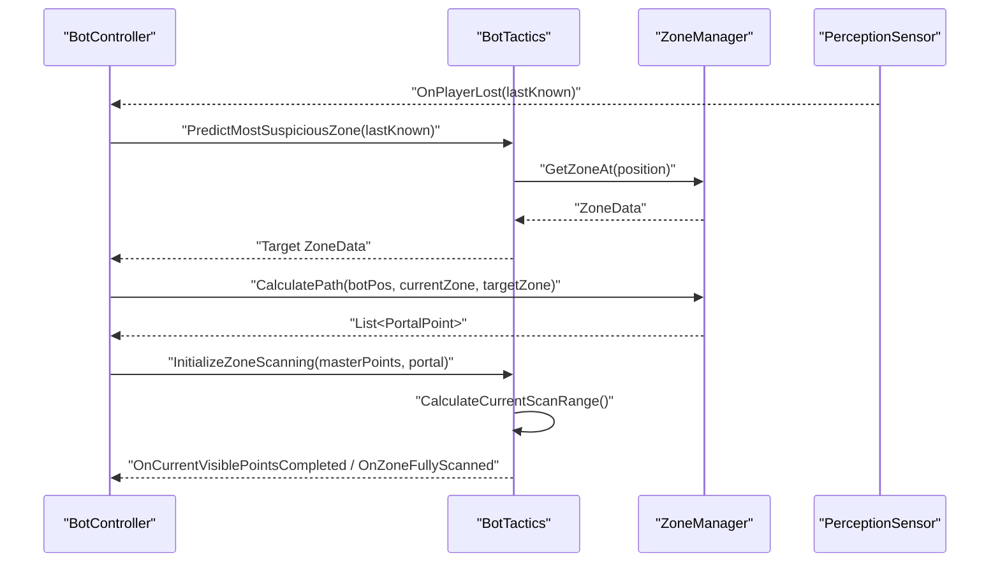

**Diagram sources**
- [BotController.cs:448-482](file://Assets/FPS-Game/Scripts/Bot/BotController.cs#L448-L482)
- [BotTactics.cs:198-237](file://Assets/FPS-Game/Scripts/Bot/BotTactics.cs#L198-L237)
- [ZoneManager.cs:389-403](file://Assets/FPS-Game/Scripts/TacticalAI/Core/ZoneManager.cs#L389-L403)

## Detailed Component Analysis

### Zone-Based Tactical Architecture
- ZoneData encapsulates:
  - Base weight and growth rate for dynamic prioritization.
  - Master point lists (InfoPoint/TacticalPoint/PortalPoint).
  - Internal portal traversal edges (costs).
- ZoneManager builds adjacency lists from internalPaths and runs Dijkstra to compute a portal route from current position to target zone.
- Zone provides GetCurrentWeight and ResetWeight to bias exploration toward under-visited zones.

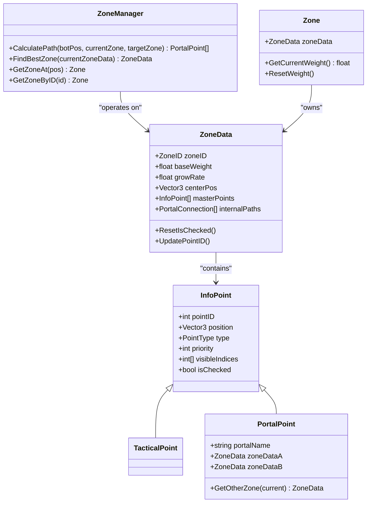

**Diagram sources**
- [ZoneData.cs:29-122](file://Assets/FPS-Game/Scripts/TacticalAI/Data/ZoneData.cs#L29-L122)
- [InfoPoint.cs:7-40](file://Assets/FPS-Game/Scripts/TacticalAI/Data/InfoPoint.cs#L7-L40)
- [ZoneManager.cs:389-440](file://Assets/FPS-Game/Scripts/TacticalAI/Core/ZoneManager.cs#L389-L440)
- [Zone.cs:151-161](file://Assets/FPS-Game/Scripts/System/Zone.cs#L151-L161)

**Section sources**
- [ZoneData.cs:29-122](file://Assets/FPS-Game/Scripts/TacticalAI/Data/ZoneData.cs#L29-L122)
- [InfoPoint.cs:7-40](file://Assets/FPS-Game/Scripts/TacticalAI/Data/InfoPoint.cs#L7-L40)
- [ZoneManager.cs:389-440](file://Assets/FPS-Game/Scripts/TacticalAI/Core/ZoneManager.cs#L389-L440)
- [Zone.cs:151-161](file://Assets/FPS-Game/Scripts/System/Zone.cs#L151-L161)

### Zone Scanning Algorithms
BotTactics coordinates scanning:
- Initializes scanning with a list of InfoPoint and a starting portal.
- Selects the highest-priority unchecked InfoPoint as the next target.
- Calculates a scan range that covers all visible points from the current InfoPoint, excluding already checked ones.
- Emits completion events when all visible points are checked or when the zone is fully scanned.

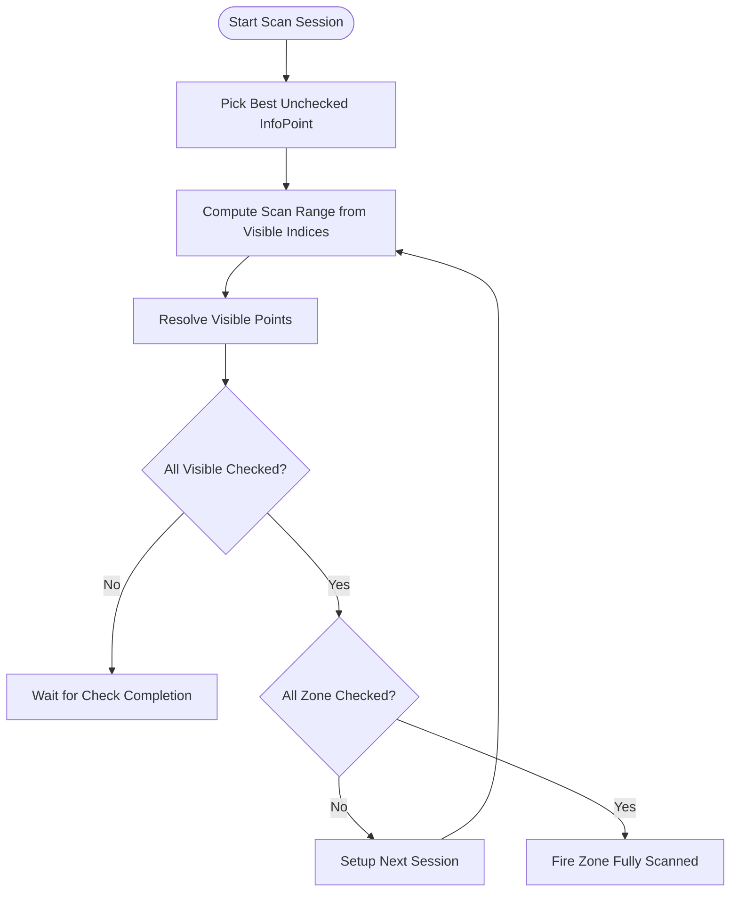

**Diagram sources**
- [BotTactics.cs:70-112](file://Assets/FPS-Game/Scripts/Bot/BotTactics.cs#L70-L112)
- [BotTactics.cs:125-196](file://Assets/FPS-Game/Scripts/Bot/BotTactics.cs#L125-L196)
- [BotTactics.cs:239-283](file://Assets/FPS-Game/Scripts/Bot/BotTactics.cs#L239-L283)

**Section sources**
- [BotTactics.cs:70-112](file://Assets/FPS-Game/Scripts/Bot/BotTactics.cs#L70-L112)
- [BotTactics.cs:125-196](file://Assets/FPS-Game/Scripts/Bot/BotTactics.cs#L125-L196)
- [BotTactics.cs:239-283](file://Assets/FPS-Game/Scripts/Bot/BotTactics.cs#L239-L283)

### Portal Routing Calculations
ZoneManager implements Dijkstra over portals:
- Builds adjacency list from internalPaths with traversal costs.
- Sources are the portals reachable from the bot’s current zone (or snapped position).
- Targets are the portals belonging to the destination zone.
- Returns a path of PortalPoint ordered along the route.

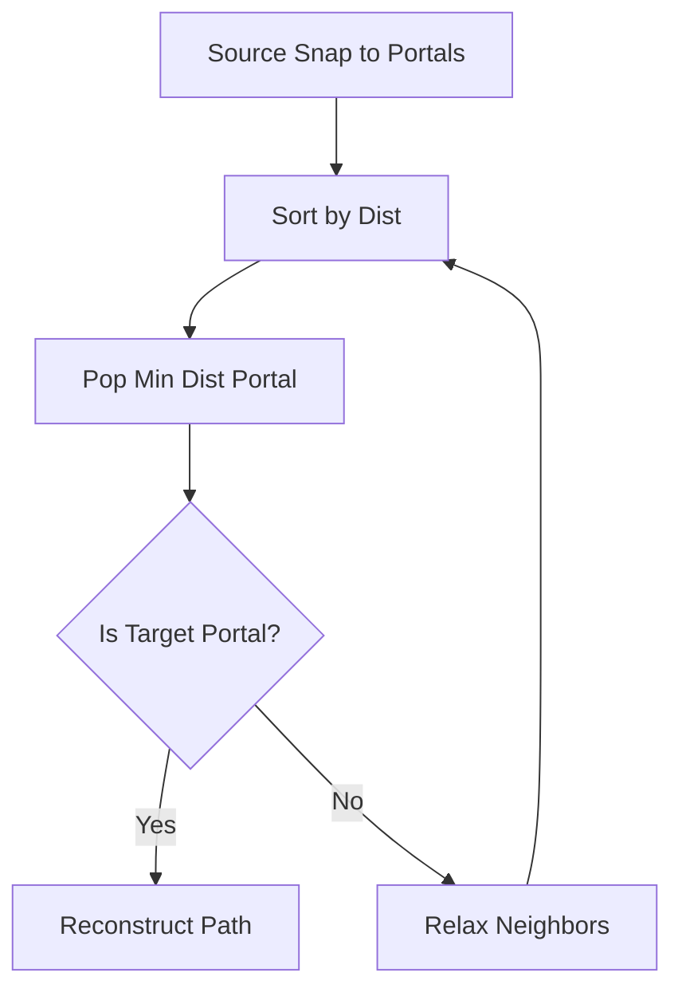

**Diagram sources**
- [ZoneManager.cs:523-612](file://Assets/FPS-Game/Scripts/TacticalAI/Core/ZoneManager.cs#L523-L612)

**Section sources**
- [ZoneManager.cs:523-612](file://Assets/FPS-Game/Scripts/TacticalAI/Core/ZoneManager.cs#L523-L612)

### Area Coverage Strategies
- Dynamic weighting: Zone.GetCurrentWeight increases over time, encouraging revisits.
- Best-zone selection: ZoneManager.FindBestZone avoids adjacent zones and the current zone to bias exploration.
- Visibility-driven priorities: InfoPoint.priority equals the number of visible points, guiding scan ordering.

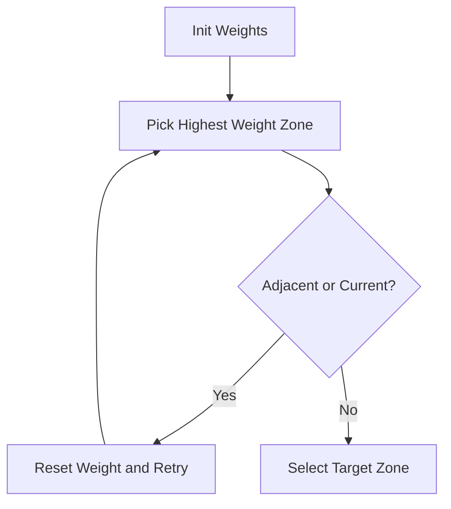

**Diagram sources**
- [Zone.cs:151-161](file://Assets/FPS-Game/Scripts/System/Zone.cs#L151-L161)
- [ZoneManager.cs:415-440](file://Assets/FPS-Game/Scripts/TacticalAI/Core/ZoneManager.cs#L415-L440)

**Section sources**
- [Zone.cs:151-161](file://Assets/FPS-Game/Scripts/System/Zone.cs#L151-L161)
- [ZoneManager.cs:415-440](file://Assets/FPS-Game/Scripts/TacticalAI/Core/ZoneManager.cs#L415-L440)

### Tactical Point Generation System
- InfoPointBaker generates a grid of InfoPoint candidates per zone using raycasts and NavMesh sampling.
- TacticalPointBaker converts editor-placed TacticalPoints into typed TacticalPoint entries in ZoneData.masterPoints.
- CenterPointBaker assigns a central position per zone.
- TacticalPoints validates and snaps existing points to NavMesh during OnValidate.

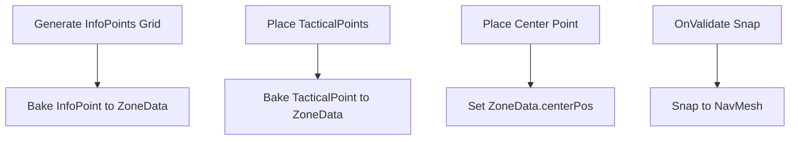

**Diagram sources**
- [InfoPointBaker.cs:13-84](file://Assets/FPS-Game/Scripts/TacticalAI/PointBaker/InfoPointBaker.cs#L13-L84)
- [TacticalPointBaker.cs:14-82](file://Assets/FPS-Game/Scripts/TacticalAI/PointBaker/TacticalPointBaker.cs#L14-L82)
- [CenterPointBaker.cs:14-73](file://Assets/FPS-Game/Scripts/TacticalAI/PointBaker/CenterPointBaker.cs#L14-L73)
- [TacticalPoints.cs:16-39](file://Assets/FPS-Game/Scripts/System/TacticalPoints.cs#L16-L39)

**Section sources**
- [InfoPointBaker.cs:13-84](file://Assets/FPS-Game/Scripts/TacticalAI/PointBaker/InfoPointBaker.cs#L13-L84)
- [TacticalPointBaker.cs:14-82](file://Assets/FPS-Game/Scripts/TacticalAI/PointBaker/TacticalPointBaker.cs#L14-L82)
- [CenterPointBaker.cs:14-73](file://Assets/FPS-Game/Scripts/TacticalAI/PointBaker/CenterPointBaker.cs#L14-L73)
- [TacticalPoints.cs:16-39](file://Assets/FPS-Game/Scripts/System/TacticalPoints.cs#L16-L39)

### Visibility Point Calculation
- ZoneManager.BakeInfoPointVisibility computes visibility between all InfoPoint pairs in each zone using linecasts against obstacles.
- InfoPoint.priority is set to the count of visible points, and visibleIndices stores the indices of visible peers.
- BotTactics uses visibleIndices to compute scan ranges and to track completion.

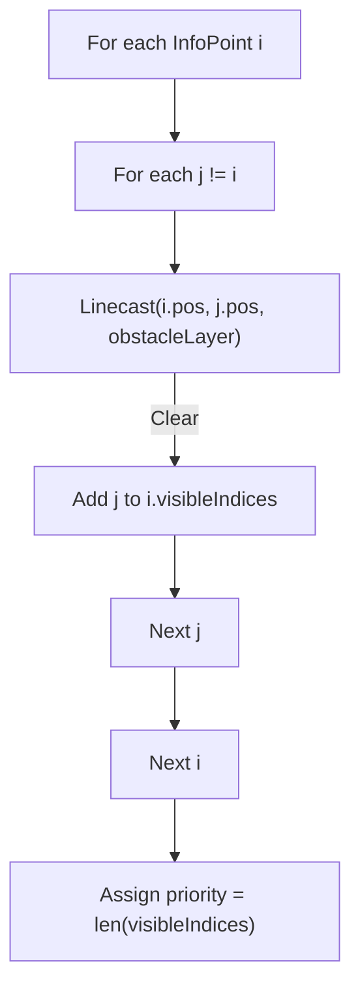

**Diagram sources**
- [ZoneManager.cs:184-244](file://Assets/FPS-Game/Scripts/TacticalAI/Core/ZoneManager.cs#L184-L244)
- [InfoPoint.cs:13-16](file://Assets/FPS-Game/Scripts/TacticalAI/Data/InfoPoint.cs#L13-L16)

**Section sources**
- [ZoneManager.cs:184-244](file://Assets/FPS-Game/Scripts/TacticalAI/Core/ZoneManager.cs#L184-L244)
- [InfoPoint.cs:13-16](file://Assets/FPS-Game/Scripts/TacticalAI/Data/InfoPoint.cs#L13-L16)

### Suspicious Zone Prediction
- BotTactics.PredictMostSuspiciousZone compares the player’s facing direction to vectors toward portals in the current zone.
- The portal with the highest forward dot product is selected as the most likely exit, returning the opposite zone.
- If confidence is low, it stays in the current zone to avoid premature zone jumps.

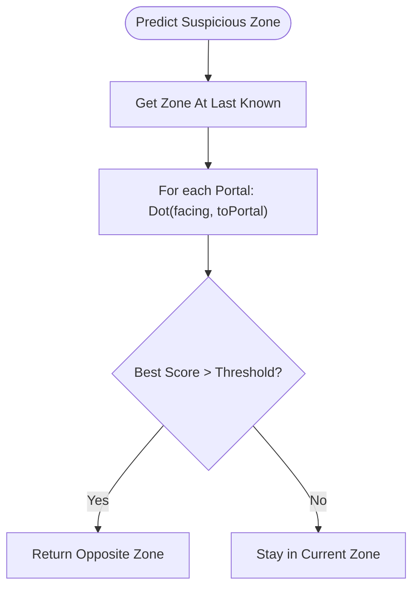

**Diagram sources**
- [BotTactics.cs:198-237](file://Assets/FPS-Game/Scripts/Bot/BotTactics.cs#L198-L237)

**Section sources**
- [BotTactics.cs:198-237](file://Assets/FPS-Game/Scripts/Bot/BotTactics.cs#L198-L237)

### Configuration Parameters
- BotTactics:
  - searchRadius: Search radius around the last-known position for candidate points.
  - debug settings: showDebugGizmos, debugColor, draw flags for visibility and info points.
- ZoneData:
  - baseWeight, growRate: Dynamic zone prioritization.
  - internalPaths: Precomputed traversal costs between portals within a zone.
- InfoPointBaker:
  - gridSize: Sampling density for InfoPoint generation.
- TacticalPoints:
  - gizmoRadius, validColor, invalidColor, heightOffset: Validation and visualization settings.

**Section sources**
- [BotTactics.cs:19-35](file://Assets/FPS-Game/Scripts/Bot/BotTactics.cs#L19-L35)
- [ZoneData.cs:32-46](file://Assets/FPS-Game/Scripts/TacticalAI/Data/ZoneData.cs#L32-L46)
- [InfoPointBaker.cs:9](file://Assets/FPS-Game/Scripts/TacticalAI/PointBaker/InfoPointBaker.cs#L9)
- [TacticalPoints.cs:8-12](file://Assets/FPS-Game/Scripts/System/TacticalPoints.cs#L8-L12)

### Integration with Bot Controller FSM and Behavior Trees
- BotController switches states (Idle/Patrol/Combat) and drives behavior tree execution via Behavior Designer.
- On patrol, it calculates a portal route to a target zone and moves toward the next portal.
- On reaching a portal, it triggers BotTactics to compute visible points and scan range.
- On losing the player, it predicts a suspicious zone and recalculates a new patrol route.
- Events from BotTactics (OnCurrentVisiblePointsCompleted, OnZoneFullyScanned) toggle scanning flags and trigger next steps.

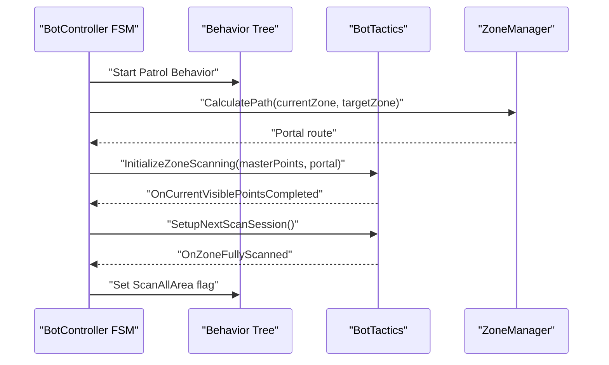

**Diagram sources**
- [BotController.cs:230-275](file://Assets/FPS-Game/Scripts/Bot/BotController.cs#L230-L275)
- [BotController.cs:331-414](file://Assets/FPS-Game/Scripts/Bot/BotController.cs#L331-L414)
- [BotTactics.cs:59-92](file://Assets/FPS-Game/Scripts/Bot/BotTactics.cs#L59-L92)

**Section sources**
- [BotController.cs:230-275](file://Assets/FPS-Game/Scripts/Bot/BotController.cs#L230-L275)
- [BotController.cs:331-414](file://Assets/FPS-Game/Scripts/Bot/BotController.cs#L331-L414)
- [BotTactics.cs:59-92](file://Assets/FPS-Game/Scripts/Bot/BotTactics.cs#L59-L92)

### Relationship with Perception System
- PerceptionSensor reports last-known player position and rotation to BotController.
- BotController passes TPointData to BotTactics for suspicious zone prediction.
- PerceptionSensor events drive state transitions and scanning initiation.

**Section sources**
- [BotController.cs:448-482](file://Assets/FPS-Game/Scripts/Bot/BotController.cs#L448-L482)
- [PerceptionSensor.cs](file://Assets/FPS-Game/Scripts/Bot/PerceptionSensor.cs)

## Dependency Analysis
- BotController depends on:
  - BotTactics for scanning coordination.
  - ZoneManager for portal routing.
  - PerceptionSensor for threat assessment.
- BotTactics depends on:
  - ZoneData for master points and portals.
  - ZoneManager for zone lookup.
- ZoneManager depends on:
  - ZoneData for internalPaths and portal traversal costs.
  - Zone for zone membership queries.
- Point Bakers depend on:
  - ZoneManager for zone lookup and asset updates.

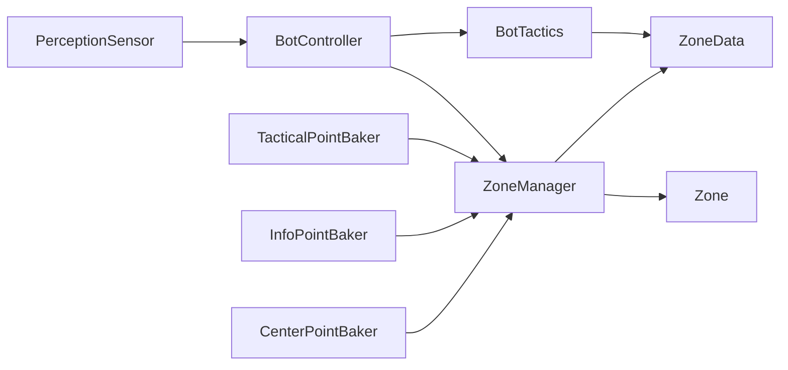

**Diagram sources**
- [BotController.cs:62-110](file://Assets/FPS-Game/Scripts/Bot/BotController.cs#L62-L110)
- [BotTactics.cs:17-58](file://Assets/FPS-Game/Scripts/Bot/BotTactics.cs#L17-L58)
- [ZoneManager.cs:107-158](file://Assets/FPS-Game/Scripts/TacticalAI/Core/ZoneManager.cs#L107-L158)
- [ZoneData.cs:29-122](file://Assets/FPS-Game/Scripts/TacticalAI/Data/ZoneData.cs#L29-L122)
- [Zone.cs:127-158](file://Assets/FPS-Game/Scripts/System/Zone.cs#L127-L158)
- [TacticalPointBaker.cs:14-82](file://Assets/FPS-Game/Scripts/TacticalAI/PointBaker/TacticalPointBaker.cs#L14-L82)
- [InfoPointBaker.cs:13-84](file://Assets/FPS-Game/Scripts/TacticalAI/PointBaker/InfoPointBaker.cs#L13-L84)
- [CenterPointBaker.cs:14-73](file://Assets/FPS-Game/Scripts/TacticalAI/PointBaker/CenterPointBaker.cs#L14-L73)

**Section sources**
- [BotController.cs:62-110](file://Assets/FPS-Game/Scripts/Bot/BotController.cs#L62-L110)
- [BotTactics.cs:17-58](file://Assets/FPS-Game/Scripts/Bot/BotTactics.cs#L17-L58)
- [ZoneManager.cs:107-158](file://Assets/FPS-Game/Scripts/TacticalAI/Core/ZoneManager.cs#L107-L158)
- [ZoneData.cs:29-122](file://Assets/FPS-Game/Scripts/TacticalAI/Data/ZoneData.cs#L29-L122)
- [Zone.cs:127-158](file://Assets/FPS-Game/Scripts/System/Zone.cs#L127-L158)
- [TacticalPointBaker.cs:14-82](file://Assets/FPS-Game/Scripts/TacticalAI/PointBaker/TacticalPointBaker.cs#L14-L82)
- [InfoPointBaker.cs:13-84](file://Assets/FPS-Game/Scripts/TacticalAI/PointBaker/InfoPointBaker.cs#L13-L84)
- [CenterPointBaker.cs:14-73](file://Assets/FPS-Game/Scripts/TacticalAI/PointBaker/CenterPointBaker.cs#L14-L73)

## Performance Considerations
- Zone scanning complexity:
  - Visibility computation is O(N^2) per zone; consider reducing point counts or using spatial partitioning for very large zones.
  - Scan range calculation sorts angles; keep N reasonable or precompute angular bins.
- Routing complexity:
  - Dijkstra over portals is efficient; ensure internalPaths are baked and accurate.
- Dynamic weighting:
  - Zone.GetCurrentWeight grows linearly; tune growRate to balance exploration and exploitation.
- Navigation sampling:
  - NavMesh.SamplePosition and path length computation can be expensive; cache results where appropriate and limit recalculations.

[No sources needed since this section provides general guidance]

## Troubleshooting Guide
Common issues and remedies:
- Inefficient zone traversal:
  - Ensure internalPaths are baked and traversal costs reflect real NavMesh distances.
  - Verify portalName uniqueness and correct resolution in ZoneData.
- Incomplete area coverage:
  - Confirm all InfoPoint are visible to at least one other point; re-run BakeInfoPointVisibility.
  - Check isChecked flags are cleared appropriately when switching zones.
- Tactical point generation conflicts:
  - Remove old TacticalPoint entries before rebaking to avoid duplicates.
  - Validate TacticalPoints snap to NavMesh using the provided gizmos and inspector checks.
- Suspicious zone prediction instability:
  - Increase the confidence threshold for selecting a new zone.
  - Ensure the player’s facing direction is reliable when last seen.

**Section sources**
- [ZoneManager.cs:246-292](file://Assets/FPS-Game/Scripts/TacticalAI/Core/ZoneManager.cs#L246-L292)
- [ZoneData.cs:70-77](file://Assets/FPS-Game/Scripts/TacticalAI/Data/ZoneData.cs#L70-L77)
- [TacticalPointBaker.cs:84-102](file://Assets/FPS-Game/Scripts/TacticalAI/PointBaker/TacticalPointBaker.cs#L84-L102)
- [TacticalPoints.cs:41-73](file://Assets/FPS-Game/Scripts/System/TacticalPoints.cs#L41-L73)
- [BotTactics.cs:228-236](file://Assets/FPS-Game/Scripts/Bot/BotTactics.cs#L228-L236)

## Conclusion
The tactical AI system combines zone topology, visibility-aware scanning, and dynamic prioritization to enable bots to intelligently explore and secure areas. By leveraging Dijkstra over portals, visibility matrices, and suspicious zone prediction, the system balances exploration and pursuit effectively. Proper baking of visibility and traversal costs, combined with tuned configuration parameters, yields robust performance across varied map layouts.

[No sources needed since this section summarizes without analyzing specific files]

## Appendices

### Appendix A: Key Data Structures Reference
- ZoneData: Zone identity, weights, center, master points, and internal portal edges.
- InfoPoint/TacticalPoint/PortalPoint: Typed points with IDs, positions, priorities, and visibility indices.
- ScanRange: Left/right directions and angle range for current scan session.

**Section sources**
- [ZoneData.cs:29-122](file://Assets/FPS-Game/Scripts/TacticalAI/Data/ZoneData.cs#L29-L122)
- [InfoPoint.cs:7-40](file://Assets/FPS-Game/Scripts/TacticalAI/Data/InfoPoint.cs#L7-L40)
- [BotTactics.cs:10-15](file://Assets/FPS-Game/Scripts/Bot/BotTactics.cs#L10-L15)

### Appendix B: Example Workflows
- Patrol to suspicious zone:
  - BotController predicts a suspicious zone from last-known player data and recalculates a portal route.
- Zone scanning:
  - BotController initializes scanning with the target zone’s master points and a starting portal.
  - BotTactics computes scan ranges and emits completion events to advance the process.

**Section sources**
- [BotController.cs:464-474](file://Assets/FPS-Game/Scripts/Bot/BotController.cs#L464-L474)
- [BotController.cs:356-379](file://Assets/FPS-Game/Scripts/Bot/BotController.cs#L356-L379)
- [BotTactics.cs:70-92](file://Assets/FPS-Game/Scripts/Bot/BotTactics.cs#L70-L92)