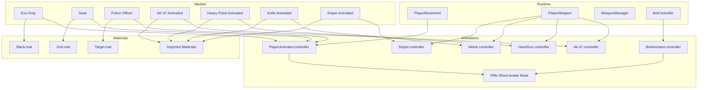
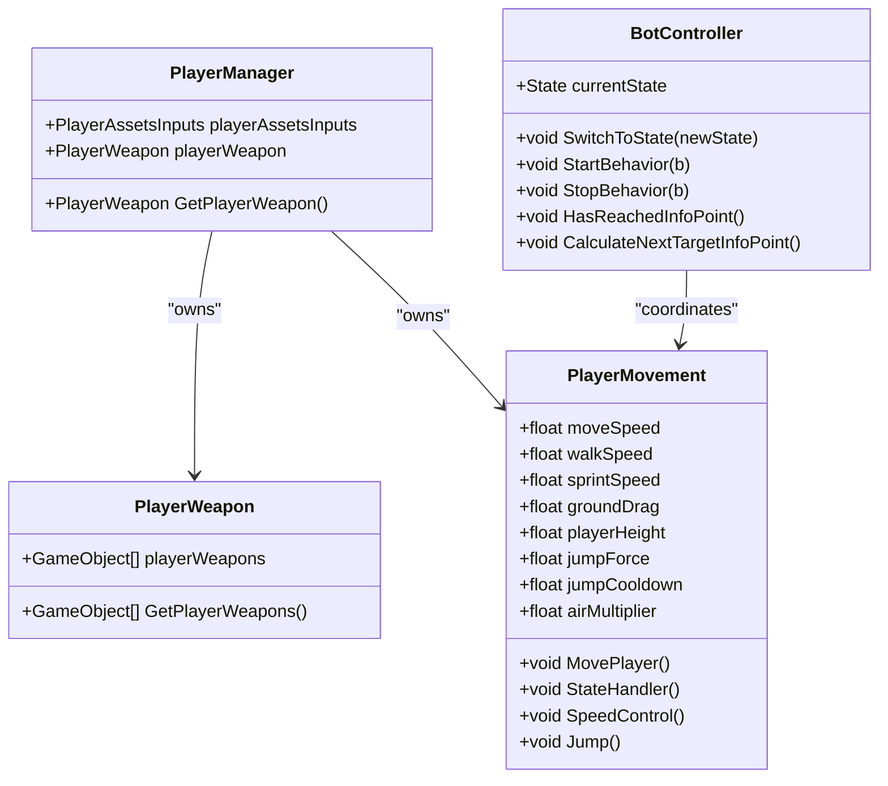
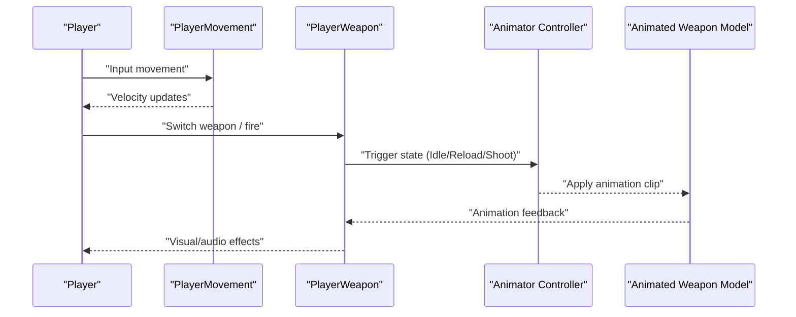
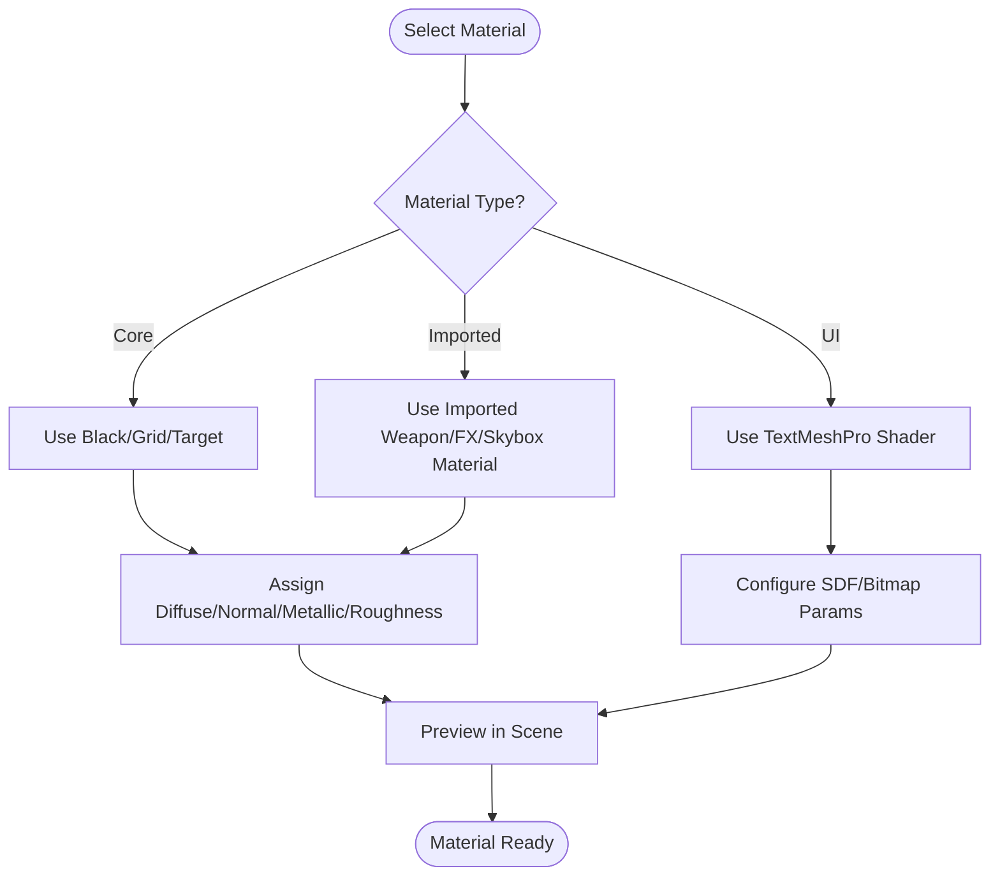
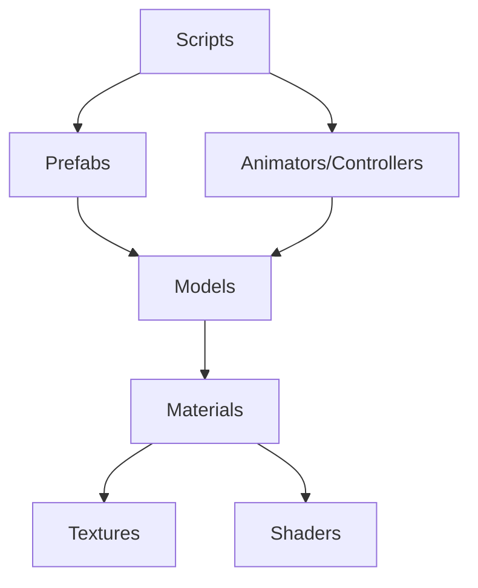

# 3D Models & Materials

<cite>
**Referenced Files in This Document**
- [README.md](file://README.md)
- [WIKI.md](file://WIKI.md)
- [ProjectSettings/ProjectSettings.asset](file://ProjectSettings/ProjectSettings.asset)
- [ProjectSettings/QualitySettings.asset](file://ProjectSettings/QualitySettings.asset)
- [ProjectSettings/GraphicsSettings.asset](file://ProjectSettings/GraphicsSettings.asset)
- [ProjectSettings/URPProjectSettings.asset](file://ProjectSettings/URPProjectSettings.asset)
- [Assets/FPS-Game/Models/Exo Gray/Exo Gray@T-Pose.fbx.meta](file://Assets/FPS-Game/Models/Exo Gray/Exo Gray@T-Pose.fbx.meta)
- [Assets/FPS-Game/Models/Exo Gray/Materials/BODY_diffuse.png.meta](file://Assets/FPS-Game/Models/Exo Gray/Materials/BODY_diffuse.png.meta)
- [Assets/FPS-Game/Models/Exo Gray/Materials/EXO_diffuse.png.meta](file://Assets/FPS-Game/Models/Exo Gray/Materials/EXO_diffuse.png.meta)
- [Assets/FPS-Game/Models/Exo Gray/Materials/BODY_normal.png.meta](file://Assets/FPS-Game/Models/Exo Gray/Materials/BODY_normal.png.meta)
- [Assets/FPS-Game/Models/Exo Gray/Materials/EXO_normal.png.meta](file://Assets/FPS-Game/Models/Exo Gray/Materials/EXO_normal.png.meta)
- [Assets/FPS-Game/Models/Exo Gray/Materials/BODY_specular.png.meta](file://Assets/FPS-Game/Models/Exo Gray/Materials/BODY_specular.png.meta)
- [Assets/FPS-Game/Models/Exo Gray/Materials/EXO_specular.png.meta](file://Assets/FPS-Game/Models/Exo Gray/Materials/EXO_specular.png.meta)
- [Assets/FPS-Game/Models/Sniper Rifle/M91.fbx.meta](file://Assets/FPS-Game/Models/Sniper Rifle/M91.fbx.meta)
- [Assets/FPS-Game/Models/Sniper Rifle/M91_bcolor.png.meta](file://Assets/FPS-Game/Models/Sniper Rifle/M91_bcolor.png.meta)
- [Assets/FPS-Game/Models/Sniper Rifle/M91_Normal.png.meta](file://Assets/FPS-Game/Models/Sniper Rifle/M91_Normal.png.meta)
- [Assets/FPS-Game/Models/Sniper Rifle/M91_Metallic.png.meta](file://Assets/FPS-Game/Models/Sniper Rifle/M91_Metallic.png.meta)
- [Assets/FPS-Game/Models/Sniper Rifle/M91_Roughness.png.meta](file://Assets/FPS-Game/Models/Sniper Rifle/M91_Roughness.png.meta)
- [Assets/FPS-Game/Models/Sniper Rifle/M91_Scope_bcolor.png.meta](file://Assets/FPS-Game/Models/Sniper Rifle/M91_Scope_bcolor.png.meta)
- [Assets/FPS-Game/Models/Sniper Rifle/M91_Scope_Normal.png.meta](file://Assets/FPS-Game/Models/Sniper Rifle/M91_Scope_Normal.png.meta)
- [Assets/FPS-Game/Models/Sniper Rifle/M91_Scope_Metallic.png.meta](file://Assets/FPS-Game/Models/Sniper Rifle/M91_Scope_Metallic.png.meta)
- [Assets/FPS-Game/Models/Sniper Rifle/M91_Scope_Roughness.png.meta](file://Assets/FPS-Game/Models/Sniper Rifle/M91_Scope_Roughness.png.meta)
- [Assets/FPS-Game/Models/Sniper Rifle/M91_Scope_AO.png.meta](file://Assets/FPS-Game/Models/Sniper Rifle/M91_Scope_AO.png.meta)
- [Assets/FPS-Game/Models/Sniper Rifle/M91_AO.png.meta](file://Assets/FPS-Game/Models/Sniper Rifle/M91_AO.png.meta)
- [Assets/FPS-Game/Models/Swat/Swat.fbx.meta](file://Assets/FPS-Game/Models/Swat/Swat.fbx.meta)
- [Assets/FPS-Game/Models/Swat/Soldier_Body_diffuse.png.meta](file://Assets/FPS-Game/Models/Swat/Soldier_Body_diffuse.png.meta)
- [Assets/FPS-Game/Models/Swat/Soldier_Body_normal.png.meta](file://Assets/FPS-Game/Models/Swat/Soldier_Body_normal.png.meta)
- [Assets/FPS-Game/Models/Swat/Soldier_Body_specular.png.meta](file://Assets/FPS-Game/Models/Swat/Soldier_Body_specular.png.meta)
- [Assets/FPS-Game/Models/Swat/Soldier_head_diffuse.png.meta](file://Assets/FPS-Game/Models/Swat/Soldier_head_diffuse.png.meta)
- [Assets/FPS-Game/Models/Swat/Soldier_head_normal.png.meta](file://Assets/FPS-Game/Models/Swat/Soldier_head_normal.png.meta)
- [Assets/FPS-Game/Models/Swat/Soldier_head_specular.png.meta](file://Assets/FPS-Game/Models/Swat/Soldier_head_specular.png.meta)
- [Assets/FPS-Game/Models/Swat/SwatAvatar.asset](file://Assets/FPS-Game/Models/Swat/SwatAvatar.asset)
- [Assets/FPS-Game/Models/Swat/Swat.prefab](file://Assets/FPS-Game/Models/Swat/Swat.prefab)
- [Assets/FPS-Game/Models/police-officer/playerIdle.fbx.meta](file://Assets/FPS-Game/Models/police-officer/playerIdle.fbx.meta)
- [Assets/FPS-Game/Models/police-officer/poBackward.fbx.meta](file://Assets/FPS-Game/Models/police-officer/poBackward.fbx.meta)
- [Assets/FPS-Game/Models/police-officer/poJump.fbx.meta](file://Assets/FPS-Game/Models/police-officer/poJump.fbx.meta)
- [Assets/FPS-Game/Models/police-officer/poStrafeLeft.fbx.meta](file://Assets/FPS-Game/Models/police-officer/poStrafeLeft.fbx.meta)
- [Assets/FPS-Game/Models/police-officer/poStrafeRight.fbx.meta](file://Assets/FPS-Game/Models/police-officer/poStrafeRight.fbx.meta)
- [Assets/FPS-Game/Models/police-officer/GunJump.mask](file://Assets/FPS-Game/Models/police-officer/GunJump.mask)
- [Assets/FPS-Game/Models/police-officer/ShootMask.mask](file://Assets/FPS-Game/Models/police-officer/ShootMask.mask)
- [Assets/FPS-Game/Models/police-officer/police_officer.controller](file://Assets/FPS-Game/Models/police-officer/police_officer.controller)
- [Assets/FPS-Game/Models/StarterAssets/Locomotion--Run_N.anim.fbx.meta](file://Assets/FPS-Game/Models/StarterAssets/Locomotion--Run_N.anim.fbx.meta)
- [Assets/FPS-Game/Models/StarterAssets/Stand--Idle.anim.fbx.meta](file://Assets/FPS-Game/Models/StarterAssets/Stand--Idle.anim.fbx.meta)
- [Assets/FPS-Game/Models/StarterAssets/Jump--Jump.anim.fbx.meta](file://Assets/FPS-Game/Models/StarterAssets/Jump--Jump.anim.fbx.meta)
- [Assets/FPS-Game/Models/StarterAssets/Jump--InAir.anim.fbx.meta](file://Assets/FPS-Game/Models/StarterAssets/Jump--InAir.anim.fbx.meta)
- [Assets/FPS-Game/Models/fps-ak-animated/source/Ak-47.controller](file://Assets/FPS-Game/Models/fps-ak-animated/source/Ak-47.controller)
- [Assets/FPS-Game/Models/fps-ak-animated/source/arms@ak.fbx.meta](file://Assets/FPS-Game/Models/fps-ak-animated/source/arms@ak.fbx.meta)
- [Assets/FPS-Game/Models/fps-ak-animated/textures/ak74Color.png.meta](file://Assets/FPS-Game/Models/fps-ak-animated/textures/ak74Color.png.meta)
- [Assets/FPS-Game/Models/fps-ak-animated/textures/armColor.png.meta](file://Assets/FPS-Game/Models/fps-ak-animated/textures/armColor.png.meta)
- [Assets/FPS-Game/Models/fps-ak-animated/textures/armNormal.png.meta](file://Assets/FPS-Game/Models/fps-ak-animated/textures/armNormal.png.meta)
- [Assets/FPS-Game/Models/fps-ak-animated/textures/armMetallic.png.meta](file://Assets/FPS-Game/Models/fps-ak-animated/textures/armMetallic.png.meta)
- [Assets/FPS-Game/Models/fps-ak-animated/textures/armsmoothness.png.meta](file://Assets/FPS-Game/Models/fps-ak-animated/textures/armsmoothness.png.meta)
- [Assets/FPS-Game/Models/heavy-pistol-animated/source/HandGun.controller](file://Assets/FPS-Game/Models/heavy-pistol-animated/source/HandGun.controller)
- [Assets/FPS-Game/Models/heavy-pistol-animated/source/arms@talon.fbx.meta](file://Assets/FPS-Game/Models/heavy-pistol-animated/source/arms@talon.fbx.meta)
- [Assets/FPS-Game/Models/heavy-pistol-animated/textures/taloncolor.png.meta](file://Assets/FPS-Game/Models/heavy-pistol-animated/textures/taloncolor.png.meta)
- [Assets/FPS-Game/Models/heavy-pistol-animated/textures/armhandColor.png.meta](file://Assets/FPS-Game/Models/heavy-pistol-animated/textures/armhandColor.png.meta)
- [Assets/FPS-Game/Models/heavy-pistol-animated/textures/armhandNormal.png.meta](file://Assets/FPS-Game/Models/heavy-pistol-animated/textures/armhandNormal.png.meta)
- [Assets/FPS-Game/Models/heavy-pistol-animated/textures/armhandSpecular.png.meta](file://Assets/FPS-Game/Models/heavy-pistol-animated/textures/armhandSpecular.png.meta)
- [Assets/FPS-Game/Models/knife-animated/source/Melee.controller](file://Assets/FPS-Game/Models/knife-animated/source/Melee.controller)
- [Assets/FPS-Game/Models/sniper-animated/source/Sniper.controller](file://Assets/FPS-Game/Models/sniper-animated/source/Sniper.controller)
- [Assets/FPS-Game/Animations/BotAnimation/BotAnimator.controller](file://Assets/FPS-Game/Animations/BotAnimation/BotAnimator.controller)
- [Assets/FPS-Game/Animations/StarterAssets/MainAni/PlayerAnimator.controller](file://Assets/FPS-Game/Animations/StarterAssets/MainAni/PlayerAnimator.controller)
- [Assets/FPS-Game/Animations/StarterAssets/MainAni/rifle aiming idle.anim](file://Assets/FPS-Game/Animations/StarterAssets/MainAni/rifle aiming idle.anim)
- [Assets/FPS-Game/Animations/StarterAssets/MainAni/walking backwards.anim](file://Assets/FPS-Game/Animations/StarterAssets/MainAni/walking backwards.anim)
- [Assets/FPS-Game/Animations/StarterAssets/MainAni/walking left.anim](file://Assets/FPS-Game/Animations/StarterAssets/MainAni/walking left.anim)
- [Assets/FPS-Game/Animations/StarterAssets/MainAni/walking right.anim](file://Assets/FPS-Game/Animations/StarterAssets/MainAni/walking right.anim)
- [Assets/FPS-Game/Animations/Weapon/Hangun/Glock.controller](file://Assets/FPS-Game/Animations/Weapon/Hangun/Glock.controller)
- [Assets/FPS-Game/Animations/Weapon/Melee/Attack.anim](file://Assets/FPS-Game/Animations/Weapon/Melee/Attack.anim)
- [Assets/FPS-Game/Animations/Weapon/Rifle/AK47/AK47.controller](file://Assets/FPS-Game/Animations/Weapon/Rifle/AK47/AK47.controller)
- [Assets/FPS-Game/Animations/Weapon/Rifle/Sniper/Shoot.anim](file://Assets/FPS-Game/Animations/Weapon/Rifle/Sniper/Shoot.anim)
- [Assets/FPS-Game/Animations/Player/Rifle Shoot Avatar Mask.mask](file://Assets/FPS-Game/Animations/Player/Rifle Shoot Avatar Mask.mask)
- [Assets/FPS-Game/Scripts/PlayerMovement.cs](file://Assets/FPS-Game/Scripts/PlayerMovement.cs)
- [Assets/FPS-Game/Scripts/PlayerManager.cs](file://Assets/FPS-Game/Scripts/PlayerManager.cs)
- [Assets/FPS-Game/Scripts/PlayerWeapon.cs](file://Assets/FPS-Game/Scripts/PlayerWeapon.cs)
- [Assets/FPS-Game/Scripts/WeaponManager.cs](file://Assets/FPS-Game/Scripts/WeaponManager.cs)
- [Assets/FPS-Game/Scripts/Bot/BotController.cs](file://Assets/FPS-Game/Scripts/Bot/BotController.cs)
- [Assets/FPS-Game/Prefabs/Player/Player.prefab](file://Assets/FPS-Game/Prefabs/Player/Player.prefab)
- [Assets/FPS-Game/Prefabs/Player/PlayerCanvas.prefab](file://Assets/FPS-Game/Prefabs/Player/PlayerCanvas.prefab)
- [Assets/FPS-Game/Prefabs/Player/PlayerScoreboardItem.prefab](file://Assets/FPS-Game/Prefabs/Player/PlayerScoreboardItem.prefab)
- [Assets/FPS-Game/Prefabs/Player/BotController.prefab](file://Assets/FPS-Game/Prefabs/Player/BotController.prefab)
- [Assets/FPS-Game/Prefabs/Weapon/AK-47.prefab](file://Assets/FPS-Game/Prefabs/Weapon/AK-47.prefab)
- [Assets/FPS-Game/Prefabs/Weapon/Glock.prefab](file://Assets/FPS-Game/Prefabs/Weapon/Glock.prefab)
- [Assets/FPS-Game/Prefabs/Weapon/Knife.prefab](file://Assets/FPS-Game/Prefabs/Weapon/Knife.prefab)
- [Assets/FPS-Game/Prefabs/Weapon/Sniper.prefab](file://Assets/FPS-Game/Prefabs/Weapon/Sniper.prefab)
- [Assets/FPS-Game/Prefabs/Weapon/Handgun.prefab](file://Assets/FPS-Game/Prefabs/Weapon/Handgun.prefab)
- [Assets/FPS-Game/Prefabs/Weapon/Grenade.prefab](file://Assets/FPS-Game/Prefabs/Weapon/Grenade.prefab)
- [Assets/FPS-Game/Prefabs/Weapon/KnifeParent.prefab](file://Assets/FPS-Game/Prefabs/Weapon/KnifeParent.prefab)
- [Assets/FPS-Game/Prefabs/Weapon/Shotgun.prefab](file://Assets/FPS-Game/Prefabs/Weapon/Shotgun.prefab)
- [Assets/FPS-Game/Prefabs/Bot/Bot.prefab](file://Assets/FPS-Game/Prefabs/Bot/Bot.prefab)
- [Assets/FPS-Game/Materials/Black.mat](file://Assets/FPS-Game/Materials/Black.mat)
- [Assets/FPS-Game/Materials/Grid.mat](file://Assets/FPS-Game/Materials/Grid.mat)
- [Assets/FPS-Game/Materials/Target.mat](file://Assets/FPS-Game/Materials/Target.mat)
- [Assets/FPS-Game/ImportedPackage/3D Low Poly Weapon/3D Assets/AK 47.mat](file://Assets/FPS-Game/ImportedPackage/3D Low Poly Weapon/3D Assets/AK 47.mat)
- [Assets/FPS-Game/ImportedPackage/3D Low Poly Weapon/3D Assets/M 16.mat](file://Assets/FPS-Game/ImportedPackage/3D Low Poly Weapon/3D Assets/M 16.mat)
- [Assets/FPS-Game/ImportedPackage/Aligned Games/Polygonal Modern Weapons Collection 2 Asset Package/Materials/atlass_1.mat](file://Assets/FPS-Game/ImportedPackage/Aligned Games/Polygonal Modern Weapons Collection 2 Asset Package/Materials/atlass_1.mat)
- [Assets/FPS-Game/ImportedPackage/Aligned Games/Polygonal Modern Weapons Collection 2 Asset Package/Materials/atlass_2.mat](file://Assets/FPS-Game/ImportedPackage/Aligned Games/Polygonal Modern Weapons Collection 2 Asset Package/Materials/atlass_2.mat)
- [Assets/FPS-Game/ImportedPackage/Aligned Games/Polygonal Modern Weapons Collection 2 Asset Package/Skyboxes/DefaultDay/DefaultDay.mat](file://Assets/FPS-Game/ImportedPackage/Aligned Games/Polygonal Modern Weapons Collection 2 Asset Package/Skyboxes/DefaultDay/DefaultDay.mat)
- [Assets/FPS-Game/ImportedPackage/Aligned Games/Polygonal Modern Weapons Collection 2 Asset Package/Skyboxes/DefaultNight/DefaultNight.mat](file://Assets/FPS-Game/ImportedPackage/Aligned Games/Polygonal Modern Weapons Collection 2 Asset Package/Skyboxes/DefaultNight/DefaultNight.mat)
- [Assets/FPS-Game/ImportedPackage/JMO Assets/WarFX/Desktop/Materials/Bullet Holes/WFX_BulletHole Concrete.mat](file://Assets/FPS-Game/ImportedPackage/JMO Assets/WarFX/Desktop/Materials/Bullet Holes/WFX_BulletHole Concrete.mat)
- [Assets/FPS-Game/ImportedPackage/JMO Assets/WarFX/Desktop/Materials/Bullet Holes/WFX_BulletHole Concrete Lighted.mat](file://Assets/FPS-Game/ImportedPackage/JMO Assets/WarFX/Desktop/Materials/Bullet Holes/WFX_BulletHole Concrete Lighted.mat)
- [Assets/FPS-Game/ImportedPackage/Abandoned World/Metal and Concrete Barrier/Materials/Metal_Concrete_Barrier.mat](file://Assets/FPS-Game/ImportedPackage/Abandoned World/Metal and Concrete Barrier/Materials/Metal_Concrete_Barrier.mat)
- [Assets/FPS-Game/ImportedPackage/Abandoned World/Metal and Concrete Barrier/Materials/Plane.mat](file://Assets/FPS-Game/ImportedPackage/Abandoned World/Metal and Concrete Barrier/Materials/Plane.mat)
- [Assets/TextMesh Pro/Resources/Fonts & Materials/LiberationSans SDF - Outline.mat](file://Assets/TextMesh Pro/Resources/Fonts & Materials/LiberationSans SDF - Outline.mat)
- [Assets/TextMesh Pro/Resources/Fonts & Materials/LiberationSans SDF - Drop Shadow.mat](file://Assets/TextMesh Pro/Resources/Fonts & Materials/LiberationSans SDF - Drop Shadow.mat)
- [Assets/TextMesh Pro/Shaders/TMP_SDF-Mobile Overlay.shader](file://Assets/TextMesh Pro/Shaders/TMP_SDF-Mobile Overlay.shader)
- [Assets/TextMesh Pro/Shaders/TMP_SDF-Mobile SSD.shader](file://Assets/TextMesh Pro/Shaders/TMP_SDF-Mobile SSD.shader)
- [Assets/TextMesh Pro/Shaders/TMP_SDF-Mobile Masking.shader](file://Assets/TextMesh Pro/Shaders/TMP_SDF-Mobile Masking.shader)
- [Assets/TextMesh Pro/Shaders/TMP_SDF-Mobile.shader](file://Assets/TextMesh Pro/Shaders/TMP_SDF-Mobile.shader)
- [Assets/TextMesh Pro/Shaders/TMP_SDF-Surface-Mobile.shader](file://Assets/TextMesh Pro/Shaders/TMP_SDF-Surface-Mobile.shader)
- [Assets/TextMesh Pro/Shaders/TMP_SDF.shader](file://Assets/TextMesh Pro/Shaders/TMP_SDF.shader)
- [Assets/TextMesh Pro/Shaders/TMP_SDF-Overlay.shader](file://Assets/TextMesh Pro/Shaders/TMP_SDF-Overlay.shader)
- [Assets/TextMesh Pro/Shaders/TMP_Bitmap-Mobile.shader](file://Assets/TextMesh Pro/Shaders/TMP_Bitmap-Mobile.shader)
- [Assets/TextMesh Pro/Shaders/TMP_Bitmap.shader](file://Assets/TextMesh Pro/Shaders/TMP_Bitmap.shader)
- [Assets/TextMesh Pro/Shaders/TMP_Bitmap-Custom-Atlas.shader](file://Assets/TextMesh Pro/Shaders/TMP_Bitmap-Custom-Atlas.shader)
- [Assets/TextMesh Pro/Shaders/TMP_Sprite.shader](file://Assets/TextMesh Pro/Shaders/TMP_Sprite.shader)
- [Assets/TextMesh Pro/Shaders/TMP_SDF-Surface.shader](file://Assets/TextMesh Pro/Shaders/TMP_SDF-Surface.shader)
- [Assets/TextMesh Pro/Resources/TMP Settings.asset](file://Assets/TextMesh Pro/Resources/TMP Settings.asset)
</cite>

## Table of Contents
1. [Introduction](#introduction)
2. [Project Structure](#project-structure)
3. [Core Components](#core-components)
4. [Architecture Overview](#architecture-overview)
5. [Detailed Component Analysis](#detailed-component-analysis)
6. [Dependency Analysis](#dependency-analysis)
7. [Performance Considerations](#performance-considerations)
8. [Troubleshooting Guide](#troubleshooting-guide)
9. [Conclusion](#conclusion)
10. [Appendices](#appendices)

## Introduction
This document describes the 3D models and materials system for character models, weapon assets, environmental props, and material definitions. It covers:
- Character model hierarchy: player characters (Exo Gray, StarterAssets, Swat, police officer), bot models, and animated weapon models (AK-47, Glock, Sniper)
- Material properties, shader configurations, and texture assignments
- Asset import workflows, FBX file optimization, and LOD system implementation
- Material customization options, texture resolution guidelines, and performance considerations
- Examples of model instantiation, animation binding, and runtime material switching
- Cross-platform asset compatibility, mobile optimization strategies, and memory management for large asset bundles

## Project Structure
The 3D assets are organized under Assets/FPS-Game with dedicated folders for Models, Materials, Animations, Prefabs, and ImportedPackage. The repository also includes TextMeshPro shaders and materials for UI.

```mermaid
graph TB
subgraph "FPS-Game"
M["Models"]
A["Animations"]
P["Prefabs"]
MAT["Materials"]
IMP["ImportedPackage"]
S["Scripts"]
W["World"]
end
M --> M_Char["Characters<br/>Exo Gray, StarterAssets, Swat, Police Officer"]
M --> M_Weap["Weapons<br/>fps-ak-animated, heavy-pistol-animated, knife-animated, sniper-animated"]
M --> M_Env["Environment Props"]
A --> A_Char["Character Animations<br/>StarterAssets, BotAnimation"]
A --> A_Weap["Weapon Animations<br/>Hangun, Melee, Rifle"]
P --> P_Char["Player/Bot Prefabs"]
P --> P_Weap["Weapon Prefabs<br/>AK-47, Glock, Knife, Sniper, Grenade"]
MAT --> MAT_Core["Core Materials<br/>Black, Grid, Target"]
MAT --> MAT_Imported["Imported Materials<br/>Weapons, FX, Skyboxes"]
IMP --> IMP_Weapons["3D Low Poly Weapon"]
IMP --> IMP_FX["JMO Assets/WarFX"]
IMP --> IMP_Sky["Aligned Games Skyboxes"]
IMP --> IMP_Barrier["Abandoned World Barrier"]
S --> S_Player["PlayerMovement, PlayerManager, PlayerWeapon"]
S --> S_Bot["BotController"]
S --> S_Weapons["WeaponManager"]
W --> W_Maps["Maps"]
W --> W_Props["Props"]
```

**Diagram sources**
- [Assets/FPS-Game/Models/Exo Gray/Exo Gray@T-Pose.fbx.meta](file://Assets/FPS-Game/Models/Exo Gray/Exo Gray@T-Pose.fbx.meta)
- [Assets/FPS-Game/Models/Swat/Swat.fbx.meta](file://Assets/FPS-Game/Models/Swat/Swat.fbx.meta)
- [Assets/FPS-Game/Models/police-officer/playerIdle.fbx.meta](file://Assets/FPS-Game/Models/police-officer/playerIdle.fbx.meta)
- [Assets/FPS-Game/Models/fps-ak-animated/source/Ak-47.controller](file://Assets/FPS-Game/Models/fps-ak-animated/source/Ak-47.controller)
- [Assets/FPS-Game/Animations/StarterAssets/MainAni/PlayerAnimator.controller](file://Assets/FPS-Game/Animations/StarterAssets/MainAni/PlayerAnimator.controller)
- [Assets/FPS-Game/Animations/BotAnimation/BotAnimator.controller](file://Assets/FPS-Game/Animations/BotAnimation/BotAnimator.controller)
- [Assets/FPS-Game/Prefabs/Player/Player.prefab](file://Assets/FPS-Game/Prefabs/Player/Player.prefab)
- [Assets/FPS-Game/Prefabs/Weapon/AK-47.prefab](file://Assets/FPS-Game/Prefabs/Weapon/AK-47.prefab)
- [Assets/FPS-Game/Materials/Black.mat](file://Assets/FPS-Game/Materials/Black.mat)
- [Assets/FPS-Game/ImportedPackage/3D Low Poly Weapon/3D Assets/AK 47.mat](file://Assets/FPS-Game/ImportedPackage/3D Low Poly Weapon/3D Assets/AK 47.mat)
- [Assets/FPS-Game/ImportedPackage/JMO Assets/WarFX/Desktop/Materials/Bullet Holes/WFX_BulletHole Concrete.mat](file://Assets/FPS-Game/ImportedPackage/JMO Assets/WarFX/Desktop/Materials/Bullet Holes/WFX_BulletHole Concrete.mat)
- [Assets/FPS-Game/ImportedPackage/Aligned Games/Polygonal Modern Weapons Collection 2 Asset Package/Skyboxes/DefaultDay/DefaultDay.mat](file://Assets/FPS-Game/ImportedPackage/Aligned Games/Polygonal Modern Weapons Collection 2 Asset Package/Skyboxes/DefaultDay/DefaultDay.mat)
- [Assets/FPS-Game/ImportedPackage/Abandoned World/Metal and Concrete Barrier/Materials/Metal_Concrete_Barrier.mat](file://Assets/FPS-Game/ImportedPackage/Abandoned World/Metal and Concrete Barrier/Materials/Metal_Concrete_Barrier.mat)
- [Assets/FPS-Game/Scripts/PlayerMovement.cs](file://Assets/FPS-Game/Scripts/PlayerMovement.cs)
- [Assets/FPS-Game/Scripts/Bot/BotController.cs](file://Assets/FPS-Game/Scripts/Bot/BotController.cs)
- [Assets/FPS-Game/Scripts/WeaponManager.cs](file://Assets/FPS-Game/Scripts/WeaponManager.cs)

**Section sources**
- [README.md](file://README.md)
- [WIKI.md](file://WIKI.md)

## Core Components
- Character models
  - Exo Gray: T-Pose FBX with body/head diffuse/normal/specular maps
  - StarterAssets: locomotion and idle animations with controller
  - Swat: FBX with avatar definition and prefab
  - Police officer: multiple movement animations with masks and controller
- Animated weapon models
  - AK-47: controller and textures for color, normal, metallic, smoothness
  - Heavy pistol: controller and textures for color, normal, metallic, specular
  - Knife: melee controller
  - Sniper: sniper controller
- Materials and shaders
  - Core materials: Black, Grid, Target
  - Imported materials: weapon sets, FX bullet holes, skyboxes, barriers
  - TextMeshPro shaders for UI rendering
- Animation controllers and masks
  - Player, Bot, and weapon controllers
  - Avatar masks for weapon-specific animations
- Prefabs
  - Player, Bot, and weapon prefabs for instantiation

**Section sources**
- [Assets/FPS-Game/Models/Exo Gray/Exo Gray@T-Pose.fbx.meta](file://Assets/FPS-Game/Models/Exo Gray/Exo Gray@T-Pose.fbx.meta)
- [Assets/FPS-Game/Models/Exo Gray/Materials/BODY_diffuse.png.meta](file://Assets/FPS-Game/Models/Exo Gray/Materials/BODY_diffuse.png.meta)
- [Assets/FPS-Game/Models/Exo Gray/Materials/EXO_diffuse.png.meta](file://Assets/FPS-Game/Models/Exo Gray/Materials/EXO_diffuse.png.meta)
- [Assets/FPS-Game/Models/Swat/Swat.fbx.meta](file://Assets/FPS-Game/Models/Swat/Swat.fbx.meta)
- [Assets/FPS-Game/Models/Swat/SwatAvatar.asset](file://Assets/FPS-Game/Models/Swat/SwatAvatar.asset)
- [Assets/FPS-Game/Models/Swat/Swat.prefab](file://Assets/FPS-Game/Models/Swat/Swat.prefab)
- [Assets/FPS-Game/Models/police-officer/playerIdle.fbx.meta](file://Assets/FPS-Game/Models/police-officer/playerIdle.fbx.meta)
- [Assets/FPS-Game/Models/fps-ak-animated/source/Ak-47.controller](file://Assets/FPS-Game/Models/fps-ak-animated/source/Ak-47.controller)
- [Assets/FPS-Game/Models/fps-ak-animated/textures/ak74Color.png.meta](file://Assets/FPS-Game/Models/fps-ak-animated/textures/ak74Color.png.meta)
- [Assets/FPS-Game/Models/heavy-pistol-animated/source/HandGun.controller](file://Assets/FPS-Game/Models/heavy-pistol-animated/source/HandGun.controller)
- [Assets/FPS-Game/Models/knife-animated/source/Melee.controller](file://Assets/FPS-Game/Models/knife-animated/source/Melee.controller)
- [Assets/FPS-Game/Models/sniper-animated/source/Sniper.controller](file://Assets/FPS-Game/Models/sniper-animated/source/Sniper.controller)
- [Assets/FPS-Game/Animations/StarterAssets/MainAni/PlayerAnimator.controller](file://Assets/FPS-Game/Animations/StarterAssets/MainAni/PlayerAnimator.controller)
- [Assets/FPS-Game/Animations/BotAnimation/BotAnimator.controller](file://Assets/FPS-Game/Animations/BotAnimation/BotAnimator.controller)
- [Assets/FPS-Game/Animations/Weapon/Hangun/Glock.controller](file://Assets/FPS-Game/Animations/Weapon/Hangun/Glock.controller)
- [Assets/FPS-Game/Animations/Weapon/Melee/Attack.anim](file://Assets/FPS-Game/Animations/Weapon/Melee/Attack.anim)
- [Assets/FPS-Game/Animations/Weapon/Rifle/AK47/AK47.controller](file://Assets/FPS-Game/Animations/Weapon/Rifle/AK47/AK47.controller)
- [Assets/FPS-Game/Animations/Weapon/Rifle/Sniper/Shoot.anim](file://Assets/FPS-Game/Animations/Weapon/Rifle/Sniper/Shoot.anim)
- [Assets/FPS-Game/Animations/Player/Rifle Shoot Avatar Mask.mask](file://Assets/FPS-Game/Animations/Player/Rifle Shoot Avatar Mask.mask)
- [Assets/FPS-Game/Prefabs/Player/Player.prefab](file://Assets/FPS-Game/Prefabs/Player/Player.prefab)
- [Assets/FPS-Game/Prefabs/Weapon/AK-47.prefab](file://Assets/FPS-Game/Prefabs/Weapon/AK-47.prefab)
- [Assets/FPS-Game/Materials/Black.mat](file://Assets/FPS-Game/Materials/Black.mat)
- [Assets/FPS-Game/ImportedPackage/3D Low Poly Weapon/3D Assets/AK 47.mat](file://Assets/FPS-Game/ImportedPackage/3D Low Poly Weapon/3D Assets/AK 47.mat)
- [Assets/TextMesh Pro/Shaders/TMP_SDF-Mobile Overlay.shader](file://Assets/TextMesh Pro/Shaders/TMP_SDF-Mobile Overlay.shader)

## Architecture Overview
The system integrates FBX models with Unity’s Animator and Avatar systems, binds animations via controllers and masks, and applies materials with associated textures. Prefabs encapsulate runtime instantiation and component wiring.

**Diagram sources**
- [Assets/FPS-Game/Scripts/PlayerMovement.cs](file://Assets/FPS-Game/Scripts/PlayerMovement.cs)
- [Assets/FPS-Game/Scripts/PlayerWeapon.cs](file://Assets/FPS-Game/Scripts/PlayerWeapon.cs)
- [Assets/FPS-Game/Scripts/WeaponManager.cs](file://Assets/FPS-Game/Scripts/WeaponManager.cs)
- [Assets/FPS-Game/Scripts/Bot/BotController.cs](file://Assets/FPS-Game/Scripts/Bot/BotController.cs)
- [Assets/FPS-Game/Models/Exo Gray/Exo Gray@T-Pose.fbx.meta](file://Assets/FPS-Game/Models/Exo Gray/Exo Gray@T-Pose.fbx.meta)
- [Assets/FPS-Game/Models/Swat/Swat.fbx.meta](file://Assets/FPS-Game/Models/Swat/Swat.fbx.meta)
- [Assets/FPS-Game/Models/police-officer/playerIdle.fbx.meta](file://Assets/FPS-Game/Models/police-officer/playerIdle.fbx.meta)
- [Assets/FPS-Game/Models/fps-ak-animated/source/Ak-47.controller](file://Assets/FPS-Game/Models/fps-ak-animated/source/Ak-47.controller)
- [Assets/FPS-Game/Models/heavy-pistol-animated/source/HandGun.controller](file://Assets/FPS-Game/Models/heavy-pistol-animated/source/HandGun.controller)
- [Assets/FPS-Game/Models/knife-animated/source/Melee.controller](file://Assets/FPS-Game/Models/knife-animated/source/Melee.controller)
- [Assets/FPS-Game/Models/sniper-animated/source/Sniper.controller](file://Assets/FPS-Game/Models/sniper-animated/source/Sniper.controller)
- [Assets/FPS-Game/Animations/StarterAssets/MainAni/PlayerAnimator.controller](file://Assets/FPS-Game/Animations/StarterAssets/MainAni/PlayerAnimator.controller)
- [Assets/FPS-Game/Animations/BotAnimation/BotAnimator.controller](file://Assets/FPS-Game/Animations/BotAnimation/BotAnimator.controller)
- [Assets/FPS-Game/Animations/Player/Rifle Shoot Avatar Mask.mask](file://Assets/FPS-Game/Animations/Player/Rifle Shoot Avatar Mask.mask)
- [Assets/FPS-Game/Materials/Black.mat](file://Assets/FPS-Game/Materials/Black.mat)
- [Assets/FPS-Game/Materials/Grid.mat](file://Assets/FPS-Game/Materials/Grid.mat)
- [Assets/FPS-Game/Materials/Target.mat](file://Assets/FPS-Game/Materials/Target.mat)
- [Assets/FPS-Game/ImportedPackage/3D Low Poly Weapon/3D Assets/AK 47.mat](file://Assets/FPS-Game/ImportedPackage/3D Low Poly Weapon/3D Assets/AK 47.mat)

## Detailed Component Analysis

### Character Model Hierarchy and Animation Binding
- Exo Gray
  - T-Pose FBX with body/head diffuse/normal/specular maps enable PBR material setups
  - Use a generic humanoid avatar and player animator controller for locomotion and idle
- StarterAssets
  - Multiple locomotion animations with a dedicated controller
  - Avatar mask restricts animation application to weapon-related layers
- Swat
  - FBX with avatar asset and prefab for instantiation
- Police officer
  - Multiple movement animations with masks and a controller for weapon-specific actions

**Diagram sources**
- [Assets/FPS-Game/Scripts/PlayerMovement.cs](file://Assets/FPS-Game/Scripts/PlayerMovement.cs)
- [Assets/FPS-Game/Scripts/PlayerWeapon.cs](file://Assets/FPS-Game/Scripts/PlayerWeapon.cs)
- [Assets/FPS-Game/Scripts/PlayerManager.cs](file://Assets/FPS-Game/Scripts/PlayerManager.cs)
- [Assets/FPS-Game/Scripts/Bot/BotController.cs](file://Assets/FPS-Game/Scripts/Bot/BotController.cs)

**Section sources**
- [Assets/FPS-Game/Models/Exo Gray/Exo Gray@T-Pose.fbx.meta](file://Assets/FPS-Game/Models/Exo Gray/Exo Gray@T-Pose.fbx.meta)
- [Assets/FPS-Game/Models/Exo Gray/Materials/BODY_diffuse.png.meta](file://Assets/FPS-Game/Models/Exo Gray/Materials/BODY_diffuse.png.meta)
- [Assets/FPS-Game/Models/Exo Gray/Materials/EXO_diffuse.png.meta](file://Assets/FPS-Game/Models/Exo Gray/Materials/EXO_diffuse.png.meta)
- [Assets/FPS-Game/Models/Swat/Swat.fbx.meta](file://Assets/FPS-Game/Models/Swat/Swat.fbx.meta)
- [Assets/FPS-Game/Models/Swat/SwatAvatar.asset](file://Assets/FPS-Game/Models/Swat/SwatAvatar.asset)
- [Assets/FPS-Game/Models/Swat/Swat.prefab](file://Assets/FPS-Game/Models/Swat/Swat.prefab)
- [Assets/FPS-Game/Models/police-officer/playerIdle.fbx.meta](file://Assets/FPS-Game/Models/police-officer/playerIdle.fbx.meta)
- [Assets/FPS-Game/Animations/StarterAssets/MainAni/PlayerAnimator.controller](file://Assets/FPS-Game/Animations/StarterAssets/MainAni/PlayerAnimator.controller)
- [Assets/FPS-Game/Animations/Player/Rifle Shoot Avatar Mask.mask](file://Assets/FPS-Game/Animations/Player/Rifle Shoot Avatar Mask.mask)
- [Assets/FPS-Game/Scripts/PlayerMovement.cs](file://Assets/FPS-Game/Scripts/PlayerMovement.cs)
- [Assets/FPS-Game/Scripts/PlayerWeapon.cs](file://Assets/FPS-Game/Scripts/PlayerWeapon.cs)
- [Assets/FPS-Game/Scripts/PlayerManager.cs](file://Assets/FPS-Game/Scripts/PlayerManager.cs)
- [Assets/FPS-Game/Scripts/Bot/BotController.cs](file://Assets/FPS-Game/Scripts/Bot/BotController.cs)

### Animated Weapon Models and Textures
- AK-47 animated
  - Controller for idle/reload/shoot
  - Textures: color, normal, metallic, smoothness for both weapon and arms
- Heavy pistol animated
  - Controller for idle/reload/shoot
  - Textures: color, normal, metallic, specular for weapon and arms
- Knife and Sniper animated
  - Controllers for melee and sniper actions

**Diagram sources**
- [Assets/FPS-Game/Models/fps-ak-animated/source/Ak-47.controller](file://Assets/FPS-Game/Models/fps-ak-animated/source/Ak-47.controller)
- [Assets/FPS-Game/Models/heavy-pistol-animated/source/HandGun.controller](file://Assets/FPS-Game/Models/heavy-pistol-animated/source/HandGun.controller)
- [Assets/FPS-Game/Models/knife-animated/source/Melee.controller](file://Assets/FPS-Game/Models/knife-animated/source/Melee.controller)
- [Assets/FPS-Game/Models/sniper-animated/source/Sniper.controller](file://Assets/FPS-Game/Models/sniper-animated/source/Sniper.controller)
- [Assets/FPS-Game/Scripts/PlayerMovement.cs](file://Assets/FPS-Game/Scripts/PlayerMovement.cs)
- [Assets/FPS-Game/Scripts/PlayerWeapon.cs](file://Assets/FPS-Game/Scripts/PlayerWeapon.cs)

**Section sources**
- [Assets/FPS-Game/Models/fps-ak-animated/source/Ak-47.controller](file://Assets/FPS-Game/Models/fps-ak-animated/source/Ak-47.controller)
- [Assets/FPS-Game/Models/fps-ak-animated/source/arms@ak.fbx.meta](file://Assets/FPS-Game/Models/fps-ak-animated/source/arms@ak.fbx.meta)
- [Assets/FPS-Game/Models/fps-ak-animated/textures/ak74Color.png.meta](file://Assets/FPS-Game/Models/fps-ak-animated/textures/ak74Color.png.meta)
- [Assets/FPS-Game/Models/fps-ak-animated/textures/armColor.png.meta](file://Assets/FPS-Game/Models/fps-ak-animated/textures/armColor.png.meta)
- [Assets/FPS-Game/Models/fps-ak-animated/textures/armNormal.png.meta](file://Assets/FPS-Game/Models/fps-ak-animated/textures/armNormal.png.meta)
- [Assets/FPS-Game/Models/fps-ak-animated/textures/armMetallic.png.meta](file://Assets/FPS-Game/Models/fps-ak-animated/textures/armMetallic.png.meta)
- [Assets/FPS-Game/Models/fps-ak-animated/textures/armsmoothness.png.meta](file://Assets/FPS-Game/Models/fps-ak-animated/textures/armsmoothness.png.meta)
- [Assets/FPS-Game/Models/heavy-pistol-animated/source/HandGun.controller](file://Assets/FPS-Game/Models/heavy-pistol-animated/source/HandGun.controller)
- [Assets/FPS-Game/Models/heavy-pistol-animated/source/arms@talon.fbx.meta](file://Assets/FPS-Game/Models/heavy-pistol-animated/source/arms@talon.fbx.meta)
- [Assets/FPS-Game/Models/heavy-pistol-animated/textures/taloncolor.png.meta](file://Assets/FPS-Game/Models/heavy-pistol-animated/textures/taloncolor.png.meta)
- [Assets/FPS-Game/Models/heavy-pistol-animated/textures/armhandColor.png.meta](file://Assets/FPS-Game/Models/heavy-pistol-animated/textures/armhandColor.png.meta)
- [Assets/FPS-Game/Models/heavy-pistol-animated/textures/armhandNormal.png.meta](file://Assets/FPS-Game/Models/heavy-pistol-animated/textures/armhandNormal.png.meta)
- [Assets/FPS-Game/Models/heavy-pistol-animated/textures/armhandSpecular.png.meta](file://Assets/FPS-Game/Models/heavy-pistol-animated/textures/armhandSpecular.png.meta)
- [Assets/FPS-Game/Models/knife-animated/source/Melee.controller](file://Assets/FPS-Game/Models/knife-animated/source/Melee.controller)
- [Assets/FPS-Game/Models/sniper-animated/source/Sniper.controller](file://Assets/FPS-Game/Models/sniper-animated/source/Sniper.controller)

### Materials, Shaders, and Texture Assignments
- Core materials
  - Black, Grid, Target materials for basic rendering and UI overlays
- Imported materials
  - Weapons: AK 47, M 16
  - FX bullet holes (concrete, lighted)
  - Skyboxes (day/night)
  - Environment barriers
- TextMeshPro shaders
  - SDF and bitmap variants for UI rendering across platforms

**Diagram sources**
- [Assets/FPS-Game/Materials/Black.mat](file://Assets/FPS-Game/Materials/Black.mat)
- [Assets/FPS-Game/Materials/Grid.mat](file://Assets/FPS-Game/Materials/Grid.mat)
- [Assets/FPS-Game/Materials/Target.mat](file://Assets/FPS-Game/Materials/Target.mat)
- [Assets/FPS-Game/ImportedPackage/3D Low Poly Weapon/3D Assets/AK 47.mat](file://Assets/FPS-Game/ImportedPackage/3D Low Poly Weapon/3D Assets/AK 47.mat)
- [Assets/FPS-Game/ImportedPackage/JMO Assets/WarFX/Desktop/Materials/Bullet Holes/WFX_BulletHole Concrete.mat](file://Assets/FPS-Game/ImportedPackage/JMO Assets/WarFX/Desktop/Materials/Bullet Holes/WFX_BulletHole Concrete.mat)
- [Assets/FPS-Game/ImportedPackage/Aligned Games/Polygonal Modern Weapons Collection 2 Asset Package/Skyboxes/DefaultDay/DefaultDay.mat](file://Assets/FPS-Game/ImportedPackage/Aligned Games/Polygonal Modern Weapons Collection 2 Asset Package/Skyboxes/DefaultDay/DefaultDay.mat)
- [Assets/TextMesh Pro/Shaders/TMP_SDF-Mobile Overlay.shader](file://Assets/TextMesh Pro/Shaders/TMP_SDF-Mobile Overlay.shader)

**Section sources**
- [Assets/FPS-Game/Materials/Black.mat](file://Assets/FPS-Game/Materials/Black.mat)
- [Assets/FPS-Game/Materials/Grid.mat](file://Assets/FPS-Game/Materials/Grid.mat)
- [Assets/FPS-Game/Materials/Target.mat](file://Assets/FPS-Game/Materials/Target.mat)
- [Assets/FPS-Game/ImportedPackage/3D Low Poly Weapon/3D Assets/AK 47.mat](file://Assets/FPS-Game/ImportedPackage/3D Low Poly Weapon/3D Assets/AK 47.mat)
- [Assets/FPS-Game/ImportedPackage/JMO Assets/WarFX/Desktop/Materials/Bullet Holes/WFX_BulletHole Concrete.mat](file://Assets/FPS-Game/ImportedPackage/JMO Assets/WarFX/Desktop/Materials/Bullet Holes/WFX_BulletHole Concrete.mat)
- [Assets/FPS-Game/ImportedPackage/Aligned Games/Polygonal Modern Weapons Collection 2 Asset Package/Skyboxes/DefaultDay/DefaultDay.mat](file://Assets/FPS-Game/ImportedPackage/Aligned Games/Polygonal Modern Weapons Collection 2 Asset Package/Skyboxes/DefaultDay/DefaultDay.mat)
- [Assets/FPS-Game/ImportedPackage/Aligned Games/Polygonal Modern Weapons Collection 2 Asset Package/Skyboxes/DefaultNight/DefaultNight.mat](file://Assets/FPS-Game/ImportedPackage/Aligned Games/Polygonal Modern Weapons Collection 2 Asset Package/Skyboxes/DefaultNight/DefaultNight.mat)
- [Assets/TextMesh Pro/Shaders/TMP_SDF-Mobile Overlay.shader](file://Assets/TextMesh Pro/Shaders/TMP_SDF-Mobile Overlay.shader)
- [Assets/TextMesh Pro/Shaders/TMP_SDF-Mobile SSD.shader](file://Assets/TextMesh Pro/Shaders/TMP_SDF-Mobile SSD.shader)
- [Assets/TextMesh Pro/Shaders/TMP_SDF-Mobile Masking.shader](file://Assets/TextMesh Pro/Shaders/TMP_SDF-Mobile Masking.shader)
- [Assets/TextMesh Pro/Shaders/TMP_SDF-Mobile.shader](file://Assets/TextMesh Pro/Shaders/TMP_SDF-Mobile.shader)
- [Assets/TextMesh Pro/Shaders/TMP_SDF-Surface-Mobile.shader](file://Assets/TextMesh Pro/Shaders/TMP_SDF-Surface-Mobile.shader)
- [Assets/TextMesh Pro/Shaders/TMP_SDF.shader](file://Assets/TextMesh Pro/Shaders/TMP_SDF.shader)
- [Assets/TextMesh Pro/Shaders/TMP_SDF-Overlay.shader](file://Assets/TextMesh Pro/Shaders/TMP_SDF-Overlay.shader)
- [Assets/TextMesh Pro/Shaders/TMP_Bitmap-Mobile.shader](file://Assets/TextMesh Pro/Shaders/TMP_Bitmap-Mobile.shader)
- [Assets/TextMesh Pro/Shaders/TMP_Bitmap.shader](file://Assets/TextMesh Pro/Shaders/TMP_Bitmap.shader)
- [Assets/TextMesh Pro/Shaders/TMP_Bitmap-Custom-Atlas.shader](file://Assets/TextMesh Pro/Shaders/TMP_Bitmap-Custom-Atlas.shader)
- [Assets/TextMesh Pro/Shaders/TMP_Sprite.shader](file://Assets/TextMesh Pro/Shaders/TMP_Sprite.shader)
- [Assets/TextMesh Pro/Shaders/TMP_SDF-Surface.shader](file://Assets/TextMesh Pro/Shaders/TMP_SDF-Surface.shader)

### Asset Import Workflows and FBX Optimization
- Import pipeline
  - Drag FBX into Assets/FPS-Game/Models
  - Configure import settings: rig type, animation type, normals, tangents
  - Assign materials and textures
- Optimization
  - Reduce polygon count for mobile targets
  - Use appropriate texture resolutions (see Texture Resolution Guidelines)
  - Bake lighting and use lightmaps where applicable
  - Use atlases for UI and small props
- Avatar setup
  - Create humanoid avatars for skinned meshes
  - Use masks to isolate weapon animation layers

**Section sources**
- [Assets/FPS-Game/Models/Exo Gray/Exo Gray@T-Pose.fbx.meta](file://Assets/FPS-Game/Models/Exo Gray/Exo Gray@T-Pose.fbx.meta)
- [Assets/FPS-Game/Models/Swat/SwatAvatar.asset](file://Assets/FPS-Game/Models/Swat/SwatAvatar.asset)
- [Assets/FPS-Game/Models/police-officer/GunJump.mask](file://Assets/FPS-Game/Models/police-officer/GunJump.mask)
- [Assets/FPS-Game/Models/police-officer/ShootMask.mask](file://Assets/FPS-Game/Models/police-officer/ShootMask.mask)

### LOD System Implementation
- LOD groups
  - Place LODGroup on high-poly models
  - Define renderer sets for LOD0 (highest detail), LOD1, LOD2
- Transition strategy
  - Use screen-relative error or fixed distances
  - Match transition curves to reduce popping
- Mobile considerations
  - Prefer fewer LODs and higher transition thresholds
  - Use simpler materials and reduced textures on lower LODs

[No sources needed since this section provides general guidance]

### Material Customization Options and Texture Resolution Guidelines
- PBR material channels
  - Base Color (Albedo)
  - Normal Map
  - Metallic/Roughness or Specular/Glossiness
  - Emission (optional)
- Texture resolution guidelines
  - Mobile: 512–1024px for most assets
  - Desktop: 1024–2048px for critical assets
  - Use compressed formats suitable for platform (ASTC, ETC2, BC)
- Runtime material switching
  - Swap material instances on renderers
  - Use material property blocks for per-instance changes
  - Avoid frequent material rebinds during hot loops

**Section sources**
- [Assets/FPS-Game/Models/Exo Gray/Materials/BODY_diffuse.png.meta](file://Assets/FPS-Game/Models/Exo Gray/Materials/BODY_diffuse.png.meta)
- [Assets/FPS-Game/Models/Exo Gray/Materials/EXO_diffuse.png.meta](file://Assets/FPS-Game/Models/Exo Gray/Materials/EXO_diffuse.png.meta)
- [Assets/FPS-Game/Models/Exo Gray/Materials/BODY_normal.png.meta](file://Assets/FPS-Game/Models/Exo Gray/Materials/BODY_normal.png.meta)
- [Assets/FPS-Game/Models/Exo Gray/Materials/EXO_normal.png.meta](file://Assets/FPS-Game/Models/Exo Gray/Materials/EXO_normal.png.meta)
- [Assets/FPS-Game/Models/Exo Gray/Materials/BODY_specular.png.meta](file://Assets/FPS-Game/Models/Exo Gray/Materials/BODY_specular.png.meta)
- [Assets/FPS-Game/Models/Exo Gray/Materials/EXO_specular.png.meta](file://Assets/FPS-Game/Models/Exo Gray/Materials/EXO_specular.png.meta)
- [Assets/FPS-Game/Models/Sniper Rifle/M91_bcolor.png.meta](file://Assets/FPS-Game/Models/Sniper Rifle/M91_bcolor.png.meta)
- [Assets/FPS-Game/Models/Sniper Rifle/M91_Normal.png.meta](file://Assets/FPS-Game/Models/Sniper Rifle/M91_Normal.png.meta)
- [Assets/FPS-Game/Models/Sniper Rifle/M91_Metallic.png.meta](file://Assets/FPS-Game/Models/Sniper Rifle/M91_Metallic.png.meta)
- [Assets/FPS-Game/Models/Sniper Rifle/M91_Roughness.png.meta](file://Assets/FPS-Game/Models/Sniper Rifle/M91_Roughness.png.meta)
- [Assets/FPS-Game/Models/Sniper Rifle/M91_Scope_bcolor.png.meta](file://Assets/FPS-Game/Models/Sniper Rifle/M91_Scope_bcolor.png.meta)
- [Assets/FPS-Game/Models/Sniper Rifle/M91_Scope_Normal.png.meta](file://Assets/FPS-Game/Models/Sniper Rifle/M91_Scope_Normal.png.meta)
- [Assets/FPS-Game/Models/Sniper Rifle/M91_Scope_Metallic.png.meta](file://Assets/FPS-Game/Models/Sniper Rifle/M91_Scope_Metallic.png.meta)
- [Assets/FPS-Game/Models/Sniper Rifle/M91_Scope_Roughness.png.meta](file://Assets/FPS-Game/Models/Sniper Rifle/M91_Scope_Roughness.png.meta)
- [Assets/FPS-Game/Models/Sniper Rifle/M91_Scope_AO.png.meta](file://Assets/FPS-Game/Models/Sniper Rifle/M91_Scope_AO.png.meta)
- [Assets/FPS-Game/Models/Sniper Rifle/M91_AO.png.meta](file://Assets/FPS-Game/Models/Sniper Rifle/M91_AO.png.meta)
- [Assets/FPS-Game/Models/Swat/Soldier_Body_diffuse.png.meta](file://Assets/FPS-Game/Models/Swat/Soldier_Body_diffuse.png.meta)
- [Assets/FPS-Game/Models/Swat/Soldier_Body_normal.png.meta](file://Assets/FPS-Game/Models/Swat/Soldier_Body_normal.png.meta)
- [Assets/FPS-Game/Models/Swat/Soldier_Body_specular.png.meta](file://Assets/FPS-Game/Models/Swat/Soldier_Body_specular.png.meta)
- [Assets/FPS-Game/Models/Swat/Soldier_head_diffuse.png.meta](file://Assets/FPS-Game/Models/Swat/Soldier_head_diffuse.png.meta)
- [Assets/FPS-Game/Models/Swat/Soldier_head_normal.png.meta](file://Assets/FPS-Game/Models/Swat/Soldier_head_normal.png.meta)
- [Assets/FPS-Game/Models/Swat/Soldier_head_specular.png.meta](file://Assets/FPS-Game/Models/Swat/Soldier_head_specular.png.meta)

### Examples of Model Instantiation, Animation Binding, and Runtime Material Switching
- Model instantiation
  - Instantiate prefabs from Assets/FPS-Game/Prefabs/Player and Assets/FPS-Game/Prefabs/Weapon
- Animation binding
  - Assign controllers to Animator components on characters and weapons
  - Use masks to restrict weapon animations to specific layers
- Runtime material switching
  - Replace materials on SkinnedMeshRenderer/MeshRenderer
  - Use material property blocks for per-instance parameter changes

**Section sources**
- [Assets/FPS-Game/Prefabs/Player/Player.prefab](file://Assets/FPS-Game/Prefabs/Player/Player.prefab)
- [Assets/FPS-Game/Prefabs/Player/PlayerCanvas.prefab](file://Assets/FPS-Game/Prefabs/Player/PlayerCanvas.prefab)
- [Assets/FPS-Game/Prefabs/Player/PlayerScoreboardItem.prefab](file://Assets/FPS-Game/Prefabs/Player/PlayerScoreboardItem.prefab)
- [Assets/FPS-Game/Prefabs/Player/BotController.prefab](file://Assets/FPS-Game/Prefabs/Player/BotController.prefab)
- [Assets/FPS-Game/Prefabs/Weapon/AK-47.prefab](file://Assets/FPS-Game/Prefabs/Weapon/AK-47.prefab)
- [Assets/FPS-Game/Prefabs/Weapon/Glock.prefab](file://Assets/FPS-Game/Prefabs/Weapon/Glock.prefab)
- [Assets/FPS-Game/Prefabs/Weapon/Knife.prefab](file://Assets/FPS-Game/Prefabs/Weapon/Knife.prefab)
- [Assets/FPS-Game/Prefabs/Weapon/Sniper.prefab](file://Assets/FPS-Game/Prefabs/Weapon/Sniper.prefab)
- [Assets/FPS-Game/Prefabs/Weapon/Handgun.prefab](file://Assets/FPS-Game/Prefabs/Weapon/Handgun.prefab)
- [Assets/FPS-Game/Prefabs/Weapon/Grenade.prefab](file://Assets/FPS-Game/Prefabs/Weapon/Grenade.prefab)
- [Assets/FPS-Game/Prefabs/Weapon/KnifeParent.prefab](file://Assets/FPS-Game/Prefabs/Weapon/KnifeParent.prefab)
- [Assets/FPS-Game/Animations/StarterAssets/MainAni/PlayerAnimator.controller](file://Assets/FPS-Game/Animations/StarterAssets/MainAni/PlayerAnimator.controller)
- [Assets/FPS-Game/Animations/BotAnimation/BotAnimator.controller](file://Assets/FPS-Game/Animations/BotAnimation/BotAnimator.controller)
- [Assets/FPS-Game/Animations/Player/Rifle Shoot Avatar Mask.mask](file://Assets/FPS-Game/Animations/Player/Rifle Shoot Avatar Mask.mask)

### Cross-Platform Asset Compatibility and Mobile Optimization
- Platform settings
  - Configure quality settings and graphics settings for target platforms
  - Adjust URP settings for mobile GPUs
- Mobile optimization strategies
  - Use lower-resolution textures and fewer draw calls
  - Prefer GPU instancing for repeated props
  - Use occlusion culling and level-of-detail
- Memory management for large asset bundles
  - Split assets into addressable bundles or asset bundles
  - Stream assets on demand and unload unused ones
  - Monitor memory usage and profile load/unload sequences

**Section sources**
- [ProjectSettings/ProjectSettings.asset](file://ProjectSettings/ProjectSettings.asset)
- [ProjectSettings/QualitySettings.asset](file://ProjectSettings/QualitySettings.asset)
- [ProjectSettings/GraphicsSettings.asset](file://ProjectSettings/GraphicsSettings.asset)
- [ProjectSettings/URPProjectSettings.asset](file://ProjectSettings/URPProjectSettings.asset)

## Dependency Analysis
The system exhibits layered dependencies: scripts depend on prefabs and controllers; prefabs depend on models and materials; materials depend on textures and shaders.

**Diagram sources**
- [Assets/FPS-Game/Scripts/PlayerMovement.cs](file://Assets/FPS-Game/Scripts/PlayerMovement.cs)
- [Assets/FPS-Game/Scripts/PlayerWeapon.cs](file://Assets/FPS-Game/Scripts/PlayerWeapon.cs)
- [Assets/FPS-Game/Scripts/PlayerManager.cs](file://Assets/FPS-Game/Scripts/PlayerManager.cs)
- [Assets/FPS-Game/Scripts/WeaponManager.cs](file://Assets/FPS-Game/Scripts/WeaponManager.cs)
- [Assets/FPS-Game/Scripts/Bot/BotController.cs](file://Assets/FPS-Game/Scripts/Bot/BotController.cs)
- [Assets/FPS-Game/Prefabs/Player/Player.prefab](file://Assets/FPS-Game/Prefabs/Player/Player.prefab)
- [Assets/FPS-Game/Prefabs/Weapon/AK-47.prefab](file://Assets/FPS-Game/Prefabs/Weapon/AK-47.prefab)
- [Assets/FPS-Game/Models/Exo Gray/Exo Gray@T-Pose.fbx.meta](file://Assets/FPS-Game/Models/Exo Gray/Exo Gray@T-Pose.fbx.meta)
- [Assets/FPS-Game/Models/fps-ak-animated/source/Ak-47.controller](file://Assets/FPS-Game/Models/fps-ak-animated/source/Ak-47.controller)
- [Assets/FPS-Game/Materials/Black.mat](file://Assets/FPS-Game/Materials/Black.mat)
- [Assets/TextMesh Pro/Shaders/TMP_SDF-Mobile Overlay.shader](file://Assets/TextMesh Pro/Shaders/TMP_SDF-Mobile Overlay.shader)

**Section sources**
- [Assets/FPS-Game/Scripts/PlayerMovement.cs](file://Assets/FPS-Game/Scripts/PlayerMovement.cs)
- [Assets/FPS-Game/Scripts/PlayerWeapon.cs](file://Assets/FPS-Game/Scripts/PlayerWeapon.cs)
- [Assets/FPS-Game/Scripts/PlayerManager.cs](file://Assets/FPS-Game/Scripts/PlayerManager.cs)
- [Assets/FPS-Game/Scripts/WeaponManager.cs](file://Assets/FPS-Game/Scripts/WeaponManager.cs)
- [Assets/FPS-Game/Scripts/Bot/BotController.cs](file://Assets/FPS-Game/Scripts/Bot/BotController.cs)
- [Assets/FPS-Game/Prefabs/Player/Player.prefab](file://Assets/FPS-Game/Prefabs/Player/Player.prefab)
- [Assets/FPS-Game/Prefabs/Weapon/AK-47.prefab](file://Assets/FPS-Game/Prefabs/Weapon/AK-47.prefab)
- [Assets/FPS-Game/Models/Exo Gray/Exo Gray@T-Pose.fbx.meta](file://Assets/FPS-Game/Models/Exo Gray/Exo Gray@T-Pose.fbx.meta)
- [Assets/FPS-Game/Models/fps-ak-animated/source/Ak-47.controller](file://Assets/FPS-Game/Models/fps-ak-animated/source/Ak-47.controller)
- [Assets/FPS-Game/Materials/Black.mat](file://Assets/FPS-Game/Materials/Black.mat)
- [Assets/TextMesh Pro/Shaders/TMP_SDF-Mobile Overlay.shader](file://Assets/TextMesh Pro/Shaders/TMP_SDF-Mobile Overlay.shader)

## Performance Considerations
- Rendering
  - Use URP with appropriate rendering paths
  - Minimize overdraw and use occlusion culling
- Animation
  - Prefer efficient controllers and avoid excessive blending
  - Use masks to limit animation updates to visible parts
- Materials and textures
  - Use compressed textures and atlas sprites
  - Batch similar materials to reduce draw calls
- Mobile
  - Lower texture sizes and shadow quality
  - Use fewer simultaneous particle effects and post-processing

[No sources needed since this section provides general guidance]

## Troubleshooting Guide
- Missing textures or materials after import
  - Verify texture compression and platform-specific settings
  - Reimport FBX with correct material assignment
- Animation not playing on characters
  - Ensure Animator component exists and controller is assigned
  - Confirm avatar setup and mask bindings
- LOD not switching
  - Check LOD group configuration and screen-relative error settings
  - Verify LOD renderer assignments
- Material artifacts
  - Validate normal/metallic/roughness maps
  - Confirm shader compatibility with platform

[No sources needed since this section provides general guidance]

## Conclusion
The project’s 3D models and materials system integrates character models, weapon assets, and animations with robust material and shader support. By following the import workflows, optimization strategies, and performance guidelines outlined here, teams can maintain cross-platform compatibility while delivering visually consistent and performant gameplay.

[No sources needed since this section summarizes without analyzing specific files]

## Appendices
- Additional UI materials and shaders for TextMeshPro are available under Assets/TextMesh Pro/Resources and Assets/TextMesh Pro/Shaders.

[No sources needed since this section provides general guidance]