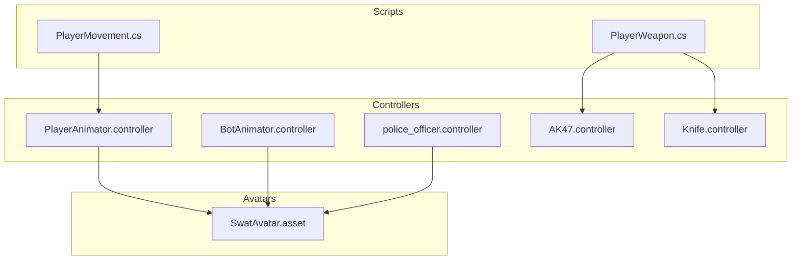
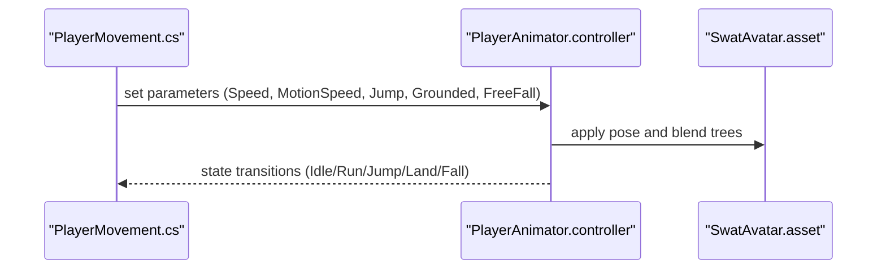
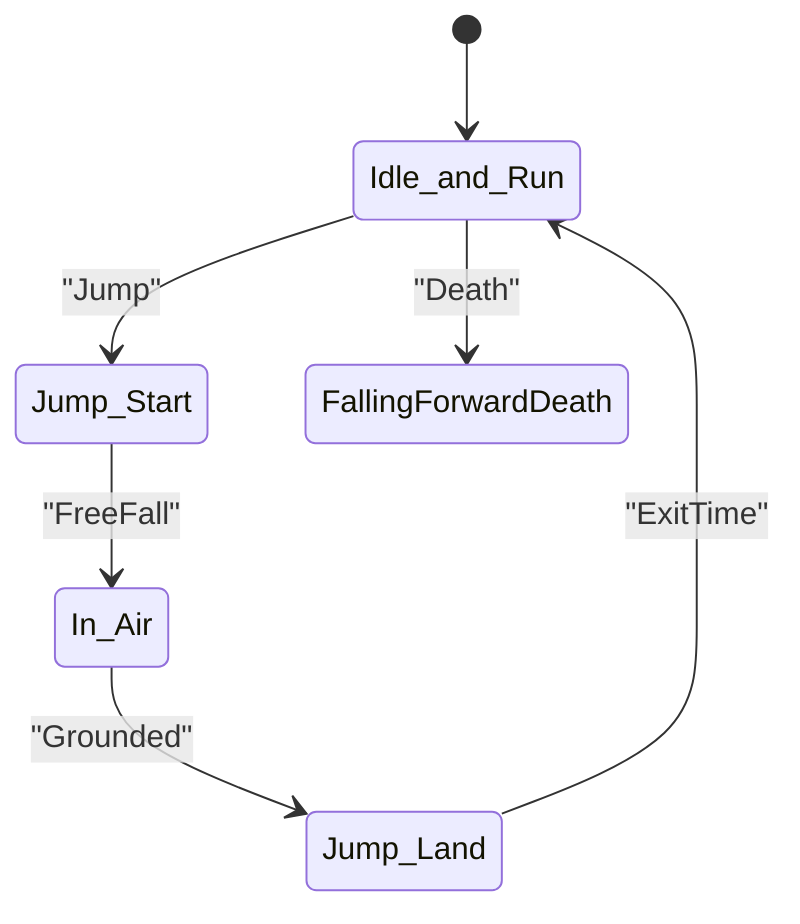
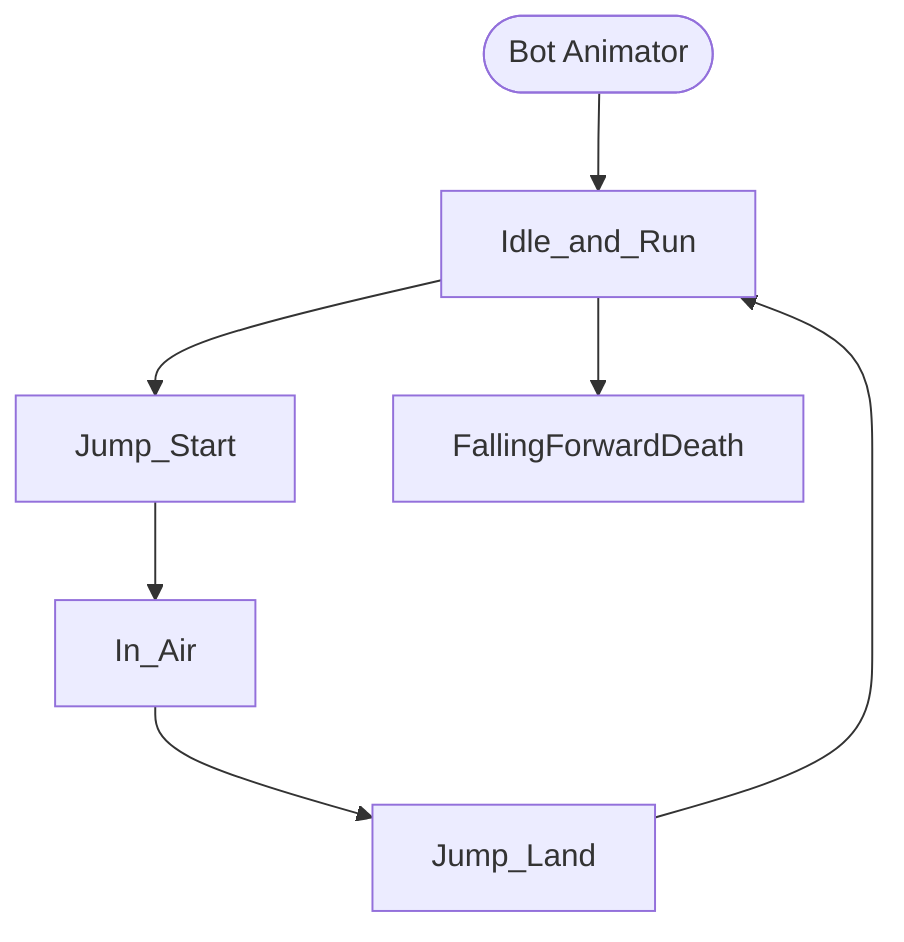
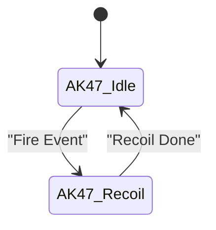
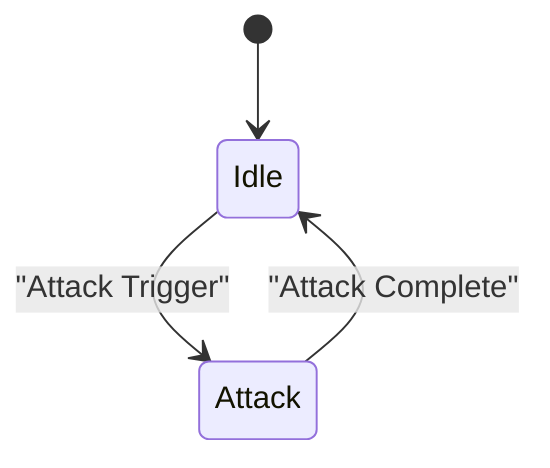
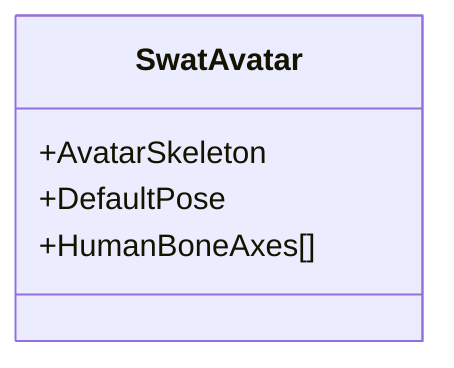
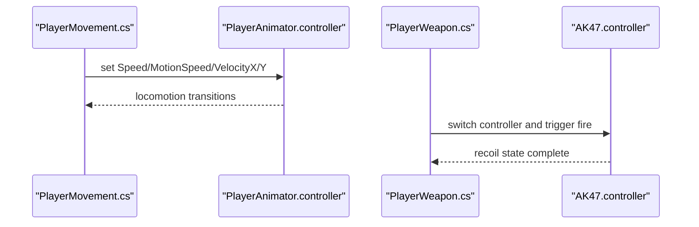
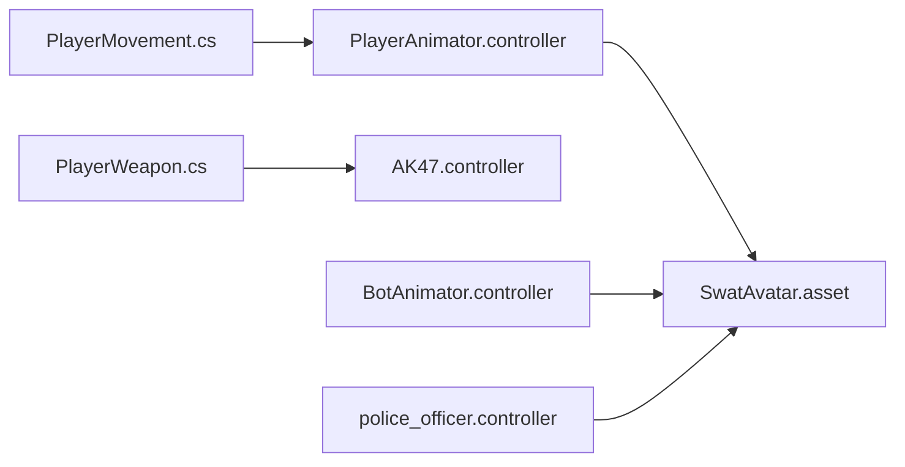

# Animations & Rigging

<cite>
**Referenced Files in This Document**
- [BotAnimator.controller](file://Assets/FPS-Game/Animations/BotAnimation/BotAnimator.controller)
- [PlayerAnimator.controller](file://Assets/FPS-Game/Animations/StarterAssets/MainAni/PlayerAnimator.controller)
- [AK47.controller](file://Assets/FPS-Game/Animations/Weapon/Rifle/AK47/AK47.controller)
- [Knife.controller](file://Assets/FPS-Game/Animations/Weapon/Melee/Knife.controller)
- [police_officer.controller](file://Assets/FPS-Game/Models/police-officer/police_officer.controller)
- [SwatAvatar.asset](file://Assets/FPS-Game/Models/Swat/SwatAvatar.asset)
- [PlayerMovement.cs](file://Assets/FPS-Game/Scripts/PlayerMovement.cs)
- [PlayerWeapon.cs](file://Assets/FPS-Game/Scripts/PlayerWeapon.cs)
</cite>

## Table of Contents
1. [Introduction](#introduction)
2. [Project Structure](#project-structure)
3. [Core Components](#core-components)
4. [Architecture Overview](#architecture-overview)
5. [Detailed Component Analysis](#detailed-component-analysis)
6. [Dependency Analysis](#dependency-analysis)
7. [Performance Considerations](#performance-considerations)
8. [Troubleshooting Guide](#troubleshooting-guide)
9. [Conclusion](#conclusion)

## Introduction
This document describes the animation system for character movement, weapon handling, and facial rigging across bots and players. It explains the animation hierarchy for locomotion (idle, walk, run, jump, fall), combat states (firing, reloading, aiming), and death states. It also documents controller setups, blend trees, state machine transitions, weapon-specific animations, parameter-driven blending, procedural animation techniques, and performance considerations for 60fps gameplay.

## Project Structure
The animation system is organized around:
- Character controllers: bot and player locomotion controllers
- Weapon controllers: rifle, pistol, and melee weapon controllers
- Facial rigging: avatar definition for facial controls
- Scripts: movement and weapon management that drive animation parameters

**Diagram sources**
- [PlayerAnimator.controller:164-238](file://Assets/FPS-Game/Animations/StarterAssets/MainAni/PlayerAnimator.controller#L164-L238)
- [BotAnimator.controller:156-224](file://Assets/FPS-Game/Animations/BotAnimation/BotAnimator.controller#L156-L224)
- [police_officer.controller:164-238](file://Assets/FPS-Game/Models/police-officer/police_officer.controller#L164-L238)
- [AK47.controller:29-49](file://Assets/FPS-Game/Animations/Weapon/Rifle/AK47/AK47.controller#L29-L49)
- [Knife.controller:83-109](file://Assets/FPS-Game/Animations/Weapon/Melee/Knife.controller#L83-L109)
- [SwatAvatar.asset:1-20](file://Assets/FPS-Game/Models/Swat/SwatAvatar.asset#L1-L20)
- [PlayerMovement.cs:1-158](file://Assets/FPS-Game/Scripts/PlayerMovement.cs#L1-L158)
- [PlayerWeapon.cs:1-25](file://Assets/FPS-Game/Scripts/PlayerWeapon.cs#L1-L25)

**Section sources**
- [PlayerAnimator.controller:164-238](file://Assets/FPS-Game/Animations/StarterAssets/MainAni/PlayerAnimator.controller#L164-L238)
- [BotAnimator.controller:156-224](file://Assets/FPS-Game/Animations/BotAnimation/BotAnimator.controller#L156-L224)
- [police_officer.controller:164-238](file://Assets/FPS-Game/Models/police-officer/police_officer.controller#L164-L238)
- [AK47.controller:29-49](file://Assets/FPS-Game/Animations/Weapon/Rifle/AK47/AK47.controller#L29-L49)
- [Knife.controller:83-109](file://Assets/FPS-Game/Animations/Weapon/Melee/Knife.controller#L83-L109)
- [SwatAvatar.asset:1-20](file://Assets/FPS-Game/Models/Swat/SwatAvatar.asset#L1-L20)
- [PlayerMovement.cs:1-158](file://Assets/FPS-Game/Scripts/PlayerMovement.cs#L1-L158)
- [PlayerWeapon.cs:1-25](file://Assets/FPS-Game/Scripts/PlayerWeapon.cs#L1-L25)

## Core Components
- Player locomotion controller: defines idle/run/jump/fall/death states and blends via parameter-driven blend trees
- Bot locomotion controller: mirrors player locomotion with grounded/freefall transitions
- Weapon controllers: separate controllers for rifle and melee, each with idle and action states
- Facial rigging: avatar asset defines skeleton and human bone axes for facial controls

Key controller parameters observed:
- Player: Speed, Jump, Grounded, FreeFall, MotionSpeed, VelocityX, VelocityY
- Rifle weapon: none defined (state-based)
- Melee weapon: Attack trigger

**Section sources**
- [PlayerAnimator.controller:171-213](file://Assets/FPS-Game/Animations/StarterAssets/MainAni/PlayerAnimator.controller#L171-L213)
- [BotAnimator.controller:163-193](file://Assets/FPS-Game/Animations/BotAnimation/BotAnimator.controller#L163-L193)
- [police_officer.controller:171-213](file://Assets/FPS-Game/Models/police-officer/police_officer.controller#L171-L213)
- [AK47.controller:36-36](file://Assets/FPS-Game/Animations/Weapon/Rifle/AK47/AK47.controller#L36-L36)
- [Knife.controller:90-96](file://Assets/FPS-Game/Animations/Weapon/Melee/Knife.controller#L90-L96)

## Architecture Overview
The animation architecture separates locomotion and weapon animations into distinct layers/controllers. Movement scripts feed locomotion parameters; weapon scripts switch controllers and trigger weapon-specific states.

**Diagram sources**
- [PlayerMovement.cs:102-122](file://Assets/FPS-Game/Scripts/PlayerMovement.cs#L102-L122)
- [PlayerAnimator.controller:171-213](file://Assets/FPS-Game/Animations/StarterAssets/MainAni/PlayerAnimator.controller#L171-L213)
- [SwatAvatar.asset:609-733](file://Assets/FPS-Game/Models/Swat/SwatAvatar.asset#L609-L733)

## Detailed Component Analysis

### Locomotion System (Player)
- States: Idle and Run, Jump Land, In Air, Jump Start, Falling Forward Death
- Blend Trees:
  - Parameter-driven blend tree using MotionSpeed for speed scaling
  - Directional blend tree using VelocityX/Y for strafe/walk/run directions
- Transitions:
  - Jump -> Jump Start
  - Grounded -> Jump Land
  - FreeFall -> In Air
  - Return to Idle/Run on landing

**Diagram sources**
- [PlayerAnimator.controller:271-297](file://Assets/FPS-Game/Animations/StarterAssets/MainAni/PlayerAnimator.controller#L271-L297)
- [PlayerAnimator.controller:461-531](file://Assets/FPS-Game/Animations/StarterAssets/MainAni/PlayerAnimator.controller#L461-L531)

**Section sources**
- [PlayerAnimator.controller:271-297](file://Assets/FPS-Game/Animations/StarterAssets/MainAni/PlayerAnimator.controller#L271-L297)
- [PlayerAnimator.controller:349-394](file://Assets/FPS-Game/Animations/StarterAssets/MainAni/PlayerAnimator.controller#L349-L394)
- [PlayerAnimator.controller:461-531](file://Assets/FPS-Game/Animations/StarterAssets/MainAni/PlayerAnimator.controller#L461-L531)

### Locomotion System (Bot)
- Similar states and transitions to player
- Uses a dedicated RifleAnim layer and a separate Shoot layer with a weapon mask

**Diagram sources**
- [BotAnimator.controller:251-283](file://Assets/FPS-Game/Animations/BotAnimation/BotAnimator.controller#L251-L283)
- [BotAnimator.controller:396-421](file://Assets/FPS-Game/Animations/BotAnimation/BotAnimator.controller#L396-L421)

**Section sources**
- [BotAnimator.controller:251-283](file://Assets/FPS-Game/Animations/BotAnimation/BotAnimator.controller#L251-L283)
- [BotAnimator.controller:396-421](file://Assets/FPS-Game/Animations/BotAnimation/BotAnimator.controller#L396-L421)

### Weapon Animation System (Rifle)
- Controller: AK47.controller
- States: AK47_Idle, AK47_Recoil
- Transitions: none defined; intended to be triggered by external logic (e.g., firing events)

**Diagram sources**
- [AK47.controller:48-101](file://Assets/FPS-Game/Animations/Weapon/Rifle/AK47/AK47.controller#L48-L101)

**Section sources**
- [AK47.controller:48-101](file://Assets/FPS-Game/Animations/Weapon/Rifle/AK47/AK47.controller#L48-L101)

### Weapon Animation System (Melee)
- Controller: Knife.controller
- States: Idle, Attack
- Transition: Attack -> Idle on completion; Idle -> Attack on Attack trigger

**Diagram sources**
- [Knife.controller:56-81](file://Assets/FPS-Game/Animations/Weapon/Melee/Knife.controller#L56-L81)
- [Knife.controller:136-159](file://Assets/FPS-Game/Animations/Weapon/Melee/Knife.controller#L136-L159)

**Section sources**
- [Knife.controller:56-81](file://Assets/FPS-Game/Animations/Weapon/Melee/Knife.controller#L56-L81)
- [Knife.controller:136-159](file://Assets/FPS-Game/Animations/Weapon/Melee/Knife.controller#L136-L159)

### Facial Rigging
- Avatar asset defines skeleton, default pose, and human bone axes for facial controls
- Supports procedural facial animation via bone axes and limits

**Diagram sources**
- [SwatAvatar.asset:1-20](file://Assets/FPS-Game/Models/Swat/SwatAvatar.asset#L1-L20)
- [SwatAvatar.asset:609-733](file://Assets/FPS-Game/Models/Swat/SwatAvatar.asset#L609-L733)

**Section sources**
- [SwatAvatar.asset:1-20](file://Assets/FPS-Game/Models/Swat/SwatAvatar.asset#L1-L20)
- [SwatAvatar.asset:609-733](file://Assets/FPS-Game/Models/Swat/SwatAvatar.asset#L609-L733)

### Animation Triggering and Parameter-Driven Blending
- Movement scripts set parameters that drive locomotion controller:
  - Speed, MotionSpeed, VelocityX, VelocityY, Jump, Grounded, FreeFall
- Weapon scripts switch controllers and trigger states:
  - Rifle: fire event triggers recoil state
  - Melee: Attack trigger switches to attack state

**Diagram sources**
- [PlayerMovement.cs:102-122](file://Assets/FPS-Game/Scripts/PlayerMovement.cs#L102-L122)
- [PlayerAnimator.controller:171-213](file://Assets/FPS-Game/Animations/StarterAssets/MainAni/PlayerAnimator.controller#L171-L213)
- [PlayerWeapon.cs:1-25](file://Assets/FPS-Game/Scripts/PlayerWeapon.cs#L1-L25)
- [AK47.controller:48-101](file://Assets/FPS-Game/Animations/Weapon/Rifle/AK47/AK47.controller#L48-L101)

**Section sources**
- [PlayerMovement.cs:102-122](file://Assets/FPS-Game/Scripts/PlayerMovement.cs#L102-L122)
- [PlayerAnimator.controller:171-213](file://Assets/FPS-Game/Animations/StarterAssets/MainAni/PlayerAnimator.controller#L171-L213)
- [PlayerWeapon.cs:1-25](file://Assets/FPS-Game/Scripts/PlayerWeapon.cs#L1-L25)
- [AK47.controller:48-101](file://Assets/FPS-Game/Animations/Weapon/Rifle/AK47/AK47.controller#L48-L101)

## Dependency Analysis
- Controllers depend on avatar skeleton for pose application
- Movement scripts supply parameters consumed by locomotion controllers
- Weapon scripts select weapon controllers and emit triggers
- Bot controller composes multiple layers (RifleAnim, Shoot) with masks

**Diagram sources**
- [PlayerMovement.cs:1-158](file://Assets/FPS-Game/Scripts/PlayerMovement.cs#L1-L158)
- [PlayerAnimator.controller:164-238](file://Assets/FPS-Game/Animations/StarterAssets/MainAni/PlayerAnimator.controller#L164-L238)
- [PlayerWeapon.cs:1-25](file://Assets/FPS-Game/Scripts/PlayerWeapon.cs#L1-L25)
- [AK47.controller:29-49](file://Assets/FPS-Game/Animations/Weapon/Rifle/AK47/AK47.controller#L29-L49)
- [SwatAvatar.asset:1-20](file://Assets/FPS-Game/Models/Swat/SwatAvatar.asset#L1-L20)
- [BotAnimator.controller:156-224](file://Assets/FPS-Game/Animations/BotAnimation/BotAnimator.controller#L156-L224)
- [police_officer.controller:164-238](file://Assets/FPS-Game/Models/police-officer/police_officer.controller#L164-L238)

**Section sources**
- [PlayerMovement.cs:1-158](file://Assets/FPS-Game/Scripts/PlayerMovement.cs#L1-L158)
- [PlayerAnimator.controller:164-238](file://Assets/FPS-Game/Animations/StarterAssets/MainAni/PlayerAnimator.controller#L164-L238)
- [PlayerWeapon.cs:1-25](file://Assets/FPS-Game/Scripts/PlayerWeapon.cs#L1-L25)
- [AK47.controller:29-49](file://Assets/FPS-Game/Animations/Weapon/Rifle/AK47/AK47.controller#L29-L49)
- [SwatAvatar.asset:1-20](file://Assets/FPS-Game/Models/Swat/SwatAvatar.asset#L1-L20)
- [BotAnimator.controller:156-224](file://Assets/FPS-Game/Animations/BotAnimation/BotAnimator.controller#L156-L224)
- [police_officer.controller:164-238](file://Assets/FPS-Game/Models/police-officer/police_officer.controller#L164-L238)

## Performance Considerations
- Blend trees:
  - Use normalized blend values for directional movement to reduce computational overhead
  - Prefer direct blend parameters aligned with movement direction to minimize branching
- Parameter-driven transitions:
  - Keep parameter updates minimal and consistent per frame to avoid stutter
  - Use exit times and fixed durations judiciously to prevent long-latency transitions
- Compression and playback:
  - Enable compression on clips where suitable to reduce memory footprint
  - Cap playback speed to 1.0 for most animations; scale only when necessary
- Synchronization:
  - Networked gameplay should synchronize state machines via authoritative movement scripts and controller parameters
  - Avoid heavy procedural animation in hot loops; pre-bake where possible
- Platform-specific:
  - Lower resolution or fewer blend tree nodes on lower-tier devices
  - Use GPU skinning and efficient avatar configurations

[No sources needed since this section provides general guidance]

## Troubleshooting Guide
- No movement blending:
  - Verify Speed and MotionSpeed parameters are being set by movement scripts
  - Confirm blend trees use the correct parameters and thresholds
- Stuck in air or landing:
  - Ensure Grounded and FreeFall flags are toggled correctly
  - Check transition conditions and exit times
- Weapon recoil not playing:
  - Confirm fire events trigger the recoil state in the weapon controller
  - Verify controller selection and state transitions are configured
- Facial animation issues:
  - Validate avatar bone axes and limits align with facial targets
  - Ensure procedural controls do not exceed axis limits

**Section sources**
- [PlayerMovement.cs:102-122](file://Assets/FPS-Game/Scripts/PlayerMovement.cs#L102-L122)
- [PlayerAnimator.controller:171-213](file://Assets/FPS-Game/Animations/StarterAssets/MainAni/PlayerAnimator.controller#L171-L213)
- [AK47.controller:48-101](file://Assets/FPS-Game/Animations/Weapon/Rifle/AK47/AK47.controller#L48-L101)
- [SwatAvatar.asset:609-733](file://Assets/FPS-Game/Models/Swat/SwatAvatar.asset#L609-L733)

## Conclusion
The animation system combines parameter-driven locomotion, weapon-specific controllers, and facial rigging to deliver responsive, synchronized gameplay. By structuring controllers with clear blend trees and transitions, and by feeding reliable parameters from movement and weapon scripts, the system supports smooth 60fps performance across platforms while enabling robust network synchronization.