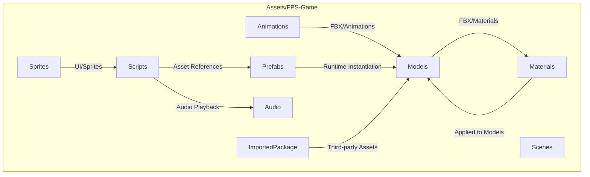
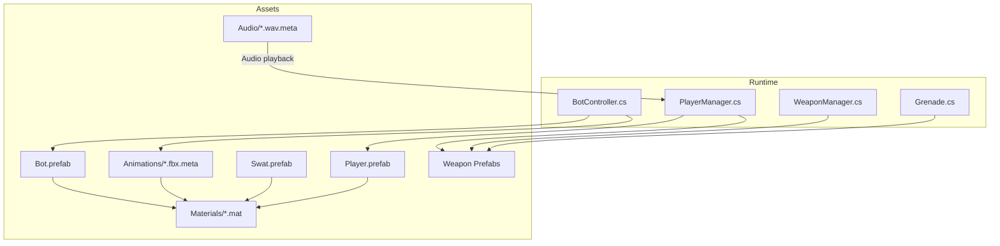
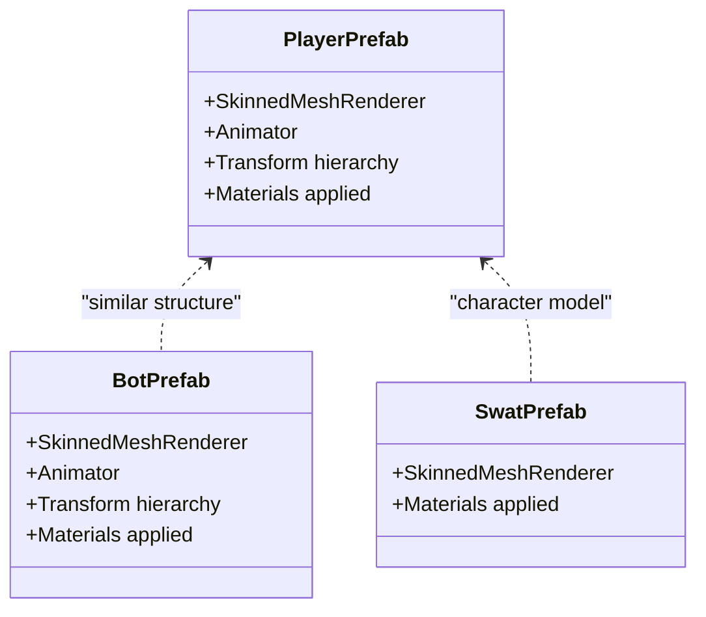
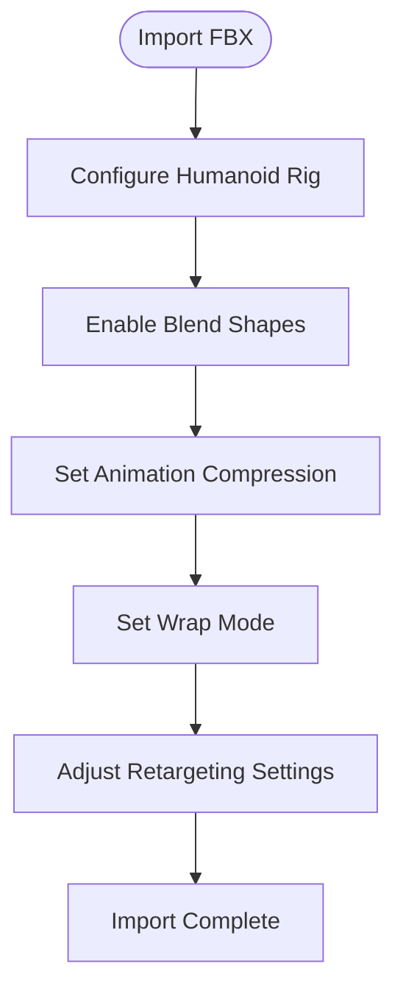
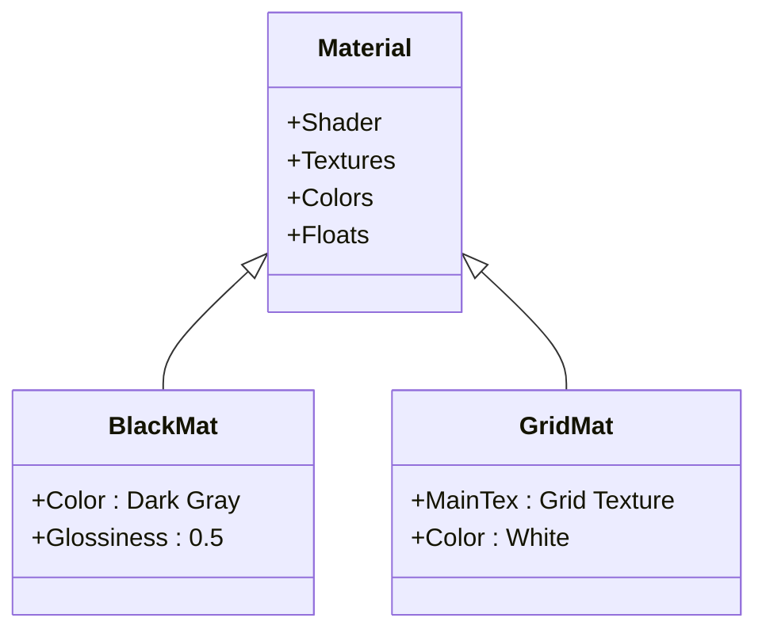
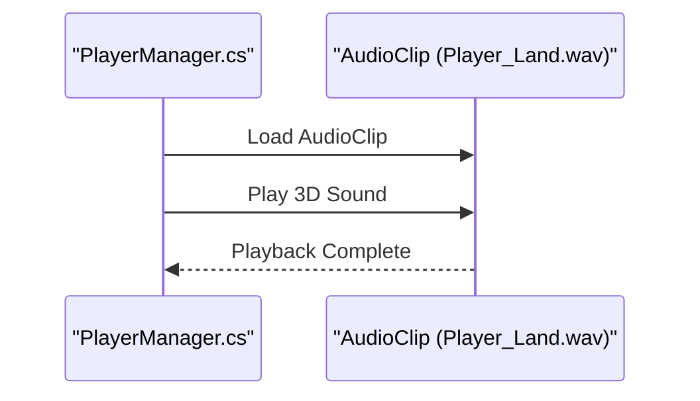
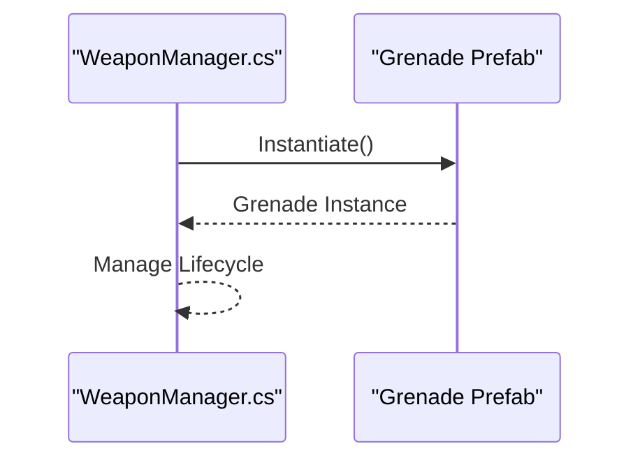
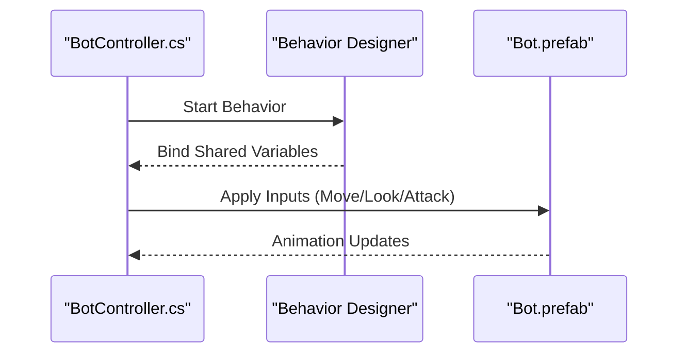
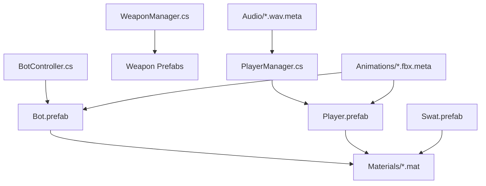

# Asset Management

<cite>
**Referenced Files in This Document**
- [Player.prefab](file://Assets/FPS-Game/Prefabs/Player/Player.prefab)
- [Bot.prefab](file://Assets/FPS-Game/Prefabs/Bot/Bot.prefab)
- [Swat.prefab](file://Assets/FPS-Game/Models/Swat/Swat.prefab)
- [M91.fbx.meta](file://Assets/FPS-Game/Models/Sniper Rifle/M91.fbx.meta)
- [Rifle Idle.fbx.meta](file://Assets/FPS-Game/Animations/Player/Rifle Idle.fbx.meta)
- [Player_Land.wav.meta](file://Assets/FPS-Game/Audio/Player_Land.wav.meta)
- [Black.mat](file://Assets/FPS-Game/Materials/Black.mat)
- [Grid.mat](file://Assets/FPS-Game/Materials/Grid.mat)
- [BotController.cs](file://Assets/FPS-Game/Scripts/Bot/BotController.cs)
- [PlayerManager.cs](file://Assets/FPS-Game/Scripts/PlayerManager.cs)
- [WeaponManager.cs](file://Assets/FPS-Game/Scripts/WeaponManager.cs)
- [Grenade.cs](file://Assets/FPS-Game/Scripts/Grenade.cs)
</cite>

## Table of Contents
1. [Introduction](#introduction)
2. [Project Structure](#project-structure)
3. [Core Components](#core-components)
4. [Architecture Overview](#architecture-overview)
5. [Detailed Component Analysis](#detailed-component-analysis)
6. [Dependency Analysis](#dependency-analysis)
7. [Performance Considerations](#performance-considerations)
8. [Troubleshooting Guide](#troubleshooting-guide)
9. [Conclusion](#conclusion)
10. [Appendices](#appendices)

## Introduction
This document describes the asset management system for the FPS game project, focusing on the organization, naming, import pipeline, and runtime usage of 3D models, animations, audio assets, prefabs, and materials. It covers:
- Asset organization structure and naming conventions
- Import pipeline and quality settings
- Character models (player and bots), weapons, environmental props, and UI sprites
- Usage patterns for loading, instantiating, and managing assets at runtime
- Optimization strategies (LOD, memory, cross-platform compatibility)
- Style customization for materials and animations
- Versioning, updates, and QA processes

## Project Structure
The asset system is organized under the Assets/FPS-Game folder with dedicated subfolders for Models, Animations, Audio, Materials, Prefabs, Scripts, Sprites, and imported packages. The structure supports scalable asset management and clear separation of concerns.

**Section sources**
- [Player.prefab:1-800](file://Assets/FPS-Game/Prefabs/Player/Player.prefab#L1-L800)
- [Bot.prefab:1-800](file://Assets/FPS-Game/Prefabs/Bot/Bot.prefab#L1-L800)
- [Swat.prefab:1-800](file://Assets/FPS-Game/Models/Swat/Swat.prefab#L1-L800)

## Core Components
- Prefabs: Reusable GameObject templates for players, bots, weapons, effects, and UI elements. They encapsulate components, meshes, materials, and references to scripts.
- Models: 3D assets (FBX) with associated materials and textures. Examples include character models and weapons.
- Animations: FBX animations applied to models via Animator controllers and Humanoid rigs.
- Materials: Shader-based surface definitions used across models.
- Audio: Sound assets configured for 3D spatialization and playback.
- Scripts: Runtime managers and controllers that reference and orchestrate assets.

Key runtime integration points:
- BotController manages behavior-driven activation of prefabs and animation states.
- PlayerManager and WeaponManager expose references to player assets and weapon prefabs.
- Grenade script demonstrates runtime instantiation and lifecycle.

**Section sources**
- [BotController.cs:1-485](file://Assets/FPS-Game/Scripts/Bot/BotController.cs#L1-L485)
- [PlayerManager.cs:1-34](file://Assets/FPS-Game/Scripts/PlayerManager.cs#L1-L34)
- [WeaponManager.cs:1-74](file://Assets/FPS-Game/Scripts/WeaponManager.cs#L1-L74)
- [Grenade.cs:1-19](file://Assets/FPS-Game/Scripts/Grenade.cs#L1-L19)

## Architecture Overview
The asset management architecture couples prefabs with scripts to deliver cohesive gameplay experiences. Prefabs define the visual and component structure; scripts manage state transitions, input feeding, and runtime behaviors.

**Diagram sources**
- [BotController.cs:1-485](file://Assets/FPS-Game/Scripts/Bot/BotController.cs#L1-L485)
- [PlayerManager.cs:1-34](file://Assets/FPS-Game/Scripts/PlayerManager.cs#L1-L34)
- [WeaponManager.cs:1-74](file://Assets/FPS-Game/Scripts/WeaponManager.cs#L1-L74)
- [Grenade.cs:1-19](file://Assets/FPS-Game/Scripts/Grenade.cs#L1-L19)
- [Bot.prefab:1-800](file://Assets/FPS-Game/Prefabs/Bot/Bot.prefab#L1-L800)
- [Player.prefab:1-800](file://Assets/FPS-Game/Prefabs/Player/Player.prefab#L1-L800)
- [Swat.prefab:1-800](file://Assets/FPS-Game/Models/Swat/Swat.prefab#L1-L800)
- [M91.fbx.meta:1-110](file://Assets/FPS-Game/Models/Sniper Rifle/M91.fbx.meta#L1-L110)
- [Rifle Idle.fbx.meta:1-885](file://Assets/FPS-Game/Animations/Player/Rifle Idle.fbx.meta#L1-L885)
- [Player_Land.wav.meta:1-23](file://Assets/FPS-Game/Audio/Player_Land.wav.meta#L1-L23)
- [Black.mat:1-84](file://Assets/FPS-Game/Materials/Black.mat#L1-L84)
- [Grid.mat:1-84](file://Assets/FPS-Game/Materials/Grid.mat#L1-L84)

## Detailed Component Analysis

### Prefab-Based Character Models
- Player prefab: Contains skinned meshes, bones, materials, and components for animation and rendering. It serves as the base for player visuals and can be extended with scripts for movement and input.
- Bot prefab: Similar structure to the player, enabling AI-driven animation and behavior.
- Swat model prefab: Demonstrates character modeling with separate head/body meshes and materials.

**Diagram sources**
- [Player.prefab:1-800](file://Assets/FPS-Game/Prefabs/Player/Player.prefab#L1-L800)
- [Bot.prefab:1-800](file://Assets/FPS-Game/Prefabs/Bot/Bot.prefab#L1-L800)
- [Swat.prefab:1-800](file://Assets/FPS-Game/Models/Swat/Swat.prefab#L1-L800)

**Section sources**
- [Player.prefab:1-800](file://Assets/FPS-Game/Prefabs/Player/Player.prefab#L1-L800)
- [Bot.prefab:1-800](file://Assets/FPS-Game/Prefabs/Bot/Bot.prefab#L1-L800)
- [Swat.prefab:1-800](file://Assets/FPS-Game/Models/Swat/Swat.prefab#L1-L800)

### Animation Pipeline and Import Settings
- Animations are imported from FBX with humanoid rigging and blend shapes enabled. Import settings control compression, wrap mode, and retargeting warnings.
- Example: Rifle Idle.fbx meta shows humanoid description, blend shape import, and animation clips.

**Diagram sources**
- [Rifle Idle.fbx.meta:1-885](file://Assets/FPS-Game/Animations/Player/Rifle Idle.fbx.meta#L1-L885)

**Section sources**
- [Rifle Idle.fbx.meta:1-885](file://Assets/FPS-Game/Animations/Player/Rifle Idle.fbx.meta#L1-L885)

### Materials and Surface Customization
- Materials define shader properties, textures, and colors. Two examples:
  - Black.mat: Simple shader with color tweak.
  - Grid.mat: Uses a texture for tiling patterns.

**Diagram sources**
- [Black.mat:1-84](file://Assets/FPS-Game/Materials/Black.mat#L1-L84)
- [Grid.mat:1-84](file://Assets/FPS-Game/Materials/Grid.mat#L1-L84)

**Section sources**
- [Black.mat:1-84](file://Assets/FPS-Game/Materials/Black.mat#L1-L84)
- [Grid.mat:1-84](file://Assets/FPS-Game/Materials/Grid.mat#L1-L84)

### Audio Assets and Spatial Playback
- Audio assets are configured for 3D spatialization, normalization, and preloading. Example: Player_Land.wav meta shows settings for 3D sound and quality.

**Diagram sources**
- [PlayerManager.cs:1-34](file://Assets/FPS-Game/Scripts/PlayerManager.cs#L1-L34)
- [Player_Land.wav.meta:1-23](file://Assets/FPS-Game/Audio/Player_Land.wav.meta#L1-L23)

**Section sources**
- [Player_Land.wav.meta:1-23](file://Assets/FPS-Game/Audio/Player_Land.wav.meta#L1-L23)
- [PlayerManager.cs:1-34](file://Assets/FPS-Game/Scripts/PlayerManager.cs#L1-L34)

### Runtime Asset Loading and Instantiation Patterns
- Prefabs are referenced by managers and instantiated at runtime for weapons, grenades, and effects.
- Managers expose getters to provide references to prefabs and effects.

**Diagram sources**
- [WeaponManager.cs:1-74](file://Assets/FPS-Game/Scripts/WeaponManager.cs#L1-L74)
- [Grenade.cs:1-19](file://Assets/FPS-Game/Scripts/Grenade.cs#L1-L19)

**Section sources**
- [WeaponManager.cs:1-74](file://Assets/FPS-Game/Scripts/WeaponManager.cs#L1-L74)
- [Grenade.cs:1-19](file://Assets/FPS-Game/Scripts/Grenade.cs#L1-L19)

### AI Behavior and Asset Coordination
- BotController coordinates behavior selection, perception events, and input feeding to prefabs and animations. It binds to Behavior Designer shared variables and switches states based on conditions.

**Diagram sources**
- [BotController.cs:1-485](file://Assets/FPS-Game/Scripts/Bot/BotController.cs#L1-L485)
- [Bot.prefab:1-800](file://Assets/FPS-Game/Prefabs/Bot/Bot.prefab#L1-L800)

**Section sources**
- [BotController.cs:1-485](file://Assets/FPS-Game/Scripts/Bot/BotController.cs#L1-L485)
- [Bot.prefab:1-800](file://Assets/FPS-Game/Prefabs/Bot/Bot.prefab#L1-L800)

## Dependency Analysis
Asset dependencies are primarily resolved through prefabs and script references. Managers own references to prefabs and assets, while prefabs depend on materials and animations.

**Diagram sources**
- [PlayerManager.cs:1-34](file://Assets/FPS-Game/Scripts/PlayerManager.cs#L1-L34)
- [WeaponManager.cs:1-74](file://Assets/FPS-Game/Scripts/WeaponManager.cs#L1-L74)
- [BotController.cs:1-485](file://Assets/FPS-Game/Scripts/Bot/BotController.cs#L1-L485)
- [Player.prefab:1-800](file://Assets/FPS-Game/Prefabs/Player/Player.prefab#L1-L800)
- [Bot.prefab:1-800](file://Assets/FPS-Game/Prefabs/Bot/Bot.prefab#L1-L800)
- [Swat.prefab:1-800](file://Assets/FPS-Game/Models/Swat/Swat.prefab#L1-L800)
- [Rifle Idle.fbx.meta:1-885](file://Assets/FPS-Game/Animations/Player/Rifle Idle.fbx.meta#L1-L885)
- [Player_Land.wav.meta:1-23](file://Assets/FPS-Game/Audio/Player_Land.wav.meta#L1-L23)
- [Black.mat:1-84](file://Assets/FPS-Game/Materials/Black.mat#L1-L84)
- [Grid.mat:1-84](file://Assets/FPS-Game/Materials/Grid.mat#L1-L84)

**Section sources**
- [PlayerManager.cs:1-34](file://Assets/FPS-Game/Scripts/PlayerManager.cs#L1-L34)
- [WeaponManager.cs:1-74](file://Assets/FPS-Game/Scripts/WeaponManager.cs#L1-L74)
- [BotController.cs:1-485](file://Assets/FPS-Game/Scripts/Bot/BotController.cs#L1-L485)

## Performance Considerations
- LOD and draw call reduction:
  - Use SkinnedMeshRenderer efficiently; avoid unnecessary bones and blend shapes.
  - Batch materials and reduce per-instance material variations.
- Animation optimization:
  - Prefer humanoid animations with compression and wrap modes suited to gameplay loops.
  - Minimize additive animations and redundant masks.
- Audio optimization:
  - Preload frequently used sounds; enable 3D spatialization only when needed.
- Cross-platform:
  - Adjust graphics quality settings per platform; use platform-specific build configurations.
  - Validate asset sizes and streaming requirements for mobile targets.
- Memory management:
  - Pool reusable assets (e.g., bullets, effects) to reduce GC pressure.
  - Unload unused assets after scenes change.

[No sources needed since this section provides general guidance]

## Troubleshooting Guide
Common issues and resolutions:
- Missing materials on skinned meshes:
  - Verify material assignments in prefabs and ensure textures are included in builds.
- Animation errors:
  - Confirm humanoid rigging and blend shape import settings; check for retargeting warnings.
- Audio not playing:
  - Ensure AudioClip is marked as 3D and loaded via resources or addressables.
- Prefab instantiation failures:
  - Confirm references are assigned in the inspector and prefabs are present in the build.

**Section sources**
- [Rifle Idle.fbx.meta:1-885](file://Assets/FPS-Game/Animations/Player/Rifle Idle.fbx.meta#L1-L885)
- [Player_Land.wav.meta:1-23](file://Assets/FPS-Game/Audio/Player_Land.wav.meta#L1-L23)
- [Black.mat:1-84](file://Assets/FPS-Game/Materials/Black.mat#L1-L84)
- [Grid.mat:1-84](file://Assets/FPS-Game/Materials/Grid.mat#L1-L84)

## Conclusion
The asset management system leverages prefabs, materials, animations, and scripts to create a scalable and maintainable pipeline. By adhering to naming conventions, import settings, and runtime patterns described here, teams can ensure consistent asset delivery, optimized performance, and smooth cross-platform deployment.

[No sources needed since this section summarizes without analyzing specific files]

## Appendices

### Naming Conventions
- Models: Descriptive names with underscores (e.g., Sniper_Rifle, Swat).
- Animations: Clear action names (e.g., Rifle_Idle, Walking).
- Materials: Descriptive names (e.g., Black, Grid).
- Prefabs: Capitalized nouns (e.g., Player, Bot, AK-47).
- Audio: Descriptive names indicating effect (e.g., Player_Land).

[No sources needed since this section provides general guidance]

### Import Pipeline Checklist
- FBX import settings:
  - Humanoid rigging enabled.
  - Blend shapes imported as needed.
  - Animation compression and wrap mode appropriate.
- Materials:
  - Correct shader assignment.
  - Texture filtering and compression set for target platform.
- Audio:
  - 3D spatialization enabled.
  - Normalization and preload flags set appropriately.

**Section sources**
- [M91.fbx.meta:1-110](file://Assets/FPS-Game/Models/Sniper Rifle/M91.fbx.meta#L1-L110)
- [Rifle Idle.fbx.meta:1-885](file://Assets/FPS-Game/Animations/Player/Rifle Idle.fbx.meta#L1-L885)
- [Player_Land.wav.meta:1-23](file://Assets/FPS-Game/Audio/Player_Land.wav.meta#L1-L23)

### Versioning and QA
- Versioning:
  - Use asset GUIDs and version control for incremental updates.
- QA:
  - Validate animations on multiple rigs.
  - Test materials under various lighting scenarios.
  - Verify audio spatialization and volume balance.

[No sources needed since this section provides general guidance]