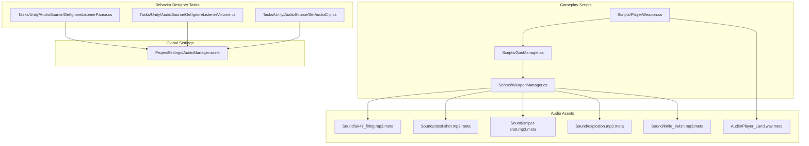
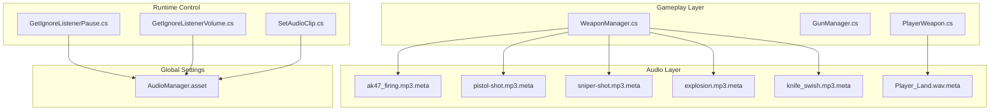
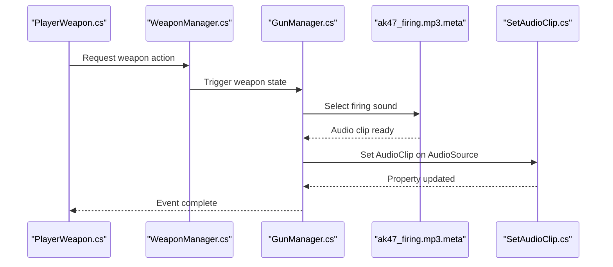
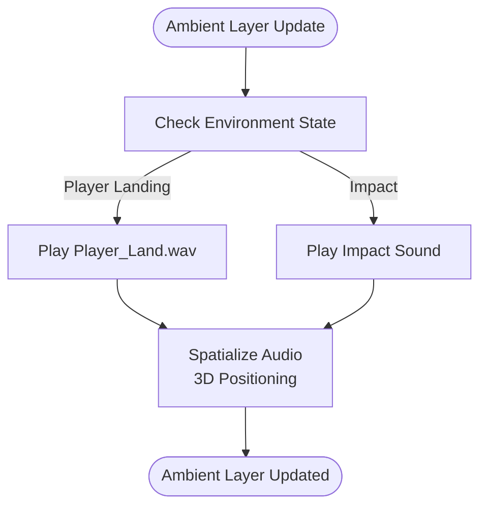
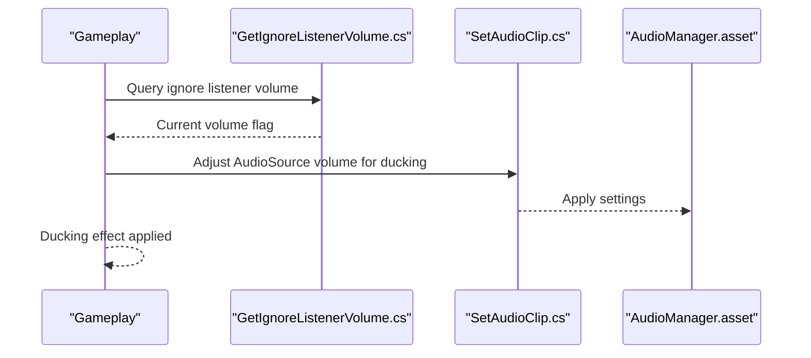
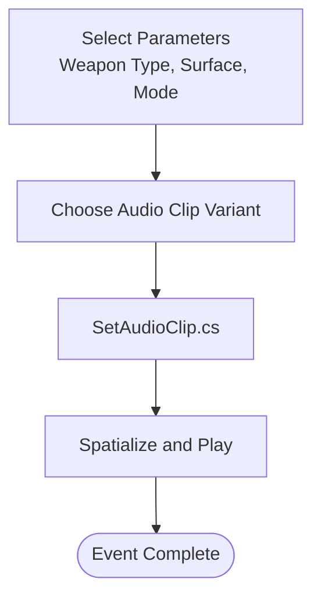
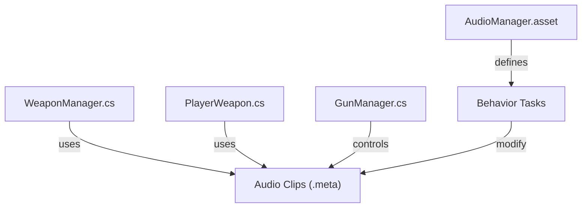

# Audio & Sound Design

<cite>
**Referenced Files in This Document**
- [Player_Land.wav.meta](file://Assets/FPS-Game/Audio/Player_Land.wav.meta)
- [ak47_firing.mp3.meta](file://Assets/FPS-Game/Sound/ak47_firing.mp3.meta)
- [pistol-shot.mp3.meta](file://Assets/FPS-Game/Sound/pistol-shot.mp3.meta)
- [sniper-shot.mp3.meta](file://Assets/FPS-Game/Sound/sniper-shot.mp3.meta)
- [explosion.mp3.meta](file://Assets/FPS-Game/Sound/explosion.mp3.meta)
- [knife_swish.mp3.meta](file://Assets/FPS-Game/Sound/knife_swish.mp3.meta)
- [PlayerWeapon.cs](file://Assets/FPS-Game/Scripts/PlayerWeapon.cs)
- [GunManager.cs](file://Assets/FPS-Game/Scripts/GunManager.cs)
- [WeaponManager.cs](file://Assets/FPS-Game/Scripts/WeaponManager.cs)
- [GetIgnoreListenerPause.cs](file://Assets/Behavior Designer/Runtime/Tasks/Unity/AudioSource/GetIgnoreListenerPause.cs)
- [GetIgnoreListenerVolume.cs](file://Assets/Behavior Designer/Runtime/Tasks/Unity/AudioSource/GetIgnoreListenerVolume.cs)
- [SetAudioClip.cs](file://Assets/Behavior Designer/Runtime/Tasks/Unity/AudioSource/SetAudioClip.cs)
- [AudioManager.asset](file://ProjectSettings/AudioManager.asset)
</cite>

## Table of Contents
1. [Introduction](#introduction)
2. [Project Structure](#project-structure)
3. [Core Components](#core-components)
4. [Architecture Overview](#architecture-overview)
5. [Detailed Component Analysis](#detailed-component-analysis)
6. [Dependency Analysis](#dependency-analysis)
7. [Performance Considerations](#performance-considerations)
8. [Troubleshooting Guide](#troubleshooting-guide)
9. [Conclusion](#conclusion)
10. [Appendices](#appendices)

## Introduction
This document describes the audio system for the game with a focus on sound effects, music tracks, and audio mixing. It covers weapon sound effects (firearms, melee, explosions), ambient audio layers, spatial audio implementation, and 3D positioning for immersive soundscapes. It also documents mixer configuration, volume controls, and dynamic audio ducking for gameplay elements, along with workflows for integrating imported audio assets from third-party packages. Practical examples illustrate audio event triggering, parameter-based sound variation, and runtime audio modification. Finally, it provides optimization guidelines for different platforms, compressed audio formats, memory-efficient streaming, quality standards, and localization support.

## Project Structure
The audio system is organized around imported audio assets and associated metadata, with gameplay scripts that orchestrate weapon-related audio events. The key areas are:
- Audio assets: located under Assets/FPS-Game/Sound and Assets/FPS-Game/Audio
- Gameplay scripts: located under Assets/FPS-Game/Scripts, notably related to weapons and audio control
- Behavior Designer tasks: Unity-integrated tasks for AudioSource manipulation
- Global audio settings: ProjectSettings/AudioManager.asset

**Diagram sources**
- [PlayerWeapon.cs:1-25](file://Assets/FPS-Game/Scripts/PlayerWeapon.cs#L1-L25)
- [GunManager.cs:1-15](file://Assets/FPS-Game/Scripts/GunManager.cs#L1-L15)
- [WeaponManager.cs:1-74](file://Assets/FPS-Game/Scripts/WeaponManager.cs#L1-L74)
- [ak47_firing.mp3.meta:1-24](file://Assets/FPS-Game/Sound/ak47_firing.mp3.meta#L1-L24)
- [pistol-shot.mp3.meta:1-24](file://Assets/FPS-Game/Sound/pistol-shot.mp3.meta#L1-L24)
- [sniper-shot.mp3.meta:1-24](file://Assets/FPS-Game/Sound/sniper-shot.mp3.meta#L1-L24)
- [explosion.mp3.meta:1-24](file://Assets/FPS-Game/Sound/explosion.mp3.meta#L1-L24)
- [knife_swish.mp3.meta:1-24](file://Assets/FPS-Game/Sound/knife_swish.mp3.meta#L1-L24)
- [Player_Land.wav.meta:1-24](file://Assets/FPS-Game/Audio/Player_Land.wav.meta#L1-L24)
- [GetIgnoreListenerPause.cs:1-40](file://Assets/Behavior Designer/Runtime/Tasks/Unity/AudioSource/GetIgnoreListenerPause.cs#L1-L40)
- [GetIgnoreListenerVolume.cs:1-40](file://Assets/Behavior Designer/Runtime/Tasks/Unity/AudioSource/GetIgnoreListenerVolume.cs#L1-L40)
- [SetAudioClip.cs:1-40](file://Assets/Behavior Designer/Runtime/Tasks/Unity/AudioSource/SetAudioClip.cs#L1-L40)
- [AudioManager.asset](file://ProjectSettings/AudioManager.asset)

**Section sources**
- [PlayerWeapon.cs:1-25](file://Assets/FPS-Game/Scripts/PlayerWeapon.cs#L1-L25)
- [GunManager.cs:1-15](file://Assets/FPS-Game/Scripts/GunManager.cs#L1-L15)
- [WeaponManager.cs:1-74](file://Assets/FPS-Game/Scripts/WeaponManager.cs#L1-L74)
- [ak47_firing.mp3.meta:1-24](file://Assets/FPS-Game/Sound/ak47_firing.mp3.meta#L1-L24)
- [pistol-shot.mp3.meta:1-24](file://Assets/FPS-Game/Sound/pistol-shot.mp3.meta#L1-L24)
- [sniper-shot.mp3.meta:1-24](file://Assets/FPS-Game/Sound/sniper-shot.mp3.meta#L1-L24)
- [explosion.mp3.meta:1-24](file://Assets/FPS-Game/Sound/explosion.mp3.meta#L1-L24)
- [knife_swish.mp3.meta:1-24](file://Assets/FPS-Game/Sound/knife_swish.mp3.meta#L1-L24)
- [Player_Land.wav.meta:1-24](file://Assets/FPS-Game/Audio/Player_Land.wav.meta#L1-L24)
- [GetIgnoreListenerPause.cs:1-40](file://Assets/Behavior Designer/Runtime/Tasks/Unity/AudioSource/GetIgnoreListenerPause.cs#L1-L40)
- [GetIgnoreListenerVolume.cs:1-40](file://Assets/Behavior Designer/Runtime/Tasks/Unity/AudioSource/GetIgnoreListenerVolume.cs#L1-L40)
- [SetAudioClip.cs:1-40](file://Assets/Behavior Designer/Runtime/Tasks/Unity/AudioSource/SetAudioClip.cs#L1-L40)
- [AudioManager.asset](file://ProjectSettings/AudioManager.asset)

## Core Components
- Weapon sound effects: firearm firing, reload, impact, and environment interactions are represented by imported audio clips with 3D spatialization enabled.
- Ambient audio layers: landing sounds and other environment cues are present as separate audio assets.
- Spatial audio and 3D positioning: audio clips are configured with 3D audio enabled, enabling positional playback.
- Audio mixer configuration: global audio settings are managed via ProjectSettings/AudioManager.asset.
- Dynamic audio ducking: Behavior Designer tasks expose AudioSource properties useful for runtime ducking scenarios (e.g., ignore listener volume and pause).
- Parameter-based sound variation: while not explicitly implemented in the referenced scripts, the presence of multiple weapon sound variants indicates potential for parameter-driven selection.
- Runtime audio modification: Behavior Designer tasks allow setting audio clips and toggling AudioSource properties at runtime.

**Section sources**
- [ak47_firing.mp3.meta:1-24](file://Assets/FPS-Game/Sound/ak47_firing.mp3.meta#L1-L24)
- [pistol-shot.mp3.meta:1-24](file://Assets/FPS-Game/Sound/pistol-shot.mp3.meta#L1-L24)
- [sniper-shot.mp3.meta:1-24](file://Assets/FPS-Game/Sound/sniper-shot.mp3.meta#L1-L24)
- [explosion.mp3.meta:1-24](file://Assets/FPS-Game/Sound/explosion.mp3.meta#L1-L24)
- [knife_swish.mp3.meta:1-24](file://Assets/FPS-Game/Sound/knife_swish.mp3.meta#L1-L24)
- [Player_Land.wav.meta:1-24](file://Assets/FPS-Game/Audio/Player_Land.wav.meta#L1-L24)
- [AudioManager.asset](file://ProjectSettings/AudioManager.asset)
- [GetIgnoreListenerPause.cs:1-40](file://Assets/Behavior Designer/Runtime/Tasks/Unity/AudioSource/GetIgnoreListenerPause.cs#L1-L40)
- [GetIgnoreListenerVolume.cs:1-40](file://Assets/Behavior Designer/Runtime/Tasks/Unity/AudioSource/GetIgnoreListenerVolume.cs#L1-L40)
- [SetAudioClip.cs:1-40](file://Assets/Behavior Designer/Runtime/Tasks/Unity/AudioSource/SetAudioClip.cs#L1-L40)

## Architecture Overview
The audio architecture integrates imported assets with gameplay scripts and Behavior Designer tasks. Gameplay scripts coordinate weapon-related audio events, while Behavior Designer tasks provide runtime control over AudioSource properties. Global audio settings define the mixer and platform-specific behaviors.

**Diagram sources**
- [WeaponManager.cs:1-74](file://Assets/FPS-Game/Scripts/WeaponManager.cs#L1-L74)
- [GunManager.cs:1-15](file://Assets/FPS-Game/Scripts/GunManager.cs#L1-L15)
- [PlayerWeapon.cs:1-25](file://Assets/FPS-Game/Scripts/PlayerWeapon.cs#L1-L25)
- [ak47_firing.mp3.meta:1-24](file://Assets/FPS-Game/Sound/ak47_firing.mp3.meta#L1-L24)
- [pistol-shot.mp3.meta:1-24](file://Assets/FPS-Game/Sound/pistol-shot.mp3.meta#L1-L24)
- [sniper-shot.mp3.meta:1-24](file://Assets/FPS-Game/Sound/sniper-shot.mp3.meta#L1-L24)
- [explosion.mp3.meta:1-24](file://Assets/FPS-Game/Sound/explosion.mp3.meta#L1-L24)
- [knife_swish.mp3.meta:1-24](file://Assets/FPS-Game/Sound/knife_swish.mp3.meta#L1-L24)
- [Player_Land.wav.meta:1-24](file://Assets/FPS-Game/Audio/Player_Land.wav.meta#L1-L24)
- [GetIgnoreListenerPause.cs:1-40](file://Assets/Behavior Designer/Runtime/Tasks/Unity/AudioSource/GetIgnoreListenerPause.cs#L1-L40)
- [GetIgnoreListenerVolume.cs:1-40](file://Assets/Behavior Designer/Runtime/Tasks/Unity/AudioSource/GetIgnoreListenerVolume.cs#L1-L40)
- [SetAudioClip.cs:1-40](file://Assets/Behavior Designer/Runtime/Tasks/Unity/AudioSource/SetAudioClip.cs#L1-L40)
- [AudioManager.asset](file://ProjectSettings/AudioManager.asset)

## Detailed Component Analysis

### Weapon Sound Effects
- Firearms: Multiple weapon variants include firing and reload sounds. These assets are configured with 3D audio enabled and standard sample rate and quality settings.
- Melee: Knife swishing sound is available as a 3D audio asset.
- Explosions: Explosion sound is available as a 3D audio asset.
- Environment interactions: Landing sound is available as a 3D audio asset.

Implementation pattern:
- Gameplay scripts maintain references to weapon prefabs and effects. Audio events are triggered when weapon actions occur (e.g., firing, reloading, explosion).
- Behavior Designer tasks enable runtime control of AudioSource properties, supporting dynamic ducking and transitions.

**Diagram sources**
- [PlayerWeapon.cs:1-25](file://Assets/FPS-Game/Scripts/PlayerWeapon.cs#L1-L25)
- [WeaponManager.cs:1-74](file://Assets/FPS-Game/Scripts/WeaponManager.cs#L1-L74)
- [GunManager.cs:1-15](file://Assets/FPS-Game/Scripts/GunManager.cs#L1-L15)
- [ak47_firing.mp3.meta:1-24](file://Assets/FPS-Game/Sound/ak47_firing.mp3.meta#L1-L24)
- [SetAudioClip.cs:1-40](file://Assets/Behavior Designer/Runtime/Tasks/Unity/AudioSource/SetAudioClip.cs#L1-L40)

**Section sources**
- [ak47_firing.mp3.meta:1-24](file://Assets/FPS-Game/Sound/ak47_firing.mp3.meta#L1-L24)
- [pistol-shot.mp3.meta:1-24](file://Assets/FPS-Game/Sound/pistol-shot.mp3.meta#L1-L24)
- [sniper-shot.mp3.meta:1-24](file://Assets/FPS-Game/Sound/sniper-shot.mp3.meta#L1-L24)
- [explosion.mp3.meta:1-24](file://Assets/FPS-Game/Sound/explosion.mp3.meta#L1-L24)
- [knife_swish.mp3.meta:1-24](file://Assets/FPS-Game/Sound/knife_swish.mp3.meta#L1-L24)
- [Player_Land.wav.meta:1-24](file://Assets/FPS-Game/Audio/Player_Land.wav.meta#L1-L24)
- [PlayerWeapon.cs:1-25](file://Assets/FPS-Game/Scripts/PlayerWeapon.cs#L1-L25)
- [WeaponManager.cs:1-74](file://Assets/FPS-Game/Scripts/WeaponManager.cs#L1-L74)
- [GunManager.cs:1-15](file://Assets/FPS-Game/Scripts/GunManager.cs#L1-L15)
- [SetAudioClip.cs:1-40](file://Assets/Behavior Designer/Runtime/Tasks/Unity/AudioSource/SetAudioClip.cs#L1-L40)

### Ambient Audio Layers and Spatial Audio
- Ambient layers: Landing sounds and environmental impacts are represented by dedicated audio assets.
- Spatial audio: All weapon and impact sounds are configured with 3D audio enabled, allowing positional playback for immersion.

**Diagram sources**
- [Player_Land.wav.meta:1-24](file://Assets/FPS-Game/Audio/Player_Land.wav.meta#L1-L24)
- [explosion.mp3.meta:1-24](file://Assets/FPS-Game/Sound/explosion.mp3.meta#L1-L24)

**Section sources**
- [Player_Land.wav.meta:1-24](file://Assets/FPS-Game/Audio/Player_Land.wav.meta#L1-L24)
- [explosion.mp3.meta:1-24](file://Assets/FPS-Game/Sound/explosion.mp3.meta#L1-L24)
- [ak47_firing.mp3.meta:1-24](file://Assets/FPS-Game/Sound/ak47_firing.mp3.meta#L1-L24)

### Audio Mixer Configuration and Ducking
- Mixer configuration: Global audio settings are defined in ProjectSettings/AudioManager.asset.
- Ducking: Behavior Designer tasks expose AudioSource properties such as ignore listener volume and pause, enabling runtime ducking behaviors (e.g., lowering SFX volume during dialog or music).

**Diagram sources**
- [GetIgnoreListenerVolume.cs:1-40](file://Assets/Behavior Designer/Runtime/Tasks/Unity/AudioSource/GetIgnoreListenerVolume.cs#L1-L40)
- [SetAudioClip.cs:1-40](file://Assets/Behavior Designer/Runtime/Tasks/Unity/AudioSource/SetAudioClip.cs#L1-L40)
- [AudioManager.asset](file://ProjectSettings/AudioManager.asset)

**Section sources**
- [GetIgnoreListenerVolume.cs:1-40](file://Assets/Behavior Designer/Runtime/Tasks/Unity/AudioSource/GetIgnoreListenerVolume.cs#L1-L40)
- [GetIgnoreListenerPause.cs:1-40](file://Assets/Behavior Designer/Runtime/Tasks/Unity/AudioSource/GetIgnoreListenerPause.cs#L1-L40)
- [SetAudioClip.cs:1-40](file://Assets/Behavior Designer/Runtime/Tasks/Unity/AudioSource/SetAudioClip.cs#L1-L40)
- [AudioManager.asset](file://ProjectSettings/AudioManager.asset)

### Parameter-Based Sound Variation and Runtime Modification
- Parameter-based variation: Multiple weapon sound variants indicate potential for runtime selection based on weapon type, firing mode, or surface material.
- Runtime modification: Behavior Designer tasks allow changing audio clips and toggling AudioSource properties at runtime, enabling dynamic audio behavior.

**Diagram sources**
- [SetAudioClip.cs:1-40](file://Assets/Behavior Designer/Runtime/Tasks/Unity/AudioSource/SetAudioClip.cs#L1-L40)
- [ak47_firing.mp3.meta:1-24](file://Assets/FPS-Game/Sound/ak47_firing.mp3.meta#L1-L24)
- [pistol-shot.mp3.meta:1-24](file://Assets/FPS-Game/Sound/pistol-shot.mp3.meta#L1-L24)
- [sniper-shot.mp3.meta:1-24](file://Assets/FPS-Game/Sound/sniper-shot.mp3.meta#L1-L24)
- [explosion.mp3.meta:1-24](file://Assets/FPS-Game/Sound/explosion.mp3.meta#L1-L24)
- [knife_swish.mp3.meta:1-24](file://Assets/FPS-Game/Sound/knife_swish.mp3.meta#L1-L24)

**Section sources**
- [SetAudioClip.cs:1-40](file://Assets/Behavior Designer/Runtime/Tasks/Unity/AudioSource/SetAudioClip.cs#L1-L40)
- [ak47_firing.mp3.meta:1-24](file://Assets/FPS-Game/Sound/ak47_firing.mp3.meta#L1-L24)
- [pistol-shot.mp3.meta:1-24](file://Assets/FPS-Game/Sound/pistol-shot.mp3.meta#L1-L24)
- [sniper-shot.mp3.meta:1-24](file://Assets/FPS-Game/Sound/sniper-shot.mp3.meta#L1-L24)
- [explosion.mp3.meta:1-24](file://Assets/FPS-Game/Sound/explosion.mp3.meta#L1-L24)
- [knife_swish.mp3.meta:1-24](file://Assets/FPS-Game/Sound/knife_swish.mp3.meta#L1-L24)

### Imported Audio Assets and Integration Workflows
- Third-party packages: The project includes imported packages under Assets/FPS-Game/ImportedPackage/. These packages often contain audio assets suitable for integration.
- Integration workflow:
  - Import package assets into the project.
  - Configure audio clips with appropriate settings (sample rate, compression, 3D audio).
  - Reference clips in gameplay scripts or Behavior Designer tasks.
  - Test and optimize for platform-specific constraints.

[No sources needed since this section provides general guidance]

## Dependency Analysis
The audio system exhibits low coupling between gameplay scripts and audio assets, with Behavior Designer tasks providing runtime control. Global audio settings centralize mixer configuration.

**Diagram sources**
- [WeaponManager.cs:1-74](file://Assets/FPS-Game/Scripts/WeaponManager.cs#L1-L74)
- [PlayerWeapon.cs:1-25](file://Assets/FPS-Game/Scripts/PlayerWeapon.cs#L1-L25)
- [GunManager.cs:1-15](file://Assets/FPS-Game/Scripts/GunManager.cs#L1-L15)
- [ak47_firing.mp3.meta:1-24](file://Assets/FPS-Game/Sound/ak47_firing.mp3.meta#L1-L24)
- [AudioManager.asset](file://ProjectSettings/AudioManager.asset)

**Section sources**
- [WeaponManager.cs:1-74](file://Assets/FPS-Game/Scripts/WeaponManager.cs#L1-L74)
- [PlayerWeapon.cs:1-25](file://Assets/FPS-Game/Scripts/PlayerWeapon.cs#L1-L25)
- [GunManager.cs:1-15](file://Assets/FPS-Game/Scripts/GunManager.cs#L1-L15)
- [ak47_firing.mp3.meta:1-24](file://Assets/FPS-Game/Sound/ak47_firing.mp3.meta#L1-L24)
- [AudioManager.asset](file://ProjectSettings/AudioManager.asset)

## Performance Considerations
- Platform-specific optimization:
  - Use compressed formats (e.g., MP3) with appropriate quality settings for target platforms.
  - Enable streaming for large audio assets to reduce memory footprint.
  - Prefer mono for non-spatialized SFX to halve memory usage when appropriate.
- Memory-efficient streaming:
  - Configure clips for streaming where feasible to avoid loading entire files into RAM.
  - Use preload judiciously for short, frequently played SFX.
- Spatial audio overhead:
  - Keep 3D audio enabled only for positional sounds; disable for UI/music to save CPU.
- Volume and ducking:
  - Use runtime ducking to prevent clipping and maintain clarity during gameplay.

[No sources needed since this section provides general guidance]

## Troubleshooting Guide
- Missing AudioSource component:
  - Behavior Designer tasks log warnings when AudioSource is null; ensure GameObjects have AudioSource components attached.
- Incorrect ducking behavior:
  - Verify ignore listener volume and pause flags are set appropriately for ducking scenarios.
- Audio not playing:
  - Confirm audio clips are configured with 3D audio enabled for positional playback and that AudioSource is attached to the correct GameObject.

**Section sources**
- [GetIgnoreListenerPause.cs:1-40](file://Assets/Behavior Designer/Runtime/Tasks/Unity/AudioSource/GetIgnoreListenerPause.cs#L1-L40)
- [GetIgnoreListenerVolume.cs:1-40](file://Assets/Behavior Designer/Runtime/Tasks/Unity/AudioSource/GetIgnoreListenerVolume.cs#L1-L40)

## Conclusion
The audio system integrates imported weapon and environment sounds with gameplay scripts and Behavior Designer tasks. With 3D audio enabled and global mixer configuration, it supports immersive soundscapes. Runtime control via Behavior Designer tasks enables dynamic ducking and audio switching. By following the optimization and integration guidelines, teams can deliver high-quality, performant audio across platforms.

[No sources needed since this section summarizes without analyzing specific files]

## Appendices
- Quality standards:
  - Maintain consistent peak levels and headroom across SFX.
  - Match audio characteristics to gameplay intensity (e.g., higher-frequency crackles for close-range impacts).
- Localization support:
  - Provide localized voice-overs and SFX variants for different languages and regions.
  - Ensure audio assets are tagged and organized for localization workflows.

[No sources needed since this section provides general guidance]