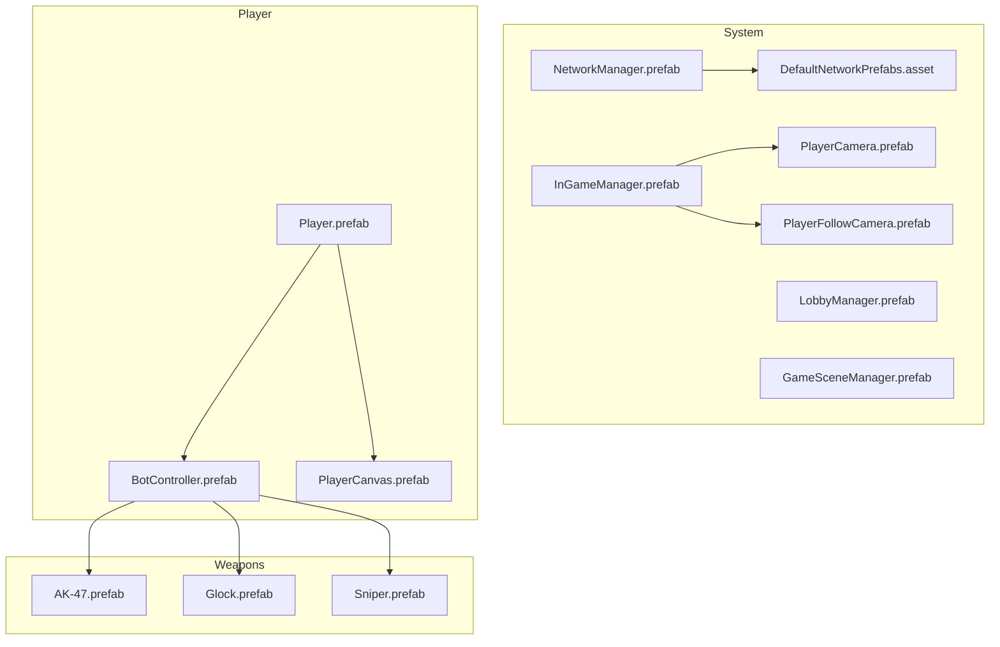
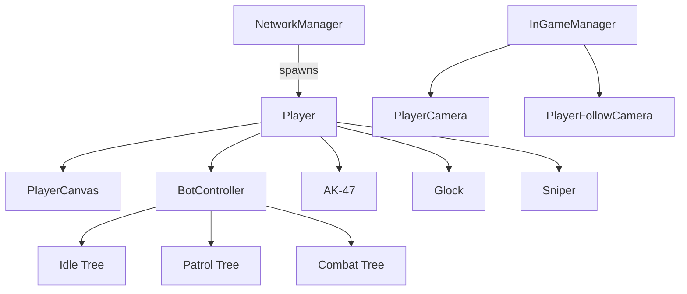
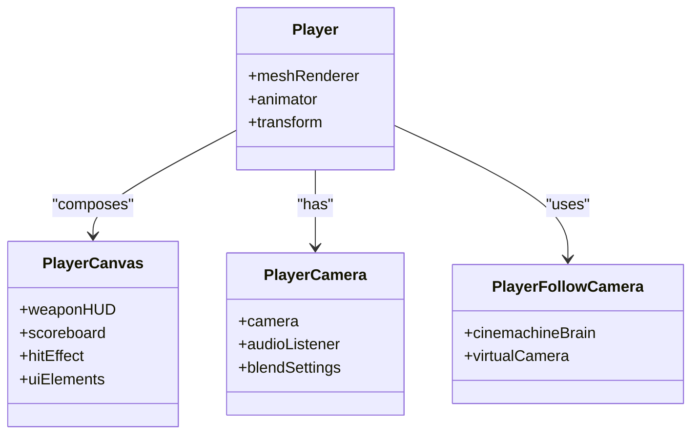
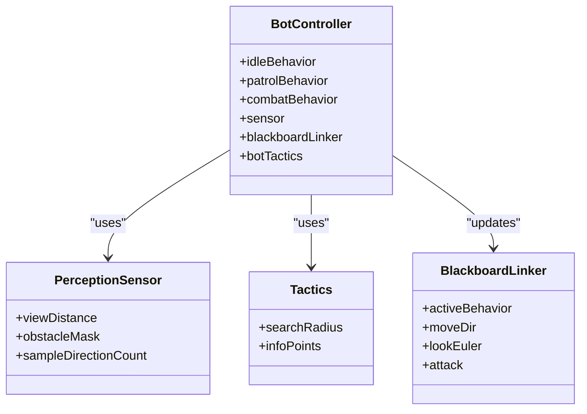
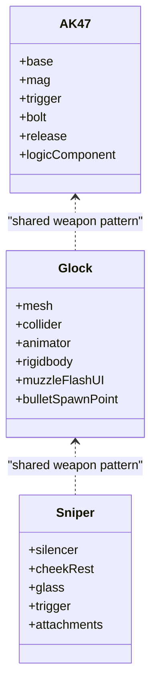
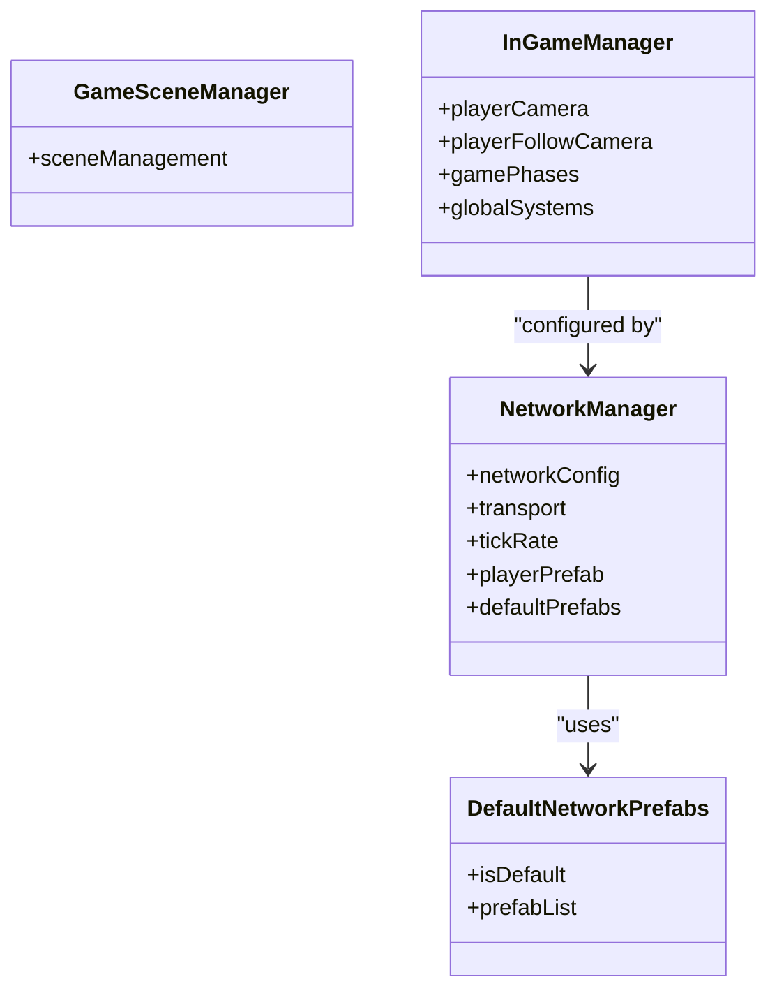
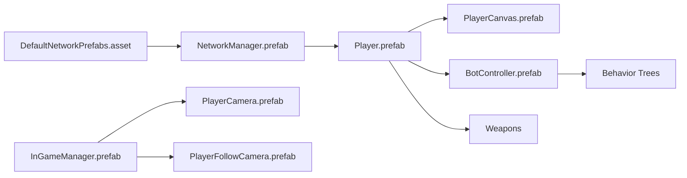
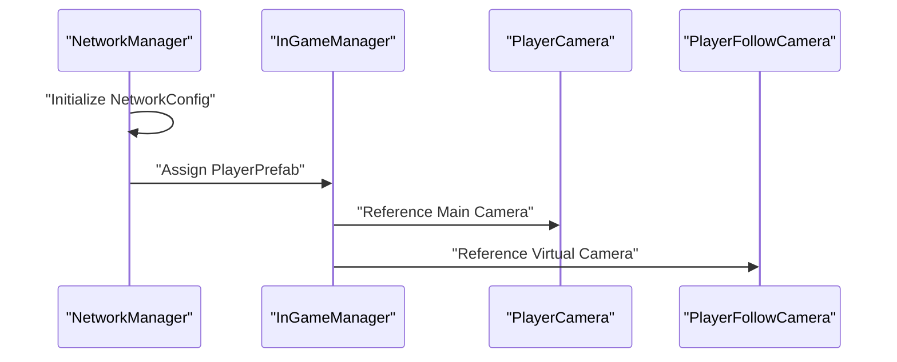
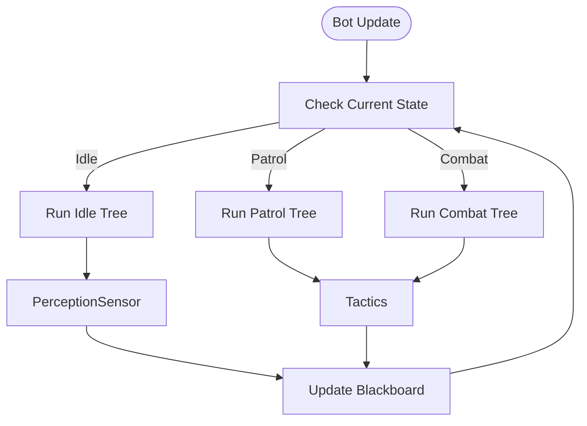
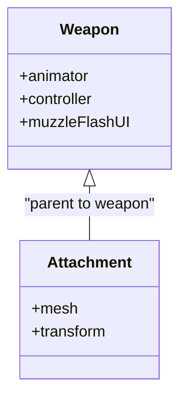

# Prefabs & Components

<cite>
**Referenced Files in This Document**
- [DefaultNetworkPrefabs.asset](file://Assets/FPS-Game/Prefabs/System/DefaultNetworkPrefabs.asset)
- [NetworkManager.prefab](file://Assets/FPS-Game/Prefabs/System/NetworkManager.prefab)
- [LobbyManager.prefab](file://Assets/FPS-Game/Prefabs/System/LobbyManager.prefab)
- [GameSceneManager.prefab](file://Assets/FPS-Game/Prefabs/System/GameSceneManager.prefab)
- [InGameManager.prefab](file://Assets/FPS-Game/Prefabs/System/InGameManager.prefab)
- [Player.prefab](file://Assets/FPS-Game/Prefabs/Player/Player.prefab)
- [BotController.prefab](file://Assets/FPS-Game/Prefabs/Player/BotController.prefab)
- [PlayerCanvas.prefab](file://Assets/FPS-Game/Prefabs/Player/PlayerCanvas.prefab)
- [PlayerCamera.prefab](file://Assets/FPS-Game/Prefabs/System/PlayerCamera.prefab)
- [PlayerFollowCamera.prefab](file://Assets/FPS-Game/Prefabs/System/PlayerFollowCamera.prefab)
- [AK-47.prefab](file://Assets/FPS-Game/Prefabs/Weapon/AK-47.prefab)
- [Glock.prefab](file://Assets/FPS-Game/Prefabs/Weapon/Glock.prefab)
- [Sniper.prefab](file://Assets/FPS-Game/Prefabs/Weapon/Sniper.prefab)
</cite>

## Table of Contents
1. [Introduction](#introduction)
2. [Project Structure](#project-structure)
3. [Core Components](#core-components)
4. [Architecture Overview](#architecture-overview)
5. [Detailed Component Analysis](#detailed-component-analysis)
6. [Dependency Analysis](#dependency-analysis)
7. [Performance Considerations](#performance-considerations)
8. [Troubleshooting Guide](#troubleshooting-guide)
9. [Conclusion](#conclusion)
10. [Appendices](#appendices)

## Introduction
This document explains the prefab system used to build reusable game objects across the project, focusing on:
- Player prefabs: controllers, cameras, HUD components
- Weapon prefabs: attachment systems, animation components, and network synchronization hooks
- Bot prefabs: AI controllers, perception sensors, and behavior tree integration
- System prefabs: networking, lobby management, and game state handling
It also covers instantiation patterns, component access, runtime modification, optimization, dependency management, lifecycle, and multiplayer compatibility.

## Project Structure
The prefab system is organized under Assets/FPS-Game/Prefabs by category:
- System: Networking, lobby, scene/game managers, and camera rigs
- Player: Player entity, HUD, and AI controller
- Weapon: Firearms and attachments

**Diagram sources**
- [NetworkManager.prefab:1-100](file://Assets/FPS-Game/Prefabs/System/NetworkManager.prefab#L1-L100)
- [DefaultNetworkPrefabs.asset:1-27](file://Assets/FPS-Game/Prefabs/System/DefaultNetworkPrefabs.asset#L1-L27)
- [InGameManager.prefab:1-190](file://Assets/FPS-Game/Prefabs/System/InGameManager.prefab#L1-L190)
- [PlayerCamera.prefab:1-130](file://Assets/FPS-Game/Prefabs/System/PlayerCamera.prefab#L1-L130)
- [PlayerFollowCamera.prefab:1-144](file://Assets/FPS-Game/Prefabs/System/PlayerFollowCamera.prefab#L1-L144)
- [Player.prefab:1-800](file://Assets/FPS-Game/Prefabs/Player/Player.prefab#L1-L800)
- [BotController.prefab:1-310](file://Assets/FPS-Game/Prefabs/Player/BotController.prefab#L1-L310)
- [PlayerCanvas.prefab:1-800](file://Assets/FPS-Game/Prefabs/Player/PlayerCanvas.prefab#L1-L800)
- [AK-47.prefab:1-467](file://Assets/FPS-Game/Prefabs/Weapon/AK-47.prefab#L1-L467)
- [Glock.prefab:1-384](file://Assets/FPS-Game/Prefabs/Weapon/Glock.prefab#L1-L384)
- [Sniper.prefab:1-800](file://Assets/FPS-Game/Prefabs/Weapon/Sniper.prefab#L1-L800)

**Section sources**
- [NetworkManager.prefab:1-100](file://Assets/FPS-Game/Prefabs/System/NetworkManager.prefab#L1-L100)
- [InGameManager.prefab:1-190](file://Assets/FPS-Game/Prefabs/System/InGameManager.prefab#L1-L190)
- [Player.prefab:1-800](file://Assets/FPS-Game/Prefabs/Player/Player.prefab#L1-L800)
- [BotController.prefab:1-310](file://Assets/FPS-Game/Prefabs/Player/BotController.prefab#L1-L310)
- [PlayerCanvas.prefab:1-800](file://Assets/FPS-Game/Prefabs/Player/PlayerCanvas.prefab#L1-L800)
- [PlayerCamera.prefab:1-130](file://Assets/FPS-Game/Prefabs/System/PlayerCamera.prefab#L1-L130)
- [PlayerFollowCamera.prefab:1-144](file://Assets/FPS-Game/Prefabs/System/PlayerFollowCamera.prefab#L1-L144)
- [AK-47.prefab:1-467](file://Assets/FPS-Game/Prefabs/Weapon/AK-47.prefab#L1-L467)
- [Glock.prefab:1-384](file://Assets/FPS-Game/Prefabs/Weapon/Glock.prefab#L1-L384)
- [Sniper.prefab:1-800](file://Assets/FPS-Game/Prefabs/Weapon/Sniper.prefab#L1-L800)

## Core Components
- System networking and scenes
  - NetworkManager: configures transport, tick rate, player prefab, and default network prefabs list
  - DefaultNetworkPrefabs: defines default networked prefabs used by the system
  - GameSceneManager: manages gameplay scenes
  - InGameManager: orchestrates game phases, camera references, and global systems
- Player
  - Player: base character rig with mesh/renderer/animator/etc.
  - BotController: AI controller with behavior trees, perception sensor, tactics, and blackboard
  - PlayerCanvas: HUD with weapon HUD, scoreboard, hit indicators, and UI controls
  - Cameras: PlayerCamera (main camera) and PlayerFollowCamera (virtual camera rig)
- Weapons
  - AK-47, Glock, Sniper: weapon models with meshes, colliders, muzzle flash UI, and animator/controller references

Key instantiation and access patterns:
- Instantiate player via NetworkManager’s PlayerPrefab
- Access HUD via PlayerCanvas children
- Control bot behavior via BotController’s behavior tree components
- Modify weapon visuals/attachments by parenting child meshes to weapon transforms

**Section sources**
- [NetworkManager.prefab:48-72](file://Assets/FPS-Game/Prefabs/System/NetworkManager.prefab#L48-L72)
- [DefaultNetworkPrefabs.asset:16-26](file://Assets/FPS-Game/Prefabs/System/DefaultNetworkPrefabs.asset#L16-L26)
- [InGameManager.prefab:77-153](file://Assets/FPS-Game/Prefabs/System/InGameManager.prefab#L77-L153)
- [Player.prefab:1-800](file://Assets/FPS-Game/Prefabs/Player/Player.prefab#L1-L800)
- [BotController.prefab:1-310](file://Assets/FPS-Game/Prefabs/Player/BotController.prefab#L1-L310)
- [PlayerCanvas.prefab:1-800](file://Assets/FPS-Game/Prefabs/Player/PlayerCanvas.prefab#L1-L800)
- [PlayerCamera.prefab:1-130](file://Assets/FPS-Game/Prefabs/System/PlayerCamera.prefab#L1-L130)
- [PlayerFollowCamera.prefab:1-144](file://Assets/FPS-Game/Prefabs/System/PlayerFollowCamera.prefab#L1-L144)
- [AK-47.prefab:1-467](file://Assets/FPS-Game/Prefabs/Weapon/AK-47.prefab#L1-L467)
- [Glock.prefab:1-384](file://Assets/FPS-Game/Prefabs/Weapon/Glock.prefab#L1-L384)
- [Sniper.prefab:1-800](file://Assets/FPS-Game/Prefabs/Weapon/Sniper.prefab#L1-L800)

## Architecture Overview
The system integrates networking, AI, cameras, and weapons through prefabs and scripts:
- NetworkManager spawns players using Player prefab and synchronizes default prefabs
- InGameManager holds references to cameras and manages game lifecycle
- PlayerCanvas composes HUD elements and interacts with UI systems
- BotController drives AI behavior and perception
- Weapons expose animation/controller and muzzle flash UI for visual feedback

**Diagram sources**
- [NetworkManager.prefab:51-54](file://Assets/FPS-Game/Prefabs/System/NetworkManager.prefab#L51-L54)
- [InGameManager.prefab:77-153](file://Assets/FPS-Game/Prefabs/System/InGameManager.prefab#L77-L153)
- [PlayerCanvas.prefab:1-800](file://Assets/FPS-Game/Prefabs/Player/PlayerCanvas.prefab#L1-L800)
- [BotController.prefab:252-257](file://Assets/FPS-Game/Prefabs/Player/BotController.prefab#L252-L257)
- [AK-47.prefab:1-467](file://Assets/FPS-Game/Prefabs/Weapon/AK-47.prefab#L1-L467)
- [Glock.prefab:1-384](file://Assets/FPS-Game/Prefabs/Weapon/Glock.prefab#L1-L384)
- [Sniper.prefab:1-800](file://Assets/FPS-Game/Prefabs/Weapon/Sniper.prefab#L1-L800)

## Detailed Component Analysis

### Player Prefabs
- Player
  - Contains skinned mesh renderer, bones, and components for movement/physics
  - Used as the NetworkManager’s PlayerPrefab
- PlayerCanvas
  - Composite HUD with weapon HUD, scoreboard, hit effect, and UI buttons
  - Provides runtime toggles for HUD elements
- Cameras
  - PlayerCamera: main camera with audio listener and blend settings
  - PlayerFollowCamera: virtual camera rig with Cinemachine components

**Diagram sources**
- [Player.prefab:1-800](file://Assets/FPS-Game/Prefabs/Player/Player.prefab#L1-L800)
- [PlayerCanvas.prefab:1-800](file://Assets/FPS-Game/Prefabs/Player/PlayerCanvas.prefab#L1-L800)
- [PlayerCamera.prefab:1-130](file://Assets/FPS-Game/Prefabs/System/PlayerCamera.prefab#L1-L130)
- [PlayerFollowCamera.prefab:1-144](file://Assets/FPS-Game/Prefabs/System/PlayerFollowCamera.prefab#L1-L144)

**Section sources**
- [Player.prefab:1-800](file://Assets/FPS-Game/Prefabs/Player/Player.prefab#L1-L800)
- [PlayerCanvas.prefab:1-800](file://Assets/FPS-Game/Prefabs/Player/PlayerCanvas.prefab#L1-L800)
- [PlayerCamera.prefab:1-130](file://Assets/FPS-Game/Prefabs/System/PlayerCamera.prefab#L1-L130)
- [PlayerFollowCamera.prefab:1-144](file://Assets/FPS-Game/Prefabs/System/PlayerFollowCamera.prefab#L1-L144)

### Bot Prefabs
- BotController
  - Holds three behavior trees: Idle, Patrol, and Combat
  - Includes perception sensor, tactics, blackboard linker, and state transitions
  - Drives movement, scanning, targeting, and attack behaviors

**Diagram sources**
- [BotController.prefab:252-257](file://Assets/FPS-Game/Prefabs/Player/BotController.prefab#L252-L257)
- [BotController.prefab:260-260](file://Assets/FPS-Game/Prefabs/Player/BotController.prefab#L260-L260)
- [BotController.prefab:261-275](file://Assets/FPS-Game/Prefabs/Player/BotController.prefab#L261-L275)
- [BotController.prefab:277-291](file://Assets/FPS-Game/Prefabs/Player/BotController.prefab#L277-L291)

**Section sources**
- [BotController.prefab:1-310](file://Assets/FPS-Game/Prefabs/Player/BotController.prefab#L1-L310)

### Weapon Prefabs
- AK-47
  - Mesh parts for base, mag, trigger, bolt, release
  - MonoBehaviour component for weapon logic
- Glock
  - Mesh, collider, animator, rigidbody, and muzzle flash UI canvas
  - Bullet spawn point transform for projectiles
- Sniper
  - Modular parts including cheek rest, glass, silencer, and trigger
  - Supports attachments and scoped visuals

**Diagram sources**
- [AK-47.prefab:1-467](file://Assets/FPS-Game/Prefabs/Weapon/AK-47.prefab#L1-L467)
- [Glock.prefab:1-384](file://Assets/FPS-Game/Prefabs/Weapon/Glock.prefab#L1-L384)
- [Sniper.prefab:1-800](file://Assets/FPS-Game/Prefabs/Weapon/Sniper.prefab#L1-L800)

**Section sources**
- [AK-47.prefab:1-467](file://Assets/FPS-Game/Prefabs/Weapon/AK-47.prefab#L1-L467)
- [Glock.prefab:1-384](file://Assets/FPS-Game/Prefabs/Weapon/Glock.prefab#L1-L384)
- [Sniper.prefab:1-800](file://Assets/FPS-Game/Prefabs/Weapon/Sniper.prefab#L1-L800)

### System Prefabs
- NetworkManager
  - Configures transport, tick rate, connection settings, and default network prefabs list
- DefaultNetworkPrefabs
  - Defines default networked prefabs used by the system
- GameSceneManager
  - Scene management component for gameplay
- InGameManager
  - Holds camera references, game phases, and global systems

**Diagram sources**
- [NetworkManager.prefab:48-72](file://Assets/FPS-Game/Prefabs/System/NetworkManager.prefab#L48-L72)
- [DefaultNetworkPrefabs.asset:16-26](file://Assets/FPS-Game/Prefabs/System/DefaultNetworkPrefabs.asset#L16-L26)
- [GameSceneManager.prefab:1-47](file://Assets/FPS-Game/Prefabs/System/GameSceneManager.prefab#L1-L47)
- [InGameManager.prefab:77-153](file://Assets/FPS-Game/Prefabs/System/InGameManager.prefab#L77-L153)

**Section sources**
- [NetworkManager.prefab:1-100](file://Assets/FPS-Game/Prefabs/System/NetworkManager.prefab#L1-L100)
- [DefaultNetworkPrefabs.asset:1-27](file://Assets/FPS-Game/Prefabs/System/DefaultNetworkPrefabs.asset#L1-L27)
- [GameSceneManager.prefab:1-47](file://Assets/FPS-Game/Prefabs/System/GameSceneManager.prefab#L1-L47)
- [InGameManager.prefab:1-190](file://Assets/FPS-Game/Prefabs/System/InGameManager.prefab#L1-L190)

## Dependency Analysis
- Prefab-to-script relationships
  - PlayerCamera and PlayerFollowCamera are referenced by InGameManager
  - BotController references behavior trees and perception/tactics/blackboard components
  - Weapons expose animator/controller and muzzle flash UI for integration
- Network dependencies
  - NetworkManager depends on DefaultNetworkPrefabs for default networked prefabs
  - Player is instantiated from NetworkManager’s PlayerPrefab

**Diagram sources**
- [DefaultNetworkPrefabs.asset:16-26](file://Assets/FPS-Game/Prefabs/System/DefaultNetworkPrefabs.asset#L16-L26)
- [NetworkManager.prefab:51-54](file://Assets/FPS-Game/Prefabs/System/NetworkManager.prefab#L51-L54)
- [InGameManager.prefab:77-153](file://Assets/FPS-Game/Prefabs/System/InGameManager.prefab#L77-L153)
- [PlayerCanvas.prefab:1-800](file://Assets/FPS-Game/Prefabs/Player/PlayerCanvas.prefab#L1-L800)
- [BotController.prefab:252-257](file://Assets/FPS-Game/Prefabs/Player/BotController.prefab#L252-L257)

**Section sources**
- [DefaultNetworkPrefabs.asset:1-27](file://Assets/FPS-Game/Prefabs/System/DefaultNetworkPrefabs.asset#L1-L27)
- [NetworkManager.prefab:1-100](file://Assets/FPS-Game/Prefabs/System/NetworkManager.prefab#L1-L100)
- [InGameManager.prefab:1-190](file://Assets/FPS-Game/Prefabs/System/InGameManager.prefab#L1-L190)
- [PlayerCanvas.prefab:1-800](file://Assets/FPS-Game/Prefabs/Player/PlayerCanvas.prefab#L1-L800)
- [BotController.prefab:1-310](file://Assets/FPS-Game/Prefabs/Player/BotController.prefab#L1-L310)

## Performance Considerations
- Camera blending and update modes
  - PlayerCamera uses configurable blend settings; tune for smoothness vs. cost
  - PlayerFollowCamera uses Cinemachine; adjust damping/collision settings to reduce CPU
- Animation and rendering
  - Use appropriate LODs and material variants for weapon meshes
  - Limit per-frame UI updates in PlayerCanvas (e.g., minimize frequent layout recalculations)
- Network tick rate and payload
  - Tune NetworkManager tick rate and payload sizes for latency and bandwidth
  - Prefer minimal serialization for frequently synced components
- AI behavior
  - Reduce sensor sampling frequency and collision checks for bots in crowded scenarios
  - Use behavior tree caching and shared variables to avoid redundant computations

[No sources needed since this section provides general guidance]

## Troubleshooting Guide
- Player not spawning
  - Verify NetworkManager’s PlayerPrefab is set and included in DefaultNetworkPrefabs
- Cameras not switching
  - Confirm InGameManager references to PlayerCamera and PlayerFollowCamera are assigned
- HUD not updating
  - Check PlayerCanvas children and UI components are present and enabled
- Bot not moving
  - Ensure BotController’s behavior trees are enabled and blackboard values are set
- Weapon visuals missing
  - Confirm weapon child meshes are parented and materials are assigned

**Section sources**
- [NetworkManager.prefab:51-54](file://Assets/FPS-Game/Prefabs/System/NetworkManager.prefab#L51-L54)
- [InGameManager.prefab:77-153](file://Assets/FPS-Game/Prefabs/System/InGameManager.prefab#L77-L153)
- [PlayerCanvas.prefab:1-800](file://Assets/FPS-Game/Prefabs/Player/PlayerCanvas.prefab#L1-L800)
- [BotController.prefab:252-257](file://Assets/FPS-Game/Prefabs/Player/BotController.prefab#L252-L257)
- [AK-47.prefab:1-467](file://Assets/FPS-Game/Prefabs/Weapon/AK-47.prefab#L1-L467)

## Conclusion
The prefab system organizes reusable components across networking, AI, cameras, and weapons. By leveraging prefabs and their associated scripts, developers can instantiate players, configure bots, compose HUDs, and manage game state efficiently. Proper configuration of NetworkManager and DefaultNetworkPrefabs ensures reliable multiplayer behavior, while modular weapon and camera prefabs enable flexible customization and optimization.

[No sources needed since this section summarizes without analyzing specific files]

## Appendices

### Example Workflows

#### Instantiate Player via NetworkManager
- Access NetworkManager and spawn the configured PlayerPrefab
- Configure camera references in InGameManager after spawn

**Diagram sources**
- [NetworkManager.prefab:48-72](file://Assets/FPS-Game/Prefabs/System/NetworkManager.prefab#L48-L72)
- [InGameManager.prefab:77-153](file://Assets/FPS-Game/Prefabs/System/InGameManager.prefab#L77-L153)
- [PlayerCamera.prefab:1-130](file://Assets/FPS-Game/Prefabs/System/PlayerCamera.prefab#L1-L130)
- [PlayerFollowCamera.prefab:1-144](file://Assets/FPS-Game/Prefabs/System/PlayerFollowCamera.prefab#L1-L144)

#### Bot Behavior Switching
- BotController switches between Idle, Patrol, and Combat based on conditions
- PerceptionSensor and Tactics feed blackboard values

**Diagram sources**
- [BotController.prefab:252-257](file://Assets/FPS-Game/Prefabs/Player/BotController.prefab#L252-L257)
- [BotController.prefab:260-260](file://Assets/FPS-Game/Prefabs/Player/BotController.prefab#L260-L260)
- [BotController.prefab:261-275](file://Assets/FPS-Game/Prefabs/Player/BotController.prefab#L261-L275)
- [BotController.prefab:277-291](file://Assets/FPS-Game/Prefabs/Player/BotController.prefab#L277-L291)

#### Weapon Attachment and Animation
- Attachments are child meshes parented to weapon transforms
- Animator/controller govern firing animations and muzzle flash UI

**Diagram sources**
- [Glock.prefab:114-174](file://Assets/FPS-Game/Prefabs/Weapon/Glock.prefab#L114-L174)
- [Sniper.prefab:193-263](file://Assets/FPS-Game/Prefabs/Weapon/Sniper.prefab#L193-L263)

### Guidelines for Creating Custom Prefabs
- Component composition
  - Keep prefabs modular; separate concerns (rendering, physics, AI, UI)
  - Use shared components (e.g., blackboard, tactics) across similar entities
- Behavior designer integration
  - Expose shared variables and methods for behavior trees
  - Keep task logic lightweight; offload heavy work to dedicated systems
- Network synchronization
  - Mark only necessary components for synchronization
  - Use NetworkManager’s default prefabs list for predictable discovery
- Serialization and multiplayer compatibility
  - Avoid serializing transient or scene-specific data
  - Ensure deterministic initialization across client and server

[No sources needed since this section provides general guidance]