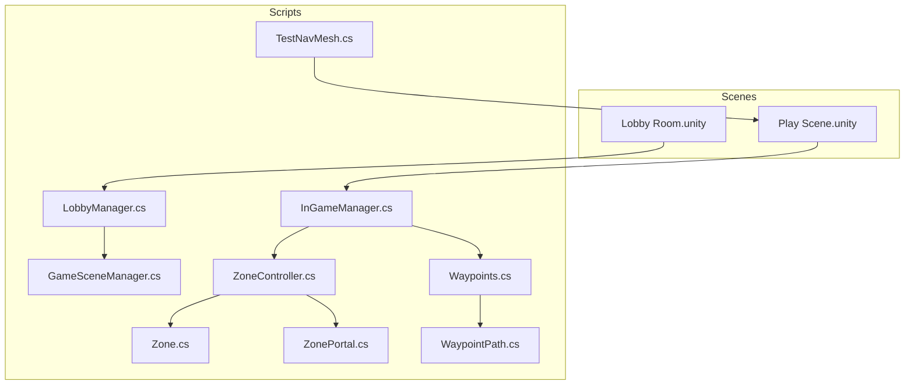
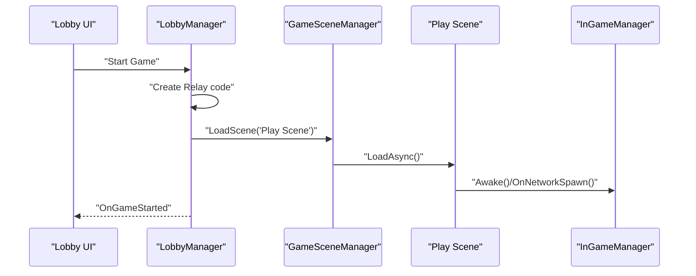
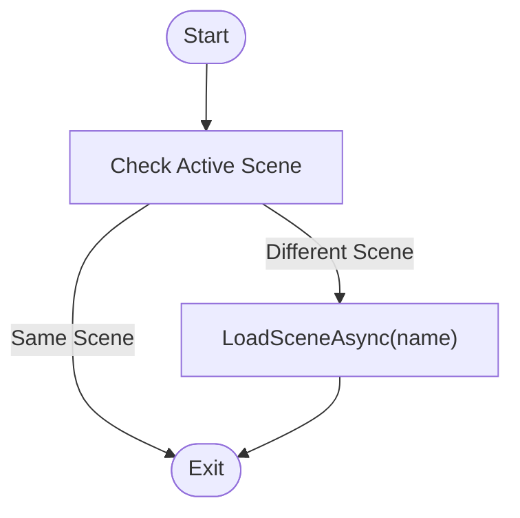
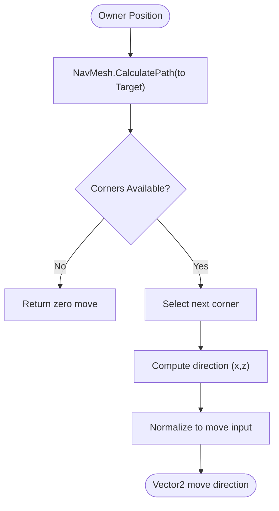
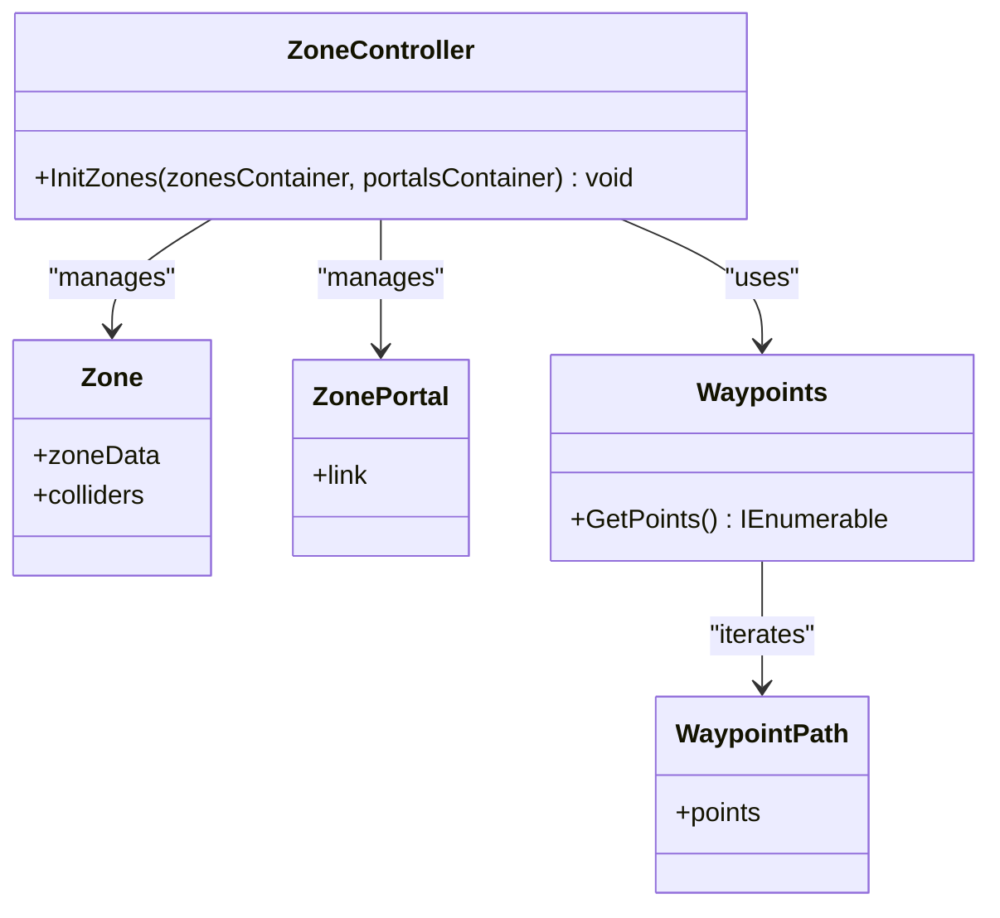
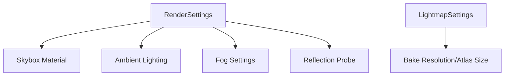
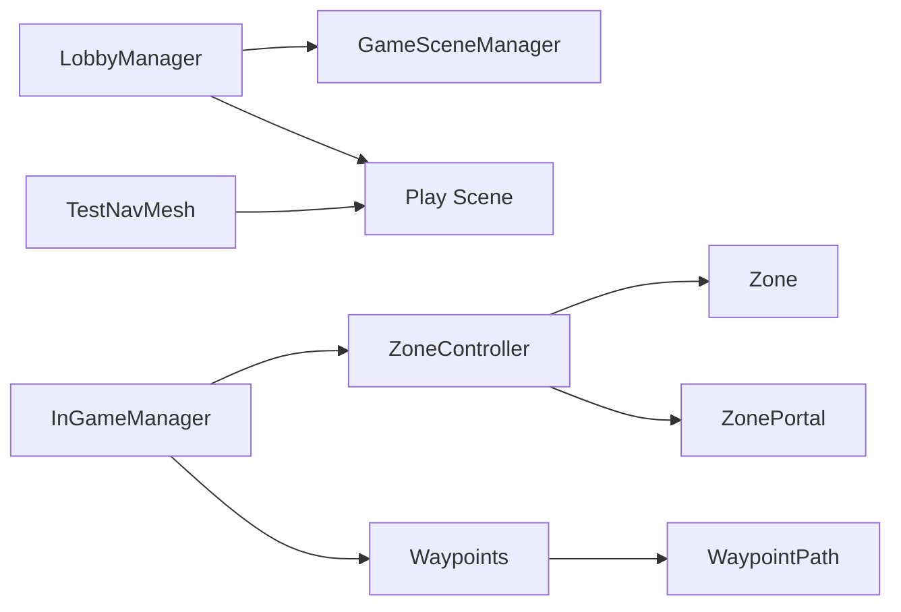

# Scenes & Environment

<cite>
**Referenced Files in This Document**
- [GameSceneManager.cs](file://Assets/FPS-Game/Scripts/GameSceneManager.cs)
- [LobbyManager.cs](file://Assets/FPS-Game/Scripts/Lobby Script/Lobby/Scripts/LobbyManager.cs)
- [InGameManager.cs](file://Assets/FPS-Game/Scripts/System/InGameManager.cs)
- [TestNavMesh.cs](file://Assets/FPS-Game/Scripts/TestNavMesh.cs)
- [Play Scene.unity](file://Assets/FPS-Game/Scenes/MainScenes/Play Scene.unity)
- [Lobby Room.unity](file://Assets/FPS-Game/Scenes/MainScenes/Lobby Room.unity)
- [NavMesh Surface.asset](file://Assets/FPS-Game/Scenes/MainScenes/Play Scene/NavMesh-NavMesh Surface.asset)
- [NavMeshAreas.asset](file://ProjectSettings/NavMeshAreas.asset)
- [Zone.cs](file://Assets/FPS-Game/Scripts/System/Zone.cs)
- [ZoneController.cs](file://Assets/FPS-Game/Scripts/System/ZoneController.cs)
- [ZonePortal.cs](file://Assets/FPS-Game/Scripts/System/ZonePortal.cs)
- [Waypoints.cs](file://Assets/FPS-Game/Scripts/System/Waypoints.cs)
- [WaypointPath.cs](file://Assets/FPS-Game/Scripts/Bot/WaypointPath.cs)
</cite>

## Table of Contents
1. [Introduction](#introduction)
2. [Project Structure](#project-structure)
3. [Core Components](#core-components)
4. [Architecture Overview](#architecture-overview)
5. [Detailed Component Analysis](#detailed-component-analysis)
6. [Dependency Analysis](#dependency-analysis)
7. [Performance Considerations](#performance-considerations)
8. [Troubleshooting Guide](#troubleshooting-guide)
9. [Conclusion](#conclusion)
10. [Appendices](#appendices)

## Introduction
This document describes the scene management system and environment setup for the FPS project. It covers:
- Main scenes: lobby rooms, play scenes, and transition areas
- Environment assets from imported packages and authored content
- Navigation mesh configuration, pathfinding, and AI navigation
- Lighting, reflection probes, and post-processing
- Scene loading/unloading and transitions
- Optimization strategies (occlusion culling, LOD, and platform-specific tuning)
- Guidelines for creating custom levels, environment scripting, and dynamic interactions
- Serialization and build settings

## Project Structure
The scenes and scripts relevant to scene management and environment are organized under the FPS-Game package:
- Scenes: MainScenes (Lobby Room, Play Scene, Sign In)
- Scripts: GameSceneManager (scene loader), LobbyManager (lobby and relay integration), InGameManager (runtime gameplay orchestration), TestNavMesh (navigation demo), System and TacticalAI modules for zones and waypoints

**Diagram sources**
- [Lobby Room.unity](file://Assets/FPS-Game/Scenes/MainScenes/Lobby Room.unity)
- [Play Scene.unity](file://Assets/FPS-Game/Scenes/MainScenes/Play Scene.unity)
- [GameSceneManager.cs](file://Assets/FPS-Game/Scripts/GameSceneManager.cs)
- [LobbyManager.cs](file://Assets/FPS-Game/Scripts/Lobby Script/Lobby/Scripts/LobbyManager.cs)
- [InGameManager.cs](file://Assets/FPS-Game/Scripts/System/InGameManager.cs)
- [TestNavMesh.cs](file://Assets/FPS-Game/Scripts/TestNavMesh.cs)
- [ZoneController.cs](file://Assets/FPS-Game/Scripts/System/ZoneController.cs)
- [Zone.cs](file://Assets/FPS-Game/Scripts/System/Zone.cs)
- [ZonePortal.cs](file://Assets/FPS-Game/Scripts/System/ZonePortal.cs)
- [Waypoints.cs](file://Assets/FPS-Game/Scripts/System/Waypoints.cs)
- [WaypointPath.cs](file://Assets/FPS-Game/Scripts/Bot/WaypointPath.cs)

**Section sources**
- [GameSceneManager.cs:1-26](file://Assets/FPS-Game/Scripts/GameSceneManager.cs#L1-L26)
- [LobbyManager.cs:1-589](file://Assets/FPS-Game/Scripts/Lobby Script/Lobby/Scripts/LobbyManager.cs#L1-L589)
- [Play Scene.unity:102-124](file://Assets/FPS-Game/Scenes/MainScenes/Play Scene.unity#L102-L124)
- [Lobby Room.unity:101-124](file://Assets/FPS-Game/Scenes/MainScenes/Lobby Room.unity#L101-L124)

## Core Components
- Scene Loader: Loads scenes asynchronously and persists across scene changes.
- Lobby Manager: Manages lobby lifecycle, polling, heartbeats, and starts the play scene via relay.
- In-Game Manager: Orchestrates gameplay systems, exposes pathfinding, and coordinates zones and waypoints.
- Navigation Mesh: Built surfaces per agent type and configured via NavMeshAreas.
- Zones and Portals: Define navigable regions and transitions for tactical AI.
- Waypoints: Static navigation points for bots and movement logic.

**Section sources**
- [GameSceneManager.cs:1-26](file://Assets/FPS-Game/Scripts/GameSceneManager.cs#L1-L26)
- [LobbyManager.cs:170-182](file://Assets/FPS-Game/Scripts/Lobby Script/Lobby/Scripts/LobbyManager.cs#L170-L182)
- [InGameManager.cs:66-139](file://Assets/FPS-Game/Scripts/System/InGameManager.cs#L66-L139)
- [InGameManager.cs:196-231](file://Assets/FPS-Game/Scripts/System/InGameManager.cs#L196-L231)
- [ZoneController.cs](file://Assets/FPS-Game/Scripts/System/ZoneController.cs)
- [Waypoints.cs](file://Assets/FPS-Game/Scripts/System/Waypoints.cs)

## Architecture Overview
The runtime flow connects lobby transitions to the play scene, where gameplay systems coordinate navigation and AI.

**Diagram sources**
- [LobbyManager.cs:545-569](file://Assets/FPS-Game/Scripts/Lobby Script/Lobby/Scripts/LobbyManager.cs#L545-L569)
- [LobbyManager.cs:167-182](file://Assets/FPS-Game/Scripts/Lobby Script/Lobby/Scripts/LobbyManager.cs#L167-L182)
- [GameSceneManager.cs:20-25](file://Assets/FPS-Game/Scripts/GameSceneManager.cs#L20-L25)
- [InGameManager.cs:129-139](file://Assets/FPS-Game/Scripts/System/InGameManager.cs#L129-L139)

## Detailed Component Analysis

### Scene Management and Transitions
- Persistent scene loader ensures continuity across lobby and play scenes.
- Lobby transitions to play scene upon host-started relay code.
- Async scene loading prevents blocking the main thread.

**Diagram sources**
- [GameSceneManager.cs:20-25](file://Assets/FPS-Game/Scripts/GameSceneManager.cs#L20-L25)

**Section sources**
- [GameSceneManager.cs:1-26](file://Assets/FPS-Game/Scripts/GameSceneManager.cs#L1-L26)
- [LobbyManager.cs:167-182](file://Assets/FPS-Game/Scripts/Lobby Script/Lobby/Scripts/LobbyManager.cs#L167-L182)

### Navigation Mesh Setup and Pathfinding
- Play Scene defines NavMeshSettings and contains multiple NavMesh Surfaces for different agent types.
- InGameManager exposes a pathfinding method using Unity’s NavMesh to compute movement direction.
- TestNavMesh demonstrates destination setting and corner-based movement with periodic repathing.

**Diagram sources**
- [InGameManager.cs:202-231](file://Assets/FPS-Game/Scripts/System/InGameManager.cs#L202-L231)
- [Play Scene.unity:102-124](file://Assets/FPS-Game/Scenes/MainScenes/Play Scene.unity#L102-L124)
- [NavMeshAreas.asset](file://ProjectSettings/NavMeshAreas.asset)
- [NavMesh Surface.asset](file://Assets/FPS-Game/Scenes/MainScenes/Play Scene/NavMesh-NavMesh Surface.asset)

**Section sources**
- [InGameManager.cs:196-231](file://Assets/FPS-Game/Scripts/System/InGameManager.cs#L196-L231)
- [TestNavMesh.cs:35-98](file://Assets/FPS-Game/Scripts/TestNavMesh.cs#L35-L98)
- [Play Scene.unity:102-124](file://Assets/FPS-Game/Scenes/MainScenes/Play Scene.unity#L102-L124)

### Zones, Portals, and Waypoints
- ZoneController initializes zones and portals from containers.
- Zones define navigable regions tagged for tactical AI.
- Waypoints and WaypointPath provide static navigation points for bots.

**Diagram sources**
- [ZoneController.cs](file://Assets/FPS-Game/Scripts/System/ZoneController.cs)
- [Zone.cs](file://Assets/FPS-Game/Scripts/System/Zone.cs)
- [ZonePortal.cs](file://Assets/FPS-Game/Scripts/System/ZonePortal.cs)
- [Waypoints.cs](file://Assets/FPS-Game/Scripts/System/Waypoints.cs)
- [WaypointPath.cs](file://Assets/FPS-Game/Scripts/Bot/WaypointPath.cs)

**Section sources**
- [ZoneController.cs](file://Assets/FPS-Game/Scripts/System/ZoneController.cs)
- [Zone.cs](file://Assets/FPS-Game/Scripts/System/Zone.cs)
- [ZonePortal.cs](file://Assets/FPS-Game/Scripts/System/ZonePortal.cs)
- [Waypoints.cs](file://Assets/FPS-Game/Scripts/System/Waypoints.cs)
- [WaypointPath.cs](file://Assets/FPS-Game/Scripts/Bot/WaypointPath.cs)

### Environment Assets and Lighting
- Play Scene includes baked lighting, lightmaps, ambient lighting, fog, skybox, and reflection probes.
- Lighting settings and bake parameters are defined in the scene’s RenderSettings and LightmapSettings.
- Reflection intensity and mode are configured in the scene’s RenderSettings.

**Diagram sources**
- [Play Scene.unity:14-100](file://Assets/FPS-Game/Scenes/MainScenes/Play Scene.unity#L14-L100)

**Section sources**
- [Play Scene.unity:14-100](file://Assets/FPS-Game/Scenes/MainScenes/Play Scene.unity#L14-L100)

### Lobby Scene and UI
- Lobby Room scene configures NavMeshSettings and UI elements for lobby controls, player slots, and text displays.
- NavMeshSettings here define agent radius/height and tile size for the lobby environment.

**Section sources**
- [Lobby Room.unity:101-124](file://Assets/FPS-Game/Scenes/MainScenes/Lobby Room.unity#L101-L124)

## Dependency Analysis
- LobbyManager depends on Unity Services (authentication, lobby service) and GameSceneManager for scene transitions.
- InGameManager orchestrates gameplay systems and exposes pathfinding to AI logic.
- ZoneController depends on Zone, ZonePortal, and Waypoints for tactical navigation.
- TestNavMesh is a standalone demo using NavMeshAgent and NavMesh.CalculatePath.

**Diagram sources**
- [LobbyManager.cs:167-182](file://Assets/FPS-Game/Scripts/Lobby Script/Lobby/Scripts/LobbyManager.cs#L167-L182)
- [GameSceneManager.cs:20-25](file://Assets/FPS-Game/Scripts/GameSceneManager.cs#L20-L25)
- [InGameManager.cs:124-127](file://Assets/FPS-Game/Scripts/System/InGameManager.cs#L124-L127)
- [ZoneController.cs](file://Assets/FPS-Game/Scripts/System/ZoneController.cs)
- [Waypoints.cs](file://Assets/FPS-Game/Scripts/System/Waypoints.cs)
- [WaypointPath.cs](file://Assets/FPS-Game/Scripts/Bot/WaypointPath.cs)
- [TestNavMesh.cs:35-98](file://Assets/FPS-Game/Scripts/TestNavMesh.cs#L35-L98)

**Section sources**
- [LobbyManager.cs:167-182](file://Assets/FPS-Game/Scripts/Lobby Script/Lobby/Scripts/LobbyManager.cs#L167-L182)
- [InGameManager.cs:124-127](file://Assets/FPS-Game/Scripts/System/InGameManager.cs#L124-L127)

## Performance Considerations
- Occlusion culling: Enabled in scenes; verify smallest occluder and hole thresholds for your geometry density.
- Lighting: Baked lightmaps reduce runtime cost; adjust resolution and padding for balance.
- NavMesh: Separate surfaces for different agent types improve pathfinding accuracy; keep tileSize and cellSize tuned for level size.
- Async scene loading: Use LoadSceneAsync to avoid frame drops during transitions.
- Reflection probes: Use fewer probes in smaller indoor spaces; increase resolution for outdoor scenes.

[No sources needed since this section provides general guidance]

## Troubleshooting Guide
- Scene fails to load: Verify scene names and ensure they are included in Build Settings.
- Lobby polling errors: Inspect lobby heartbeat and polling timers; ensure authentication is initialized before querying.
- Pathfinding returns zero: Confirm NavMesh is built and CalculatePath returns corners; check agent radius/height and area settings.
- Zones not recognized: Ensure Zone and ZonePortal components are attached and linked; verify colliders are set.

**Section sources**
- [LobbyManager.cs:122-136](file://Assets/FPS-Game/Scripts/Lobby Script/Lobby/Scripts/LobbyManager.cs#L122-L136)
- [LobbyManager.cs:185-204](file://Assets/FPS-Game/Scripts/Lobby Script/Lobby/Scripts/LobbyManager.cs#L185-L204)
- [InGameManager.cs:202-214](file://Assets/FPS-Game/Scripts/System/InGameManager.cs#L202-L214)
- [ZoneController.cs](file://Assets/FPS-Game/Scripts/System/ZoneController.cs)

## Conclusion
The scene management system integrates lobby transitions with a robust play environment featuring NavMesh surfaces, zones/portals, and waypoints. Lighting and reflection configurations are baked into scenes for performance. By leveraging async scene loading, structured pathfinding, and tactical zones, developers can efficiently create and optimize levels while maintaining smooth runtime performance.

[No sources needed since this section summarizes without analyzing specific files]

## Appendices

### Creating Custom Levels and Environment Scripting
- Build NavMesh surfaces per agent type; adjust tileSize and cellSize for scale.
- Place Zone and ZonePortal components to define tactical regions and transitions.
- Add Waypoints and WaypointPath for scripted bot movement.
- Use TestNavMesh as a reference for integrating NavMeshAgent and path recalculation.

**Section sources**
- [Play Scene.unity:102-124](file://Assets/FPS-Game/Scenes/MainScenes/Play Scene.unity#L102-L124)
- [Zone.cs](file://Assets/FPS-Game/Scripts/System/Zone.cs)
- [ZonePortal.cs](file://Assets/FPS-Game/Scripts/System/ZonePortal.cs)
- [Waypoints.cs](file://Assets/FPS-Game/Scripts/System/Waypoints.cs)
- [WaypointPath.cs](file://Assets/FPS-Game/Scripts/Bot/WaypointPath.cs)
- [TestNavMesh.cs:35-98](file://Assets/FPS-Game/Scripts/TestNavMesh.cs#L35-L98)

### Dynamic Environment Interactions
- Use triggers and colliders to mark interactable volumes (e.g., health pickups).
- Employ ScriptableObjects for item definitions and managers for spawning and respawning.
- Keep environment assets static for lightmap baking; use separate dynamic props for interactive elements.

[No sources needed since this section provides general guidance]

### Scene Serialization and Build Settings
- Ensure scenes are added to Build Settings for target platforms.
- Serialize NavMesh data per surface; verify NavMeshAreas asset contains required area costs.
- For platform-specific optimization, adjust quality settings and texture compression in Player Settings.

**Section sources**
- [NavMeshAreas.asset](file://ProjectSettings/NavMeshAreas.asset)