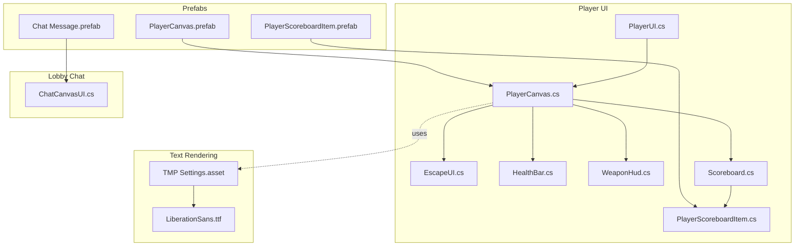
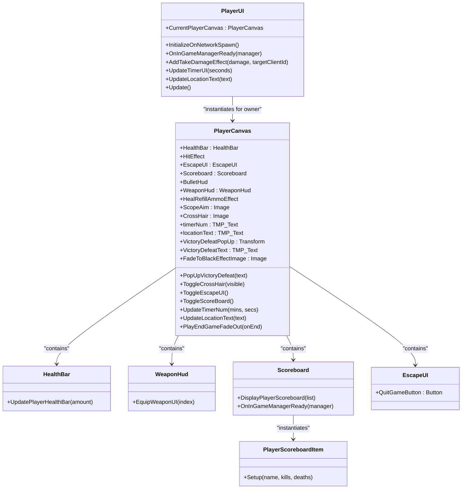
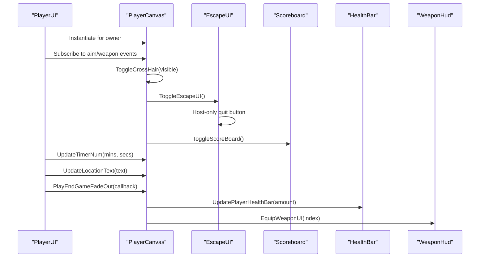
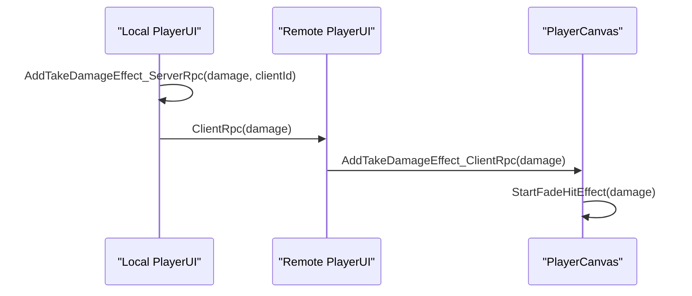
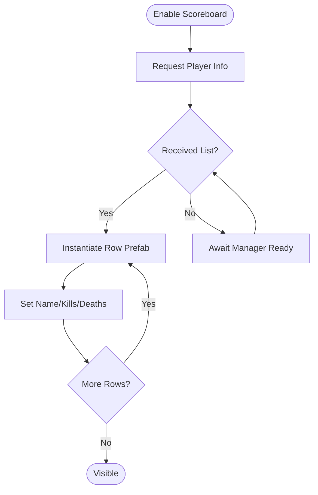
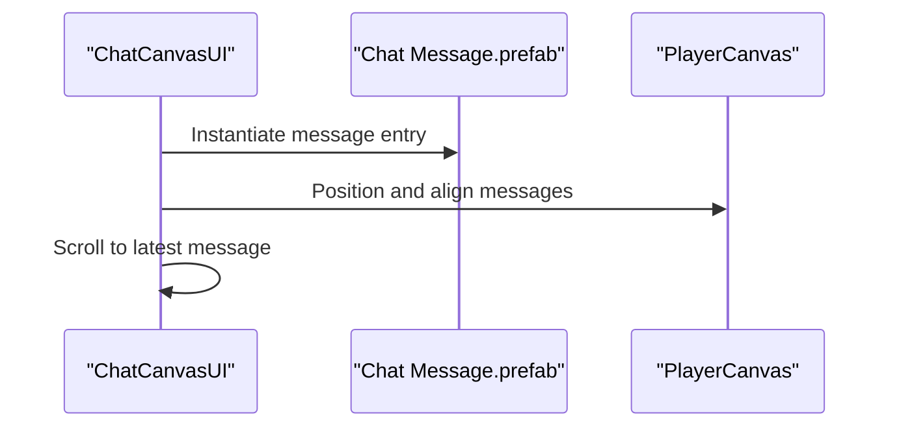
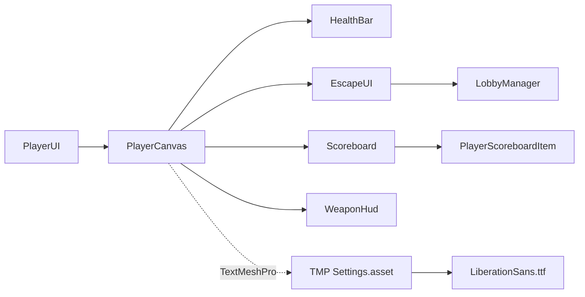

# UI & Sprite Assets

<cite>
**Referenced Files in This Document**
- [PlayerCanvas.cs](file://Assets/FPS-Game/Scripts/Player/PlayerCanvas.cs)
- [PlayerUI.cs](file://Assets/FPS-Game/Scripts/Player/PlayerUI.cs)
- [UIManager.cs](file://Assets/FPS-Game/Scripts/UIManager.cs)
- [Scoreboard.cs](file://Assets/FPS-Game/Scripts/Scoreboard.cs)
- [PlayerScoreboardItem.cs](file://Assets/FPS-Game/Scripts/PlayerScoreboardItem.cs)
- [EscapeUI.cs](file://Assets/FPS-Game/Scripts/Player/PlayerCanvas/EscapeUI.cs)
- [HealthBar.cs](file://Assets/FPS-Game/Scripts/Player/HealthBar.cs)
- [WeaponHud.cs](file://Assets/FPS-Game/Scripts/Player/WeaponHud.cs)
- [TMP Settings.asset](file://Assets/TextMesh Pro/Resources/TMP Settings.asset)
- [LiberationSans.ttf](file://Assets/TextMesh Pro/Fonts/LiberationSans.ttf)
- [PlayerCanvas.prefab](file://Assets/FPS-Game/Prefabs/Player/PlayerCanvas.prefab)
- [PlayerScoreboardItem.prefab](file://Assets/FPS-Game/Prefabs/Player/PlayerScoreboardItem.prefab)
- [Chat Message.prefab](file://Assets/FPS-Game/Prefabs/Chat Message.prefab)
- [ChatCanvasUI.cs](file://Assets/FPS-Game/Scripts/Lobby Script/Chatbox/Scripts/ChatCanvasUI.cs)
</cite>

## Table of Contents
1. [Introduction](#introduction)
2. [Project Structure](#project-structure)
3. [Core Components](#core-components)
4. [Architecture Overview](#architecture-overview)
5. [Detailed Component Analysis](#detailed-component-analysis)
6. [Dependency Analysis](#dependency-analysis)
7. [Performance Considerations](#performance-considerations)
8. [Troubleshooting Guide](#troubleshooting-guide)
9. [Conclusion](#conclusion)
10. [Appendices](#appendices)

## Introduction
This document describes the user interface and sprite asset system for 2D graphics, UI components, and text rendering in the project. It covers:
- Sprite assets for weapon icons, health indicators, crosshairs, and HUD elements
- UI canvas setup, component hierarchy, and responsive design principles
- TextMesh Pro integration for scalable text rendering and internationalization support
- Sprite optimization, atlas packing, and memory management for UI elements
- Dynamic UI updates, scoreboards, chat systems, and interactive menus
- UI performance optimization, platform-specific scaling, and accessibility considerations
- Guidelines for creating custom UI elements, sprite animation, and UI state management
- UI serialization, persistence, and multiplayer UI synchronization

## Project Structure
The UI system is organized around a per-player canvas instantiated at runtime and managed by a dedicated controller. Supporting components include health bars, weapon HUDs, escape menu, scoreboard, and chat UI. Text rendering leverages TextMesh Pro with global font resources.

**Diagram sources**
- [PlayerCanvas.cs:1-91](file://Assets/FPS-Game/Scripts/Player/PlayerCanvas.cs#L1-L91)
- [PlayerUI.cs:1-191](file://Assets/FPS-Game/Scripts/Player/PlayerUI.cs#L1-L191)
- [EscapeUI.cs:1-18](file://Assets/FPS-Game/Scripts/Player/PlayerCanvas/EscapeUI.cs#L1-L18)
- [HealthBar.cs:1-14](file://Assets/FPS-Game/Scripts/Player/HealthBar.cs#L1-L14)
- [WeaponHud.cs:1-42](file://Assets/FPS-Game/Scripts/Player/WeaponHud.cs#L1-L42)
- [Scoreboard.cs:1-46](file://Assets/FPS-Game/Scripts/Scoreboard.cs#L1-L46)
- [PlayerScoreboardItem.cs:1-27](file://Assets/FPS-Game/Scripts/PlayerScoreboardItem.cs#L1-L27)
- [TMP Settings.asset](file://Assets/TextMesh Pro/Resources/TMP Settings.asset)
- [LiberationSans.ttf](file://Assets/TextMesh Pro/Fonts/LiberationSans.ttf)
- [PlayerCanvas.prefab](file://Assets/FPS-Game/Prefabs/Player/PlayerCanvas.prefab)
- [PlayerScoreboardItem.prefab](file://Assets/FPS-Game/Prefabs/Player/PlayerScoreboardItem.prefab)
- [Chat Message.prefab](file://Assets/FPS-Game/Prefabs/Chat Message.prefab)
- [ChatCanvasUI.cs](file://Assets/FPS-Game/Scripts/Lobby Script/Chatbox/Scripts/ChatCanvasUI.cs)

**Section sources**
- [PlayerCanvas.cs:1-91](file://Assets/FPS-Game/Scripts/Player/PlayerCanvas.cs#L1-L91)
- [PlayerUI.cs:1-191](file://Assets/FPS-Game/Scripts/Player/PlayerUI.cs#L1-L191)
- [TMP Settings.asset](file://Assets/TextMesh Pro/Resources/TMP Settings.asset)
- [LiberationSans.ttf](file://Assets/TextMesh Pro/Fonts/LiberationSans.ttf)
- [PlayerCanvas.prefab](file://Assets/FPS-Game/Prefabs/Player/PlayerCanvas.prefab)

## Core Components
- PlayerCanvas: Central hub for UI elements including health bar, hit effect, crosshair, timer, location, fade-to-black effect, victory/defeat popup, and embedded subcomponents (EscapeUI, Scoreboard, WeaponHud, BulletHud).
- PlayerUI: Per-player controller that instantiates the canvas for the local owner, subscribes to gameplay events, toggles UI visibility, updates timer/location, and coordinates multiplayer effects.
- HealthBar: Updates the player’s health fill amount.
- WeaponHud: Manages weapon selection highlights via color tinting of child Image components.
- Scoreboard: Dynamically lists player stats using prefabricated items and cleans up on disable.
- PlayerScoreboardItem: Renders a single row with name, kills, and deaths using TextMeshPro.
- EscapeUI: Handles quit button logic and host-only visibility.
- UIManager: Placeholder for future centralized UI management (currently commented out).
- TextMesh Pro: Global settings and fonts enable scalable, high-quality text rendering and internationalization.

Key responsibilities:
- Event-driven UI updates (aim state, weapon change, health pickup).
- Multiplayer synchronization via RPCs for effects and quit actions.
- Dynamic instantiation and cleanup of UI elements to manage memory.

**Section sources**
- [PlayerCanvas.cs:1-91](file://Assets/FPS-Game/Scripts/Player/PlayerCanvas.cs#L1-L91)
- [PlayerUI.cs:1-191](file://Assets/FPS-Game/Scripts/Player/PlayerUI.cs#L1-L191)
- [HealthBar.cs:1-14](file://Assets/FPS-Game/Scripts/Player/HealthBar.cs#L1-L14)
- [WeaponHud.cs:1-42](file://Assets/FPS-Game/Scripts/Player/WeaponHud.cs#L1-L42)
- [Scoreboard.cs:1-46](file://Assets/FPS-Game/Scripts/Scoreboard.cs#L1-L46)
- [PlayerScoreboardItem.cs:1-27](file://Assets/FPS-Game/Scripts/PlayerScoreboardItem.cs#L1-L27)
- [EscapeUI.cs:1-18](file://Assets/FPS-Game/Scripts/Player/PlayerCanvas/EscapeUI.cs#L1-L18)
- [UIManager.cs:1-33](file://Assets/FPS-Game/Scripts/UIManager.cs#L1-L33)
- [TMP Settings.asset](file://Assets/TextMesh Pro/Resources/TMP Settings.asset)

## Architecture Overview
The UI architecture follows a composition pattern:
- PlayerUI owns and controls PlayerCanvas lifecycle for the local player.
- PlayerCanvas aggregates subcomponents (EscapeUI, Scoreboard, WeaponHud, BulletHud).
- TextMeshPro components are configured globally via TMP Settings and fonts.
- Multiplayer effects are synchronized using UnityNetcode RPCs.

**Diagram sources**
- [PlayerUI.cs:1-191](file://Assets/FPS-Game/Scripts/Player/PlayerUI.cs#L1-L191)
- [PlayerCanvas.cs:1-91](file://Assets/FPS-Game/Scripts/Player/PlayerCanvas.cs#L1-L91)
- [HealthBar.cs:1-14](file://Assets/FPS-Game/Scripts/Player/HealthBar.cs#L1-L14)
- [WeaponHud.cs:1-42](file://Assets/FPS-Game/Scripts/Player/WeaponHud.cs#L1-L42)
- [Scoreboard.cs:1-46](file://Assets/FPS-Game/Scripts/Scoreboard.cs#L1-L46)
- [PlayerScoreboardItem.cs:1-27](file://Assets/FPS-Game/Scripts/PlayerScoreboardItem.cs#L1-L27)
- [EscapeUI.cs:1-18](file://Assets/FPS-Game/Scripts/Player/PlayerCanvas/EscapeUI.cs#L1-L18)

## Detailed Component Analysis

### Player Canvas and Subcomponents
- Crosshair visibility toggles based on aim state and weapon type.
- Escape UI toggles cursor lock mode and host-only quit button.
- Scoreboard dynamically creates and destroys rows to avoid leaks.
- Timer and location text use TextMeshPro for scalability and localization.
- Fade-to-black effect uses unscaled time for consistent timing.

**Diagram sources**
- [PlayerUI.cs:19-64](file://Assets/FPS-Game/Scripts/Player/PlayerUI.cs#L19-L64)
- [PlayerCanvas.cs:39-63](file://Assets/FPS-Game/Scripts/Player/PlayerCanvas.cs#L39-L63)
- [EscapeUI.cs:9-17](file://Assets/FPS-Game/Scripts/Player/PlayerCanvas/EscapeUI.cs#L9-L17)
- [Scoreboard.cs:20-31](file://Assets/FPS-Game/Scripts/Scoreboard.cs#L20-L31)
- [HealthBar.cs:10-13](file://Assets/FPS-Game/Scripts/Player/HealthBar.cs#L10-L13)
- [WeaponHud.cs:25-40](file://Assets/FPS-Game/Scripts/Player/WeaponHud.cs#L25-L40)

**Section sources**
- [PlayerCanvas.cs:1-91](file://Assets/FPS-Game/Scripts/Player/PlayerCanvas.cs#L1-L91)
- [PlayerUI.cs:19-101](file://Assets/FPS-Game/Scripts/Player/PlayerUI.cs#L19-L101)
- [EscapeUI.cs:1-18](file://Assets/FPS-Game/Scripts/Player/PlayerCanvas/EscapeUI.cs#L1-L18)
- [Scoreboard.cs:1-46](file://Assets/FPS-Game/Scripts/Scoreboard.cs#L1-L46)
- [PlayerScoreboardItem.cs:1-27](file://Assets/FPS-Game/Scripts/PlayerScoreboardItem.cs#L1-L27)
- [HealthBar.cs:1-14](file://Assets/FPS-Game/Scripts/Player/HealthBar.cs#L1-L14)
- [WeaponHud.cs:1-42](file://Assets/FPS-Game/Scripts/Player/WeaponHud.cs#L1-L42)

### Multiplayer UI Synchronization
- Damage feedback is sent via ServerRpc to the affected client and rendered locally.
- Quit actions propagate from host to clients to ensure consistent shutdown and scene transitions.

**Diagram sources**
- [PlayerUI.cs:103-126](file://Assets/FPS-Game/Scripts/Player/PlayerUI.cs#L103-L126)
- [PlayerCanvas.cs:65-90](file://Assets/FPS-Game/Scripts/Player/PlayerCanvas.cs#L65-L90)

**Section sources**
- [PlayerUI.cs:103-126](file://Assets/FPS-Game/Scripts/Player/PlayerUI.cs#L103-L126)
- [PlayerCanvas.cs:65-90](file://Assets/FPS-Game/Scripts/Player/PlayerCanvas.cs#L65-L90)

### Scoreboard and Player Rows
- On enable, requests player info from the in-game manager.
- Instantiates prefabricated rows and populates them with TextMeshPro fields.
- Cleans up children on disable to prevent memory leaks.

**Diagram sources**
- [Scoreboard.cs:15-45](file://Assets/FPS-Game/Scripts/Scoreboard.cs#L15-L45)
- [PlayerScoreboardItem.cs:20-25](file://Assets/FPS-Game/Scripts/PlayerScoreboardItem.cs#L20-L25)

**Section sources**
- [Scoreboard.cs:1-46](file://Assets/FPS-Game/Scripts/Scoreboard.cs#L1-L46)
- [PlayerScoreboardItem.cs:1-27](file://Assets/FPS-Game/Scripts/PlayerScoreboardItem.cs#L1-L27)
- [PlayerScoreboardItem.prefab](file://Assets/FPS-Game/Prefabs/Player/PlayerScoreboardItem.prefab)

### Chat System Integration
- Chat UI uses a prefab and a controller script to manage messages and layout.
- Supports lobby chat scenarios and can be extended to in-game chat.

**Diagram sources**
- [ChatCanvasUI.cs](file://Assets/FPS-Game/Scripts/Lobby Script/Chatbox/Scripts/ChatCanvasUI.cs)
- [Chat Message.prefab](file://Assets/FPS-Game/Prefabs/Chat Message.prefab)

**Section sources**
- [ChatCanvasUI.cs](file://Assets/FPS-Game/Scripts/Lobby Script/Chatbox/Scripts/ChatCanvasUI.cs)
- [Chat Message.prefab](file://Assets/FPS-Game/Prefabs/Chat Message.prefab)

## Dependency Analysis
- PlayerUI depends on PlayerCanvas and PlayerRoot events for state changes.
- PlayerCanvas aggregates subcomponents and exposes convenience methods.
- Scoreboard depends on in-game manager events and prefabricated rows.
- TextMesh Pro is configured globally; components reference TMP_Text fields.
- EscapeUI depends on lobby host status for quit button visibility.

**Diagram sources**
- [PlayerUI.cs:1-191](file://Assets/FPS-Game/Scripts/Player/PlayerUI.cs#L1-L191)
- [PlayerCanvas.cs:1-91](file://Assets/FPS-Game/Scripts/Player/PlayerCanvas.cs#L1-L91)
- [Scoreboard.cs:1-46](file://Assets/FPS-Game/Scripts/Scoreboard.cs#L1-L46)
- [PlayerScoreboardItem.cs:1-27](file://Assets/FPS-Game/Scripts/PlayerScoreboardItem.cs#L1-L27)
- [EscapeUI.cs:1-18](file://Assets/FPS-Game/Scripts/Player/PlayerCanvas/EscapeUI.cs#L1-L18)
- [TMP Settings.asset](file://Assets/TextMesh Pro/Resources/TMP Settings.asset)
- [LiberationSans.ttf](file://Assets/TextMesh Pro/Fonts/LiberationSans.ttf)

**Section sources**
- [PlayerUI.cs:1-191](file://Assets/FPS-Game/Scripts/Player/PlayerUI.cs#L1-L191)
- [PlayerCanvas.cs:1-91](file://Assets/FPS-Game/Scripts/Player/PlayerCanvas.cs#L1-L91)
- [Scoreboard.cs:1-46](file://Assets/FPS-Game/Scripts/Scoreboard.cs#L1-L46)
- [PlayerScoreboardItem.cs:1-27](file://Assets/FPS-Game/Scripts/PlayerScoreboardItem.cs#L1-L27)
- [EscapeUI.cs:1-18](file://Assets/FPS-Game/Scripts/Player/PlayerCanvas/EscapeUI.cs#L1-L18)
- [TMP Settings.asset](file://Assets/TextMesh Pro/Resources/TMP Settings.asset)
- [LiberationSans.ttf](file://Assets/TextMesh Pro/Fonts/LiberationSans.ttf)

## Performance Considerations
- Instantiate only for the local owner to minimize overhead.
- Use pooling for frequently created UI elements (e.g., chat messages, scoreboard rows) to reduce GC pressure.
- Prefer TMP_Text for scalable text; cache formatted strings to avoid repeated allocations.
- Use unscaled time for UI effects to maintain consistent timing across time scales.
- Keep HUD sprites simple and grouped into atlases to reduce draw calls.
- Disable inactive UI branches to avoid unnecessary layout passes.

[No sources needed since this section provides general guidance]

## Troubleshooting Guide
- Crosshair not appearing: Verify aim state and weapon presence; ensure ToggleCrossHair is invoked on weapon change.
- Scoreboard empty: Confirm in-game manager readiness and event subscription; check row prefab assignment.
- Timer not updating: Ensure OnInGameManagerReady subscribes to time events and UpdateTimerUI formats minutes and seconds.
- Quit button missing: Confirm host status via LobbyManager; host-only UI is expected.
- Text not visible: Check TMP Settings asset and font availability; ensure TMP_Text components are assigned.

**Section sources**
- [PlayerUI.cs:19-64](file://Assets/FPS-Game/Scripts/Player/PlayerUI.cs#L19-L64)
- [PlayerCanvas.cs:55-63](file://Assets/FPS-Game/Scripts/Player/PlayerCanvas.cs#L55-L63)
- [Scoreboard.cs:15-45](file://Assets/FPS-Game/Scripts/Scoreboard.cs#L15-L45)
- [EscapeUI.cs:9-17](file://Assets/FPS-Game/Scripts/Player/PlayerCanvas/EscapeUI.cs#L9-L17)

## Conclusion
The UI system combines a modular canvas architecture with TextMesh Pro for scalable, internationalized text and Netcode RPCs for multiplayer synchronization. By following the outlined patterns—event-driven updates, prefab-based composition, and careful resource management—the system remains extensible and performant.

[No sources needed since this section summarizes without analyzing specific files]

## Appendices

### Sprite Assets and Atlas Packing
- Weapon icons: Use separate sprites for each weapon type; group into atlases to reduce texture switches.
- Health indicators: Use a single health bar sprite with a fillable Image component for efficient rendering.
- Crosshairs: Provide multiple variants; toggle visibility based on weapon and aim state.
- HUD elements: Consolidate small icons into a single atlas; use UV coordinates to select frames.

[No sources needed since this section provides general guidance]

### Responsive Design Principles
- Anchor UI elements to screen edges; use anchors and pivots for consistent layout across resolutions.
- Scale fonts and paddings using Canvas Scaler with appropriate scale modes.
- Avoid fixed pixel sizes for spacing; prefer multipliers or flexible layouts.

[No sources needed since this section provides general guidance]

### Accessibility Considerations
- Provide high contrast for crosshairs and HUD elements.
- Offer adjustable font sizes via TMP settings.
- Ensure keyboard navigation for menus and escape UI.

[No sources needed since this section provides general guidance]

### Creating Custom UI Elements
- Derive from PlayerBehaviour for network-aware components.
- Use prefabs for reusable layouts; expose TMP_Text and Image fields for customization.
- Subscribe to manager events for dynamic updates; clean up on disable.

**Section sources**
- [PlayerUI.cs:1-191](file://Assets/FPS-Game/Scripts/Player/PlayerUI.cs#L1-L191)
- [PlayerCanvas.cs:1-91](file://Assets/FPS-Game/Scripts/Player/PlayerCanvas.cs#L1-L91)

### UI State Management
- Centralize toggles (escape, scoreboard) in PlayerCanvas methods.
- Use events to propagate state changes across components.
- Persist minimal UI state (open/closed) and reconstruct visuals on demand.

**Section sources**
- [PlayerCanvas.cs:44-53](file://Assets/FPS-Game/Scripts/Player/PlayerCanvas.cs#L44-L53)
- [PlayerUI.cs:172-189](file://Assets/FPS-Game/Scripts/Player/PlayerUI.cs#L172-L189)

### UI Serialization and Persistence
- Serialize only essential UI state (visibility, selected weapon index).
- Reconstruct UI from prefabs and manager events on load.
- Avoid serializing transient TMP_Text or Image references; reassign at runtime.

[No sources needed since this section provides general guidance]

### Multiplayer UI Synchronization
- Use ServerRpc/ClientRpc for effects and state changes.
- Ensure host-only actions (quit) are gated by LobbyManager checks.
- Broadcast end-of-game effects uniformly to all clients.

**Section sources**
- [PlayerUI.cs:103-126](file://Assets/FPS-Game/Scripts/Player/PlayerUI.cs#L103-L126)
- [PlayerUI.cs:140-158](file://Assets/FPS-Game/Scripts/Player/PlayerUI.cs#L140-L158)
- [EscapeUI.cs:9-17](file://Assets/FPS-Game/Scripts/Player/PlayerCanvas/EscapeUI.cs#L9-L17)