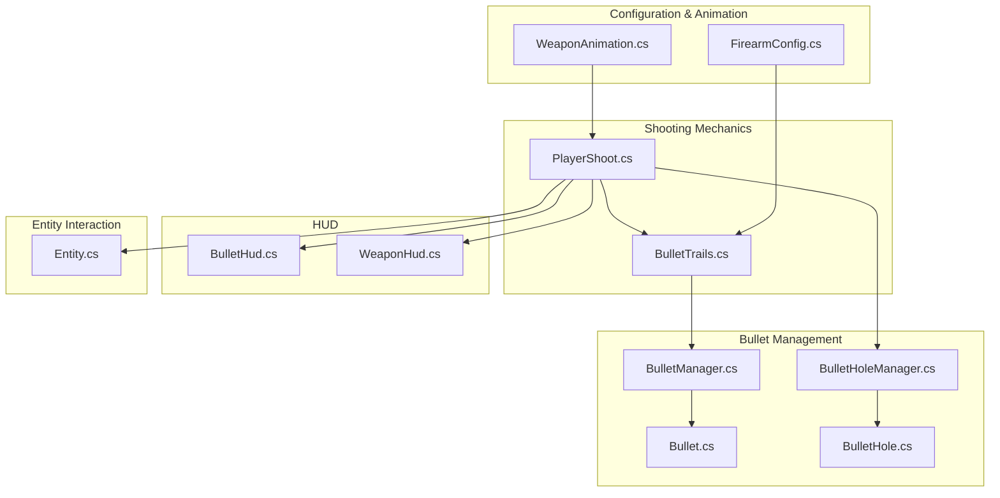
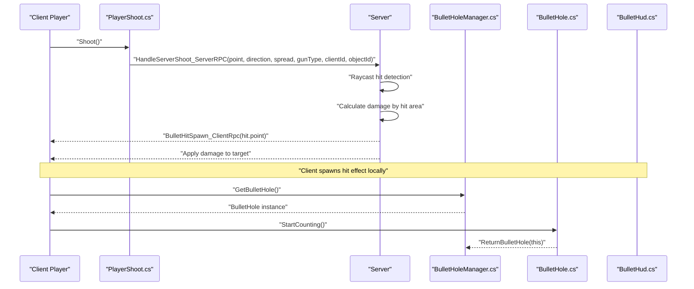
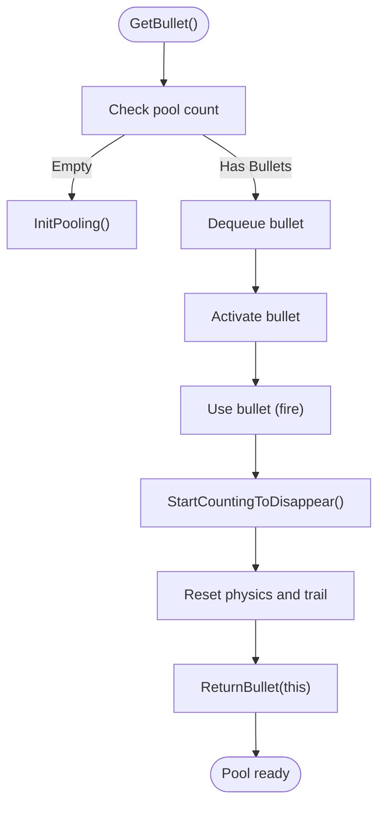
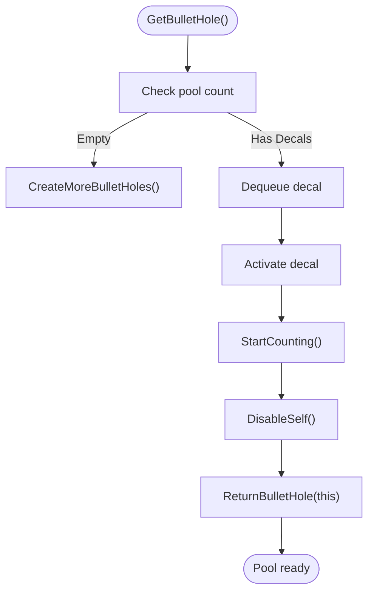
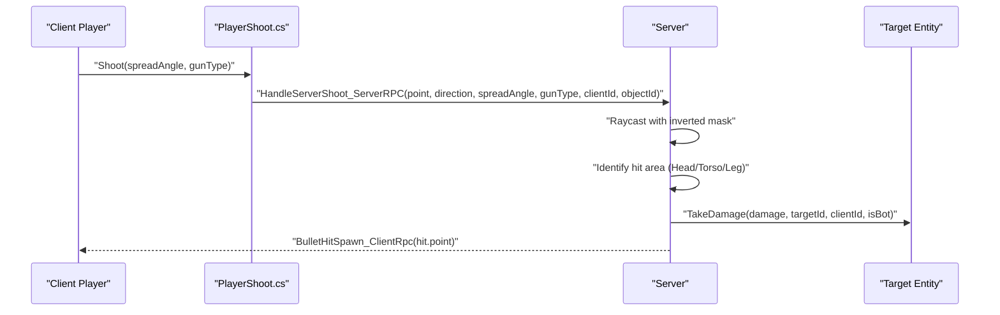
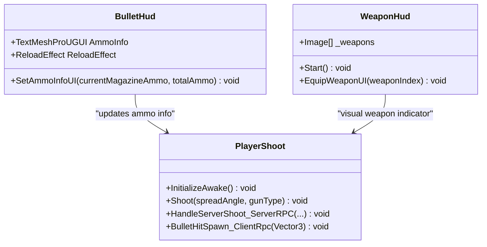
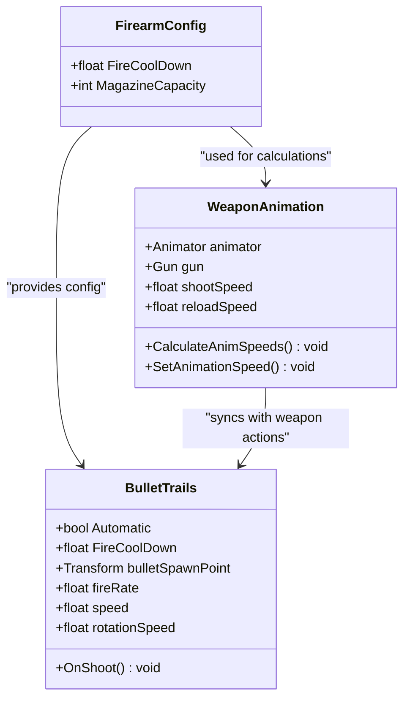
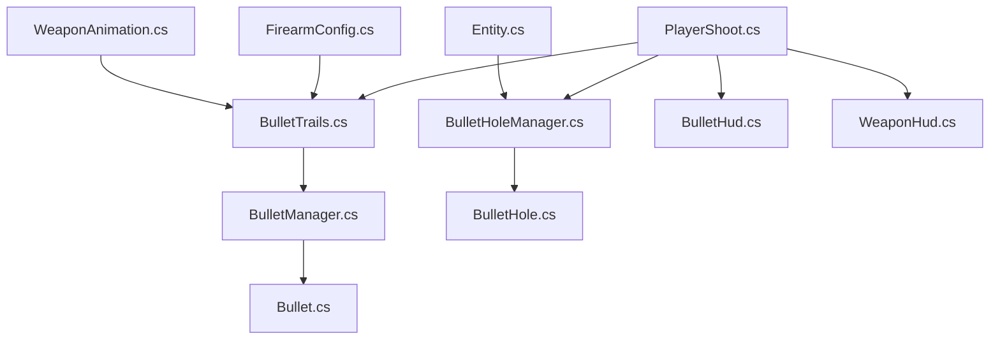

# Bullet System

<cite>
**Referenced Files in This Document**
- [Bullet.cs](file://Assets/FPS-Game/Scripts/Bullet.cs)
- [BulletManager.cs](file://Assets/FPS-Game/Scripts/BulletManager.cs)
- [BulletHole.cs](file://Assets/FPS-Game/Scripts/BulletHole.cs)
- [BulletHoleManager.cs](file://Assets/FPS-Game/Scripts/BulletHoleManager.cs)
- [BulletTrails.cs](file://Assets/FPS-Game/Scripts/BulletTrails.cs)
- [BulletHud.cs](file://Assets/FPS-Game/Scripts/Player/PlayerCanvas/BulletHud.cs)
- [PlayerShoot.cs](file://Assets/FPS-Game/Scripts/Player/PlayerShoot.cs)
- [Entity.cs](file://Assets/FPS-Game/Scripts/Entity.cs)
- [FirearmConfig.cs](file://Assets/FPS-Game/Scripts/ScriptableObject/Weapon/Firearm/FirearmConfig.cs)
- [WeaponAnimation.cs](file://Assets/FPS-Game/Scripts/Player/WeaponAnimation.cs)
- [WeaponHud.cs](file://Assets/FPS-Game/Scripts/Player/WeaponHud.cs)
</cite>

## Table of Contents
1. [Introduction](#introduction)
2. [Project Structure](#project-structure)
3. [Core Components](#core-components)
4. [Architecture Overview](#architecture-overview)
5. [Detailed Component Analysis](#detailed-component-analysis)
6. [Dependency Analysis](#dependency-analysis)
7. [Performance Considerations](#performance-considerations)
8. [Troubleshooting Guide](#troubleshooting-guide)
9. [Conclusion](#conclusion)

## Introduction
This document provides a comprehensive analysis of the Bullet System in the FPS game repository. The system encompasses bullet instantiation, lifecycle management, visual effects, hit detection, damage calculation, and HUD feedback. It integrates networked shooting mechanics with client-server validation to ensure accurate hit registration and damage application. The system utilizes object pooling for bullets and bullet holes to optimize performance and reduce garbage collection overhead.

## Project Structure
The bullet system spans several scripts across different categories:
- Core bullet management: Bullet, BulletManager
- Visual effects and decals: BulletHole, BulletHoleManager
- Shooting mechanics: BulletTrails, PlayerShoot
- HUD integration: BulletHud, WeaponHud
- Configuration and animation: FirearmConfig, WeaponAnimation
- Entity hit handling: Entity

**Diagram sources**
- [BulletManager.cs:1-63](file://Assets/FPS-Game/Scripts/BulletManager.cs#L1-L63)
- [Bullet.cs:1-23](file://Assets/FPS-Game/Scripts/Bullet.cs#L1-L23)
- [BulletHoleManager.cs:1-68](file://Assets/FPS-Game/Scripts/BulletHoleManager.cs#L1-L68)
- [BulletHole.cs:1-17](file://Assets/FPS-Game/Scripts/BulletHole.cs#L1-L17)
- [BulletTrails.cs:1-166](file://Assets/FPS-Game/Scripts/BulletTrails.cs#L1-L166)
- [PlayerShoot.cs:1-162](file://Assets/FPS-Game/Scripts/Player/PlayerShoot.cs#L1-L162)
- [BulletHud.cs:1-13](file://Assets/FPS-Game/Scripts/Player/PlayerCanvas/BulletHud.cs#L1-L13)
- [WeaponHud.cs:1-42](file://Assets/FPS-Game/Scripts/Player/WeaponHud.cs#L1-L42)
- [FirearmConfig.cs:1-9](file://Assets/FPS-Game/Scripts/ScriptableObject/Weapon/Firearm/FirearmConfig.cs#L1-L9)
- [WeaponAnimation.cs:1-64](file://Assets/FPS-Game/Scripts/Player/WeaponAnimation.cs#L1-L64)
- [Entity.cs:1-75](file://Assets/FPS-Game/Scripts/Entity.cs#L1-L75)

**Section sources**
- [BulletManager.cs:1-63](file://Assets/FPS-Game/Scripts/BulletManager.cs#L1-L63)
- [BulletHoleManager.cs:1-68](file://Assets/FPS-Game/Scripts/BulletHoleManager.cs#L1-L68)
- [BulletTrails.cs:1-166](file://Assets/FPS-Game/Scripts/BulletTrails.cs#L1-L166)
- [PlayerShoot.cs:1-162](file://Assets/FPS-Game/Scripts/Player/PlayerShoot.cs#L1-L162)
- [BulletHud.cs:1-13](file://Assets/FPS-Game/Scripts/Player/PlayerCanvas/BulletHud.cs#L1-L13)
- [WeaponHud.cs:1-42](file://Assets/FPS-Game/Scripts/Player/WeaponHud.cs#L1-L42)
- [FirearmConfig.cs:1-9](file://Assets/FPS-Game/Scripts/ScriptableObject/Weapon/Firearm/FirearmConfig.cs#L1-L9)
- [WeaponAnimation.cs:1-64](file://Assets/FPS-Game/Scripts/Player/WeaponAnimation.cs#L1-L64)
- [Entity.cs:1-75](file://Assets/FPS-Game/Scripts/Entity.cs#L1-L75)

## Core Components
This section outlines the primary components responsible for bullet creation, lifecycle, and visual effects.

- Bullet Manager
  - Initializes and maintains a pool of reusable bullet instances.
  - Provides methods to acquire and return bullets to the pool.
  - Uses a queue-based pooling mechanism to minimize instantiation overhead.

- Bullet
  - Manages individual bullet lifecycle, including timed removal and physics reset.
  - Returns itself to the manager after a predefined duration.

- Bullet Hole Manager
  - Manages a pool of bullet hole decal instances for visual impact effects.
  - Handles activation and deactivation cycles with a timer-based lifecycle.

- Bullet Hole
  - Applies a timeout mechanism to disable and return the decal to the manager.

- Shooting Mechanics
  - BulletTrails handles firing logic, cooldown management, and bullet spawning.
  - PlayerShoot manages raycasting, hit detection, damage calculation, and client-server synchronization.

- HUD Integration
  - BulletHud displays current magazine and total ammo counts.
  - WeaponHud visually indicates the currently equipped weapon.

- Configuration and Animation
  - FirearmConfig defines weapon-specific attributes such as fire cooldown and magazine capacity.
  - WeaponAnimation synchronizes animations with weapon actions and cooldowns.

**Section sources**
- [BulletManager.cs:1-63](file://Assets/FPS-Game/Scripts/BulletManager.cs#L1-L63)
- [Bullet.cs:1-23](file://Assets/FPS-Game/Scripts/Bullet.cs#L1-L23)
- [BulletHoleManager.cs:1-68](file://Assets/FPS-Game/Scripts/BulletHoleManager.cs#L1-L68)
- [BulletHole.cs:1-17](file://Assets/FPS-Game/Scripts/BulletHole.cs#L1-L17)
- [BulletTrails.cs:1-166](file://Assets/FPS-Game/Scripts/BulletTrails.cs#L1-L166)
- [PlayerShoot.cs:1-162](file://Assets/FPS-Game/Scripts/Player/PlayerShoot.cs#L1-L162)
- [BulletHud.cs:1-13](file://Assets/FPS-Game/Scripts/Player/PlayerCanvas/BulletHud.cs#L1-L13)
- [WeaponHud.cs:1-42](file://Assets/FPS-Game/Scripts/Player/WeaponHud.cs#L1-L42)
- [FirearmConfig.cs:1-9](file://Assets/FPS-Game/Scripts/ScriptableObject/Weapon/Firearm/FirearmConfig.cs#L1-L9)
- [WeaponAnimation.cs:1-64](file://Assets/FPS-Game/Scripts/Player/WeaponAnimation.cs#L1-L64)

## Architecture Overview
The bullet system follows a client-server architecture with local prediction and server reconciliation:
- Client-side input triggers shooting actions.
- Server validates hits via raycasting and applies damage deterministically.
- Client receives hit effects and updates HUD accordingly.
- Object pooling ensures efficient resource management for bullets and decals.

**Diagram sources**
- [PlayerShoot.cs:79-146](file://Assets/FPS-Game/Scripts/Player/PlayerShoot.cs#L79-L146)
- [BulletHoleManager.cs:40-57](file://Assets/FPS-Game/Scripts/BulletHoleManager.cs#L40-L57)
- [BulletHole.cs:7-16](file://Assets/FPS-Game/Scripts/BulletHole.cs#L7-L16)
- [BulletHud.cs:9-12](file://Assets/FPS-Game/Scripts/Player/PlayerCanvas/BulletHud.cs#L9-L12)

## Detailed Component Analysis

### Bullet Lifecycle Management
The bullet lifecycle is managed through a pooling pattern to avoid frequent instantiation and garbage collection:
- Pool initialization occurs during startup with a fixed number of bullet instances.
- Bullets are activated when needed and deactivated after a timeout period.
- Physics properties are reset before returning to the pool.

**Diagram sources**
- [BulletManager.cs:28-57](file://Assets/FPS-Game/Scripts/BulletManager.cs#L28-L57)
- [Bullet.cs:7-22](file://Assets/FPS-Game/Scripts/Bullet.cs#L7-L22)

**Section sources**
- [BulletManager.cs:1-63](file://Assets/FPS-Game/Scripts/BulletManager.cs#L1-L63)
- [Bullet.cs:1-23](file://Assets/FPS-Game/Scripts/Bullet.cs#L1-L23)

### Bullet Hole Decals
Bullet holes are managed similarly to bullets, ensuring efficient reuse of decal instances:
- A configurable pool size initializes bullet holes at startup.
- Each decal has a timeout-based lifecycle to prevent indefinite accumulation.
- Decals are positioned at hit points and parented to the hit surface for stability.

**Diagram sources**
- [BulletHoleManager.cs:28-67](file://Assets/FPS-Game/Scripts/BulletHoleManager.cs#L28-L67)
- [BulletHole.cs:7-16](file://Assets/FPS-Game/Scripts/BulletHole.cs#L7-L16)

**Section sources**
- [BulletHoleManager.cs:1-68](file://Assets/FPS-Game/Scripts/BulletHoleManager.cs#L1-L68)
- [BulletHole.cs:1-17](file://Assets/FPS-Game/Scripts/BulletHole.cs#L1-L17)

### Shooting Mechanics and Damage Calculation
Shooting involves client-side input, server-side validation, and client-side hit effects:
- PlayerShoot constructs a spread angle around the center direction and performs raycasting.
- Hit area determination influences damage calculation based on weapon type.
- Server RPC handles hit registration, damage application, and self-hit prevention.
- Client RPC spawns hit effects locally for immediate feedback.

**Diagram sources**
- [PlayerShoot.cs:68-146](file://Assets/FPS-Game/Scripts/Player/PlayerShoot.cs#L68-L146)

**Section sources**
- [PlayerShoot.cs:1-162](file://Assets/FPS-Game/Scripts/Player/PlayerShoot.cs#L1-L162)
- [Entity.cs:49-57](file://Assets/FPS-Game/Scripts/Entity.cs#L49-L57)

### HUD Integration
The HUD components provide real-time feedback on weapon state and ammunition:
- BulletHud displays current magazine and total ammo counts.
- WeaponHud highlights the currently equipped weapon in the HUD.
- These components integrate with weapon switching and reloading events.

**Diagram sources**
- [BulletHud.cs:1-13](file://Assets/FPS-Game/Scripts/Player/PlayerCanvas/BulletHud.cs#L1-L13)
- [WeaponHud.cs:1-42](file://Assets/FPS-Game/Scripts/Player/WeaponHud.cs#L1-L42)
- [PlayerShoot.cs:26-77](file://Assets/FPS-Game/Scripts/Player/PlayerShoot.cs#L26-L77)

**Section sources**
- [BulletHud.cs:1-13](file://Assets/FPS-Game/Scripts/Player/PlayerCanvas/BulletHud.cs#L1-L13)
- [WeaponHud.cs:1-42](file://Assets/FPS-Game/Scripts/Player/WeaponHud.cs#L1-L42)
- [PlayerShoot.cs:1-162](file://Assets/FPS-Game/Scripts/Player/PlayerShoot.cs#L1-L162)

### Configuration and Animation
Weapon configuration and animation synchronization enhance the shooting experience:
- FirearmConfig defines weapon-specific attributes such as fire cooldown and magazine capacity.
- WeaponAnimation calculates animation speeds based on weapon cooldowns and synchronizes triggers for shooting and reloading.

**Diagram sources**
- [FirearmConfig.cs:1-9](file://Assets/FPS-Game/Scripts/ScriptableObject/Weapon/Firearm/FirearmConfig.cs#L1-L9)
- [WeaponAnimation.cs:48-62](file://Assets/FPS-Game/Scripts/Player/WeaponAnimation.cs#L48-L62)
- [BulletTrails.cs:16-89](file://Assets/FPS-Game/Scripts/BulletTrails.cs#L16-L89)

**Section sources**
- [FirearmConfig.cs:1-9](file://Assets/FPS-Game/Scripts/ScriptableObject/Weapon/Firearm/FirearmConfig.cs#L1-L9)
- [WeaponAnimation.cs:1-64](file://Assets/FPS-Game/Scripts/Player/WeaponAnimation.cs#L1-L64)
- [BulletTrails.cs:1-166](file://Assets/FPS-Game/Scripts/BulletTrails.cs#L1-L166)

## Dependency Analysis
The bullet system exhibits clear separation of concerns with minimal coupling:
- BulletManager depends on Bullet prefab and maintains a queue of pooled instances.
- Bullet relies on BulletManager for lifecycle management.
- BulletHoleManager depends on BulletHole prefab and manages decal pooling.
- PlayerShoot orchestrates shooting, hit detection, and server communication.
- HUD components depend on PlayerShoot events for updates.
- FirearmConfig and WeaponAnimation provide configuration and animation synchronization.

**Diagram sources**
- [BulletManager.cs:1-63](file://Assets/FPS-Game/Scripts/BulletManager.cs#L1-L63)
- [Bullet.cs:1-23](file://Assets/FPS-Game/Scripts/Bullet.cs#L1-L23)
- [BulletHoleManager.cs:1-68](file://Assets/FPS-Game/Scripts/BulletHoleManager.cs#L1-L68)
- [BulletHole.cs:1-17](file://Assets/FPS-Game/Scripts/BulletHole.cs#L1-L17)
- [BulletTrails.cs:1-166](file://Assets/FPS-Game/Scripts/BulletTrails.cs#L1-L166)
- [PlayerShoot.cs:1-162](file://Assets/FPS-Game/Scripts/Player/PlayerShoot.cs#L1-L162)
- [BulletHud.cs:1-13](file://Assets/FPS-Game/Scripts/Player/PlayerCanvas/BulletHud.cs#L1-L13)
- [WeaponHud.cs:1-42](file://Assets/FPS-Game/Scripts/Player/WeaponHud.cs#L1-L42)
- [FirearmConfig.cs:1-9](file://Assets/FPS-Game/Scripts/ScriptableObject/Weapon/Firearm/FirearmConfig.cs#L1-L9)
- [WeaponAnimation.cs:1-64](file://Assets/FPS-Game/Scripts/Player/WeaponAnimation.cs#L1-L64)
- [Entity.cs:1-75](file://Assets/FPS-Game/Scripts/Entity.cs#L1-L75)

**Section sources**
- [BulletManager.cs:1-63](file://Assets/FPS-Game/Scripts/BulletManager.cs#L1-L63)
- [BulletHoleManager.cs:1-68](file://Assets/FPS-Game/Scripts/BulletHoleManager.cs#L1-L68)
- [BulletTrails.cs:1-166](file://Assets/FPS-Game/Scripts/BulletTrails.cs#L1-L166)
- [PlayerShoot.cs:1-162](file://Assets/FPS-Game/Scripts/Player/PlayerShoot.cs#L1-L162)
- [BulletHud.cs:1-13](file://Assets/FPS-Game/Scripts/Player/PlayerCanvas/BulletHud.cs#L1-L13)
- [WeaponHud.cs:1-42](file://Assets/FPS-Game/Scripts/Player/WeaponHud.cs#L1-L42)
- [FirearmConfig.cs:1-9](file://Assets/FPS-Game/Scripts/ScriptableObject/Weapon/Firearm/FirearmConfig.cs#L1-L9)
- [WeaponAnimation.cs:1-64](file://Assets/FPS-Game/Scripts/Player/WeaponAnimation.cs#L1-L64)
- [Entity.cs:1-75](file://Assets/FPS-Game/Scripts/Entity.cs#L1-L75)

## Performance Considerations
- Object pooling reduces GC pressure by reusing bullet and decal instances instead of instantiating new ones frequently.
- Cooldown management prevents excessive firing rates and unnecessary physics computations.
- Server-side hit validation ensures deterministic outcomes and prevents cheating.
- Animation speed calculations synchronize with weapon cooldowns, preventing animation desynchronization.

## Troubleshooting Guide
Common issues and resolutions:
- Bullets not disappearing: Verify that StartCountingToDisappear is invoked and that ReturnBullet is called after resetting physics.
- Decals not appearing: Ensure GetBulletHole is called and StartCounting is executed to activate the decal lifecycle.
- Self-hit detection failures: Confirm that the server checks OwnerClientId and NetworkObjectId to prevent friendly fire.
- Animation mismatch: Recalculate animation speeds in WeaponAnimation if weapon cooldowns change dynamically.
- HUD not updating: Ensure SetAmmoInfoUI is called with current magazine and total ammo values.

**Section sources**
- [Bullet.cs:7-22](file://Assets/FPS-Game/Scripts/Bullet.cs#L7-L22)
- [BulletHole.cs:7-16](file://Assets/FPS-Game/Scripts/BulletHole.cs#L7-L16)
- [PlayerShoot.cs:104-112](file://Assets/FPS-Game/Scripts/Player/PlayerShoot.cs#L104-L112)
- [WeaponAnimation.cs:48-62](file://Assets/FPS-Game/Scripts/Player/WeaponAnimation.cs#L48-L62)
- [BulletHud.cs:9-12](file://Assets/FPS-Game/Scripts/Player/PlayerCanvas/BulletHud.cs#L9-L12)

## Conclusion
The Bullet System integrates efficient object pooling, robust client-server validation, and responsive HUD feedback to deliver a smooth and accurate shooting experience. Its modular design facilitates maintainability and extensibility, while performance optimizations ensure consistent gameplay across various scenarios.