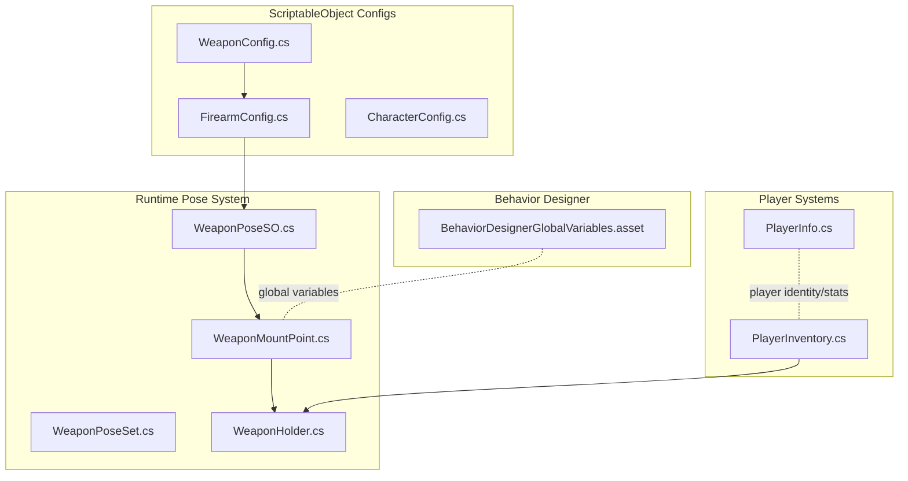
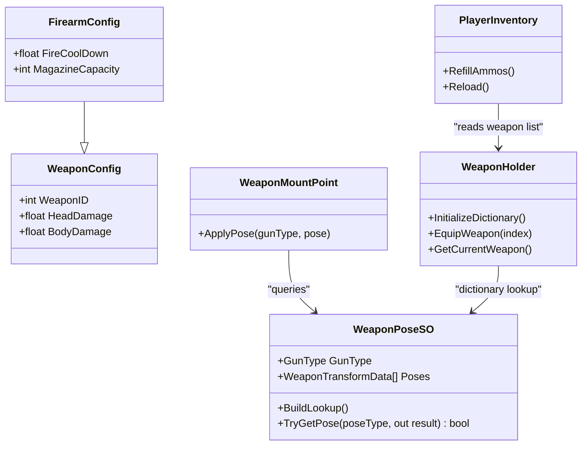
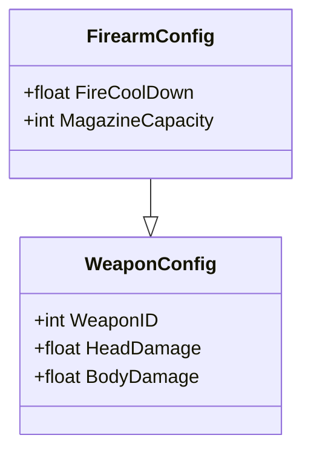
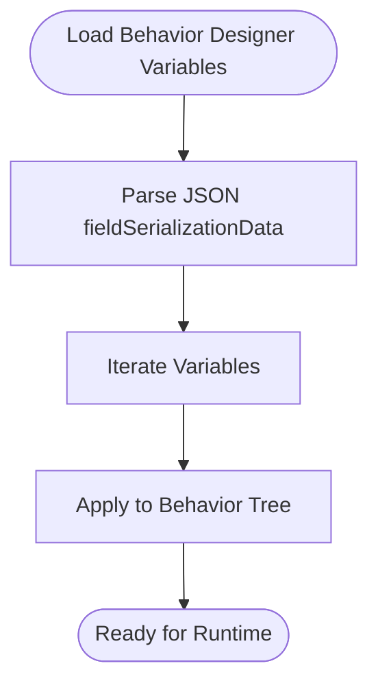
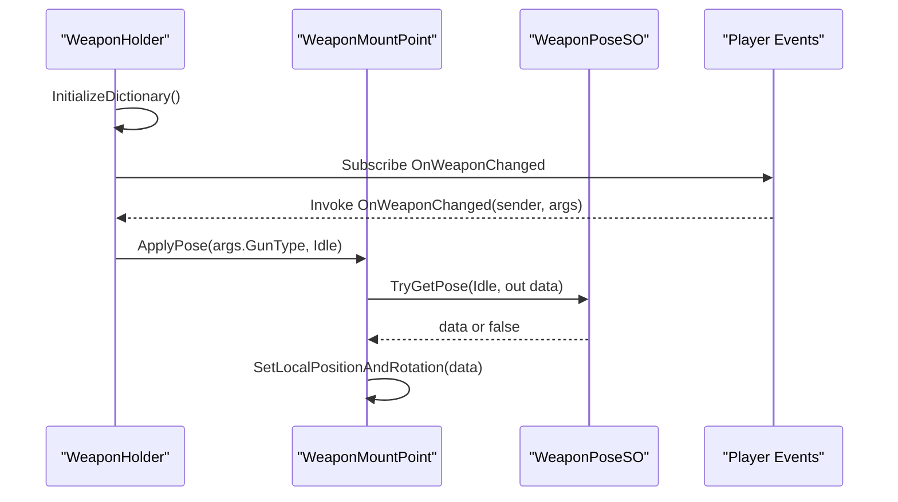
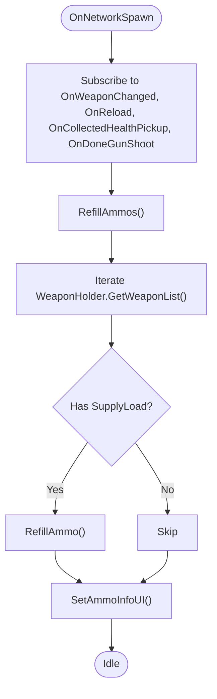
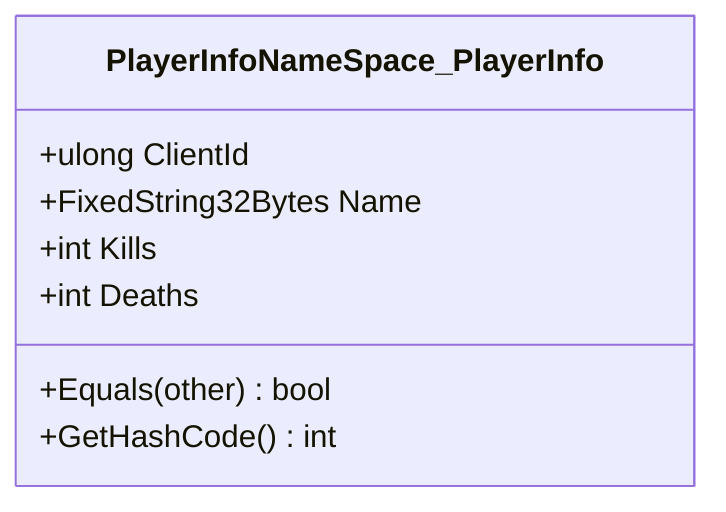
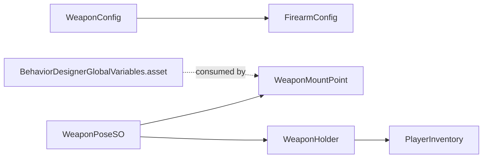

# Configuration & Data Management

<cite>
**Referenced Files in This Document**
- [CharacterConfig.cs](file://Assets/FPS-Game/Scripts/ScriptableObject/Character/CharacterConfig.cs)
- [WeaponConfig.cs](file://Assets/FPS-Game/Scripts/ScriptableObject/Weapon/WeaponConfig.cs)
- [FirearmConfig.cs](file://Assets/FPS-Game/Scripts/ScriptableObject/Weapon/Firearm/FirearmConfig.cs)
- [WeaponPoseSO.cs](file://Assets/FPS-Game/Scripts/Player/WeaponPose/WeaponPoseSO.cs)
- [WeaponPoseSet.cs](file://Assets/FPS-Game/Scripts/Player/WeaponPose/WeaponPoseSet.cs)
- [WeaponMountPoint.cs](file://Assets/FPS-Game/Scripts/Player/WeaponMountPoint.cs)
- [WeaponHolder.cs](file://Assets/FPS-Game/Scripts/Player/WeaponHolder.cs)
- [PlayerInventory.cs](file://Assets/FPS-Game/Scripts/Player/PlayerInventory.cs)
- [PlayerInfo.cs](file://Assets/FPS-Game/Scripts/PlayerInfo.cs)
- [BehaviorDesignerGlobalVariables.asset](file://Assets/Behavior Designer/Resources/BehaviorDesignerGlobalVariables.asset)
</cite>

## Table of Contents
1. [Introduction](#introduction)
2. [Project Structure](#project-structure)
3. [Core Components](#core-components)
4. [Architecture Overview](#architecture-overview)
5. [Detailed Component Analysis](#detailed-component-analysis)
6. [Dependency Analysis](#dependency-analysis)
7. [Performance Considerations](#performance-considerations)
8. [Troubleshooting Guide](#troubleshooting-guide)
9. [Conclusion](#conclusion)
10. [Appendices](#appendices)

## Introduction
This document describes the configuration and data management systems used in the project. It focuses on the ScriptableObject-based configuration architecture, weapon pose configuration, and behavior designer global variables. It also documents entity relationships among weapon configurations, character stats, and player data, along with field definitions for game balance parameters, weapon properties, and player attributes. Serialization patterns, caching strategies, runtime modification capabilities, data lifecycle, migration paths, and security/access control considerations are covered to support maintainable and extensible configuration management.

## Project Structure
The configuration system is primarily implemented via ScriptableObject assets located under the ScriptableObject folder and integrated at runtime by player and weapon components. Behavior designer global variables are stored as Unity resources. Player data is represented by a namespace-scoped structure definition.

**Diagram sources**
- [WeaponConfig.cs:1-10](file://Assets/FPS-Game/Scripts/ScriptableObject/Weapon/WeaponConfig.cs#L1-L10)
- [FirearmConfig.cs:1-9](file://Assets/FPS-Game/Scripts/ScriptableObject/Weapon/Firearm/FirearmConfig.cs#L1-L9)
- [CharacterConfig.cs:1-8](file://Assets/FPS-Game/Scripts/ScriptableObject/Character/CharacterConfig.cs#L1-L8)
- [WeaponPoseSO.cs:1-36](file://Assets/FPS-Game/Scripts/Player/WeaponPose/WeaponPoseSO.cs#L1-L36)
- [WeaponPoseSet.cs:1-29](file://Assets/FPS-Game/Scripts/Player/WeaponPose/WeaponPoseSet.cs#L1-L29)
- [WeaponMountPoint.cs:1-44](file://Assets/FPS-Game/Scripts/Player/WeaponMountPoint.cs#L1-L44)
- [WeaponHolder.cs:50-100](file://Assets/FPS-Game/Scripts/Player/WeaponHolder.cs#L50-L100)
- [PlayerInventory.cs:1-51](file://Assets/FPS-Game/Scripts/Player/PlayerInventory.cs#L1-L51)
- [PlayerInfo.cs:1-53](file://Assets/FPS-Game/Scripts/PlayerInfo.cs#L1-L53)
- [BehaviorDesignerGlobalVariables.asset:1-27](file://Assets/Behavior Designer/Resources/BehaviorDesignerGlobalVariables.asset#L1-L27)

**Section sources**
- [WeaponConfig.cs:1-10](file://Assets/FPS-Game/Scripts/ScriptableObject/Weapon/WeaponConfig.cs#L1-L10)
- [FirearmConfig.cs:1-9](file://Assets/FPS-Game/Scripts/ScriptableObject/Weapon/Firearm/FirearmConfig.cs#L1-L9)
- [CharacterConfig.cs:1-8](file://Assets/FPS-Game/Scripts/ScriptableObject/Character/CharacterConfig.cs#L1-L8)
- [WeaponPoseSO.cs:1-36](file://Assets/FPS-Game/Scripts/Player/WeaponPose/WeaponPoseSO.cs#L1-L36)
- [WeaponPoseSet.cs:1-29](file://Assets/FPS-Game/Scripts/Player/WeaponPose/WeaponPoseSet.cs#L1-L29)
- [WeaponMountPoint.cs:1-44](file://Assets/FPS-Game/Scripts/Player/WeaponMountPoint.cs#L1-L44)
- [WeaponHolder.cs:50-100](file://Assets/FPS-Game/Scripts/Player/WeaponHolder.cs#L50-L100)
- [PlayerInventory.cs:1-51](file://Assets/FPS-Game/Scripts/Player/PlayerInventory.cs#L1-L51)
- [PlayerInfo.cs:1-53](file://Assets/FPS-Game/Scripts/PlayerInfo.cs#L1-L53)
- [BehaviorDesignerGlobalVariables.asset:1-27](file://Assets/Behavior Designer/Resources/BehaviorDesignerGlobalVariables.asset#L1-L27)

## Core Components
- ScriptableObject-based configuration:
  - Base weapon configuration defines weapon identifiers and damage scaling factors.
  - Firearm-specific configuration extends weapon config with fire cooldown and magazine capacity.
  - Character configuration placeholder asset exists for future character stats.
- Runtime pose system:
  - Pose lookup cache built from a ScriptableObject list of pose entries keyed by pose type.
  - Mount point applies pose transforms to weapon attachments based on current gun type.
- Player inventory and weapon holder:
  - Inventory reacts to events to refill ammo and manage reloads.
  - Holder initializes weapon selection and equips weapons on spawn.
- Behavior designer global variables:
  - Global variables resource stores shared variables serialized as JSON for behavior trees.
- Player info:
  - Namespace-scoped structure definition for player identity and stats.

**Section sources**
- [WeaponConfig.cs:1-10](file://Assets/FPS-Game/Scripts/ScriptableObject/Weapon/WeaponConfig.cs#L1-L10)
- [FirearmConfig.cs:1-9](file://Assets/FPS-Game/Scripts/ScriptableObject/Weapon/Firearm/FirearmConfig.cs#L1-L9)
- [CharacterConfig.cs:1-8](file://Assets/FPS-Game/Scripts/ScriptableObject/Character/CharacterConfig.cs#L1-L8)
- [WeaponPoseSO.cs:1-36](file://Assets/FPS-Game/Scripts/Player/WeaponPose/WeaponPoseSO.cs#L1-L36)
- [WeaponMountPoint.cs:1-44](file://Assets/FPS-Game/Scripts/Player/WeaponMountPoint.cs#L1-L44)
- [WeaponHolder.cs:50-100](file://Assets/FPS-Game/Scripts/Player/WeaponHolder.cs#L50-L100)
- [PlayerInventory.cs:1-51](file://Assets/FPS-Game/Scripts/Player/PlayerInventory.cs#L1-L51)
- [BehaviorDesignerGlobalVariables.asset:1-27](file://Assets/Behavior Designer/Resources/BehaviorDesignerGlobalVariables.asset#L1-L27)
- [PlayerInfo.cs:1-53](file://Assets/FPS-Game/Scripts/PlayerInfo.cs#L1-L53)

## Architecture Overview
The configuration architecture separates static definitions from runtime application. ScriptableObject assets define weapon and pose data. Runtime components subscribe to events and apply pose transforms and inventory actions based on these configurations.

**Diagram sources**
- [WeaponConfig.cs:1-10](file://Assets/FPS-Game/Scripts/ScriptableObject/Weapon/WeaponConfig.cs#L1-L10)
- [FirearmConfig.cs:1-9](file://Assets/FPS-Game/Scripts/ScriptableObject/Weapon/Firearm/FirearmConfig.cs#L1-L9)
- [WeaponPoseSO.cs:1-36](file://Assets/FPS-Game/Scripts/Player/WeaponPose/WeaponPoseSO.cs#L1-L36)
- [WeaponMountPoint.cs:1-44](file://Assets/FPS-Game/Scripts/Player/WeaponMountPoint.cs#L1-L44)
- [WeaponHolder.cs:50-100](file://Assets/FPS-Game/Scripts/Player/WeaponHolder.cs#L50-L100)
- [PlayerInventory.cs:1-51](file://Assets/FPS-Game/Scripts/Player/PlayerInventory.cs#L1-L51)

## Detailed Component Analysis

### ScriptableObject Configuration Model
- WeaponConfig
  - Fields: weapon identifier and body/head damage multipliers.
  - Purpose: baseline weapon properties for balancing.
- FirearmConfig
  - Fields: fire cooldown and magazine capacity.
  - Purpose: firearm-specific tuning for rate-of-fire and clip mechanics.
- CharacterConfig
  - Purpose: placeholder for character stats and traits; ready for extension.

Entity relationships:
- FirearmConfig inherits from WeaponConfig, extending with firearm-specific fields.
- These configs are consumed by runtime systems to configure gameplay parameters.

**Diagram sources**
- [WeaponConfig.cs:1-10](file://Assets/FPS-Game/Scripts/ScriptableObject/Weapon/WeaponConfig.cs#L1-L10)
- [FirearmConfig.cs:1-9](file://Assets/FPS-Game/Scripts/ScriptableObject/Weapon/Firearm/FirearmConfig.cs#L1-L9)

**Section sources**
- [WeaponConfig.cs:1-10](file://Assets/FPS-Game/Scripts/ScriptableObject/Weapon/WeaponConfig.cs#L1-L10)
- [FirearmConfig.cs:1-9](file://Assets/FPS-Game/Scripts/ScriptableObject/Weapon/Firearm/FirearmConfig.cs#L1-L9)
- [CharacterConfig.cs:1-8](file://Assets/FPS-Game/Scripts/ScriptableObject/Character/CharacterConfig.cs#L1-L8)

### Behavior Designer Global Variables
- Stored as a Unity resource asset containing serialized JSON for shared variables.
- Supports global/shared variables for behavior trees (e.g., camera references, flags, vectors).
- Version metadata included in the asset.

**Diagram sources**
- [BehaviorDesignerGlobalVariables.asset:1-27](file://Assets/Behavior Designer/Resources/BehaviorDesignerGlobalVariables.asset#L1-L27)

**Section sources**
- [BehaviorDesignerGlobalVariables.asset:1-27](file://Assets/Behavior Designer/Resources/BehaviorDesignerGlobalVariables.asset#L1-L27)

### Weapon Pose Configuration and Runtime Application
- WeaponPoseSO
  - Holds a list of pose entries keyed by pose type.
  - Builds an internal dictionary for O(1) lookups on demand.
  - Provides a safe getter returning false when pose is missing.
- WeaponPoseSet and WeaponTransformData
  - Serializable structures representing pose data per gun type.
- WeaponMountPoint
  - Subscribes to weapon change events and applies pose transforms to mounted weapon.
  - Iterates through configured pose assets to find a match for the current gun type.
- WeaponHolder
  - Initializes a dictionary mapping gun type to pose asset.
  - Equips initial weapons and manages weapon switching.

**Diagram sources**
- [WeaponHolder.cs:50-100](file://Assets/FPS-Game/Scripts/Player/WeaponHolder.cs#L50-L100)
- [WeaponMountPoint.cs:1-44](file://Assets/FPS-Game/Scripts/Player/WeaponMountPoint.cs#L1-L44)
- [WeaponPoseSO.cs:1-36](file://Assets/FPS-Game/Scripts/Player/WeaponPose/WeaponPoseSO.cs#L1-L36)

**Section sources**
- [WeaponPoseSO.cs:1-36](file://Assets/FPS-Game/Scripts/Player/WeaponPose/WeaponPoseSO.cs#L1-L36)
- [WeaponPoseSet.cs:1-29](file://Assets/FPS-Game/Scripts/Player/WeaponPose/WeaponPoseSet.cs#L1-L29)
- [WeaponMountPoint.cs:1-44](file://Assets/FPS-Game/Scripts/Player/WeaponMountPoint.cs#L1-L44)
- [WeaponHolder.cs:50-100](file://Assets/FPS-Game/Scripts/Player/WeaponHolder.cs#L50-L100)

### Player Inventory and Ammunition Management
- PlayerInventory subscribes to events to:
  - Refill ammo across all equipped weapons.
  - Trigger reload logic based on current weapon supply state.
- Integration with WeaponHolder ensures accurate enumeration of current weapons.

**Diagram sources**
- [PlayerInventory.cs:1-51](file://Assets/FPS-Game/Scripts/Player/PlayerInventory.cs#L1-L51)
- [WeaponHolder.cs:50-100](file://Assets/FPS-Game/Scripts/Player/WeaponHolder.cs#L50-L100)

**Section sources**
- [PlayerInventory.cs:1-51](file://Assets/FPS-Game/Scripts/Player/PlayerInventory.cs#L1-L51)
- [WeaponHolder.cs:50-100](file://Assets/FPS-Game/Scripts/Player/WeaponHolder.cs#L50-L100)

### Player Identity and Stats Representation
- PlayerInfo is defined within a namespace-scoped structure with fields for client identifier, name, kills, and deaths.
- The structure includes equality and hashing support, indicating intent for deterministic serialization and comparison.

**Diagram sources**
- [PlayerInfo.cs:1-53](file://Assets/FPS-Game/Scripts/PlayerInfo.cs#L1-L53)

**Section sources**
- [PlayerInfo.cs:1-53](file://Assets/FPS-Game/Scripts/PlayerInfo.cs#L1-L53)

## Dependency Analysis
- Inheritance hierarchy:
  - FirearmConfig extends WeaponConfig, inheriting weapon ID and damage fields.
- Runtime dependencies:
  - WeaponMountPoint depends on WeaponPoseSO for pose data.
  - WeaponHolder maintains a dictionary mapping gun type to pose asset for fast lookup.
  - PlayerInventory depends on WeaponHolder for weapon enumeration and SupplyLoad components for ammo refill.
- Behavior designer variables are consumed by behavior tree systems via the resource asset.

**Diagram sources**
- [WeaponConfig.cs:1-10](file://Assets/FPS-Game/Scripts/ScriptableObject/Weapon/WeaponConfig.cs#L1-L10)
- [FirearmConfig.cs:1-9](file://Assets/FPS-Game/Scripts/ScriptableObject/Weapon/Firearm/FirearmConfig.cs#L1-L9)
- [WeaponPoseSO.cs:1-36](file://Assets/FPS-Game/Scripts/Player/WeaponPose/WeaponPoseSO.cs#L1-L36)
- [WeaponMountPoint.cs:1-44](file://Assets/FPS-Game/Scripts/Player/WeaponMountPoint.cs#L1-L44)
- [WeaponHolder.cs:50-100](file://Assets/FPS-Game/Scripts/Player/WeaponHolder.cs#L50-L100)
- [PlayerInventory.cs:1-51](file://Assets/FPS-Game/Scripts/Player/PlayerInventory.cs#L1-L51)
- [BehaviorDesignerGlobalVariables.asset:1-27](file://Assets/Behavior Designer/Resources/BehaviorDesignerGlobalVariables.asset#L1-L27)

**Section sources**
- [WeaponConfig.cs:1-10](file://Assets/FPS-Game/Scripts/ScriptableObject/Weapon/WeaponConfig.cs#L1-L10)
- [FirearmConfig.cs:1-9](file://Assets/FPS-Game/Scripts/ScriptableObject/Weapon/Firearm/FirearmConfig.cs#L1-L9)
- [WeaponPoseSO.cs:1-36](file://Assets/FPS-Game/Scripts/Player/WeaponPose/WeaponPoseSO.cs#L1-L36)
- [WeaponMountPoint.cs:1-44](file://Assets/FPS-Game/Scripts/Player/WeaponMountPoint.cs#L1-L44)
- [WeaponHolder.cs:50-100](file://Assets/FPS-Game/Scripts/Player/WeaponHolder.cs#L50-L100)
- [PlayerInventory.cs:1-51](file://Assets/FPS-Game/Scripts/Player/PlayerInventory.cs#L1-L51)
- [BehaviorDesignerGlobalVariables.asset:1-27](file://Assets/Behavior Designer/Resources/BehaviorDesignerGlobalVariables.asset#L1-L27)

## Performance Considerations
- Pose lookup caching:
  - WeaponPoseSO builds a dictionary on first access to avoid repeated linear scans of pose lists.
  - This reduces repeated dictionary construction and improves runtime performance for pose queries.
- Event-driven updates:
  - PlayerInventory and WeaponMountPoint subscribe to events to minimize polling and react only to state changes.
- Serialization patterns:
  - ScriptableObject fields are serialized via Unity’s serialization system; ensure minimal unnecessary writes to disk.
  - Behavior designer variables are stored as JSON in a single asset, reducing IO overhead during runtime.

[No sources needed since this section provides general guidance]

## Troubleshooting Guide
- Missing pose for gun type:
  - If no pose asset matches the current gun type, a warning is logged. Verify that the mount point’s pose list includes entries for all supported gun types.
- Missing pose entry:
  - If a pose type is not present in the selected pose asset, a warning is logged. Ensure the pose asset contains entries for all required pose types.
- No current weapon supply:
  - If a weapon lacks a SupplyLoad component, reloading is skipped. Ensure all weapons have SupplyLoad attached for proper reload logic.
- Behavior designer variables:
  - If variables appear uninitialized, verify the JSON serialization data in the resource asset and confirm the asset is loaded at runtime.

**Section sources**
- [WeaponMountPoint.cs:24-44](file://Assets/FPS-Game/Scripts/Player/WeaponMountPoint.cs#L24-L44)
- [WeaponPoseSO.cs:24-36](file://Assets/FPS-Game/Scripts/Player/WeaponPose/WeaponPoseSO.cs#L24-L36)
- [PlayerInventory.cs:45-51](file://Assets/FPS-Game/Scripts/Player/PlayerInventory.cs#L45-L51)
- [BehaviorDesignerGlobalVariables.asset:1-27](file://Assets/Behavior Designer/Resources/BehaviorDesignerGlobalVariables.asset#L1-L27)

## Conclusion
The configuration system leverages ScriptableObject assets for static definitions and runtime components for dynamic application. The pose system caches lookups for performance, while event-driven components keep inventory and weapon states synchronized. Behavior designer variables are centralized in a resource asset for global access. Player identity and stats are modeled with a namespace-scoped structure supporting deterministic serialization. Together, these patterns enable maintainable, extensible, and performant configuration management.

[No sources needed since this section summarizes without analyzing specific files]

## Appendices

### Field Definitions and Data Validation Rules
- WeaponConfig
  - WeaponID: integer identifier for weapon instances.
  - HeadDamage: float multiplier for headshot damage scaling.
  - BodyDamage: float multiplier for bodyshot damage scaling.
  - Validation: ensure multipliers are non-negative; enforce upper bounds for balance.
- FirearmConfig
  - FireCoolDown: float cooldown period between shots.
  - MagazineCapacity: positive integer capacity; validate non-zero and reasonable limits.
  - Validation: ensure FireCoolDown is non-negative; enforce MagazineCapacity > 0.
- WeaponPoseSO
  - GunType: enum value identifying the associated weapon type.
  - Poses: list of pose entries; ensure unique pose types per asset.
  - Validation: prevent duplicate pose types; ensure positions and rotations are valid.
- BehaviorDesignerGlobalVariables.asset
  - JSONSerialization: serialized variables; validate structure integrity.
  - Version: track compatibility across upgrades.

**Section sources**
- [WeaponConfig.cs:1-10](file://Assets/FPS-Game/Scripts/ScriptableObject/Weapon/WeaponConfig.cs#L1-L10)
- [FirearmConfig.cs:1-9](file://Assets/FPS-Game/Scripts/ScriptableObject/Weapon/Firearm/FirearmConfig.cs#L1-L9)
- [WeaponPoseSO.cs:1-36](file://Assets/FPS-Game/Scripts/Player/WeaponPose/WeaponPoseSO.cs#L1-L36)
- [BehaviorDesignerGlobalVariables.asset:1-27](file://Assets/Behavior Designer/Resources/BehaviorDesignerGlobalVariables.asset#L1-L27)

### Data Access Patterns and Caching Strategies
- Access patterns:
  - Retrieve weapon configs via ScriptableObject assets.
  - Query pose data through WeaponPoseSO.TryGetPose with cached dictionary.
  - Subscribe to events for inventory and pose updates.
- Caching:
  - Pose dictionary built once and reused; rebuild only if underlying list changes.
  - Event subscriptions ensure reactive updates without polling.

**Section sources**
- [WeaponPoseSO.cs:12-36](file://Assets/FPS-Game/Scripts/Player/WeaponPose/WeaponPoseSO.cs#L12-L36)
- [PlayerInventory.cs:16-30](file://Assets/FPS-Game/Scripts/Player/PlayerInventory.cs#L16-L30)
- [WeaponMountPoint.cs:11-22](file://Assets/FPS-Game/Scripts/Player/WeaponMountPoint.cs#L11-L22)

### Runtime Modification Capabilities
- Modify weapon configs in the Unity Editor; changes take effect at runtime for new instances.
- Adjust pose assets to tweak weapon positioning; ensure dictionary is rebuilt if modified at runtime.
- Behavior designer variables can be edited in the inspector; ensure asset is reloaded if changed at runtime.

**Section sources**
- [WeaponPoseSO.cs:14-22](file://Assets/FPS-Game/Scripts/Player/WeaponPose/WeaponPoseSO.cs#L14-L22)
- [BehaviorDesignerGlobalVariables.asset:1-27](file://Assets/Behavior Designer/Resources/BehaviorDesignerGlobalVariables.asset#L1-L27)

### Data Lifecycle
- Player profiles:
  - Created upon player registration; persisted across sessions.
  - Updated on kills/deaths; serialized deterministically for network consistency.
- Weapon loadouts:
  - Initialized on spawn; synchronized across network clients.
  - Modified via inventory actions; validated against SupplyLoad constraints.
- Game settings:
  - Loaded from ScriptableObject assets; updated via editor or configuration menus.

**Section sources**
- [PlayerInfo.cs:1-53](file://Assets/FPS-Game/Scripts/PlayerInfo.cs#L1-L53)
- [PlayerInventory.cs:32-51](file://Assets/FPS-Game/Scripts/Player/PlayerInventory.cs#L32-L51)
- [WeaponHolder.cs:79-95](file://Assets/FPS-Game/Scripts/Player/WeaponHolder.cs#L79-L95)

### Data Migration Paths and Version Management
- ScriptableObject assets:
  - Backward-compatible additions encouraged; deprecate fields with obsolete attributes.
  - Validate asset version on load and migrate fields if necessary.
- Behavior designer variables:
  - Track version in the asset; provide migration routines to update JSONSerialization on version changes.

**Section sources**
- [BehaviorDesignerGlobalVariables.asset:26-27](file://Assets/Behavior Designer/Resources/BehaviorDesignerGlobalVariables.asset#L26-L27)

### Security and Access Control
- Sensitive player information:
  - Use deterministic serialization for network-safe comparisons.
  - Avoid exposing raw client identifiers in UI; use derived identifiers where appropriate.
- Configuration modifications:
  - Restrict editing of ScriptableObject assets to trusted editors.
  - Validate all configuration inputs at runtime to prevent invalid states.

**Section sources**
- [PlayerInfo.cs:10-52](file://Assets/FPS-Game/Scripts/PlayerInfo.cs#L10-L52)