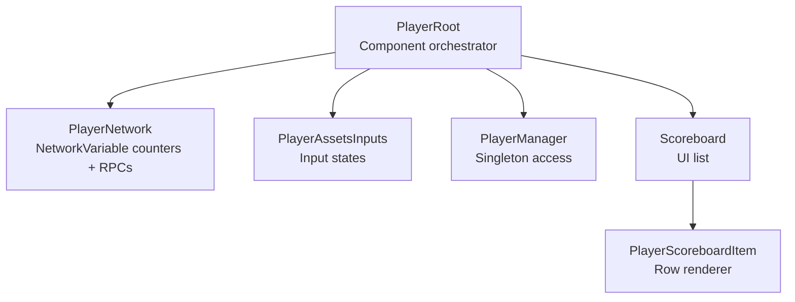
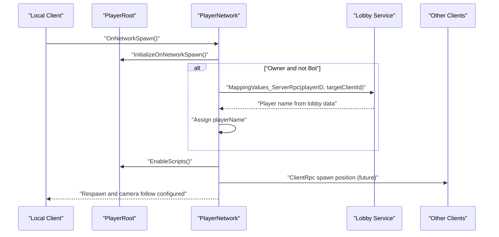
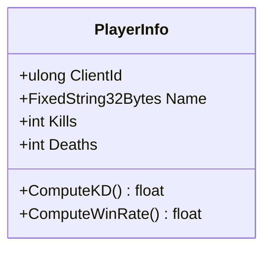
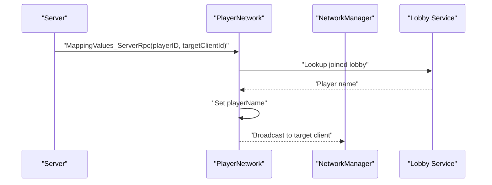
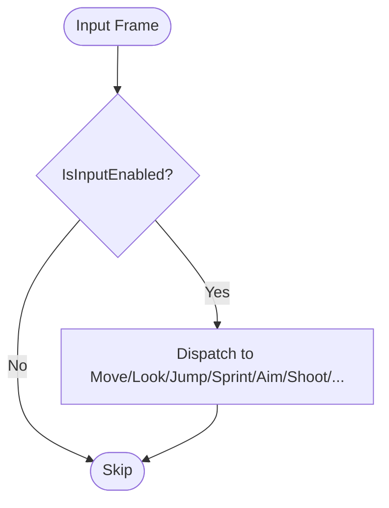
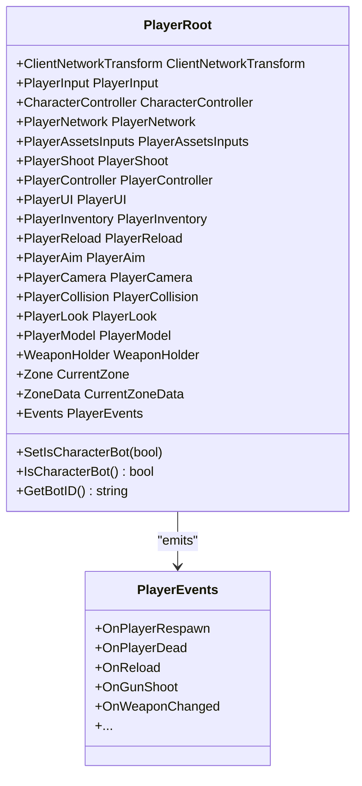
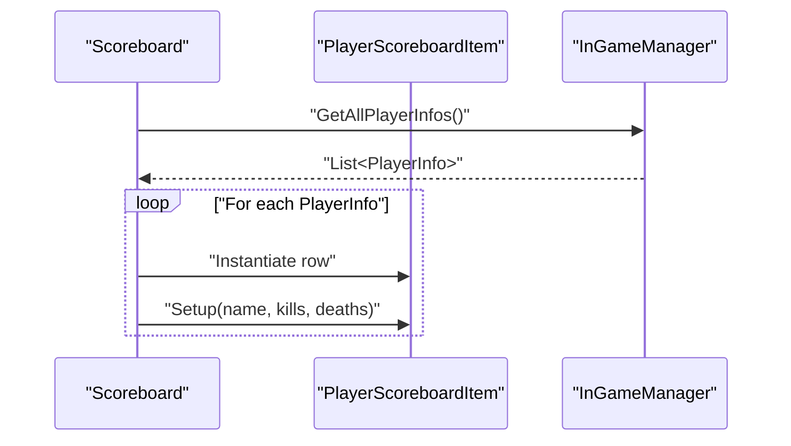
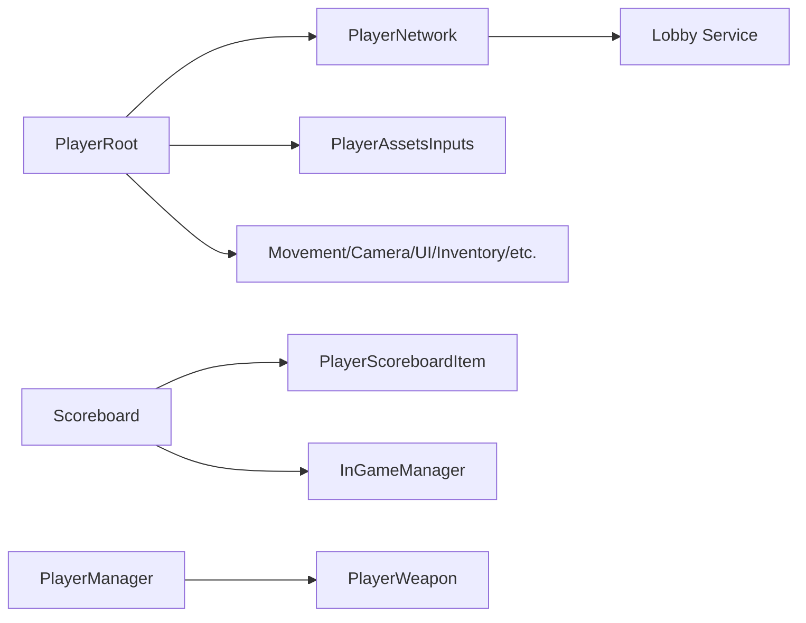

# Player Data Management

<cite>
**Referenced Files in This Document**
- [PlayerInfo.cs](file://Assets/FPS-Game/Scripts/PlayerInfo.cs)
- [PlayerNetwork.cs](file://Assets/FPS-Game/Scripts/Player/PlayerNetwork.cs)
- [PlayerAssetsInputs.cs](file://Assets/FPS-Game/Scripts/Player/PlayerAssetsInputs.cs)
- [PlayerRoot.cs](file://Assets/FPS-Game/Scripts/Player/PlayerRoot.cs)
- [PlayerManager.cs](file://Assets/FPS-Game/Scripts/PlayerManager.cs)
- [Scoreboard.cs](file://Assets/FPS-Game/Scripts/Scoreboard.cs)
- [PlayerScoreboardItem.cs](file://Assets/FPS-Game/Scripts/PlayerScoreboardItem.cs)
</cite>

## Table of Contents
1. [Introduction](#introduction)
2. [Project Structure](#project-structure)
3. [Core Components](#core-components)
4. [Architecture Overview](#architecture-overview)
5. [Detailed Component Analysis](#detailed-component-analysis)
6. [Dependency Analysis](#dependency-analysis)
7. [Performance Considerations](#performance-considerations)
8. [Troubleshooting Guide](#troubleshooting-guide)
9. [Conclusion](#conclusion)
10. [Appendices](#appendices)

## Introduction
This document explains the player data management systems in the game, focusing on:
- Player identity and statistics (kills, deaths, and derived metrics)
- Multiplayer synchronization via NetworkVariable and RPCs
- Player-specific asset and input configuration
- Persistence patterns for profiles, scoreboards, and leaderboards
- Network synchronization protocols for state, health, and inventory
- Validation, sanitization, and security considerations
- Relationship between local player data and server-authoritative state
- Initialization, runtime updates, cleanup, and performance optimizations

## Project Structure
The player data stack spans several scripts under the Player subsystem and supporting managers:
- Player identity and stats: PlayerInfo placeholder and scoreboard integration
- Networking: PlayerNetwork with NetworkVariable counters and RPCs
- Inputs: PlayerAssetsInputs capturing and exposing input states
- Orchestration: PlayerRoot coordinating components and initialization order
- Managers: PlayerManager and Scoreboard for lifecycle and UI presentation

**Diagram sources**
- [PlayerRoot.cs:159-366](file://Assets/FPS-Game/Scripts/Player/PlayerRoot.cs#L159-L366)
- [PlayerNetwork.cs:12-221](file://Assets/FPS-Game/Scripts/Player/PlayerNetwork.cs#L12-L221)
- [PlayerAssetsInputs.cs:8-240](file://Assets/FPS-Game/Scripts/Player/PlayerAssetsInputs.cs#L8-L240)
- [PlayerManager.cs:6-34](file://Assets/FPS-Game/Scripts/PlayerManager.cs#L6-L34)
- [Scoreboard.cs:4-46](file://Assets/FPS-Game/Scripts/Scoreboard.cs#L4-L46)
- [PlayerScoreboardItem.cs](file://Assets/FPS-Game/Scripts/PlayerScoreboardItem.cs)

**Section sources**
- [PlayerRoot.cs:159-366](file://Assets/FPS-Game/Scripts/Player/PlayerRoot.cs#L159-L366)
- [PlayerNetwork.cs:12-221](file://Assets/FPS-Game/Scripts/Player/PlayerNetwork.cs#L12-L221)
- [PlayerAssetsInputs.cs:8-240](file://Assets/FPS-Game/Scripts/Player/PlayerAssetsInputs.cs#L8-L240)
- [PlayerManager.cs:6-34](file://Assets/FPS-Game/Scripts/PlayerManager.cs#L6-L34)
- [Scoreboard.cs:4-46](file://Assets/FPS-Game/Scripts/Scoreboard.cs#L4-L46)

## Core Components
- PlayerInfo: Defines the data model for player identity and statistics. The current implementation includes a commented struct with fields for client ID, name, kills, and deaths. This structure serves as the canonical representation for scoreboard and leaderboard entries.
- PlayerNetwork: Manages multiplayer synchronization for kills, deaths, respawn behavior, camera binding, and mapping remote player names from lobby data. It exposes NetworkVariable counters and uses ServerRpc/ClientRpc for cross-client state updates.
- PlayerAssetsInputs: Centralizes input capture and exposes boolean flags for movement, aiming, shooting, reloading, inventory, scoreboard toggling, and hotkeys. It integrates with Unity’s Input System and controls cursor behavior.
- PlayerRoot: The orchestration hub that assigns references to all player components, manages initialization order via priority interfaces, and exposes events for gameplay actions.
- PlayerManager: Singleton accessor for player weapon and assets, enabling centralized access to player equipment.
- Scoreboard and PlayerScoreboardItem: Present live or snapshot player stats in a scrollable list, driven by received player info from the game manager.

**Section sources**
- [PlayerInfo.cs:5-53](file://Assets/FPS-Game/Scripts/PlayerInfo.cs#L5-L53)
- [PlayerNetwork.cs:12-221](file://Assets/FPS-Game/Scripts/Player/PlayerNetwork.cs#L12-L221)
- [PlayerAssetsInputs.cs:8-240](file://Assets/FPS-Game/Scripts/Player/PlayerAssetsInputs.cs#L8-L240)
- [PlayerRoot.cs:159-366](file://Assets/FPS-Game/Scripts/Player/PlayerRoot.cs#L159-L366)
- [PlayerManager.cs:6-34](file://Assets/FPS-Game/Scripts/PlayerManager.cs#L6-L34)
- [Scoreboard.cs:4-46](file://Assets/FPS-Game/Scripts/Scoreboard.cs#L4-L46)
- [PlayerScoreboardItem.cs](file://Assets/FPS-Game/Scripts/PlayerScoreboardItem.cs)

## Architecture Overview
The system follows a client-authoritative pattern for input and a server-authoritative pattern for state counters and global events. PlayerRoot coordinates component initialization and event dispatch. PlayerNetwork synchronizes counters and spawns, while Scoreboard consumes normalized player info for display.

**Diagram sources**
- [PlayerNetwork.cs:20-77](file://Assets/FPS-Game/Scripts/Player/PlayerNetwork.cs#L20-L77)
- [PlayerNetwork.cs:183-199](file://Assets/FPS-Game/Scripts/Player/PlayerNetwork.cs#L183-L199)
- [PlayerRoot.cs:332-339](file://Assets/FPS-Game/Scripts/Player/PlayerRoot.cs#L332-L339)

## Detailed Component Analysis

### PlayerInfo Model
- Purpose: Canonical record of player identity and performance metrics.
- Fields: Client ID, player name, kills, deaths. Derived metrics like kill-death ratio can be computed at display time.
- Serialization: The commented struct indicates potential use of fixed-size strings and equality semantics suitable for deterministic comparisons.
- Usage: Scoreboard and leaderboards consume lists of PlayerInfo to render rankings.

**Diagram sources**
- [PlayerInfo.cs:9-52](file://Assets/FPS-Game/Scripts/PlayerInfo.cs#L9-L52)

**Section sources**
- [PlayerInfo.cs:5-53](file://Assets/FPS-Game/Scripts/PlayerInfo.cs#L5-L53)

### PlayerNetwork Synchronization
- Responsibilities:
  - Initialize on spawn, enable/disable scripts per ownership and bot state
  - Map remote player names from lobby data via ServerRpc
  - Manage respawn delay and camera follow for local players
  - Coordinate spawn positions via ClientRpc (commented future implementation)
- NetworkVariable counters:
  - KillCount and DeathCount are synchronized across clients
- RPCs:
  - MappingValues_ServerRpc updates player name on clients
  - Future: SetRandomPos_ServerRpc/SetRandomPos_ClientRpc for spawn synchronization

**Diagram sources**
- [PlayerNetwork.cs:183-199](file://Assets/FPS-Game/Scripts/Player/PlayerNetwork.cs#L183-L199)

**Section sources**
- [PlayerNetwork.cs:12-221](file://Assets/FPS-Game/Scripts/Player/PlayerNetwork.cs#L12-L221)

### PlayerAssetsInputs Input System
- Captures movement, look, jump, sprint, aim, shoot, slash, reload, inventory, scoreboard toggle, hotkeys, and escape UI.
- Integrates with Unity Input System OnX callbacks and forwards to internal MoveInput/LookInput/etc.
- Controls cursor lock state and input enable flag.

**Diagram sources**
- [PlayerAssetsInputs.cs:38-143](file://Assets/FPS-Game/Scripts/Player/PlayerAssetsInputs.cs#L38-L143)

**Section sources**
- [PlayerAssetsInputs.cs:8-240](file://Assets/FPS-Game/Scripts/Player/PlayerAssetsInputs.cs#L8-L240)

### PlayerRoot Orchestration
- Assigns references to all player subsystems (movement, camera, input, UI, inventory, etc.)
- Initializes components in priority order using IInitAwake/IInitStart/IInitNetwork
- Exposes PlayerEvents for gameplay signals (respawn, death, reload, weapon change, etc.)

**Diagram sources**
- [PlayerRoot.cs:159-366](file://Assets/FPS-Game/Scripts/Player/PlayerRoot.cs#L159-L366)

**Section sources**
- [PlayerRoot.cs:159-366](file://Assets/FPS-Game/Scripts/Player/PlayerRoot.cs#L159-L366)

### Scoreboard and Leaderboard Integration
- Scoreboard subscribes to player info updates and instantiates rows via PlayerScoreboardItem
- Rows display player name, kills, and deaths; derived metrics can be computed in the UI layer

**Diagram sources**
- [Scoreboard.cs:20-31](file://Assets/FPS-Game/Scripts/Scoreboard.cs#L20-L31)
- [PlayerScoreboardItem.cs](file://Assets/FPS-Game/Scripts/PlayerScoreboardItem.cs)

**Section sources**
- [Scoreboard.cs:4-46](file://Assets/FPS-Game/Scripts/Scoreboard.cs#L4-L46)

## Dependency Analysis
- PlayerRoot depends on PlayerNetwork, PlayerAssetsInputs, and all subsystems for orchestration and event emission.
- PlayerNetwork depends on lobby service for name mapping and uses NetworkVariable counters.
- Scoreboard depends on PlayerScoreboardItem and expects PlayerInfo from the game manager.
- PlayerManager provides centralized access to player weapon and assets.

**Diagram sources**
- [PlayerRoot.cs:159-366](file://Assets/FPS-Game/Scripts/Player/PlayerRoot.cs#L159-L366)
- [PlayerNetwork.cs:12-221](file://Assets/FPS-Game/Scripts/Player/PlayerNetwork.cs#L12-L221)
- [Scoreboard.cs:4-46](file://Assets/FPS-Game/Scripts/Scoreboard.cs#L4-L46)
- [PlayerManager.cs:6-34](file://Assets/FPS-Game/Scripts/PlayerManager.cs#L6-L34)

**Section sources**
- [PlayerRoot.cs:159-366](file://Assets/FPS-Game/Scripts/Player/PlayerRoot.cs#L159-L366)
- [PlayerNetwork.cs:12-221](file://Assets/FPS-Game/Scripts/Player/PlayerNetwork.cs#L12-L221)
- [Scoreboard.cs:4-46](file://Assets/FPS-Game/Scripts/Scoreboard.cs#L4-L46)
- [PlayerManager.cs:6-34](file://Assets/FPS-Game/Scripts/PlayerManager.cs#L6-L34)

## Performance Considerations
- NetworkVariable counters: Prefer NetworkVariable for small integers (kills, deaths) to minimize bandwidth and ensure deterministic replication.
- RPC batching: Group related updates (e.g., name + counters) in a single ServerRpc to reduce round trips.
- Event-driven UI: Use Scoreboard’s subscription model to avoid polling for live updates.
- Input throttling: PlayerAssetsInputs already gates inputs behind an enable flag; keep cursor input disabled when UI is active to reduce unnecessary updates.
- Initialization ordering: PlayerRoot’s priority-based initialization avoids race conditions and reduces rework during startup.
- Camera follow: Defer setting Cinemachine virtual camera until after spawn completes to avoid transient errors.

[No sources needed since this section provides general guidance]

## Troubleshooting Guide
- Player name not appearing in UI:
  - Verify MappingValues_ServerRpc is invoked and lobby data contains the expected key.
  - Confirm the target client exists in NetworkManager.ConnectedClients.
- Respawn issues:
  - Ensure OnPlayerDead triggers and RespawnDelay is set; confirm camera removal and re-assignment occur around death and respawn.
- Input not responding:
  - Check IsInputEnabled and cursor locked state; ensure PlayerAssetsInputs is enabled and receiving Input System events.
- Scoreboard empty:
  - Confirm InGameManager fires OnReceivedPlayerInfo and Scoreboard subscribes to it; verify PlayerScoreboardItem Setup is called.

**Section sources**
- [PlayerNetwork.cs:183-199](file://Assets/FPS-Game/Scripts/Player/PlayerNetwork.cs#L183-L199)
- [PlayerNetwork.cs:142-161](file://Assets/FPS-Game/Scripts/Player/PlayerNetwork.cs#L142-L161)
- [PlayerAssetsInputs.cs:36-143](file://Assets/FPS-Game/Scripts/Player/PlayerAssetsInputs.cs#L36-L143)
- [Scoreboard.cs:15-45](file://Assets/FPS-Game/Scripts/Scoreboard.cs#L15-L45)

## Conclusion
The player data management system combines a robust orchestration layer (PlayerRoot), authoritative networking (PlayerNetwork), and a clean input abstraction (PlayerAssetsInputs). PlayerInfo provides a stable model for stats and leaderboards, while Scoreboard renders live data. By leveraging NetworkVariable counters, RPCs, and event-driven UI, the system balances performance and correctness across single-player and multiplayer contexts.

[No sources needed since this section summarizes without analyzing specific files]

## Appendices

### Data Persistence Patterns
- Profiles: Store persistent player preferences and unlocks in a dedicated profile system (conceptual). Load at login and apply to PlayerAssetsInputs and UI.
- Scoreboards/Leaderboards: Maintain a sorted collection of PlayerInfo snapshots; compute derived metrics (K/D, win rate) client-side for display.
- Match Statistics: Persist per-session stats in PlayerNetwork counters; reset on match end. Aggregate into season/overall stats via a central persistence layer.

[No sources needed since this section provides general guidance]

### Security and Validation
- Sanitize player names: Enforce length limits and allowed characters; reject empty or whitespace-only names.
- Validate RPC inputs: Ensure player IDs and client IDs are present and belong to connected players.
- Prevent cheating: Keep counters server-authoritative; accept only ServerRpc-triggered updates for kills/deaths.

[No sources needed since this section provides general guidance]

### Example Workflows

#### Player Data Initialization
- OnNetworkSpawn:
  - PlayerRoot initializes components in priority order
  - PlayerNetwork enables scripts and maps remote names via ServerRpc
  - Camera follow is attached for local players

**Section sources**
- [PlayerRoot.cs:332-339](file://Assets/FPS-Game/Scripts/Player/PlayerRoot.cs#L332-L339)
- [PlayerNetwork.cs:20-77](file://Assets/FPS-Game/Scripts/Player/PlayerNetwork.cs#L20-L77)

#### Updates During Gameplay
- Kill/Death counters: Increment NetworkVariable counters on server-originated events
- Scoreboard: Subscribe to player info updates and refresh rows

**Section sources**
- [PlayerNetwork.cs:15-16](file://Assets/FPS-Game/Scripts/Player/PlayerNetwork.cs#L15-L16)
- [Scoreboard.cs:15-31](file://Assets/FPS-Game/Scripts/Scoreboard.cs#L15-L31)

#### Cleanup Procedures
- OnDisable: Unsubscribe from PlayerRoot events to prevent leaks
- OnApplicationFocus: Re-lock cursor when focus is regained

**Section sources**
- [PlayerNetwork.cs:56-60](file://Assets/FPS-Game/Scripts/Player/PlayerNetwork.cs#L56-L60)
- [PlayerAssetsInputs.cs:230-239](file://Assets/FPS-Game/Scripts/Player/PlayerAssetsInputs.cs#L230-L239)