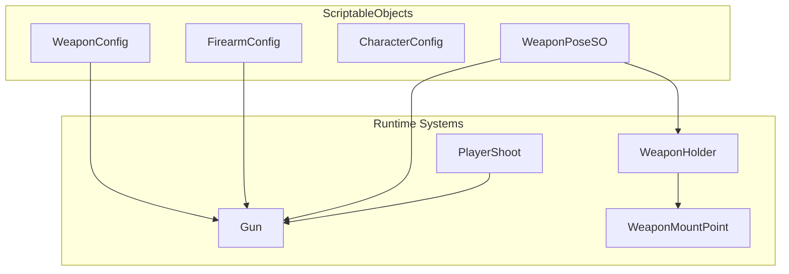
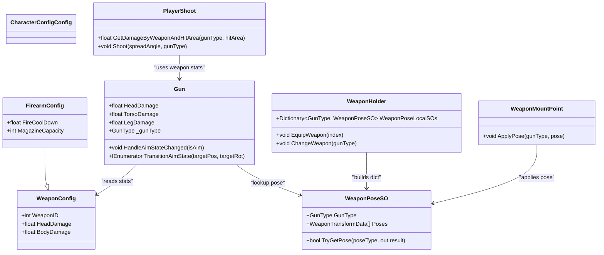
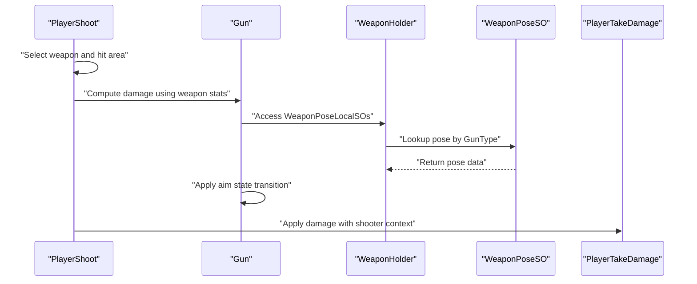
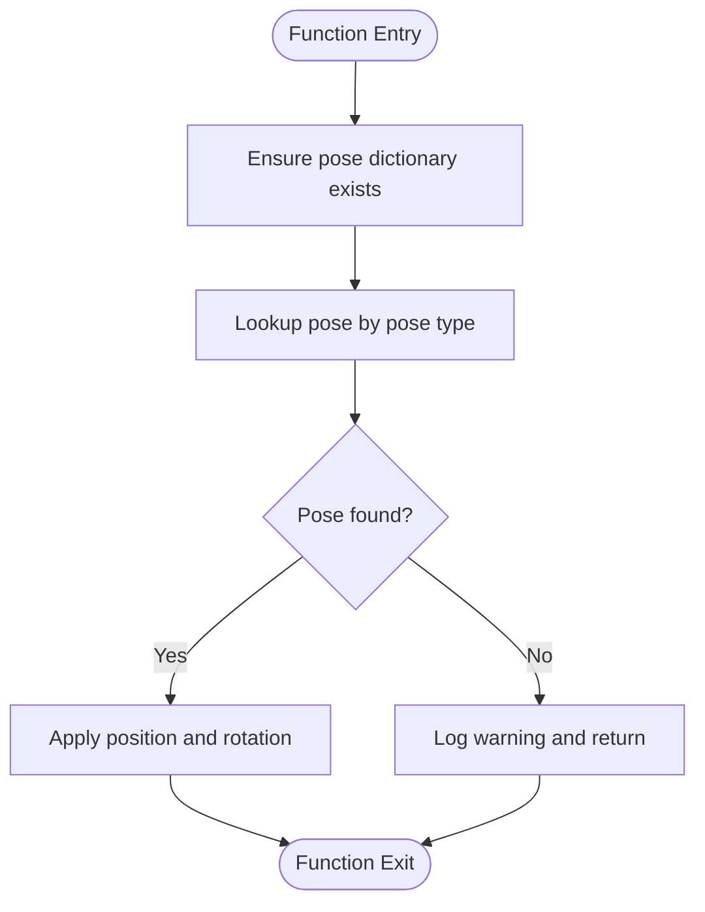
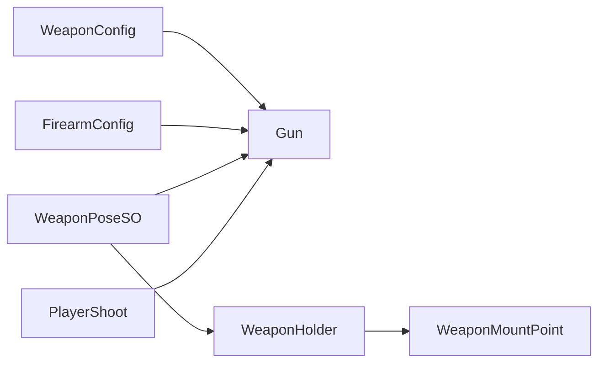

# ScriptableObject Configurations

<cite>
**Referenced Files in This Document**
- [CharacterConfig.cs](file://Assets/FPS-Game/Scripts/ScriptableObject/Character/CharacterConfig.cs)
- [WeaponConfig.cs](file://Assets/FPS-Game/Scripts/ScriptableObject/Weapon/WeaponConfig.cs)
- [FirearmConfig.cs](file://Assets/FPS-Game/Scripts/ScriptableObject/Weapon/Firearm/FirearmConfig.cs)
- [Gun.cs](file://Assets/FPS-Game/Scripts/Player/Gun.cs)
- [PlayerShoot.cs](file://Assets/FPS-Game/Scripts/Player/PlayerShoot.cs)
- [WeaponHolder.cs](file://Assets/FPS-Game/Scripts/Player/WeaponHolder.cs)
- [WeaponPoseSO.cs](file://Assets/FPS-Game/Scripts/Player/WeaponPose/WeaponPoseSO.cs)
- [WeaponPoseSet.cs](file://Assets/FPS-Game/Scripts/Player/WeaponPose/WeaponPoseSet.cs)
- [WeaponMountPoint.cs](file://Assets/FPS-Game/Scripts/Player/WeaponMountPoint.cs)
</cite>

## Table of Contents
1. [Introduction](#introduction)
2. [Project Structure](#project-structure)
3. [Core Components](#core-components)
4. [Architecture Overview](#architecture-overview)
5. [Detailed Component Analysis](#detailed-component-analysis)
6. [Dependency Analysis](#dependency-analysis)
7. [Performance Considerations](#performance-considerations)
8. [Troubleshooting Guide](#troubleshooting-guide)
9. [Conclusion](#conclusion)

## Introduction
This document explains the ScriptableObject-based configuration system used for game balance and weapon properties. It covers:
- The configuration architecture leveraging Unity’s ScriptableObject pattern
- The WeaponConfig class structure, including weapon ID mapping, head/body shot damage scaling, and extensibility for new weapon types
- The CharacterConfig system for player attributes and customization
- FirearmConfig inheritance patterns and specialized weapon behaviors
- Practical examples for creating, modifying, and accessing ScriptableObject instances at runtime
- Validation, defaults, and serialization patterns
- Performance considerations for large configuration datasets and memory management
- The relationship between ScriptableObject instances and their runtime counterparts

## Project Structure
The configuration system is organized under a dedicated folder for ScriptableObjects and integrates with runtime weapon and player systems:
- ScriptableObject configurations:
  - Character configuration under a dedicated folder
  - Weapon configuration hierarchy with base and firearm-specific configs
- Runtime systems:
  - Gun behavior and damage calculation
  - Player shooting logic and hit area detection
  - Weapon holder and pose management via ScriptableObjects

**Diagram sources**
- [WeaponConfig.cs:1-10](file://Assets/FPS-Game/Scripts/ScriptableObject/Weapon/WeaponConfig.cs#L1-L10)
- [FirearmConfig.cs:1-9](file://Assets/FPS-Game/Scripts/ScriptableObject/Weapon/Firearm/FirearmConfig.cs#L1-L9)
- [CharacterConfig.cs:1-8](file://Assets/FPS-Game/Scripts/ScriptableObject/Character/CharacterConfig.cs#L1-L8)
- [WeaponPoseSO.cs:1-36](file://Assets/FPS-Game/Scripts/Player/WeaponPose/WeaponPoseSO.cs#L1-L36)
- [WeaponHolder.cs:1-221](file://Assets/FPS-Game/Scripts/Player/WeaponHolder.cs#L1-L221)
- [Gun.cs:1-451](file://Assets/FPS-Game/Scripts/Player/Gun.cs#L1-L451)
- [PlayerShoot.cs:1-162](file://Assets/FPS-Game/Scripts/Player/PlayerShoot.cs#L1-L162)
- [WeaponMountPoint.cs:1-44](file://Assets/FPS-Game/Scripts/Player/WeaponMountPoint.cs#L1-L44)

**Section sources**
- [WeaponConfig.cs:1-10](file://Assets/FPS-Game/Scripts/ScriptableObject/Weapon/WeaponConfig.cs#L1-L10)
- [FirearmConfig.cs:1-9](file://Assets/FPS-Game/Scripts/ScriptableObject/Weapon/Firearm/FirearmConfig.cs#L1-L9)
- [CharacterConfig.cs:1-8](file://Assets/FPS-Game/Scripts/ScriptableObject/Character/CharacterConfig.cs#L1-L8)
- [WeaponPoseSO.cs:1-36](file://Assets/FPS-Game/Scripts/Player/WeaponPose/WeaponPoseSO.cs#L1-L36)
- [WeaponHolder.cs:1-221](file://Assets/FPS-Game/Scripts/Player/WeaponHolder.cs#L1-L221)
- [Gun.cs:1-451](file://Assets/FPS-Game/Scripts/Player/Gun.cs#L1-L451)
- [PlayerShoot.cs:1-162](file://Assets/FPS-Game/Scripts/Player/PlayerShoot.cs#L1-L162)
- [WeaponMountPoint.cs:1-44](file://Assets/FPS-Game/Scripts/Player/WeaponMountPoint.cs#L1-L44)

## Core Components
- WeaponConfig: Base configuration for weapons with serialized fields for weapon identity and damage scaling across head, torso, and leg hit areas.
- FirearmConfig: Extends WeaponConfig with firearm-specific properties such as fire cooldown and magazine capacity.
- CharacterConfig: Placeholder for character-related configuration; can be extended to include attributes and customization options.
- Gun: Runtime component that reads weapon configuration and applies damage scaling per hit area and weapon type.
- PlayerShoot: Centralized shooting logic that selects weapon and hit area damage based on GunType and HitArea.
- WeaponHolder: Manages weapon selection and maintains a dictionary mapping GunType to WeaponPoseSO for pose lookup.
- WeaponPoseSO: ScriptableObject that stores per-weapon pose data and exposes a lookup method for idle and aim poses.
- WeaponMountPoint: Applies pose transforms to the weapon mount based on current GunType and pose.

**Section sources**
- [WeaponConfig.cs:1-10](file://Assets/FPS-Game/Scripts/ScriptableObject/Weapon/WeaponConfig.cs#L1-L10)
- [FirearmConfig.cs:1-9](file://Assets/FPS-Game/Scripts/ScriptableObject/Weapon/Firearm/FirearmConfig.cs#L1-L9)
- [CharacterConfig.cs:1-8](file://Assets/FPS-Game/Scripts/ScriptableObject/Character/CharacterConfig.cs#L1-L8)
- [Gun.cs:1-451](file://Assets/FPS-Game/Scripts/Player/Gun.cs#L1-L451)
- [PlayerShoot.cs:1-162](file://Assets/FPS-Game/Scripts/Player/PlayerShoot.cs#L1-L162)
- [WeaponHolder.cs:1-221](file://Assets/FPS-Game/Scripts/Player/WeaponHolder.cs#L1-L221)
- [WeaponPoseSO.cs:1-36](file://Assets/FPS-Game/Scripts/Player/WeaponPose/WeaponPoseSO.cs#L1-L36)
- [WeaponMountPoint.cs:1-44](file://Assets/FPS-Game/Scripts/Player/WeaponMountPoint.cs#L1-L44)

## Architecture Overview
The configuration system separates data (ScriptableObject) from behavior (runtime components). Data-driven weapon stats and poses are consumed by runtime scripts to compute damage and animate weapon positioning.

**Diagram sources**
- [WeaponConfig.cs:1-10](file://Assets/FPS-Game/Scripts/ScriptableObject/Weapon/WeaponConfig.cs#L1-L10)
- [FirearmConfig.cs:1-9](file://Assets/FPS-Game/Scripts/ScriptableObject/Weapon/Firearm/FirearmConfig.cs#L1-L9)
- [CharacterConfig.cs:1-8](file://Assets/FPS-Game/Scripts/ScriptableObject/Character/CharacterConfig.cs#L1-L8)
- [Gun.cs:1-451](file://Assets/FPS-Game/Scripts/Player/Gun.cs#L1-L451)
- [PlayerShoot.cs:1-162](file://Assets/FPS-Game/Scripts/Player/PlayerShoot.cs#L1-L162)
- [WeaponHolder.cs:1-221](file://Assets/FPS-Game/Scripts/Player/WeaponHolder.cs#L1-L221)
- [WeaponPoseSO.cs:1-36](file://Assets/FPS-Game/Scripts/Player/WeaponPose/WeaponPoseSO.cs#L1-L36)
- [WeaponMountPoint.cs:1-44](file://Assets/FPS-Game/Scripts/Player/WeaponMountPoint.cs#L1-L44)

## Detailed Component Analysis

### WeaponConfig: Base weapon configuration
- Purpose: Defines weapon identity and per-hit-area damage scaling.
- Fields:
  - WeaponID: Serialized integer identifier for the weapon.
  - HeadDamage: Serialized float for headshot damage multiplier/scaling.
  - BodyDamage: Serialized float for torso/limb damage scaling.
- Extensibility: Subclass for firearm-specific properties; supports polymorphism for different weapon categories.

Validation and defaults:
- No explicit validation logic is present in the base config; consumers should guard against zero or negative values at runtime.

Serialization:
- Uses Unity’s SerializeField to expose fields in the inspector and persist values.

**Section sources**
- [WeaponConfig.cs:1-10](file://Assets/FPS-Game/Scripts/ScriptableObject/Weapon/WeaponConfig.cs#L1-L10)

### FirearmConfig: Firearm specialization
- Purpose: Adds firearm-specific properties to the base weapon configuration.
- Fields:
  - FireCoolDown: Serialized float controlling rate-of-fire cooldown.
  - MagazineCapacity: Serialized integer defining magazine size.
- Inheritance: Extends WeaponConfig, inheriting weapon identity and damage scaling.

Extensibility:
- Additional firearm behaviors (e.g., reload mechanics, accuracy drift) can be introduced via new fields or methods in derived configs or runtime components.

**Section sources**
- [FirearmConfig.cs:1-9](file://Assets/FPS-Game/Scripts/ScriptableObject/Weapon/Firearm/FirearmConfig.cs#L1-L9)

### CharacterConfig: Player attributes and customization
- Purpose: Placeholder for character-related configuration (e.g., health, movement, cosmetic options).
- Current state: Empty definition; ready for extension with serialized fields and validation logic.

Extensibility:
- Add serialized properties for attributes and customization options; consider default values and validation to prevent invalid configurations.

**Section sources**
- [CharacterConfig.cs:1-8](file://Assets/FPS-Game/Scripts/ScriptableObject/Character/CharacterConfig.cs#L1-L8)

### Gun: Runtime weapon behavior and damage application
- Purpose: Consumes WeaponConfig-derived data to apply damage scaling per hit area and weapon type.
- Key behaviors:
  - Reads HeadDamage, TorsoDamage, LegDamage from the weapon’s runtime stats.
  - Handles aim state transitions using pose data from WeaponPoseSO via WeaponHolder.
  - Enforces fire cooldown and automatic/single-fire modes.
- Hit area mapping:
  - HeadDamage applies to headshots.
  - TorsoDamage applies to torso hits.
  - LegDamage applies to leg hits.

**Section sources**
- [Gun.cs:1-451](file://Assets/FPS-Game/Scripts/Player/Gun.cs#L1-L451)

### PlayerShoot: Shooting logic and damage calculation
- Purpose: Centralized shooting logic that computes damage based on weapon type and hit area.
- Key behaviors:
  - Selects weapon stats using GunType and HitArea.
  - Computes damage via a switch-based lookup.
  - Sends server RPCs for hit detection and damage application.

**Section sources**
- [PlayerShoot.cs:1-162](file://Assets/FPS-Game/Scripts/Player/PlayerShoot.cs#L1-L162)

### WeaponPoseSO and pose lookup
- Purpose: Stores per-weapon pose data and provides fast lookup for idle and aim poses.
- Key behaviors:
  - Maintains a list of pose entries and builds a dictionary on demand.
  - Provides TryGetPose to retrieve pose data by pose type.

**Section sources**
- [WeaponPoseSO.cs:1-36](file://Assets/FPS-Game/Scripts/Player/WeaponPose/WeaponPoseSO.cs#L1-L36)

### WeaponHolder: Pose dictionary and weapon selection
- Purpose: Builds a dictionary mapping GunType to WeaponPoseSO and manages weapon selection.
- Key behaviors:
  - Initializes a dictionary from a list of WeaponPoseSO assets.
  - Equips weapons based on index and notifies subscribers of weapon changes.

**Section sources**
- [WeaponHolder.cs:1-221](file://Assets/FPS-Game/Scripts/Player/WeaponHolder.cs#L1-L221)

### WeaponMountPoint: Applying poses to the weapon mount
- Purpose: Applies pose transforms to the weapon mount based on current GunType and pose.
- Key behaviors:
  - Iterates through registered WeaponPoseSO assets to find a match for the current GunType.
  - Uses pose lookup to set local position and rotation.

**Section sources**
- [WeaponMountPoint.cs:1-44](file://Assets/FPS-Game/Scripts/Player/WeaponMountPoint.cs#L1-L44)

### Sequence: Shooting and damage application

**Diagram sources**
- [PlayerShoot.cs:1-162](file://Assets/FPS-Game/Scripts/Player/PlayerShoot.cs#L1-L162)
- [Gun.cs:1-451](file://Assets/FPS-Game/Scripts/Player/Gun.cs#L1-L451)
- [WeaponHolder.cs:1-221](file://Assets/FPS-Game/Scripts/Player/WeaponHolder.cs#L1-L221)
- [WeaponPoseSO.cs:1-36](file://Assets/FPS-Game/Scripts/Player/WeaponPose/WeaponPoseSO.cs#L1-L36)

### Flowchart: Pose lookup and application

**Diagram sources**
- [WeaponPoseSO.cs:1-36](file://Assets/FPS-Game/Scripts/Player/WeaponPose/WeaponPoseSO.cs#L1-L36)
- [WeaponMountPoint.cs:1-44](file://Assets/FPS-Game/Scripts/Player/WeaponMountPoint.cs#L1-L44)

## Dependency Analysis
- Coupling:
  - Gun depends on WeaponConfig-derived data and pose assets.
  - PlayerShoot depends on GunType and HitArea to compute damage.
  - WeaponHolder and WeaponMountPoint depend on WeaponPoseSO for pose management.
- Cohesion:
  - Each ScriptableObject encapsulates a single concern (weapon stats, poses).
- External dependencies:
  - Unity’s ScriptableObject and Netcode for GameObjects APIs.

**Diagram sources**
- [WeaponConfig.cs:1-10](file://Assets/FPS-Game/Scripts/ScriptableObject/Weapon/WeaponConfig.cs#L1-L10)
- [FirearmConfig.cs:1-9](file://Assets/FPS-Game/Scripts/ScriptableObject/Weapon/Firearm/FirearmConfig.cs#L1-L9)
- [Gun.cs:1-451](file://Assets/FPS-Game/Scripts/Player/Gun.cs#L1-L451)
- [WeaponPoseSO.cs:1-36](file://Assets/FPS-Game/Scripts/Player/WeaponPose/WeaponPoseSO.cs#L1-L36)
- [WeaponHolder.cs:1-221](file://Assets/FPS-Game/Scripts/Player/WeaponHolder.cs#L1-L221)
- [WeaponMountPoint.cs:1-44](file://Assets/FPS-Game/Scripts/Player/WeaponMountPoint.cs#L1-L44)
- [PlayerShoot.cs:1-162](file://Assets/FPS-Game/Scripts/Player/PlayerShoot.cs#L1-L162)

**Section sources**
- [Gun.cs:1-451](file://Assets/FPS-Game/Scripts/Player/Gun.cs#L1-L451)
- [PlayerShoot.cs:1-162](file://Assets/FPS-Game/Scripts/Player/PlayerShoot.cs#L1-L162)
- [WeaponHolder.cs:1-221](file://Assets/FPS-Game/Scripts/Player/WeaponHolder.cs#L1-L221)
- [WeaponPoseSO.cs:1-36](file://Assets/FPS-Game/Scripts/Player/WeaponPose/WeaponPoseSO.cs#L1-L36)
- [WeaponMountPoint.cs:1-44](file://Assets/FPS-Game/Scripts/Player/WeaponMountPoint.cs#L1-L44)

## Performance Considerations
- Data structure choices:
  - Use dictionaries for pose lookups to achieve O(1) average-case retrieval.
  - Pre-build pose dictionaries during initialization to avoid repeated construction.
- Serialization and asset loading:
  - Keep ScriptableObject assets in the project resources for fast instantiation and minimal disk IO.
  - Avoid frequent creation/destruction of ScriptableObject instances at runtime; reuse existing assets.
- Memory management:
  - Prefer arrays/lists sized appropriately for weapon counts to reduce reallocations.
  - Dispose of temporary allocations (e.g., coroutines) promptly after use.
- Networking:
  - Minimize network traffic by sending only necessary configuration identifiers and deltas.
  - Use Netcode RPCs judiciously; batch updates where possible.
- Large configuration datasets:
  - Paginate or stream configuration data if the number of weapon types grows very large.
  - Use asset bundles or addressables for dynamic loading if needed.

[No sources needed since this section provides general guidance]

## Troubleshooting Guide
- Missing pose data:
  - Symptom: Warning logs indicating missing pose for a given GunType or pose type.
  - Resolution: Ensure a WeaponPoseSO asset exists for each GunType and contains the required pose entries.
- Incorrect weapon stats:
  - Symptom: Unexpected damage scaling or fire behavior.
  - Resolution: Verify WeaponConfig and FirearmConfig values; confirm Gun runtime stats are initialized from the correct ScriptableObject.
- Pose not applied:
  - Symptom: Weapon does not move to aim or idle positions.
  - Resolution: Confirm WeaponHolder’s dictionary is built and populated; verify GunType matches between Gun and WeaponPoseSO.
- Shooting not registering:
  - Symptom: No damage applied despite hits.
  - Resolution: Check PlayerShoot’s hit area tagging and GunType mapping; ensure server RPCs are invoked and processed.

**Section sources**
- [WeaponPoseSO.cs:1-36](file://Assets/FPS-Game/Scripts/Player/WeaponPose/WeaponPoseSO.cs#L1-L36)
- [WeaponMountPoint.cs:1-44](file://Assets/FPS-Game/Scripts/Player/WeaponMountPoint.cs#L1-L44)
- [PlayerShoot.cs:1-162](file://Assets/FPS-Game/Scripts/Player/PlayerShoot.cs#L1-L162)
- [Gun.cs:1-451](file://Assets/FPS-Game/Scripts/Player/Gun.cs#L1-L451)
- [WeaponHolder.cs:1-221](file://Assets/FPS-Game/Scripts/Player/WeaponHolder.cs#L1-L221)

## Conclusion
The ScriptableObject-based configuration system cleanly separates data from behavior, enabling flexible weapon balancing and pose-driven animation. By extending the base WeaponConfig and FirearmConfig classes, teams can introduce new weapon types and behaviors while maintaining a consistent runtime interface. Proper use of pose dictionaries, careful validation, and mindful performance practices ensure scalability and maintainability for larger configuration sets.