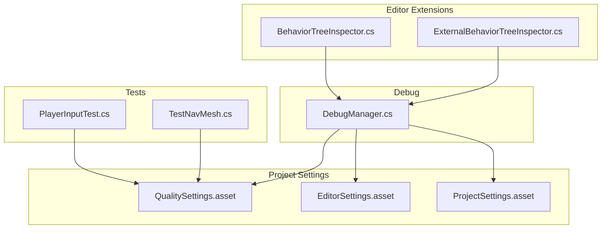
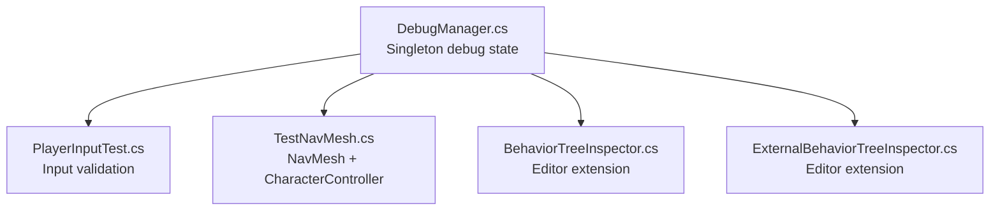
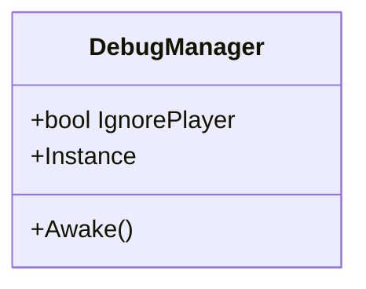
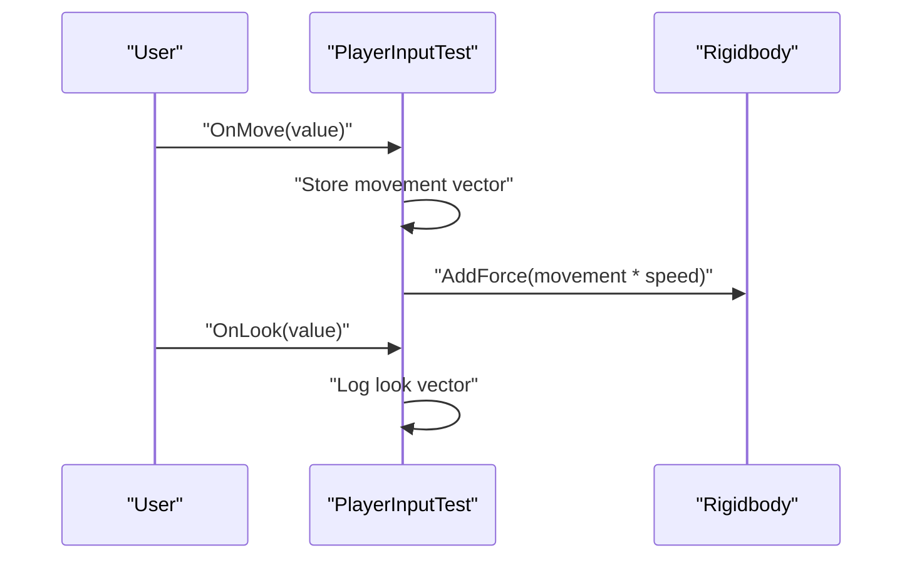
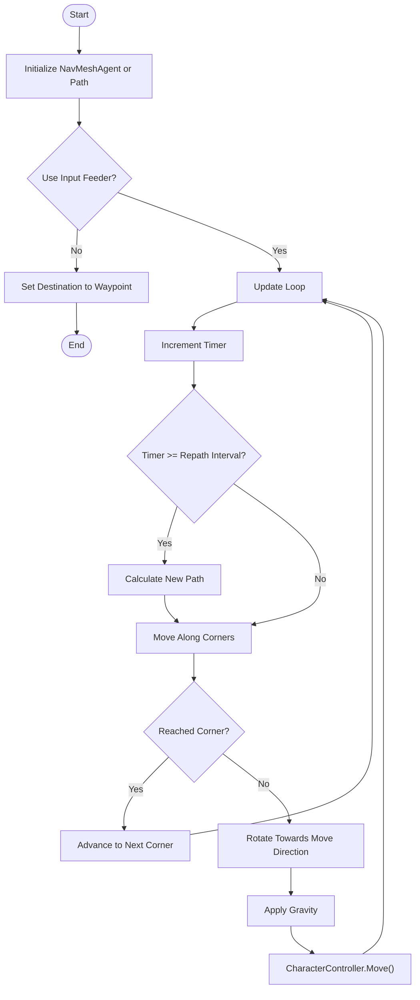
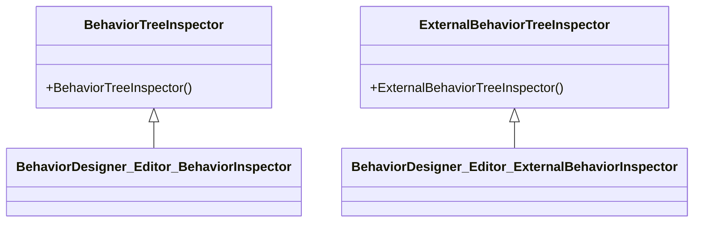
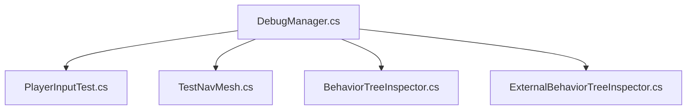

# Development Tools & Utilities

<cite>
**Referenced Files in This Document**
- [DebugManager.cs](file://Assets/FPS-Game/Scripts/Debug/DebugManager.cs)
- [PlayerInputTest.cs](file://Assets/FPS-Game/Scripts/PlayerInputTest.cs)
- [TestNavMesh.cs](file://Assets/FPS-Game/Scripts/TestNavMesh.cs)
- [BehaviorTreeInspector.cs](file://Assets/Behavior%20Designer/Editor/BehaviorTreeInspector.cs)
- [ExternalBehaviorTreeInspector.cs](file://Assets/Behavior%20Designer/Editor/ExternalBehaviorTreeInspector.cs)
- [QualitySettings.asset](file://ProjectSettings/QualitySettings.asset)
- [EditorSettings.asset](file://ProjectSettings/EditorSettings.asset)
- [ProjectSettings.asset](file://ProjectSettings/ProjectSettings.asset)
- [README.md](file://README.md)
- [CLEANUP_SUMMARY.md](file://CLEANUP_SUMMARY.md)
</cite>

## Table of Contents
1. [Introduction](#introduction)
2. [Project Structure](#project-structure)
3. [Core Components](#core-components)
4. [Architecture Overview](#architecture-overview)
5. [Detailed Component Analysis](#detailed-component-analysis)
6. [Dependency Analysis](#dependency-analysis)
7. [Performance Considerations](#performance-considerations)
8. [Troubleshooting Guide](#troubleshooting-guide)
9. [Conclusion](#conclusion)
10. [Appendices](#appendices)

## Introduction
This document focuses on the development tools and utility systems that support debugging, testing, and development workflow in the project. It explains the debug system implementation, test components for input validation, and editor extensions. It also documents debugging capabilities such as performance monitoring, network state visualization, and AI behavior inspection, along with concrete examples from the codebase, configuration options for debug levels and logging verbosity, and relationships with other systems for development and quality assurance. Guidance is included for both beginners and experienced developers to address common issues like debug performance impact, test automation, and development environment setup.

## Project Structure
The development tools and utilities are primarily located under:
- Assets/FPS-Game/Scripts/Debug: Centralized debug utilities and managers
- Assets/FPS-Game/Scripts: Test components for input validation and navigation
- Assets/Behavior Designer/Editor: Editor extensions for Behavior Designer trees
- ProjectSettings: Global configuration affecting build, editor, and quality behavior

**Diagram sources**
- [DebugManager.cs:1-19](file://Assets/FPS-Game/Scripts/Debug/DebugManager.cs#L1-L19)
- [PlayerInputTest.cs:1-32](file://Assets/FPS-Game/Scripts/PlayerInputTest.cs#L1-L32)
- [TestNavMesh.cs:1-109](file://Assets/FPS-Game/Scripts/TestNavMesh.cs#L1-L109)
- [BehaviorTreeInspector.cs:1-11](file://Assets/Behavior%20Designer/Editor/BehaviorTreeInspector.cs#L1-L11)
- [ExternalBehaviorTreeInspector.cs:1-13](file://Assets/Behavior%20Designer/Editor/ExternalBehaviorTreeInspector.cs#L1-L13)
- [QualitySettings.asset:1-320](file://ProjectSettings/QualitySettings.asset#L1-L320)
- [EditorSettings.asset:1-30](file://ProjectSettings/EditorSettings.asset#L1-L30)
- [ProjectSettings.asset:85-132](file://ProjectSettings/ProjectSettings.asset#L85-L132)

**Section sources**
- [README.md:1-24](file://README.md#L1-L24)
- [CLEANUP_SUMMARY.md:85-274](file://CLEANUP_SUMMARY.md#L85-L274)

## Core Components
- DebugManager: A lightweight singleton responsible for debug-related toggles and global debug state. It exposes a flag to ignore player during debugging sessions.
- PlayerInputTest: A test script validating input actions and logging look input for verification.
- TestNavMesh: A navigation test harness using Unity’s NavMesh and CharacterController to simulate movement and visualize paths via gizmos.
- Behavior Designer Editor Extensions: Custom inspectors for Behavior Designer trees to improve visibility and editing in the Unity Editor.

These components collectively support rapid iteration, debugging, and validation during development.

**Section sources**
- [DebugManager.cs:1-19](file://Assets/FPS-Game/Scripts/Debug/DebugManager.cs#L1-L19)
- [PlayerInputTest.cs:1-32](file://Assets/FPS-Game/Scripts/PlayerInputTest.cs#L1-L32)
- [TestNavMesh.cs:1-109](file://Assets/FPS-Game/Scripts/TestNavMesh.cs#L1-L109)
- [BehaviorTreeInspector.cs:1-11](file://Assets/Behavior%20Designer/Editor/BehaviorTreeInspector.cs#L1-L11)
- [ExternalBehaviorTreeInspector.cs:1-13](file://Assets/Behavior%20Designer/Editor/ExternalBehaviorTreeInspector.cs#L1-L13)

## Architecture Overview
The development tools integrate with Unity’s runtime and editor subsystems. The DebugManager acts as a central toggle for debug behaviors. PlayerInputTest and TestNavMesh provide isolated test scenarios for input and navigation. Behavior Designer editor extensions enhance authoring workflows for AI behaviors.

**Diagram sources**
- [DebugManager.cs:1-19](file://Assets/FPS-Game/Scripts/Debug/DebugManager.cs#L1-L19)
- [PlayerInputTest.cs:1-32](file://Assets/FPS-Game/Scripts/PlayerInputTest.cs#L1-L32)
- [TestNavMesh.cs:1-109](file://Assets/FPS-Game/Scripts/TestNavMesh.cs#L1-L109)
- [BehaviorTreeInspector.cs:1-11](file://Assets/Behavior%20Designer/Editor/BehaviorTreeInspector.cs#L1-L11)
- [ExternalBehaviorTreeInspector.cs:1-13](file://Assets/Behavior%20Designer/Editor/ExternalBehaviorTreeInspector.cs#L1-L13)

## Detailed Component Analysis

### DebugManager
- Purpose: Provide a global debug toggle and singleton lifecycle to avoid duplication.
- Key behaviors:
  - Singleton pattern ensures a single debug manager instance.
  - Public flag to ignore player during debugging sessions.
- Integration points:
  - Consumed by test scripts and editor extensions to alter behavior during development.

**Diagram sources**
- [DebugManager.cs:1-19](file://Assets/FPS-Game/Scripts/Debug/DebugManager.cs#L1-L19)

**Section sources**
- [DebugManager.cs:1-19](file://Assets/FPS-Game/Scripts/Debug/DebugManager.cs#L1-L19)

### PlayerInputTest
- Purpose: Validate input actions and log look input for debugging.
- Key behaviors:
  - Uses Unity InputSystem callbacks to capture movement and look vectors.
  - Logs look input to the console for immediate feedback.
  - Applies forces in FixedUpdate to simulate movement for validation.
- Integration points:
  - Works alongside DebugManager to adjust debug behavior.
  - Useful for automated input validation tests.

**Diagram sources**
- [PlayerInputTest.cs:1-32](file://Assets/FPS-Game/Scripts/PlayerInputTest.cs#L1-L32)

**Section sources**
- [PlayerInputTest.cs:1-32](file://Assets/FPS-Game/Scripts/PlayerInputTest.cs#L1-L32)

### TestNavMesh
- Purpose: Validate navigation pathfinding and movement using NavMesh and CharacterController.
- Key behaviors:
  - Supports waypoint-based destination setting or dynamic path recalculation.
  - Repath interval controls how often paths are recalculated.
  - Visualizes the computed path using gizmos.
  - Handles rotation interpolation and gravity simulation for CharacterController movement.
- Integration points:
  - Works with DebugManager to toggle input-driven movement.
  - Useful for profiling navigation performance and path quality.

**Diagram sources**
- [TestNavMesh.cs:1-109](file://Assets/FPS-Game/Scripts/TestNavMesh.cs#L1-L109)

**Section sources**
- [TestNavMesh.cs:1-109](file://Assets/FPS-Game/Scripts/TestNavMesh.cs#L1-L109)

### Behavior Designer Editor Extensions
- Purpose: Improve authoring and inspection of Behavior Designer trees in the Unity Editor.
- Key behaviors:
  - Custom editors for BehaviorTree and ExternalBehaviorTree types.
  - Minimal overrides to preserve existing inspector behavior while integrating with the editor.
- Integration points:
  - Used by DebugManager and test scripts to visualize AI decision-making during development.

**Diagram sources**
- [BehaviorTreeInspector.cs:1-11](file://Assets/Behavior%20Designer/Editor/BehaviorTreeInspector.cs#L1-L11)
- [ExternalBehaviorTreeInspector.cs:1-13](file://Assets/Behavior%20Designer/Editor/ExternalBehaviorTreeInspector.cs#L1-L13)

**Section sources**
- [BehaviorTreeInspector.cs:1-11](file://Assets/Behavior%20Designer/Editor/BehaviorTreeInspector.cs#L1-L11)
- [ExternalBehaviorTreeInspector.cs:1-13](file://Assets/Behavior%20Designer/Editor/ExternalBehaviorTreeInspector.cs#L1-L13)

## Dependency Analysis
- DebugManager depends on Unity’s GameObject lifecycle and is consumed by test scripts and editor extensions.
- PlayerInputTest depends on Unity InputSystem and Rigidbody physics for movement validation.
- TestNavMesh depends on Unity NavMesh, NavMeshAgent, and CharacterController for navigation simulation.
- Behavior Designer editor extensions depend on Unity Editor APIs and Behavior Designer runtime types.

**Diagram sources**
- [DebugManager.cs:1-19](file://Assets/FPS-Game/Scripts/Debug/DebugManager.cs#L1-L19)
- [PlayerInputTest.cs:1-32](file://Assets/FPS-Game/Scripts/PlayerInputTest.cs#L1-L32)
- [TestNavMesh.cs:1-109](file://Assets/FPS-Game/Scripts/TestNavMesh.cs#L1-L109)
- [BehaviorTreeInspector.cs:1-11](file://Assets/Behavior%20Designer/Editor/BehaviorTreeInspector.cs#L1-L11)
- [ExternalBehaviorTreeInspector.cs:1-13](file://Assets/Behavior%20Designer/Editor/ExternalBehaviorTreeInspector.cs#L1-L13)

**Section sources**
- [DebugManager.cs:1-19](file://Assets/FPS-Game/Scripts/Debug/DebugManager.cs#L1-L19)
- [PlayerInputTest.cs:1-32](file://Assets/FPS-Game/Scripts/PlayerInputTest.cs#L1-L32)
- [TestNavMesh.cs:1-109](file://Assets/FPS-Game/Scripts/TestNavMesh.cs#L1-L109)
- [BehaviorTreeInspector.cs:1-11](file://Assets/Behavior%20Designer/Editor/BehaviorTreeInspector.cs#L1-L11)
- [ExternalBehaviorTreeInspector.cs:1-13](file://Assets/Behavior%20Designer/Editor/ExternalBehaviorTreeInspector.cs#L1-L13)

## Performance Considerations
- Quality settings: The project’s quality presets influence rendering and runtime performance. Adjustments here can reduce overhead during debugging and testing.
- Editor settings: Texture streaming and async shader compilation can be enabled to improve editor responsiveness during iterative development.
- Project settings: Logging and analytics flags can be tuned to minimize overhead in development builds.

Practical tips:
- Use lower quality presets during heavy debugging sessions to maintain frame stability.
- Keep async shader compilation enabled to reduce editor stalls.
- Disable analytics and unnecessary logging in development builds to reduce noise and overhead.

**Section sources**
- [QualitySettings.asset:1-320](file://ProjectSettings/QualitySettings.asset#L1-L320)
- [EditorSettings.asset:1-30](file://ProjectSettings/EditorSettings.asset#L1-L30)
- [ProjectSettings.asset:85-132](file://ProjectSettings/ProjectSettings.asset#L85-L132)

## Troubleshooting Guide
Common issues and resolutions:
- Debug performance impact:
  - Reduce quality settings or disable expensive effects during debugging.
  - Use DebugManager.IgnorePlayer to skip heavy logic during tests.
- Test automation:
  - PlayerInputTest logs look input; use this to assert expected values in automated tests.
  - TestNavMesh path visualization helps identify navigation issues; inspect gizmos in the Scene view.
- Development environment setup:
  - Ensure editor settings enable texture streaming and async shader compilation.
  - Verify Behavior Designer editor extensions are present to streamline AI authoring.

**Section sources**
- [DebugManager.cs:1-19](file://Assets/FPS-Game/Scripts/Debug/DebugManager.cs#L1-L19)
- [PlayerInputTest.cs:1-32](file://Assets/FPS-Game/Scripts/PlayerInputTest.cs#L1-L32)
- [TestNavMesh.cs:1-109](file://Assets/FPS-Game/Scripts/TestNavMesh.cs#L1-L109)
- [EditorSettings.asset:1-30](file://ProjectSettings/EditorSettings.asset#L1-L30)
- [CLEANUP_SUMMARY.md:85-274](file://CLEANUP_SUMMARY.md#L85-L274)

## Conclusion
The development tools and utilities in this project provide a practical foundation for debugging, testing, and authoring workflows. DebugManager centralizes debug state, PlayerInputTest validates input actions, TestNavMesh simulates navigation, and Behavior Designer editor extensions enhance AI authoring. Together with project settings for quality, editor, and analytics, these components support efficient iteration and high-quality development practices.

## Appendices
- Configuration options overview:
  - Debug levels: Controlled via DebugManager.IgnorePlayer and selective logging in test scripts.
  - Logging verbosity: Adjust via Unity’s player log and editor settings.
  - Test parameters: Speed, move speed, and repath intervals in test scripts.
- Relationship with QA systems:
  - PlayerInputTest and TestNavMesh can be integrated into automated test suites.
  - Behavior Designer editor extensions improve authoring reliability and reduce regression risk.

**Section sources**
- [DebugManager.cs:1-19](file://Assets/FPS-Game/Scripts/Debug/DebugManager.cs#L1-L19)
- [PlayerInputTest.cs:1-32](file://Assets/FPS-Game/Scripts/PlayerInputTest.cs#L1-L32)
- [TestNavMesh.cs:1-109](file://Assets/FPS-Game/Scripts/TestNavMesh.cs#L1-L109)
- [QualitySettings.asset:1-320](file://ProjectSettings/QualitySettings.asset#L1-L320)
- [EditorSettings.asset:1-30](file://ProjectSettings/EditorSettings.asset#L1-L30)
- [ProjectSettings.asset:85-132](file://ProjectSettings/ProjectSettings.asset#L85-L132)
- [README.md:1-24](file://README.md#L1-L24)
- [CLEANUP_SUMMARY.md:85-274](file://CLEANUP_SUMMARY.md#L85-L274)