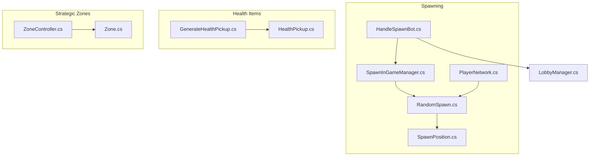
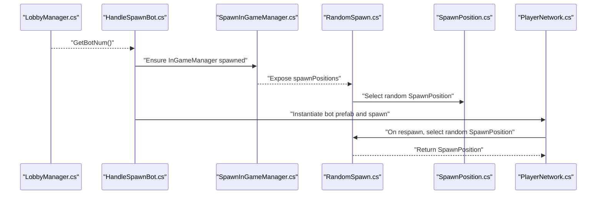
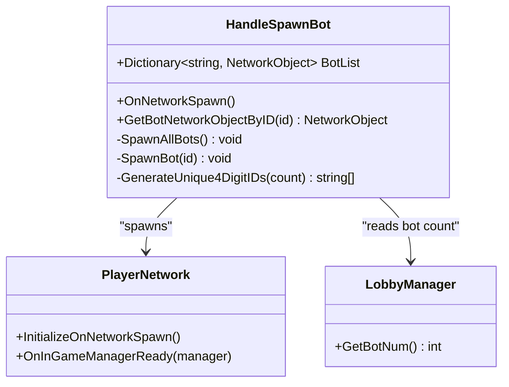
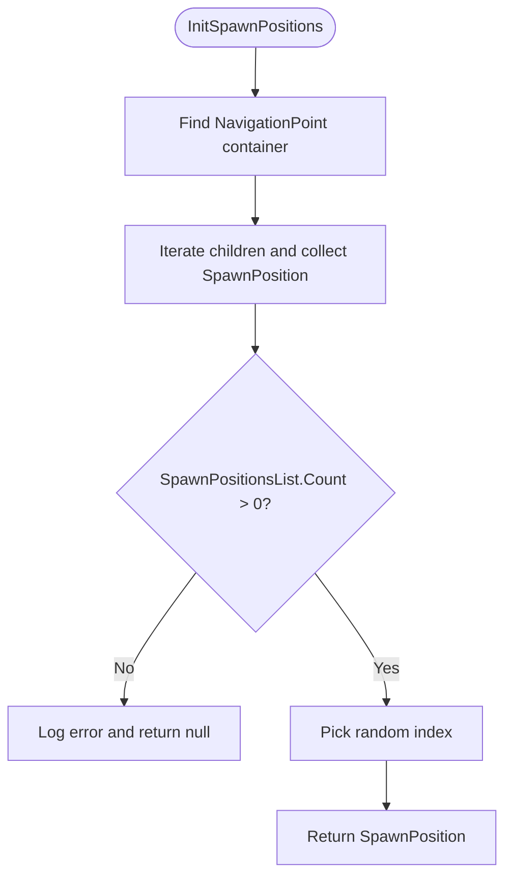
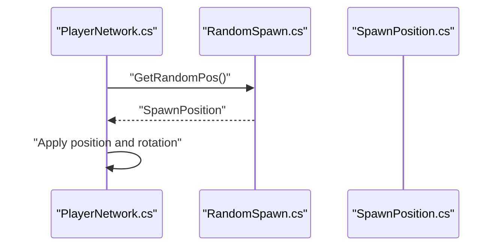
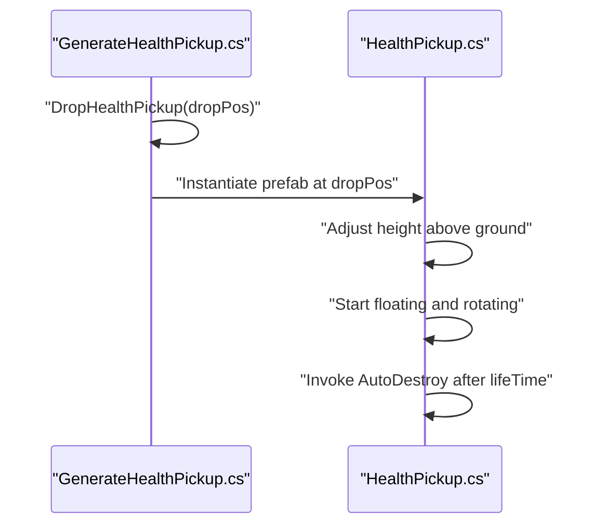
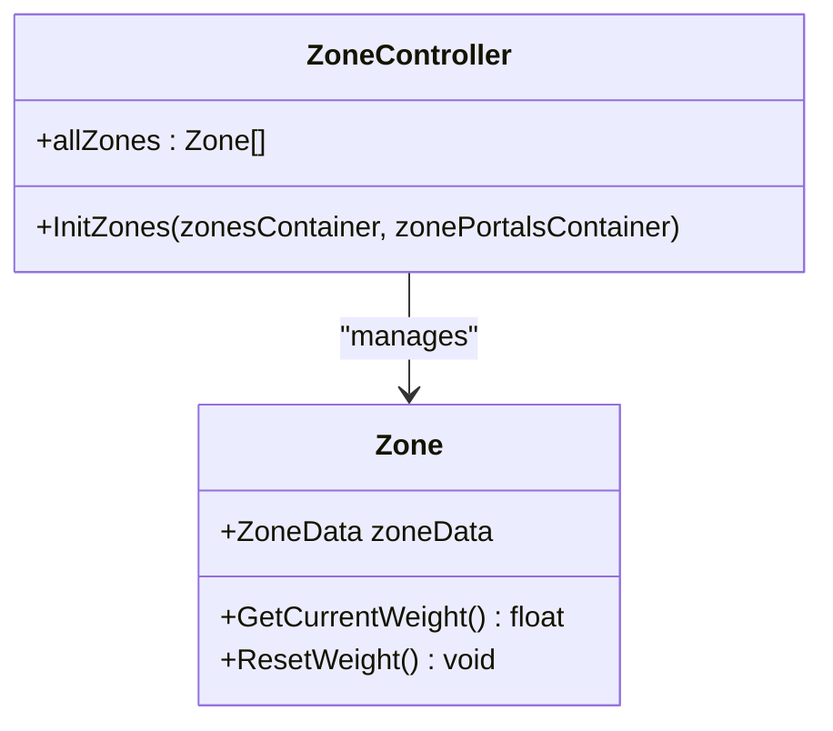
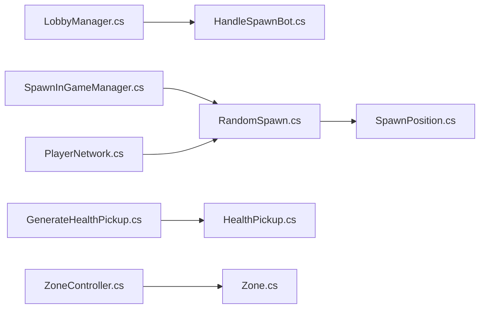

# Dynamic Content Management

<cite>
**Referenced Files in This Document**
- [HandleSpawnBot.cs](file://Assets/FPS-Game/Scripts/System/HandleSpawnBot.cs)
- [RandomSpawn.cs](file://Assets/FPS-Game/Scripts/System/RandomSpawn.cs)
- [SpawnPosition.cs](file://Assets/FPS-Game/Scripts/SpawnPosition.cs)
- [SpawnInGameManager.cs](file://Assets/FPS-Game/Scripts/System/SpawnInGameManager.cs)
- [PlayerNetwork.cs](file://Assets/FPS-Game/Scripts/Player/PlayerNetwork.cs)
- [GenerateHealthPickup.cs](file://Assets/FPS-Game/Scripts/System/GenerateHealthPickup.cs)
- [HealthPickup.cs](file://Assets/FPS-Game/Scripts/HealthPickup.cs)
- [ZoneController.cs](file://Assets/FPS-Game/Scripts/System/ZoneController.cs)
- [Zone.cs](file://Assets/FPS-Game/Scripts/System/Zone.cs)
- [LobbyManager.cs](file://Assets/FPS-Game/Scripts/Lobby Script/Lobby/Scripts/LobbyManager.cs)
</cite>

## Table of Contents
1. [Introduction](#introduction)
2. [Project Structure](#project-structure)
3. [Core Components](#core-components)
4. [Architecture Overview](#architecture-overview)
5. [Detailed Component Analysis](#detailed-component-analysis)
6. [Dependency Analysis](#dependency-analysis)
7. [Performance Considerations](#performance-considerations)
8. [Troubleshooting Guide](#troubleshooting-guide)
9. [Conclusion](#conclusion)
10. [Appendices](#appendices)

## Introduction
This document explains the dynamic content management system responsible for runtime object spawning and environmental management in the game. It focuses on:
- AI bot population control, spawn timing, and difficulty scaling via HandleSpawnBot
- Health item placement and respawn mechanics via GenerateHealthPickup and HealthPickup
- Spawn point selection algorithms and random spawn assignment through RandomSpawn and SpawnPosition
- Strategic bot placement coordination with ZoneController and Zone
- Practical examples for dynamic difficulty, spawn waves, and environmental hazard management

The goal is to make procedural content concepts accessible to beginners while providing sufficient technical depth for experienced developers building scalable spawn management systems.

## Project Structure
The dynamic content management spans several systems:
- Spawning orchestration: HandleSpawnBot, RandomSpawn, SpawnInGameManager
- Spawn geometry: SpawnPosition
- Player lifecycle and spawn: PlayerNetwork
- Health items: GenerateHealthPickup, HealthPickup
- Strategic zones: ZoneController, Zone
- Configuration: LobbyManager (bot count and related settings)

**Diagram sources**
- [HandleSpawnBot.cs:1-83](file://Assets/FPS-Game/Scripts/System/HandleSpawnBot.cs#L1-L83)
- [RandomSpawn.cs:1-40](file://Assets/FPS-Game/Scripts/System/RandomSpawn.cs#L1-L40)
- [SpawnPosition.cs:1-13](file://Assets/FPS-Game/Scripts/SpawnPosition.cs#L1-L13)
- [SpawnInGameManager.cs:1-70](file://Assets/FPS-Game/Scripts/System/SpawnInGameManager.cs#L1-L70)
- [PlayerNetwork.cs:1-541](file://Assets/FPS-Game/Scripts/Player/PlayerNetwork.cs#L1-L541)
- [GenerateHealthPickup.cs:1-13](file://Assets/FPS-Game/Scripts/System/GenerateHealthPickup.cs#L1-L13)
- [HealthPickup.cs:1-61](file://Assets/FPS-Game/Scripts/HealthPickup.cs#L1-L61)
- [ZoneController.cs:1-163](file://Assets/FPS-Game/Scripts/System/ZoneController.cs#L1-L163)
- [Zone.cs:1-249](file://Assets/FPS-Game/Scripts/System/Zone.cs#L1-L249)
- [LobbyManager.cs](file://Assets/FPS-Game/Scripts/Lobby Script/Lobby/Scripts/LobbyManager.cs)

**Section sources**
- [HandleSpawnBot.cs:1-83](file://Assets/FPS-Game/Scripts/System/HandleSpawnBot.cs#L1-L83)
- [RandomSpawn.cs:1-40](file://Assets/FPS-Game/Scripts/System/RandomSpawn.cs#L1-L40)
- [SpawnPosition.cs:1-13](file://Assets/FPS-Game/Scripts/SpawnPosition.cs#L1-L13)
- [SpawnInGameManager.cs:1-70](file://Assets/FPS-Game/Scripts/System/SpawnInGameManager.cs#L1-L70)
- [PlayerNetwork.cs:1-541](file://Assets/FPS-Game/Scripts/Player/PlayerNetwork.cs#L1-L541)
- [GenerateHealthPickup.cs:1-13](file://Assets/FPS-Game/Scripts/System/GenerateHealthPickup.cs#L1-L13)
- [HealthPickup.cs:1-61](file://Assets/FPS-Game/Scripts/HealthPickup.cs#L1-L61)
- [ZoneController.cs:1-163](file://Assets/FPS-Game/Scripts/System/ZoneController.cs#L1-L163)
- [Zone.cs:1-249](file://Assets/FPS-Game/Scripts/System/Zone.cs#L1-L249)
- [LobbyManager.cs](file://Assets/FPS-Game/Scripts/Lobby Script/Lobby/Scripts/LobbyManager.cs)

## Core Components
- HandleSpawnBot: Creates and manages AI bots at match start, assigns unique IDs, and spawns via NetworkObject.
- RandomSpawn: Discovers spawn positions tagged as navigation points and selects one randomly.
- SpawnPosition: Encapsulates a single spawn’s position and orientation.
- SpawnInGameManager: Ensures the in-game manager is spawned early on the server and exposes spawn/waypoint/zones containers.
- PlayerNetwork: Handles player respawns and uses RandomSpawn to place players at runtime.
- GenerateHealthPickup: Instantiates health pickups at given world positions.
- HealthPickup: Applies floating and rotation visuals and auto-destruction after a lifetime.
- ZoneController and Zone: Provide strategic weighting and selection mechanisms for bot placement and patrol behavior.

**Section sources**
- [HandleSpawnBot.cs:6-83](file://Assets/FPS-Game/Scripts/System/HandleSpawnBot.cs#L6-L83)
- [RandomSpawn.cs:7-40](file://Assets/FPS-Game/Scripts/System/RandomSpawn.cs#L7-L40)
- [SpawnPosition.cs:3-13](file://Assets/FPS-Game/Scripts/SpawnPosition.cs#L3-L13)
- [SpawnInGameManager.cs:5-70](file://Assets/FPS-Game/Scripts/System/SpawnInGameManager.cs#L5-L70)
- [PlayerNetwork.cs:120-139](file://Assets/FPS-Game/Scripts/Player/PlayerNetwork.cs#L120-L139)
- [GenerateHealthPickup.cs:3-13](file://Assets/FPS-Game/Scripts/System/GenerateHealthPickup.cs#L3-L13)
- [HealthPickup.cs:3-61](file://Assets/FPS-Game/Scripts/HealthPickup.cs#L3-L61)
- [ZoneController.cs:8-163](file://Assets/FPS-Game/Scripts/System/ZoneController.cs#L8-L163)
- [Zone.cs:15-161](file://Assets/FPS-Game/Scripts/System/Zone.cs#L15-L161)

## Architecture Overview
The system orchestrates runtime spawning and environmental management across multiple subsystems. At a high level:
- LobbyManager supplies bot count and settings.
- HandleSpawnBot spawns bots on the server and tracks them.
- SpawnInGameManager initializes spawn/zone containers and exposes them to clients.
- RandomSpawn selects a spawn position from a discovered list of SpawnPosition nodes.
- PlayerNetwork uses RandomSpawn for initial and respawn placement.
- GenerateHealthPickup places health items at arbitrary world positions; HealthPickup animates and expires them.
- ZoneController and Zone provide strategic weights for bot placement and movement.

**Diagram sources**
- [HandleSpawnBot.cs:21-58](file://Assets/FPS-Game/Scripts/System/HandleSpawnBot.cs#L21-L58)
- [SpawnInGameManager.cs:20-69](file://Assets/FPS-Game/Scripts/System/SpawnInGameManager.cs#L20-L69)
- [RandomSpawn.cs:17-39](file://Assets/FPS-Game/Scripts/System/RandomSpawn.cs#L17-L39)
- [SpawnPosition.cs:5-12](file://Assets/FPS-Game/Scripts/SpawnPosition.cs#L5-L12)
- [PlayerNetwork.cs:120-139](file://Assets/FPS-Game/Scripts/Player/PlayerNetwork.cs#L120-L139)
- [LobbyManager.cs](file://Assets/FPS-Game/Scripts/Lobby Script/Lobby/Scripts/LobbyManager.cs)

## Detailed Component Analysis

### HandleSpawnBot: AI Bot Population Control
Responsibilities:
- Reads desired bot count from LobbyManager
- Generates unique 4-digit IDs for bots
- Instantiates bot prefabs, marks them as bots, attaches controller, and spawns via NetworkObject
- Maintains a dictionary mapping bot IDs to NetworkObject for later lookup

Key behaviors:
- Runs on network spawn and immediately spawns all requested bots on the server
- Uses unique ID generation to avoid collisions and simplify tracking
- Logs diagnostics for missing managers or empty lists

**Diagram sources**
- [HandleSpawnBot.cs:6-83](file://Assets/FPS-Game/Scripts/System/HandleSpawnBot.cs#L6-L83)
- [PlayerNetwork.cs:12-54](file://Assets/FPS-Game/Scripts/Player/PlayerNetwork.cs#L12-L54)
- [LobbyManager.cs](file://Assets/FPS-Game/Scripts/Lobby Script/Lobby/Scripts/LobbyManager.cs)

**Section sources**
- [HandleSpawnBot.cs:21-58](file://Assets/FPS-Game/Scripts/System/HandleSpawnBot.cs#L21-L58)
- [HandleSpawnBot.cs:60-82](file://Assets/FPS-Game/Scripts/System/HandleSpawnBot.cs#L60-L82)
- [LobbyManager.cs](file://Assets/FPS-Game/Scripts/Lobby Script/Lobby/Scripts/LobbyManager.cs)

### RandomSpawn and SpawnPosition: Balanced Spawn Distribution
Responsibilities:
- Discover spawn positions under a NavigationPoint container
- Provide a uniformly random selection among available positions
- Expose position and rotation for downstream consumers

Selection algorithm:
- Iterates children of the NavigationPoint container
- Collects SpawnPosition components and stores them
- Returns a random element from the list

**Diagram sources**
- [RandomSpawn.cs:17-39](file://Assets/FPS-Game/Scripts/System/RandomSpawn.cs#L17-L39)
- [SpawnPosition.cs:5-12](file://Assets/FPS-Game/Scripts/SpawnPosition.cs#L5-L12)

**Section sources**
- [RandomSpawn.cs:17-39](file://Assets/FPS-Game/Scripts/System/RandomSpawn.cs#L17-L39)
- [SpawnPosition.cs:5-12](file://Assets/FPS-Game/Scripts/SpawnPosition.cs#L5-L12)

### PlayerNetwork: Runtime Respawn Placement
Responsibilities:
- On spawn and respawn, requests a random spawn position from RandomSpawn
- Applies the selected position and rotation to the player character

**Diagram sources**
- [PlayerNetwork.cs:120-139](file://Assets/FPS-Game/Scripts/Player/PlayerNetwork.cs#L120-L139)
- [RandomSpawn.cs:30-39](file://Assets/FPS-Game/Scripts/System/RandomSpawn.cs#L30-L39)
- [SpawnPosition.cs:5-12](file://Assets/FPS-Game/Scripts/SpawnPosition.cs#L5-L12)

**Section sources**
- [PlayerNetwork.cs:120-139](file://Assets/FPS-Game/Scripts/Player/PlayerNetwork.cs#L120-L139)

### GenerateHealthPickup and HealthPickup: Item Placement and Lifecycle
Responsibilities:
- GenerateHealthPickup instantiates a health pickup at a specified world position
- HealthPickup applies floating and rotation effects and auto-destroys after a configured lifetime

**Diagram sources**
- [GenerateHealthPickup.cs:7-11](file://Assets/FPS-Game/Scripts/System/GenerateHealthPickup.cs#L7-L11)
- [HealthPickup.cs:21-27](file://Assets/FPS-Game/Scripts/HealthPickup.cs#L21-L27)
- [HealthPickup.cs:44-59](file://Assets/FPS-Game/Scripts/HealthPickup.cs#L44-L59)

**Section sources**
- [GenerateHealthPickup.cs:7-11](file://Assets/FPS-Game/Scripts/System/GenerateHealthPickup.cs#L7-L11)
- [HealthPickup.cs:21-59](file://Assets/FPS-Game/Scripts/HealthPickup.cs#L21-L59)

### ZoneController and Zone: Strategic Bot Placement
Responsibilities:
- Zone computes a dynamic weight based on time elapsed since last visit
- ZoneController initializes zones and exposes them for strategic decisions
- These components enable weighted selection of zones for bot placement and patrols

**Diagram sources**
- [Zone.cs:151-161](file://Assets/FPS-Game/Scripts/System/Zone.cs#L151-L161)
- [ZoneController.cs:10-18](file://Assets/FPS-Game/Scripts/System/ZoneController.cs#L10-L18)

**Section sources**
- [Zone.cs:151-161](file://Assets/FPS-Game/Scripts/System/Zone.cs#L151-L161)
- [ZoneController.cs:10-18](file://Assets/FPS-Game/Scripts/System/ZoneController.cs#L10-L18)

## Dependency Analysis
High-level dependencies:
- HandleSpawnBot depends on LobbyManager for bot count and on SpawnInGameManager to ensure the in-game manager exists
- RandomSpawn depends on SpawnInGameManager to discover spawn positions and on SpawnPosition for geometry
- PlayerNetwork depends on RandomSpawn for placement
- GenerateHealthPickup depends on HealthPickup for behavior
- ZoneController and Zone depend on ZonesContainer and ZonePortalsContainer (referenced in code) for strategic context

**Diagram sources**
- [HandleSpawnBot.cs:30-36](file://Assets/FPS-Game/Scripts/System/HandleSpawnBot.cs#L30-L36)
- [SpawnInGameManager.cs:14-18](file://Assets/FPS-Game/Scripts/System/SpawnInGameManager.cs#L14-L18)
- [RandomSpawn.cs:19-27](file://Assets/FPS-Game/Scripts/System/RandomSpawn.cs#L19-L27)
- [PlayerNetwork.cs:123](file://Assets/FPS-Game/Scripts/Player/PlayerNetwork.cs#L123)
- [GenerateHealthPickup.cs:9](file://Assets/FPS-Game/Scripts/System/GenerateHealthPickup.cs#L9)
- [HealthPickup.cs:24](file://Assets/FPS-Game/Scripts/HealthPickup.cs#L24)
- [ZoneController.cs:13-17](file://Assets/FPS-Game/Scripts/System/ZoneController.cs#L13-L17)
- [Zone.cs:22](file://Assets/FPS-Game/Scripts/System/Zone.cs#L22)

**Section sources**
- [HandleSpawnBot.cs:30-36](file://Assets/FPS-Game/Scripts/System/HandleSpawnBot.cs#L30-L36)
- [RandomSpawn.cs:19-27](file://Assets/FPS-Game/Scripts/System/RandomSpawn.cs#L19-L27)
- [PlayerNetwork.cs:123](file://Assets/FPS-Game/Scripts/Player/PlayerNetwork.cs#L123)
- [GenerateHealthPickup.cs:9](file://Assets/FPS-Game/Scripts/System/GenerateHealthPickup.cs#L9)
- [HealthPickup.cs:24](file://Assets/FPS-Game/Scripts/HealthPickup.cs#L24)
- [ZoneController.cs:13-17](file://Assets/FPS-Game/Scripts/System/ZoneController.cs#L13-L17)
- [Zone.cs:22](file://Assets/FPS-Game/Scripts/System/Zone.cs#L22)

## Performance Considerations
- Bot spawning cost: HandleSpawnBot performs O(N) instantiation and ID generation; ensure N remains reasonable to avoid frame spikes during match start.
- Spawn point discovery: RandomSpawn iterates children of the NavigationPoint container; keep the number of spawn points manageable and avoid deep hierarchies.
- Player respawn path: PlayerNetwork uses RandomSpawn per respawn; consider caching or precomputing spawn weights if frequent resampling becomes costly.
- Health item lifecycle: HealthPickup auto-destroys after lifetime; tune lifetime to balance visibility and cleanup overhead.
- Zone weighting: Zone’s GetCurrentWeight recomputes per frame; ensure zone counts remain moderate and avoid excessive recalculations.

[No sources needed since this section provides general guidance]

## Troubleshooting Guide
Common issues and resolutions:
- Empty spawn list: RandomSpawn logs an error when the spawn list is empty. Verify the NavigationPoint container and ensure SpawnPosition components are attached to children.
  - Section sources
    - [RandomSpawn.cs:32-36](file://Assets/FPS-Game/Scripts/System/RandomSpawn.cs#L32-L36)
- Missing managers: HandleSpawnBot checks for LobbyManager and logs if unavailable. Ensure LobbyManager is initialized before spawning bots.
  - Section sources
    - [HandleSpawnBot.cs:30-34](file://Assets/FPS-Game/Scripts/System/HandleSpawnBot.cs#L30-L34)
- Bot count limit: Unique ID generator caps at 10,000. Exceeding this triggers an error log; reduce bot count or expand ID space.
  - Section sources
    - [HandleSpawnBot.cs:66-70](file://Assets/FPS-Game/Scripts/System/HandleSpawnBot.cs#L66-L70)
- Respawn placement not applied: PlayerNetwork requires RandomSpawn to return a valid SpawnPosition. Confirm spawn initialization and that the NavigationPoint container is present.
  - Section sources
    - [PlayerNetwork.cs:123](file://Assets/FPS-Game/Scripts/Player/PlayerNetwork.cs#L123)
- Health item not appearing: Ensure GenerateHealthPickup is invoked with a valid world position and that HealthPickup is attached to the instantiated prefab.
  - Section sources
    - [GenerateHealthPickup.cs:9](file://Assets/FPS-Game/Scripts/System/GenerateHealthPickup.cs#L9)
    - [HealthPickup.cs:24](file://Assets/FPS-Game/Scripts/HealthPickup.cs#L24)

## Conclusion
The dynamic content management system integrates bot spawning, spawn point selection, player respawns, and health item lifecycle with optional strategic zone weighting. By leveraging NetworkObject-based spawning, deterministic ID assignment, and modular spawn selection, the system supports scalable and maintainable procedural content. Extending configurations such as bot counts, spawn rates, and health item frequencies enables dynamic difficulty and varied gameplay experiences.

[No sources needed since this section summarizes without analyzing specific files]

## Appendices

### Configuration Options and Controls
- Bot population
  - Source: [HandleSpawnBot.cs:36](file://Assets/FPS-Game/Scripts/System/HandleSpawnBot.cs#L36)
  - Source: [LobbyManager.cs](file://Assets/FPS-Game/Scripts/Lobby Script/Lobby/Scripts/LobbyManager.cs)
- Spawn point availability
  - Source: [RandomSpawn.cs:19-27](file://Assets/FPS-Game/Scripts/System/RandomSpawn.cs#L19-L27)
  - Source: [SpawnInGameManager.cs:14](file://Assets/FPS-Game/Scripts/System/SpawnInGameManager.cs#L14)
- Health item frequency and lifetime
  - Source: [GenerateHealthPickup.cs:9](file://Assets/FPS-Game/Scripts/System/GenerateHealthPickup.cs#L9)
  - Source: [HealthPickup.cs:19](file://Assets/FPS-Game/Scripts/HealthPickup.cs#L19)

### Practical Examples
- Dynamic difficulty adjustment
  - Adjust bot count via LobbyManager and observe HandleSpawnBot spawning proportionally.
  - Section sources
    - [HandleSpawnBot.cs:36](file://Assets/FPS-Game/Scripts/System/HandleSpawnBot.cs#L36)
    - [LobbyManager.cs](file://Assets/FPS-Game/Scripts/Lobby Script/Lobby/Scripts/LobbyManager.cs)
- Spawn wave patterns
  - Use HandleSpawnBot to spawn a fixed batch at match start; for periodic waves, trigger additional spawns via server-side logic.
  - Section sources
    - [HandleSpawnBot.cs:27-44](file://Assets/FPS-Game/Scripts/System/HandleSpawnBot.cs#L27-L44)
- Environmental hazard management
  - Place health pickups at intervals using GenerateHealthPickup and tune HealthPickup lifetime to control respawn pacing.
  - Section sources
    - [GenerateHealthPickup.cs:7-11](file://Assets/FPS-Game/Scripts/System/GenerateHealthPickup.cs#L7-L11)
    - [HealthPickup.cs:19](file://Assets/FPS-Game/Scripts/HealthPickup.cs#L19)