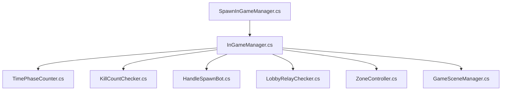
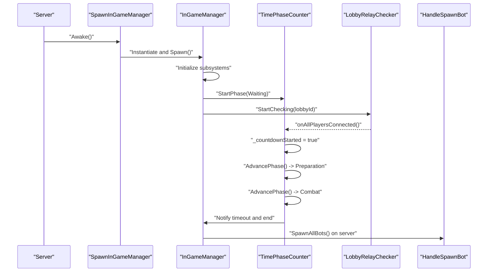
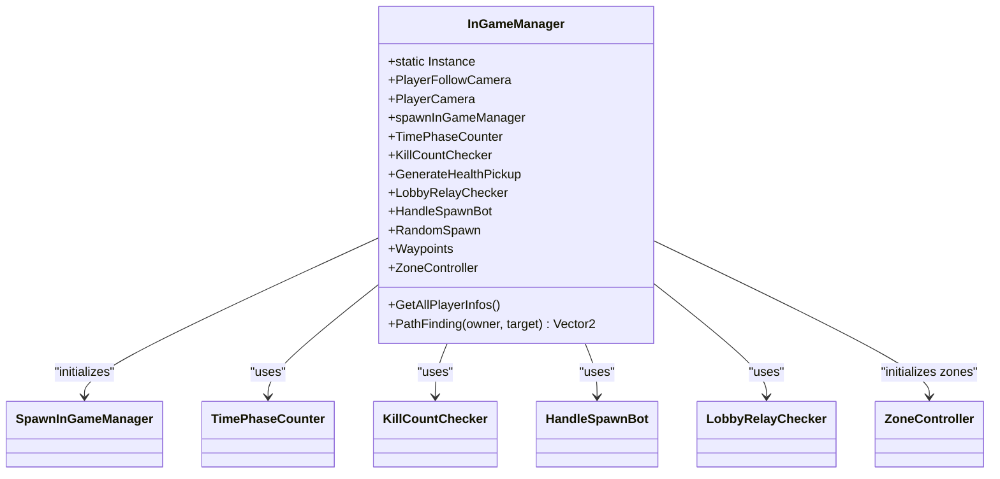
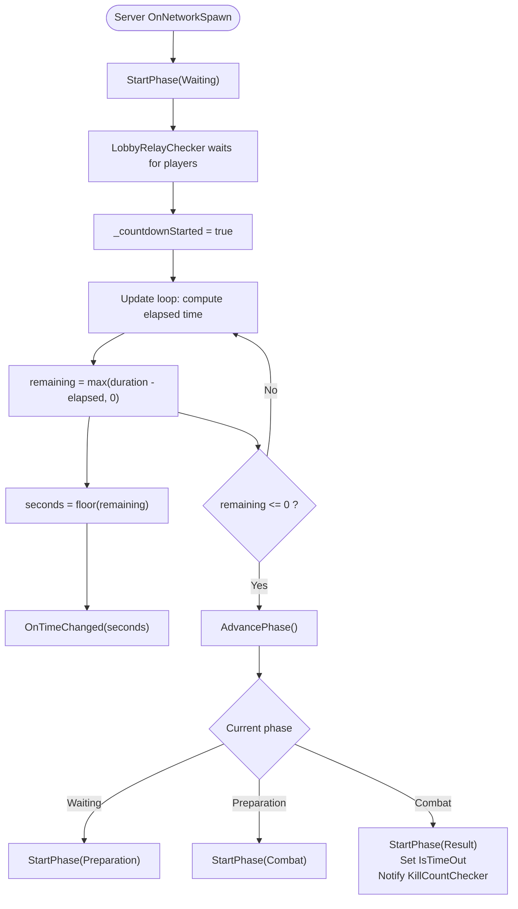
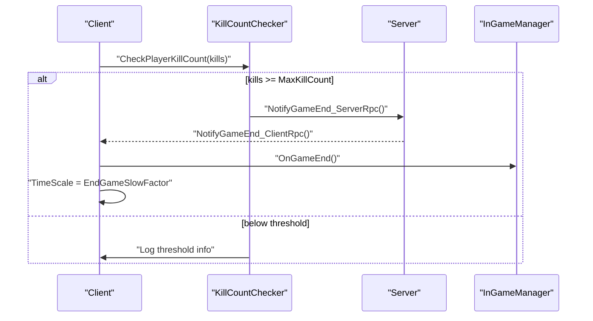
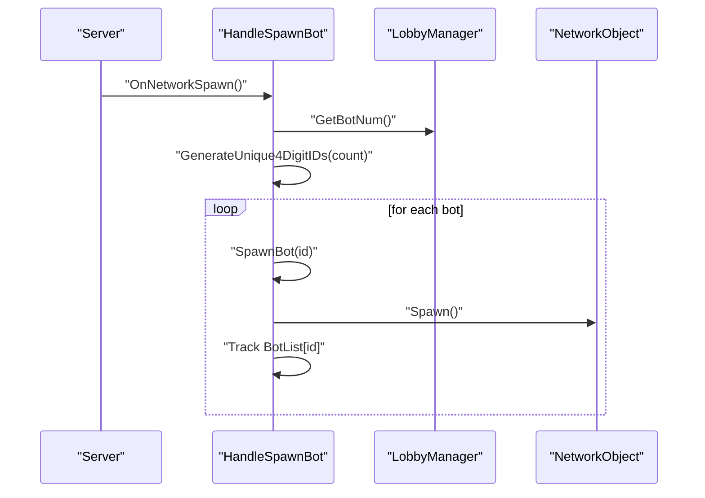
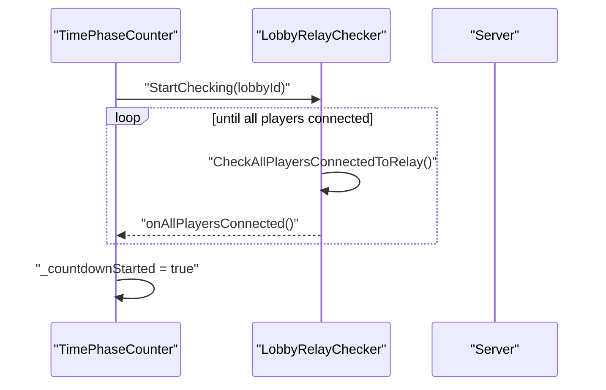
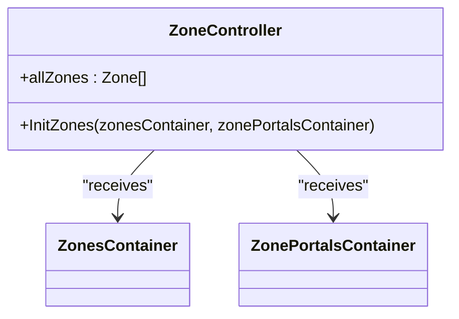
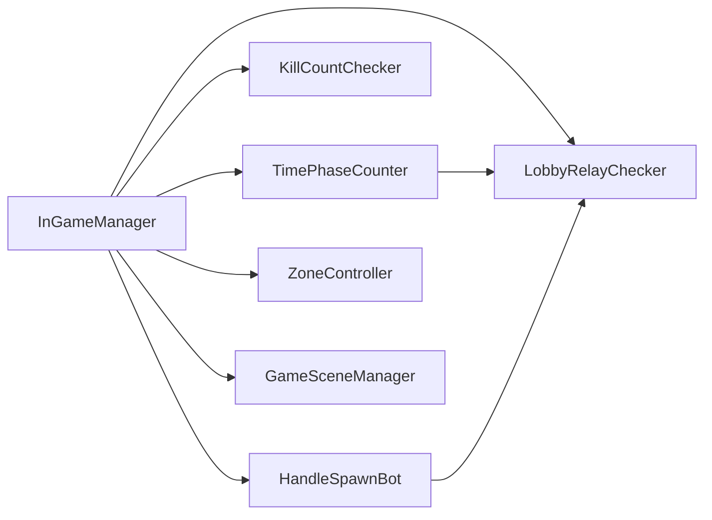

# Game Session Management

<cite>
**Referenced Files in This Document**
- [InGameManager.cs](file://Assets/FPS-Game/Scripts/System/InGameManager.cs)
- [SpawnInGameManager.cs](file://Assets/FPS-Game/Scripts/System/SpawnInGameManager.cs)
- [TimePhaseCounter.cs](file://Assets/FPS-Game/Scripts/System/TimePhaseCounter.cs)
- [KillCountChecker.cs](file://Assets/FPS-Game/Scripts/System/KillCountChecker.cs)
- [HandleSpawnBot.cs](file://Assets/FPS-Game/Scripts/System/HandleSpawnBot.cs)
- [LobbyRelayChecker.cs](file://Assets/FPS-Game/Scripts/System/LobbyRelayChecker.cs)
- [ZoneController.cs](file://Assets/FPS-Game/Scripts/System/ZoneController.cs)
- [GameSceneManager.cs](file://Assets/FPS-Game/Scripts/GameSceneManager.cs)
- [TimeManager.asset](file://ProjectSettings/TimeManager.asset)
</cite>

## Table of Contents
1. [Introduction](#introduction)
2. [Project Structure](#project-structure)
3. [Core Components](#core-components)
4. [Architecture Overview](#architecture-overview)
5. [Detailed Component Analysis](#detailed-component-analysis)
6. [Dependency Analysis](#dependency-analysis)
7. [Performance Considerations](#performance-considerations)
8. [Troubleshooting Guide](#troubleshooting-guide)
9. [Conclusion](#conclusion)
10. [Appendices](#appendices)

## Introduction
This document explains the game session management system responsible for orchestrating match lifecycle control and game state management. It focuses on how the InGameManager coordinates subsystems for time phase management, victory condition checking, and bot spawning coordination. It also documents match phases from lobby setup through gameplay to post-match processing, and outlines configuration options for match duration, spawn rates, and win conditions. Finally, it covers synchronization with networking, UI feedback, common issues, and graceful shutdown procedures.

## Project Structure
The game session management is centered around a singleton orchestration component (InGameManager) that composes and controls several subsystems:
- TimePhaseCounter: Manages match phases and timing.
- KillCountChecker: Enforces win-by-kill-count conditions.
- HandleSpawnBot: Spawns and manages bots.
- LobbyRelayChecker: Synchronizes lobby and relay connectivity.
- ZoneController: Provides spatial zone awareness for navigation and tactics.
- SpawnInGameManager: Ensures InGameManager is spawned early on the server.
- GameSceneManager: Handles scene transitions for lobby and play scenes.

**Diagram sources**
- [InGameManager.cs:66-128](file://Assets/FPS-Game/Scripts/System/InGameManager.cs#L66-L128)
- [SpawnInGameManager.cs:20-69](file://Assets/FPS-Game/Scripts/System/SpawnInGameManager.cs#L20-L69)
- [TimePhaseCounter.cs:13-49](file://Assets/FPS-Game/Scripts/System/TimePhaseCounter.cs#L13-L49)
- [KillCountChecker.cs:5-39](file://Assets/FPS-Game/Scripts/System/KillCountChecker.cs#L5-L39)
- [HandleSpawnBot.cs:6-25](file://Assets/FPS-Game/Scripts/System/HandleSpawnBot.cs#L6-L25)
- [LobbyRelayChecker.cs:8-23](file://Assets/FPS-Game/Scripts/System/LobbyRelayChecker.cs#L8-L23)
- [ZoneController.cs:8-18](file://Assets/FPS-Game/Scripts/System/ZoneController.cs#L8-L18)
- [GameSceneManager.cs:4-25](file://Assets/FPS-Game/Scripts/GameSceneManager.cs#L4-L25)

**Section sources**
- [InGameManager.cs:66-128](file://Assets/FPS-Game/Scripts/System/InGameManager.cs#L66-L128)
- [SpawnInGameManager.cs:20-69](file://Assets/FPS-Game/Scripts/System/SpawnInGameManager.cs#L20-L69)
- [TimePhaseCounter.cs:13-49](file://Assets/FPS-Game/Scripts/System/TimePhaseCounter.cs#L13-L49)
- [KillCountChecker.cs:5-39](file://Assets/FPS-Game/Scripts/System/KillCountChecker.cs#L5-L39)
- [HandleSpawnBot.cs:6-25](file://Assets/FPS-Game/Scripts/System/HandleSpawnBot.cs#L6-L25)
- [LobbyRelayChecker.cs:8-23](file://Assets/FPS-Game/Scripts/System/LobbyRelayChecker.cs#L8-L23)
- [ZoneController.cs:8-18](file://Assets/FPS-Game/Scripts/System/ZoneController.cs#L8-L18)
- [GameSceneManager.cs:4-25](file://Assets/FPS-Game/Scripts/GameSceneManager.cs#L4-L25)

## Core Components
- InGameManager: Singleton orchestrator that initializes and exposes subsystems, handles network events, and provides utilities like pathfinding.
- TimePhaseCounter: Enumerates match phases (Waiting, Preparation, Combat, Result), tracks durations, and advances automatically on the server.
- KillCountChecker: Checks win-by-kill-count conditions and notifies clients to slow down time on end.
- HandleSpawnBot: Spawns bots on the server, assigns unique IDs, and attaches controllers.
- LobbyRelayChecker: Periodically checks lobby and relay connectivity to trigger countdown start.
- ZoneController: Initializes zones and portals for spatial awareness.
- SpawnInGameManager: Ensures InGameManager exists early via server-side spawn.
- GameSceneManager: Loads scenes asynchronously and persists across scene changes.

Key responsibilities:
- Orchestration: InGameManager wires subsystems and exposes shared services.
- Timing: TimePhaseCounter defines and enforces match phase durations.
- Win conditions: KillCountChecker triggers end-of-game logic.
- Bot control: HandleSpawnBot spawns and tracks bots deterministically.
- Synchronization: Networking via Netcode for GameObjects (NetworkBehaviour, NetworkVariable, ServerRpc/ClientRpc).
- UI feedback: TimePhaseCounter emits time change callbacks; KillCountChecker slows time for dramatic effect.

**Section sources**
- [InGameManager.cs:66-128](file://Assets/FPS-Game/Scripts/System/InGameManager.cs#L66-L128)
- [TimePhaseCounter.cs:5-113](file://Assets/FPS-Game/Scripts/System/TimePhaseCounter.cs#L5-L113)
- [KillCountChecker.cs:5-41](file://Assets/FPS-Game/Scripts/System/KillCountChecker.cs#L5-L41)
- [HandleSpawnBot.cs:6-83](file://Assets/FPS-Game/Scripts/System/HandleSpawnBot.cs#L6-L83)
- [LobbyRelayChecker.cs:8-63](file://Assets/FPS-Game/Scripts/System/LobbyRelayChecker.cs#L8-L63)
- [ZoneController.cs:8-18](file://Assets/FPS-Game/Scripts/System/ZoneController.cs#L8-L18)
- [SpawnInGameManager.cs:5-70](file://Assets/FPS-Game/Scripts/System/SpawnInGameManager.cs#L5-L70)
- [GameSceneManager.cs:4-26](file://Assets/FPS-Game/Scripts/GameSceneManager.cs#L4-L26)

## Architecture Overview
The system follows a centralized orchestration pattern:
- SpawnInGameManager ensures InGameManager exists on the server before clients connect.
- InGameManager initializes subsystems and exposes them to other components.
- TimePhaseCounter drives match progression and informs UI.
- LobbyRelayChecker waits for all players to join the relay before starting countdown.
- KillCountChecker monitors kills and ends the game when thresholds are met.
- HandleSpawnBot creates bots deterministically on the server and tracks them.
- ZoneController provides spatial context for navigation and tactics.
- GameSceneManager handles scene transitions.

**Diagram sources**
- [SpawnInGameManager.cs:20-69](file://Assets/FPS-Game/Scripts/System/SpawnInGameManager.cs#L20-L69)
- [InGameManager.cs:97-128](file://Assets/FPS-Game/Scripts/System/InGameManager.cs#L97-L128)
- [TimePhaseCounter.cs:34-94](file://Assets/FPS-Game/Scripts/System/TimePhaseCounter.cs#L34-L94)
- [LobbyRelayChecker.cs:19-55](file://Assets/FPS-Game/Scripts/System/LobbyRelayChecker.cs#L19-L55)
- [HandleSpawnBot.cs:21-44](file://Assets/FPS-Game/Scripts/System/HandleSpawnBot.cs#L21-L44)

## Detailed Component Analysis

### InGameManager Orchestration
- Singleton lifecycle: Ensures a single InGameManager instance and cleans up on despawn.
- Subsystem initialization: Locates and stores references to subsystems (TimePhaseCounter, KillCountChecker, HandleSpawnBot, etc.).
- Network-ready signaling: Emits a ready event when spawned on the network.
- Player info aggregation: Server gathers per-client kill/death stats and sends them back to requester.
- Pathfinding utility: Uses NavMesh to compute movement direction between two transforms.

**Diagram sources**
- [InGameManager.cs:66-128](file://Assets/FPS-Game/Scripts/System/InGameManager.cs#L66-L128)
- [SpawnInGameManager.cs:20-39](file://Assets/FPS-Game/Scripts/System/SpawnInGameManager.cs#L20-L39)
- [TimePhaseCounter.cs:13-49](file://Assets/FPS-Game/Scripts/System/TimePhaseCounter.cs#L13-L49)
- [KillCountChecker.cs:5-39](file://Assets/FPS-Game/Scripts/System/KillCountChecker.cs#L5-L39)
- [HandleSpawnBot.cs:6-25](file://Assets/FPS-Game/Scripts/System/HandleSpawnBot.cs#L6-L25)
- [LobbyRelayChecker.cs:8-23](file://Assets/FPS-Game/Scripts/System/LobbyRelayChecker.cs#L8-L23)
- [ZoneController.cs:8-18](file://Assets/FPS-Game/Scripts/System/ZoneController.cs#L8-L18)

**Section sources**
- [InGameManager.cs:66-128](file://Assets/FPS-Game/Scripts/System/InGameManager.cs#L66-L128)
- [InGameManager.cs:141-194](file://Assets/FPS-Game/Scripts/System/InGameManager.cs#L141-L194)
- [InGameManager.cs:202-231](file://Assets/FPS-Game/Scripts/System/InGameManager.cs#L202-L231)

### Time Phase Management
- Phases: Waiting, Preparation, Combat, Result.
- Durations: Configurable per phase via serialized fields.
- Countdown: Starts when lobby relay confirms all players joined; server-driven advancement.
- UI updates: Emits second-tick callbacks for UI timers.
- End-of-match: Sets timeout flag and triggers kill-checker end notification.

**Diagram sources**
- [TimePhaseCounter.cs:34-94](file://Assets/FPS-Game/Scripts/System/TimePhaseCounter.cs#L34-L94)
- [TimePhaseCounter.cs:51-71](file://Assets/FPS-Game/Scripts/System/TimePhaseCounter.cs#L51-L71)
- [KillCountChecker.cs:28-39](file://Assets/FPS-Game/Scripts/System/KillCountChecker.cs#L28-L39)

**Section sources**
- [TimePhaseCounter.cs:5-113](file://Assets/FPS-Game/Scripts/System/TimePhaseCounter.cs#L5-L113)

### Victory Condition Checking
- Win condition: First to reach MaxKillCount wins.
- Detection: Per-player kill count checked; when threshold met, server RPC notifies clients.
- Outcome: Slow-motion effect applied to emphasize end-of-match.

**Diagram sources**
- [KillCountChecker.cs:12-39](file://Assets/FPS-Game/Scripts/System/KillCountChecker.cs#L12-L39)

**Section sources**
- [KillCountChecker.cs:5-41](file://Assets/FPS-Game/Scripts/System/KillCountChecker.cs#L5-L41)

### Bot Spawning Coordination
- Deterministic spawn: Server spawns bots based on lobby-configured bot count.
- Unique IDs: Generates 4-digit unique IDs for bot identification.
- Controllers: Instantiates bot controller prefab and attaches to each bot.
- Tracking: Maintains dictionary keyed by bot ID for later retrieval.

**Diagram sources**
- [HandleSpawnBot.cs:21-58](file://Assets/FPS-Game/Scripts/System/HandleSpawnBot.cs#L21-L58)

**Section sources**
- [HandleSpawnBot.cs:6-83](file://Assets/FPS-Game/Scripts/System/HandleSpawnBot.cs#L6-L83)

### Lobby Connectivity and Countdown Trigger
- Periodic check: Polls lobby and compares to connected clients.
- Trigger: When counts match, fires event to start countdown.

**Diagram sources**
- [LobbyRelayChecker.cs:19-55](file://Assets/FPS-Game/Scripts/System/LobbyRelayChecker.cs#L19-L55)
- [TimePhaseCounter.cs:40-45](file://Assets/FPS-Game/Scripts/System/TimePhaseCounter.cs#L40-L45)

**Section sources**
- [LobbyRelayChecker.cs:8-63](file://Assets/FPS-Game/Scripts/System/LobbyRelayChecker.cs#L8-L63)

### Spatial Zones and Navigation
- Initialization: ZoneController receives zones and portals from SpawnInGameManager.
- Purpose: Enables tactical movement and spatial reasoning for bots.

**Diagram sources**
- [ZoneController.cs:10-18](file://Assets/FPS-Game/Scripts/System/ZoneController.cs#L10-L18)
- [InGameManager.cs:124-127](file://Assets/FPS-Game/Scripts/System/InGameManager.cs#L124-L127)

**Section sources**
- [ZoneController.cs:8-18](file://Assets/FPS-Game/Scripts/System/ZoneController.cs#L8-L18)
- [InGameManager.cs:124-127](file://Assets/FPS-Game/Scripts/System/InGameManager.cs#L124-L127)

### Scene Management
- Persistence: GameSceneManager persists across scene loads.
- Async loading: Prevents blocking during scene transitions.

**Section sources**
- [GameSceneManager.cs:4-26](file://Assets/FPS-Game/Scripts/GameSceneManager.cs#L4-L26)

## Dependency Analysis
- Coupling: InGameManager depends on subsystems but remains agnostic of UI and networking specifics, promoting cohesion.
- Network dependencies: All subsystems derive from NetworkBehaviour; InGameManager centralizes RPCs and state.
- External services: LobbyRelayChecker integrates with Unity Lobby service for connectivity checks.
- Time precision: Relies on NetworkManager.ServerTime and LocalTime for server-authoritative timing.

**Diagram sources**
- [InGameManager.cs:76-84](file://Assets/FPS-Game/Scripts/System/InGameManager.cs#L76-L84)
- [TimePhaseCounter.cs:32-45](file://Assets/FPS-Game/Scripts/System/TimePhaseCounter.cs#L32-L45)
- [HandleSpawnBot.cs:30-34](file://Assets/FPS-Game/Scripts/System/HandleSpawnBot.cs#L30-L34)

**Section sources**
- [InGameManager.cs:76-84](file://Assets/FPS-Game/Scripts/System/InGameManager.cs#L76-L84)
- [TimePhaseCounter.cs:32-45](file://Assets/FPS-Game/Scripts/System/TimePhaseCounter.cs#L32-L45)
- [HandleSpawnBot.cs:30-34](file://Assets/FPS-Game/Scripts/System/HandleSpawnBot.cs#L30-L34)

## Performance Considerations
- Fixed timestep: Unity’s fixed timestep influences simulation stability and predictability.
- Network time: Using NetworkManager.ServerTime and LocalTime avoids drift and ensures deterministic phase transitions.
- RPC frequency: Minimize UI update frequency; throttle OnTimeChanged emissions to seconds granularity.
- Bot spawning: Batch spawn on server and avoid per-frame allocations.

Practical tips:
- Keep phase durations aligned with expected player counts to avoid idle time.
- Use NetworkVariables for minimal bandwidth updates.
- Avoid heavy computations in Update loops; delegate to FixedUpdate where appropriate.

**Section sources**
- [TimeManager.asset:6-9](file://ProjectSettings/TimeManager.asset#L6-L9)
- [TimePhaseCounter.cs:51-71](file://Assets/FPS-Game/Scripts/System/TimePhaseCounter.cs#L51-L71)

## Troubleshooting Guide
Common issues and resolutions:
- State synchronization
  - Symptom: Clients see different timers or phases.
  - Cause: Non-server updates to phase state.
  - Fix: Ensure only server writes to phase-related NetworkVariables; clients read and react to change events.

- Timing precision
  - Symptom: Phases end slightly off.
  - Cause: Client vs server time differences.
  - Fix: Use NetworkManager.ServerTime for authoritative starts and deadlines.

- Countdown not starting
  - Symptom: Waiting phase never progresses.
  - Cause: Lobby relay mismatch or missing event firing.
  - Fix: Verify lobby ID and that onAllPlayersConnected fires; confirm LobbyRelayChecker polling loop runs.

- Bot spawn failures
  - Symptom: Missing bots or errors during spawn.
  - Cause: Missing LobbyManager or prefab references.
  - Fix: Ensure LobbyManager is initialized and bot prefabs are assigned; verify NetworkObject is present before spawn.

- Graceful shutdown
  - Symptom: Game does not reset cleanly after match.
  - Cause: Missing cleanup of subsystems or persistent state.
  - Fix: Reset phase state, clear bot lists, and unload scenes via GameSceneManager.

**Section sources**
- [TimePhaseCounter.cs:34-45](file://Assets/FPS-Game/Scripts/System/TimePhaseCounter.cs#L34-L45)
- [LobbyRelayChecker.cs:40-61](file://Assets/FPS-Game/Scripts/System/LobbyRelayChecker.cs#L40-L61)
- [HandleSpawnBot.cs:46-58](file://Assets/FPS-Game/Scripts/System/HandleSpawnBot.cs#L46-L58)
- [GameSceneManager.cs:20-25](file://Assets/FPS-Game/Scripts/GameSceneManager.cs#L20-L25)

## Conclusion
The game session management system centers on InGameManager orchestrating time, win conditions, and bot control. TimePhaseCounter governs match phases with server-authoritative timing, KillCountChecker enforces win conditions, and HandleSpawnBot provides deterministic bot population. LobbyRelayChecker synchronizes lobby and relay connectivity to start matches reliably. Together, these components form a robust, Netcode-enabled lifecycle pipeline from lobby to post-match processing.

## Appendices

### Configuration Options
- Match durations
  - Waiting phase duration: Configure in TimePhaseCounter.
  - Preparation phase duration: Configure in TimePhaseCounter.
  - Combat phase duration: Configure in TimePhaseCounter.
  - Result phase duration: Configure in TimePhaseCounter.
- Win conditions
  - Max kill count: Set in KillCountChecker.
  - End game slow factor: Set in KillCountChecker.
- Bot population
  - Bot count: Controlled by lobby settings and retrieved via LobbyManager.
  - Bot prefab: Assigned in HandleSpawnBot.
- Scene management
  - Scene loading: Use GameSceneManager.LoadScene.

**Section sources**
- [TimePhaseCounter.cs:21-25](file://Assets/FPS-Game/Scripts/System/TimePhaseCounter.cs#L21-L25)
- [KillCountChecker.cs:7-8](file://Assets/FPS-Game/Scripts/System/KillCountChecker.cs#L7-L8)
- [HandleSpawnBot.cs:8-9](file://Assets/FPS-Game/Scripts/System/HandleSpawnBot.cs#L8-L9)
- [GameSceneManager.cs:20-25](file://Assets/FPS-Game/Scripts/GameSceneManager.cs#L20-L25)