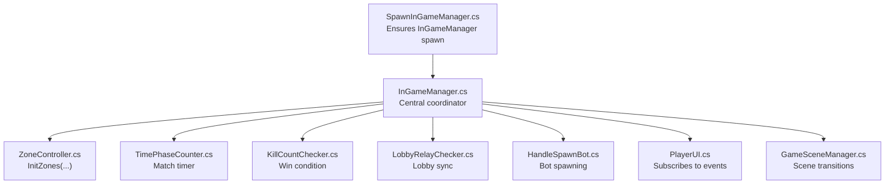
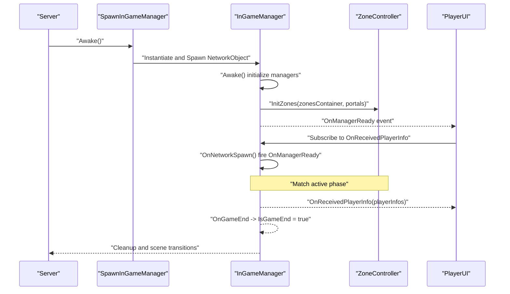
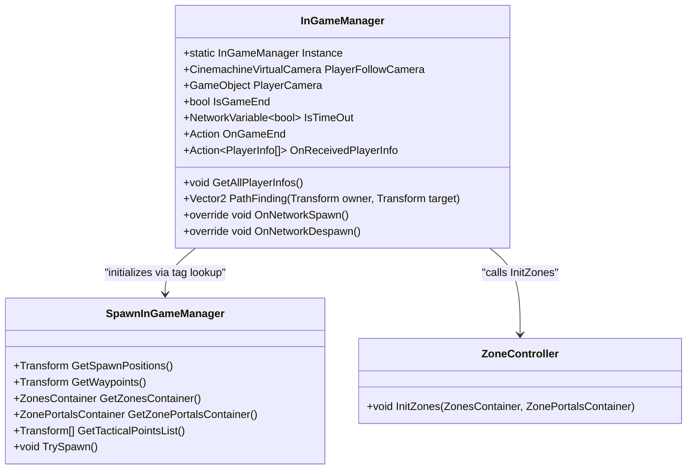
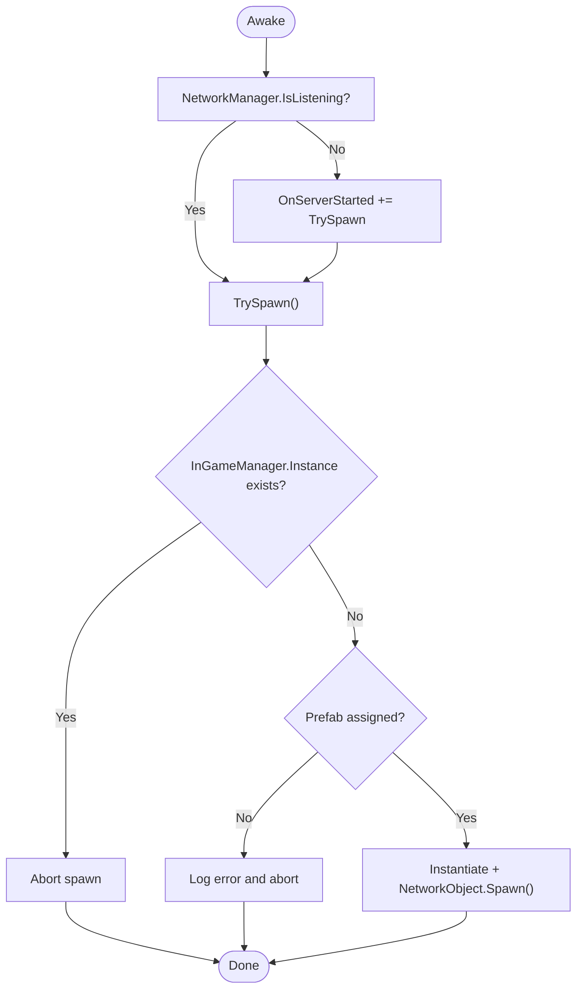
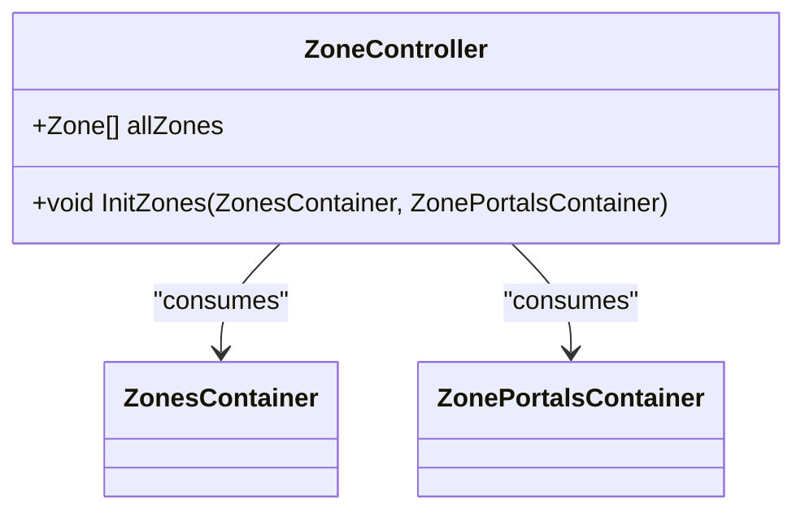
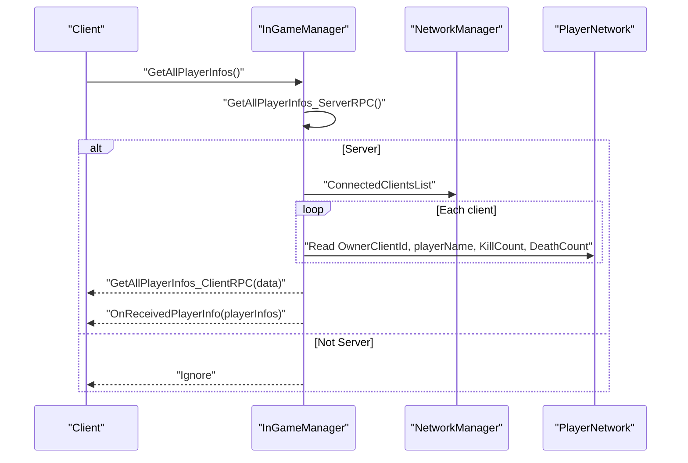
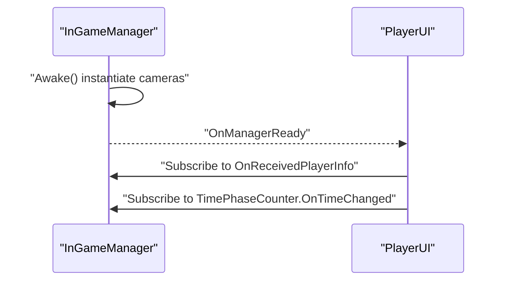
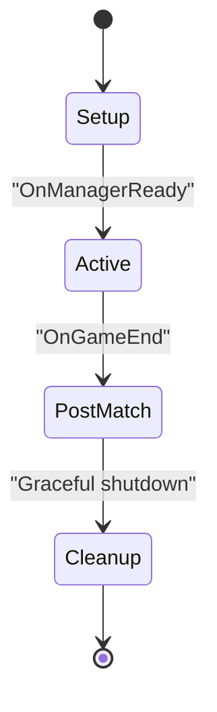
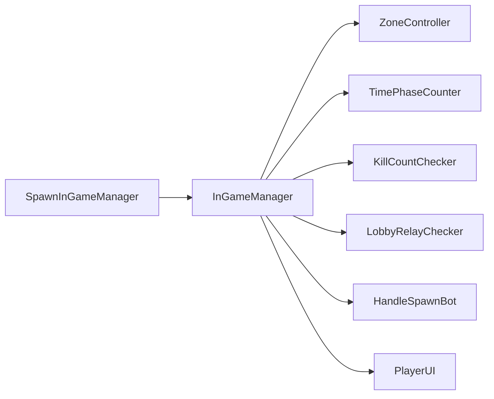

# Match Lifecycle Management

<cite>
**Referenced Files in This Document**
- [InGameManager.cs](file://Assets/FPS-Game/Scripts/System/InGameManager.cs)
- [SpawnInGameManager.cs](file://Assets/FPS-Game/Scripts/System/SpawnInGameManager.cs)
- [ZoneController.cs](file://Assets/FPS-Game/Scripts/System/ZoneController.cs)
- [PlayerInfo.cs](file://Assets/FPS-Game/Scripts/PlayerInfo.cs)
- [GameSceneManager.cs](file://Assets/FPS-Game/Scripts/GameSceneManager.cs)
- [TimePhaseCounter.cs](file://Assets/FPS-Game/Scripts/System/TimePhaseCounter.cs)
- [KillCountChecker.cs](file://Assets/FPS-Game/Scripts/System/KillCountChecker.cs)
- [LobbyRelayChecker.cs](file://Assets/FPS-Game/Scripts/System/LobbyRelayChecker.cs)
- [HandleSpawnBot.cs](file://Assets/FPS-Game/Scripts/System/HandleSpawnBot.cs)
- [PlayerUI.cs](file://Assets/FPS-Game/Scripts/Player/PlayerUI.cs)
</cite>

## Table of Contents
1. [Introduction](#introduction)
2. [Project Structure](#project-structure)
3. [Core Components](#core-components)
4. [Architecture Overview](#architecture-overview)
5. [Detailed Component Analysis](#detailed-component-analysis)
6. [Dependency Analysis](#dependency-analysis)
7. [Performance Considerations](#performance-considerations)
8. [Troubleshooting Guide](#troubleshooting-guide)
9. [Conclusion](#conclusion)
10. [Appendices](#appendices)

## Introduction
This document explains the match lifecycle management system that orchestrates the flow from lobby setup through gameplay termination. It focuses on the central coordinator role of InGameManager, covering initialization phases, player registration, spawn point management, tactical zone setup, camera management, and graceful shutdown. It also documents the state machine implementation for match phases (pre-game setup, active gameplay, post-match cleanup), network synchronization during state changes, camera transitions, and resource cleanup procedures. Practical examples are referenced from the actual codebase to illustrate how the system coordinates with SpawnInGameManager for location setup and ZoneController for tactical area initialization.

## Project Structure
The match lifecycle spans several managers and systems:
- InGameManager: Central coordinator for match state, camera management, player info collection, and lifecycle events.
- SpawnInGameManager: Ensures InGameManager is instantiated early on the server and provides spawn positions, waypoints, tactical points, and zones.
- ZoneController: Initializes and manages tactical zones and portals for navigation and AI pathing.
- Supporting managers: TimePhaseCounter, KillCountChecker, LobbyRelayChecker, HandleSpawnBot.
- Player-facing UI: Subscribes to InGameManager events to update timers and leaderboard-like displays.

**Diagram sources**
- [SpawnInGameManager.cs:20-39](file://Assets/FPS-Game/Scripts/System/SpawnInGameManager.cs#L20-L39)
- [InGameManager.cs:110-128](file://Assets/FPS-Game/Scripts/System/InGameManager.cs#L110-L128)
- [ZoneController.cs:13-18](file://Assets/FPS-Game/Scripts/System/ZoneController.cs#L13-L18)
- [PlayerUI.cs:66-85](file://Assets/FPS-Game/Scripts/Player/PlayerUI.cs#L66-L85)
- [GameSceneManager.cs:20-25](file://Assets/FPS-Game/Scripts/GameSceneManager.cs#L20-L25)

**Section sources**
- [InGameManager.cs:66-139](file://Assets/FPS-Game/Scripts/System/InGameManager.cs#L66-L139)
- [SpawnInGameManager.cs:20-69](file://Assets/FPS-Game/Scripts/System/SpawnInGameManager.cs#L20-L69)
- [ZoneController.cs:13-18](file://Assets/FPS-Game/Scripts/System/ZoneController.cs#L13-L18)
- [GameSceneManager.cs:8-25](file://Assets/FPS-Game/Scripts/GameSceneManager.cs#L8-L25)

## Core Components
- InGameManager
  - Singleton instance management and NetworkBehaviour lifecycle.
  - Camera management via Cinemachine virtual cameras.
  - Player info collection via ServerRpc/ClientRpc to broadcast per-client stats.
  - Navigation and tactical zone integration via ZoneController.
  - Event hooks for match end and player death notifications.
  - Pathfinding helper for AI movement using NavMesh.

- SpawnInGameManager
  - Early instantiation of InGameManager on server startup.
  - Provides spawn positions, waypoints, tactical points, and zones containers.

- ZoneController
  - Initializes tactical zones and portals from containers supplied by SpawnInGameManager.

- Supporting Managers
  - TimePhaseCounter: Tracks match time and emits OnTimeChanged events.
  - KillCountChecker: Enforces win conditions based on kill counts.
  - LobbyRelayChecker: Coordinates lobby-to-game transitions.
  - HandleSpawnBot: Manages bot spawning logic.

- PlayerInfo
  - Structured representation of player statistics used by InGameManager’s RPC pipeline.

**Section sources**
- [InGameManager.cs:66-232](file://Assets/FPS-Game/Scripts/System/InGameManager.cs#L66-L232)
- [SpawnInGameManager.cs:5-70](file://Assets/FPS-Game/Scripts/System/SpawnInGameManager.cs#L5-L70)
- [ZoneController.cs:8-18](file://Assets/FPS-Game/Scripts/System/ZoneController.cs#L8-L18)
- [PlayerInfo.cs:10-52](file://Assets/FPS-Game/Scripts/PlayerInfo.cs#L10-L52)

## Architecture Overview
The lifecycle begins when the server starts and SpawnInGameManager ensures InGameManager exists. InGameManager initializes child managers, camera systems, and zone configuration. During gameplay, InGameManager coordinates time, win conditions, player info collection, and bot spawning. UI subscribes to events for live updates. At match end, InGameManager triggers cleanup and scene transitions.

**Diagram sources**
- [SpawnInGameManager.cs:41-69](file://Assets/FPS-Game/Scripts/System/SpawnInGameManager.cs#L41-L69)
- [InGameManager.cs:97-139](file://Assets/FPS-Game/Scripts/System/InGameManager.cs#L97-L139)
- [ZoneController.cs:13-18](file://Assets/FPS-Game/Scripts/System/ZoneController.cs#L13-L18)
- [PlayerUI.cs:66-85](file://Assets/FPS-Game/Scripts/Player/PlayerUI.cs#L66-L85)

## Detailed Component Analysis

### InGameManager: Central Coordinator
Responsibilities:
- Singleton lifecycle and NetworkBehaviour spawn/despawn.
- Camera management (Cinemachine virtual cameras).
- Zone initialization via ZoneController.
- Player info collection via ServerRpc/ClientRpc.
- Pathfinding helper for AI movement.
- Event hooks for match end and player deaths.

Key behaviors:
- Initialization: Finds SpawnInGameManager, instantiates cameras, and initializes child managers. Calls ZoneController.InitZones with containers from SpawnInGameManager.
- Network synchronization: GetAllPlayerInfos triggers a ServerRpc that aggregates per-client stats and sends them back via ClientRpc to the requester. UI subscribes to OnReceivedPlayerInfo to update displays.
- Camera management: Stores references to PlayerCamera and PlayerFollowCamera for later transitions.
- Pathfinding: Calculates NavMesh path and returns normalized movement direction for AI.

**Diagram sources**
- [InGameManager.cs:66-232](file://Assets/FPS-Game/Scripts/System/InGameManager.cs#L66-L232)
- [SpawnInGameManager.cs:14-18](file://Assets/FPS-Game/Scripts/System/SpawnInGameManager.cs#L14-L18)
- [ZoneController.cs:13-18](file://Assets/FPS-Game/Scripts/System/ZoneController.cs#L13-L18)

**Section sources**
- [InGameManager.cs:97-139](file://Assets/FPS-Game/Scripts/System/InGameManager.cs#L97-L139)
- [InGameManager.cs:141-194](file://Assets/FPS-Game/Scripts/System/InGameManager.cs#L141-L194)
- [InGameManager.cs:202-231](file://Assets/FPS-Game/Scripts/System/InGameManager.cs#L202-L231)

### SpawnInGameManager: Early InGameManager Spawner
Responsibilities:
- Ensures InGameManager is spawned on the server as early as possible.
- Provides spawn positions, waypoints, tactical points, and zones/portals containers to InGameManager.

Key behaviors:
- Subscribes to NetworkManager.OnServerStarted to spawn InGameManager if not yet present.
- Validates prefab presence and NetworkObject existence before spawning.

**Diagram sources**
- [SpawnInGameManager.cs:20-69](file://Assets/FPS-Game/Scripts/System/SpawnInGameManager.cs#L20-L69)

**Section sources**
- [SpawnInGameManager.cs:20-69](file://Assets/FPS-Game/Scripts/System/SpawnInGameManager.cs#L20-L69)

### ZoneController: Tactical Area Initialization
Responsibilities:
- Initializes tactical zones and portals using containers provided by SpawnInGameManager.
- Prepares zone lists for navigation and AI pathing.

Key behaviors:
- Accepts ZonesContainer and ZonePortalsContainer in InitZones.
- Stores all zones for later use by AI and navigation systems.

**Diagram sources**
- [ZoneController.cs:8-18](file://Assets/FPS-Game/Scripts/System/ZoneController.cs#L8-L18)

**Section sources**
- [ZoneController.cs:13-18](file://Assets/FPS-Game/Scripts/System/ZoneController.cs#L13-L18)

### Player Info Collection Mechanism
Responsibilities:
- Aggregate per-client player statistics server-side and distribute them to clients.
- Provide a structured PlayerInfo record for UI and scoring.

Key behaviors:
- Client requests via GetAllPlayerInfos trigger a ServerRpc.
- Server gathers stats from PlayerNetwork components and sends them back via ClientRpc.
- UI subscribes to OnReceivedPlayerInfo to update leaderboards and timers.

**Diagram sources**
- [InGameManager.cs:141-194](file://Assets/FPS-Game/Scripts/System/InGameManager.cs#L141-L194)

**Section sources**
- [InGameManager.cs:141-194](file://Assets/FPS-Game/Scripts/System/InGameManager.cs#L141-L194)
- [PlayerInfo.cs:10-52](file://Assets/FPS-Game/Scripts/PlayerInfo.cs#L10-L52)

### Camera Management Transitions
Responsibilities:
- Initialize and manage player cameras (first-person and follow).
- Coordinate camera switching during gameplay.

Key behaviors:
- InGameManager stores references to PlayerCamera and PlayerFollowCamera after instantiation.
- UI subscribes to InGameManager.OnManagerReady to bind timer updates and other UI logic.

**Diagram sources**
- [InGameManager.cs:97-109](file://Assets/FPS-Game/Scripts/System/InGameManager.cs#L97-L109)
- [PlayerUI.cs:66-85](file://Assets/FPS-Game/Scripts/Player/PlayerUI.cs#L66-L85)

**Section sources**
- [InGameManager.cs:97-109](file://Assets/FPS-Game/Scripts/System/InGameManager.cs#L97-L109)
- [PlayerUI.cs:66-85](file://Assets/FPS-Game/Scripts/Player/PlayerUI.cs#L66-L85)

### State Machine Implementation
Conceptual phases:
- Pre-game setup: SpawnInGameManager ensures InGameManager exists; InGameManager initializes managers, cameras, and zones.
- Active gameplay: TimePhaseCounter runs, KillCountChecker enforces win conditions, LobbyRelayChecker handles transitions, HandleSpawnBot spawns bots, and InGameManager collects player info.
- Post-match cleanup: OnGameEnd sets IsGameEnd flag; UI and managers react to terminate sessions and prepare for scene transitions.

[No sources needed since this diagram shows conceptual workflow, not actual code structure]

## Dependency Analysis
- InGameManager depends on:
  - SpawnInGameManager for spawn positions, waypoints, tactical points, and zones/portals containers.
  - ZoneController for tactical zone initialization.
  - Child managers (TimePhaseCounter, KillCountChecker, LobbyRelayChecker, HandleSpawnBot) for gameplay logic.
- UI depends on InGameManager events for live updates.

**Diagram sources**
- [InGameManager.cs:110-118](file://Assets/FPS-Game/Scripts/System/InGameManager.cs#L110-L118)
- [SpawnInGameManager.cs:14-18](file://Assets/FPS-Game/Scripts/System/SpawnInGameManager.cs#L14-L18)
- [PlayerUI.cs:66-85](file://Assets/FPS-Game/Scripts/Player/PlayerUI.cs#L66-L85)

**Section sources**
- [InGameManager.cs:110-118](file://Assets/FPS-Game/Scripts/System/InGameManager.cs#L110-L118)
- [PlayerUI.cs:66-85](file://Assets/FPS-Game/Scripts/Player/PlayerUI.cs#L66-L85)

## Performance Considerations
- Minimize repeated RPC calls: Batch player info aggregation and send only when requested.
- Efficient pathfinding: Cache NavMesh queries where appropriate and avoid recalculating paths unnecessarily.
- Camera transitions: Keep camera switching logic lightweight to reduce frame-time spikes.
- Zone initialization: Ensure ZonesContainer and ZonePortalsContainer are populated once and reused.

[No sources needed since this section provides general guidance]

## Troubleshooting Guide
Common issues and resolutions:
- State desynchronization
  - Ensure ServerRpc is executed only on the server and ClientRpc targets the requesting client.
  - Verify OnReceivedPlayerInfo subscribers are attached after OnManagerReady fires.
  - Reference: [InGameManager.cs:141-194](file://Assets/FPS-Game/Scripts/System/InGameManager.cs#L141-L194)

- Timing conflicts during transitions
  - Use OnManagerReady to gate UI subscriptions and gameplay logic.
  - Reference: [InGameManager.cs:129-133](file://Assets/FPS-Game/Scripts/System/InGameManager.cs#L129-L133), [PlayerUI.cs:66-85](file://Assets/FPS-Game/Scripts/Player/PlayerUI.cs#L66-L85)

- Proper cleanup of network objects
  - OnNetworkDespawn clears the singleton instance to prevent dangling references.
  - Reference: [InGameManager.cs:135-139](file://Assets/FPS-Game/Scripts/System/InGameManager.cs#L135-L139)

- Camera not initializing
  - Confirm camera prefabs are assigned and instantiated in Awake.
  - Reference: [InGameManager.cs:106-108](file://Assets/FPS-Game/Scripts/System/InGameManager.cs#L106-L108)

- Zones not loaded
  - Ensure SpawnInGameManager provides valid ZonesContainer and ZonePortalsContainer to InGameManager.InitZones.
  - Reference: [InGameManager.cs:124-127](file://Assets/FPS-Game/Scripts/System/InGameManager.cs#L124-L127), [ZoneController.cs:13-18](file://Assets/FPS-Game/Scripts/System/ZoneController.cs#L13-L18)

**Section sources**
- [InGameManager.cs:129-139](file://Assets/FPS-Game/Scripts/System/InGameManager.cs#L129-L139)
- [InGameManager.cs:141-194](file://Assets/FPS-Game/Scripts/System/InGameManager.cs#L141-L194)
- [PlayerUI.cs:66-85](file://Assets/FPS-Game/Scripts/Player/PlayerUI.cs#L66-L85)
- [InGameManager.cs:106-108](file://Assets/FPS-Game/Scripts/System/InGameManager.cs#L106-L108)
- [InGameManager.cs:124-127](file://Assets/FPS-Game/Scripts/System/InGameManager.cs#L124-L127)
- [ZoneController.cs:13-18](file://Assets/FPS-Game/Scripts/System/ZoneController.cs#L13-L18)

## Conclusion
The match lifecycle management system centers on InGameManager, which orchestrates initialization, camera management, tactical zone setup, player info collection, and graceful shutdown. SpawnInGameManager ensures early instantiation on the server, while ZoneController prepares tactical areas. Supporting managers coordinate time, win conditions, lobby transitions, and bot spawning. The system uses NetworkBehaviour and RPCs to synchronize state across clients, with UI subscribing to events for live updates. Proper sequencing and cleanup minimize desynchronization and timing conflicts, enabling a robust and scalable lifecycle.

[No sources needed since this section summarizes without analyzing specific files]

## Appendices
- Example references:
  - Player info collection: [InGameManager.cs:141-194](file://Assets/FPS-Game/Scripts/System/InGameManager.cs#L141-L194)
  - Camera initialization: [InGameManager.cs:106-108](file://Assets/FPS-Game/Scripts/System/InGameManager.cs#L106-L108)
  - Zone initialization: [InGameManager.cs:124-127](file://Assets/FPS-Game/Scripts/System/InGameManager.cs#L124-L127), [ZoneController.cs:13-18](file://Assets/FPS-Game/Scripts/System/ZoneController.cs#L13-L18)
  - UI subscription pattern: [PlayerUI.cs:66-85](file://Assets/FPS-Game/Scripts/Player/PlayerUI.cs#L66-L85)
  - Early spawn guardrails: [SpawnInGameManager.cs:41-69](file://Assets/FPS-Game/Scripts/System/SpawnInGameManager.cs#L41-L69)