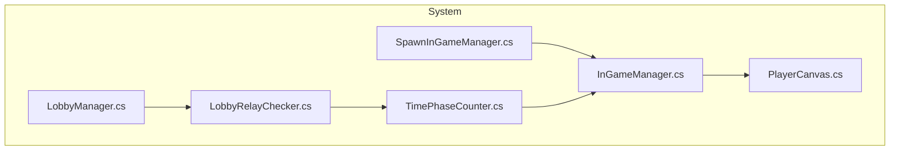
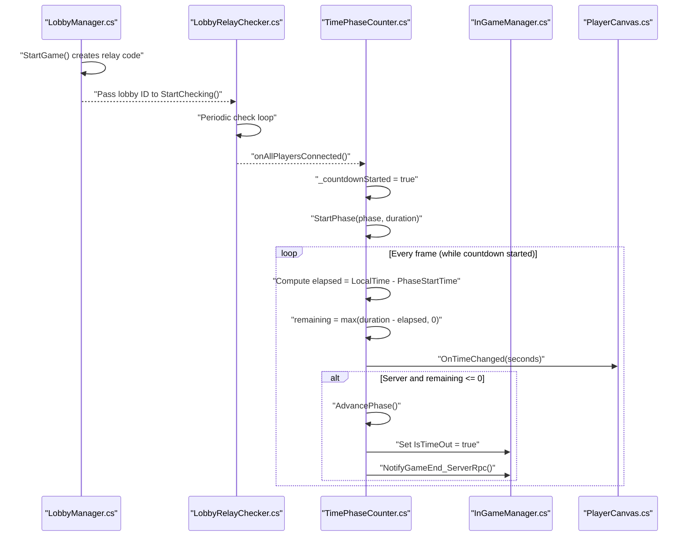
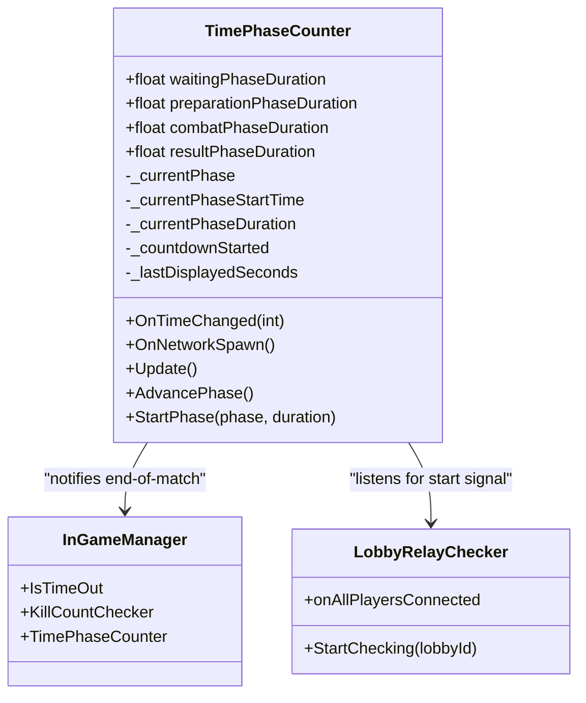
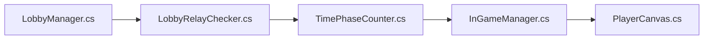

# Time Phase Management

<cite>
**Referenced Files in This Document**
- [TimePhaseCounter.cs](file://Assets/FPS-Game/Scripts/System/TimePhaseCounter.cs)
- [InGameManager.cs](file://Assets/FPS-Game/Scripts/System/InGameManager.cs)
- [LobbyRelayChecker.cs](file://Assets/FPS-Game/Scripts/System/LobbyRelayChecker.cs)
- [LobbyManager.cs](file://Assets/FPS-Game/Scripts/Lobby Script/Lobby/Scripts/LobbyManager.cs)
- [SpawnInGameManager.cs](file://Assets/FPS-Game/Scripts/System/SpawnInGameManager.cs)
- [PlayerCanvas.cs](file://Assets/FPS-Game/Scripts/Player/PlayerCanvas.cs)
</cite>

## Table of Contents
1. [Introduction](#introduction)
2. [Project Structure](#project-structure)
3. [Core Components](#core-components)
4. [Architecture Overview](#architecture-overview)
5. [Detailed Component Analysis](#detailed-component-analysis)
6. [Dependency Analysis](#dependency-analysis)
7. [Performance Considerations](#performance-considerations)
8. [Troubleshooting Guide](#troubleshooting-guide)
9. [Conclusion](#conclusion)
10. [Appendices](#appendices)

## Introduction
This document explains the time phase management system responsible for match timing control and temporal state management. It focuses on the TimePhaseCounter implementation that manages match durations, countdown sequences, and time-based triggers. It documents the server-authoritative timekeeping mechanism and client synchronization strategies, configuration options for match duration settings, and integration with the broader InGameManager for coordinating time-sensitive operations such as spawn waves, power-ups, and victory condition checks. Practical examples demonstrate timer state transitions, pause/resume functionality, and emergency timeout scenarios, with guidance for handling time drift, client-server differences, and network latency.

## Project Structure
The time phase management system spans several scripts:
- TimePhaseCounter: Central authority for match phases and countdowns.
- InGameManager: Orchestrates subsystems and exposes shared state (e.g., IsTimeOut).
- LobbyRelayChecker and LobbyManager: Coordinate lobby readiness and relay connectivity to trigger countdowns.
- SpawnInGameManager: Ensures InGameManager is spawned early on the server.
- PlayerCanvas: Consumes time events to update UI timers.

**Diagram sources**
- [TimePhaseCounter.cs:34-49](file://Assets/FPS-Game/Scripts/System/TimePhaseCounter.cs#L34-L49)
- [InGameManager.cs:110-118](file://Assets/FPS-Game/Scripts/System/InGameManager.cs#L110-L118)
- [LobbyRelayChecker.cs:19-55](file://Assets/FPS-Game/Scripts/System/LobbyRelayChecker.cs#L19-L55)
- [LobbyManager.cs:170-182](file://Assets/FPS-Game/Scripts/Lobby Script/Lobby/Scripts/LobbyManager.cs#L170-L182)
- [SpawnInGameManager.cs:58-69](file://Assets/FPS-Game/Scripts/System/SpawnInGameManager.cs#L58-L69)
- [PlayerCanvas.cs:55-58](file://Assets/FPS-Game/Scripts/Player/PlayerCanvas.cs#L55-L58)

**Section sources**
- [TimePhaseCounter.cs:13-113](file://Assets/FPS-Game/Scripts/System/TimePhaseCounter.cs#L13-L113)
- [InGameManager.cs:66-128](file://Assets/FPS-Game/Scripts/System/InGameManager.cs#L66-L128)
- [LobbyRelayChecker.cs:8-63](file://Assets/FPS-Game/Scripts/System/LobbyRelayChecker.cs#L8-L63)
- [LobbyManager.cs:13-589](file://Assets/FPS-Game/Scripts/Lobby Script/Lobby/Scripts/LobbyManager.cs#L13-L589)
- [SpawnInGameManager.cs:5-70](file://Assets/FPS-Game/Scripts/System/SpawnInGameManager.cs#L5-L70)
- [PlayerCanvas.cs:50-91](file://Assets/FPS-Game/Scripts/Player/PlayerCanvas.cs#L50-L91)

## Core Components
- TimePhaseCounter
  - Manages match phases (Waiting, Preparation, Combat, Result) with configurable durations.
  - Server-authoritative timekeeper using NetworkManager.ServerTime and NetworkManager.LocalTime.
  - Triggers phase advancement when a phase’s duration elapses.
  - Emits OnTimeChanged events for UI updates.
  - Integrates with lobby readiness via LobbyRelayChecker to start countdowns.

- InGameManager
  - Holds references to subsystems including TimePhaseCounter, KillCountChecker, and others.
  - Exposes IsTimeOut NetworkVariable for global “timeout” state signaling.
  - Coordinates end-of-match actions and delegates to KillCountChecker for scoring.

- LobbyRelayChecker and LobbyManager
  - Monitor lobby-to-relay connectivity and emit an event when all players are connected.
  - TimePhaseCounter listens to this event to start the countdown.

- PlayerCanvas
  - Receives OnTimeChanged and updates the HUD timer display.

**Section sources**
- [TimePhaseCounter.cs:5-113](file://Assets/FPS-Game/Scripts/System/TimePhaseCounter.cs#L5-L113)
- [InGameManager.cs:66-128](file://Assets/FPS-Game/Scripts/System/InGameManager.cs#L66-L128)
- [LobbyRelayChecker.cs:8-63](file://Assets/FPS-Game/Scripts/System/LobbyRelayChecker.cs#L8-L63)
- [LobbyManager.cs:170-182](file://Assets/FPS-Game/Scripts/Lobby Script/Lobby/Scripts/LobbyManager.cs#L170-L182)
- [PlayerCanvas.cs:55-58](file://Assets/FPS-Game/Scripts/Player/PlayerCanvas.cs#L55-L58)

## Architecture Overview
The system follows a server-authoritative model:
- Server initializes Waiting phase and starts lobby readiness checks.
- Once all players connect to the relay, the server flips a flag to start the countdown.
- Clients observe NetworkManager.LocalTime to compute remaining time locally.
- When remaining time reaches zero on the server, the phase advances and signals end-of-match conditions.

**Diagram sources**
- [LobbyManager.cs:545-569](file://Assets/FPS-Game/Scripts/Lobby Script/Lobby/Scripts/LobbyManager.cs#L545-L569)
- [LobbyRelayChecker.cs:28-55](file://Assets/FPS-Game/Scripts/System/LobbyRelayChecker.cs#L28-L55)
- [TimePhaseCounter.cs:34-71](file://Assets/FPS-Game/Scripts/System/TimePhaseCounter.cs#L34-L71)
- [InGameManager.cs:90](file://Assets/FPS-Game/Scripts/System/InGameManager.cs#L90)

## Detailed Component Analysis

### TimePhaseCounter: Server-Authoritative Timekeeper
- Responsibilities
  - Define match phases and durations.
  - Track current phase, start time, and duration using NetworkVariables.
  - Compute remaining time using NetworkManager.LocalTime on clients and NetworkManager.ServerTime on the server.
  - Emit OnTimeChanged when seconds change to drive UI updates.
  - Advance phases automatically on the server when time expires.
  - Signal end-of-match via InGameManager and KillCountChecker.

- Key Behaviors
  - Initialization: OnNetworkSpawn, server sets Waiting phase and begins lobby readiness checks.
  - Countdown: While countdown started, compute elapsed time and remaining seconds.
  - UI Updates: Invoke OnTimeChanged when seconds tick over.
  - Timeout: On server, when remaining <= 0, advance to next phase and notify end-of-match.

- Configuration Options
  - waitingPhaseDuration, preparationPhaseDuration, combatPhaseDuration, resultPhaseDuration (public floats).

- Integration Points
  - LobbyRelayChecker.onAllPlayersConnected toggles _countdownStarted.
  - InGameManager.IsTimeOut and KillCountChecker for end-of-match signaling.

**Diagram sources**
- [TimePhaseCounter.cs:13-113](file://Assets/FPS-Game/Scripts/System/TimePhaseCounter.cs#L13-L113)
- [InGameManager.cs:76-90](file://Assets/FPS-Game/Scripts/System/InGameManager.cs#L76-L90)
- [LobbyRelayChecker.cs:8-11](file://Assets/FPS-Game/Scripts/System/LobbyRelayChecker.cs#L8-L11)

**Section sources**
- [TimePhaseCounter.cs:5-113](file://Assets/FPS-Game/Scripts/System/TimePhaseCounter.cs#L5-L113)

### InGameManager: Global Coordinator and State Hub
- Responsibilities
  - Holds references to subsystems (TimePhaseCounter, KillCountChecker, etc.).
  - Exposes IsTimeOut NetworkVariable for global “timeout” state.
  - Coordinates end-of-match actions and integrates with KillCountChecker.

- Integration with TimePhaseCounter
  - Receives notifications from TimePhaseCounter to mark IsTimeOut and trigger scoring.

**Section sources**
- [InGameManager.cs:66-128](file://Assets/FPS-Game/Scripts/System/InGameManager.cs#L66-L128)

### LobbyRelayChecker and LobbyManager: Connectivity-Based Start
- Responsibilities
  - Periodically poll lobby membership and compare to Netcode connected clients.
  - Fire an event when all players are connected to the relay.
  - LobbyManager writes relay code into lobby data to coordinate joining.

- Integration with TimePhaseCounter
  - TimePhaseCounter subscribes to onAllPlayersConnected to start countdown.

**Section sources**
- [LobbyRelayChecker.cs:19-55](file://Assets/FPS-Game/Scripts/System/LobbyRelayChecker.cs#L19-L55)
- [LobbyManager.cs:545-569](file://Assets/FPS-Game/Scripts/Lobby Script/Lobby/Scripts/LobbyManager.cs#L545-L569)

### PlayerCanvas: UI Timer Consumption
- Responsibilities
  - Subscribes to OnTimeChanged to update the HUD timer display.
  - Uses UpdateTimerNum to render minutes and seconds.

**Section sources**
- [PlayerCanvas.cs:55-58](file://Assets/FPS-Game/Scripts/Player/PlayerCanvas.cs#L55-L58)

## Dependency Analysis
- Coupling
  - TimePhaseCounter depends on LobbyRelayChecker for start signal and InGameManager for end-of-match signaling.
  - InGameManager aggregates subsystems and exposes shared state consumed by other systems.
  - PlayerCanvas consumes TimePhaseCounter events for UI updates.

- Cohesion
  - TimePhaseCounter encapsulates all phase and timing logic.
  - InGameManager centralizes orchestration and state.

- External Dependencies
  - Unity.Netcode for NetworkManager.ServerTime, NetworkManager.LocalTime, and NetworkVariables.
  - Unity Services Lobby for lobby state and relay coordination.

**Diagram sources**
- [TimePhaseCounter.cs:34-49](file://Assets/FPS-Game/Scripts/System/TimePhaseCounter.cs#L34-L49)
- [InGameManager.cs:110-118](file://Assets/FPS-Game/Scripts/System/InGameManager.cs#L110-L118)
- [LobbyRelayChecker.cs:19-55](file://Assets/FPS-Game/Scripts/System/LobbyRelayChecker.cs#L19-L55)
- [LobbyManager.cs:170-182](file://Assets/FPS-Game/Scripts/Lobby Script/Lobby/Scripts/LobbyManager.cs#L170-L182)
- [PlayerCanvas.cs:55-58](file://Assets/FPS-Game/Scripts/Player/PlayerCanvas.cs#L55-L58)

**Section sources**
- [TimePhaseCounter.cs:34-94](file://Assets/FPS-Game/Scripts/System/TimePhaseCounter.cs#L34-L94)
- [InGameManager.cs:110-128](file://Assets/FPS-Game/Scripts/System/InGameManager.cs#L110-L128)

## Performance Considerations
- Server vs Client Timing
  - Use NetworkManager.ServerTime on the server and NetworkManager.LocalTime on clients to compute remaining time. This avoids drift between peers.
- Event Frequency
  - OnTimeChanged is invoked only when seconds change, minimizing UI update overhead.
- Phase Transitions
  - Server-side phase advancement prevents clients from prematurely advancing.
- Network RPCs
  - End-of-match notifications use ServerRpc/ClientRpc to ensure authoritative state propagation.

[No sources needed since this section provides general guidance]

## Troubleshooting Guide
- Symptom: Timer does not start after players join
  - Verify LobbyRelayChecker emits onAllPlayersConnected and TimePhaseCounter sets _countdownStarted.
  - Confirm LobbyManager writes relay code and clients join the relay.

- Symptom: Time drift between clients
  - Ensure clients compute remaining time using NetworkManager.LocalTime and the server sets phase start time with NetworkManager.ServerTime.

- Symptom: Early phase advancement on clients
  - Confirm TimePhaseCounter only advances phases on the server and clients rely on computed remaining time.

- Symptom: No end-of-match signal
  - Check that TimePhaseCounter sets InGameManager.IsTimeOut and calls NotifyGameEnd_ServerRpc upon combat phase timeout.

**Section sources**
- [TimePhaseCounter.cs:51-94](file://Assets/FPS-Game/Scripts/System/TimePhaseCounter.cs#L51-L94)
- [InGameManager.cs:90](file://Assets/FPS-Game/Scripts/System/InGameManager.cs#L90)

## Conclusion
The time phase management system enforces server-authoritative timing across match phases, ensuring synchronized and deterministic behavior. By leveraging NetworkManager time APIs, NetworkVariables, and a connectivity-driven start mechanism, it coordinates UI updates, phase transitions, and end-of-match signaling. The design cleanly separates concerns between lobby readiness, timing, and orchestration, enabling robust time-sensitive operations such as spawn waves and scoring checks.

[No sources needed since this section summarizes without analyzing specific files]

## Appendices

### Configuration Options Reference
- TimePhaseCounter
  - waitingPhaseDuration: Duration of the Waiting phase.
  - preparationPhaseDuration: Duration of the Preparation phase.
  - combatPhaseDuration: Duration of the Combat phase.
  - resultPhaseDuration: Duration of the Result phase.

**Section sources**
- [TimePhaseCounter.cs:21-25](file://Assets/FPS-Game/Scripts/System/TimePhaseCounter.cs#L21-L25)

### Practical Examples (by file reference)
- Timer initialization and countdown logic
  - [TimePhaseCounter.cs:34-71](file://Assets/FPS-Game/Scripts/System/TimePhaseCounter.cs#L34-L71)
- Timeout detection and phase advancement
  - [TimePhaseCounter.cs:67-94](file://Assets/FPS-Game/Scripts/System/TimePhaseCounter.cs#L67-L94)
- Time-based event scheduling (end-of-match)
  - [TimePhaseCounter.cs:85-87](file://Assets/FPS-Game/Scripts/System/TimePhaseCounter.cs#L85-L87)
- Integration with InGameManager for end-of-match
  - [InGameManager.cs:90](file://Assets/FPS-Game/Scripts/System/InGameManager.cs#L90)
- UI consumption of time events
  - [PlayerCanvas.cs:55-58](file://Assets/FPS-Game/Scripts/Player/PlayerCanvas.cs#L55-L58)