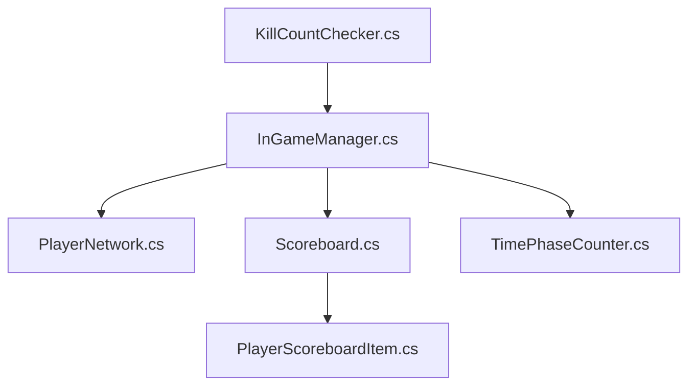
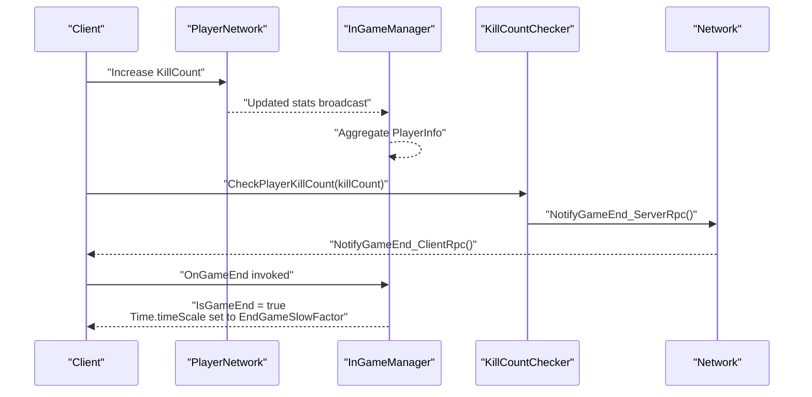
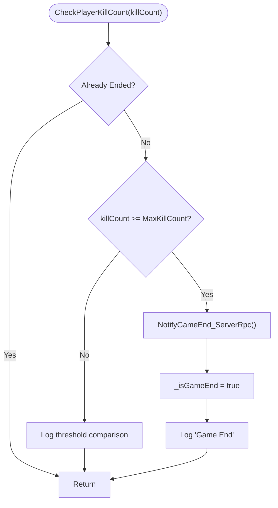
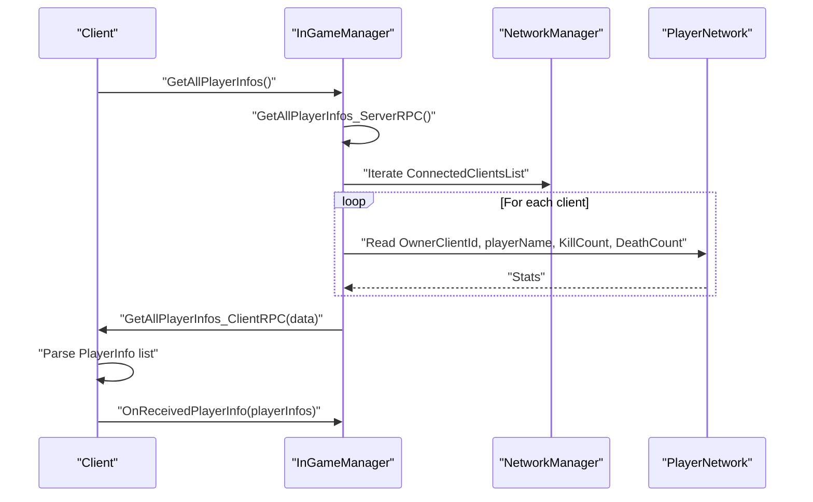
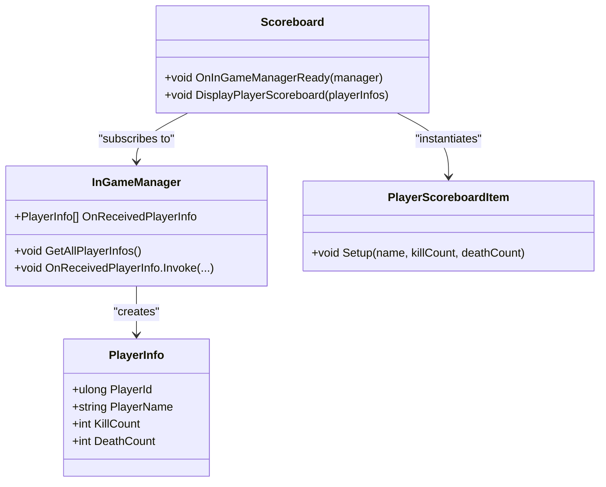
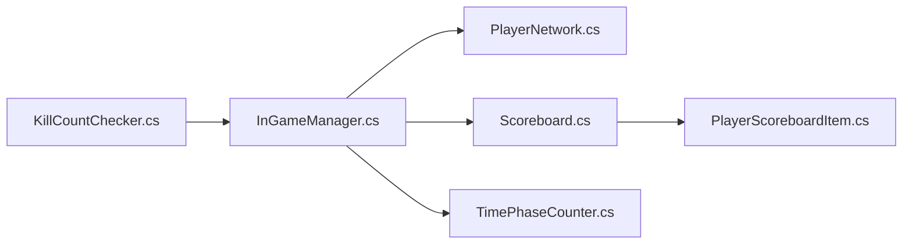

# Victory Condition System

<cite>
**Referenced Files in This Document**
- [KillCountChecker.cs](file://Assets/FPS-Game/Scripts/System/KillCountChecker.cs)
- [InGameManager.cs](file://Assets/FPS-Game/Scripts/System/InGameManager.cs)
- [PlayerNetwork.cs](file://Assets/FPS-Game/Scripts/Player/PlayerNetwork.cs)
- [PlayerScoreboardItem.cs](file://Assets/FPS-Game/Scripts/PlayerScoreboardItem.cs)
- [Scoreboard.cs](file://Assets/FPS-Game/Scripts/Scoreboard.cs)
- [TimePhaseCounter.cs](file://Assets/FPS-Game/Scripts/System/TimePhaseCounter.cs)
</cite>

## Table of Contents
1. [Introduction](#introduction)
2. [Project Structure](#project-structure)
3. [Core Components](#core-components)
4. [Architecture Overview](#architecture-overview)
5. [Detailed Component Analysis](#detailed-component-analysis)
6. [Dependency Analysis](#dependency-analysis)
7. [Performance Considerations](#performance-considerations)
8. [Troubleshooting Guide](#troubleshooting-guide)
9. [Conclusion](#conclusion)
10. [Appendices](#appendices)

## Introduction
This document explains the victory condition system responsible for determining match outcomes and terminating matches when win conditions are met. It focuses on the KillCountChecker implementation for tracking player kills, evaluating win-by-kill thresholds, and coordinating automatic match termination. It also documents the scoring system architecture, player statistics collection, and integration with the InGameManager for broadcasting results and coordinating post-game procedures. Practical examples illustrate different victory scenarios, score display mechanisms, and transitions to post-match screens. Guidance is included for common issues such as score synchronization across clients, handling disconnected players, and edge cases in tie situations.

## Project Structure
The victory condition system spans several scripts:
- KillCountChecker: Centralized logic for win-by-kill detection and match termination signaling.
- InGameManager: Orchestrates match lifecycle, collects and broadcasts player statistics, and coordinates subsystems.
- PlayerNetwork: Provides per-player stats (kills, deaths) used by the scoring system.
- Scoreboard and PlayerScoreboardItem: UI components for displaying live scores during gameplay and post-match.
- TimePhaseCounter: Optional time-based phase management that complements or interacts with win conditions.

**Diagram sources**
- [KillCountChecker.cs:1-41](file://Assets/FPS-Game/Scripts/System/KillCountChecker.cs#L1-L41)
- [InGameManager.cs:66-232](file://Assets/FPS-Game/Scripts/System/InGameManager.cs#L66-L232)
- [PlayerNetwork.cs](file://Assets/FPS-Game/Scripts/Player/PlayerNetwork.cs)
- [Scoreboard.cs:1-46](file://Assets/FPS-Game/Scripts/Scoreboard.cs#L1-L46)
- [PlayerScoreboardItem.cs:1-27](file://Assets/FPS-Game/Scripts/PlayerScoreboardItem.cs#L1-L27)
- [TimePhaseCounter.cs](file://Assets/FPS-Game/Scripts/System/TimePhaseCounter.cs)

**Section sources**
- [KillCountChecker.cs:1-41](file://Assets/FPS-Game/Scripts/System/KillCountChecker.cs#L1-L41)
- [InGameManager.cs:66-232](file://Assets/FPS-Game/Scripts/System/InGameManager.cs#L66-L232)
- [PlayerNetwork.cs](file://Assets/FPS-Game/Scripts/Player/PlayerNetwork.cs)
- [Scoreboard.cs:1-46](file://Assets/FPS-Game/Scripts/Scoreboard.cs#L1-L46)
- [PlayerScoreboardItem.cs:1-27](file://Assets/FPS-Game/Scripts/PlayerScoreboardItem.cs#L1-L27)
- [TimePhaseCounter.cs](file://Assets/FPS-Game/Scripts/System/TimePhaseCounter.cs)

## Core Components
- KillCountChecker
  - Purpose: Detects when a player reaches the configured kill threshold and triggers match termination.
  - Key behaviors:
    - Accepts a kill count input and compares against MaxKillCount.
    - Invokes a server RPC to notify clients when the threshold is reached.
    - Applies a slow-motion factor to the time scale on clients to emphasize the end-of-match moment.
  - Configuration:
    - MaxKillCount: integer threshold for win-by-kill.
    - EndGameSlowFactor: float multiplier applied to Time.timeScale on clients upon match end.

- InGameManager
  - Purpose: Central coordinator for match lifecycle, statistics aggregation, and subsystem orchestration.
  - Key responsibilities:
    - Aggregates player info (ID, name, kills, deaths) via a server RPC and broadcasts it to listeners.
    - Subscribes to KillCountChecker’s OnGameEnd signal to mark the match as ended.
    - Manages camera setup, navigation zones, health pickups, bot spawning, and optional time phases.
  - Data model:
    - PlayerInfo struct holds per-player stats used by the scoreboard and match logic.

- PlayerNetwork
  - Purpose: Holds per-player statistics (KillCount, DeathCount) and player identity used by the scoring system.
  - Integration: InGameManager reads these values to construct PlayerInfo lists.

- Scoreboard and PlayerScoreboardItem
  - Purpose: Display live and post-match player statistics.
  - Integration: Scoreboard subscribes to InGameManager’s OnReceivedPlayerInfo to render a list of PlayerInfo entries.

- TimePhaseCounter
  - Purpose: Optional time-based phase management that can complement win conditions (e.g., time-based draws or timeouts).

**Section sources**
- [KillCountChecker.cs:5-40](file://Assets/FPS-Game/Scripts/System/KillCountChecker.cs#L5-L40)
- [InGameManager.cs:10-24](file://Assets/FPS-Game/Scripts/System/InGameManager.cs#L10-L24)
- [InGameManager.cs:141-194](file://Assets/FPS-Game/Scripts/System/InGameManager.cs#L141-L194)
- [PlayerNetwork.cs](file://Assets/FPS-Game/Scripts/Player/PlayerNetwork.cs)
- [Scoreboard.cs:4-46](file://Assets/FPS-Game/Scripts/Scoreboard.cs#L4-L46)
- [PlayerScoreboardItem.cs:8-27](file://Assets/FPS-Game/Scripts/PlayerScoreboardItem.cs#L8-L27)
- [TimePhaseCounter.cs](file://Assets/FPS-Game/Scripts/System/TimePhaseCounter.cs)

## Architecture Overview
The system follows a server authoritative pattern:
- Clients report kills to the server via PlayerNetwork.
- InGameManager aggregates stats server-side and exposes them to clients.
- KillCountChecker evaluates win-by-kill thresholds server-side and signals clients via RPC.
- InGameManager listens to the end-of-match signal to finalize the game state.

**Diagram sources**
- [KillCountChecker.cs:12-39](file://Assets/FPS-Game/Scripts/System/KillCountChecker.cs#L12-L39)
- [InGameManager.cs:120-123](file://Assets/FPS-Game/Scripts/System/InGameManager.cs#L120-L123)
- [PlayerNetwork.cs](file://Assets/FPS-Game/Scripts/Player/PlayerNetwork.cs)

## Detailed Component Analysis

### KillCountChecker Analysis
- Responsibilities:
  - Evaluate kill counts against MaxKillCount.
  - Broadcast match end to clients using a server RPC followed by a client RPC.
  - Apply EndGameSlowFactor to Time.timeScale on clients to emphasize the end-of-match moment.
- Win-by-Kill Logic:
  - If a player’s kill count meets or exceeds MaxKillCount, the system triggers a match end.
  - A guard prevents repeated triggers after the first end condition.
- Network RPC Flow:
  - ServerRpc is called on the server to notify clients.
  - ClientRpc invokes InGameManager’s OnGameEnd action and adjusts time scale.

**Diagram sources**
- [KillCountChecker.cs:12-26](file://Assets/FPS-Game/Scripts/System/KillCountChecker.cs#L12-L26)

**Section sources**
- [KillCountChecker.cs:5-40](file://Assets/FPS-Game/Scripts/System/KillCountChecker.cs#L5-L40)

### InGameManager Analysis
- Responsibilities:
  - Aggregate player stats server-side and send them back to requesting clients.
  - Subscribe to KillCountChecker’s OnGameEnd to mark IsGameEnd true.
  - Manage cameras, navigation zones, health pickups, bots, waypoints, and optional time phases.
- Player Info Aggregation:
  - Iterates connected clients, extracts PlayerNetwork components, and builds a delimited string of PlayerInfo entries.
  - Sends the aggregated data back to the requesting client via a targeted ClientRpc.
- Event-driven Updates:
  - OnReceivedPlayerInfo is raised with the parsed PlayerInfo list for UI and analytics.

**Diagram sources**
- [InGameManager.cs:141-194](file://Assets/FPS-Game/Scripts/System/InGameManager.cs#L141-L194)

**Section sources**
- [InGameManager.cs:66-232](file://Assets/FPS-Game/Scripts/System/InGameManager.cs#L66-L232)

### Scoring System and Score Display
- Data Model:
  - PlayerInfo encapsulates player ID, name, kill count, and death count.
- Collection:
  - InGameManager constructs PlayerInfo lists server-side and sends them to clients.
- Display:
  - Scoreboard subscribes to OnReceivedPlayerInfo and instantiates PlayerScoreboardItem entries to show names, kills, and deaths.

**Diagram sources**
- [InGameManager.cs:10-24](file://Assets/FPS-Game/Scripts/System/InGameManager.cs#L10-L24)
- [InGameManager.cs:141-194](file://Assets/FPS-Game/Scripts/System/InGameManager.cs#L141-L194)
- [Scoreboard.cs:4-46](file://Assets/FPS-Game/Scripts/Scoreboard.cs#L4-L46)
- [PlayerScoreboardItem.cs:8-27](file://Assets/FPS-Game/Scripts/PlayerScoreboardItem.cs#L8-L27)

**Section sources**
- [InGameManager.cs:10-24](file://Assets/FPS-Game/Scripts/System/InGameManager.cs#L10-L24)
- [InGameManager.cs:141-194](file://Assets/FPS-Game/Scripts/System/InGameManager.cs#L141-L194)
- [Scoreboard.cs:20-31](file://Assets/FPS-Game/Scripts/Scoreboard.cs#L20-L31)
- [PlayerScoreboardItem.cs:20-25](file://Assets/FPS-Game/Scripts/PlayerScoreboardItem.cs#L20-L25)

### Time-Based Victories and Draws
- TimePhaseCounter:
  - Optional component that can manage time-based phases and potentially trigger timeouts or draws.
  - Can be integrated with InGameManager to coordinate end-of-match conditions alongside kill-based wins.

**Section sources**
- [TimePhaseCounter.cs](file://Assets/FPS-Game/Scripts/System/TimePhaseCounter.cs)

## Dependency Analysis
- KillCountChecker depends on:
  - InGameManager for end-of-match event subscription.
  - Network RPC infrastructure for cross-client synchronization.
- InGameManager depends on:
  - PlayerNetwork for per-player stats.
  - NetworkManager for iterating connected clients.
  - UI components (Scoreboard, PlayerScoreboardItem) for display.
- Scoreboard depends on:
  - InGameManager’s OnReceivedPlayerInfo event.
  - PlayerScoreboardItem for rendering individual rows.

**Diagram sources**
- [KillCountChecker.cs:1-41](file://Assets/FPS-Game/Scripts/System/KillCountChecker.cs#L1-L41)
- [InGameManager.cs:66-232](file://Assets/FPS-Game/Scripts/System/InGameManager.cs#L66-L232)
- [PlayerNetwork.cs](file://Assets/FPS-Game/Scripts/Player/PlayerNetwork.cs)
- [Scoreboard.cs:1-46](file://Assets/FPS-Game/Scripts/Scoreboard.cs#L1-L46)
- [PlayerScoreboardItem.cs:1-27](file://Assets/FPS-Game/Scripts/PlayerScoreboardItem.cs#L1-L27)
- [TimePhaseCounter.cs](file://Assets/FPS-Game/Scripts/System/TimePhaseCounter.cs)

**Section sources**
- [KillCountChecker.cs:1-41](file://Assets/FPS-Game/Scripts/System/KillCountChecker.cs#L1-L41)
- [InGameManager.cs:66-232](file://Assets/FPS-Game/Scripts/System/InGameManager.cs#L66-L232)
- [Scoreboard.cs:1-46](file://Assets/FPS-Game/Scripts/Scoreboard.cs#L1-L46)

## Performance Considerations
- Minimize RPC overhead:
  - Batch player info updates when feasible to reduce network chatter.
- Efficient parsing:
  - Use delimiter-based parsing on the client side to avoid expensive string operations.
- Avoid redundant triggers:
  - Guard against repeated end-of-match invocations using a simple flag in KillCountChecker.
- UI instantiation costs:
  - Reuse PlayerScoreboardItem instances or pool UI elements to reduce allocations during frequent updates.

## Troubleshooting Guide
- Score synchronization across clients:
  - Ensure InGameManager’s server RPC runs only on the server and that ClientRpc targets the requesting client specifically.
  - Verify PlayerNetwork values are synchronized via NetworkVariables so that InGameManager reads consistent stats.
- Handling disconnected players:
  - Exclude disconnected clients from the aggregated PlayerInfo list to prevent malformed data.
  - Confirm that PlayerNetwork components are present before attempting to read stats.
- Tie situations and draws:
  - Implement a time-based draw condition using TimePhaseCounter and communicate the outcome via InGameManager events.
  - Define explicit tie-breaking rules (e.g., head-to-head record, kill-differential) if needed.
- Slow motion effect:
  - Validate EndGameSlowFactor is within a reasonable range to avoid extreme slowdowns or freezes.

**Section sources**
- [InGameManager.cs:146-172](file://Assets/FPS-Game/Scripts/System/InGameManager.cs#L146-L172)
- [KillCountChecker.cs:28-39](file://Assets/FPS-Game/Scripts/System/KillCountChecker.cs#L28-L39)

## Conclusion
The victory condition system centers on KillCountChecker for win-by-kill detection and InGameManager for authoritative stat aggregation and match lifecycle coordination. PlayerNetwork supplies the necessary per-player statistics, while Scoreboard and PlayerScoreboardItem provide transparent UI updates. Optional time-based phases can complement kill-based wins to support draws and timeouts. The design leverages server RPCs for authoritative decisions and client RPCs for synchronized end-of-match effects, ensuring consistent outcomes across clients.

## Appendices

### Configuration Options
- Win-by-Kill Limit
  - MaxKillCount: integer threshold for declaring a winner.
  - EndGameSlowFactor: float multiplier applied to Time.timeScale on clients upon match end.
- Time-Based Victories
  - TimePhaseCounter: optional component to manage time-based phases and potential draws.
- Draw Conditions
  - Implement timeout or tie-breaking rules via InGameManager and communicate outcomes to clients.

**Section sources**
- [KillCountChecker.cs:7-8](file://Assets/FPS-Game/Scripts/System/KillCountChecker.cs#L7-L8)
- [TimePhaseCounter.cs](file://Assets/FPS-Game/Scripts/System/TimePhaseCounter.cs)

### Practical Examples
- Example 1: Win-by-Kill
  - A player reaches MaxKillCount; KillCountChecker triggers NotifyGameEnd_ServerRpc, which invokes InGameManager’s OnGameEnd and applies EndGameSlowFactor.
- Example 2: Live Score Display
  - Scoreboard subscribes to InGameManager’s OnReceivedPlayerInfo and instantiates PlayerScoreboardItem entries to reflect real-time stats.
- Example 3: Post-Match Transition
  - After OnGameEnd, clients receive the slow-motion effect and can transition to a post-match screen using UI managers coordinated by InGameManager.

**Section sources**
- [KillCountChecker.cs:12-39](file://Assets/FPS-Game/Scripts/System/KillCountChecker.cs#L12-L39)
- [InGameManager.cs:120-123](file://Assets/FPS-Game/Scripts/System/InGameManager.cs#L120-L123)
- [Scoreboard.cs:20-31](file://Assets/FPS-Game/Scripts/Scoreboard.cs#L20-L31)