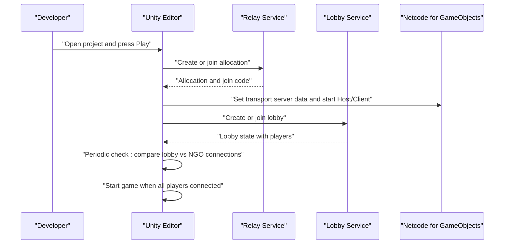

# Getting Started

<cite>
**Referenced Files in This Document**
- [README.md](file://README.md)
- [CLEANUP_SUMMARY.md](file://CLEANUP_SUMMARY.md)
- [manifest.json](file://Packages/manifest.json)
- [PackageManagerSettings.asset](file://ProjectSettings/PackageManagerSettings.asset)
- [NetcodeForGameObjects.asset](file://ProjectSettings/NetcodeForGameObjects.asset)
- [URPProjectSettings.asset](file://ProjectSettings/URPProjectSettings.asset)
- [UnityConnectSettings.asset](file://ProjectSettings/UnityConnectSettings.asset)
- [Relay.cs](file://Assets/FPS-Game/Scripts/Lobby Script/Lobby/Scripts/Relay.cs)
- [LobbyRelayChecker.cs](file://Assets/FPS-Game/Scripts/System/LobbyRelayChecker.cs)
- [PlayerNetwork.cs](file://Assets/FPS-Game/Scripts/Player/PlayerNetwork.cs)
</cite>

## Table of Contents
1. [Introduction](#introduction)
2. [Prerequisites](#prerequisites)
3. [Installation Requirements](#installation-requirements)
4. [Project Setup](#project-setup)
5. [Run Modes](#run-modes)
6. [Initial Configuration](#initial-configuration)
7. [First-Time Running](#first-time-running)
8. [Internet Connectivity Requirements](#internet-connectivity-requirements)
9. [Troubleshooting Guide](#troubleshooting-guide)
10. [Project Cleanup Procedures](#project-cleanup-procedures)
11. [Conclusion](#conclusion)

## Introduction
This guide helps you install, configure, and run the FPS game project locally. It covers Unity version requirements, Unity Gaming Services setup (Relay, Lobby, Authentication), dependency installation via Unity Package Manager, and two run modes: Unity Editor development workflow and standalone build execution. It also includes troubleshooting tips, connectivity requirements for Unity Relay, and cleanup procedures.

## Prerequisites
- Unity 2022.3 or later installed and licensed.
- Basic familiarity with Unity Editor and C# programming.
- Understanding of networking concepts (client-host topology).
- Access to Unity Services dashboard to enable Unity Relay, Unity Lobby, and Unity Authentication.

## Installation Requirements
- Unity version: 2022.3+.
- Unity Package Manager dependencies include:
  - Netcode for GameObjects (NGO)
  - Unity Relay
  - Unity Lobby
  - Unity Input System
  - Universal Render Pipeline (URP)
  - TextMesh Pro
  - Unity Navigation
  - Unity Services packages for Relay and Lobby

These dependencies are declared in the project’s package manifest and are required for networking, rendering, and UI/text.

**Section sources**
- [README.md:86-96](file://README.md#L86-L96)
- [manifest.json:1-66](file://Packages/manifest.json#L1-L66)

## Project Setup
Follow these steps to prepare the project:

1. Open the project in Unity (2022.3+).
2. Unity will automatically fetch and install packages listed in the manifest.
3. Verify that the following settings are present:
   - Netcode for GameObjects configured with default network prefabs.
   - Universal Render Pipeline settings applied.
   - Unity Package Manager scoped registry enabled (default Unity registry).
4. Confirm that Unity Services are enabled in the Unity Editor:
   - Unity Relay, Unity Lobby, and Unity Authentication must be active in the Services window.

Key configuration files:
- Netcode for GameObjects settings define the network prefabs path and generation behavior.
- URP settings control rendering pipeline parameters.
- Package Manager settings enable scoped registries and package dependencies.
- Unity Connect settings control analytics and service integrations.

**Section sources**
- [NetcodeForGameObjects.asset:1-18](file://ProjectSettings/NetcodeForGameObjects.asset#L1-L18)
- [URPProjectSettings.asset:1-16](file://ProjectSettings/URPProjectSettings.asset#L1-L16)
- [PackageManagerSettings.asset:1-36](file://ProjectSettings/PackageManagerSettings.asset#L1-L36)
- [UnityConnectSettings.asset:1-37](file://ProjectSettings/UnityConnectSettings.asset#L1-L37)

## Run Modes
The project supports two primary run modes:

- Unity Editor development workflow
  - Open the project in Unity.
  - Install dependencies via Unity Package Manager.
  - Press Play to start the game in the editor.

- Standalone build execution
  - Ensure the project is linked to Unity Services (Relay + Authentication enabled).
  - Build the project via File > Build Settings.
  - Launch the generated executable.

Important note: Internet connectivity is required for Unity Relay to function properly.

**Section sources**
- [README.md:86-96](file://README.md#L86-L96)

## Initial Configuration
Before running, confirm the following:

- Unity Services
  - Unity Relay: Required for NAT-traversal and serverless connectivity.
  - Unity Lobby: Required for matchmaking and session management.
  - Unity Authentication: Required for player identity and lobby data mapping.

- NGO and Relay integration
  - The project uses NGO for authoritative gameplay and Relay for transport.
  - The Relay integration sets transport server data and starts host/client sessions.

- Lobby and Relay checker
  - The lobby checker periodically compares the number of players in the lobby versus the number connected via NGO to trigger the start of the game when ready.

- Player network mapping
  - Player names are mapped from lobby data to networked player instances for UI and scoring.

**Diagram sources**
- [Relay.cs:26-71](file://Assets/FPS-Game/Scripts/Lobby Script/Lobby/Scripts/Relay.cs#L26-L71)
- [LobbyRelayChecker.cs:19-62](file://Assets/FPS-Game/Scripts/System/LobbyRelayChecker.cs#L19-L62)
- [PlayerNetwork.cs:183-199](file://Assets/FPS-Game/Scripts/Player/PlayerNetwork.cs#L183-L199)

**Section sources**
- [Relay.cs:10-71](file://Assets/FPS-Game/Scripts/Lobby Script/Lobby/Scripts/Relay.cs#L10-L71)
- [LobbyRelayChecker.cs:8-62](file://Assets/FPS-Game/Scripts/System/LobbyRelayChecker.cs#L8-L62)
- [PlayerNetwork.cs:12-39](file://Assets/FPS-Game/Scripts/Player/PlayerNetwork.cs#L12-L39)

## First-Time Running
Follow these steps for a successful first run:

1. Open the project in Unity 2022.3+.
2. Allow Unity to install packages from the manifest.
3. Ensure Unity Services are enabled (Relay, Lobby, Authentication).
4. Enter the Sign In scene and sign in to Unity Authentication.
5. Navigate to the Lobby List scene and create or join a lobby.
6. Start the game once all players are connected (checked by the lobby-relay checker).
7. Play the game in the Play Scene.

Notes:
- Internet connectivity is required for Unity Relay to allocate and join allocations.
- The lobby checker compares lobby player counts with NGO-connected clients to ensure readiness.

**Section sources**
- [README.md:141-160](file://README.md#L141-L160)
- [LobbyRelayChecker.cs:40-61](file://Assets/FPS-Game/Scripts/System/LobbyRelayChecker.cs#L40-L61)

## Internet Connectivity Requirements
- Unity Relay requires an active internet connection to:
  - Allocate relay resources for hosting.
  - Retrieve join codes for clients.
  - Establish transport server data for NGO.

Without internet, Relay operations will fail and the game cannot connect.

**Section sources**
- [README.md:96](file://README.md#L96)

## Troubleshooting Guide
Common setup issues and resolutions:

- Unity Services not enabled
  - Symptom: Cannot create or join lobbies; Relay operations fail.
  - Resolution: Enable Unity Relay, Unity Lobby, and Unity Authentication in the Unity Editor Services window.

- Missing or outdated packages
  - Symptom: Compilation errors or missing types related to Relay, Lobby, or NGO.
  - Resolution: Reopen the project to trigger Unity Package Manager to fetch dependencies from the manifest.

- NGO network prefab configuration
  - Symptom: Runtime errors related to missing network prefabs.
  - Resolution: Verify NGO settings point to the default network prefabs asset.

- URP rendering issues
  - Symptom: Visual artifacts or missing materials.
  - Resolution: Confirm URP project settings are loaded and material versions are compatible.

- Lobby vs NGO connection mismatch
  - Symptom: Game does not start even though the lobby appears full.
  - Resolution: Wait for the lobby-relay checker to detect equal counts of lobby players and NGO-connected clients.

- Authentication mapping failures
  - Symptom: Player names not appearing in-game.
  - Resolution: Ensure Authentication is initialized and player IDs are available before mapping lobby data to networked player instances.

**Section sources**
- [PackageManagerSettings.asset:15-27](file://ProjectSettings/PackageManagerSettings.asset#L15-L27)
- [NetcodeForGameObjects.asset:15-17](file://ProjectSettings/NetcodeForGameObjects.asset#L15-L17)
- [URPProjectSettings.asset:10-16](file://ProjectSettings/URPProjectSettings.asset#L10-L16)
- [LobbyRelayChecker.cs:40-61](file://Assets/FPS-Game/Scripts/System/LobbyRelayChecker.cs#L40-L61)
- [PlayerNetwork.cs:183-199](file://Assets/FPS-Game/Scripts/Player/PlayerNetwork.cs#L183-L199)

## Project Cleanup Procedures
The project has been cleaned to remove unused assets, packages, and demo files. To replicate or verify cleanup:

- Remove unused third-party packages and meta files.
- Delete demo/test scenes and scripts.
- Keep only production-ready assets and required packages:
  - Behavior Designer (AI behavior trees)
  - TextMesh Pro (text rendering)
  - FPS-Game content (scripts, scenes, prefabs)
  - InputActions (Unity Input System)
  - DefaultNetworkPrefabs.asset (NGO configuration)
  - UniversalRenderPipelineGlobalSettings.asset (URP settings)

Verification checklist:
- All production scenes load correctly.
- Core systems (Networking, Player, AI Bot, Zone System, Game Session) remain functional.
- No compile errors and no missing references.

**Section sources**
- [CLEANUP_SUMMARY.md:106-131](file://CLEANUP_SUMMARY.md#L106-L131)
- [CLEANUP_SUMMARY.md:134-175](file://CLEANUP_SUMMARY.md#L134-L175)
- [CLEANUP_SUMMARY.md:214-233](file://CLEANUP_SUMMARY.md#L214-L233)

## Conclusion
You are now ready to run the FPS game project. Use Unity 2022.3+, ensure Unity Services (Relay, Lobby, Authentication) are enabled, install dependencies via Unity Package Manager, and choose either the Unity Editor development workflow or standalone build execution. For reliable networking, keep an internet connection available. If issues arise, consult the troubleshooting section and verify cleanup and configuration steps.