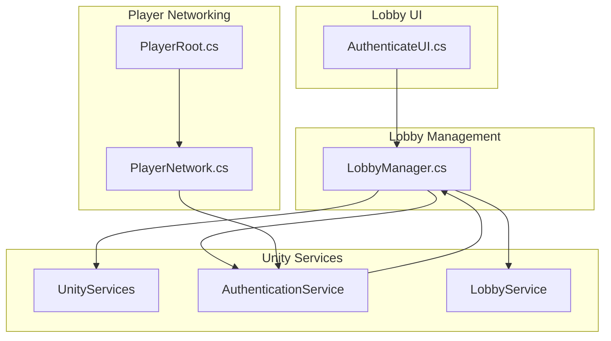
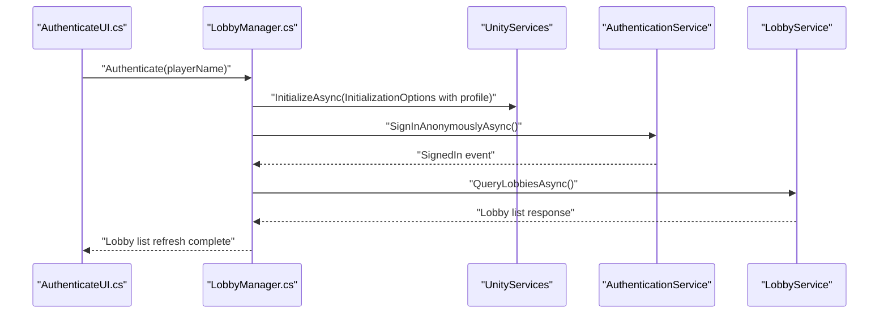
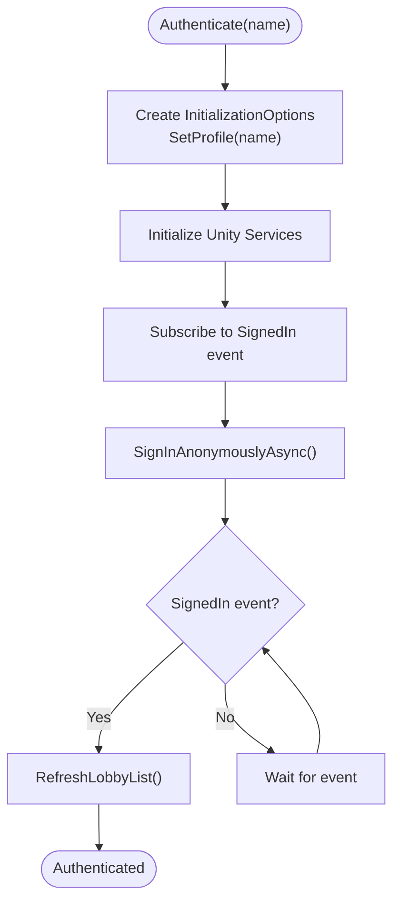
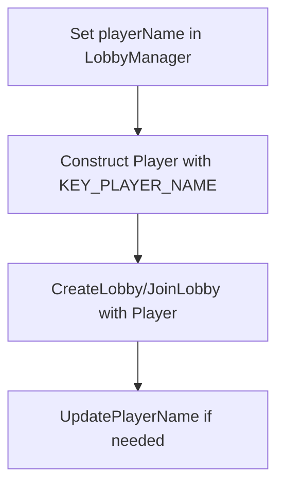
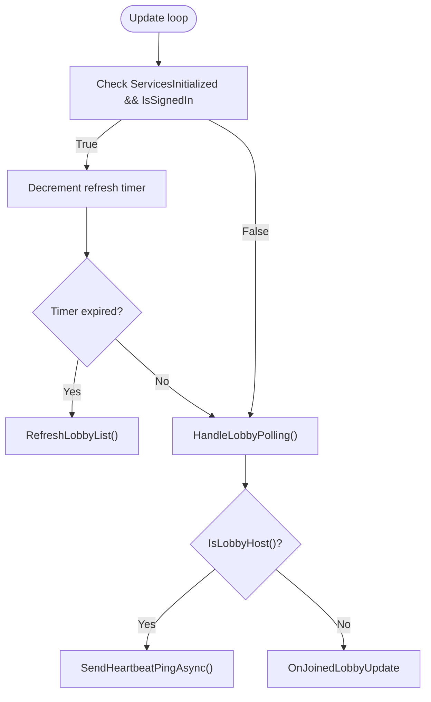
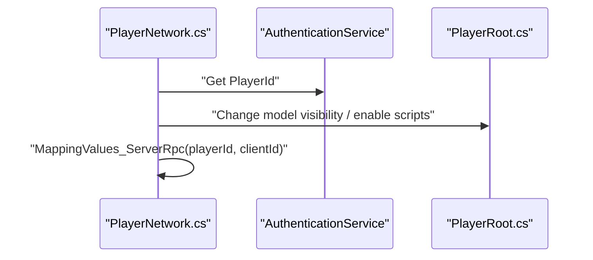
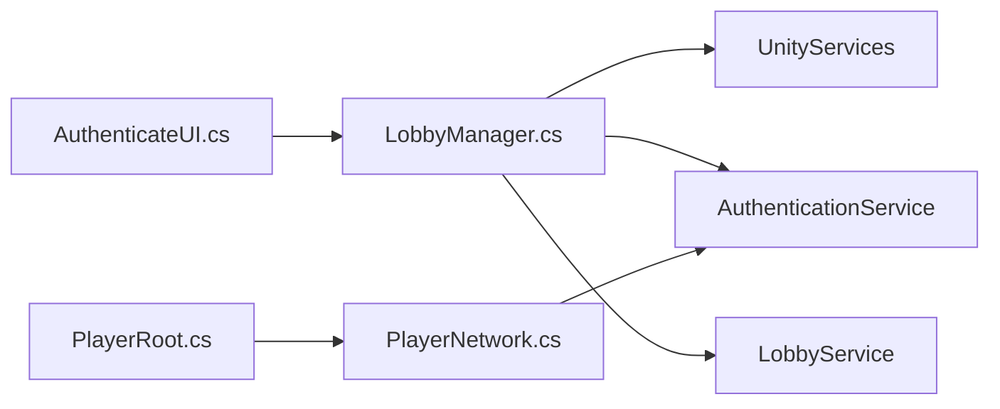

# Authentication System

<cite>
**Referenced Files in This Document**
- [LobbyManager.cs](file://Assets/FPS-Game/Scripts/Lobby Script/Lobby/Scripts/LobbyManager.cs)
- [AuthenticateUI.cs](file://Assets/FPS-Game/Scripts/Lobby Script/Lobby/Scripts/AuthenticateUI.cs)
- [PlayerNetwork.cs](file://Assets/FPS-Game/Scripts/Player/PlayerNetwork.cs)
- [PlayerRoot.cs](file://Assets/FPS-Game/Scripts/Player/PlayerRoot.cs)
- [README.md](file://README.md)
</cite>

## Table of Contents
1. [Introduction](#introduction)
2. [Project Structure](#project-structure)
3. [Core Components](#core-components)
4. [Architecture Overview](#architecture-overview)
5. [Detailed Component Analysis](#detailed-component-analysis)
6. [Dependency Analysis](#dependency-analysis)
7. [Performance Considerations](#performance-considerations)
8. [Troubleshooting Guide](#troubleshooting-guide)
9. [Conclusion](#conclusion)

## Introduction
This document explains the Unity Authentication Service integration within the lobby management system. It focuses on anonymous authentication using Unity Services Core, player profile initialization, authentication state management, and the automatic lobby list refresh triggered upon successful sign-in. It also covers initialization options, event handling for signed-in state changes, error handling patterns, security considerations, token lifecycle, and practical examples of authentication setup and state-checking patterns.

## Project Structure
The authentication and lobby management logic is primarily implemented in the lobby scripts and UI components. The authentication flow is initiated from the lobby sign-in UI and orchestrated by the lobby manager, which initializes Unity Services, authenticates anonymously, and listens for signed-in events to refresh the lobby list.

**Diagram sources**
- [AuthenticateUI.cs:1-20](file://Assets/FPS-Game/Scripts/Lobby Script/Lobby/Scripts/AuthenticateUI.cs#L1-L20)
- [LobbyManager.cs:1-589](file://Assets/FPS-Game/Scripts/Lobby Script/Lobby/Scripts/LobbyManager.cs#L1-L589)
- [PlayerNetwork.cs:1-310](file://Assets/FPS-Game/Scripts/Player/PlayerNetwork.cs#L1-L310)
- [PlayerRoot.cs:1-125](file://Assets/FPS-Game/Scripts/Player/PlayerRoot.cs#L1-L125)

**Section sources**
- [LobbyManager.cs:86-104](file://Assets/FPS-Game/Scripts/Lobby Script/Lobby/Scripts/LobbyManager.cs#L86-L104)
- [AuthenticateUI.cs:7-19](file://Assets/FPS-Game/Scripts/Lobby Script/Lobby/Scripts/AuthenticateUI.cs#L7-L19)

## Core Components
- Authentication initialization and profile setup:
  - Initializes Unity Services with a player profile using InitializationOptions and sets the profile name.
  - Subscribes to the SignedIn event to trigger lobby list refresh after successful authentication.
  - Calls SignInAnonymouslyAsync to perform anonymous authentication.

- Authentication state management:
  - Uses UnityServices.State and AuthenticationService.Instance.IsSignedIn to gate lobby list refresh and polling.
  - Automatically refreshes the lobby list when the signed-in state becomes true.

- Player profile initialization:
  - Stores the player name in the lobby manager and constructs a Player object with public name data for lobby operations.

- Integration with lobby services:
  - Creates, joins, updates, and polls lobby state using Unity Lobby APIs.
  - Starts the game by creating a Relay code and updating lobby data accordingly.

**Section sources**
- [LobbyManager.cs:86-104](file://Assets/FPS-Game/Scripts/Lobby Script/Lobby/Scripts/LobbyManager.cs#L86-L104)
- [LobbyManager.cs:288-319](file://Assets/FPS-Game/Scripts/Lobby Script/Lobby/Scripts/LobbyManager.cs#L288-L319)
- [LobbyManager.cs:106-120](file://Assets/FPS-Game/Scripts/Lobby Script/Lobby/Scripts/LobbyManager.cs#L106-L120)
- [LobbyManager.cs:138-205](file://Assets/FPS-Game/Scripts/Lobby Script/Lobby/Scripts/LobbyManager.cs#L138-L205)
- [LobbyManager.cs:234-240](file://Assets/FPS-Game/Scripts/Lobby Script/Lobby/Scripts/LobbyManager.cs#L234-L240)

## Architecture Overview
The authentication workflow integrates UI triggers, service initialization, and lobby management. The sequence below maps the actual code paths for anonymous authentication and subsequent lobby list refresh.

**Diagram sources**
- [AuthenticateUI.cs:14-17](file://Assets/FPS-Game/Scripts/Lobby Script/Lobby/Scripts/AuthenticateUI.cs#L14-L17)
- [LobbyManager.cs:86-104](file://Assets/FPS-Game/Scripts/Lobby Script/Lobby/Scripts/LobbyManager.cs#L86-L104)
- [LobbyManager.cs:288-319](file://Assets/FPS-Game/Scripts/Lobby Script/Lobby/Scripts/LobbyManager.cs#L288-L319)

## Detailed Component Analysis

### Authentication Initialization and Anonymous Sign-In
- InitializationOptions:
  - Sets the player profile name during Unity Services initialization.
- Anonymous sign-in:
  - Initiates anonymous authentication and subscribes to the SignedIn event.
- Signed-in event handling:
  - Triggers a lobby list refresh when the signed-in state becomes true.

**Diagram sources**
- [LobbyManager.cs:86-104](file://Assets/FPS-Game/Scripts/Lobby Script/Lobby/Scripts/LobbyManager.cs#L86-L104)
- [LobbyManager.cs:288-319](file://Assets/FPS-Game/Scripts/Lobby Script/Lobby/Scripts/LobbyManager.cs#L288-L319)

**Section sources**
- [LobbyManager.cs:86-104](file://Assets/FPS-Game/Scripts/Lobby Script/Lobby/Scripts/LobbyManager.cs#L86-L104)

### Player Profile Initialization and Lobby Integration
- Player profile:
  - The player name is stored in the lobby manager and used to create a Player object with public name data.
- Lobby operations:
  - Uses the Player object when creating or joining lobbies and updating player data.

**Diagram sources**
- [LobbyManager.cs:86-104](file://Assets/FPS-Game/Scripts/Lobby Script/Lobby/Scripts/LobbyManager.cs#L86-L104)
- [LobbyManager.cs:234-240](file://Assets/FPS-Game/Scripts/Lobby Script/Lobby/Scripts/LobbyManager.cs#L234-L240)
- [LobbyManager.cs:321-335](file://Assets/FPS-Game/Scripts/Lobby Script/Lobby/Scripts/LobbyManager.cs#L321-L335)

**Section sources**
- [LobbyManager.cs:234-240](file://Assets/FPS-Game/Scripts/Lobby Script/Lobby/Scripts/LobbyManager.cs#L234-L240)
- [LobbyManager.cs:321-335](file://Assets/FPS-Game/Scripts/Lobby Script/Lobby/Scripts/LobbyManager.cs#L321-L335)

### Authentication State Management and Automatic Lobby Refresh
- State gating:
  - Lobby list refresh and polling are gated by UnityServices.State and AuthenticationService.Instance.IsSignedIn.
- Heartbeat and polling:
  - Periodic heartbeat ping and lobby polling occur only when the player is the host and the lobby is joined.
- Exception handling:
  - Catches and logs lobby service exceptions, including private lobby access errors.

**Diagram sources**
- [LobbyManager.cs:106-120](file://Assets/FPS-Game/Scripts/Lobby Script/Lobby/Scripts/LobbyManager.cs#L106-L120)
- [LobbyManager.cs:122-136](file://Assets/FPS-Game/Scripts/Lobby Script/Lobby/Scripts/LobbyManager.cs#L122-L136)
- [LobbyManager.cs:138-205](file://Assets/FPS-Game/Scripts/Lobby Script/Lobby/Scripts/LobbyManager.cs#L138-L205)

**Section sources**
- [LobbyManager.cs:106-120](file://Assets/FPS-Game/Scripts/Lobby Script/Lobby/Scripts/LobbyManager.cs#L106-L120)
- [LobbyManager.cs:122-136](file://Assets/FPS-Game/Scripts/Lobby Script/Lobby/Scripts/LobbyManager.cs#L122-L136)
- [LobbyManager.cs:138-205](file://Assets/FPS-Game/Scripts/Lobby Script/Lobby/Scripts/LobbyManager.cs#L138-L205)

### Integration with Player Networking
- Player network mapping:
  - After authentication, the player’s remote identity is mapped to local player data for networking.
- Visibility and ownership:
  - Controls model visibility and enables scripts based on ownership and bot status.

**Diagram sources**
- [PlayerNetwork.cs:22-39](file://Assets/FPS-Game/Scripts/Player/PlayerNetwork.cs#L22-L39)
- [PlayerNetwork.cs:183-199](file://Assets/FPS-Game/Scripts/Player/PlayerNetwork.cs#L183-L199)
- [PlayerRoot.cs:31-59](file://Assets/FPS-Game/Scripts/Player/PlayerRoot.cs#L31-L59)

**Section sources**
- [PlayerNetwork.cs:22-39](file://Assets/FPS-Game/Scripts/Player/PlayerNetwork.cs#L22-L39)
- [PlayerNetwork.cs:183-199](file://Assets/FPS-Game/Scripts/Player/PlayerNetwork.cs#L183-L199)

## Dependency Analysis
- UI-to-manager dependency:
  - AuthenticateUI triggers LobbyManager.Authenticate and navigates to the lobby list scene.
- Manager-to-services dependency:
  - LobbyManager depends on Unity Services Core, Authentication, and Lobby services for initialization, authentication, and lobby operations.
- Player-to-auth dependency:
  - PlayerNetwork uses AuthenticationService.Instance.PlayerId for mapping and visibility logic.

**Diagram sources**
- [AuthenticateUI.cs:14-17](file://Assets/FPS-Game/Scripts/Lobby Script/Lobby/Scripts/AuthenticateUI.cs#L14-L17)
- [LobbyManager.cs:5-11](file://Assets/FPS-Game/Scripts/Lobby Script/Lobby/Scripts/LobbyManager.cs#L5-L11)
- [PlayerNetwork.cs:4-6](file://Assets/FPS-Game/Scripts/Player/PlayerNetwork.cs#L4-L6)

**Section sources**
- [AuthenticateUI.cs:14-17](file://Assets/FPS-Game/Scripts/Lobby Script/Lobby/Scripts/AuthenticateUI.cs#L14-L17)
- [LobbyManager.cs:5-11](file://Assets/FPS-Game/Scripts/Lobby Script/Lobby/Scripts/LobbyManager.cs#L5-L11)
- [PlayerNetwork.cs:4-6](file://Assets/FPS-Game/Scripts/Player/PlayerNetwork.cs#L4-L6)

## Performance Considerations
- Polling cadence:
  - Lobby polling and heartbeat intervals are tuned to balance responsiveness and server load.
- Conditional refresh:
  - Lobby list refresh is gated by authentication state to avoid unnecessary requests.
- Async operations:
  - Authentication and lobby operations are asynchronous to prevent blocking the main thread.

[No sources needed since this section provides general guidance]

## Troubleshooting Guide
- Initialization prerequisites:
  - Ensure the project is linked to Unity Services with Authentication enabled before building.
- Authentication failures:
  - Verify that Unity Services initializes successfully and that the SignedIn event fires.
  - Check for lobby service exceptions and handle private lobby access errors gracefully.
- State checks:
  - Use UnityServices.State and AuthenticationService.Instance.IsSignedIn to gate operations until authentication is confirmed.
- Token lifecycle:
  - Rely on Unity Services Core for token management; avoid manual token storage or manipulation.

**Section sources**
- [README.md:91-96](file://README.md#L91-L96)
- [LobbyManager.cs:109-109](file://Assets/FPS-Game/Scripts/Lobby Script/Lobby/Scripts/LobbyManager.cs#L109-L109)
- [LobbyManager.cs:186-199](file://Assets/FPS-Game/Scripts/Lobby Script/Lobby/Scripts/LobbyManager.cs#L186-L199)

## Conclusion
The authentication system integrates Unity Services Core and Unity Lobby services to support anonymous sign-in, initialize player profiles, and manage authentication state. The lobby manager orchestrates initialization, event-driven refresh, and lobby operations while the UI component triggers the authentication flow. Proper state checks, exception handling, and integration with player networking ensure a robust and responsive lobby experience.