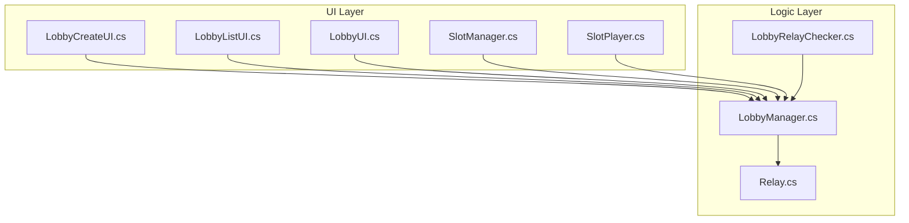
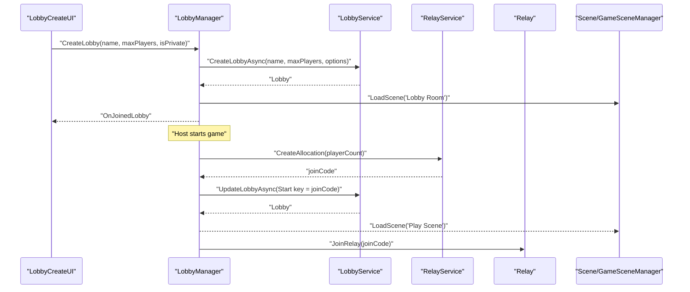
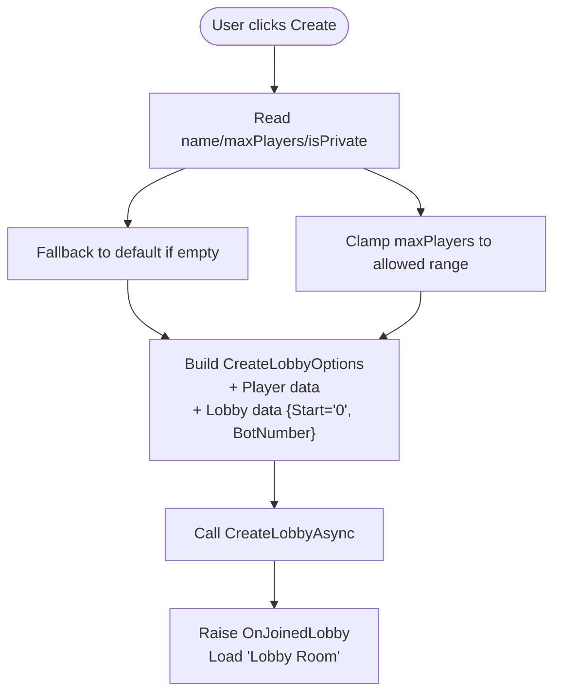
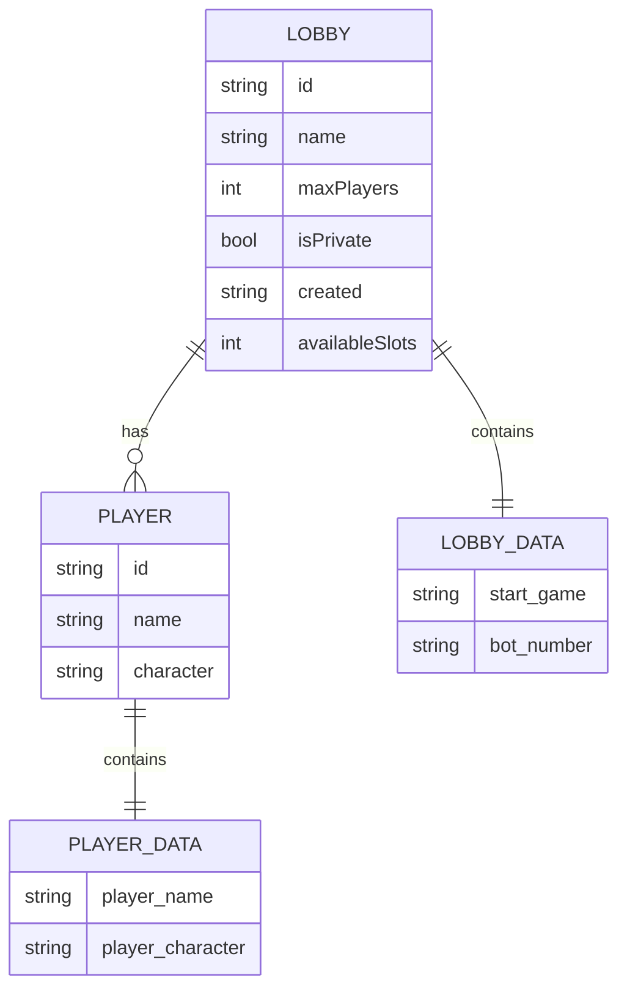
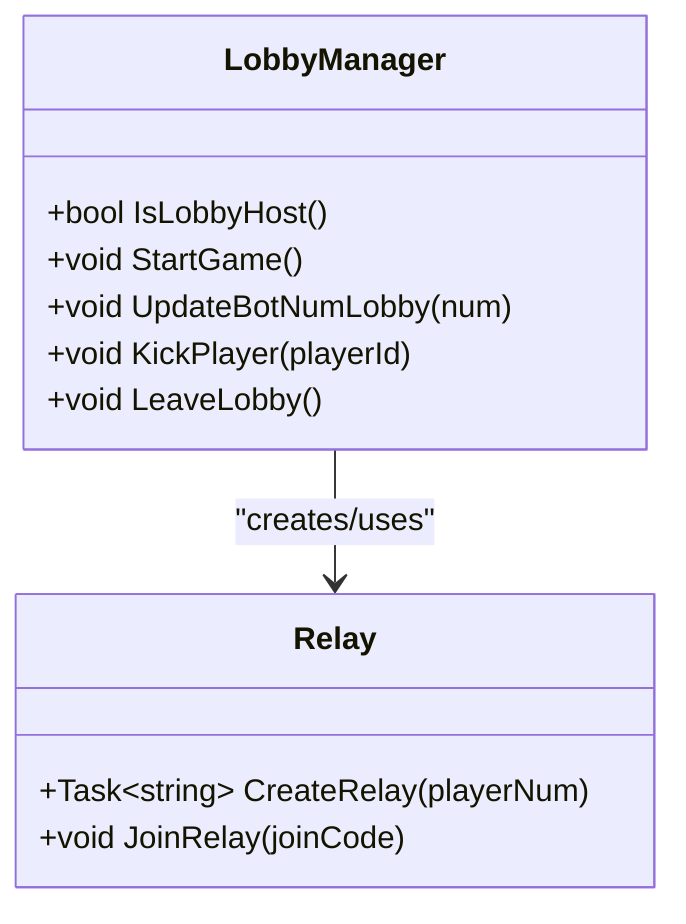
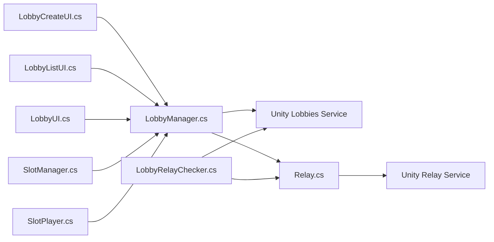

# Lobby Creation & Management

<cite>
**Referenced Files in This Document**
- [LobbyManager.cs](file://Assets/FPS-Game/Scripts/Lobby Script/Lobby/Scripts/LobbyManager.cs)
- [LobbyCreateUI.cs](file://Assets/FPS-Game/Scripts/Lobby Script/Lobby/Scripts/LobbyCreateUI.cs)
- [LobbyListUI.cs](file://Assets/FPS-Game/Scripts/Lobby Script/Lobby/Scripts/LobbyListUI.cs)
- [LobbyUI.cs](file://Assets/FPS-Game/Scripts/Lobby Script/Lobby/Scripts/LobbyUI.cs)
- [SlotManager.cs](file://Assets/FPS-Game/Scripts/Lobby Script/Lobby/Scripts/SlotManager.cs)
- [SlotPlayer.cs](file://Assets/FPS-Game/Scripts/Lobby Script/Lobby/Scripts/SlotPlayer.cs)
- [Relay.cs](file://Assets/FPS-Game/Scripts/Lobby Script/Lobby/Scripts/Relay.cs)
- [LobbyRelayChecker.cs](file://Assets/FPS-Game/Scripts/System/LobbyRelayChecker.cs)
</cite>

## Table of Contents
1. [Introduction](#introduction)
2. [Project Structure](#project-structure)
3. [Core Components](#core-components)
4. [Architecture Overview](#architecture-overview)
5. [Detailed Component Analysis](#detailed-component-analysis)
6. [Dependency Analysis](#dependency-analysis)
7. [Performance Considerations](#performance-considerations)
8. [Troubleshooting Guide](#troubleshooting-guide)
9. [Conclusion](#conclusion)
10. [Appendices](#appendices)

## Introduction
This document explains the lobby creation and management functionality implemented in the project. It covers the lobby creation process, including validation of lobby names, maximum player limits, and privacy settings (private/public). It documents the lobby data model with key-value pairs for player names, optional character selection, start-game signaling, and bot counts. It also details lobby options configuration, practical examples of creating lobbies with different configurations, error handling, host responsibilities, automatic lobby maintenance, and best practices for naming and organization.

## Project Structure
The lobby system spans several scripts under the Lobby Script module and integrates with Relay and scene management utilities:
- UI orchestration: LobbyCreateUI, LobbyListUI, LobbyUI, SlotManager, SlotPlayer
- Backend orchestration: LobbyManager (Unity Lobbies service integration)
- Networking: Relay (Unity Relay integration)
- Connectivity checker: LobbyRelayChecker

**Diagram sources**
- [LobbyCreateUI.cs:1-152](file://Assets/FPS-Game/Scripts/Lobby Script/Lobby/Scripts/LobbyCreateUI.cs#L1-L152)
- [LobbyListUI.cs:1-191](file://Assets/FPS-Game/Scripts/Lobby Script/Lobby/Scripts/LobbyListUI.cs#L1-L191)
- [LobbyUI.cs:1-180](file://Assets/FPS-Game/Scripts/Lobby Script/Lobby/Scripts/LobbyUI.cs#L1-L180)
- [SlotManager.cs:1-136](file://Assets/FPS-Game/Scripts/Lobby Script/Lobby/Scripts/SlotManager.cs#L1-L136)
- [SlotPlayer.cs:1-59](file://Assets/FPS-Game/Scripts/Lobby Script/Lobby/Scripts/SlotPlayer.cs#L1-L59)
- [LobbyManager.cs:1-589](file://Assets/FPS-Game/Scripts/Lobby Script/Lobby/Scripts/LobbyManager.cs#L1-L589)
- [Relay.cs:1-71](file://Assets/FPS-Game/Scripts/Lobby Script/Lobby/Scripts/Relay.cs#L1-L71)
- [LobbyRelayChecker.cs:1-63](file://Assets/FPS-Game/Scripts/System/LobbyRelayChecker.cs#L1-L63)

**Section sources**
- [LobbyCreateUI.cs:1-152](file://Assets/FPS-Game/Scripts/Lobby Script/Lobby/Scripts/LobbyCreateUI.cs#L1-L152)
- [LobbyListUI.cs:1-191](file://Assets/FPS-Game/Scripts/Lobby Script/Lobby/Scripts/LobbyListUI.cs#L1-L191)
- [LobbyUI.cs:1-180](file://Assets/FPS-Game/Scripts/Lobby Script/Lobby/Scripts/LobbyUI.cs#L1-L180)
- [SlotManager.cs:1-136](file://Assets/FPS-Game/Scripts/Lobby Script/Lobby/Scripts/SlotManager.cs#L1-L136)
- [SlotPlayer.cs:1-59](file://Assets/FPS-Game/Scripts/Lobby Script/Lobby/Scripts/SlotPlayer.cs#L1-L59)
- [LobbyManager.cs:1-589](file://Assets/FPS-Game/Scripts/Lobby Script/Lobby/Scripts/LobbyManager.cs#L1-L589)
- [Relay.cs:1-71](file://Assets/FPS-Game/Scripts/Lobby Script/Lobby/Scripts/Relay.cs#L1-L71)
- [LobbyRelayChecker.cs:1-63](file://Assets/FPS-Game/Scripts/System/LobbyRelayChecker.cs#L1-L63)

## Core Components
- LobbyManager: Central coordinator for authentication, lobby lifecycle (create/join/update/leave/kick/start), polling, heartbeats, and integration with Unity Lobbies and Relay.
- UI Components:
  - LobbyCreateUI: Captures lobby name, max players, and privacy toggle; triggers creation.
  - LobbyListUI: Lists open lobbies, refreshes list, and navigates to creation UI.
  - LobbyUI: Displays lobby info, host controls (start game, bot controls), and leave button.
  - SlotManager/SlotPlayer: Renders players and bots in the lobby circle, handles kicking (host only).
- Relay: Creates/Joins Relay allocations and configures Netcode transport.
- LobbyRelayChecker: Periodically checks that all lobby players are connected via Relay.

Key constants and data keys used:
- Player metadata key: Player name stored as a public PlayerDataObject
- Lobby metadata keys:
  - Start signal: Member-visible string carrying Relay join code when started
  - Bot count: Public integer string indicating number of bots to spawn

**Section sources**
- [LobbyManager.cs:17-21](file://Assets/FPS-Game/Scripts/Lobby Script/Lobby/Scripts/LobbyManager.cs#L17-L21)
- [LobbyManager.cs:264-286](file://Assets/FPS-Game/Scripts/Lobby Script/Lobby/Scripts/LobbyManager.cs#L264-L286)
- [LobbyCreateUI.cs:104-127](file://Assets/FPS-Game/Scripts/Lobby Script/Lobby/Scripts/LobbyCreateUI.cs#L104-L127)
- [LobbyListUI.cs:32-47](file://Assets/FPS-Game/Scripts/Lobby Script/Lobby/Scripts/LobbyListUI.cs#L32-L47)
- [LobbyUI.cs:54-83](file://Assets/FPS-Game/Scripts/Lobby Script/Lobby/Scripts/LobbyUI.cs#L54-L83)
- [SlotManager.cs:74-98](file://Assets/FPS-Game/Scripts/Lobby Script/Lobby/Scripts/SlotManager.cs#L74-L98)
- [Relay.cs:26-50](file://Assets/FPS-Game/Scripts/Lobby Script/Lobby/Scripts/Relay.cs#L26-L50)
- [LobbyRelayChecker.cs:19-61](file://Assets/FPS-Game/Scripts/System/LobbyRelayChecker.cs#L19-L61)

## Architecture Overview
The lobby lifecycle is driven by UI events that call into LobbyManager, which interacts with Unity Services (Lobbies and Relay). Host actions (start game, update bot count) propagate changes to the lobby data and trigger scene transitions and Relay joins.

**Diagram sources**
- [LobbyCreateUI.cs:45-50](file://Assets/FPS-Game/Scripts/Lobby Script/Lobby/Scripts/LobbyCreateUI.cs#L45-L50)
- [LobbyManager.cs:264-286](file://Assets/FPS-Game/Scripts/Lobby Script/Lobby/Scripts/LobbyManager.cs#L264-L286)
- [LobbyManager.cs:545-569](file://Assets/FPS-Game/Scripts/Lobby Script/Lobby/Scripts/LobbyManager.cs#L545-L569)
- [Relay.cs:26-50](file://Assets/FPS-Game/Scripts/Lobby Script/Lobby/Scripts/Relay.cs#L26-L50)

## Detailed Component Analysis

### Lobby Creation Workflow
- Inputs validated by UI:
  - Name: Falls back to a default if empty.
  - Max players: Enforced to a bounded range.
  - Privacy: Boolean toggle for private/public.
- Options configured:
  - Player data: Player name as public.
  - Lobby data:
    - Start signal initialized to "0" (member-visible).
    - Bot number initialized to current value (public).
- Creation:
  - Calls Unity LobbyService.CreateLobbyAsync with options.
  - Navigates to lobby room scene and raises join events.

**Diagram sources**
- [LobbyCreateUI.cs:104-127](file://Assets/FPS-Game/Scripts/Lobby Script/Lobby/Scripts/LobbyCreateUI.cs#L104-L127)
- [LobbyManager.cs:264-286](file://Assets/FPS-Game/Scripts/Lobby Script/Lobby/Scripts/LobbyManager.cs#L264-L286)

**Section sources**
- [LobbyCreateUI.cs:104-127](file://Assets/FPS-Game/Scripts/Lobby Script/Lobby/Scripts/LobbyCreateUI.cs#L104-L127)
- [LobbyManager.cs:264-286](file://Assets/FPS-Game/Scripts/Lobby Script/Lobby/Scripts/LobbyManager.cs#L264-L286)

### Lobby Data Model and Keys
- Player data:
  - Key: Player name
  - Visibility: Public
  - Value: String (player’s chosen name)
- Lobby data:
  - Start: Member-visible string; "0" means not started; otherwise carries Relay join code
  - BotNumber: Public integer string; number of bots to spawn
- Optional keys (commented):
  - GameMode: Could be Public
  - Character: Could be Public

**Diagram sources**
- [LobbyManager.cs:17-21](file://Assets/FPS-Game/Scripts/Lobby Script/Lobby/Scripts/LobbyManager.cs#L17-L21)
- [LobbyManager.cs:234-240](file://Assets/FPS-Game/Scripts/Lobby Script/Lobby/Scripts/LobbyManager.cs#L234-L240)
- [LobbyManager.cs:268-277](file://Assets/FPS-Game/Scripts/Lobby Script/Lobby/Scripts/LobbyManager.cs#L268-L277)

**Section sources**
- [LobbyManager.cs:17-21](file://Assets/FPS-Game/Scripts/Lobby Script/Lobby/Scripts/LobbyManager.cs#L17-L21)
- [LobbyManager.cs:234-240](file://Assets/FPS-Game/Scripts/Lobby Script/Lobby/Scripts/LobbyManager.cs#L234-L240)
- [LobbyManager.cs:268-277](file://Assets/FPS-Game/Scripts/Lobby Script/Lobby/Scripts/LobbyManager.cs#L268-L277)

### Host Responsibilities and Controls
- Host-only actions:
  - Start game: Creates Relay allocation, writes join code into lobby data, loads play scene, and joins Relay.
  - Adjust bots: Increase/decrease bot count; enforces minimum zero and capacity limits.
  - Kick players: Removes a selected player from the lobby.
- Non-host members:
  - Cannot see start or bot controls.
  - Observe lobby updates and are notified if removed.

**Diagram sources**
- [LobbyManager.cs:213-216](file://Assets/FPS-Game/Scripts/Lobby Script/Lobby/Scripts/LobbyManager.cs#L213-L216)
- [LobbyManager.cs:545-569](file://Assets/FPS-Game/Scripts/Lobby Script/Lobby/Scripts/LobbyManager.cs#L545-L569)
- [LobbyManager.cs:394-436](file://Assets/FPS-Game/Scripts/Lobby Script/Lobby/Scripts/LobbyManager.cs#L394-L436)
- [LobbyManager.cs:507-520](file://Assets/FPS-Game/Scripts/Lobby Script/Lobby/Scripts/LobbyManager.cs#L507-L520)
- [Relay.cs:26-50](file://Assets/FPS-Game/Scripts/Lobby Script/Lobby/Scripts/Relay.cs#L26-L50)

**Section sources**
- [LobbyManager.cs:213-216](file://Assets/FPS-Game/Scripts/Lobby Script/Lobby/Scripts/LobbyManager.cs#L213-L216)
- [LobbyManager.cs:545-569](file://Assets/FPS-Game/Scripts/Lobby Script/Lobby/Scripts/LobbyManager.cs#L545-L569)
- [LobbyManager.cs:394-436](file://Assets/FPS-Game/Scripts/Lobby Script/Lobby/Scripts/LobbyManager.cs#L394-L436)
- [LobbyManager.cs:507-520](file://Assets/FPS-Game/Scripts/Lobby Script/Lobby/Scripts/LobbyManager.cs#L507-L520)
- [LobbyUI.cs:69-83](file://Assets/FPS-Game/Scripts/Lobby Script/Lobby/Scripts/LobbyUI.cs#L69-L83)

### Lobby Options Configuration
- Player option:
  - Data: Player name as public
- Lobby options:
  - IsPrivate: Controlled by UI toggle
  - Data:
    - Start: Member-visible, initialized to "0"
    - BotNumber: Public, initialized to current value

**Section sources**
- [LobbyManager.cs:268-277](file://Assets/FPS-Game/Scripts/Lobby Script/Lobby/Scripts/LobbyManager.cs#L268-L277)
- [LobbyCreateUI.cs:124-127](file://Assets/FPS-Game/Scripts/Lobby Script/Lobby/Scripts/LobbyCreateUI.cs#L124-L127)

### Practical Examples
- Example 1: Create a small public lobby
  - Name: Non-empty string or default
  - Max players: Within allowed bounds
  - Privacy: Public
  - Outcome: Lobby created; host can later start game and adjust bots
- Example 2: Create a private lobby with bots
  - Name: Non-empty string
  - Max players: Sufficient capacity
  - Privacy: Private
  - Outcome: Only invitees can join; host sets BotNumber and starts game
- Example 3: Adjust bots after joining
  - Host increases/decreases bots; system validates capacity and visibility

Note: Specific code paths are referenced below for each step.

**Section sources**
- [LobbyCreateUI.cs:104-127](file://Assets/FPS-Game/Scripts/Lobby Script/Lobby/Scripts/LobbyCreateUI.cs#L104-L127)
- [LobbyManager.cs:264-286](file://Assets/FPS-Game/Scripts/Lobby Script/Lobby/Scripts/LobbyManager.cs#L264-L286)
- [LobbyManager.cs:394-436](file://Assets/FPS-Game/Scripts/Lobby Script/Lobby/Scripts/LobbyManager.cs#L394-L436)

### Error Handling and Edge Cases
- Access errors:
  - Private lobby becomes inaccessible: Manager detects and redirects to lobby list
- Capacity errors:
  - Attempting to exceed max players or reduce bots below zero: ignored with logs
- Null lobby:
  - Polling handles null references gracefully
- Authentication:
  - Anonymous sign-in profile set to player name before initializing services

**Section sources**
- [LobbyManager.cs:186-204](file://Assets/FPS-Game/Scripts/Lobby Script/Lobby/Scripts/LobbyManager.cs#L186-L204)
- [LobbyManager.cs:399-409](file://Assets/FPS-Game/Scripts/Lobby Script/Lobby/Scripts/LobbyManager.cs#L399-L409)
- [LobbyManager.cs:86-104](file://Assets/FPS-Game/Scripts/Lobby Script/Lobby/Scripts/LobbyManager.cs#L86-L104)

### Automatic Maintenance and Cleanup
- Heartbeat ping: Host periodically sends heartbeat to keep lobby alive
- Polling: Regularly fetches lobby details; detects kicks and start signals
- Auto-refresh: Periodic refresh of lobby list when signed in
- Leaving lobby: Host ensures bot count is reset to zero before leaving

**Section sources**
- [LobbyManager.cs:122-136](file://Assets/FPS-Game/Scripts/Lobby Script/Lobby/Scripts/LobbyManager.cs#L122-L136)
- [LobbyManager.cs:138-205](file://Assets/FPS-Game/Scripts/Lobby Script/Lobby/Scripts/LobbyManager.cs#L138-L205)
- [LobbyManager.cs:288-319](file://Assets/FPS-Game/Scripts/Lobby Script/Lobby/Scripts/LobbyManager.cs#L288-L319)
- [LobbyManager.cs:485-505](file://Assets/FPS-Game/Scripts/Lobby Script/Lobby/Scripts/LobbyManager.cs#L485-L505)

### Best Practices for Naming and Organization
- Choose descriptive, concise lobby names; fallback defaults ensure usability
- Keep max players reasonable for intended gameplay
- Prefer public lobbies for discoverability; use private for invites
- Use bots sparingly and communicate clearly to avoid confusion
- Keep lobby list refreshed and clean up inactive lobbies

[No sources needed since this section provides general guidance]

## Dependency Analysis

**Diagram sources**
- [LobbyCreateUI.cs:45-50](file://Assets/FPS-Game/Scripts/Lobby Script/Lobby/Scripts/LobbyCreateUI.cs#L45-L50)
- [LobbyListUI.cs:32-47](file://Assets/FPS-Game/Scripts/Lobby Script/Lobby/Scripts/LobbyListUI.cs#L32-L47)
- [LobbyUI.cs:54-83](file://Assets/FPS-Game/Scripts/Lobby Script/Lobby/Scripts/LobbyUI.cs#L54-L83)
- [SlotManager.cs:24-30](file://Assets/FPS-Game/Scripts/Lobby Script/Lobby/Scripts/SlotManager.cs#L24-L30)
- [SlotPlayer.cs:24-27](file://Assets/FPS-Game/Scripts/Lobby Script/Lobby/Scripts/SlotPlayer.cs#L24-L27)
- [LobbyManager.cs:1-12](file://Assets/FPS-Game/Scripts/Lobby Script/Lobby/Scripts/LobbyManager.cs#L1-L12)
- [Relay.cs:1-24](file://Assets/FPS-Game/Scripts/Lobby Script/Lobby/Scripts/Relay.cs#L1-L24)
- [LobbyRelayChecker.cs:1-23](file://Assets/FPS-Game/Scripts/System/LobbyRelayChecker.cs#L1-L23)

**Section sources**
- [LobbyManager.cs:1-12](file://Assets/FPS-Game/Scripts/Lobby Script/Lobby/Scripts/LobbyManager.cs#L1-L12)
- [Relay.cs:1-24](file://Assets/FPS-Game/Scripts/Lobby Script/Lobby/Scripts/Relay.cs#L1-L24)
- [LobbyRelayChecker.cs:1-23](file://Assets/FPS-Game/Scripts/System/LobbyRelayChecker.cs#L1-L23)

## Performance Considerations
- Polling intervals: Adjust timers to balance responsiveness and server load
- Heartbeat interval: Keep within recommended thresholds to avoid churn
- Capacity checks: Validate before updating to minimize failed requests
- Scene transitions: Defer heavy work until after scene load to maintain smooth UX

[No sources needed since this section provides general guidance]

## Troubleshooting Guide
Common issues and resolutions:
- Cannot join a lobby:
  - Verify lobby is not private or you have the correct code
  - Check for exceptions indicating private lobby changes
- Lobby disappears or becomes inaccessible:
  - Manager automatically redirects to lobby list upon detection
- Start game fails:
  - Ensure host has permissions and Relay allocation succeeds
  - Confirm lobby data reflects a non-zero start value
- Bot adjustments rejected:
  - Ensure total players (bots included) do not exceed MaxPlayers
  - Ensure BotNumber does not drop below zero

**Section sources**
- [LobbyManager.cs:186-204](file://Assets/FPS-Game/Scripts/Lobby Script/Lobby/Scripts/LobbyManager.cs#L186-L204)
- [LobbyManager.cs:545-569](file://Assets/FPS-Game/Scripts/Lobby Script/Lobby/Scripts/LobbyManager.cs#L545-L569)
- [LobbyManager.cs:399-409](file://Assets/FPS-Game/Scripts/Lobby Script/Lobby/Scripts/LobbyManager.cs#L399-L409)
- [LobbyManager.cs:485-505](file://Assets/FPS-Game/Scripts/Lobby Script/Lobby/Scripts/LobbyManager.cs#L485-L505)

## Conclusion
The lobby system provides a robust foundation for creating, organizing, and managing multiplayer sessions. It supports essential features such as privacy controls, capacity management, bot integration, and seamless transitions to gameplay via Relay. By following the documented workflows, validations, and best practices, developers can build reliable and user-friendly lobby experiences.

[No sources needed since this section summarizes without analyzing specific files]

## Appendices

### UI-to-Logic Interaction Summary
- LobbyCreateUI captures inputs and delegates to LobbyManager.CreateLobby
- LobbyListUI lists open lobbies and routes to creation UI
- LobbyUI exposes host controls and displays lobby state
- SlotManager renders players and bots and manages host-only actions

**Section sources**
- [LobbyCreateUI.cs:45-50](file://Assets/FPS-Game/Scripts/Lobby Script/Lobby/Scripts/LobbyCreateUI.cs#L45-L50)
- [LobbyListUI.cs:32-47](file://Assets/FPS-Game/Scripts/Lobby Script/Lobby/Scripts/LobbyListUI.cs#L32-L47)
- [LobbyUI.cs:54-83](file://Assets/FPS-Game/Scripts/Lobby Script/Lobby/Scripts/LobbyUI.cs#L54-L83)
- [SlotManager.cs:54-100](file://Assets/FPS-Game/Scripts/Lobby Script/Lobby/Scripts/SlotManager.cs#L54-L100)