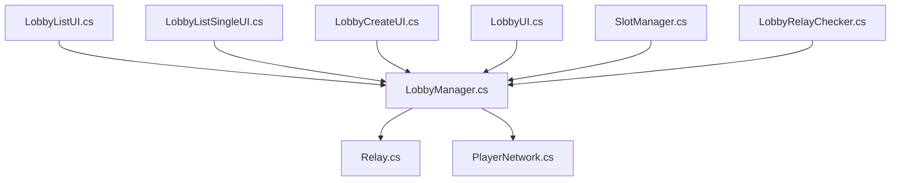
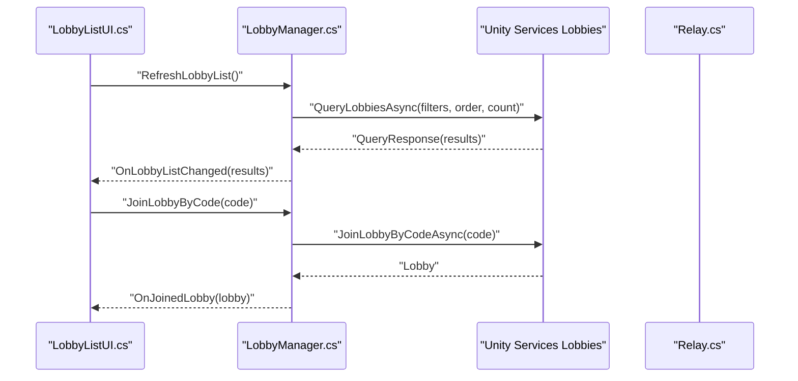
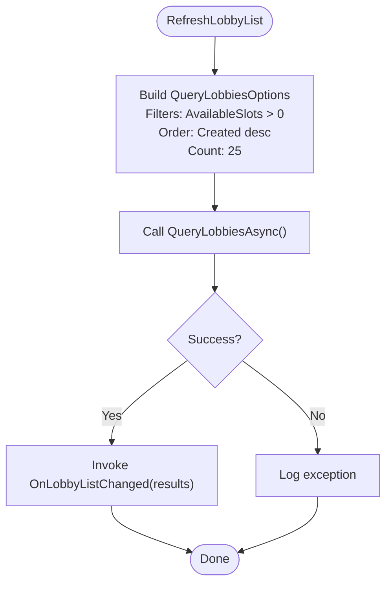
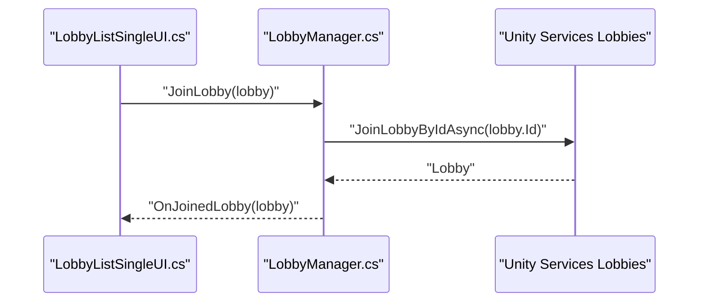
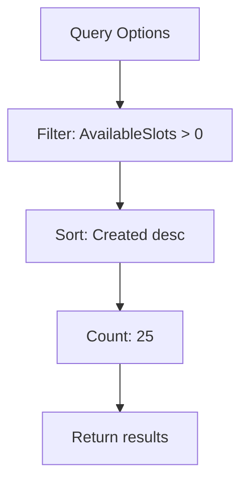
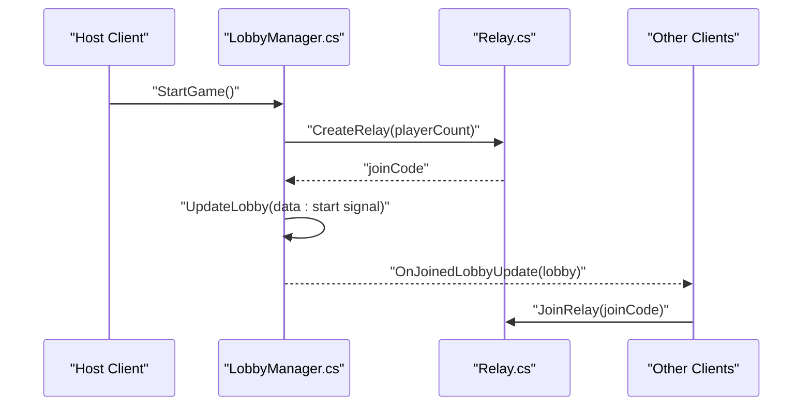
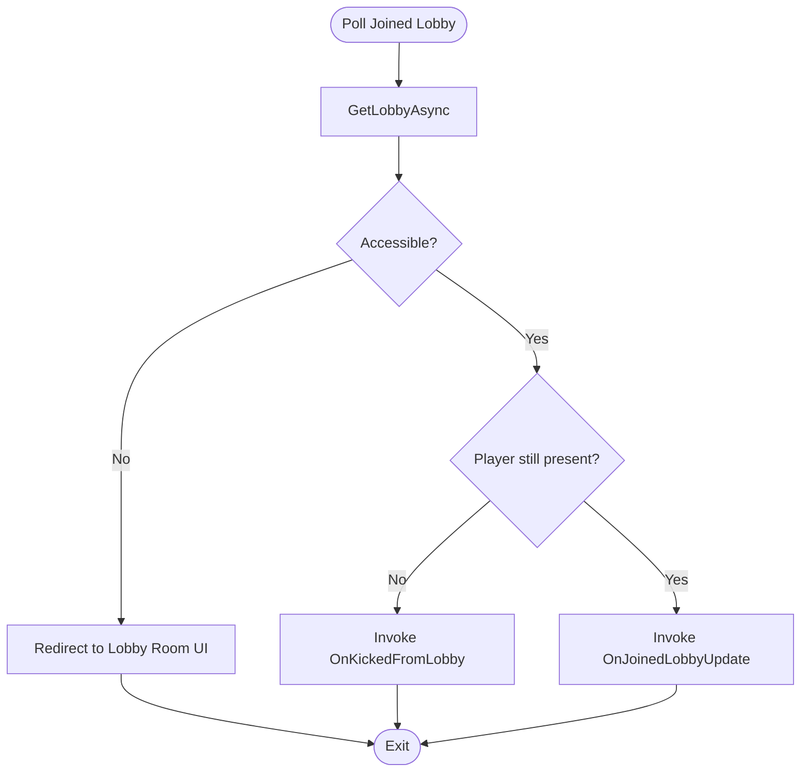
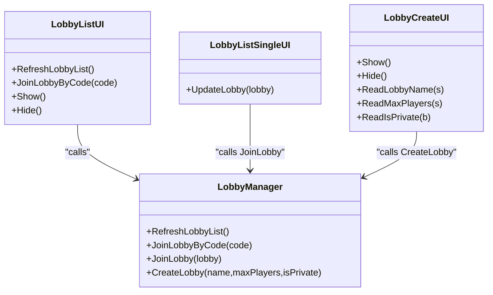
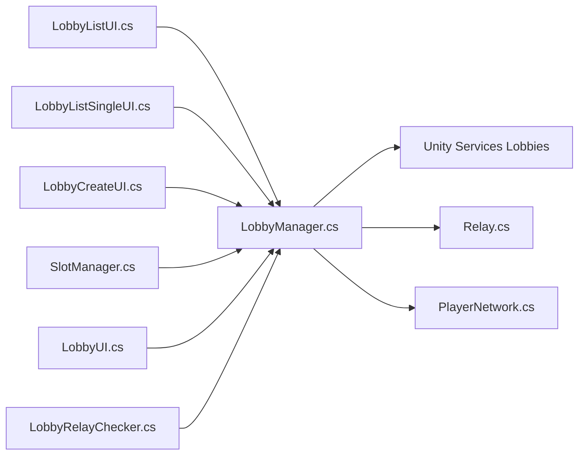

# Lobby Discovery & Joining

<cite>
**Referenced Files in This Document**
- [LobbyManager.cs](file://Assets/FPS-Game/Scripts/Lobby%20Script/Lobby/Scripts/LobbyManager.cs)
- [LobbyListUI.cs](file://Assets/FPS-Game/Scripts/Lobby%20Script/Lobby/Scripts/LobbyListUI.cs)
- [LobbyListSingleUI.cs](file://Assets/FPS-Game/Scripts/Lobby%20Script/Lobby/Scripts/LobbyListSingleUI.cs)
- [LobbyCreateUI.cs](file://Assets/FPS-Game/Scripts/Lobby%20Script/Lobby/Scripts/LobbyCreateUI.cs)
- [LobbyUI.cs](file://Assets/FPS-Game/Scripts/Lobby%20Script/Lobby/Scripts/LobbyUI.cs)
- [SlotManager.cs](file://Assets/FPS-Game/Scripts/Lobby%20Script/Lobby/Scripts/SlotManager.cs)
- [Relay.cs](file://Assets/FPS-Game/Scripts/Lobby%20Script/Lobby/Scripts/Relay.cs)
- [LobbyRelayChecker.cs](file://Assets/FPS-Game/Scripts/System/LobbyRelayChecker.cs)
- [PlayerNetwork.cs](file://Assets/FPS-Game/Scripts/Player/PlayerNetwork.cs)
</cite>

## Table of Contents
1. [Introduction](#introduction)
2. [Project Structure](#project-structure)
3. [Core Components](#core-components)
4. [Architecture Overview](#architecture-overview)
5. [Detailed Component Analysis](#detailed-component-analysis)
6. [Dependency Analysis](#dependency-analysis)
7. [Performance Considerations](#performance-considerations)
8. [Troubleshooting Guide](#troubleshooting-guide)
9. [Conclusion](#conclusion)
10. [Appendices](#appendices)

## Introduction
This document explains the lobby discovery and joining mechanisms implemented in the project. It covers how lobbies are listed, filtered, sorted, and paginated; how players join via lobby code, direct selection, or programmatic actions; and how the system handles join permissions, private lobbies, full lobbies, and join failures. It also provides guidance on optimizing discovery, caching strategies, and designing user-friendly lobby browser interfaces.

## Project Structure
The lobby system spans several scripts under the Lobby Script module and integrates with Relay and player networking systems:
- Lobby discovery and management: LobbyManager
- UI for listing and selecting lobbies: LobbyListUI, LobbyListSingleUI
- UI for creating lobbies: LobbyCreateUI
- UI for the joined lobby room: LobbyUI, SlotManager
- Relay hosting/joining: Relay
- Relay connection verification: LobbyRelayChecker
- Player networking and lobby-aware behavior: PlayerNetwork

**Diagram sources**
- [LobbyManager.cs](file://Assets/FPS-Game/Scripts/Lobby%20Script/Lobby/Scripts/LobbyManager.cs)
- [LobbyListUI.cs](file://Assets/FPS-Game/Scripts/Lobby%20Script/Lobby/Scripts/LobbyListUI.cs)
- [LobbyListSingleUI.cs](file://Assets/FPS-Game/Scripts/Lobby%20Script/Lobby/Scripts/LobbyListSingleUI.cs)
- [LobbyCreateUI.cs](file://Assets/FPS-Game/Scripts/Lobby%20Script/Lobby/Scripts/LobbyCreateUI.cs)
- [LobbyUI.cs](file://Assets/FPS-Game/Scripts/Lobby%20Script/Lobby/Scripts/LobbyUI.cs)
- [SlotManager.cs](file://Assets/FPS-Game/Scripts/Lobby%20Script/Lobby/Scripts/SlotManager.cs)
- [Relay.cs](file://Assets/FPS-Game/Scripts/Lobby%20Script/Lobby/Scripts/Relay.cs)
- [LobbyRelayChecker.cs](file://Assets/FPS-Game/Scripts/System/LobbyRelayChecker.cs)
- [PlayerNetwork.cs](file://Assets/FPS-Game/Scripts/Player/PlayerNetwork.cs)

**Section sources**
- [LobbyManager.cs](file://Assets/FPS-Game/Scripts/Lobby%20Script/Lobby/Scripts/LobbyManager.cs)
- [LobbyListUI.cs](file://Assets/FPS-Game/Scripts/Lobby%20Script/Lobby/Scripts/LobbyListUI.cs)
- [LobbyListSingleUI.cs](file://Assets/FPS-Game/Scripts/Lobby%20Script/Lobby/Scripts/LobbyListSingleUI.cs)
- [LobbyCreateUI.cs](file://Assets/FPS-Game/Scripts/Lobby%20Script/Lobby/Scripts/LobbyCreateUI.cs)
- [LobbyUI.cs](file://Assets/FPS-Game/Scripts/Lobby%20Script/Lobby/Scripts/LobbyUI.cs)
- [SlotManager.cs](file://Assets/FPS-Game/Scripts/Lobby%20Script/Lobby/Scripts/SlotManager.cs)
- [Relay.cs](file://Assets/FPS-Game/Scripts/Lobby%20Script/Lobby/Scripts/Relay.cs)
- [LobbyRelayChecker.cs](file://Assets/FPS-Game/Scripts/System/LobbyRelayChecker.cs)
- [PlayerNetwork.cs](file://Assets/FPS-Game/Scripts/Player/PlayerNetwork.cs)

## Core Components
- LobbyManager: Central orchestrator for authentication, lobby lifecycle, listing, joining, polling, and game start signaling via Relay.
- LobbyListUI: Renders the lobby browser, triggers refresh, and handles code-based join.
- LobbyListSingleUI: Individual row renderer for a lobby with join action.
- LobbyCreateUI: Collects parameters to create a new lobby.
- LobbyUI and SlotManager: Joined lobby UI and player/slot management.
- Relay: Creates/Joins Relay allocations and configures NetworkManager transport.
- LobbyRelayChecker: Periodically verifies all players have connected to the Relay.
- PlayerNetwork: Integrates lobby data with runtime networking.

Key responsibilities:
- Discovery: Query open lobbies with AvailableSlots filter, sort by Created descending, and cap count.
- Joining: By code, by direct selection, or programmatic join.
- Filtering: Only show open lobbies with available slots.
- Permissions: Host-only controls (start game, kick, bot adjustments).
- Failure handling: Private lobby errors, accessibility changes, and re-entry to UI.

**Section sources**
- [LobbyManager.cs](file://Assets/FPS-Game/Scripts/Lobby%20Script/Lobby/Scripts/LobbyManager.cs)
- [LobbyListUI.cs](file://Assets/FPS-Game/Scripts/Lobby%20Script/Lobby/Scripts/LobbyListUI.cs)
- [LobbyListSingleUI.cs](file://Assets/FPS-Game/Scripts/Lobby%20Script/Lobby/Scripts/LobbyListSingleUI.cs)
- [LobbyCreateUI.cs](file://Assets/FPS-Game/Scripts/Lobby%20Script/Lobby/Scripts/LobbyCreateUI.cs)
- [LobbyUI.cs](file://Assets/FPS-Game/Scripts/Lobby%20Script/Lobby/Scripts/LobbyUI.cs)
- [SlotManager.cs](file://Assets/FPS-Game/Scripts/Lobby%20Script/Lobby/Scripts/SlotManager.cs)
- [Relay.cs](file://Assets/FPS-Game/Scripts/Lobby%20Script/Lobby/Scripts/Relay.cs)
- [LobbyRelayChecker.cs](file://Assets/FPS-Game/Scripts/System/LobbyRelayChecker.cs)
- [PlayerNetwork.cs](file://Assets/FPS-Game/Scripts/Player/PlayerNetwork.cs)

## Architecture Overview
The lobby discovery and joining pipeline connects UI, manager, Unity Services, and Relay.

**Diagram sources**
- [LobbyListUI.cs](file://Assets/FPS-Game/Scripts/Lobby%20Script/Lobby/Scripts/LobbyListUI.cs)
- [LobbyManager.cs](file://Assets/FPS-Game/Scripts/Lobby%20Script/Lobby/Scripts/LobbyManager.cs)

## Detailed Component Analysis

### Lobby Listing and Discovery
- Query filters:
  - Filters for open lobbies only: AvailableSlots > 0.
- Sorting:
  - Order by Created descending to show newest lobbies first.
- Pagination:
  - Count set to 25 per page; auto-refresh loop runs periodically.

**Diagram sources**
- [LobbyManager.cs](file://Assets/FPS-Game/Scripts/Lobby%20Script/Lobby/Scripts/LobbyManager.cs)

**Section sources**
- [LobbyManager.cs](file://Assets/FPS-Game/Scripts/Lobby%20Script/Lobby/Scripts/LobbyManager.cs)

### Joining Mechanisms
- By lobby code:
  - UI captures code and delegates to LobbyManager.JoinLobbyByCode.
- By direct selection:
  - Each row exposes a join button; clicking invokes LobbyManager.JoinLobby(lobby).
- Programmatic joining:
  - Called internally after successful query or when a user selects a lobby row.

**Diagram sources**
- [LobbyListSingleUI.cs](file://Assets/FPS-Game/Scripts/Lobby%20Script/Lobby/Scripts/LobbyListSingleUI.cs)
- [LobbyManager.cs](file://Assets/FPS-Game/Scripts/Lobby%20Script/Lobby/Scripts/LobbyManager.cs)

**Section sources**
- [LobbyListSingleUI.cs](file://Assets/FPS-Game/Scripts/Lobby%20Script/Lobby/Scripts/LobbyListSingleUI.cs)
- [LobbyManager.cs](file://Assets/FPS-Game/Scripts/Lobby%20Script/Lobby/Scripts/LobbyManager.cs)

### Filtering Logic for Open Lobbies with Available Slots
- The query explicitly filters to exclude full lobbies by requiring AvailableSlots > 0.
- This ensures the UI only displays lobbies suitable for immediate joining.

**Diagram sources**
- [LobbyManager.cs](file://Assets/FPS-Game/Scripts/Lobby%20Script/Lobby/Scripts/LobbyManager.cs)

**Section sources**
- [LobbyManager.cs](file://Assets/FPS-Game/Scripts/Lobby%20Script/Lobby/Scripts/LobbyManager.cs)

### Handling Join Requests and Permissions
- Host-only controls:
  - Start game, kick players, adjust bot count.
- Join flow:
  - After successful join, UI navigates to the lobby room scene and updates the joined lobby state.
- Polling and heartbeat:
  - Host pings heartbeat periodically.
  - Clients poll the lobby to detect kicks, updates, and start signals.

**Diagram sources**
- [LobbyManager.cs](file://Assets/FPS-Game/Scripts/Lobby%20Script/Lobby/Scripts/LobbyManager.cs)
- [Relay.cs](file://Assets/FPS-Game/Scripts/Lobby%20Script/Lobby/Scripts/Relay.cs)

**Section sources**
- [LobbyManager.cs](file://Assets/FPS-Game/Scripts/Lobby%20Script/Lobby/Scripts/LobbyManager.cs)
- [LobbyUI.cs](file://Assets/FPS-Game/Scripts/Lobby%20Script/Lobby/Scripts/LobbyUI.cs)
- [SlotManager.cs](file://Assets/FPS-Game/Scripts/Lobby%20Script/Lobby/Scripts/SlotManager.cs)
- [Relay.cs](file://Assets/FPS-Game/Scripts/Lobby%20Script/Lobby/Scripts/Relay.cs)

### Managing Join Failures and Private Lobbies
- Private/Inaccessible Lobbies:
  - When a lobby becomes private or otherwise inaccessible, polling catches a specific error and redirects the client back to the lobby list.
- Full Lobbies:
  - Discovery filters prevent listing full lobbies; attempting to join a full lobby would fail at the service level and surface as a failure to the caller.

**Diagram sources**
- [LobbyManager.cs](file://Assets/FPS-Game/Scripts/Lobby%20Script/Lobby/Scripts/LobbyManager.cs)

**Section sources**
- [LobbyManager.cs](file://Assets/FPS-Game/Scripts/Lobby%20Script/Lobby/Scripts/LobbyManager.cs)

### Practical Examples: Implementing a Lobby Browser
- Bind refresh button to trigger RefreshLobbyList.
- Render rows with LobbyListSingleUI; each row binds to JoinLobby(lobby).
- Support code-based join via an input field and JoinLobbyByCode.
- Update UI counters to reflect current players and bots.

**Diagram sources**
- [LobbyListUI.cs](file://Assets/FPS-Game/Scripts/Lobby%20Script/Lobby/Scripts/LobbyListUI.cs)
- [LobbyListSingleUI.cs](file://Assets/FPS-Game/Scripts/Lobby%20Script/Lobby/Scripts/LobbyListSingleUI.cs)
- [LobbyCreateUI.cs](file://Assets/FPS-Game/Scripts/Lobby%20Script/Lobby/Scripts/LobbyCreateUI.cs)
- [LobbyManager.cs](file://Assets/FPS-Game/Scripts/Lobby%20Script/Lobby/Scripts/LobbyManager.cs)

**Section sources**
- [LobbyListUI.cs](file://Assets/FPS-Game/Scripts/Lobby%20Script/Lobby/Scripts/LobbyListUI.cs)
- [LobbyListSingleUI.cs](file://Assets/FPS-Game/Scripts/Lobby%20Script/Lobby/Scripts/LobbyListSingleUI.cs)
- [LobbyCreateUI.cs](file://Assets/FPS-Game/Scripts/Lobby%20Script/Lobby/Scripts/LobbyCreateUI.cs)
- [LobbyManager.cs](file://Assets/FPS-Game/Scripts/Lobby%20Script/Lobby/Scripts/LobbyManager.cs)

## Dependency Analysis
- UI depends on LobbyManager events and methods.
- LobbyManager depends on Unity Services (Lobbies, Authentication) and Relay.
- SlotManager and LobbyUI depend on LobbyManager’s joined lobby state and events.
- Relay integrates with NetworkManager transport and Unity Transport.
- PlayerNetwork reads lobby data to map player identities server-side.

**Diagram sources**
- [LobbyListUI.cs](file://Assets/FPS-Game/Scripts/Lobby%20Script/Lobby/Scripts/LobbyListUI.cs)
- [LobbyListSingleUI.cs](file://Assets/FPS-Game/Scripts/Lobby%20Script/Lobby/Scripts/LobbyListSingleUI.cs)
- [LobbyCreateUI.cs](file://Assets/FPS-Game/Scripts/Lobby%20Script/Lobby/Scripts/LobbyCreateUI.cs)
- [LobbyManager.cs](file://Assets/FPS-Game/Scripts/Lobby%20Script/Lobby/Scripts/LobbyManager.cs)
- [SlotManager.cs](file://Assets/FPS-Game/Scripts/Lobby%20Script/Lobby/Scripts/SlotManager.cs)
- [LobbyUI.cs](file://Assets/FPS-Game/Scripts/Lobby%20Script/Lobby/Scripts/LobbyUI.cs)
- [Relay.cs](file://Assets/FPS-Game/Scripts/Lobby%20Script/Lobby/Scripts/Relay.cs)
- [LobbyRelayChecker.cs](file://Assets/FPS-Game/Scripts/System/LobbyRelayChecker.cs)
- [PlayerNetwork.cs](file://Assets/FPS-Game/Scripts/Player/PlayerNetwork.cs)

**Section sources**
- [LobbyManager.cs](file://Assets/FPS-Game/Scripts/Lobby%20Script/Lobby/Scripts/LobbyManager.cs)
- [LobbyListUI.cs](file://Assets/FPS-Game/Scripts/Lobby%20Script/Lobby/Scripts/LobbyListUI.cs)
- [LobbyListSingleUI.cs](file://Assets/FPS-Game/Scripts/Lobby%20Script/Lobby/Scripts/LobbyListSingleUI.cs)
- [LobbyCreateUI.cs](file://Assets/FPS-Game/Scripts/Lobby%20Script/Lobby/Scripts/LobbyCreateUI.cs)
- [LobbyUI.cs](file://Assets/FPS-Game/Scripts/Lobby%20Script/Lobby/Scripts/LobbyUI.cs)
- [SlotManager.cs](file://Assets/FPS-Game/Scripts/Lobby%20Script/Lobby/Scripts/SlotManager.cs)
- [Relay.cs](file://Assets/FPS-Game/Scripts/Lobby%20Script/Lobby/Scripts/Relay.cs)
- [LobbyRelayChecker.cs](file://Assets/FPS-Game/Scripts/System/LobbyRelayChecker.cs)
- [PlayerNetwork.cs](file://Assets/FPS-Game/Scripts/Player/PlayerNetwork.cs)

## Performance Considerations
- Discovery optimization:
  - Keep Count reasonable (currently 25) to balance freshness and bandwidth.
  - Debounce manual refresh actions in UI to avoid rapid repeated queries.
- Filtering and sorting:
  - Server-side filters and sorts reduce client-side work; keep filters minimal and precise.
- Polling and heartbeat:
  - Tune intervals (current heartbeat ~25s, polling ~1.5s) to balance responsiveness and cost.
- UI rendering:
  - Reuse row templates and destroy old entries efficiently to minimize GC pressure.
- Caching:
  - Cache recent lobby lists per session; invalidate on explicit refresh or join events.
  - Avoid redundant refreshes during short time windows after joins or creates.
- Network reliability:
  - Retry transient failures gracefully; surface user-friendly messages for persistent errors.

[No sources needed since this section provides general guidance]

## Troubleshooting Guide
Common scenarios and resolutions:
- Join fails due to private lobby:
  - The system detects a private/inaccessible state and returns the client to the lobby list UI.
- Full lobby:
  - Discovery filters prevent listing full lobbies; if a lobby appears full, it is intentionally excluded from the list.
- Kicked or removed:
  - Polling detects absence from the lobby and triggers a kick event; UI returns to the lobby list.
- Start game timing:
  - Only hosts can start the game; clients wait for the start signal and join the Relay accordingly.

Operational tips:
- Verify authentication state before refreshing lists.
- Ensure UI event handlers are attached and detached properly to avoid leaks.
- Monitor logs for lobby exceptions and relay errors.

**Section sources**
- [LobbyManager.cs](file://Assets/FPS-Game/Scripts/Lobby%20Script/Lobby/Scripts/LobbyManager.cs)
- [LobbyListUI.cs](file://Assets/FPS-Game/Scripts/Lobby%20Script/Lobby/Scripts/LobbyListUI.cs)
- [SlotManager.cs](file://Assets/FPS-Game/Scripts/Lobby%20Script/Lobby/Scripts/SlotManager.cs)

## Conclusion
The lobby discovery and joining system centers on a robust query pipeline that filters and sorts lobbies, a flexible join mechanism supporting code-based and direct selection, and a reliable polling model for updates and game start signaling. With host-only controls and clear failure handling, the system provides a solid foundation for building responsive and user-friendly lobby browsing experiences.

[No sources needed since this section summarizes without analyzing specific files]

## Appendices

### Best Practices for Lobby Browsing Interfaces
- Always pre-filter to show only open lobbies with available slots.
- Paginate and throttle refreshes; offer manual refresh with feedback.
- Provide clear join buttons per row and a secondary code-entry option.
- Show accurate player counts including bots and max capacity.
- Offer quick actions (create, refresh) and safe exits (leave, quit) with appropriate prompts.

[No sources needed since this section provides general guidance]