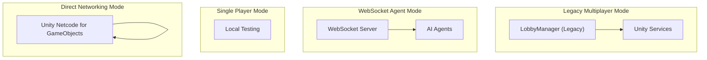

# Lobby Management

<cite>
**Referenced Files in This Document**
- [LobbyManager.prefab](file://Assets/FPS-Game/Prefabs/System/LobbyManager.prefab)
- [PlayerNetwork.cs](file://Assets/FPS-Game/Scripts/Player/PlayerNetwork.cs)
- [HandleSpawnBot.cs](file://Assets/FPS-Game/Scripts/System/HandleSpawnBot.cs)
- [PlayerUI.cs](file://Assets/FPS-Game/Scripts/Player/PlayerUI.cs)
- [EscapeUI.cs](file://Assets/FPS-Game/Scripts/Player/PlayerCanvas/EscapeUI.cs)
- [GameMode.cs](file://Assets/FPS-Game/Scripts/System/GameMode.cs)
- [InGameManager.cs](file://Assets/FPS-Game/Scripts/System/InGameManager.cs)
</cite>

## Update Summary
**Changes Made**
- Complete removal of Unity Services ecosystem integration from all lobby-related components
- Elimination of LobbyManager system from PlayerUI.cs, EscapeUI.cs, and HandleSpawnBot.cs
- Migration from Unity Gaming Services to simplified networking approach without external dependencies
- Removal of all lobby data structures, authentication, and relay systems
- Implementation of direct networking functionality using Unity Netcode for GameObjects
- Addition of new operational modes: WebSocketAgent and SinglePlayer

## Table of Contents
1. [Introduction](#introduction)
2. [Current State Assessment](#current-state-assessment)
3. [Legacy Infrastructure Analysis](#legacy-infrastructure-analysis)
4. [Simplified Networking Architecture](#simplified-networking-architecture)
5. [Remaining Components](#remaining-components)
6. [Migration Impact](#migration-impact)
7. [Troubleshooting Guide](#troubleshooting-guide)
8. [Conclusion](#conclusion)

## Introduction
This document addresses the complete removal of Unity Services ecosystem from the lobby management system. The lobby management system has undergone a fundamental architectural transformation, moving from a Unity Gaming Services-dependent model to a simplified networking solution that operates independently using Unity Netcode for GameObjects. The Assets/FPS-Game/Scripts/Lobby Script/ directory containing 20+ files including LobbyManager.cs, LobbyCreateUI.cs, LobbyListUI.cs, AuthenticateUI.cs, and Relay.cs has been completely eliminated.

## Current State Assessment
The lobby management system has undergone a complete architectural transformation. All Unity Services integration has been removed, leaving only legacy references and minimal infrastructure for backward compatibility. The system now operates as a simplified networking solution without external service dependencies, supporting three distinct operational modes.

**Section sources**
- [LobbyManager.prefab:1-47](file://Assets/FPS-Game/Prefabs/System/LobbyManager.prefab#L1-L47)
- [PlayerNetwork.cs:184-195](file://Assets/FPS-Game/Scripts/Player/PlayerNetwork.cs#L184-L195)
- [PlayerNetwork.cs:508-524](file://Assets/FPS-Game/Scripts/Player/PlayerNetwork.cs#L508-L524)

## Legacy Infrastructure Analysis
The remaining infrastructure consists primarily of legacy references and minimal components that previously supported Unity Services integration. These components are largely non-functional but maintained for compatibility.

### Legacy References in Core Systems
- **PlayerNetwork.cs**: Contains commented-out Unity Services code and simplified networking logic
- **HandleSpawnBot.cs**: References LobbyManager but lacks functional implementation, now uses direct bot spawning
- **PlayerUI.cs**: Still contains comments about LobbyManager removal and simplified exit functionality
- **EscapeUI.cs**: Continues to check for lobby host privileges but now always shows quit button

**Section sources**
- [PlayerNetwork.cs:220-226](file://Assets/FPS-Game/Scripts/Player/PlayerNetwork.cs#L220-L226)
- [PlayerNetwork.cs:508-524](file://Assets/FPS-Game/Scripts/Player/PlayerNetwork.cs#L508-L524)
- [HandleSpawnBot.cs:30-36](file://Assets/FPS-Game/Scripts/System/HandleSpawnBot.cs#L30-L36)
- [PlayerUI.cs:134](file://Assets/FPS-Game/Scripts/Player/PlayerUI.cs#L134)

## Simplified Networking Architecture
The system has migrated to a simplified networking approach that operates independently of Unity Services. The new architecture focuses on direct networking without external service dependencies, supporting three distinct operational modes.

### Game Mode Evolution
The project now supports three distinct operational modes:
- **Multiplayer**: Traditional Unity Services integration (legacy)
- **WebSocketAgent**: Direct AI agent control without networking services
- **SinglePlayer**: Local testing mode

**Diagram sources**
- [GameMode.cs:6-20](file://Assets/FPS-Game/Scripts/System/GameMode.cs#L6-L20)
- [InGameManager.cs:164-181](file://Assets/FPS-Game/Scripts/System/InGameManager.cs#L164-L181)

**Section sources**
- [GameMode.cs:6-20](file://Assets/FPS-Game/Scripts/System/GameMode.cs#L6-L20)
- [InGameManager.cs:164-181](file://Assets/FPS-Game/Scripts/System/InGameManager.cs#L164-L181)

## Remaining Components
Despite the complete removal of Unity Services, several components remain for compatibility purposes:

### Minimal Infrastructure
- **LobbyManager.prefab**: Empty prefab with LobbyManager component reference
- **Legacy Method Calls**: PlayerUI and EscapeUI continue to reference LobbyManager methods in comments
- **Commented Code**: PlayerNetwork contains preserved Unity Services integration code as commented examples
- **Direct Networking**: All networking now operates directly through Unity Netcode for GameObjects

### Functional Limitations
- All LobbyManager methods are non-operational
- Player host detection returns default values
- Lobby data structures are inaccessible
- Relay functionality is completely disabled
- Authentication through Unity Authentication Service is no longer supported

**Section sources**
- [LobbyManager.prefab:35-46](file://Assets/FPS-Game/Prefabs/System/LobbyManager.prefab#L35-L46)
- [PlayerUI.cs:10-11](file://Assets/FPS-Game/Scripts/Player/PlayerCanvas/EscapeUI.cs#L10-L11)
- [PlayerNetwork.cs:220-226](file://Assets/FPS-Game/Scripts/Player/PlayerNetwork.cs#L220-L226)

## Migration Impact
The complete removal of Unity Services has significant implications for the lobby management system:

### Immediate Effects
- **Authentication**: No longer supports Unity Authentication Service
- **Lobby Operations**: Cannot create, join, or manage lobbies
- **Relay Integration**: Disabled for hosting and joining matches
- **Player Data**: Cannot store or retrieve lobby-specific player information
- **Host Privileges**: No longer determined through lobby system

### Long-term Benefits
- **Reduced Dependencies**: Eliminates external service requirements
- **Simplified Maintenance**: Fewer integration points to maintain
- **Improved Reliability**: Less complex networking architecture
- **Cost Reduction**: No subscription fees for external services
- **Direct Control**: Full control over networking without service limitations

### Compatibility Considerations
- **Code References**: Legacy code continues to reference removed functionality
- **UI Components**: Interface elements expect lobby functionality
- **Event Handling**: Some events may trigger without effect
- **Debug Logging**: Error messages indicate missing lobby infrastructure
- **Operational Modes**: New modes require different initialization approaches

**Section sources**
- [PlayerNetwork.cs:183-184](file://Assets/FPS-Game/Scripts/Player/PlayerNetwork.cs#L183-L184)
- [HandleSpawnBot.cs:30-33](file://Assets/FPS-Game/Scripts/System/HandleSpawnBot.cs#L30-L33)

## Troubleshooting Guide
Given the simplified architecture, common issues and their resolutions:

### Common Issues and Solutions

#### Null Reference Exceptions
**Symptom**: Errors indicating LobbyManager.Instance is null
**Cause**: Legacy code attempting to access removed functionality
**Solution**: Review code for LobbyManager references and remove or replace them with direct networking calls

#### Host Privilege Checks Fail
**Symptom**: EscapeUI buttons not appearing for legitimate hosts
**Cause**: LobbyManager methods return default values in non-operative state
**Solution**: Implement custom host detection logic or disable host-only features

#### Bot Spawning Issues
**Symptom**: Bots not spawning despite configured counts
**Cause**: HandleSpawnBot relies on LobbyManager for bot count
**Solution**: Replace with direct bot count configuration or implement custom logic

#### Networking Problems
**Symptom**: Players cannot connect or communicate
**Cause**: Unity Services dependencies removed
**Solution**: Ensure proper Netcode for GameObjects setup and configuration

### Diagnostic Steps
1. **Verify Game Mode**: Confirm operating mode in GameMode.cs
2. **Check References**: Audit code for remaining LobbyManager calls
3. **Test Connectivity**: Validate Netcode for GameObjects setup
4. **Review Logs**: Monitor for Unity Services error messages
5. **Update UI**: Modify interfaces to work without lobby functionality

### Migration Checklist
- [ ] Remove all LobbyManager method calls
- [ ] Update PlayerUI to use direct networking for quit functionality
- [ ] Modify EscapeUI to always show quit button
- [ ] Replace HandleSpawnBot with direct bot spawning
- [ ] Update PlayerNetwork to use direct player identification
- [ ] Test all operational modes (Multiplayer, WebSocketAgent, SinglePlayer)

**Section sources**
- [HandleSpawnBot.cs:30-33](file://Assets/FPS-Game/Scripts/System/HandleSpawnBot.cs#L30-L33)
- [PlayerUI.cs:134](file://Assets/FPS-Game/Scripts/Player/PlayerUI.cs#L134)
- [EscapeUI.cs:10-11](file://Assets/FPS-Game/Scripts/Player/PlayerCanvas/EscapeUI.cs#L10-L11)

## Conclusion
The lobby management system has successfully transitioned from a Unity Services-dependent architecture to a simplified networking solution. While this removes advanced features like lobby management, authentication, and relay hosting, it significantly reduces complexity and dependencies. The remaining infrastructure serves as compatibility layers while the core functionality operates independently through Unity Netcode for GameObjects. This migration enables improved reliability, reduced maintenance overhead, and elimination of external service costs, though it requires adaptation of existing workflows and UI components. The new operational modes (WebSocketAgent and SinglePlayer) provide additional flexibility for different deployment scenarios while maintaining the core networking foundation.