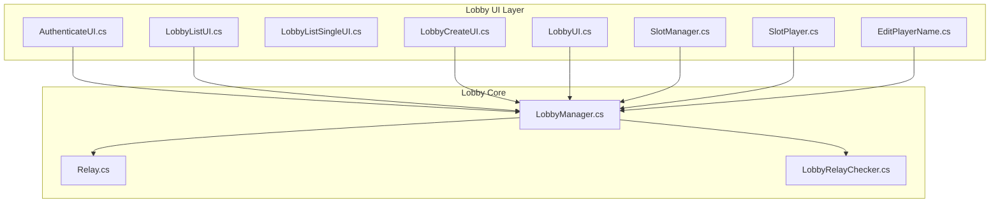
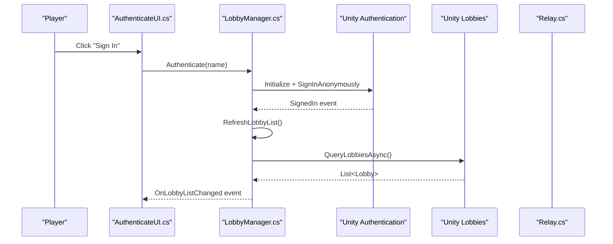
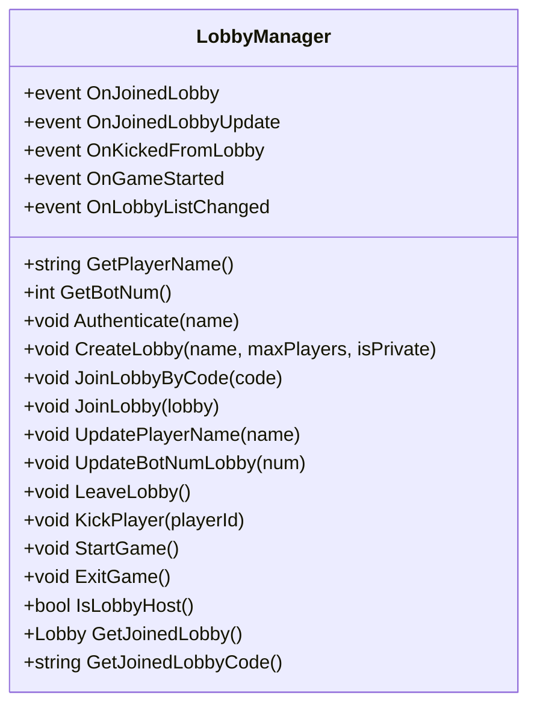
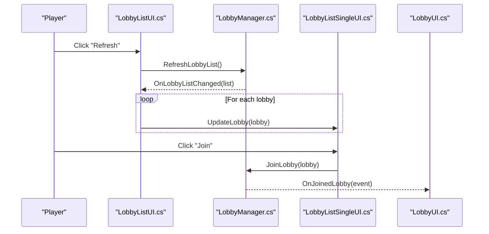
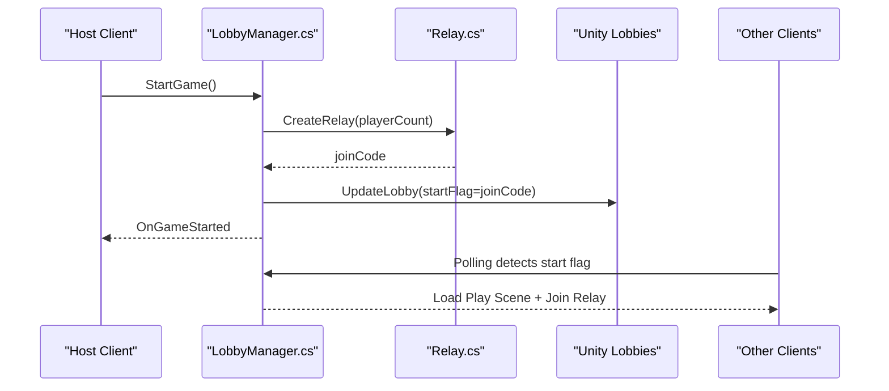
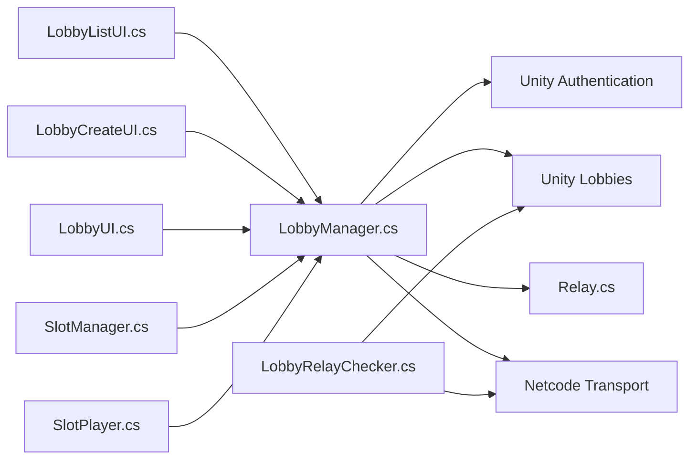

# Lobby Management

<cite>
**Referenced Files in This Document**
- [LobbyManager.cs](file://Assets/FPS-Game/Scripts/Lobby Script/Lobby/Scripts/LobbyManager.cs)
- [LobbyCreateUI.cs](file://Assets/FPS-Game/Scripts/Lobby Script/Lobby/Scripts/LobbyCreateUI.cs)
- [LobbyListUI.cs](file://Assets/FPS-Game/Scripts/Lobby Script/Lobby/Scripts/LobbyListUI.cs)
- [LobbyListSingleUI.cs](file://Assets/FPS-Game/Scripts/Lobby Script/Lobby/Scripts/LobbyListSingleUI.cs)
- [LobbyUI.cs](file://Assets/FPS-Game/Scripts/Lobby Script/Lobby/Scripts/LobbyUI.cs)
- [SlotManager.cs](file://Assets/FPS-Game/Scripts/Lobby Script/Lobby/Scripts/SlotManager.cs)
- [SlotPlayer.cs](file://Assets/FPS-Game/Scripts/Lobby Script/Lobby/Scripts/SlotPlayer.cs)
- [EditPlayerName.cs](file://Assets/FPS-Game/Scripts/Lobby Script/Lobby/Scripts/EditPlayerName.cs)
- [AuthenticateUI.cs](file://Assets/FPS-Game/Scripts/Lobby Script/Lobby/Scripts/AuthenticateUI.cs)
- [Relay.cs](file://Assets/FPS-Game/Scripts/Lobby Script/Lobby/Scripts/Relay.cs)
- [LobbyRelayChecker.cs](file://Assets/FPS-Game/Scripts/System/LobbyRelayChecker.cs)
</cite>

## Table of Contents
1. [Introduction](#introduction)
2. [Project Structure](#project-structure)
3. [Core Components](#core-components)
4. [Architecture Overview](#architecture-overview)
5. [Detailed Component Analysis](#detailed-component-analysis)
6. [Dependency Analysis](#dependency-analysis)
7. [Performance Considerations](#performance-considerations)
8. [Troubleshooting Guide](#troubleshooting-guide)
9. [Conclusion](#conclusion)

## Introduction
This document explains the lobby management system integrated with Unity Gaming Services in the project. It covers player authentication via Unity Authentication Service, lobby lifecycle (creation, joining, updates, polling), and the integration with Unity Relay for hosting and joining matches. It also documents the lobby data model, heartbeat and polling mechanisms, and practical workflows such as managing bots, host controls, and cleanup procedures.

## Project Structure
The lobby system is implemented under Assets/FPS-Game/Scripts/Lobby Script/Lobby/Scripts and integrates with Unity Services (Authentication, Lobbies, Relay) and Netcode for GameObjects (Netcode). UI components manage user actions and display lobby state.

**Diagram sources**
- [AuthenticateUI.cs:1-20](file://Assets/FPS-Game/Scripts/Lobby Script/Lobby/Scripts/AuthenticateUI.cs#L1-L20)
- [LobbyListUI.cs:1-191](file://Assets/FPS-Game/Scripts/Lobby Script/Lobby/Scripts/LobbyListUI.cs#L1-L191)
- [LobbyListSingleUI.cs:1-33](file://Assets/FPS-Game/Scripts/Lobby Script/Lobby/Scripts/LobbyListSingleUI.cs#L1-L33)
- [LobbyCreateUI.cs:1-152](file://Assets/FPS-Game/Scripts/Lobby Script/Lobby/Scripts/LobbyCreateUI.cs#L1-L152)
- [LobbyUI.cs:1-180](file://Assets/FPS-Game/Scripts/Lobby Script/Lobby/Scripts/LobbyUI.cs#L1-L180)
- [SlotManager.cs:1-136](file://Assets/FPS-Game/Scripts/Lobby Script/Lobby/Scripts/SlotManager.cs#L1-L136)
- [SlotPlayer.cs:1-59](file://Assets/FPS-Game/Scripts/Lobby Script/Lobby/Scripts/SlotPlayer.cs#L1-L59)
- [EditPlayerName.cs:1-47](file://Assets/FPS-Game/Scripts/Lobby Script/Lobby/Scripts/EditPlayerName.cs#L1-L47)
- [LobbyManager.cs:1-589](file://Assets/FPS-Game/Scripts/Lobby Script/Lobby/Scripts/LobbyManager.cs#L1-L589)
- [Relay.cs:1-71](file://Assets/FPS-Game/Scripts/Lobby Script/Lobby/Scripts/Relay.cs#L1-L71)
- [LobbyRelayChecker.cs:1-63](file://Assets/FPS-Game/Scripts/System/LobbyRelayChecker.cs#L1-L63)

**Section sources**
- [LobbyManager.cs:13-71](file://Assets/FPS-Game/Scripts/Lobby Script/Lobby/Scripts/LobbyManager.cs#L13-L71)
- [LobbyListUI.cs:10-59](file://Assets/FPS-Game/Scripts/Lobby Script/Lobby/Scripts/LobbyListUI.cs#L10-L59)
- [LobbyCreateUI.cs:7-51](file://Assets/FPS-Game/Scripts/Lobby Script/Lobby/Scripts/LobbyCreateUI.cs#L7-L51)
- [LobbyUI.cs:6-86](file://Assets/FPS-Game/Scripts/Lobby Script/Lobby/Scripts/LobbyUI.cs#L6-L86)
- [SlotManager.cs:7-52](file://Assets/FPS-Game/Scripts/Lobby Script/Lobby/Scripts/SlotManager.cs#L7-L52)
- [SlotPlayer.cs:8-59](file://Assets/FPS-Game/Scripts/Lobby Script/Lobby/Scripts/SlotPlayer.cs#L8-L59)
- [EditPlayerName.cs:6-47](file://Assets/FPS-Game/Scripts/Lobby Script/Lobby/Scripts/EditPlayerName.cs#L6-L47)
- [AuthenticateUI.cs:5-20](file://Assets/FPS-Game/Scripts/Lobby Script/Lobby/Scripts/AuthenticateUI.cs#L5-L20)
- [Relay.cs:10-71](file://Assets/FPS-Game/Scripts/Lobby Script/Lobby/Scripts/Relay.cs#L10-L71)
- [LobbyRelayChecker.cs:8-63](file://Assets/FPS-Game/Scripts/System/LobbyRelayChecker.cs#L8-L63)

## Core Components
- LobbyManager: Central orchestrator for authentication, lobby CRUD, polling, heartbeat, and game start signaling via Unity Services. Maintains joined lobby state and exposes events for UI updates.
- UI Components: AuthenticateUI, LobbyListUI, LobbyCreateUI, LobbyUI, SlotManager, SlotPlayer, EditPlayerName coordinate user actions and render lobby state.
- Relay Integration: Relay creates and joins Relay allocations and configures Netcode transport; LobbyRelayChecker monitors connection parity between lobby and Netcode clients.

Key data model keys used:
- Player name: stored per-player with public visibility
- Character selection: reserved for future use
- Start game flag: member-visible value carrying the Relay join code when started
- Bot number: public count of AI players added to the lobby

**Section sources**
- [LobbyManager.cs:17-21](file://Assets/FPS-Game/Scripts/Lobby Script/Lobby/Scripts/LobbyManager.cs#L17-L21)
- [LobbyManager.cs:207-240](file://Assets/FPS-Game/Scripts/Lobby Script/Lobby/Scripts/LobbyManager.cs#L207-L240)
- [LobbyManager.cs:264-286](file://Assets/FPS-Game/Scripts/Lobby Script/Lobby/Scripts/LobbyManager.cs#L264-L286)
- [LobbyManager.cs:321-354](file://Assets/FPS-Game/Scripts/Lobby Script/Lobby/Scripts/LobbyManager.cs#L321-L354)
- [LobbyManager.cs:394-436](file://Assets/FPS-Game/Scripts/Lobby Script/Lobby/Scripts/LobbyManager.cs#L394-L436)
- [LobbyManager.cs:507-520](file://Assets/FPS-Game/Scripts/Lobby Script/Lobby/Scripts/LobbyManager.cs#L507-L520)
- [LobbyManager.cs:545-569](file://Assets/FPS-Game/Scripts/Lobby Script/Lobby/Scripts/LobbyManager.cs#L545-L569)
- [LobbyManager.cs:571-588](file://Assets/FPS-Game/Scripts/Lobby Script/Lobby/Scripts/LobbyManager.cs#L571-L588)

## Architecture Overview
The system follows a publish-subscribe pattern between LobbyManager and UI components. UI triggers actions; LobbyManager invokes Unity Services APIs and raises events for UI updates. Relay is used to host or join matches after the host starts the game.

**Diagram sources**
- [AuthenticateUI.cs:9-18](file://Assets/FPS-Game/Scripts/Lobby Script/Lobby/Scripts/AuthenticateUI.cs#L9-L18)
- [LobbyManager.cs:86-104](file://Assets/FPS-Game/Scripts/Lobby Script/Lobby/Scripts/LobbyManager.cs#L86-L104)
- [LobbyManager.cs:288-319](file://Assets/FPS-Game/Scripts/Lobby Script/Lobby/Scripts/LobbyManager.cs#L288-L319)

## Detailed Component Analysis

### LobbyManager: Authentication, Creation, Joining, Polling, Heartbeat, Relay Start
- Authentication: Initializes Unity Services with a profile and signs in anonymously. On sign-in, triggers lobby list refresh.
- Lobby Lifecycle:
  - Create: Builds a Player object with per-player data and optional private flag; sets initial lobby data (start flag and bot count).
  - Join: By code or by ID; loads the lobby room scene.
  - Update: Player name and bot number updates are applied to the joined lobby.
  - Leave/Kick: Removes the local player or kicks another player if host.
  - Start Game: Host creates a Relay allocation, stores the join code in the start flag, and signals clients to join.
- Polling and Heartbeat:
  - Polling: Periodically fetches the joined lobby to detect kicks, updates, and start signal.
  - Heartbeat: Host pings the lobby periodically to keep it alive.
- Events: Exposes OnJoinedLobby, OnJoinedLobbyUpdate, OnKickedFromLobby, OnGameStarted, OnLobbyListChanged.

**Diagram sources**
- [LobbyManager.cs:13-589](file://Assets/FPS-Game/Scripts/Lobby Script/Lobby/Scripts/LobbyManager.cs#L13-L589)

**Section sources**
- [LobbyManager.cs:86-104](file://Assets/FPS-Game/Scripts/Lobby Script/Lobby/Scripts/LobbyManager.cs#L86-L104)
- [LobbyManager.cs:264-286](file://Assets/FPS-Game/Scripts/Lobby Script/Lobby/Scripts/LobbyManager.cs#L264-L286)
- [LobbyManager.cs:321-354](file://Assets/FPS-Game/Scripts/Lobby Script/Lobby/Scripts/LobbyManager.cs#L321-L354)
- [LobbyManager.cs:356-392](file://Assets/FPS-Game/Scripts/Lobby Script/Lobby/Scripts/LobbyManager.cs#L356-L392)
- [LobbyManager.cs:394-436](file://Assets/FPS-Game/Scripts/Lobby Script/Lobby/Scripts/LobbyManager.cs#L394-L436)
- [LobbyManager.cs:485-505](file://Assets/FPS-Game/Scripts/Lobby Script/Lobby/Scripts/LobbyManager.cs#L485-L505)
- [LobbyManager.cs:507-520](file://Assets/FPS-Game/Scripts/Lobby Script/Lobby/Scripts/LobbyManager.cs#L507-L520)
- [LobbyManager.cs:545-569](file://Assets/FPS-Game/Scripts/Lobby Script/Lobby/Scripts/LobbyManager.cs#L545-L569)
- [LobbyManager.cs:571-588](file://Assets/FPS-Game/Scripts/Lobby Script/Lobby/Scripts/LobbyManager.cs#L571-L588)
- [LobbyManager.cs:122-136](file://Assets/FPS-Game/Scripts/Lobby Script/Lobby/Scripts/LobbyManager.cs#L122-L136)
- [LobbyManager.cs:138-205](file://Assets/FPS-Game/Scripts/Lobby Script/Lobby/Scripts/LobbyManager.cs#L138-L205)

### UI Components: LobbyListUI, LobbyCreateUI, LobbyUI, SlotManager, SlotPlayer, EditPlayerName
- AuthenticateUI: Triggers authentication and navigates to the lobby list scene.
- LobbyListUI: Renders a paginated list of open lobbies, supports refresh and join-by-code.
- LobbyCreateUI: Collects lobby name, max players, and privacy; delegates creation to LobbyManager.
- LobbyUI: Displays lobby info, host-only start button, and host-only bot controls.
- SlotManager: Populates player slots, respects host privileges, and renders bots.
- SlotPlayer: Displays player name and optionally enables kick button for host.
- EditPlayerName: Updates the player’s name locally and syncs to the lobby.

**Diagram sources**
- [LobbyListUI.cs:32-74](file://Assets/FPS-Game/Scripts/Lobby Script/Lobby/Scripts/LobbyListUI.cs#L32-L74)
- [LobbyListSingleUI.cs:18-32](file://Assets/FPS-Game/Scripts/Lobby Script/Lobby/Scripts/LobbyListSingleUI.cs#L18-L32)
- [LobbyManager.cs:288-319](file://Assets/FPS-Game/Scripts/Lobby Script/Lobby/Scripts/LobbyManager.cs#L288-L319)
- [LobbyManager.cs:342-354](file://Assets/FPS-Game/Scripts/Lobby Script/Lobby/Scripts/LobbyManager.cs#L342-L354)

**Section sources**
- [AuthenticateUI.cs:9-18](file://Assets/FPS-Game/Scripts/Lobby Script/Lobby/Scripts/AuthenticateUI.cs#L9-L18)
- [LobbyListUI.cs:26-110](file://Assets/FPS-Game/Scripts/Lobby Script/Lobby/Scripts/LobbyListUI.cs#L26-L110)
- [LobbyCreateUI.cs:35-102](file://Assets/FPS-Game/Scripts/Lobby Script/Lobby/Scripts/LobbyCreateUI.cs#L35-L102)
- [LobbyUI.cs:29-114](file://Assets/FPS-Game/Scripts/Lobby Script/Lobby/Scripts/LobbyUI.cs#L29-L114)
- [SlotManager.cs:54-100](file://Assets/FPS-Game/Scripts/Lobby Script/Lobby/Scripts/SlotManager.cs#L54-L100)
- [SlotPlayer.cs:34-59](file://Assets/FPS-Game/Scripts/Lobby Script/Lobby/Scripts/SlotPlayer.cs#L34-L59)
- [EditPlayerName.cs:35-47](file://Assets/FPS-Game/Scripts/Lobby Script/Lobby/Scripts/EditPlayerName.cs#L35-L47)

### Relay Integration: Hosting and Joining Matches
- Host flow: LobbyManager.StartGame creates a Relay allocation, stores the join code in the lobby’s start flag, and starts the host in Netcode.
- Client flow: When the lobby’s start flag is set, clients load the play scene and join the Relay using the stored code.
- Connection verification: LobbyRelayChecker periodically compares the number of Netcode-connected clients against the lobby’s player count to signal readiness.

**Diagram sources**
- [LobbyManager.cs:545-569](file://Assets/FPS-Game/Scripts/Lobby Script/Lobby/Scripts/LobbyManager.cs#L545-L569)
- [Relay.cs:27-50](file://Assets/FPS-Game/Scripts/Lobby Script/Lobby/Scripts/Relay.cs#L27-L50)
- [LobbyManager.cs:167-182](file://Assets/FPS-Game/Scripts/Lobby Script/Lobby/Scripts/LobbyManager.cs#L167-L182)

**Section sources**
- [Relay.cs:27-71](file://Assets/FPS-Game/Scripts/Lobby Script/Lobby/Scripts/Relay.cs#L27-L71)
- [LobbyRelayChecker.cs:19-61](file://Assets/FPS-Game/Scripts/System/LobbyRelayChecker.cs#L19-L61)
- [LobbyManager.cs:167-182](file://Assets/FPS-Game/Scripts/Lobby Script/Lobby/Scripts/LobbyManager.cs#L167-L182)

## Dependency Analysis
- UI depends on LobbyManager events and methods for rendering and actions.
- LobbyManager depends on Unity Services SDKs (Authentication, Lobbies, Relay).
- Relay depends on Netcode transport configuration.
- SlotManager coordinates UI slots with lobby state and host permissions.

**Diagram sources**
- [LobbyManager.cs:5-11](file://Assets/FPS-Game/Scripts/Lobby Script/Lobby/Scripts/LobbyManager.cs#L5-L11)
- [LobbyListUI.cs:1-9](file://Assets/FPS-Game/Scripts/Lobby Script/Lobby/Scripts/LobbyListUI.cs#L1-L9)
- [LobbyCreateUI.cs:1-6](file://Assets/FPS-Game/Scripts/Lobby Script/Lobby/Scripts/LobbyCreateUI.cs#L1-L6)
- [LobbyUI.cs:1-5](file://Assets/FPS-Game/Scripts/Lobby Script/Lobby/Scripts/LobbyUI.cs#L1-L5)
- [SlotManager.cs:1-5](file://Assets/FPS-Game/Scripts/Lobby Script/Lobby/Scripts/SlotManager.cs#L1-L5)
- [SlotPlayer.cs:1-7](file://Assets/FPS-Game/Scripts/Lobby Script/Lobby/Scripts/SlotPlayer.cs#L1-L7)
- [LobbyRelayChecker.cs:1-6](file://Assets/FPS-Game/Scripts/System/LobbyRelayChecker.cs#L1-L6)
- [Relay.cs:1-8](file://Assets/FPS-Game/Scripts/Lobby Script/Lobby/Scripts/Relay.cs#L1-L8)

**Section sources**
- [LobbyManager.cs:5-11](file://Assets/FPS-Game/Scripts/Lobby Script/Lobby/Scripts/LobbyManager.cs#L5-L11)
- [LobbyListUI.cs:1-9](file://Assets/FPS-Game/Scripts/Lobby Script/Lobby/Scripts/LobbyListUI.cs#L1-L9)
- [SlotManager.cs:1-5](file://Assets/FPS-Game/Scripts/Lobby Script/Lobby/Scripts/SlotManager.cs#L1-L5)

## Performance Considerations
- Polling interval: The lobby polling timer is tuned to balance responsiveness and API cost. Adjusting the polling interval can reduce network overhead.
- Heartbeat: Host heartbeat keeps the lobby alive without heavy operations; ensure intervals align with expected idle durations.
- Refresh list: Automatic refresh is throttled; consider disabling or adjusting based on UX needs.
- UI updates: Batch UI updates when many players change at once to minimize layout recalculations.

[No sources needed since this section provides general guidance]

## Troubleshooting Guide
Common exceptions and symptoms:
- Private lobby inaccessible: When polling detects a private lobby restriction, the system redirects to the lobby list and clears the joined lobby state.
- Null lobby access: Defensive checks prevent null-reference errors during polling; ensure the joined lobby is validated before use.
- Connectivity issues with Relay: Relay operations log exceptions; verify allocation capacity and join code validity.

Recommended steps:
- Verify Unity Services initialization and authentication state before performing lobby operations.
- Confirm lobby filters and ordering match expectations when refreshing the lobby list.
- Ensure the host has sufficient capacity for Relay allocations before starting the game.
- Monitor logs for Unity Services exceptions and handle gracefully by informing the user and offering retry options.

**Section sources**
- [LobbyManager.cs:186-204](file://Assets/FPS-Game/Scripts/Lobby Script/Lobby/Scripts/LobbyManager.cs#L186-L204)
- [LobbyManager.cs:315-318](file://Assets/FPS-Game/Scripts/Lobby Script/Lobby/Scripts/LobbyManager.cs#L315-L318)
- [Relay.cs:45-49](file://Assets/FPS-Game/Scripts/Lobby Script/Lobby/Scripts/Relay.cs#L45-L49)
- [LobbyRelayChecker.cs:57-61](file://Assets/FPS-Game/Scripts/System/LobbyRelayChecker.cs#L57-L61)

## Conclusion
The lobby management system integrates Unity Authentication, Lobbies, and Relay to provide a robust foundation for matchmaking and gameplay orchestration. It offers clear workflows for creating and joining lobbies, managing player lists, and coordinating game starts. The polling and heartbeat mechanisms ensure reliability, while UI components deliver a responsive player experience. Following the troubleshooting guidance helps maintain stability under various network conditions.