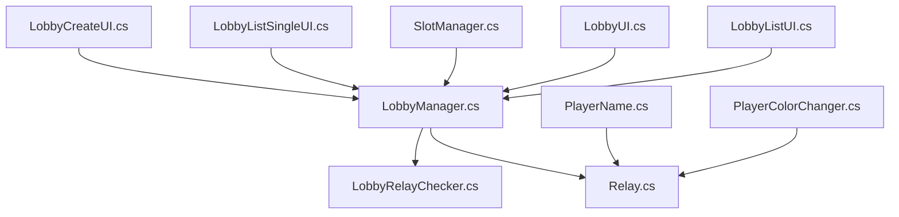
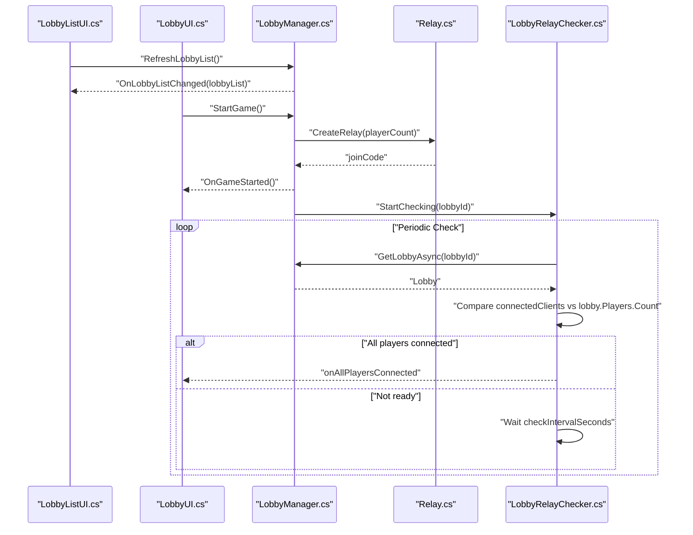
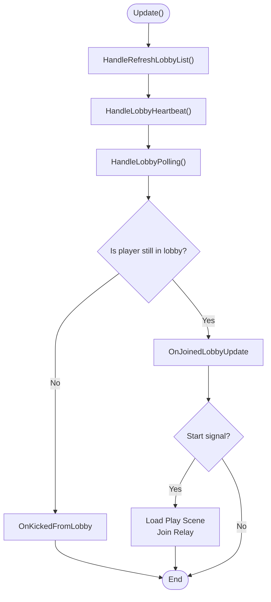
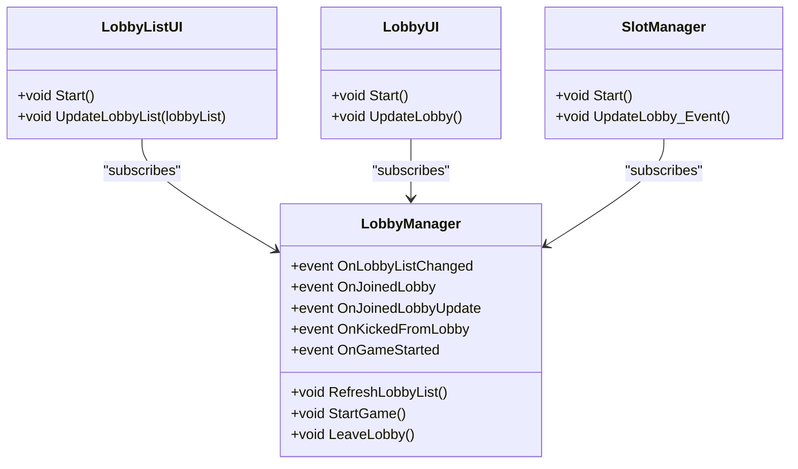
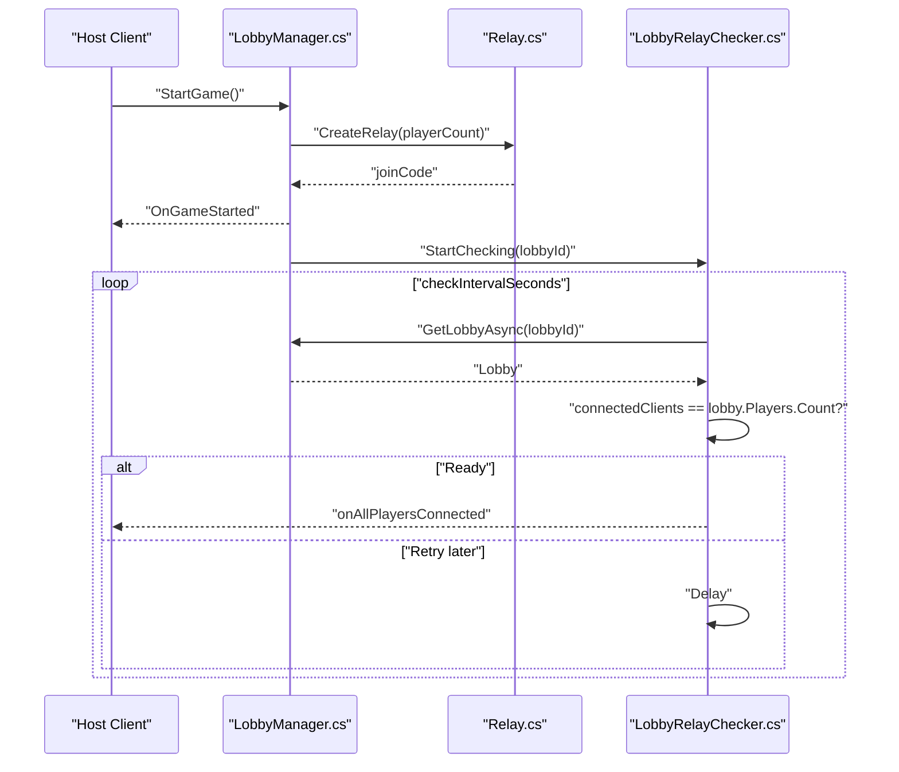
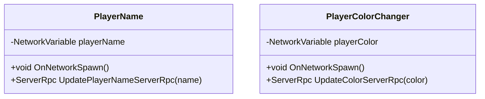
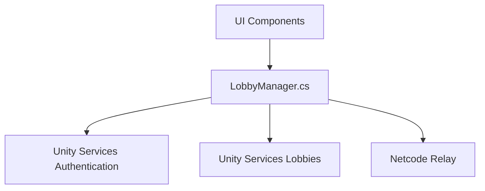

# Lobby State Synchronization

<cite>
**Referenced Files in This Document**
- [LobbyManager.cs](file://Assets/FPS-Game/Scripts/Lobby%20Script/Lobby/Scripts/LobbyManager.cs)
- [LobbyListUI.cs](file://Assets/FPS-Game/Scripts/Lobby%20Script/Lobby/Scripts/LobbyListUI.cs)
- [LobbyUI.cs](file://Assets/FPS-Game/Scripts/Lobby%20Script/Lobby/Scripts/LobbyUI.cs)
- [SlotManager.cs](file://Assets/FPS-Game/Scripts/Lobby%20Script/Lobby/Scripts/SlotManager.cs)
- [LobbyListSingleUI.cs](file://Assets/FPS-Game/Scripts/Lobby%20Script/Lobby/Scripts/LobbyListSingleUI.cs)
- [LobbyCreateUI.cs](file://Assets/FPS-Game/Scripts/Lobby%20Script/Lobby/Scripts/LobbyCreateUI.cs)
- [Relay.cs](file://Assets/FPS-Game/Scripts/Lobby%20Script/Lobby/Scripts/Relay.cs)
- [LobbyRelayChecker.cs](file://Assets/FPS-Game/Scripts/System/LobbyRelayChecker.cs)
- [PlayerName.cs](file://Assets/FPS-Game/Scripts/Lobby%20Script/Lobby/Scripts/PlayerName.cs)
- [PlayerColorChanger.cs](file://Assets/FPS-Game/Scripts/Lobby%20Script/Lobby/Scripts/PlayerColorChanger.cs)
</cite>

## Table of Contents
1. [Introduction](#introduction)
2. [Project Structure](#project-structure)
3. [Core Components](#core-components)
4. [Architecture Overview](#architecture-overview)
5. [Detailed Component Analysis](#detailed-component-analysis)
6. [Dependency Analysis](#dependency-analysis)
7. [Performance Considerations](#performance-considerations)
8. [Troubleshooting Guide](#troubleshooting-guide)
9. [Conclusion](#conclusion)

## Introduction
This document explains how lobby state synchronization and real-time updates are implemented in the project. It covers:
- Heartbeat system to keep lobbies alive and prevent timeouts
- Polling mechanism to detect state changes and player updates
- Automatic refresh system for lobby lists and individual lobby details
- Event-driven architecture for lobby update events, game start detection, and kick notifications
- Practical guidance on implementing state change handlers, managing update frequencies, handling network latency, optimizing sync frequency, handling disconnections, and implementing reliable state recovery

## Project Structure
The lobby system spans several scripts:
- Central coordinator: LobbyManager
- UI components: LobbyListUI, LobbyUI, SlotManager, LobbyListSingleUI, LobbyCreateUI
- Networking and relay: Relay, LobbyRelayChecker
- Networked player settings: PlayerName, PlayerColorChanger

**Diagram sources**
- [LobbyManager.cs:13-589](file://Assets/FPS-Game/Scripts/Lobby%20Script/Lobby/Scripts/LobbyManager.cs#L13-L589)
- [LobbyListUI.cs:10-191](file://Assets/FPS-Game/Scripts/Lobby%20Script/Lobby/Scripts/LobbyListUI.cs#L10-L191)
- [LobbyUI.cs:6-180](file://Assets/FPS-Game/Scripts/Lobby%20Script/Lobby/Scripts/LobbyUI.cs#L6-L180)
- [SlotManager.cs:7-136](file://Assets/FPS-Game/Scripts/Lobby%20Script/Lobby/Scripts/SlotManager.cs#L7-L136)
- [LobbyListSingleUI.cs:8-33](file://Assets/FPS-Game/Scripts/Lobby%20Script/Lobby/Scripts/LobbyListSingleUI.cs#L8-L33)
- [LobbyCreateUI.cs:7-152](file://Assets/FPS-Game/Scripts/Lobby%20Script/Lobby/Scripts/LobbyCreateUI.cs#L7-L152)
- [Relay.cs:10-71](file://Assets/FPS-Game/Scripts/Lobby%20Script/Lobby/Scripts/Relay.cs#L10-L71)
- [LobbyRelayChecker.cs:8-63](file://Assets/FPS-Game/Scripts/System/LobbyRelayChecker.cs#L8-L63)
- [PlayerName.cs:7-41](file://Assets/FPS-Game/Scripts/Lobby%20Script/Lobby/Scripts/PlayerName.cs#L7-L41)
- [PlayerColorChanger.cs:4-65](file://Assets/FPS-Game/Scripts/Lobby%20Script/Lobby/Scripts/PlayerColorChanger.cs#L4-L65)

**Section sources**
- [LobbyManager.cs:13-589](file://Assets/FPS-Game/Scripts/Lobby%20Script/Lobby/Scripts/LobbyManager.cs#L13-L589)
- [LobbyListUI.cs:10-191](file://Assets/FPS-Game/Scripts/Lobby%20Script/Lobby/Scripts/LobbyListUI.cs#L10-L191)
- [LobbyUI.cs:6-180](file://Assets/FPS-Game/Scripts/Lobby%20Script/Lobby/Scripts/LobbyUI.cs#L6-L180)
- [SlotManager.cs:7-136](file://Assets/FPS-Game/Scripts/Lobby%20Script/Lobby/Scripts/SlotManager.cs#L7-L136)
- [LobbyListSingleUI.cs:8-33](file://Assets/FPS-Game/Scripts/Lobby%20Script/Lobby/Scripts/LobbyListSingleUI.cs#L8-L33)
- [LobbyCreateUI.cs:7-152](file://Assets/FPS-Game/Scripts/Lobby%20Script/Lobby/Scripts/LobbyCreateUI.cs#L7-L152)
- [Relay.cs:10-71](file://Assets/FPS-Game/Scripts/Lobby%20Script/Lobby/Scripts/Relay.cs#L10-L71)
- [LobbyRelayChecker.cs:8-63](file://Assets/FPS-Game/Scripts/System/LobbyRelayChecker.cs#L8-L63)
- [PlayerName.cs:7-41](file://Assets/FPS-Game/Scripts/Lobby%20Script/Lobby/Scripts/PlayerName.cs#L7-L41)
- [PlayerColorChanger.cs:4-65](file://Assets/FPS-Game/Scripts/Lobby%20Script/Lobby/Scripts/PlayerColorChanger.cs#L4-L65)

## Core Components
- LobbyManager: Central state controller for lobby lifecycle, heartbeat, polling, list refresh, and game start coordination. Emits events for list changes, joins, updates, kicks, and game starts.
- UI Layer: LobbyListUI, LobbyUI, SlotManager, LobbyListSingleUI, LobbyCreateUI subscribe to LobbyManager events to render and react to state changes.
- Relay and LobbyRelayChecker: Manage Netcode relay allocation/join and verify all players connected to the relay before starting gameplay.
- Networked Player Settings: PlayerName and PlayerColorChanger demonstrate networked state propagation via NetworkVariables and ServerRpc.

Key responsibilities:
- Heartbeat: Hosts send periodic heartbeat pings to keep the lobby alive.
- Polling: Clients poll lobby details to detect kicks, updates, and start signals.
- List Refresh: Periodically fetches open lobbies to populate the lobby browser.
- Events: UI and systems react to events for seamless real-time updates.

**Section sources**
- [LobbyManager.cs:13-589](file://Assets/FPS-Game/Scripts/Lobby%20Script/Lobby/Scripts/LobbyManager.cs#L13-L589)
- [LobbyListUI.cs:10-191](file://Assets/FPS-Game/Scripts/Lobby%20Script/Lobby/Scripts/LobbyListUI.cs#L10-L191)
- [LobbyUI.cs:6-180](file://Assets/FPS-Game/Scripts/Lobby%20Script/Lobby/Scripts/LobbyUI.cs#L6-L180)
- [SlotManager.cs:7-136](file://Assets/FPS-Game/Scripts/Lobby%20Script/Lobby/Scripts/SlotManager.cs#L7-L136)
- [LobbyRelayChecker.cs:8-63](file://Assets/FPS-Game/Scripts/System/LobbyRelayChecker.cs#L8-L63)
- [Relay.cs:10-71](file://Assets/FPS-Game/Scripts/Lobby%20Script/Lobby/Scripts/Relay.cs#L10-L71)
- [PlayerName.cs:7-41](file://Assets/FPS-Game/Scripts/Lobby%20Script/Lobby/Scripts/PlayerName.cs#L7-L41)
- [PlayerColorChanger.cs:4-65](file://Assets/FPS-Game/Scripts/Lobby%20Script/Lobby/Scripts/PlayerColorChanger.cs#L4-L65)

## Architecture Overview
The system follows an event-driven architecture:
- UI components subscribe to LobbyManager events
- LobbyManager orchestrates Unity Services (Lobbies, Authentication) and Netcode Relay
- Relay coordinates host/client connections and ensures all players are ready before starting the game

**Diagram sources**
- [LobbyListUI.cs:32-47](file://Assets/FPS-Game/Scripts/Lobby%20Script/Lobby/Scripts/LobbyListUI.cs#L32-L47)
- [LobbyUI.cs:69-74](file://Assets/FPS-Game/Scripts/Lobby%20Script/Lobby/Scripts/LobbyUI.cs#L69-L74)
- [LobbyManager.cs:545-569](file://Assets/FPS-Game/Scripts/Lobby%20Script/Lobby/Scripts/LobbyManager.cs#L545-L569)
- [Relay.cs:27-50](file://Assets/FPS-Game/Scripts/Lobby%20Script/Lobby/Scripts/Relay.cs#L27-L50)
- [LobbyRelayChecker.cs:19-35](file://Assets/FPS-Game/Scripts/System/LobbyRelayChecker.cs#L19-L35)

## Detailed Component Analysis

### LobbyManager: Heartbeat, Polling, and Events
- Heartbeat: Hosts periodically send heartbeat pings to prevent timeouts.
- Polling: Clients poll lobby details to detect kicks, updates, and start signals.
- List Refresh: Periodically queries open lobbies and emits OnLobbyListChanged.
- Events: OnJoinedLobby, OnJoinedLobbyUpdate, OnKickedFromLobby, OnGameStarted, OnLeftLobby.

**Diagram sources**
- [LobbyManager.cs:79-205](file://Assets/FPS-Game/Scripts/Lobby%20Script/Lobby/Scripts/LobbyManager.cs#L79-L205)

**Section sources**
- [LobbyManager.cs:53-205](file://Assets/FPS-Game/Scripts/Lobby%20Script/Lobby/Scripts/LobbyManager.cs#L53-L205)
- [LobbyManager.cs:23-38](file://Assets/FPS-Game/Scripts/Lobby%20Script/Lobby/Scripts/LobbyManager.cs#L23-L38)

### UI Layer: Subscribing to Events and Rendering Updates
- LobbyListUI subscribes to OnLobbyListChanged and renders the list.
- LobbyUI subscribes to OnJoinedLobby, OnJoinedLobbyUpdate, OnGameStarted to update room UI and enable host actions.
- SlotManager subscribes to lobby events to render players and bots around the wheel.

**Diagram sources**
- [LobbyListUI.cs:61-110](file://Assets/FPS-Game/Scripts/Lobby%20Script/Lobby/Scripts/LobbyListUI.cs#L61-L110)
- [LobbyUI.cs:88-114](file://Assets/FPS-Game/Scripts/Lobby%20Script/Lobby/Scripts/LobbyUI.cs#L88-L114)
- [SlotManager.cs:24-52](file://Assets/FPS-Game/Scripts/Lobby%20Script/Lobby/Scripts/SlotManager.cs#L24-L52)
- [LobbyManager.cs:23-38](file://Assets/FPS-Game/Scripts/Lobby%20Script/Lobby/Scripts/LobbyManager.cs#L23-L38)

**Section sources**
- [LobbyListUI.cs:61-110](file://Assets/FPS-Game/Scripts/Lobby%20Script/Lobby/Scripts/LobbyListUI.cs#L61-L110)
- [LobbyUI.cs:88-114](file://Assets/FPS-Game/Scripts/Lobby%20Script/Lobby/Scripts/LobbyUI.cs#L88-L114)
- [SlotManager.cs:24-52](file://Assets/FPS-Game/Scripts/Lobby%20Script/Lobby/Scripts/SlotManager.cs#L24-L52)

### Relay and Relay Checker: Coordinating Game Start
- Relay creates or joins a Netcode Relay allocation and configures NetworkManager transport.
- LobbyRelayChecker periodically compares connected clients with lobby player count to trigger readiness.

**Diagram sources**
- [LobbyManager.cs:545-569](file://Assets/FPS-Game/Scripts/Lobby%20Script/Lobby/Scripts/LobbyManager.cs#L545-L569)
- [Relay.cs:27-50](file://Assets/FPS-Game/Scripts/Lobby%20Script/Lobby/Scripts/Relay.cs#L27-L50)
- [LobbyRelayChecker.cs:19-35](file://Assets/FPS-Game/Scripts/System/LobbyRelayChecker.cs#L19-L35)

**Section sources**
- [Relay.cs:27-50](file://Assets/FPS-Game/Scripts/Lobby%20Script/Lobby/Scripts/Relay.cs#L27-L50)
- [LobbyRelayChecker.cs:19-61](file://Assets/FPS-Game/Scripts/System/LobbyRelayChecker.cs#L19-L61)

### Networked Player Settings: Reliable State Propagation
- PlayerName and PlayerColorChanger use NetworkVariables and ServerRpc to propagate state reliably across the network.

**Diagram sources**
- [PlayerName.cs:7-41](file://Assets/FPS-Game/Scripts/Lobby%20Script/Lobby/Scripts/PlayerName.cs#L7-L41)
- [PlayerColorChanger.cs:4-65](file://Assets/FPS-Game/Scripts/Lobby%20Script/Lobby/Scripts/PlayerColorChanger.cs#L4-L65)

**Section sources**
- [PlayerName.cs:7-41](file://Assets/FPS-Game/Scripts/Lobby%20Script/Lobby/Scripts/PlayerName.cs#L7-L41)
- [PlayerColorChanger.cs:4-65](file://Assets/FPS-Game/Scripts/Lobby%20Script/Lobby/Scripts/PlayerColorChanger.cs#L4-L65)

## Dependency Analysis
- LobbyManager depends on Unity Services (Authentication, Lobbies) and Netcode Relay.
- UI components depend on LobbyManager events for rendering and enabling controls.
- Relay and LobbyRelayChecker depend on LobbyManager’s lobby ID and lobby data.

**Diagram sources**
- [LobbyManager.cs:5-11](file://Assets/FPS-Game/Scripts/Lobby%20Script/Lobby/Scripts/LobbyManager.cs#L5-L11)
- [LobbyListUI.cs:61-110](file://Assets/FPS-Game/Scripts/Lobby%20Script/Lobby/Scripts/LobbyListUI.cs#L61-L110)
- [LobbyUI.cs:88-114](file://Assets/FPS-Game/Scripts/Lobby%20Script/Lobby/Scripts/LobbyUI.cs#L88-L114)
- [SlotManager.cs:24-52](file://Assets/FPS-Game/Scripts/Lobby%20Script/Lobby/Scripts/SlotManager.cs#L24-L52)

**Section sources**
- [LobbyManager.cs:5-11](file://Assets/FPS-Game/Scripts/Lobby%20Script/Lobby/Scripts/LobbyManager.cs#L5-L11)
- [LobbyListUI.cs:61-110](file://Assets/FPS-Game/Scripts/Lobby%20Script/Lobby/Scripts/LobbyListUI.cs#L61-L110)
- [LobbyUI.cs:88-114](file://Assets/FPS-Game/Scripts/Lobby%20Script/Lobby/Scripts/LobbyUI.cs#L88-L114)
- [SlotManager.cs:24-52](file://Assets/FPS-Game/Scripts/Lobby%20Script/Lobby/Scripts/SlotManager.cs#L24-L52)

## Performance Considerations
- Tune polling intervals:
  - Lobby polling interval is approximately 1.5 seconds for frequent updates.
  - Heartbeat interval is approximately 25 seconds for hosts.
  - List refresh interval is approximately 10 seconds.
- Minimize unnecessary queries:
  - Only poll when joinedLobby is set.
  - Avoid redundant refreshes by gating refresh behind authentication state.
- Optimize UI updates:
  - Batch UI updates (e.g., SlotManager clears and re-adds entries) to reduce allocations.
- Network latency:
  - Use event-driven UI updates to react immediately to server-side changes.
  - Relay readiness checker introduces periodic checks to avoid busy-waiting.

[No sources needed since this section provides general guidance]

## Troubleshooting Guide
Common issues and remedies:
- Kicked from lobby:
  - Detected when polling reveals the current player is no longer in lobby.Players.
  - React by invoking OnKickedFromLobby and resetting joinedLobby.
- Private lobby becomes inaccessible:
  - Catch “private” errors during polling and redirect to lobby room.
- Disconnected or laggy UI:
  - Ensure UI components subscribe/unsubscribe to events properly to avoid leaks.
  - Verify that polling and heartbeat timers are initialized and decremented each frame.
- Relay mismatch:
  - Use LobbyRelayChecker to confirm all players are connected before starting the game.

**Section sources**
- [LobbyManager.cs:156-204](file://Assets/FPS-Game/Scripts/Lobby%20Script/Lobby/Scripts/LobbyManager.cs#L156-L204)
- [LobbyRelayChecker.cs:40-61](file://Assets/FPS-Game/Scripts/System/LobbyRelayChecker.cs#L40-L61)
- [SlotManager.cs:32-52](file://Assets/FPS-Game/Scripts/Lobby%20Script/Lobby/Scripts/SlotManager.cs#L32-L52)

## Conclusion
The lobby synchronization system combines periodic heartbeat and polling with event-driven UI updates to maintain accurate, real-time lobby state. Hosts keep lobbies alive with heartbeats, clients poll for changes and start signals, and the UI reacts instantly to events. Relay coordination ensures all players are ready before starting the game. By tuning update frequencies, leveraging events, and validating state transitions, the system remains responsive and resilient to network conditions.