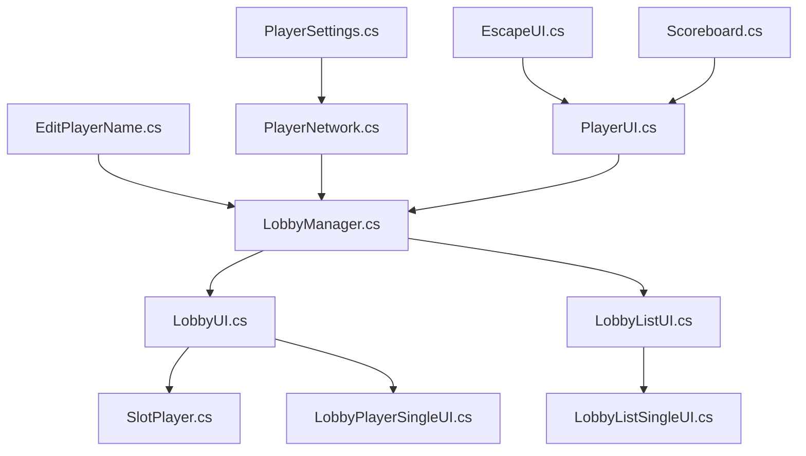
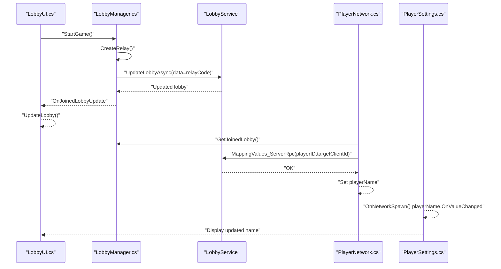
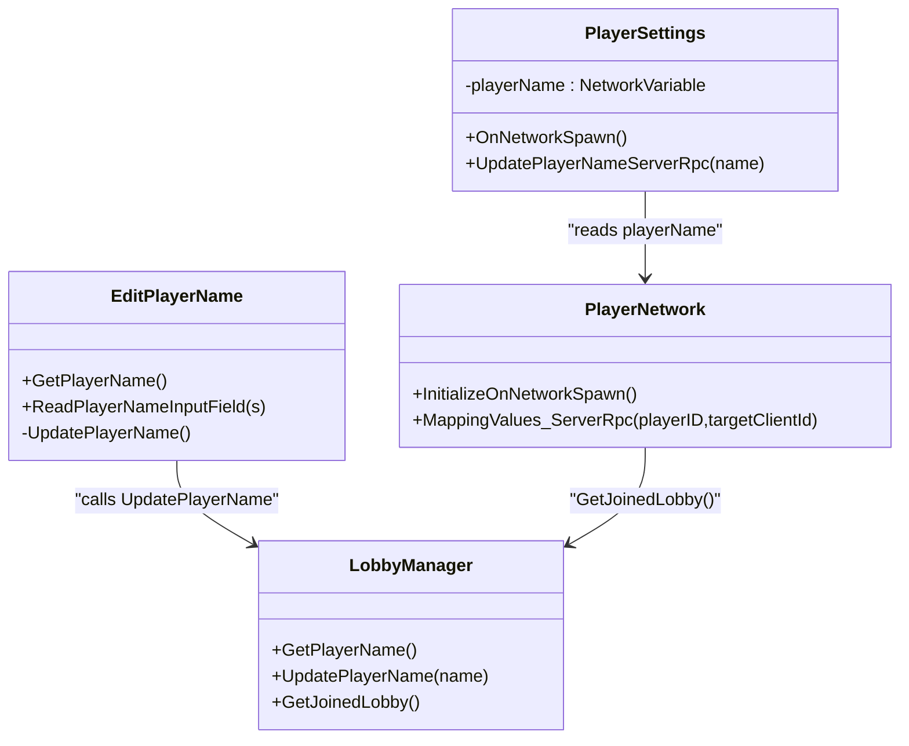
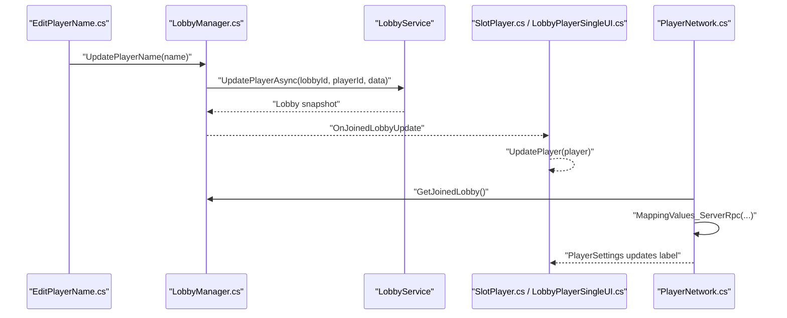
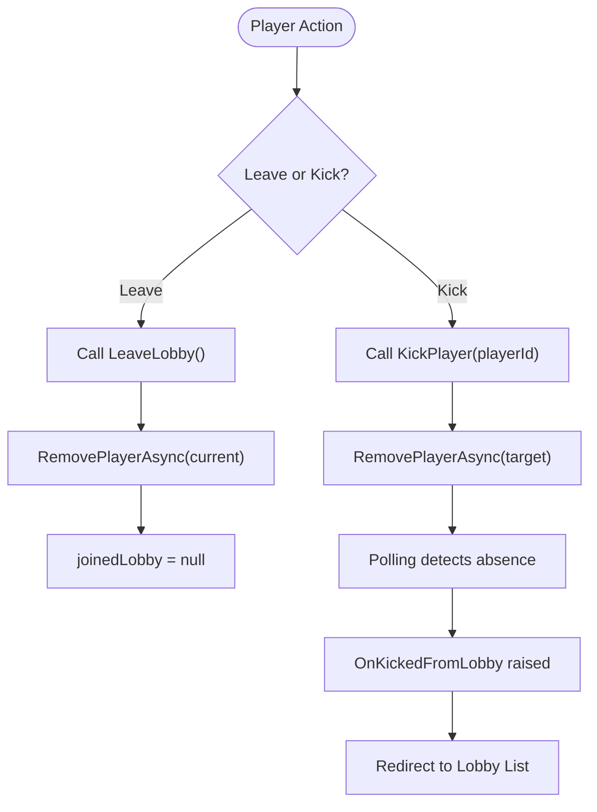
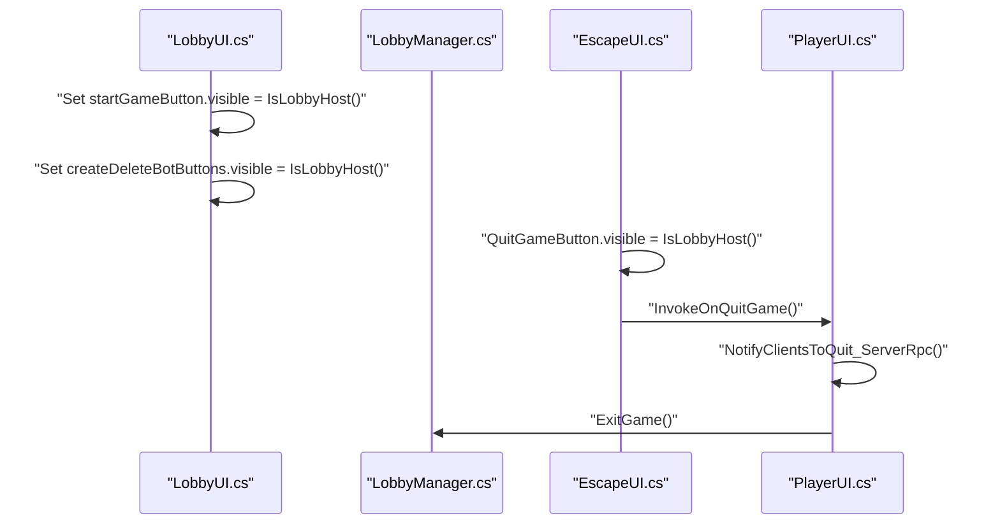
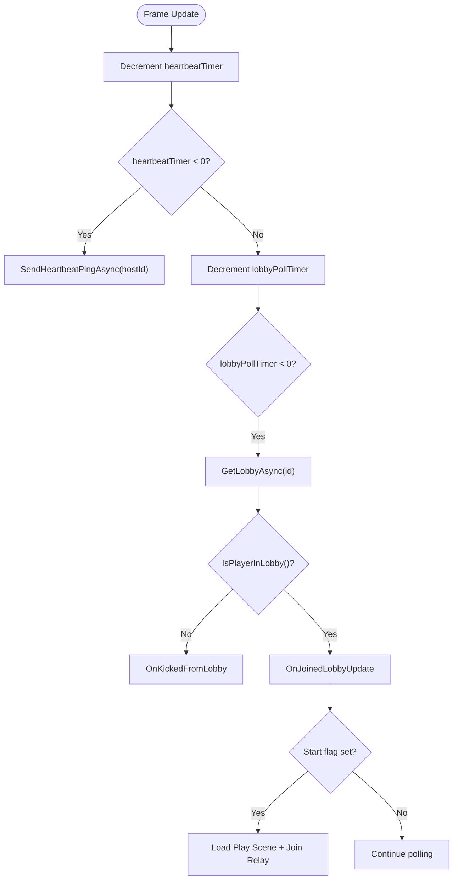
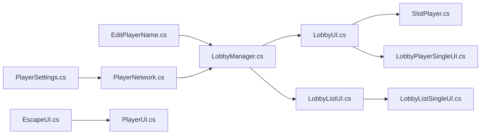

# Player Management

<cite>
**Referenced Files in This Document**
- [LobbyManager.cs](file://Assets/FPS-Game/Scripts/Lobby%20Script/Lobby/Scripts/LobbyManager.cs)
- [LobbyUI.cs](file://Assets/FPS-Game/Scripts/Lobby%20Script/Lobby/Scripts/LobbyUI.cs)
- [LobbyListUI.cs](file://Assets/FPS-Game/Scripts/Lobby%20Script/Lobby/Scripts/LobbyListUI.cs)
- [LobbyListSingleUI.cs](file://Assets/FPS-Game/Scripts/Lobby%20Script/Lobby/Scripts/LobbyListSingleUI.cs)
- [SlotPlayer.cs](file://Assets/FPS-Game/Scripts/Lobby%20Script/Lobby/Scripts/SlotPlayer.cs)
- [LobbyPlayerSingleUI.cs](file://Assets/FPS-Game/Scripts/Lobby%20Script/Lobby/Scripts/LobbyPlayerSingleUI.cs)
- [EditPlayerName.cs](file://Assets/FPS-Game/Scripts/Lobby%20Script/Lobby/Scripts/EditPlayerName.cs)
- [PlayerNetwork.cs](file://Assets/FPS-Game/Scripts/Player/PlayerNetwork.cs)
- [PlayerSettings.cs](file://Assets/FPS-Game/Scripts/Lobby%20Script/Lobby/Scripts/PlayerSettings.cs)
- [EscapeUI.cs](file://Assets/FPS-Game/Scripts/Player/PlayerCanvas/EscapeUI.cs)
- [PlayerUI.cs](file://Assets/FPS-Game/Scripts/Player/PlayerUI.cs)
- [Scoreboard.cs](file://Assets/FPS-Game/Scripts/Scoreboard.cs)
</cite>

## Table of Contents
1. [Introduction](#introduction)
2. [Project Structure](#project-structure)
3. [Core Components](#core-components)
4. [Architecture Overview](#architecture-overview)
5. [Detailed Component Analysis](#detailed-component-analysis)
6. [Dependency Analysis](#dependency-analysis)
7. [Performance Considerations](#performance-considerations)
8. [Troubleshooting Guide](#troubleshooting-guide)
9. [Conclusion](#conclusion)

## Introduction
This document explains player management within the lobby system. It covers how players are identified and represented, how names and selections are handled, how updates propagate across the lobby, how players are removed (kicking and leaving), and how UI surfaces reflect state changes. It also documents host privileges, moderation controls, and automated features such as heartbeat and polling. Practical examples show how to implement player lists, handle state changes, manage permissions, and troubleshoot synchronization issues.

## Project Structure
The lobby and player management logic spans several scripts:
- Lobby orchestration and persistence: LobbyManager
- UI for lobby list, room, and per-player slots: LobbyListUI, LobbyUI, LobbyListSingleUI, SlotPlayer, LobbyPlayerSingleUI
- Player identity and name synchronization: EditPlayerName, PlayerSettings, PlayerNetwork
- Host controls and moderation: EscapeUI, PlayerUI
- Scoreboard integration: Scoreboard

**Diagram sources**
- [LobbyManager.cs:13-589](file://Assets/FPS-Game/Scripts/Lobby%20Script/Lobby/Scripts/LobbyManager.cs#L13-L589)
- [LobbyUI.cs:6-180](file://Assets/FPS-Game/Scripts/Lobby%20Script/Lobby/Scripts/LobbyUI.cs#L6-L180)
- [LobbyListUI.cs:10-191](file://Assets/FPS-Game/Scripts/Lobby%20Script/Lobby/Scripts/LobbyListUI.cs#L10-L191)
- [LobbyListSingleUI.cs:8-33](file://Assets/FPS-Game/Scripts/Lobby%20Script/Lobby/Scripts/LobbyListSingleUI.cs#L8-L33)
- [SlotPlayer.cs:8-59](file://Assets/FPS-Game/Scripts/Lobby%20Script/Lobby/Scripts/SlotPlayer.cs#L8-L59)
- [LobbyPlayerSingleUI.cs:8-42](file://Assets/FPS-Game/Scripts/Lobby%20Script/Lobby/Scripts/LobbyPlayerSingleUI.cs#L8-L42)
- [EditPlayerName.cs:6-47](file://Assets/FPS-Game/Scripts/Lobby%20Script/Lobby/Scripts/EditPlayerName.cs#L6-L47)
- [PlayerSettings.cs:7-41](file://Assets/FPS-Game/Scripts/Lobby%20Script/Lobby/Scripts/PlayerSettings.cs#L7-L41)
- [PlayerNetwork.cs:12-541](file://Assets/FPS-Game/Scripts/Player/PlayerNetwork.cs#L12-L541)
- [EscapeUI.cs:5-18](file://Assets/FPS-Game/Scripts/Player/PlayerCanvas/EscapeUI.cs#L5-L18)
- [PlayerUI.cs:128-191](file://Assets/FPS-Game/Scripts/Player/PlayerUI.cs#L128-L191)
- [Scoreboard.cs:1-46](file://Assets/FPS-Game/Scripts/Scoreboard.cs#L1-L46)

**Section sources**
- [LobbyManager.cs:13-589](file://Assets/FPS-Game/Scripts/Lobby%20Script/Lobby/Scripts/LobbyManager.cs#L13-L589)
- [LobbyUI.cs:6-180](file://Assets/FPS-Game/Scripts/Lobby%20Script/Lobby/Scripts/LobbyUI.cs#L6-L180)
- [LobbyListUI.cs:10-191](file://Assets/FPS-Game/Scripts/Lobby%20Script/Lobby/Scripts/LobbyListUI.cs#L10-L191)
- [LobbyListSingleUI.cs:8-33](file://Assets/FPS-Game/Scripts/Lobby%20Script/Lobby/Scripts/LobbyListSingleUI.cs#L8-L33)
- [SlotPlayer.cs:8-59](file://Assets/FPS-Game/Scripts/Lobby%20Script/Lobby/Scripts/SlotPlayer.cs#L8-L59)
- [LobbyPlayerSingleUI.cs:8-42](file://Assets/FPS-Game/Scripts/Lobby%20Script/Lobby/Scripts/LobbyPlayerSingleUI.cs#L8-L42)
- [EditPlayerName.cs:6-47](file://Assets/FPS-Game/Scripts/Lobby%20Script/Lobby/Scripts/EditPlayerName.cs#L6-L47)
- [PlayerSettings.cs:7-41](file://Assets/FPS-Game/Scripts/Lobby%20Script/Lobby/Scripts/PlayerSettings.cs#L7-L41)
- [PlayerNetwork.cs:12-541](file://Assets/FPS-Game/Scripts/Player/PlayerNetwork.cs#L12-L541)
- [EscapeUI.cs:5-18](file://Assets/FPS-Game/Scripts/Player/PlayerCanvas/EscapeUI.cs#L5-L18)
- [PlayerUI.cs:128-191](file://Assets/FPS-Game/Scripts/Player/PlayerUI.cs#L128-L191)
- [Scoreboard.cs:1-46](file://Assets/FPS-Game/Scripts/Scoreboard.cs#L1-L46)

## Core Components
- Player identification and metadata
  - Player identity is derived from the authentication service and stored in lobby data under a dedicated key.
  - Player name is a lobby-level player data field synchronized via the lobby service and propagated to clients.
- Player update operations
  - Name updates are sent to the lobby service and broadcast to listeners; UI updates react to lobby change events.
  - Bot count updates are coordinated via lobby data and validated against capacity.
- Player removal
  - Leaving a lobby removes the player from the lobby’s membership.
  - Kicking requires host privileges and removes a specific player by ID.
- Host privileges and moderation
  - Host controls start game, create/delete bots, and kick players.
  - Non-hosts cannot see kick buttons or start-game button.
- Automated management
  - Heartbeat ping maintains presence for hosted lobbies.
  - Polling fetches latest lobby state and triggers scene transitions when the game starts.

**Section sources**
- [LobbyManager.cs:17-24](file://Assets/FPS-Game/Scripts/Lobby%20Script/Lobby/Scripts/LobbyManager.cs#L17-L24)
- [LobbyManager.cs:213-232](file://Assets/FPS-Game/Scripts/Lobby%20Script/Lobby/Scripts/LobbyManager.cs#L213-L232)
- [LobbyManager.cs:356-392](file://Assets/FPS-Game/Scripts/Lobby%20Script/Lobby/Scripts/LobbyManager.cs#L356-L392)
- [LobbyManager.cs:394-436](file://Assets/FPS-Game/Scripts/Lobby%20Script/Lobby/Scripts/LobbyManager.cs#L394-L436)
- [LobbyManager.cs:485-505](file://Assets/FPS-Game/Scripts/Lobby%20Script/Lobby/Scripts/LobbyManager.cs#L485-L505)
- [LobbyManager.cs:507-520](file://Assets/FPS-Game/Scripts/Lobby%20Script/Lobby/Scripts/LobbyManager.cs#L507-L520)
- [LobbyManager.cs:122-136](file://Assets/FPS-Game/Scripts/Lobby%20Script/Lobby/Scripts/LobbyManager.cs#L122-L136)
- [LobbyManager.cs:138-205](file://Assets/FPS-Game/Scripts/Lobby%20Script/Lobby/Scripts/LobbyManager.cs#L138-L205)
- [LobbyUI.cs:29-86](file://Assets/FPS-Game/Scripts/Lobby%20Script/Lobby/Scripts/LobbyUI.cs#L29-L86)
- [LobbyUI.cs:158-163](file://Assets/FPS-Game/Scripts/Lobby%20Script/Lobby/Scripts/LobbyUI.cs#L158-L163)
- [SlotPlayer.cs:19-32](file://Assets/FPS-Game/Scripts/Lobby%20Script/Lobby/Scripts/SlotPlayer.cs#L19-L32)
- [LobbyPlayerSingleUI.cs:19-25](file://Assets/FPS-Game/Scripts/Lobby%20Script/Lobby/Scripts/LobbyPlayerSingleUI.cs#L19-L25)

## Architecture Overview
The lobby system integrates Unity Services for authentication and lobby operations with Unity Netcode for in-scene player synchronization. The flow below shows how lobby state changes propagate to UI and in-game systems.

**Diagram sources**
- [LobbyUI.cs:69-74](file://Assets/FPS-Game/Scripts/Lobby%20Script/Lobby/Scripts/LobbyUI.cs#L69-L74)
- [LobbyManager.cs:545-569](file://Assets/FPS-Game/Scripts/Lobby%20Script/Lobby/Scripts/LobbyManager.cs#L545-L569)
- [PlayerNetwork.cs:183-199](file://Assets/FPS-Game/Scripts/Player/PlayerNetwork.cs#L183-L199)
- [PlayerSettings.cs:15-32](file://Assets/FPS-Game/Scripts/Lobby%20Script/Lobby/Scripts/PlayerSettings.cs#L15-L32)

## Detailed Component Analysis

### Player Identification and Name Management
- Identity
  - Player identity is the authenticated user ID.
  - When joining or creating a lobby, a player object is constructed with public data including name.
- Name storage and propagation
  - Name is stored in lobby player data under a constant key.
  - Editing the name updates the lobby player data and triggers UI updates.
  - In-scene, PlayerSettings reads a network variable for the player name and updates the UI label automatically.

**Diagram sources**
- [LobbyManager.cs:73-77](file://Assets/FPS-Game/Scripts/Lobby%20Script/Lobby/Scripts/LobbyManager.cs#L73-L77)
- [LobbyManager.cs:356-392](file://Assets/FPS-Game/Scripts/Lobby%20Script/Lobby/Scripts/LobbyManager.cs#L356-L392)
- [EditPlayerName.cs:15-47](file://Assets/FPS-Game/Scripts/Lobby%20Script/Lobby/Scripts/EditPlayerName.cs#L15-L47)
- [PlayerSettings.cs:7-41](file://Assets/FPS-Game/Scripts/Lobby%20Script/Lobby/Scripts/PlayerSettings.cs#L7-L41)
- [PlayerNetwork.cs:20-54](file://Assets/FPS-Game/Scripts/Player/PlayerNetwork.cs#L20-L54)
- [PlayerNetwork.cs:183-199](file://Assets/FPS-Game/Scripts/Player/PlayerNetwork.cs#L183-L199)

**Section sources**
- [LobbyManager.cs:234-240](file://Assets/FPS-Game/Scripts/Lobby%20Script/Lobby/Scripts/LobbyManager.cs#L234-L240)
- [LobbyManager.cs:356-392](file://Assets/FPS-Game/Scripts/Lobby%20Script/Lobby/Scripts/LobbyManager.cs#L356-L392)
- [EditPlayerName.cs:15-47](file://Assets/FPS-Game/Scripts/Lobby%20Script/Lobby/Scripts/EditPlayerName.cs#L15-L47)
- [PlayerSettings.cs:7-41](file://Assets/FPS-Game/Scripts/Lobby%20Script/Lobby/Scripts/PlayerSettings.cs#L7-L41)
- [PlayerNetwork.cs:183-199](file://Assets/FPS-Game/Scripts/Player/PlayerNetwork.cs#L183-L199)

### Character Selection
- The codebase defines a constant key for character selection and includes commented logic for updating a player’s selected character in lobby data.
- UI components for character sprites are present but disabled in the current build; character selection is not active until the feature is enabled.

Practical notes:
- To enable character selection, uncomment and wire the relevant methods in LobbyManager and UI components.
- Ensure sprite assets are loaded via a shared asset registry and exposed through a lookup method.

**Section sources**
- [LobbyManager.cs:17-21](file://Assets/FPS-Game/Scripts/Lobby%20Script/Lobby/Scripts/LobbyManager.cs#L17-L21)
- [LobbyManager.cs:438-466](file://Assets/FPS-Game/Scripts/Lobby%20Script/Lobby/Scripts/LobbyManager.cs#L438-L466)
- [LobbyPlayerSingleUI.cs:29-33](file://Assets/FPS-Game/Scripts/Lobby%20Script/Lobby/Scripts/LobbyPlayerSingleUI.cs#L29-L33)
- [SlotPlayer.cs:42-44](file://Assets/FPS-Game/Scripts/Lobby%20Script/Lobby/Scripts/SlotPlayer.cs#L42-L44)

### Player Update Operations
- Name updates
  - EditPlayerName captures input and calls LobbyManager.UpdatePlayerName, which updates the lobby player data and refreshes the lobby snapshot.
  - UI reacts to OnJoinedLobbyUpdate to refresh player list entries.
- Bot number updates
  - Hosts can increase/decrease bot count; the system validates capacity and updates lobby data accordingly.
- Synchronization
  - PlayerNetwork.MappingValues_ServerRpc propagates the latest lobby name to in-scene players.

**Diagram sources**
- [EditPlayerName.cs:35-47](file://Assets/FPS-Game/Scripts/Lobby%20Script/Lobby/Scripts/EditPlayerName.cs#L35-L47)
- [LobbyManager.cs:356-392](file://Assets/FPS-Game/Scripts/Lobby%20Script/Lobby/Scripts/LobbyManager.cs#L356-L392)
- [SlotPlayer.cs:34-50](file://Assets/FPS-Game/Scripts/Lobby%20Script/Lobby/Scripts/SlotPlayer.cs#L34-L50)
- [LobbyPlayerSingleUI.cs:27-33](file://Assets/FPS-Game/Scripts/Lobby%20Script/Lobby/Scripts/LobbyPlayerSingleUI.cs#L27-L33)
- [PlayerNetwork.cs:183-199](file://Assets/FPS-Game/Scripts/Player/PlayerNetwork.cs#L183-L199)

**Section sources**
- [EditPlayerName.cs:35-47](file://Assets/FPS-Game/Scripts/Lobby%20Script/Lobby/Scripts/EditPlayerName.cs#L35-L47)
- [LobbyManager.cs:356-392](file://Assets/FPS-Game/Scripts/Lobby%20Script/Lobby/Scripts/LobbyManager.cs#L356-L392)
- [SlotPlayer.cs:34-50](file://Assets/FPS-Game/Scripts/Lobby%20Script/Lobby/Scripts/SlotPlayer.cs#L34-L50)
- [LobbyPlayerSingleUI.cs:27-33](file://Assets/FPS-Game/Scripts/Lobby%20Script/Lobby/Scripts/LobbyPlayerSingleUI.cs#L27-L33)
- [PlayerNetwork.cs:183-199](file://Assets/FPS-Game/Scripts/Player/PlayerNetwork.cs#L183-L199)

### Player Removal (Kick and Leave)
- Leave lobby
  - Removes the current player from the lobby and resets the joined lobby state.
- Kick player
  - Host-only operation that removes another player by ID.
- UI behavior
  - Kick buttons are only visible to hosts.
  - When a player is kicked, the lobby polling detects absence and raises a kick event.

**Diagram sources**
- [LobbyManager.cs:485-520](file://Assets/FPS-Game/Scripts/Lobby%20Script/Lobby/Scripts/LobbyManager.cs#L485-L520)
- [LobbyUI.cs:54-57](file://Assets/FPS-Game/Scripts/Lobby%20Script/Lobby/Scripts/LobbyUI.cs#L54-L57)
- [SlotPlayer.cs:52-58](file://Assets/FPS-Game/Scripts/Lobby%20Script/Lobby/Scripts/SlotPlayer.cs#L52-L58)
- [LobbyPlayerSingleUI.cs:35-39](file://Assets/FPS-Game/Scripts/Lobby%20Script/Lobby/Scripts/LobbyPlayerSingleUI.cs#L35-L39)

**Section sources**
- [LobbyManager.cs:485-520](file://Assets/FPS-Game/Scripts/Lobby%20Script/Lobby/Scripts/LobbyManager.cs#L485-L520)
- [LobbyUI.cs:54-57](file://Assets/FPS-Game/Scripts/Lobby%20Script/Lobby/Scripts/LobbyUI.cs#L54-L57)
- [SlotPlayer.cs:52-58](file://Assets/FPS-Game/Scripts/Lobby%20Script/Lobby/Scripts/SlotPlayer.cs#L52-L58)
- [LobbyPlayerSingleUI.cs:35-39](file://Assets/FPS-Game/Scripts/Lobby%20Script/Lobby/Scripts/LobbyPlayerSingleUI.cs#L35-L39)

### Host Privileges and Moderation
- Host-only actions
  - Start game, create/delete bots, kick players, and see host-only UI elements.
- UI gating
  - Kick buttons and start button visibility depend on host checks.
  - Escape menu quit button is hidden for non-hosts.

**Diagram sources**
- [LobbyUI.cs:158-159](file://Assets/FPS-Game/Scripts/Lobby%20Script/Lobby/Scripts/LobbyUI.cs#L158-L159)
- [LobbyUI.cs:69-74](file://Assets/FPS-Game/Scripts/Lobby%20Script/Lobby/Scripts/LobbyUI.cs#L69-L74)
- [EscapeUI.cs:9-17](file://Assets/FPS-Game/Scripts/Player/PlayerCanvas/EscapeUI.cs#L9-L17)
- [PlayerUI.cs:140-158](file://Assets/FPS-Game/Scripts/Player/PlayerUI.cs#L140-L158)
- [LobbyManager.cs:571-588](file://Assets/FPS-Game/Scripts/Lobby%20Script/Lobby/Scripts/LobbyManager.cs#L571-L588)

**Section sources**
- [LobbyUI.cs:158-159](file://Assets/FPS-Game/Scripts/Lobby%20Script/Lobby/Scripts/LobbyUI.cs#L158-L159)
- [LobbyUI.cs:69-74](file://Assets/FPS-Game/Scripts/Lobby%20Script/Lobby/Scripts/LobbyUI.cs#L69-L74)
- [EscapeUI.cs:9-17](file://Assets/FPS-Game/Scripts/Player/PlayerCanvas/EscapeUI.cs#L9-L17)
- [PlayerUI.cs:140-158](file://Assets/FPS-Game/Scripts/Player/PlayerUI.cs#L140-L158)
- [LobbyManager.cs:571-588](file://Assets/FPS-Game/Scripts/Lobby%20Script/Lobby/Scripts/LobbyManager.cs#L571-L588)

### Automated Player Management Features
- Heartbeat
  - Host pings the lobby periodically to maintain presence.
- Polling
  - Regularly fetches the latest lobby snapshot, detects kicks, and initiates gameplay when the host starts the game.
- Lobby list refresh
  - Periodic refresh of open lobbies with filters and ordering.

**Diagram sources**
- [LobbyManager.cs:79-84](file://Assets/FPS-Game/Scripts/Lobby%20Script/Lobby/Scripts/LobbyManager.cs#L79-L84)
- [LobbyManager.cs:122-136](file://Assets/FPS-Game/Scripts/Lobby%20Script/Lobby/Scripts/LobbyManager.cs#L122-L136)
- [LobbyManager.cs:138-205](file://Assets/FPS-Game/Scripts/Lobby%20Script/Lobby/Scripts/LobbyManager.cs#L138-L205)
- [LobbyManager.cs:288-319](file://Assets/FPS-Game/Scripts/Lobby%20Script/Lobby/Scripts/LobbyManager.cs#L288-L319)

**Section sources**
- [LobbyManager.cs:79-84](file://Assets/FPS-Game/Scripts/Lobby%20Script/Lobby/Scripts/LobbyManager.cs#L79-L84)
- [LobbyManager.cs:122-136](file://Assets/FPS-Game/Scripts/Lobby%20Script/Lobby/Scripts/LobbyManager.cs#L122-L136)
- [LobbyManager.cs:138-205](file://Assets/FPS-Game/Scripts/Lobby%20Script/Lobby/Scripts/LobbyManager.cs#L138-L205)
- [LobbyManager.cs:288-319](file://Assets/FPS-Game/Scripts/Lobby%20Script/Lobby/Scripts/LobbyManager.cs#L288-L319)

### Practical Examples

- Implement a player list display in the lobby room
  - Use SlotPlayer to bind a lobby player to a UI slot and update the name from lobby data.
  - For per-player entries in the room list, use LobbyPlayerSingleUI similarly.
  - Ensure kick buttons are only visible to hosts.

  **Section sources**
  - [SlotPlayer.cs:34-50](file://Assets/FPS-Game/Scripts/Lobby%20Script/Lobby/Scripts/SlotPlayer.cs#L34-L50)
  - [LobbyPlayerSingleUI.cs:27-33](file://Assets/FPS-Game/Scripts/Lobby%20Script/Lobby/Scripts/LobbyPlayerSingleUI.cs#L27-L33)
  - [LobbyUI.cs:158-159](file://Assets/FPS-Game/Scripts/Lobby%20Script/Lobby/Scripts/LobbyUI.cs#L158-L159)

- Handle player state changes (join/update/kick)
  - Subscribe to OnJoinedLobbyUpdate to refresh UI when lobby data changes.
  - Detect kicks via polling and redirect to the lobby list.

  **Section sources**
  - [LobbyListUI.cs:63-68](file://Assets/FPS-Game/Scripts/Lobby%20Script/Lobby/Scripts/LobbyListUI.cs#L63-L68)
  - [LobbyManager.cs:138-205](file://Assets/FPS-Game/Scripts/Lobby%20Script/Lobby/Scripts/LobbyManager.cs#L138-L205)

- Manage player permissions (host vs. member)
  - Gate UI elements using IsLobbyHost().
  - Disable kick/start buttons for non-hosts.

  **Section sources**
  - [LobbyUI.cs:158-159](file://Assets/FPS-Game/Scripts/Lobby%20Script/Lobby/Scripts/LobbyUI.cs#L158-L159)
  - [EscapeUI.cs:9-17](file://Assets/FPS-Game/Scripts/Player/PlayerCanvas/EscapeUI.cs#L9-L17)

- Synchronize player names across the lobby
  - Update lobby player data; UI listens to lobby updates.
  - In-scene, PlayerNetwork.MappingValues_ServerRpc ensures clients receive the latest name.

  **Section sources**
  - [LobbyManager.cs:356-392](file://Assets/FPS-Game/Scripts/Lobby%20Script/Lobby/Scripts/LobbyManager.cs#L356-L392)
  - [PlayerNetwork.cs:183-199](file://Assets/FPS-Game/Scripts/Player/PlayerNetwork.cs#L183-L199)
  - [PlayerSettings.cs:15-32](file://Assets/FPS-Game/Scripts/Lobby%20Script/Lobby/Scripts/PlayerSettings.cs#L15-L32)

- Display scoreboards and player stats
  - Use Scoreboard to request and render player info received from the in-game manager.

  **Section sources**
  - [Scoreboard.cs:20-46](file://Assets/FPS-Game/Scripts/Scoreboard.cs#L20-L46)

## Dependency Analysis
Key dependencies and interactions:
- LobbyManager orchestrates authentication, lobby lifecycle, and data updates.
- UI components subscribe to LobbyManager events to keep the lobby room and list up-to-date.
- PlayerNetwork depends on LobbyManager for lobby state and on PlayerSettings for in-scene name display.
- EscapeUI and PlayerUI coordinate host actions and scene transitions.

**Diagram sources**
- [LobbyManager.cs:13-589](file://Assets/FPS-Game/Scripts/Lobby%20Script/Lobby/Scripts/LobbyManager.cs#L13-L589)
- [LobbyUI.cs:6-180](file://Assets/FPS-Game/Scripts/Lobby%20Script/Lobby/Scripts/LobbyUI.cs#L6-L180)
- [LobbyListUI.cs:10-191](file://Assets/FPS-Game/Scripts/Lobby%20Script/Lobby/Scripts/LobbyListUI.cs#L10-L191)
- [LobbyListSingleUI.cs:8-33](file://Assets/FPS-Game/Scripts/Lobby%20Script/Lobby/Scripts/LobbyListSingleUI.cs#L8-L33)
- [SlotPlayer.cs:8-59](file://Assets/FPS-Game/Scripts/Lobby%20Script/Lobby/Scripts/SlotPlayer.cs#L8-L59)
- [LobbyPlayerSingleUI.cs:8-42](file://Assets/FPS-Game/Scripts/Lobby%20Script/Lobby/Scripts/LobbyPlayerSingleUI.cs#L8-L42)
- [EditPlayerName.cs:6-47](file://Assets/FPS-Game/Scripts/Lobby%20Script/Lobby/Scripts/EditPlayerName.cs#L6-L47)
- [PlayerNetwork.cs:12-541](file://Assets/FPS-Game/Scripts/Player/PlayerNetwork.cs#L12-L541)
- [PlayerSettings.cs:7-41](file://Assets/FPS-Game/Scripts/Lobby%20Script/Lobby/Scripts/PlayerSettings.cs#L7-L41)
- [EscapeUI.cs:5-18](file://Assets/FPS-Game/Scripts/Player/PlayerCanvas/EscapeUI.cs#L5-L18)
- [PlayerUI.cs:128-191](file://Assets/FPS-Game/Scripts/Player/PlayerUI.cs#L128-L191)

**Section sources**
- [LobbyManager.cs:13-589](file://Assets/FPS-Game/Scripts/Lobby%20Script/Lobby/Scripts/LobbyManager.cs#L13-L589)
- [LobbyUI.cs:6-180](file://Assets/FPS-Game/Scripts/Lobby%20Script/Lobby/Scripts/LobbyUI.cs#L6-L180)
- [LobbyListUI.cs:10-191](file://Assets/FPS-Game/Scripts/Lobby%20Script/Lobby/Scripts/LobbyListUI.cs#L10-L191)
- [LobbyListSingleUI.cs:8-33](file://Assets/FPS-Game/Scripts/Lobby%20Script/Lobby/Scripts/LobbyListSingleUI.cs#L8-L33)
- [SlotPlayer.cs:8-59](file://Assets/FPS-Game/Scripts/Lobby%20Script/Lobby/Scripts/SlotPlayer.cs#L8-L59)
- [LobbyPlayerSingleUI.cs:8-42](file://Assets/FPS-Game/Scripts/Lobby%20Script/Lobby/Scripts/LobbyPlayerSingleUI.cs#L8-L42)
- [EditPlayerName.cs:6-47](file://Assets/FPS-Game/Scripts/Lobby%20Script/Lobby/Scripts/EditPlayerName.cs#L6-L47)
- [PlayerNetwork.cs:12-541](file://Assets/FPS-Game/Scripts/Player/PlayerNetwork.cs#L12-L541)
- [PlayerSettings.cs:7-41](file://Assets/FPS-Game/Scripts/Lobby%20Script/Lobby/Scripts/PlayerSettings.cs#L7-L41)
- [EscapeUI.cs:5-18](file://Assets/FPS-Game/Scripts/Player/PlayerCanvas/EscapeUI.cs#L5-L18)
- [PlayerUI.cs:128-191](file://Assets/FPS-Game/Scripts/Player/PlayerUI.cs#L128-L191)

## Performance Considerations
- Minimize redundant UI rebuilds by reusing templates and only updating changed fields.
- Debounce lobby list refreshes and polling intervals to reduce network load.
- Avoid frequent full snapshots; listen to targeted events and update only affected UI nodes.
- Keep lobby data keys minimal and consistent to reduce payload sizes.

## Troubleshooting Guide
- Name not updating in lobby list
  - Verify EditPlayerName calls LobbyManager.UpdatePlayerName and that OnJoinedLobbyUpdate is firing.
  - Confirm SlotPlayer/LobbyPlayerSingleUI reads the name from lobby data and that UI is active.

  **Section sources**
  - [EditPlayerName.cs:35-47](file://Assets/FPS-Game/Scripts/Lobby%20Script/Lobby/Scripts/EditPlayerName.cs#L35-L47)
  - [LobbyManager.cs:356-392](file://Assets/FPS-Game/Scripts/Lobby%20Script/Lobby/Scripts/LobbyManager.cs#L356-L392)
  - [SlotPlayer.cs:34-50](file://Assets/FPS-Game/Scripts/Lobby%20Script/Lobby/Scripts/SlotPlayer.cs#L34-L50)
  - [LobbyPlayerSingleUI.cs:27-33](file://Assets/FPS-Game/Scripts/Lobby%20Script/Lobby/Scripts/LobbyPlayerSingleUI.cs#L27-L33)

- In-scene name not reflecting lobby name
  - Ensure PlayerNetwork.MappingValues_ServerRpc is invoked after joining and that PlayerSettings’ network variable triggers UI updates.

  **Section sources**
  - [PlayerNetwork.cs:183-199](file://Assets/FPS-Game/Scripts/Player/PlayerNetwork.cs#L183-L199)
  - [PlayerSettings.cs:15-32](file://Assets/FPS-Game/Scripts/Lobby%20Script/Lobby/Scripts/PlayerSettings.cs#L15-L32)

- Cannot kick players
  - Confirm the current user is the host and that kick buttons are visible.
  - Ensure the target player exists in the lobby before kicking.

  **Section sources**
  - [LobbyUI.cs:158-159](file://Assets/FPS-Game/Scripts/Lobby%20Script/Lobby/Scripts/LobbyUI.cs#L158-L159)
  - [SlotPlayer.cs:52-58](file://Assets/FPS-Game/Scripts/Lobby%20Script/Lobby/Scripts/SlotPlayer.cs#L52-L58)
  - [LobbyPlayerSingleUI.cs:35-39](file://Assets/FPS-Game/Scripts/Lobby%20Script/Lobby/Scripts/LobbyPlayerSingleUI.cs#L35-L39)
  - [LobbyManager.cs:213-232](file://Assets/FPS-Game/Scripts/Lobby%20Script/Lobby/Scripts/LobbyManager.cs#L213-L232)

- Lobby list not refreshing
  - Check that authentication is initialized and that refresh timers are not blocked.
  - Verify the filter and order settings match expectations.

  **Section sources**
  - [LobbyManager.cs:106-120](file://Assets/FPS-Game/Scripts/Lobby%20Script/Lobby/Scripts/LobbyManager.cs#L106-L120)
  - [LobbyManager.cs:288-319](file://Assets/FPS-Game/Scripts/Lobby%20Script/Lobby/Scripts/LobbyManager.cs#L288-L319)
  - [LobbyListUI.cs:32-35](file://Assets/FPS-Game/Scripts/Lobby%20Script/Lobby/Scripts/LobbyListUI.cs#L32-L35)

- Game does not start despite host click
  - Confirm the host created a relay and updated lobby data with the start flag.
  - Ensure polling detects the start flag and loads the play scene.

  **Section sources**
  - [LobbyManager.cs:545-569](file://Assets/FPS-Game/Scripts/Lobby%20Script/Lobby/Scripts/LobbyManager.cs#L545-L569)
  - [LobbyManager.cs:138-205](file://Assets/FPS-Game/Scripts/Lobby%20Script/Lobby/Scripts/LobbyManager.cs#L138-L205)

- Host quit mid-session
  - EscapeUI invokes a quit event; PlayerUI broadcasts a quit signal to clients and exits to the lobby.

  **Section sources**
  - [EscapeUI.cs:9-17](file://Assets/FPS-Game/Scripts/Player/PlayerCanvas/EscapeUI.cs#L9-L17)
  - [PlayerUI.cs:140-158](file://Assets/FPS-Game/Scripts/Player/PlayerUI.cs#L140-L158)
  - [LobbyManager.cs:571-588](file://Assets/FPS-Game/Scripts/Lobby%20Script/Lobby/Scripts/LobbyManager.cs#L571-L588)

## Conclusion
The lobby system provides robust mechanisms for player identity, name management, and moderation. By leveraging lobby events, host-only controls, and automated heartbeat/polling, it keeps the UI synchronized and enables smooth gameplay transitions. Extending character selection and enabling UI toggles for host-only features completes the player management suite. The troubleshooting guidance helps diagnose common synchronization and permission edge cases.