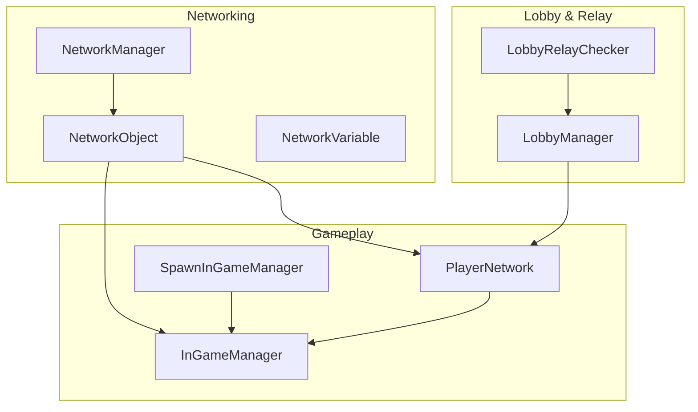
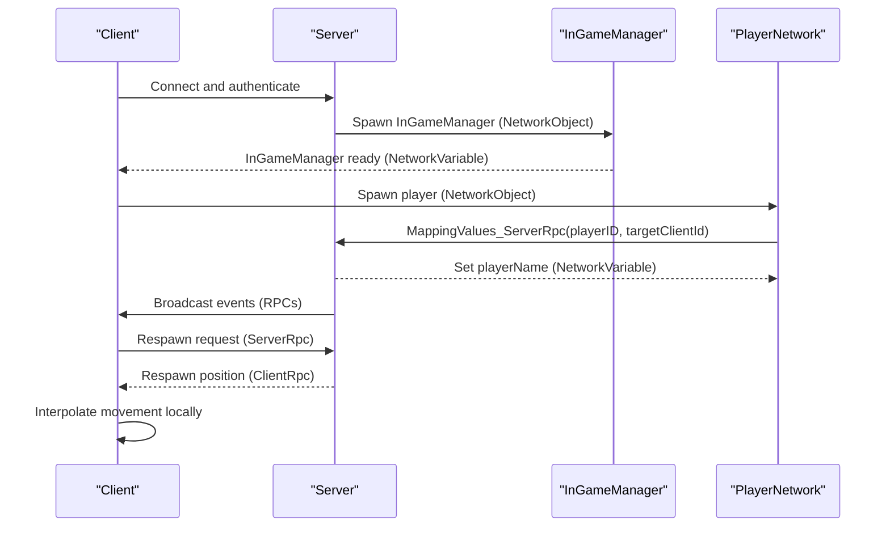
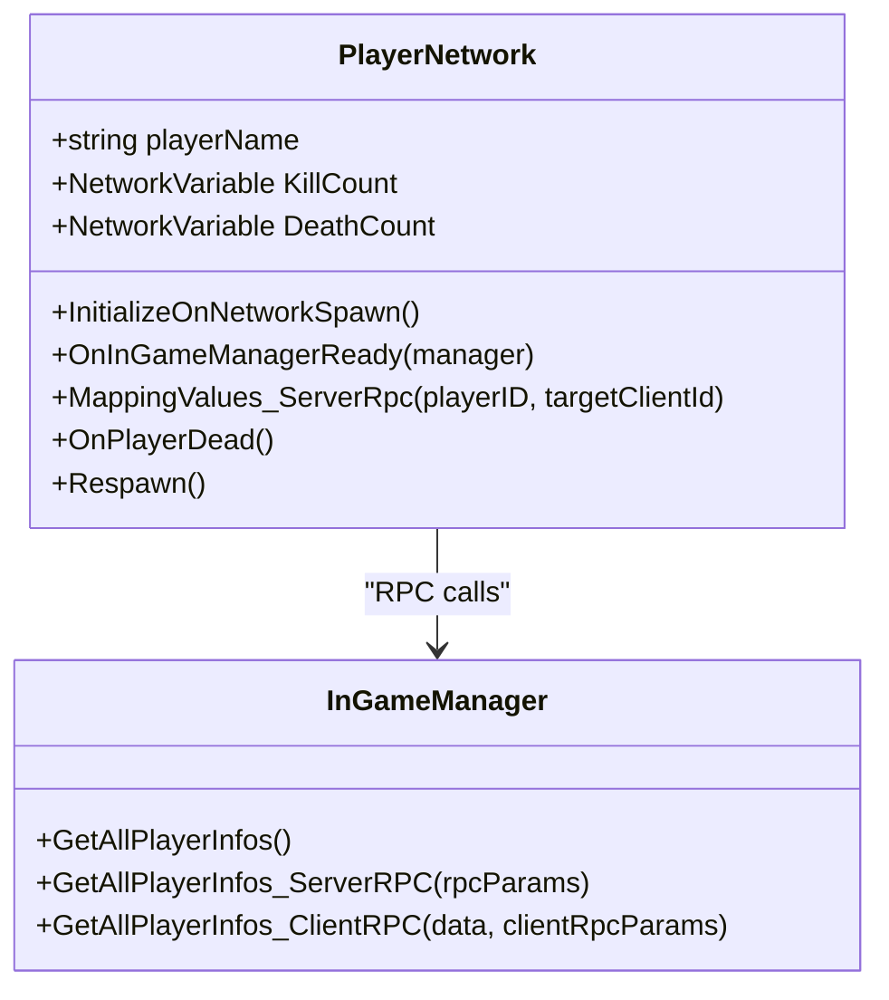
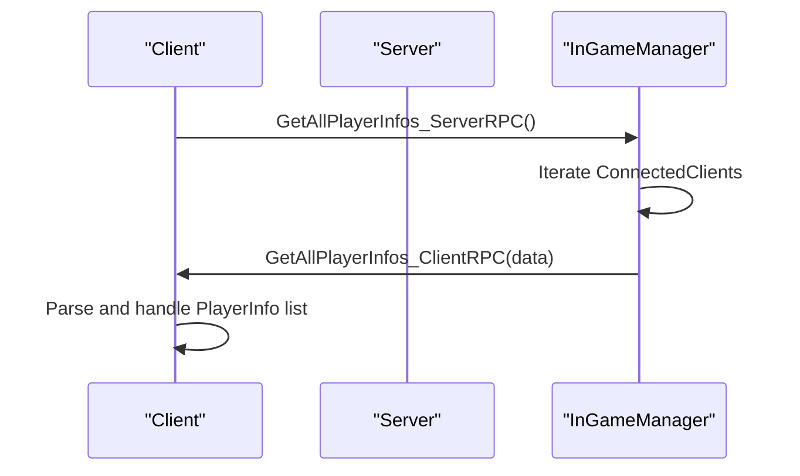
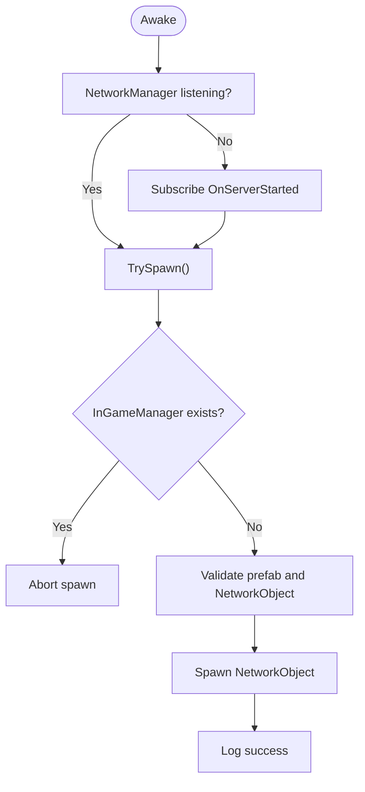
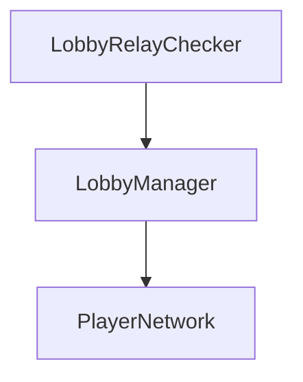
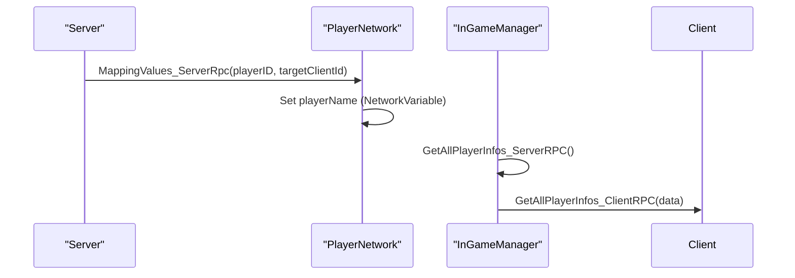
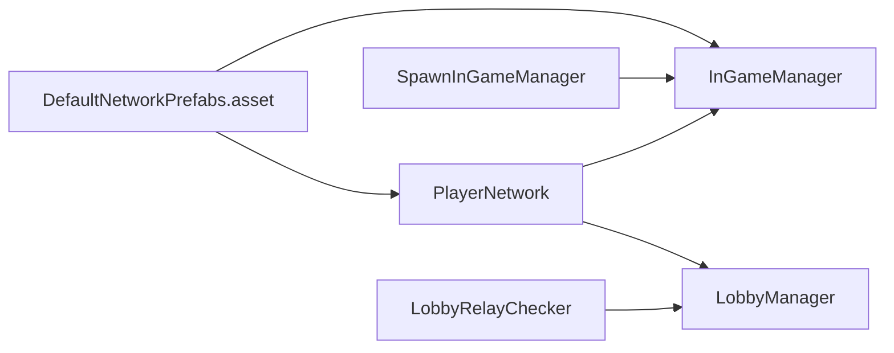

# Multiplayer System

<cite>
**Referenced Files in This Document**
- [DefaultNetworkPrefabs.asset](file://Assets/DefaultNetworkPrefabs.asset)
- [PlayerNetwork.cs](file://Assets/FPS-Game/Scripts/Player/PlayerNetwork.cs)
- [InGameManager.cs](file://Assets/FPS-Game/Scripts/System/InGameManager.cs)
- [SpawnInGameManager.cs](file://Assets/FPS-Game/Scripts/System/SpawnInGameManager.cs)
- [LobbyManager.cs](file://Assets/FPS-Game/Scripts/Lobby%20Script/Lobby/Scripts/LobbyManager.cs)
- [LobbyRelayChecker.cs](file://Assets/FPS-Game/Scripts/System/LobbyRelayChecker.cs)
- [PlayerInfo.cs](file://Assets/FPS-Game/Scripts/PlayerInfo.cs)
</cite>

## Table of Contents
1. [Introduction](#introduction)
2. [Project Structure](#project-structure)
3. [Core Components](#core-components)
4. [Architecture Overview](#architecture-overview)
5. [Detailed Component Analysis](#detailed-component-analysis)
6. [Dependency Analysis](#dependency-analysis)
7. [Performance Considerations](#performance-considerations)
8. [Troubleshooting Guide](#troubleshooting-guide)
9. [Conclusion](#conclusion)
10. [Appendices](#appendices)

## Introduction
This document explains the multiplayer system built with Unity Netcode for GameObjects and Unity Gaming Services. It focuses on a server-authoritative model, client-host topology, and the integration of Relay, Lobby, and Authentication. It also documents lobby management, player authentication, lobby creation/joining, matchmaking coordination, and server-authoritative gameplay with client interpolation and state synchronization patterns. Practical examples demonstrate networked object spawning, player synchronization, and event broadcasting across clients.

## Project Structure
The multiplayer system spans several subsystems:
- Networking foundation: Netcode for GameObjects with NetworkObject and NetworkVariable.
- In-game manager: central server-authoritative orchestration of gameplay state and RPCs.
- Player lifecycle: per-character state via NetworkVariable and server RPCs for synchronization.
- Lobby and Relay: Unity Gaming Services integration for matchmaking and relay connectivity.
- Spawning: server-driven early spawn of the in-game manager and controlled player respawns.

**Diagram sources**
- [PlayerNetwork.cs:12-220](file://Assets/FPS-Game/Scripts/Player/PlayerNetwork.cs#L12-L220)
- [InGameManager.cs:66-139](file://Assets/FPS-Game/Scripts/System/InGameManager.cs#L66-L139)
- [SpawnInGameManager.cs:5-70](file://Assets/FPS-Game/Scripts/System/SpawnInGameManager.cs#L5-L70)
- [LobbyManager.cs](file://Assets/FPS-Game/Scripts/Lobby%20Script/Lobby/Scripts/LobbyManager.cs)
- [LobbyRelayChecker.cs](file://Assets/FPS-Game/Scripts/System/LobbyRelayChecker.cs)

**Section sources**
- [DefaultNetworkPrefabs.asset:1-72](file://Assets/DefaultNetworkPrefabs.asset#L1-L72)
- [PlayerNetwork.cs:12-220](file://Assets/FPS-Game/Scripts/Player/PlayerNetwork.cs#L12-L220)
- [InGameManager.cs:66-139](file://Assets/FPS-Game/Scripts/System/InGameManager.cs#L66-L139)
- [SpawnInGameManager.cs:5-70](file://Assets/FPS-Game/Scripts/System/SpawnInGameManager.cs#L5-L70)
- [LobbyManager.cs](file://Assets/FPS-Game/Scripts/Lobby%20Script/Lobby/Scripts/LobbyManager.cs)
- [LobbyRelayChecker.cs](file://Assets/FPS-Game/Scripts/System/LobbyRelayChecker.cs)

## Core Components
- PlayerNetwork: per-player state and behavior, server-authoritative synchronization, and client interpolation toggles during respawn.
- InGameManager: server-authoritative gameplay manager, RPCs for cross-client broadcasts, and shared state via NetworkVariable.
- SpawnInGameManager: server-side spawn of the in-game manager to ensure deterministic initialization.
- LobbyManager and LobbyRelayChecker: Unity Gaming Services integration for lobby operations and relay connectivity checks.
- DefaultNetworkPrefabs: Netcode prefab registry for networked assets.

Key patterns:
- Server-authoritative: authoritative updates originate on the server and are propagated to clients via RPCs and NetworkVariable.
- Client-host: clients receive authoritative state and render interpolated movement locally.
- NetworkObject: all networked objects derive from NetworkObject; NetworkVariable encapsulates replicated state.
- RPCs: ServerRpc for authoritative commands and ClientRpc for targeted updates.

**Section sources**
- [PlayerNetwork.cs:12-220](file://Assets/FPS-Game/Scripts/Player/PlayerNetwork.cs#L12-L220)
- [InGameManager.cs:66-139](file://Assets/FPS-Game/Scripts/System/InGameManager.cs#L66-L139)
- [SpawnInGameManager.cs:5-70](file://Assets/FPS-Game/Scripts/System/SpawnInGameManager.cs#L5-L70)
- [LobbyManager.cs](file://Assets/FPS-Game/Scripts/Lobby%20Script/Lobby/Scripts/LobbyManager.cs)
- [LobbyRelayChecker.cs](file://Assets/FPS-Game/Scripts/System/LobbyRelayChecker.cs)
- [DefaultNetworkPrefabs.asset:1-72](file://Assets/DefaultNetworkPrefabs.asset#L1-L72)

## Architecture Overview
The system follows a server-authoritative model:
- Server spawns the in-game manager early and maintains authoritative state.
- Clients connect and receive initial state via NetworkVariable and RPCs.
- Player actions are processed server-authoritatively; clients interpolate movement locally.
- Unity Gaming Services handles authentication, lobby creation/joining, and relay connectivity.

**Diagram sources**
- [InGameManager.cs:141-194](file://Assets/FPS-Game/Scripts/System/InGameManager.cs#L141-L194)
- [PlayerNetwork.cs:183-199](file://Assets/FPS-Game/Scripts/Player/PlayerNetwork.cs#L183-L199)
- [SpawnInGameManager.cs:41-70](file://Assets/FPS-Game/Scripts/System/SpawnInGameManager.cs#L41-L70)

## Detailed Component Analysis

### PlayerNetwork: Server-Authoritative Player Lifecycle
PlayerNetwork encapsulates per-player state and behavior:
- NetworkVariable-based stats (kills, deaths) are synchronized automatically.
- OnNetworkSpawn initializes ownership-specific behavior, enabling scripts and camera setup for the local player.
- ServerRpc MappingValues_ServerRpc resolves player name from the joined lobby and applies it to the target client’s player object.
- Respawn logic triggers server-authoritative position updates via ClientRpc and toggles interpolation during transitions.

**Diagram sources**
- [PlayerNetwork.cs:12-220](file://Assets/FPS-Game/Scripts/Player/PlayerNetwork.cs#L12-L220)
- [InGameManager.cs:141-194](file://Assets/FPS-Game/Scripts/System/InGameManager.cs#L141-L194)

**Section sources**
- [PlayerNetwork.cs:12-220](file://Assets/FPS-Game/Scripts/Player/PlayerNetwork.cs#L12-L220)

### InGameManager: Server-Authoritative Gameplay Manager
InGameManager is a NetworkBehaviour that orchestrates server-authoritative gameplay:
- NetworkVariable for shared state (e.g., IsTimeOut).
- RPC pattern for cross-client broadcasts:
  - GetAllPlayerInfos_ServerRPC aggregates player info from connected clients.
  - GetAllPlayerInfos_ClientRPC parses and dispatches the aggregated data to listeners.
- Utility methods for pathfinding and zone management.

**Diagram sources**
- [InGameManager.cs:141-194](file://Assets/FPS-Game/Scripts/System/InGameManager.cs#L141-L194)

**Section sources**
- [InGameManager.cs:66-139](file://Assets/FPS-Game/Scripts/System/InGameManager.cs#L66-L139)
- [InGameManager.cs:141-194](file://Assets/FPS-Game/Scripts/System/InGameManager.cs#L141-L194)

### SpawnInGameManager: Early Server Spawn of InGameManager
Ensures the in-game manager exists before gameplay begins:
- Subscribes to NetworkManager.OnServerStarted.
- Instantiates the InGameManager prefab and spawns it as a NetworkObject.

**Diagram sources**
- [SpawnInGameManager.cs:20-70](file://Assets/FPS-Game/Scripts/System/SpawnInGameManager.cs#L20-L70)

**Section sources**
- [SpawnInGameManager.cs:5-70](file://Assets/FPS-Game/Scripts/System/SpawnInGameManager.cs#L5-L70)

### Lobby Management and Unity Gaming Services Integration
Lobby and Relay integration coordinates matchmaking and connectivity:
- LobbyManager manages lobby lifecycle and player lists.
- LobbyRelayChecker monitors relay availability and readiness.
- PlayerNetwork uses LobbyManager to resolve player names for synchronization.

**Diagram sources**
- [LobbyManager.cs](file://Assets/FPS-Game/Scripts/Lobby%20Script/Lobby/Scripts/LobbyManager.cs)
- [LobbyRelayChecker.cs](file://Assets/FPS-Game/Scripts/System/LobbyRelayChecker.cs)
- [PlayerNetwork.cs:183-199](file://Assets/FPS-Game/Scripts/Player/PlayerNetwork.cs#L183-L199)

**Section sources**
- [LobbyManager.cs](file://Assets/FPS-Game/Scripts/Lobby%20Script/Lobby/Scripts/LobbyManager.cs)
- [LobbyRelayChecker.cs](file://Assets/FPS-Game/Scripts/System/LobbyRelayChecker.cs)
- [PlayerNetwork.cs:183-199](file://Assets/FPS-Game/Scripts/Player/PlayerNetwork.cs#L183-L199)

### Network Synchronization Patterns
- NetworkVariable replication: PlayerNetwork uses NetworkVariable for KillCount and DeathCount; changes propagate automatically to clients.
- ServerRpc for authoritative commands: PlayerNetwork.MappingValues_ServerRpc sets player name from lobby data.
- ClientRpc for targeted updates: InGameManager.GetAllPlayerInfos_ClientRPC delivers aggregated player info to the requester.
- Interpolation toggling: During respawn, interpolation is disabled and re-enabled to smooth transitions.

**Diagram sources**
- [PlayerNetwork.cs:183-199](file://Assets/FPS-Game/Scripts/Player/PlayerNetwork.cs#L183-L199)
- [InGameManager.cs:141-194](file://Assets/FPS-Game/Scripts/System/InGameManager.cs#L141-L194)

**Section sources**
- [PlayerNetwork.cs:12-220](file://Assets/FPS-Game/Scripts/Player/PlayerNetwork.cs#L12-L220)
- [InGameManager.cs:141-194](file://Assets/FPS-Game/Scripts/System/InGameManager.cs#L141-L194)

## Dependency Analysis
- PlayerNetwork depends on InGameManager for RPCs and on LobbyManager for player name resolution.
- InGameManager depends on NetworkManager for client enumeration and RPC routing.
- SpawnInGameManager depends on NetworkManager and InGameManager prefab registration.
- DefaultNetworkPrefabs defines the global set of networked prefabs used by Netcode.

**Diagram sources**
- [DefaultNetworkPrefabs.asset:1-72](file://Assets/DefaultNetworkPrefabs.asset#L1-L72)
- [PlayerNetwork.cs:12-220](file://Assets/FPS-Game/Scripts/Player/PlayerNetwork.cs#L12-L220)
- [InGameManager.cs:66-139](file://Assets/FPS-Game/Scripts/System/InGameManager.cs#L66-L139)
- [SpawnInGameManager.cs:5-70](file://Assets/FPS-Game/Scripts/System/SpawnInGameManager.cs#L5-L70)
- [LobbyManager.cs](file://Assets/FPS-Game/Scripts/Lobby%20Script/Lobby/Scripts/LobbyManager.cs)
- [LobbyRelayChecker.cs](file://Assets/FPS-Game/Scripts/System/LobbyRelayChecker.cs)

**Section sources**
- [DefaultNetworkPrefabs.asset:1-72](file://Assets/DefaultNetworkPrefabs.asset#L1-L72)
- [PlayerNetwork.cs:12-220](file://Assets/FPS-Game/Scripts/Player/PlayerNetwork.cs#L12-L220)
- [InGameManager.cs:66-139](file://Assets/FPS-Game/Scripts/System/InGameManager.cs#L66-L139)
- [SpawnInGameManager.cs:5-70](file://Assets/FPS-Game/Scripts/System/SpawnInGameManager.cs#L5-L70)
- [LobbyManager.cs](file://Assets/FPS-Game/Scripts/Lobby%20Script/Lobby/Scripts/LobbyManager.cs)
- [LobbyRelayChecker.cs](file://Assets/FPS-Game/Scripts/System/LobbyRelayChecker.cs)

## Performance Considerations
- Prefer NetworkVariable for frequent small state updates to minimize RPC overhead.
- Batch client updates when possible (e.g., aggregate player info in a single ClientRpc).
- Disable interpolation during abrupt state changes (e.g., respawn) and re-enable after stabilization.
- Use server-side spawn ordering to avoid race conditions and redundant instantiation.

## Troubleshooting Guide
Common issues and remedies:
- Player name not synchronizing: Verify MappingValues_ServerRpc is invoked with correct playerID and targetClientId, and that the joined lobby contains the expected player data.
- InGameManager not ready: Ensure SpawnInGameManager runs on the server and subscribes to OnServerStarted; confirm the prefab has a NetworkObject.
- RPC not received: Confirm ServerRpc RequireOwnership setting and ClientRpc targeting; ensure the requesting client is included in ClientRpcParams.
- Interpolation artifacts: Temporarily disable interpolation around state transitions and re-enable after a short delay.

**Section sources**
- [PlayerNetwork.cs:183-199](file://Assets/FPS-Game/Scripts/Player/PlayerNetwork.cs#L183-L199)
- [SpawnInGameManager.cs:41-70](file://Assets/FPS-Game/Scripts/System/SpawnInGameManager.cs#L41-L70)
- [InGameManager.cs:141-194](file://Assets/FPS-Game/Scripts/System/InGameManager.cs#L141-L194)

## Conclusion
The system implements a robust server-authoritative model with Unity Netcode for GameObjects and Unity Gaming Services. PlayerNetwork and InGameManager coordinate authoritative state and client interpolation, while LobbyManager and LobbyRelayChecker integrate matchmaking and relay connectivity. The provided patterns enable scalable, predictable multiplayer behavior suitable for competitive gameplay.

## Appendices

### Practical Examples (by file reference)
- Networked object spawning:
  - Server spawns InGameManager early: [SpawnInGameManager.cs:41-70](file://Assets/FPS-Game/Scripts/System/SpawnInGameManager.cs#L41-L70)
- Player synchronization:
  - Server sets player name from lobby: [PlayerNetwork.cs:183-199](file://Assets/FPS-Game/Scripts/Player/PlayerNetwork.cs#L183-L199)
- Event broadcasting across clients:
  - Aggregate and broadcast player info: [InGameManager.cs:141-194](file://Assets/FPS-Game/Scripts/System/InGameManager.cs#L141-L194)