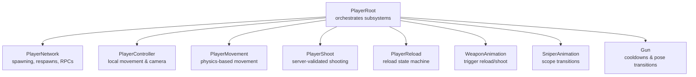
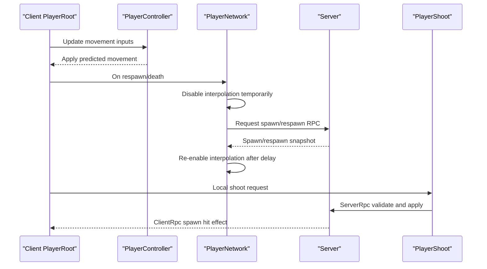
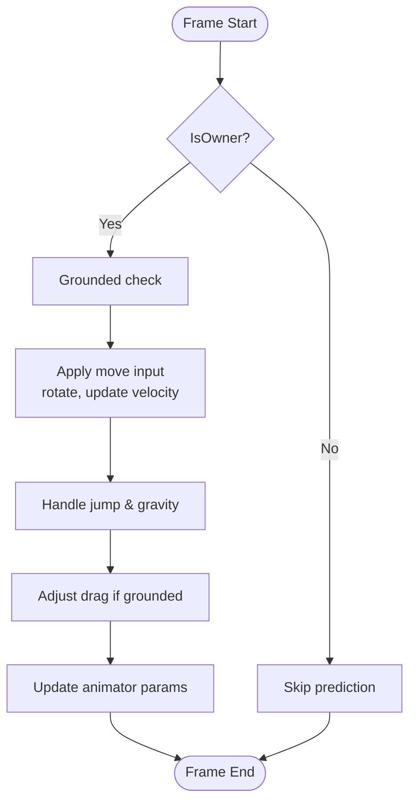
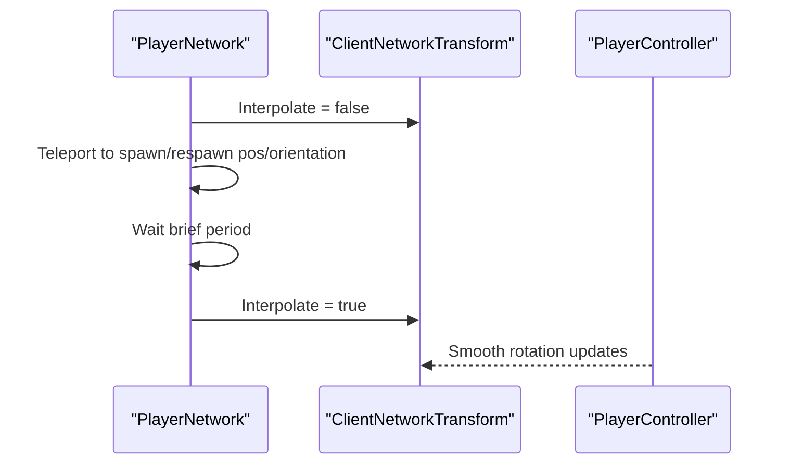
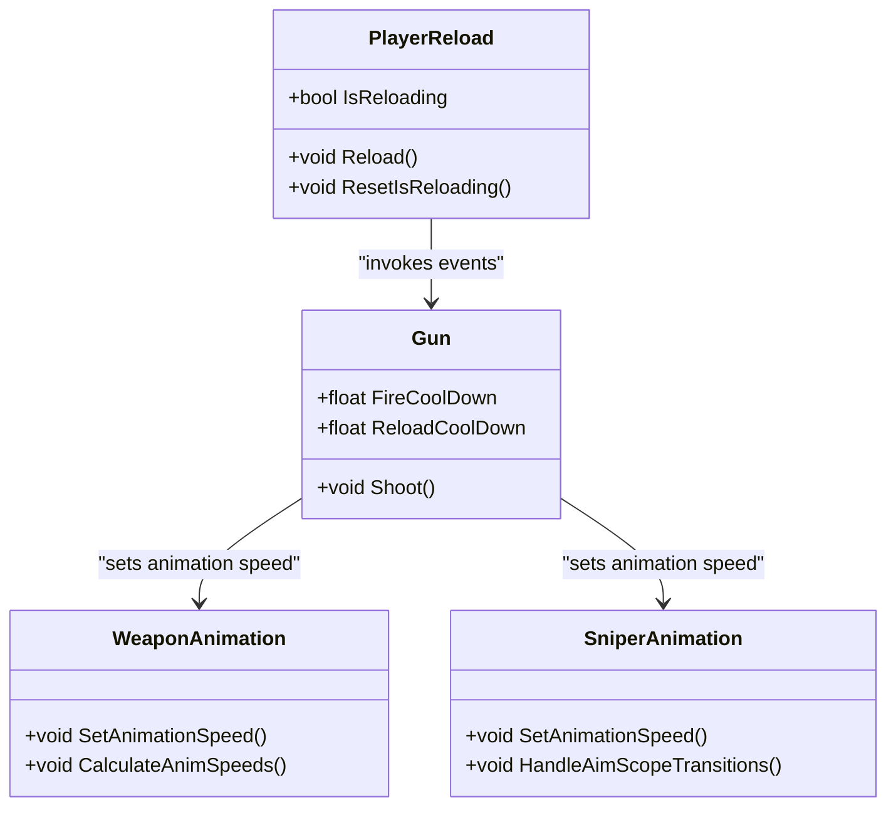
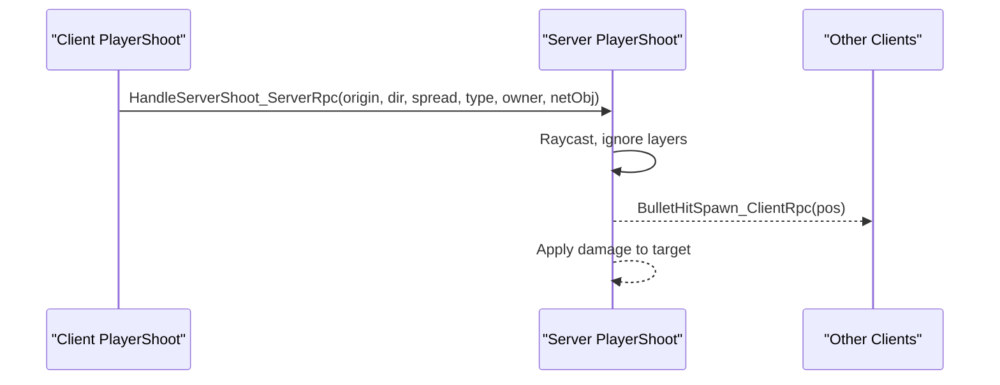
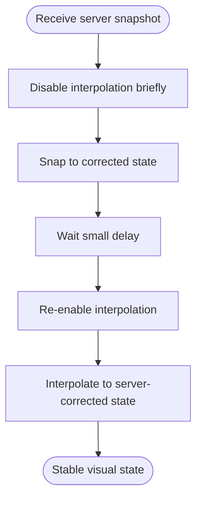
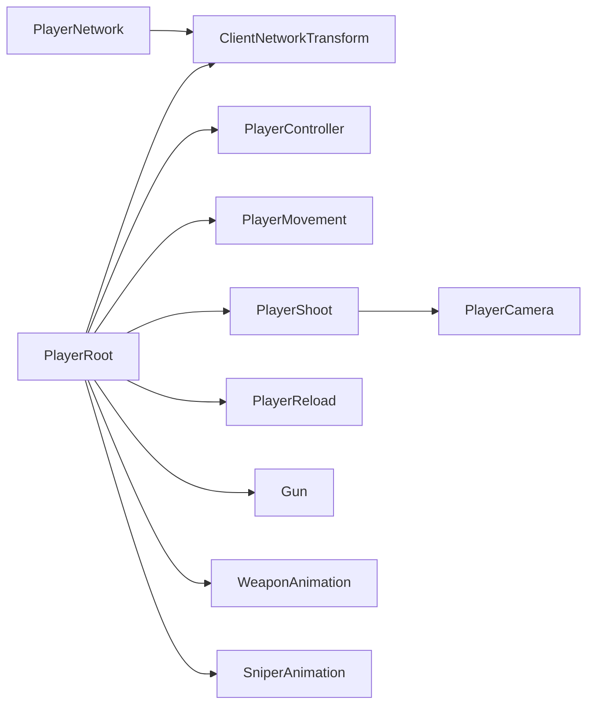

# Client Synchronization & Interpolation

<cite>
**Referenced Files in This Document**
- [PlayerRoot.cs](file://Assets/FPS-Game/Scripts/Player/PlayerRoot.cs)
- [PlayerNetwork.cs](file://Assets/FPS-Game/Scripts/Player/PlayerNetwork.cs)
- [PlayerController.cs](file://Assets/FPS-Game/Scripts/Player/PlayerController.cs)
- [PlayerMovement.cs](file://Assets/FPS-Game/Scripts/PlayerMovement.cs)
- [PlayerShoot.cs](file://Assets/FPS-Game/Scripts/Player/PlayerShoot.cs)
- [PlayerReload.cs](file://Assets/FPS-Game/Scripts/Player/PlayerReload.cs)
- [WeaponAnimation.cs](file://Assets/FPS-Game/Scripts/Player/WeaponAnimation.cs)
- [SniperAnimation.cs](file://Assets/FPS-Game/Scripts/Player/SniperAnimation.cs)
- [Gun.cs](file://Assets/FPS-Game/Scripts/Player/Gun.cs)
</cite>

## Table of Contents
1. [Introduction](#introduction)
2. [Project Structure](#project-structure)
3. [Core Components](#core-components)
4. [Architecture Overview](#architecture-overview)
5. [Detailed Component Analysis](#detailed-component-analysis)
6. [Dependency Analysis](#dependency-analysis)
7. [Performance Considerations](#performance-considerations)
8. [Troubleshooting Guide](#troubleshooting-guide)
9. [Conclusion](#conclusion)

## Introduction
This document explains client-side synchronization and interpolation techniques implemented in the project. It focuses on:
- Client-side prediction for movement, weapon animations, and interactions
- Interpolation algorithms to smooth networked motion and reduce perceived latency
- Rollback mechanisms to correct prediction drift and handle network jitter
- Practical examples for position interpolation, rotation smoothing, and state reconciliation upon server corrections
- Tuning guidance for balancing responsiveness vs. accuracy, bandwidth optimization via delta compression, and handling high-latency connections
- Debugging tips and optimization strategies for different network conditions

## Project Structure
The game uses Unity Netcode with a modular player architecture. The PlayerRoot orchestrates subsystems (movement, camera, shooting, reloading, animations) and coordinates client authority and server reconciliation. Networking primitives include ClientNetworkTransform for interpolation and ServerRpc/ClientRpc for authoritative updates.

**Diagram sources**
- [PlayerRoot.cs:159-366](file://Assets/FPS-Game/Scripts/Player/PlayerRoot.cs#L159-L366)
- [PlayerNetwork.cs:12-220](file://Assets/FPS-Game/Scripts/Player/PlayerNetwork.cs#L12-L220)
- [PlayerController.cs:13-486](file://Assets/FPS-Game/Scripts/Player/PlayerController.cs#L13-L486)
- [PlayerMovement.cs:5-158](file://Assets/FPS-Game/Scripts/PlayerMovement.cs#L5-L158)
- [PlayerShoot.cs:20-162](file://Assets/FPS-Game/Scripts/Player/PlayerShoot.cs#L20-L162)
- [PlayerReload.cs:6-50](file://Assets/FPS-Game/Scripts/Player/PlayerReload.cs#L6-L50)
- [WeaponAnimation.cs:1-63](file://Assets/FPS-Game/Scripts/Player/WeaponAnimation.cs#L1-L63)
- [SniperAnimation.cs:1-51](file://Assets/FPS-Game/Scripts/Player/SniperAnimation.cs#L1-L51)
- [Gun.cs:57-146](file://Assets/FPS-Game/Scripts/Player/Gun.cs#L57-L146)

**Section sources**
- [PlayerRoot.cs:159-366](file://Assets/FPS-Game/Scripts/Player/PlayerRoot.cs#L159-L366)

## Core Components
- PlayerRoot: Central hub that initializes and synchronizes subsystems, exposes events, and holds references to core components.
- PlayerNetwork: Handles spawning, respawn timing, and RPCs to enable/disable interpolation at spawn and during respawn.
- PlayerController: Local movement, jumping, gravity, and camera rotation; integrates with animations.
- PlayerMovement: Physics-driven movement with drag, speed control, and jump mechanics.
- PlayerShoot: Client-originated shooting requests sent to server for validation; spawns hit effects locally and on clients.
- PlayerReload: Manages reload state and triggers animation events.
- WeaponAnimation and SniperAnimation: Drive weapon animations with speed scaling based on fire/reload durations.
- Gun: Holds weapon stats and coordinates pose transitions and audio.

**Section sources**
- [PlayerRoot.cs:159-366](file://Assets/FPS-Game/Scripts/Player/PlayerRoot.cs#L159-L366)
- [PlayerNetwork.cs:12-220](file://Assets/FPS-Game/Scripts/Player/PlayerNetwork.cs#L12-L220)
- [PlayerController.cs:13-486](file://Assets/FPS-Game/Scripts/Player/PlayerController.cs#L13-L486)
- [PlayerMovement.cs:5-158](file://Assets/FPS-Game/Scripts/PlayerMovement.cs#L5-L158)
- [PlayerShoot.cs:20-162](file://Assets/FPS-Game/Scripts/Player/PlayerShoot.cs#L20-L162)
- [PlayerReload.cs:6-50](file://Assets/FPS-Game/Scripts/Player/PlayerReload.cs#L6-L50)
- [WeaponAnimation.cs:1-63](file://Assets/FPS-Game/Scripts/Player/WeaponAnimation.cs#L1-L63)
- [SniperAnimation.cs:1-51](file://Assets/FPS-Game/Scripts/Player/SniperAnimation.cs#L1-L51)
- [Gun.cs:57-146](file://Assets/FPS-Game/Scripts/Player/Gun.cs#L57-L146)

## Architecture Overview
The system blends client authority for responsiveness with server reconciliation for correctness. Predictive movement runs locally; server-sent snapshots interpolate client visuals. Shooting is client-evaluated for input latency reduction but validated server-side. Reload and weapon animations are coordinated via events and RPCs.

**Diagram sources**
- [PlayerNetwork.cs:120-161](file://Assets/FPS-Game/Scripts/Player/PlayerNetwork.cs#L120-L161)
- [PlayerNetwork.cs:390-455](file://Assets/FPS-Game/Scripts/Player/PlayerNetwork.cs#L390-L455)
- [PlayerShoot.cs:68-146](file://Assets/FPS-Game/Scripts/Player/PlayerShoot.cs#L68-L146)

## Detailed Component Analysis

### Client Prediction and Movement
- Predictive movement is handled by PlayerController and PlayerMovement. PlayerController applies movement and camera rotation each frame, while PlayerMovement manages physics forces and speed limits.
- Responsiveness is prioritized by running movement locally; server snapshots reconcile later to correct drift.

**Diagram sources**
- [PlayerController.cs:142-292](file://Assets/FPS-Game/Scripts/Player/PlayerController.cs#L142-L292)
- [PlayerMovement.cs:52-145](file://Assets/FPS-Game/Scripts/PlayerMovement.cs#L52-L145)

**Section sources**
- [PlayerController.cs:142-292](file://Assets/FPS-Game/Scripts/Player/PlayerController.cs#L142-L292)
- [PlayerMovement.cs:52-145](file://Assets/FPS-Game/Scripts/PlayerMovement.cs#L52-L145)

### Interpolation and Smooth Motion
- Interpolation is toggled around spawn/respawn to avoid visual artifacts. The code disables interpolation immediately after respawns and re-enables it after a short delay.
- Position interpolation and rotation smoothing are achieved through Unity’s ClientNetworkTransform and the controller’s rotation smoothing.

**Diagram sources**
- [PlayerNetwork.cs:390-455](file://Assets/FPS-Game/Scripts/Player/PlayerNetwork.cs#L390-L455)
- [PlayerController.cs:425-459](file://Assets/FPS-Game/Scripts/Player/PlayerController.cs#L425-L459)

**Section sources**
- [PlayerNetwork.cs:390-455](file://Assets/FPS-Game/Scripts/Player/PlayerNetwork.cs#L390-L455)
- [PlayerController.cs:425-459](file://Assets/FPS-Game/Scripts/Player/PlayerController.cs#L425-L459)

### Weapon Animations and Client Authority
- Reload and shoot triggers are driven by PlayerReload and Gun, emitting events consumed by WeaponAnimation and SniperAnimation.
- Animation speeds are scaled to match weapon cooldowns, ensuring visual fidelity regardless of fire rate.

**Diagram sources**
- [PlayerReload.cs:6-50](file://Assets/FPS-Game/Scripts/Player/PlayerReload.cs#L6-L50)
- [Gun.cs:106-146](file://Assets/FPS-Game/Scripts/Player/Gun.cs#L106-L146)
- [WeaponAnimation.cs:25-63](file://Assets/FPS-Game/Scripts/Player/WeaponAnimation.cs#L25-L63)
- [SniperAnimation.cs:20-51](file://Assets/FPS-Game/Scripts/Player/SniperAnimation.cs#L20-L51)

**Section sources**
- [PlayerReload.cs:6-50](file://Assets/FPS-Game/Scripts/Player/PlayerReload.cs#L6-L50)
- [Gun.cs:106-146](file://Assets/FPS-Game/Scripts/Player/Gun.cs#L106-L146)
- [WeaponAnimation.cs:25-63](file://Assets/FPS-Game/Scripts/Player/WeaponAnimation.cs#L25-L63)
- [SniperAnimation.cs:20-51](file://Assets/FPS-Game/Scripts/Player/SniperAnimation.cs#L20-L51)

### Server Validation and State Reconciliation
- Shooting is client-evaluated for low latency but validated server-side. The server resolves hits, applies damage, and broadcasts hit effects to clients.
- Respawn and spawn logic disable interpolation briefly to prevent ghosting, then re-enable interpolation for smooth motion.

**Diagram sources**
- [PlayerShoot.cs:68-146](file://Assets/FPS-Game/Scripts/Player/PlayerShoot.cs#L68-L146)

**Section sources**
- [PlayerShoot.cs:68-146](file://Assets/FPS-Game/Scripts/Player/PlayerShoot.cs#L68-L146)
- [PlayerNetwork.cs:120-161](file://Assets/FPS-Game/Scripts/Player/PlayerNetwork.cs#L120-L161)

### Rollback and Correction Mechanisms
- When server snapshots arrive, interpolation smoothly transitions to the corrected state. Disabling interpolation briefly at spawn/respawn prevents visible snapping.
- Predictive movement continues locally; server corrections reconcile position/rotation to maintain accuracy.

**Diagram sources**
- [PlayerNetwork.cs:390-455](file://Assets/FPS-Game/Scripts/Player/PlayerNetwork.cs#L390-L455)

**Section sources**
- [PlayerNetwork.cs:390-455](file://Assets/FPS-Game/Scripts/Player/PlayerNetwork.cs#L390-L455)

## Dependency Analysis
- PlayerRoot composes subsystems and initializes them in priority order, ensuring ClientNetworkTransform and other components are ready before gameplay.
- PlayerNetwork depends on PlayerRoot’s ClientNetworkTransform for interpolation control and coordinates spawn/respawn RPCs.
- PlayerController and PlayerMovement collaborate for movement; PlayerShoot relies on PlayerCamera for accurate raycasts.
- Weapon animations depend on Gun cooldowns and PlayerRoot events for synchronization.

**Diagram sources**
- [PlayerRoot.cs:259-296](file://Assets/FPS-Game/Scripts/Player/PlayerRoot.cs#L259-L296)
- [PlayerNetwork.cs:12-220](file://Assets/FPS-Game/Scripts/Player/PlayerNetwork.cs#L12-L220)

**Section sources**
- [PlayerRoot.cs:259-296](file://Assets/FPS-Game/Scripts/Player/PlayerRoot.cs#L259-L296)
- [PlayerNetwork.cs:12-220](file://Assets/FPS-Game/Scripts/Player/PlayerNetwork.cs#L12-L220)

## Performance Considerations
- Responsiveness vs. accuracy: Keep prediction on for movement and camera; defer interpolation briefly at spawn/respawn to avoid jitter.
- Bandwidth optimization: Use delta compression by sending minimal state updates (e.g., input deltas, tick counts) and rely on interpolation for intermediate frames.
- Latency handling: Increase interpolation delay slightly for higher RTT; clamp smoothing gains to avoid overshoot on unstable links.
- Animation fidelity: Scale animation speeds to weapon cooldowns to prevent stuttering under variable network conditions.

## Troubleshooting Guide
- Jitter or snapping during respawns/spawns:
  - Verify interpolation toggle logic around spawn/respawn.
  - Ensure teleport-to-correction occurs before re-enabling interpolation.
- Shooting appears desynced:
  - Confirm client-side shoot triggers are followed by server validation and hit effects broadcast.
  - Check raycast origin/direction alignment with PlayerCamera.
- Reload animation mismatch:
  - Ensure PlayerReload emits events and animations consume them promptly.
  - Verify animation speed calculations align with Gun cooldowns.

**Section sources**
- [PlayerNetwork.cs:390-455](file://Assets/FPS-Game/Scripts/Player/PlayerNetwork.cs#L390-L455)
- [PlayerShoot.cs:68-146](file://Assets/FPS-Game/Scripts/Player/PlayerShoot.cs#L68-L146)
- [PlayerReload.cs:6-50](file://Assets/FPS-Game/Scripts/Player/PlayerReload.cs#L6-L50)
- [Gun.cs:106-146](file://Assets/FPS-Game/Scripts/Player/Gun.cs#L106-L146)

## Conclusion
The project achieves responsive client-side prediction with robust server reconciliation and interpolation. Movement, camera, and weapon animations are synchronized using a combination of client authority and server validation. Interpolation is carefully managed around spawn/respawn to minimize visual artifacts, and animation speeds are tuned to weapon timings for consistent feel. For optimal results, keep prediction enabled for interactivity, use targeted interpolation windows, and validate critical actions server-side.