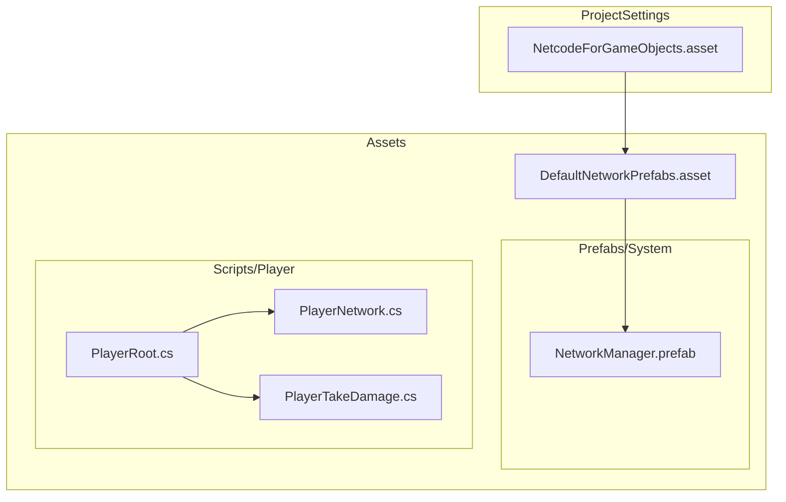
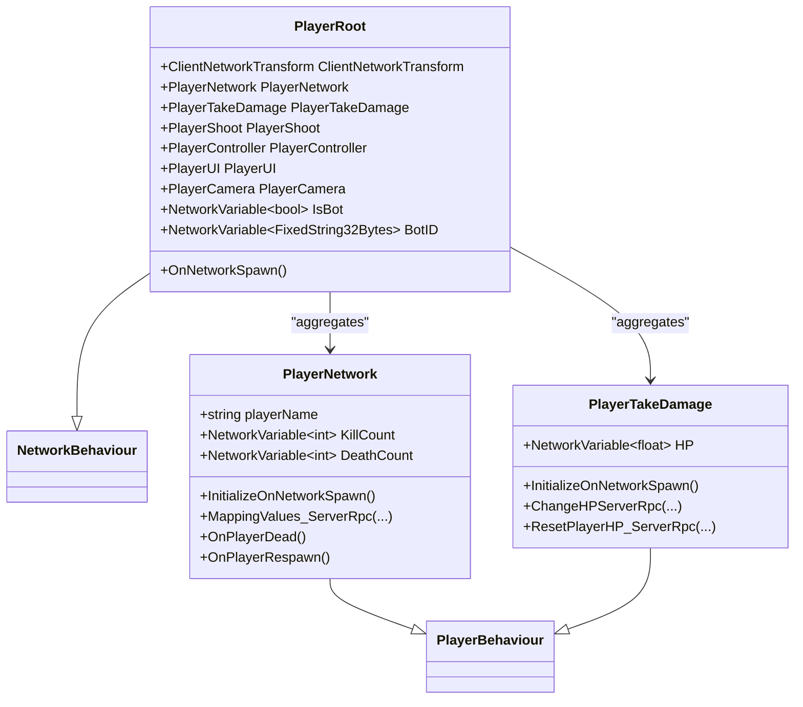
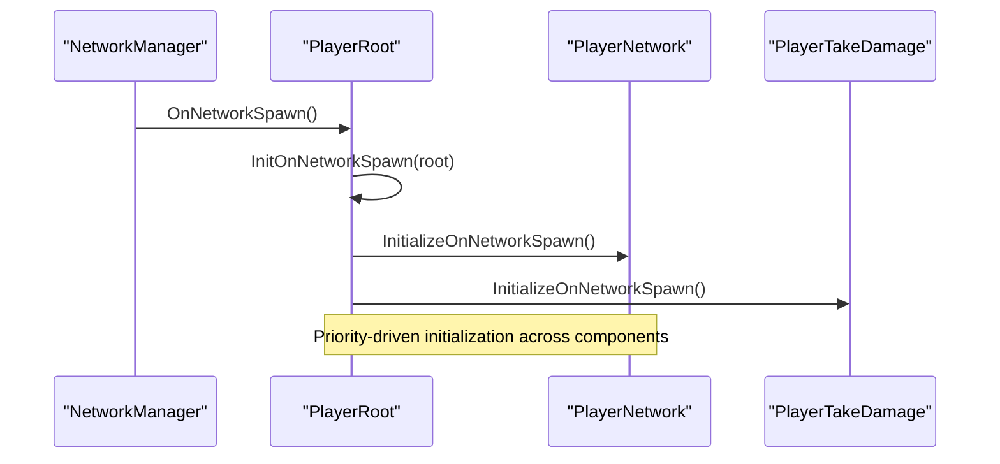
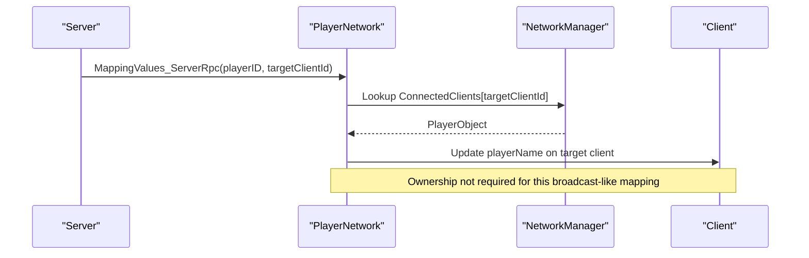
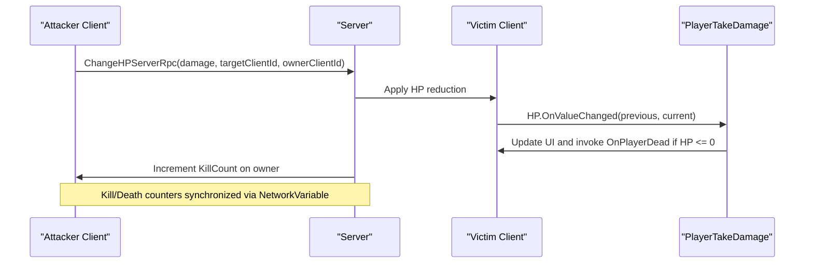
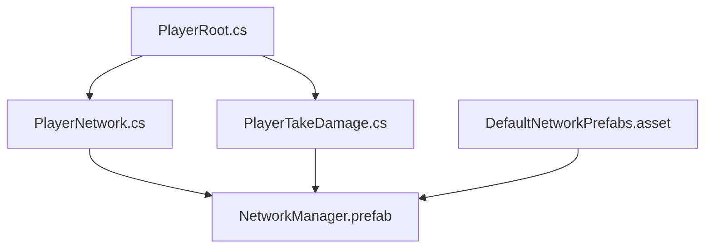

# Netcode for GameObjects Integration

<cite>
**Referenced Files in This Document**
- [NetcodeForGameObjects.asset](file://ProjectSettings/NetcodeForGameObjects.asset)
- [DefaultNetworkPrefabs.asset](file://Assets/DefaultNetworkPrefabs.asset)
- [PlayerRoot.cs](file://Assets/FPS-Game/Scripts/Player/PlayerRoot.cs)
- [PlayerNetwork.cs](file://Assets/FPS-Game/Scripts/Player/PlayerNetwork.cs)
- [PlayerTakeDamage.cs](file://Assets/FPS-Game/Scripts/Player/PlayerTakeDamage.cs)
- [NetworkManager.prefab](file://Assets/FPS-Game/Prefabs/System/NetworkManager.prefab)
</cite>

## Table of Contents
1. [Introduction](#introduction)
2. [Project Structure](#project-structure)
3. [Core Components](#core-components)
4. [Architecture Overview](#architecture-overview)
5. [Detailed Component Analysis](#detailed-component-analysis)
6. [Dependency Analysis](#dependency-analysis)
7. [Performance Considerations](#performance-considerations)
8. [Troubleshooting Guide](#troubleshooting-guide)
9. [Conclusion](#conclusion)
10. [Appendices](#appendices)

## Introduction
This document explains how Netcode for GameObjects integrates into the FPS game. It focuses on the NetworkObject inheritance pattern via NetworkBehaviour, the NetworkBehaviour lifecycle, component-based networking architecture, server-client relationships, ownership management, NetworkVariable usage for state synchronization, and the RPC system (ServerRpc and ClientRpc). Practical examples cover networked object instantiation, despawning, and state replication across clients. Serialization considerations, custom data types, and performance optimization techniques are included, along with troubleshooting guidance for desynchronization, lag compensation, and bandwidth management.

## Project Structure
The networking configuration and prefabs are centralized under ProjectSettings and Assets. The Netcode configuration points to default network prefabs, which define which prefabs are registered for network spawning. The PlayerRoot component orchestrates initialization order across multiple PlayerBehaviour components and exposes NetworkVariable-backed state. PlayerNetwork and PlayerTakeDamage are primary NetworkBehaviour implementations that demonstrate ownership checks, RPCs, and state synchronization.

**Diagram sources**
- [NetcodeForGameObjects.asset:1-18](file://ProjectSettings/NetcodeForGameObjects.asset#L1-L18)
- [DefaultNetworkPrefabs.asset:1-72](file://Assets/DefaultNetworkPrefabs.asset#L1-L72)
- [NetworkManager.prefab](file://Assets/FPS-Game/Prefabs/System/NetworkManager.prefab)
- [PlayerRoot.cs:159-217](file://Assets/FPS-Game/Scripts/Player/PlayerRoot.cs#L159-L217)
- [PlayerNetwork.cs:12-541](file://Assets/FPS-Game/Scripts/Player/PlayerNetwork.cs#L12-L541)
- [PlayerTakeDamage.cs:5-124](file://Assets/FPS-Game/Scripts/Player/PlayerTakeDamage.cs#L5-L124)

**Section sources**
- [NetcodeForGameObjects.asset:1-18](file://ProjectSettings/NetcodeForGameObjects.asset#L1-L18)
- [DefaultNetworkPrefabs.asset:1-72](file://Assets/DefaultNetworkPrefabs.asset#L1-L72)

## Core Components
- PlayerRoot: Inherits NetworkBehaviour and acts as a root container for player subsystems. It initializes components in priority order and exposes NetworkVariable-backed flags and identifiers. It also manages events and references to subsystems like camera, input, movement, and UI.
- PlayerNetwork: Inherits PlayerBehaviour and extends NetworkBehaviour. It manages per-character stats (NetworkVariable-based kill/death counts), ownership-aware logic, camera assignment for local players, and RPCs for mapping lobby info and respawn coordination.
- PlayerTakeDamage: Inherits PlayerBehaviour and extends NetworkBehaviour. It encapsulates health state via NetworkVariable and coordinates hit detection and scoring through ServerRpc and ClientRpc patterns.

Key lifecycle and ownership patterns:
- Ownership is checked via IsOwner and OwnerClientId.
- Network spawn order is orchestrated by PlayerRoot’s priority-based initialization across IInitNetwork-implementing components.
- NetworkVariable values propagate automatically to clients; listeners update UI and game state locally.

**Section sources**
- [PlayerRoot.cs:159-217](file://Assets/FPS-Game/Scripts/Player/PlayerRoot.cs#L159-L217)
- [PlayerRoot.cs:298-339](file://Assets/FPS-Game/Scripts/Player/PlayerRoot.cs#L298-L339)
- [PlayerNetwork.cs:12-541](file://Assets/FPS-Game/Scripts/Player/PlayerNetwork.cs#L12-L541)
- [PlayerTakeDamage.cs:5-124](file://Assets/FPS-Game/Scripts/Player/PlayerTakeDamage.cs#L5-L124)

## Architecture Overview
The system follows a component-based networking architecture:
- PlayerRoot aggregates subsystems and coordinates initialization order across NetworkBehaviour components.
- PlayerNetwork handles ownership-specific logic, camera binding, and RPCs for mapping player info and respawns.
- PlayerTakeDamage centralizes hit detection and scoring via ServerRpc, updating NetworkVariable-based HP and Kill/Death counts.

**Diagram sources**
- [PlayerRoot.cs:159-217](file://Assets/FPS-Game/Scripts/Player/PlayerRoot.cs#L159-L217)
- [PlayerRoot.cs:298-339](file://Assets/FPS-Game/Scripts/Player/PlayerRoot.cs#L298-L339)
- [PlayerNetwork.cs:12-541](file://Assets/FPS-Game/Scripts/Player/PlayerNetwork.cs#L12-L541)
- [PlayerTakeDamage.cs:5-124](file://Assets/FPS-Game/Scripts/Player/PlayerTakeDamage.cs#L5-L124)

## Detailed Component Analysis

### PlayerRoot: Component Orchestration and Initialization
PlayerRoot inherits NetworkBehaviour and serves as a hub for subsystems. It:
- Assigns references to subsystems (input, camera, controller, UI, etc.) via TryGetComponent and tag-based lookup.
- Implements priority-based initialization across IInitNetwork, IInitStart, and IInitAwake interfaces.
- Exposes NetworkVariable-backed flags for bot identity and ID, guarded by server checks.

Lifecycle highlights:
- OnNetworkSpawn triggers priority-based initialization of NetworkBehaviour components.
- Update loop reads zone data for pathfinding contexts.

**Diagram sources**
- [PlayerRoot.cs:214-217](file://Assets/FPS-Game/Scripts/Player/PlayerRoot.cs#L214-L217)
- [PlayerRoot.cs:332-339](file://Assets/FPS-Game/Scripts/Player/PlayerRoot.cs#L332-L339)

**Section sources**
- [PlayerRoot.cs:159-217](file://Assets/FPS-Game/Scripts/Player/PlayerRoot.cs#L159-L217)
- [PlayerRoot.cs:298-339](file://Assets/FPS-Game/Scripts/Player/PlayerRoot.cs#L298-L339)

### PlayerNetwork: Ownership, Camera, and RPCs
PlayerNetwork demonstrates:
- Ownership-aware logic using IsOwner and OwnerClientId.
- ServerRpc for mapping lobby player info to in-game names.
- ClientRpc for targeted position and rotation updates during spawn and respawn.
- Camera binding for local players via Cinemachine virtual camera.

Key behaviors:
- InitializeOnNetworkSpawn enables scripts conditionally based on ownership and bot status.
- OnPlayerDead disables scripts and schedules respawn; OnPlayerRespawn rebinds camera.
- MappingValues_ServerRpc updates remote clients’ player names using lobby data.

**Diagram sources**
- [PlayerNetwork.cs:183-199](file://Assets/FPS-Game/Scripts/Player/PlayerNetwork.cs#L183-L199)

**Section sources**
- [PlayerNetwork.cs:12-541](file://Assets/FPS-Game/Scripts/Player/PlayerNetwork.cs#L12-L541)

### PlayerTakeDamage: Health State and Scoring
PlayerTakeDamage encapsulates:
- NetworkVariable-based HP synchronized across clients.
- ServerRpc for applying damage and updating scores.
- ServerRpc for resetting HP on respawn.

Highlights:
- OnNetworkSpawn subscribes to HP change callbacks and player respawn events.
- OnHPChanged updates UI and triggers death events when HP reaches zero.
- ChangeHPServerRpc validates targets, applies damage, increments kill/death counters, and logs current HP.

**Diagram sources**
- [PlayerTakeDamage.cs:58-83](file://Assets/FPS-Game/Scripts/Player/PlayerTakeDamage.cs#L58-L83)

**Section sources**
- [PlayerTakeDamage.cs:5-124](file://Assets/FPS-Game/Scripts/Player/PlayerTakeDamage.cs#L5-L124)

### NetworkVariable Usage and State Replication
- PlayerNetwork: KillCount, DeathCount, playerName.
- PlayerTakeDamage: HP.
- PlayerRoot: IsBot, BotID.

State replication:
- NetworkVariable values are authoritative on the server and replicated to clients automatically.
- Client-side listeners update UI and gameplay state without manual serialization.

Best practices:
- Keep NetworkVariable updates minimal and deterministic.
- Use ServerRpc for authoritative state transitions.
- Avoid frequent writes from clients unless ownership is required.

**Section sources**
- [PlayerNetwork.cs:14-18](file://Assets/FPS-Game/Scripts/Player/PlayerNetwork.cs#L14-L18)
- [PlayerTakeDamage.cs:7-8](file://Assets/FPS-Game/Scripts/Player/PlayerTakeDamage.cs#L7-L8)
- [PlayerRoot.cs:185-186](file://Assets/FPS-Game/Scripts/Player/PlayerRoot.cs#L185-L186)

### RPC Patterns: ServerRpc and ClientRpc
Patterns demonstrated:
- ServerRpc with RequireOwnership=false for cross-client mapping and global state updates.
- ClientRpc for targeted updates (e.g., spawn/respawn positions) with ClientRpcParams to restrict delivery.

Security considerations:
- Prefer RequireOwnership=true when only the owning client should invoke sensitive operations.
- Validate target identifiers and existence before applying state changes.
- Avoid exposing internal server logic through RPCs; keep RPCs declarative and scoped.

Parameter passing:
- Use primitive and serializable types for RPC parameters.
- For complex data, pass IDs and fetch objects on the server side.

**Section sources**
- [PlayerNetwork.cs:183-199](file://Assets/FPS-Game/Scripts/Player/PlayerNetwork.cs#L183-L199)
- [PlayerTakeDamage.cs:58-83](file://Assets/FPS-Game/Scripts/Player/PlayerTakeDamage.cs#L58-L83)

### Networked Object Instantiation and Despawning
- DefaultNetworkPrefabs defines which prefabs are registered for network spawning.
- NetworkManager prefab is the runtime anchor for the network session.
- PlayerRoot orchestrates initialization after OnNetworkSpawn, enabling subsystems and camera binding for local players.

Practical flow:
- Instantiate player prefabs on the server.
- NetworkManager registers prefabs from DefaultNetworkPrefabs.
- OnNetworkSpawn, PlayerRoot initializes subsystems and applies ownership-specific logic.

**Section sources**
- [DefaultNetworkPrefabs.asset:1-72](file://Assets/DefaultNetworkPrefabs.asset#L1-L72)
- [NetworkManager.prefab](file://Assets/FPS-Game/Prefabs/System/NetworkManager.prefab)
- [PlayerRoot.cs:214-217](file://Assets/FPS-Game/Scripts/Player/PlayerRoot.cs#L214-L217)

## Dependency Analysis
The following diagram shows how core networking components depend on each other and on Netcode primitives.

**Diagram sources**
- [PlayerRoot.cs:159-217](file://Assets/FPS-Game/Scripts/Player/PlayerRoot.cs#L159-L217)
- [PlayerNetwork.cs:12-541](file://Assets/FPS-Game/Scripts/Player/PlayerNetwork.cs#L12-L541)
- [PlayerTakeDamage.cs:5-124](file://Assets/FPS-Game/Scripts/Player/PlayerTakeDamage.cs#L5-L124)
- [NetworkManager.prefab](file://Assets/FPS-Game/Prefabs/System/NetworkManager.prefab)
- [DefaultNetworkPrefabs.asset:1-72](file://Assets/DefaultNetworkPrefabs.asset#L1-L72)

**Section sources**
- [PlayerRoot.cs:159-217](file://Assets/FPS-Game/Scripts/Player/PlayerRoot.cs#L159-L217)
- [PlayerNetwork.cs:12-541](file://Assets/FPS-Game/Scripts/Player/PlayerNetwork.cs#L12-L541)
- [PlayerTakeDamage.cs:5-124](file://Assets/FPS-Game/Scripts/Player/PlayerTakeDamage.cs#L5-L124)

## Performance Considerations
- Minimize RPC frequency: batch updates and throttle high-frequency events.
- Use ClientRpcParams to target specific clients when broadcasting is unnecessary.
- Prefer NetworkVariable for smooth interpolation; disable interpolation temporarily during teleportation and re-enable after stabilization.
- Avoid heavy computations in RPC handlers; delegate to server-side validators.
- Serialize only essential data; avoid large payloads in RPC parameters.
- Use authority-based updates to reduce redundant state broadcasts.

[No sources needed since this section provides general guidance]

## Troubleshooting Guide
Common issues and remedies:
- Desynchronization:
  - Verify NetworkVariable values are updated on the server and consumed on clients.
  - Ensure OnNetworkSpawn initializes subsystems consistently across clients.
- Lag compensation:
  - Use ClientNetworkTransform interpolation judiciously; disable during teleportation and re-enable after stabilization.
  - Consider snapshot-based reconciliation for latency-sensitive actions.
- Bandwidth management:
  - Limit RPC calls; coalesce updates where possible.
  - Use ClientRpcParams to send targeted updates instead of broadcasting.
- Ownership errors:
  - Confirm RequireOwnership flags match intended caller scope.
  - Validate OwnerClientId and ConnectedClients before invoking RPCs.
- Prefab registration:
  - Ensure player and object prefabs are present in DefaultNetworkPrefabs and registered with NetworkManager.

**Section sources**
- [PlayerNetwork.cs:183-199](file://Assets/FPS-Game/Scripts/Player/PlayerNetwork.cs#L183-L199)
- [PlayerTakeDamage.cs:58-83](file://Assets/FPS-Game/Scripts/Player/PlayerTakeDamage.cs#L58-L83)
- [DefaultNetworkPrefabs.asset:1-72](file://Assets/DefaultNetworkPrefabs.asset#L1-L72)

## Conclusion
The FPS game leverages Netcode for GameObjects through a clean component-based architecture. PlayerRoot orchestrates initialization order and subsystem references, while PlayerNetwork and PlayerTakeDamage implement ownership-aware logic, RPCs, and NetworkVariable-backed state synchronization. By following the patterns documented here—prioritizing initialization, using ServerRpc for authoritative updates, and carefully managing RPC scope and bandwidth—you can build a robust, scalable multiplayer experience.

[No sources needed since this section summarizes without analyzing specific files]

## Appendices

### Appendix A: Configuration and Prefabs
- NetcodeForGameObjects.asset configures default network prefabs and generation settings.
- DefaultNetworkPrefabs.asset enumerates prefabs eligible for network spawning.
- NetworkManager.prefab is the runtime anchor for the network session.

**Section sources**
- [NetcodeForGameObjects.asset:1-18](file://ProjectSettings/NetcodeForGameObjects.asset#L1-L18)
- [DefaultNetworkPrefabs.asset:1-72](file://Assets/DefaultNetworkPrefabs.asset#L1-L72)
- [NetworkManager.prefab](file://Assets/FPS-Game/Prefabs/System/NetworkManager.prefab)