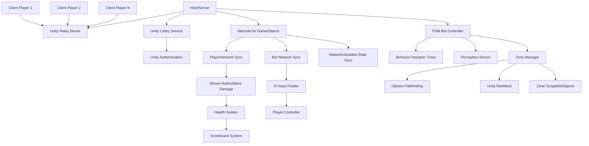
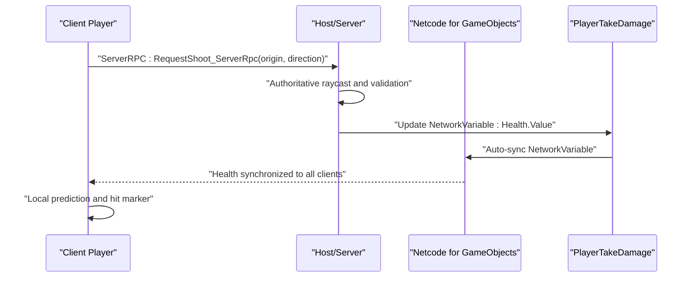
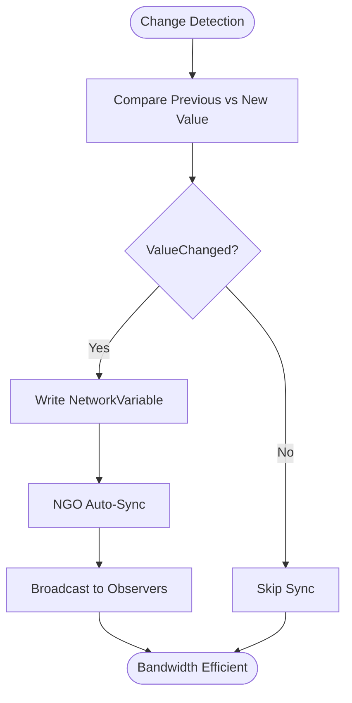
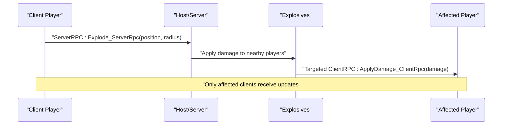
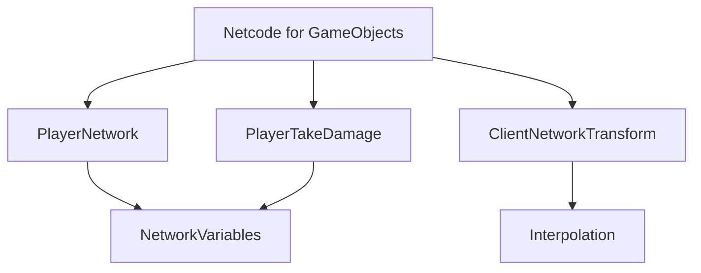

# Network Optimization & Bandwidth Management

<cite>
**Referenced Files in This Document**
- [README.md](file://README.md)
- [WIKI.md](file://WIKI.md)
- [PlayerNetwork.cs](file://Assets/FPS-Game/Scripts/Player/PlayerNetwork.cs)
- [PlayerTakeDamage.cs](file://Assets/FPS-Game/Scripts/Player/PlayerTakeDamage.cs)
- [Gun.cs](file://Assets/FPS-Game/Scripts/Player/Gun.cs)
- [Explosives.cs](file://Assets/FPS-Game/Scripts/Player/Explosives.cs)
- [PlayerInfo.cs](file://Assets/FPS-Game/Scripts/PlayerInfo.cs)
- [NetcodeForGameObjects.asset](file://ProjectSettings/NetcodeForGameObjects.asset)
- [QualitySettings.asset](file://ProjectSettings/QualitySettings.asset)
- [WebSocketServerManager.cs](file://Assets/FPS-Game/Scripts/System/WebSocketServerManager.cs)
- [CommandRouter.cs](file://Assets/FPS-Game/Scripts/System/CommandRouter.cs)
- [WebSocketDataStructures.cs](file://Assets/FPS-Game/Scripts/System/WebSocketDataStructures.cs)
</cite>

## Table of Contents
1. [Introduction](#introduction)
2. [Project Structure](#project-structure)
3. [Core Components](#core-components)
4. [Architecture Overview](#architecture-overview)
5. [Detailed Component Analysis](#detailed-component-analysis)
6. [Dependency Analysis](#dependency-analysis)
7. [Performance Considerations](#performance-considerations)
8. [Troubleshooting Guide](#troubleshooting-guide)
9. [Conclusion](#conclusion)
10. [Appendices](#appendices)

## Introduction
This document provides comprehensive guidance for network optimization and bandwidth management in a Unity-based multiplayer FPS game. It synthesizes the project's networking architecture, synchronization mechanisms, and performance characteristics to deliver practical strategies for reducing bandwidth usage, improving responsiveness, and scaling across diverse network conditions. The content is grounded in the repository's implementation of Netcode for GameObjects (NGO), Unity Relay, and Unity Lobby, along with server-authoritative gameplay and AI bot synchronization.

## Project Structure
The project follows a layered architecture with clear separation between presentation, networking, game logic, AI, and data layers. The networking layer integrates Unity Relay and NGO to achieve client-host topology with server-authoritative state management. The game logic layer coordinates player actions, AI behavior, and synchronization. The AI layer employs a hybrid FSM-BT architecture for bot decision-making, while the data layer manages ScriptableObjects, NetworkVariables, and player data.

**Diagram sources**
- [WIKI.md:66-96](file://WIKI.md#L66-L96)

**Section sources**
- [WIKI.md:31-96](file://WIKI.md#L31-L96)
- [README.md:26-60](file://README.md#L26-L60)

## Core Components
This section outlines the primary networking components and their roles in bandwidth-conscious design:

- PlayerNetwork: Manages player identity and statistics via NetworkVariables, enabling efficient server-authoritative synchronization with minimal client-server chatter.
- PlayerTakeDamage: Implements server-authoritative damage calculation and updates NetworkVariables, preventing redundant client-side computations and ensuring consistent state.
- Gun: Demonstrates RPC usage for audio synchronization, illustrating selective client RPCs to reduce unnecessary bandwidth.
- Explosives: Shows spatial damage application with targeted client updates, minimizing broadcast overhead.
- PlayerInfo: Provides a foundation for structured player data suitable for serialization and bandwidth-aware transport.
- NetcodeForGameObjects.asset: Project configuration for NGO defaults and network prefabs.
- QualitySettings.asset: Rendering quality profiles that influence CPU/GPU load and indirectly impact network performance.

Practical implications:
- NetworkVariables automatically synchronize only changed values, reducing bandwidth compared to manual serialization.
- ServerRPCs validate and process authoritative actions server-side, preventing client-side manipulation and excessive reconciliation.
- Selective ClientRPCs and targeted updates minimize broadcast traffic.

**Section sources**
- [WIKI.md:140-154](file://WIKI.md#L140-L154)
- [WIKI.md:1319-1383](file://WIKI.md#L1319-L1383)
- [PlayerNetwork.cs](file://Assets/FPS-Game/Scripts/Player/PlayerNetwork.cs)
- [PlayerTakeDamage.cs:46-124](file://Assets/FPS-Game/Scripts/Player/PlayerTakeDamage.cs#L46-L124)
- [Gun.cs:336-360](file://Assets/FPS-Game/Scripts/Player/Gun.cs#L336-L360)
- [Explosives.cs:138-186](file://Assets/FPS-Game/Scripts/Player/Explosives.cs#L138-L186)
- [PlayerInfo.cs:1-53](file://Assets/FPS-Game/Scripts/PlayerInfo.cs#L1-L53)
- [NetcodeForGameObjects.asset:1-17](file://ProjectSettings/NetcodeForGameObjects.asset#L1-L17)
- [QualitySettings.asset:1-320](file://ProjectSettings/QualitySettings.asset#L1-L320)

## Architecture Overview
The networking architecture leverages Unity Relay for serverless connectivity and NGO for real-time synchronization. The system employs a client-host topology where the host maintains authoritative game state, and NGO handles NetworkVariables and RPCs. This design centralizes state updates and minimizes redundant data transmission.

**Diagram sources**
- [WIKI.md:1330-1357](file://WIKI.md#L1330-L1357)
- [WIKI.md:1014-1071](file://WIKI.md#L1014-L1071)
- [PlayerTakeDamage.cs:58-83](file://Assets/FPS-Game/Scripts/Player/PlayerTakeDamage.cs#L58-L83)

**Section sources**
- [WIKI.md:1282-1390](file://WIKI.md#L1282-L1390)
- [WIKI.md:1014-1071](file://WIKI.md#L1014-L1071)

## Detailed Component Analysis

### NetworkVariable Optimization
NetworkVariables provide automatic synchronization with change-detection, ideal for bandwidth-efficient state updates. The PlayerNetwork component demonstrates this with KillCount and DeathCount variables, while PlayerTakeDamage updates Health NetworkVariables server-authoritatively.

Optimization strategies:
- Minimize variable churn: Group related state changes and batch updates to reduce sync frequency.
- Use appropriate types: Prefer compact numeric types and avoid frequent floating-point updates.
- Conditional updates: Only write when values change to leverage NGO's change detection.

**Diagram sources**
- [WIKI.md:1319-1328](file://WIKI.md#L1319-L1328)
- [WIKI.md:1374-1383](file://WIKI.md#L1374-L1383)

**Section sources**
- [WIKI.md:1319-1383](file://WIKI.md#L1319-L1383)
- [PlayerNetwork.cs](file://Assets/FPS-Game/Scripts/Player/PlayerNetwork.cs)
- [PlayerTakeDamage.cs:58-83](file://Assets/FPS-Game/Scripts/Player/PlayerTakeDamage.cs#L58-L83)

### RPC Frequency and Selective Sending
RPCs should be used judiciously. The Gun component illustrates selective ClientRPCs for localized audio events, avoiding global broadcasts. Explosives demonstrate spatial targeting for damage application, limiting RPC scope to affected clients.

Guidelines:
- Use ServerRPCs for authoritative actions (e.g., shooting, damage).
- Use ClientRPCs sparingly and only when necessary (e.g., hit markers, localized effects).
- Prefer spatial targeting and change-based updates to reduce RPC volume.

**Diagram sources**
- [Gun.cs:336-360](file://Assets/FPS-Game/Scripts/Player/Gun.cs#L336-L360)
- [Explosives.cs:138-186](file://Assets/FPS-Game/Scripts/Player/Explosives.cs#L138-L186)

**Section sources**
- [Gun.cs:336-360](file://Assets/FPS-Game/Scripts/Player/Gun.cs#L336-L360)
- [Explosives.cs:138-186](file://Assets/FPS-Game/Scripts/Player/Explosives.cs#L138-L186)

### Predictive Networking, Dead Reckoning, and State Compression
Predictive networking and dead reckoning improve perceived responsiveness by smoothing movement and reducing perceived latency. The project's ClientNetworkTransform interpolation provides smooth movement updates, while server-authoritative validation ensures accuracy.

State compression techniques:
- Quantization: Reduce precision of position/rotation for bandwidth savings.
- Delta encoding: Transmit differences instead of full state snapshots.
- Variable-length encoding: Compress small integers and deltas efficiently.

Note: The repository does not include explicit predictive networking or state compression implementations. These can be integrated alongside NGO's interpolation and NetworkVariables to further optimize bandwidth.

**Section sources**
- [WIKI.md:1385-1388](file://WIKI.md#L1385-L1388)
- [WIKI.md:1374-1383](file://WIKI.md#L1374-L1383)

### View Distance Culling, Occlusion Culling, and Dynamic LOD
While the repository does not implement explicit view distance culling or dynamic LOD, these techniques are essential for bandwidth reduction in large multiplayer environments. Practical approaches include:

- View distance culling: Disable or simplify updates for entities beyond a configurable distance threshold.
- Occlusion culling: Suppress updates for entities behind walls or obstacles.
- Dynamic LOD: Reduce update frequency or detail level for distant entities.

These strategies complement NGO's selective synchronization by reducing the number of entities requiring frequent updates.

**Section sources**
- [WIKI.md:1842-1860](file://WIKI.md#L1842-L1860)

### Adaptive Quality Systems
Adaptive quality adjusts rendering and networking parameters based on network conditions. The project includes QualitySettings profiles that influence CPU/GPU load, indirectly affecting network performance. Implementations can include:

- Dynamic quality scaling: Lower quality settings under high latency or packet loss.
- Network-aware LOD: Adjust LOD transitions based on bandwidth metrics.
- RPC throttling: Reduce RPC frequency during congestion.

**Section sources**
- [QualitySettings.asset:1-320](file://ProjectSettings/QualitySettings.asset#L1-L320)
- [WIKI.md:1842-1860](file://WIKI.md#L1842-L1860)

## Dependency Analysis
The networking layer depends on NGO for synchronization primitives and Unity Relay for connectivity. The game logic layer interacts with networking components through server-authoritative patterns, ensuring consistent state across clients.

**Diagram sources**
- [WIKI.md:1317-1390](file://WIKI.md#L1317-L1390)

**Section sources**
- [WIKI.md:1317-1390](file://WIKI.md#L1317-L1390)

## Performance Considerations
- ClientNetworkTransform interpolation reduces bandwidth by smoothing movement updates.
- NetworkVariables sync only on change, minimizing redundant transmissions.
- ServerRPC calls are minimized for performance, with authoritative validation on the host.
- Bot AI runs only on the host, reducing network traffic from AI computations.

Recommendations:
- Profile RPC frequency and adjust tick rates as needed.
- Use targeted ClientRPCs and spatial targeting to limit broadcast scope.
- Implement adaptive quality and selective culling for large-scale playfields.

**Section sources**
- [WIKI.md:1840-1860](file://WIKI.md#L1840-L1860)

## Troubleshooting Guide
Common networking issues and mitigation strategies:

- Bandwidth spikes during explosions or weapon fire:
  - Use targeted ClientRPCs and spatial targeting to limit affected clients.
  - Batch multiple damage updates into a single RPC when safe.

- Inconsistent state after latency:
  - Rely on server-authoritative validation and NetworkVariables auto-sync.
  - Ensure ClientNetworkTransform interpolation is enabled for smooth movement.

- Excessive RPC volume:
  - Review ServerRPC usage and consolidate validations.
  - Prefer NetworkVariables for frequent state changes.

- WebSocket integration for AI agents:
  - Verify WebSocketServerManager initialization and endpoint configuration.
  - Ensure CommandRouter routes commands to PlayerRoot AIInputFeeder.

**Section sources**
- [Explosives.cs:138-186](file://Assets/FPS-Game/Scripts/Player/Explosives.cs#L138-L186)
- [WIKI.md:1330-1357](file://WIKI.md#L1330-L1357)
- [WebSocketServerManager.cs](file://Assets/FPS-Game/Scripts/System/WebSocketServerManager.cs)
- [CommandRouter.cs](file://Assets/FPS-Game/Scripts/System/CommandRouter.cs)

## Conclusion
The project establishes a robust, server-authoritative networking foundation using NGO and Unity Relay. By leveraging NetworkVariables, selective RPCs, and server-authoritative validations, the system achieves efficient bandwidth utilization. Extending with predictive networking, state compression, view distance culling, occlusion culling, dynamic LOD, and adaptive quality systems can further optimize performance for diverse network conditions.

## Appendices

### Practical Examples Index
- Server-authoritative damage: [PlayerTakeDamage.cs:58-83](file://Assets/FPS-Game/Scripts/Player/PlayerTakeDamage.cs#L58-L83)
- Selective ClientRPCs: [Gun.cs:336-360](file://Assets/FPS-Game/Scripts/Player/Gun.cs#L336-L360)
- Spatial targeting for damage: [Explosives.cs:138-186](file://Assets/FPS-Game/Scripts/Player/Explosives.cs#L138-L186)
- NGO configuration: [NetcodeForGameObjects.asset:1-17](file://ProjectSettings/NetcodeForGameObjects.asset#L1-L17)
- Quality profiles: [QualitySettings.asset:1-320](file://ProjectSettings/QualitySettings.asset#L1-L320)
- WebSocket integration (server): [WebSocketServerManager.cs](file://Assets/FPS-Game/Scripts/System/WebSocketServerManager.cs)
- WebSocket integration (commands): [CommandRouter.cs](file://Assets/FPS-Game/Scripts/System/CommandRouter.cs)
- WebSocket data structures: [WebSocketDataStructures.cs](file://Assets/FPS-Game/Scripts/System/WebSocketDataStructures.cs)