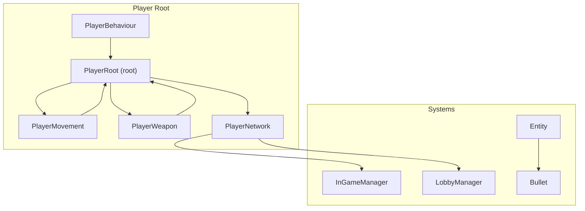
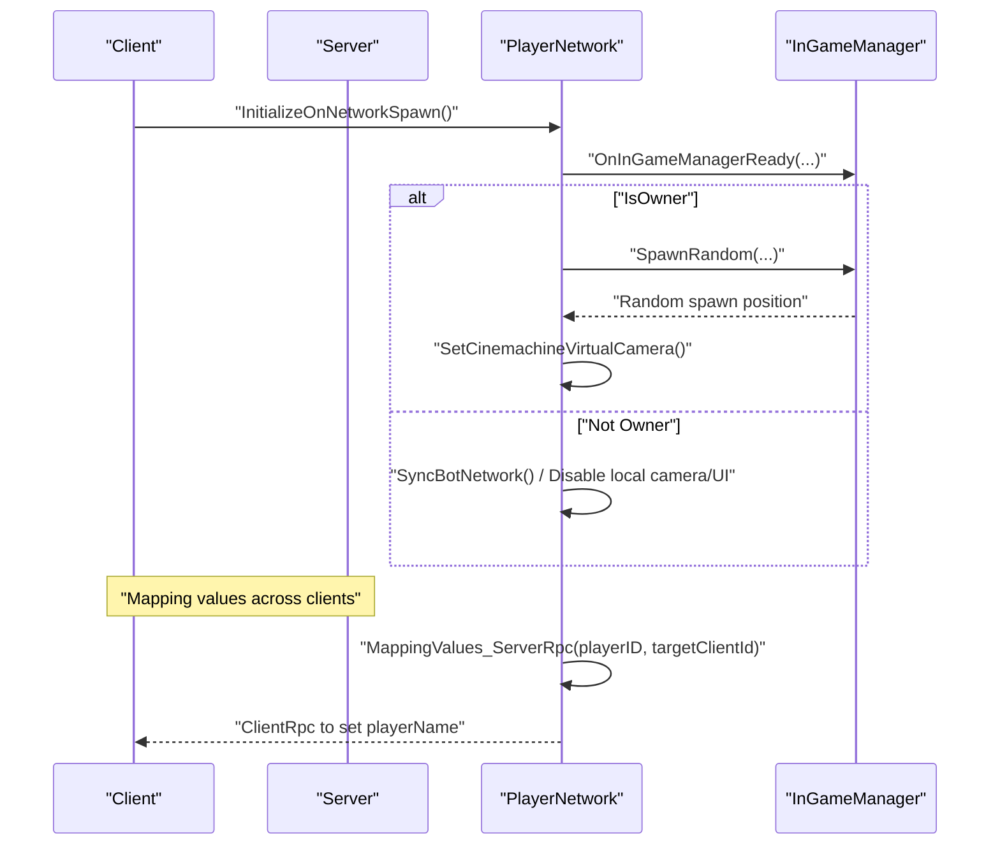
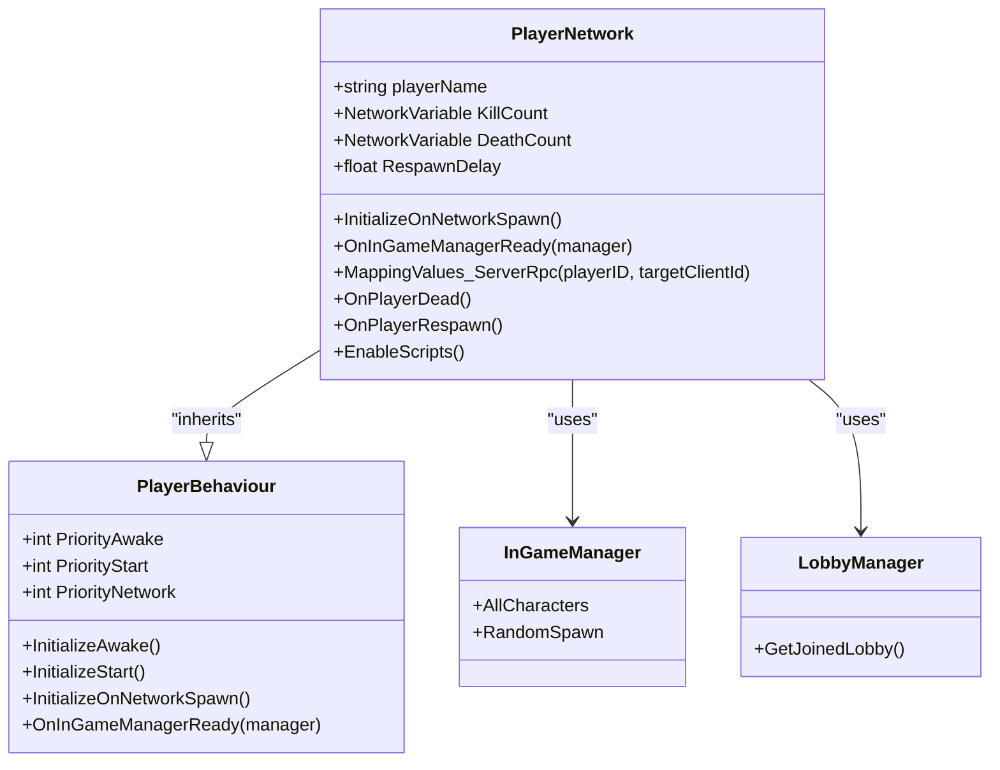
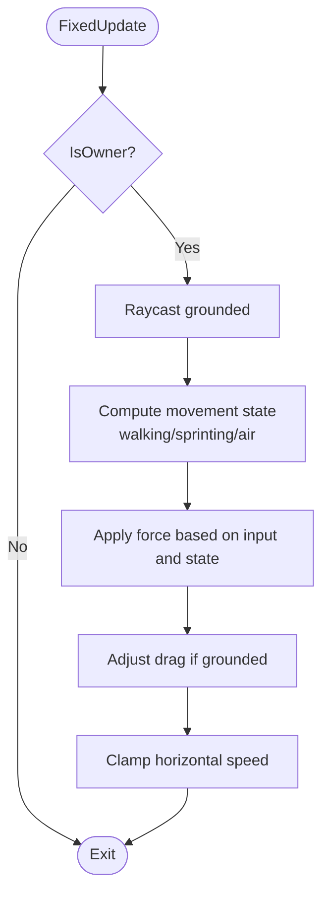
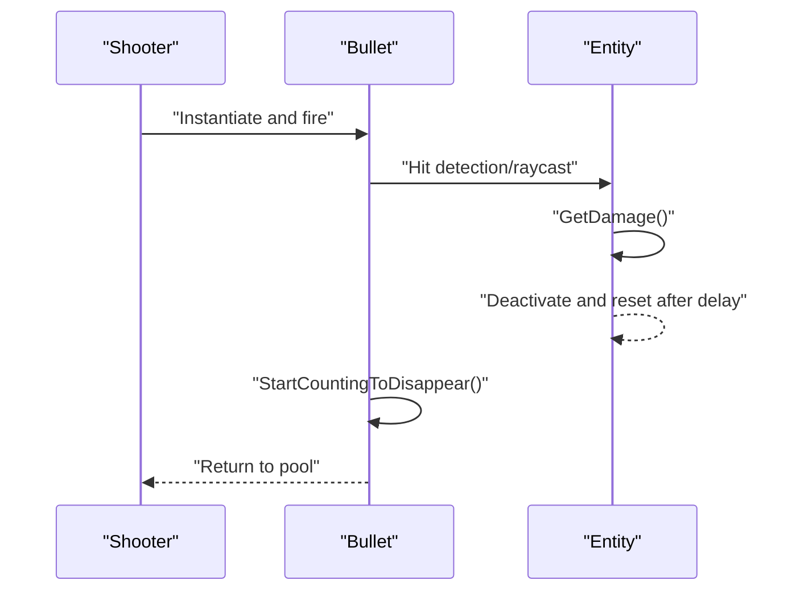
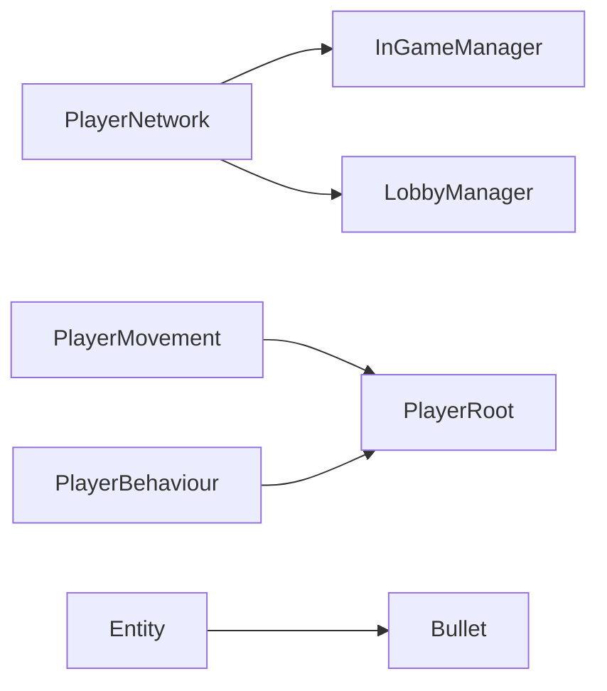

# Networking Architecture

<cite>
**Referenced Files in This Document**
- [PlayerNetwork.cs](file://Assets/FPS-Game/Scripts/Player/PlayerNetwork.cs)
- [PlayerMovement.cs](file://Assets/FPS-Game/Scripts/PlayerMovement.cs)
- [PlayerWeapon.cs](file://Assets/FPS-Game/Scripts/PlayerWeapon.cs)
- [PlayerBehaviour.cs](file://Assets/FPS-Game/Scripts/Player/PlayerBehaviour.cs)
- [Entity.cs](file://Assets/FPS-Game/Scripts/Entity.cs)
- [Bullet.cs](file://Assets/FPS-Game/Scripts/Bullet.cs)
- [InGameManager.cs](file://Assets/FPS-Game/Scripts/System/InGameManager.cs)
- [LobbyManager.cs](file://Assets/FPS-Game/Scripts/Lobby Script/Lobby/Scripts/LobbyManager.cs)
</cite>

## Table of Contents
1. [Introduction](#introduction)
2. [Project Structure](#project-structure)
3. [Core Components](#core-components)
4. [Architecture Overview](#architecture-overview)
5. [Detailed Component Analysis](#detailed-component-analysis)
6. [Dependency Analysis](#dependency-analysis)
7. [Performance Considerations](#performance-considerations)
8. [Troubleshooting Guide](#troubleshooting-guide)
9. [Conclusion](#conclusion)

## Introduction
This document explains the networking architecture of the project with a focus on server-authoritative gameplay using Unity Netcode for GameObjects. It covers the client-host topology, NetworkObject synchronization patterns, and NetworkVariable usage for state management. It also documents server-authoritative mechanics for player movement, weapon state, and health/damage processing, along with client-side interpolation, prediction, and rollback considerations. Practical examples illustrate networked object spawning, cross-client player synchronization, and event broadcasting. Finally, it provides guidance on optimization, bandwidth management, latency compensation, debugging, disconnection handling, and reliable messaging.

## Project Structure
The networking layer centers around a player-rooted hierarchy with a dedicated PlayerRoot component that aggregates subsystems (movement, camera, input, UI, weapon, etc.). PlayerBehaviour is the base NetworkBehaviour for player-related scripts. PlayerNetwork orchestrates spawn, respawn, and cross-client state mapping. PlayerMovement handles authoritative movement logic. PlayerWeapon encapsulates weapon collections. Entity and Bullet manage hit detection and projectile lifecycle.

**Diagram sources**
- [PlayerNetwork.cs:12-220](file://Assets/FPS-Game/Scripts/Player/PlayerNetwork.cs#L12-L220)
- [PlayerMovement.cs:5-158](file://Assets/FPS-Game/Scripts/PlayerMovement.cs#L5-L158)
- [PlayerWeapon.cs:5-25](file://Assets/FPS-Game/Scripts/PlayerWeapon.cs#L5-L25)
- [PlayerBehaviour.cs:4-31](file://Assets/FPS-Game/Scripts/Player/PlayerBehaviour.cs#L4-L31)
- [Entity.cs:5-76](file://Assets/FPS-Game/Scripts/Entity.cs#L5-L76)
- [Bullet.cs:5-23](file://Assets/FPS-Game/Scripts/Bullet.cs#L5-L23)
- [InGameManager.cs](file://Assets/FPS-Game/Scripts/System/InGameManager.cs)
- [LobbyManager.cs](file://Assets/FPS-Game/Scripts/Lobby Script/Lobby/Scripts/LobbyManager.cs)

**Section sources**
- [PlayerNetwork.cs:12-220](file://Assets/FPS-Game/Scripts/Player/PlayerNetwork.cs#L12-L220)
- [PlayerMovement.cs:5-158](file://Assets/FPS-Game/Scripts/PlayerMovement.cs#L5-L158)
- [PlayerWeapon.cs:5-25](file://Assets/FPS-Game/Scripts/PlayerWeapon.cs#L5-L25)
- [PlayerBehaviour.cs:4-31](file://Assets/FPS-Game/Scripts/Player/PlayerBehaviour.cs#L4-L31)
- [Entity.cs:5-76](file://Assets/FPS-Game/Scripts/Entity.cs#L5-L76)
- [Bullet.cs:5-23](file://Assets/FPS-Game/Scripts/Bullet.cs#L5-L23)
- [InGameManager.cs](file://Assets/FPS-Game/Scripts/System/InGameManager.cs)
- [LobbyManager.cs](file://Assets/FPS-Game/Scripts/Lobby Script/Lobby/Scripts/LobbyManager.cs)

## Core Components
- PlayerBehaviour: Base NetworkBehaviour that injects PlayerRoot into player scripts and coordinates initialization order across awake/start/network/in-game-manager-ready phases.
- PlayerNetwork: Server-authoritative orchestration of spawn/respawn, cross-client identity mapping, and camera/camera-follow setup. Uses NetworkVariables for kill/death counts and ServerRpc/ClientRpc for deterministic state updates.
- PlayerMovement: Authoritative movement controlled by the owner; applies forces in FixedUpdate and clamps speed; grounded checks and drag adjustments occur locally.
- PlayerWeapon: Holds player weapons collection; can be extended to synchronize weapon state via NetworkVariable or RPCs.
- Entity: Health/damage system for static props; demonstrates hit effects and color transitions.
- Bullet: Projectile lifecycle management with automatic cleanup after TTL.

**Section sources**
- [PlayerBehaviour.cs:4-31](file://Assets/FPS-Game/Scripts/Player/PlayerBehaviour.cs#L4-L31)
- [PlayerNetwork.cs:12-220](file://Assets/FPS-Game/Scripts/Player/PlayerNetwork.cs#L12-L220)
- [PlayerMovement.cs:5-158](file://Assets/FPS-Game/Scripts/PlayerMovement.cs#L5-L158)
- [PlayerWeapon.cs:5-25](file://Assets/FPS-Game/Scripts/PlayerWeapon.cs#L5-L25)
- [Entity.cs:5-76](file://Assets/FPS-Game/Scripts/Entity.cs#L5-L76)
- [Bullet.cs:5-23](file://Assets/FPS-Game/Scripts/Bullet.cs#L5-L23)

## Architecture Overview
The architecture follows a client-host model with server authority:
- Ownership: Only the object owner updates its authoritative state (movement, actions).
- Server authority: Server validates and finalizes state changes (health, scoring, spawn/respawn).
- Client interpolation: Non-owners interpolate positions/rotations received from the server.
- RPCs: ServerRpc/ClientRpc coordinate cross-client deterministic events (mapping identities, respawns).

**Diagram sources**
- [PlayerNetwork.cs:20-77](file://Assets/FPS-Game/Scripts/Player/PlayerNetwork.cs#L20-L77)
- [PlayerNetwork.cs:183-199](file://Assets/FPS-Game/Scripts/Player/PlayerNetwork.cs#L183-L199)
- [InGameManager.cs](file://Assets/FPS-Game/Scripts/System/InGameManager.cs)

## Detailed Component Analysis

### PlayerNetwork: Server-Authoritative Orchestration
Responsibilities:
- Initializes player-specific behavior on spawn, enabling/disabling scripts per ownership and bot status.
- Coordinates spawn/respawn with deterministic positioning and camera setup.
- Maps remote player names across clients via ServerRpc/ClientRpc.
- Manages death/respawn events and toggles character state.

Key patterns:
- NetworkVariables for kill/death counts.
- ServerRpc to broadcast identity mapping to a specific client.
- ClientRpc to apply deterministic state updates (position/rotation) with interpolation disabled during teleportation and re-enabled afterward.

**Diagram sources**
- [PlayerBehaviour.cs:4-31](file://Assets/FPS-Game/Scripts/Player/PlayerBehaviour.cs#L4-L31)
- [PlayerNetwork.cs:12-220](file://Assets/FPS-Game/Scripts/Player/PlayerNetwork.cs#L12-L220)
- [InGameManager.cs](file://Assets/FPS-Game/Scripts/System/InGameManager.cs)
- [LobbyManager.cs](file://Assets/FPS-Game/Scripts/Lobby Script/Lobby/Scripts/LobbyManager.cs)

**Section sources**
- [PlayerNetwork.cs:12-220](file://Assets/FPS-Game/Scripts/Player/PlayerNetwork.cs#L12-L220)

### PlayerMovement: Authoritative Movement
Responsibilities:
- Applies forces in FixedUpdate only when IsOwner is true.
- Determines grounded state via raycast and adjusts drag accordingly.
- Clamps horizontal speed to configured limits.
- Handles jumping with impulse force.

**Diagram sources**
- [PlayerMovement.cs:65-145](file://Assets/FPS-Game/Scripts/PlayerMovement.cs#L65-L145)

**Section sources**
- [PlayerMovement.cs:5-158](file://Assets/FPS-Game/Scripts/PlayerMovement.cs#L5-L158)

### PlayerWeapon: Weapon State Representation
Responsibilities:
- Stores the list of player weapons.
- Can be extended to synchronize weapon selection, ammo, and state via NetworkVariable or RPCs.

**Section sources**
- [PlayerWeapon.cs:5-25](file://Assets/FPS-Game/Scripts/PlayerWeapon.cs#L5-L25)

### Entity and Bullet: Health/Damage and Projectile Lifecycle
Responsibilities:
- Entity: Tracks health, applies damage, toggles active state, and updates material color to reflect damage stages.
- Bullet: Applies a short TTL and returns itself to a pool after expiration.

**Diagram sources**
- [Entity.cs:34-76](file://Assets/FPS-Game/Scripts/Entity.cs#L34-L76)
- [Bullet.cs:7-23](file://Assets/FPS-Game/Scripts/Bullet.cs#L7-L23)

**Section sources**
- [Entity.cs:5-76](file://Assets/FPS-Game/Scripts/Entity.cs#L5-L76)
- [Bullet.cs:5-23](file://Assets/FPS-Game/Scripts/Bullet.cs#L5-L23)

## Dependency Analysis
- PlayerNetwork depends on InGameManager for spawn positions and camera setup; uses LobbyManager to map remote player names.
- PlayerMovement depends on PlayerAssetsInputs and Rigidbody for physics-driven movement.
- PlayerBehaviour injects PlayerRoot into derived components to avoid tight coupling.
- Entity and Bullet form a reusable projectile-target interaction pattern.

**Diagram sources**
- [PlayerNetwork.cs:12-220](file://Assets/FPS-Game/Scripts/Player/PlayerNetwork.cs#L12-L220)
- [PlayerMovement.cs:5-158](file://Assets/FPS-Game/Scripts/PlayerMovement.cs#L5-L158)
- [PlayerBehaviour.cs:4-31](file://Assets/FPS-Game/Scripts/Player/PlayerBehaviour.cs#L4-L31)
- [Entity.cs:5-76](file://Assets/FPS-Game/Scripts/Entity.cs#L5-L76)
- [Bullet.cs:5-23](file://Assets/FPS-Game/Scripts/Bullet.cs#L5-L23)
- [InGameManager.cs](file://Assets/FPS-Game/Scripts/System/InGameManager.cs)
- [LobbyManager.cs](file://Assets/FPS-Game/Scripts/Lobby Script/Lobby/Scripts/LobbyManager.cs)

**Section sources**
- [PlayerNetwork.cs:12-220](file://Assets/FPS-Game/Scripts/Player/PlayerNetwork.cs#L12-L220)
- [PlayerMovement.cs:5-158](file://Assets/FPS-Game/Scripts/PlayerMovement.cs#L5-L158)
- [PlayerBehaviour.cs:4-31](file://Assets/FPS-Game/Scripts/Player/PlayerBehaviour.cs#L4-L31)
- [Entity.cs:5-76](file://Assets/FPS-Game/Scripts/Entity.cs#L5-L76)
- [Bullet.cs:5-23](file://Assets/FPS-Game/Scripts/Bullet.cs#L5-L23)
- [InGameManager.cs](file://Assets/FPS-Game/Scripts/System/InGameManager.cs)
- [LobbyManager.cs](file://Assets/FPS-Game/Scripts/Lobby Script/Lobby/Scripts/LobbyManager.cs)

## Performance Considerations
- Minimize RPC frequency: Batch state updates and use NetworkVariables for frequent counters (kill/death).
- Use interpolation judiciously: Disable interpolation during teleportation and re-enable after applying position/rotation updates deterministically.
- Optimize spawn/respawn: Teleport immediately on the server and re-enable interpolation after a small delay to avoid jitter.
- Reduce unnecessary updates: Only the owner writes movement; non-owners interpolate.
- Bandwidth management: Prefer compact serialization for positions/quaternions; avoid sending redundant state.
- Latency compensation: Apply client-side prediction for movement and weapon actions, then reconcile with server authoritative results.

## Troubleshooting Guide
Common issues and remedies:
- Desync after respawn: Ensure deterministic spawn positions and disable interpolation before teleporting; re-enable after applying state.
- Name mismatch across clients: Verify MappingValues_ServerRpc resolves the correct client and applies the mapped name via ClientRpc.
- Movement desync: Confirm FixedUpdate runs only on owners and that grounded checks and drag adjustments are applied consistently.
- Projectile lifecycle: Ensure bullets return to the pool after TTL to prevent memory leaks and excessive object count.
- Camera follow: Validate that the virtual camera’s Follow target is set to the correct child transform and cleared on death.

**Section sources**
- [PlayerNetwork.cs:183-199](file://Assets/FPS-Game/Scripts/Player/PlayerNetwork.cs#L183-L199)
- [PlayerNetwork.cs:120-139](file://Assets/FPS-Game/Scripts/Player/PlayerNetwork.cs#L120-L139)
- [PlayerMovement.cs:65-145](file://Assets/FPS-Game/Scripts/PlayerMovement.cs#L65-L145)
- [Bullet.cs:7-23](file://Assets/FPS-Game/Scripts/Bullet.cs#L7-L23)

## Conclusion
The project implements a robust server-authoritative networking model using Unity Netcode. PlayerNetwork centralizes deterministic spawn/respawn and cross-client identity mapping, while PlayerMovement ensures authoritative movement logic. NetworkVariables track essential state, and RPCs coordinate cross-client updates. Client interpolation smooths rendering, and predictable spawn/teleport sequences minimize jitter. Extending weapon state and health systems follows similar patterns for scalability and maintainability.