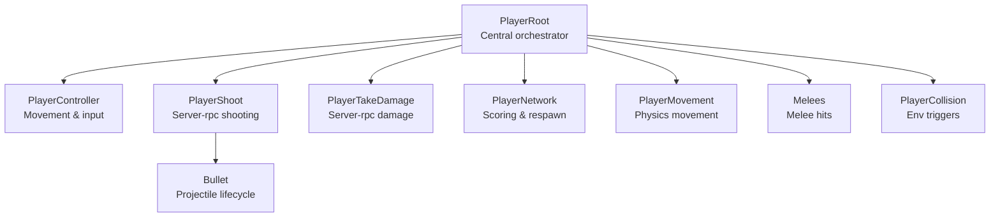
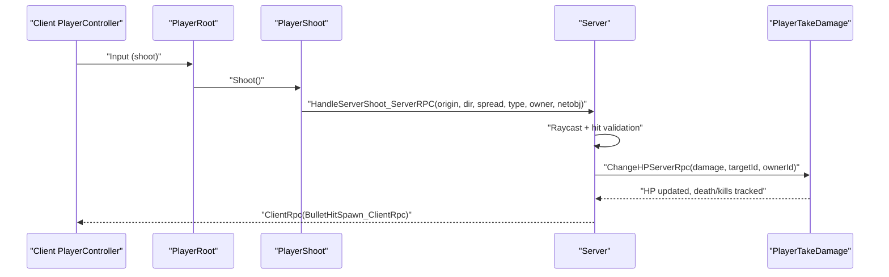
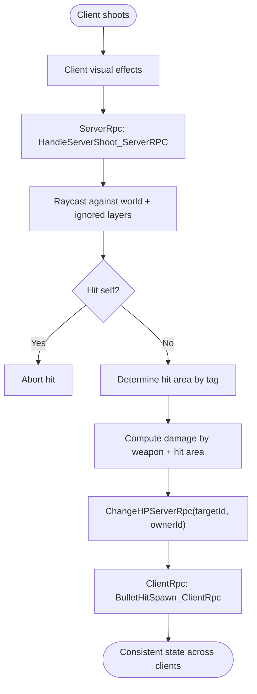
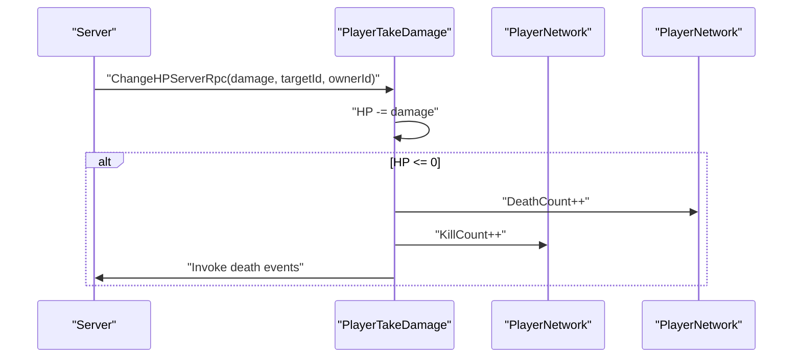
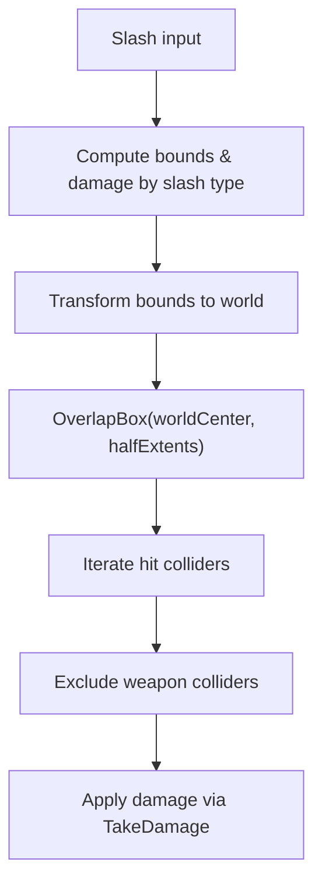
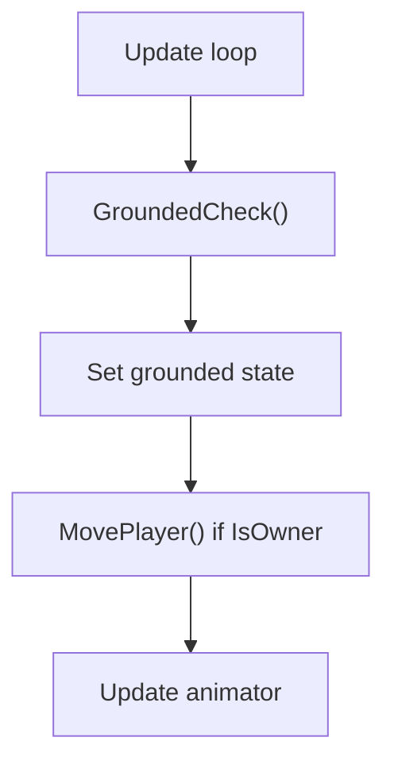
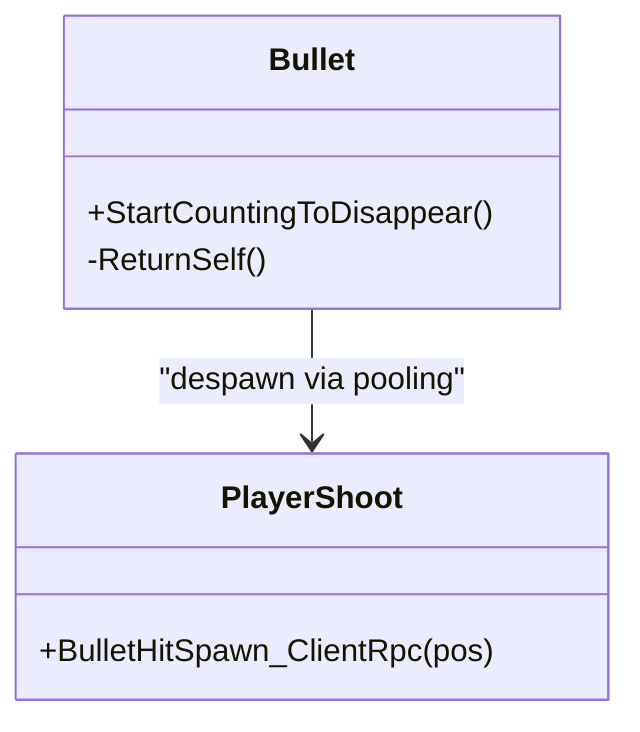
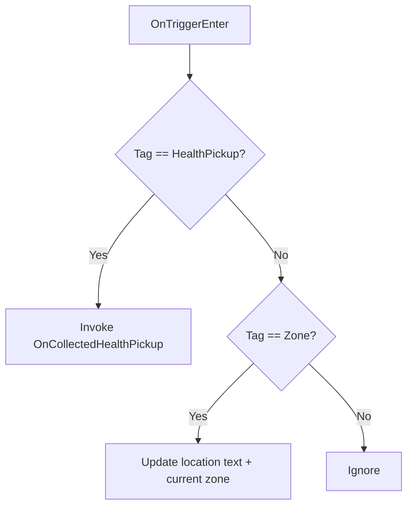
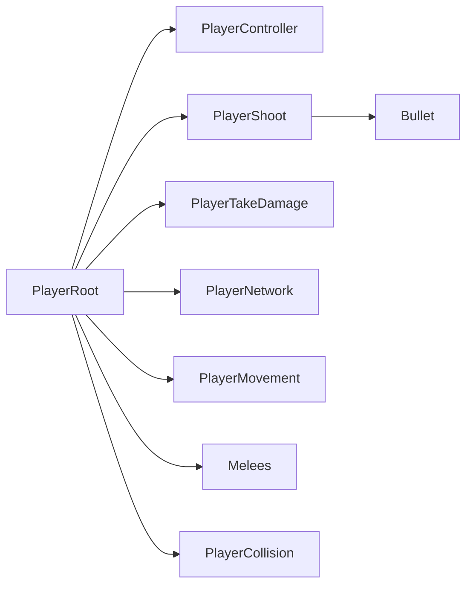

# Server-Authoritative Gameplay Design

<cite>
**Referenced Files in This Document**
- [PlayerShoot.cs](file://Assets/FPS-Game/Scripts/Player/PlayerShoot.cs)
- [PlayerTakeDamage.cs](file://Assets/FPS-Game/Scripts/Player/PlayerTakeDamage.cs)
- [PlayerRoot.cs](file://Assets/FPS-Game/Scripts/Player/PlayerRoot.cs)
- [PlayerNetwork.cs](file://Assets/FPS-Game/Scripts/Player/PlayerNetwork.cs)
- [PlayerController.cs](file://Assets/FPS-Game/Scripts/Player/PlayerController.cs)
- [PlayerMovement.cs](file://Assets/FPS-Game/Scripts/PlayerMovement.cs)
- [PlayerAssetsInputs.cs](file://Assets/FPS-Game/Scripts/Player/PlayerAssetsInputs.cs)
- [Melees.cs](file://Assets/FPS-Game/Scripts/Melees.cs)
- [Bullet.cs](file://Assets/FPS-Game/Scripts/Bullet.cs)
- [PlayerCollision.cs](file://Assets/FPS-Game/Scripts/Player/PlayerCollision.cs)
</cite>

## Table of Contents
1. [Introduction](#introduction)
2. [Project Structure](#project-structure)
3. [Core Components](#core-components)
4. [Architecture Overview](#architecture-overview)
5. [Detailed Component Analysis](#detailed-component-analysis)
6. [Dependency Analysis](#dependency-analysis)
7. [Performance Considerations](#performance-considerations)
8. [Troubleshooting Guide](#troubleshooting-guide)
9. [Conclusion](#conclusion)

## Introduction
This document explains server-authoritative gameplay design and implementation in the FPS project. It focuses on how the server maintains authority over critical game state such as player actions, combat resolution, and scoring systems. It also documents anti-cheat measures, input validation, state reconciliation, authoritative damage calculation, hit registration, weapon cooldown enforcement, client prediction, rollback systems, latency compensation strategies, debugging techniques, and consistency maintenance across clients.

## Project Structure
The authoritative gameplay logic is primarily implemented in the Player subsystem and related systems:
- Player action orchestration and authority: PlayerRoot, PlayerController, PlayerAssetsInputs
- Combat resolution and scoring: PlayerShoot, PlayerTakeDamage, PlayerNetwork
- Movement and physics grounding: PlayerMovement, PlayerController
- Melee hit detection: Melees
- Projectile lifecycle: Bullet
- Environment interactions: PlayerCollision

**Diagram sources**
- [PlayerRoot.cs:159-366](file://Assets/FPS-Game/Scripts/Player/PlayerRoot.cs#L159-L366)
- [PlayerController.cs:1-486](file://Assets/FPS-Game/Scripts/Player/PlayerController.cs#L1-L486)
- [PlayerShoot.cs:20-162](file://Assets/FPS-Game/Scripts/Player/PlayerShoot.cs#L20-L162)
- [PlayerTakeDamage.cs:5-124](file://Assets/FPS-Game/Scripts/Player/PlayerTakeDamage.cs#L5-L124)
- [PlayerNetwork.cs:12-541](file://Assets/FPS-Game/Scripts/Player/PlayerNetwork.cs#L12-L541)
- [PlayerMovement.cs:5-158](file://Assets/FPS-Game/Scripts/PlayerMovement.cs#L5-L158)
- [Melees.cs:91-130](file://Assets/FPS-Game/Scripts/Melees.cs#L91-L130)
- [PlayerCollision.cs:4-24](file://Assets/FPS-Game/Scripts/Player/PlayerCollision.cs#L4-L24)
- [Bullet.cs:5-23](file://Assets/FPS-Game/Scripts/Bullet.cs#L5-L23)

**Section sources**
- [PlayerRoot.cs:159-366](file://Assets/FPS-Game/Scripts/Player/PlayerRoot.cs#L159-L366)
- [PlayerController.cs:1-486](file://Assets/FPS-Game/Scripts/Player/PlayerController.cs#L1-L486)
- [PlayerShoot.cs:20-162](file://Assets/FPS-Game/Scripts/Player/PlayerShoot.cs#L20-L162)
- [PlayerTakeDamage.cs:5-124](file://Assets/FPS-Game/Scripts/Player/PlayerTakeDamage.cs#L5-L124)
- [PlayerNetwork.cs:12-541](file://Assets/FPS-Game/Scripts/Player/PlayerNetwork.cs#L12-L541)
- [PlayerMovement.cs:5-158](file://Assets/FPS-Game/Scripts/PlayerMovement.cs#L5-L158)
- [Melees.cs:91-130](file://Assets/FPS-Game/Scripts/Melees.cs#L91-L130)
- [PlayerCollision.cs:4-24](file://Assets/FPS-Game/Scripts/Player/PlayerCollision.cs#L4-L24)
- [Bullet.cs:5-23](file://Assets/FPS-Game/Scripts/Bullet.cs#L5-L23)

## Core Components
- Server-rpc shooting: PlayerShoot.HandleServerShoot_ServerRPC validates raycasts, excludes self, determines hit area, computes damage, and invokes authoritative TakeDamage.
- Authoritative damage: PlayerTakeDamage.ChangeHPServerRpc updates HP, death, and kill/death counts via PlayerNetwork.
- Scoring and respawn: PlayerNetwork manages kill/death counters and triggers respawns.
- Movement authority: PlayerMovement restricts movement logic to owners; PlayerController handles grounded checks and animations.
- Melee hits: Melees.CheckSlashHit_ServerRPC performs server-side box overlap for hit detection.
- Projectile lifecycle: Bullet manages despawn timers and pooling.
- Environment interactions: PlayerCollision handles triggers and zone transitions.

**Section sources**
- [PlayerShoot.cs:80-146](file://Assets/FPS-Game/Scripts/Player/PlayerShoot.cs#L80-L146)
- [PlayerTakeDamage.cs:58-83](file://Assets/FPS-Game/Scripts/Player/PlayerTakeDamage.cs#L58-L83)
- [PlayerNetwork.cs:14-16](file://Assets/FPS-Game/Scripts/Player/PlayerNetwork.cs#L14-L16)
- [PlayerMovement.cs:65-70](file://Assets/FPS-Game/Scripts/PlayerMovement.cs#L65-L70)
- [PlayerController.cs:174-189](file://Assets/FPS-Game/Scripts/Player/PlayerController.cs#L174-L189)
- [Melees.cs:95-130](file://Assets/FPS-Game/Scripts/Melees.cs#L95-L130)
- [Bullet.cs:7-22](file://Assets/FPS-Game/Scripts/Bullet.cs#L7-L22)
- [PlayerCollision.cs:6-23](file://Assets/FPS-Game/Scripts/Player/PlayerCollision.cs#L6-L23)

## Architecture Overview
The system enforces server authority for all conflict-producing events:
- Clients send inputs and requests to the server.
- The server validates and resolves actions.
- The server broadcasts authoritative state to all clients.
- Clients may predict locally for responsiveness and reconcile with server state.

**Diagram sources**
- [PlayerController.cs:350-359](file://Assets/FPS-Game/Scripts/Player/PlayerController.cs#L350-L359)
- [PlayerShoot.cs:68-77](file://Assets/FPS-Game/Scripts/Player/PlayerShoot.cs#L68-L77)
- [PlayerShoot.cs:80-146](file://Assets/FPS-Game/Scripts/Player/PlayerShoot.cs#L80-L146)
- [PlayerTakeDamage.cs:58-83](file://Assets/FPS-Game/Scripts/Player/PlayerTakeDamage.cs#L58-L83)

## Detailed Component Analysis

### Server-Rpc Shooting and Hit Registration
- Input capture: PlayerController receives inputs and triggers shooting.
- Prediction: Client may visually play effects immediately.
- Authority: PlayerShoot.HandleServerShoot_ServerRPC executes the authoritative raycast, ignores self-hits, maps hit areas to damage values, and calls PlayerTakeDamage.TakeDamage.
- Anti-cheat: The server re-validates hit geometry and hit zones; clients cannot bypass server-side hit area tagging.

**Diagram sources**
- [PlayerController.cs:350-359](file://Assets/FPS-Game/Scripts/Player/PlayerController.cs#L350-L359)
- [PlayerShoot.cs:80-146](file://Assets/FPS-Game/Scripts/Player/PlayerShoot.cs#L80-L146)
- [PlayerTakeDamage.cs:58-83](file://Assets/FPS-Game/Scripts/Player/PlayerTakeDamage.cs#L58-L83)

**Section sources**
- [PlayerShoot.cs:68-77](file://Assets/FPS-Game/Scripts/Player/PlayerShoot.cs#L68-L77)
- [PlayerShoot.cs:80-146](file://Assets/FPS-Game/Scripts/Player/PlayerShoot.cs#L80-L146)
- [PlayerAssetsInputs.cs:170-173](file://Assets/FPS-Game/Scripts/Player/PlayerAssetsInputs.cs#L170-L173)

### Authoritative Damage Calculation and Scoring
- PlayerTakeDamage.ChangeHPServerRpc decrements HP and enforces zero-bound; on death increments death count on the target and kill count on the killer via PlayerNetwork.
- PlayerNetwork tracks KillCount and DeathCount as NetworkVariables for synchronization.
- Respawn and camera management are handled locally upon death events.

**Diagram sources**
- [PlayerTakeDamage.cs:58-83](file://Assets/FPS-Game/Scripts/Player/PlayerTakeDamage.cs#L58-L83)
- [PlayerNetwork.cs:14-16](file://Assets/FPS-Game/Scripts/Player/PlayerNetwork.cs#L14-L16)

**Section sources**
- [PlayerTakeDamage.cs:58-83](file://Assets/FPS-Game/Scripts/Player/PlayerTakeDamage.cs#L58-L83)
- [PlayerNetwork.cs:14-16](file://Assets/FPS-Game/Scripts/Player/PlayerNetwork.cs#L14-L16)

### Melee Hit Registration
- Melees.CheckSlashHit_ServerRPC computes world-space bounds from slash type, performs server-side overlap detection, and applies damage similarly to ranged combat.

**Diagram sources**
- [Melees.cs:95-130](file://Assets/FPS-Game/Scripts/Melees.cs#L95-L130)
- [PlayerTakeDamage.cs:46-56](file://Assets/FPS-Game/Scripts/Player/PlayerTakeDamage.cs#L46-L56)

**Section sources**
- [Melees.cs:95-130](file://Assets/FPS-Game/Scripts/Melees.cs#L95-L130)
- [PlayerTakeDamage.cs:46-56](file://Assets/FPS-Game/Scripts/Player/PlayerTakeDamage.cs#L46-L56)

### Movement Authority and Grounded Checks
- Movement is owned by the client but executed only when IsOwner is true.
- Grounded checks are performed locally and influence animations; physics movement remains client-controlled for responsiveness while server-only validates state.

**Diagram sources**
- [PlayerMovement.cs:52-70](file://Assets/FPS-Game/Scripts/PlayerMovement.cs#L52-L70)
- [PlayerController.cs:174-189](file://Assets/FPS-Game/Scripts/Player/PlayerController.cs#L174-L189)

**Section sources**
- [PlayerMovement.cs:52-70](file://Assets/FPS-Game/Scripts/PlayerMovement.cs#L52-L70)
- [PlayerController.cs:174-189](file://Assets/FPS-Game/Scripts/Player/PlayerController.cs#L174-L189)

### Projectile Lifecycle and Validation
- Bullets are pooled and despawn after a timeout to prevent orphaned objects.
- ServerRpc spawns hit effects on clients for visual feedback.

**Diagram sources**
- [Bullet.cs:7-22](file://Assets/FPS-Game/Scripts/Bullet.cs#L7-L22)
- [PlayerShoot.cs:148-154](file://Assets/FPS-Game/Scripts/Player/PlayerShoot.cs#L148-L154)

**Section sources**
- [Bullet.cs:7-22](file://Assets/FPS-Game/Scripts/Bullet.cs#L7-L22)
- [PlayerShoot.cs:148-154](file://Assets/FPS-Game/Scripts/Player/PlayerShoot.cs#L148-L154)

### Environmental Interaction Verification
- PlayerCollision handles triggers for pickups and zone transitions; events are raised for UI updates and state changes.

**Diagram sources**
- [PlayerCollision.cs:6-23](file://Assets/FPS-Game/Scripts/Player/PlayerCollision.cs#L6-L23)

**Section sources**
- [PlayerCollision.cs:6-23](file://Assets/FPS-Game/Scripts/Player/PlayerCollision.cs#L6-L23)

## Dependency Analysis
- PlayerRoot composes and initializes subsystems (movement, shooting, damage, UI, etc.) and exposes centralized events.
- PlayerShoot depends on weapon stats and hit area mapping; resolves hits via PlayerTakeDamage.
- PlayerTakeDamage depends on PlayerNetwork for kill/death accounting.
- PlayerController coordinates input, movement, and animations; grounded checks inform movement logic.
- Melees depends on PlayerRoot for slash-type mapping and server-side hit detection.
- Bullet is decoupled and managed by a manager; interacts with PlayerShoot for effects.

**Diagram sources**
- [PlayerRoot.cs:259-296](file://Assets/FPS-Game/Scripts/Player/PlayerRoot.cs#L259-L296)
- [PlayerShoot.cs:20-65](file://Assets/FPS-Game/Scripts/Player/PlayerShoot.cs#L20-L65)
- [PlayerTakeDamage.cs:5-17](file://Assets/FPS-Game/Scripts/Player/PlayerTakeDamage.cs#L5-L17)
- [PlayerNetwork.cs:12-541](file://Assets/FPS-Game/Scripts/Player/PlayerNetwork.cs#L12-L541)
- [PlayerMovement.cs:5-158](file://Assets/FPS-Game/Scripts/PlayerMovement.cs#L5-L158)
- [Melees.cs:91-130](file://Assets/FPS-Game/Scripts/Melees.cs#L91-L130)
- [PlayerCollision.cs:4-24](file://Assets/FPS-Game/Scripts/Player/PlayerCollision.cs#L4-L24)
- [Bullet.cs:5-23](file://Assets/FPS-Game/Scripts/Bullet.cs#L5-L23)

**Section sources**
- [PlayerRoot.cs:259-296](file://Assets/FPS-Game/Scripts/Player/PlayerRoot.cs#L259-L296)
- [PlayerShoot.cs:20-65](file://Assets/FPS-Game/Scripts/Player/PlayerShoot.cs#L20-L65)
- [PlayerTakeDamage.cs:5-17](file://Assets/FPS-Game/Scripts/Player/PlayerTakeDamage.cs#L5-L17)
- [PlayerNetwork.cs:12-541](file://Assets/FPS-Game/Scripts/Player/PlayerNetwork.cs#L12-L541)
- [PlayerMovement.cs:5-158](file://Assets/FPS-Game/Scripts/PlayerMovement.cs#L5-L158)
- [Melees.cs:91-130](file://Assets/FPS-Game/Scripts/Melees.cs#L91-L130)
- [PlayerCollision.cs:4-24](file://Assets/FPS-Game/Scripts/Player/PlayerCollision.cs#L4-L24)
- [Bullet.cs:5-23](file://Assets/FPS-Game/Scripts/Bullet.cs#L5-L23)

## Performance Considerations
- Server-rpc shooting: Prefer narrow raycasts and minimal overlap checks; cache computed bounds and scales.
- Hit registration: Use tags and simple shapes to reduce broad-phase cost; avoid expensive per-triangle checks.
- Movement: Keep grounded checks lightweight; defer complex logic to animations.
- Projectile pooling: Reuse bullets to minimize GC pressure; despawn off-screen or after TTL.
- Networking: Batch state updates where possible; use ClientRpc selectively for cosmetic effects.

## Troubleshooting Guide
- Out-of-order packets: Ensure server-rpc ordering by sequencing inputs and applying authoritative decisions deterministically.
- Self-hit prevention: Verify owner and network object identity checks before applying damage.
- Hit area validation: Confirm tags align with hit zones; log unexpected hit tags for diagnostics.
- State reconciliation: On respawn or desync, reset HP and re-synchronize counters via PlayerNetwork.
- Debugging authoritative issues:
  - Log server-side hit validation outcomes.
  - Compare client-side predicted effects with server-rpc effects.
  - Inspect grounded state and movement deltas during lag spikes.

**Section sources**
- [PlayerShoot.cs:108-112](file://Assets/FPS-Game/Scripts/Player/PlayerShoot.cs#L108-L112)
- [PlayerTakeDamage.cs:106-123](file://Assets/FPS-Game/Scripts/Player/PlayerTakeDamage.cs#L106-L123)

## Conclusion
The project implements a robust server-authoritative model for combat and state management. Server-rpcs enforce hit validation, damage computation, and scoring, while clients handle responsive prediction and visual feedback. Anti-cheat is achieved through server-side validation of inputs and hit geometry. With careful attention to state reconciliation, latency compensation, and debugging practices, the system maintains fairness and consistency across all clients.