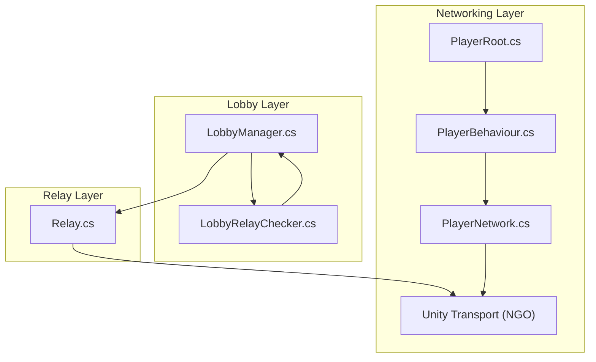
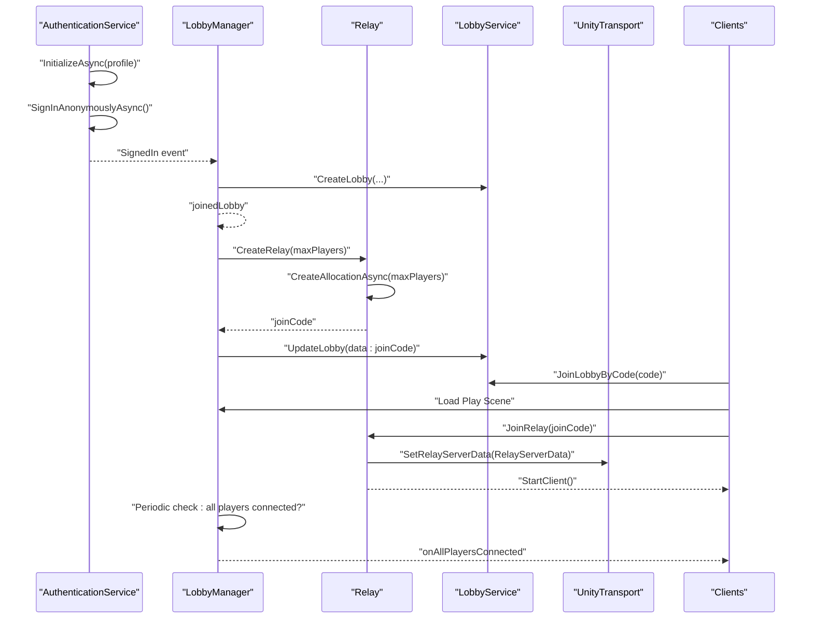
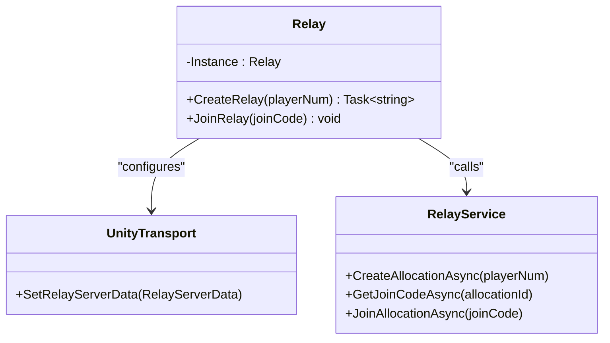
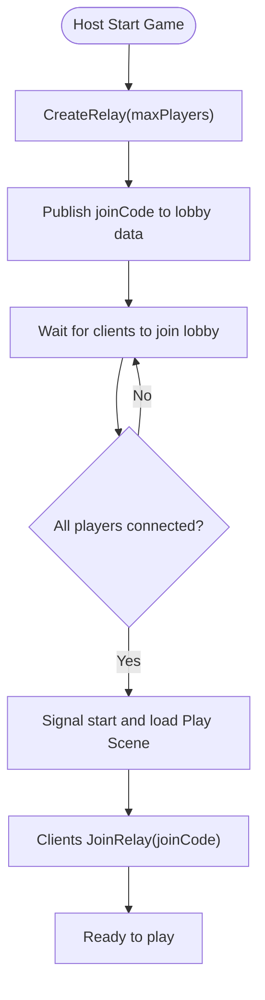
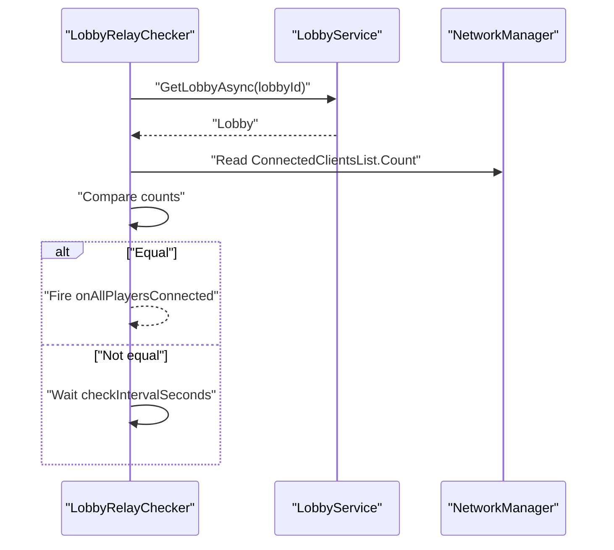
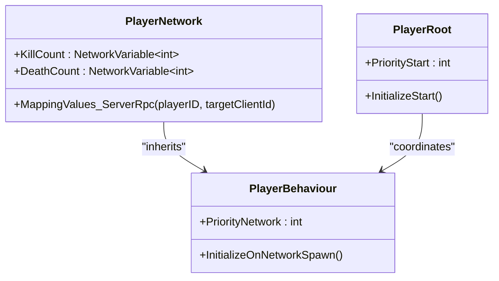
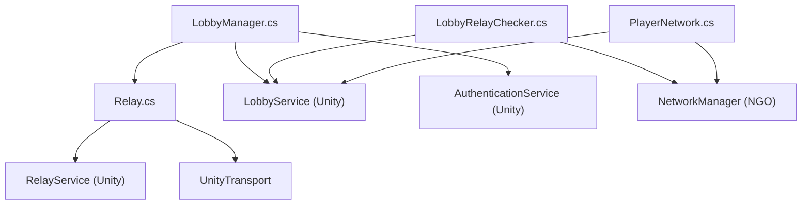

# Relay & Cloud Services

<cite>
**Referenced Files in This Document**
- [README.md](file://README.md)
- [Relay.cs](file://Assets/FPS-Game/Scripts/Lobby Script/Lobby/Scripts/Relay.cs)
- [LobbyManager.cs](file://Assets/FPS-Game/Scripts/Lobby Script/Lobby/Scripts/LobbyManager.cs)
- [LobbyRelayChecker.cs](file://Assets/FPS-Game/Scripts/System/LobbyRelayChecker.cs)
- [PlayerNetwork.cs](file://Assets/FPS-Game/Scripts/Player/PlayerNetwork.cs)
- [PlayerRoot.cs](file://Assets/FPS-Game/Scripts/Player/PlayerRoot.cs)
- [PlayerBehaviour.cs](file://Assets/FPS-Game/Scripts/Player/PlayerBehaviour.cs)
</cite>

## Table of Contents
1. [Introduction](#introduction)
2. [Project Structure](#project-structure)
3. [Core Components](#core-components)
4. [Architecture Overview](#architecture-overview)
5. [Detailed Component Analysis](#detailed-component-analysis)
6. [Dependency Analysis](#dependency-analysis)
7. [Performance Considerations](#performance-considerations)
8. [Troubleshooting Guide](#troubleshooting-guide)
9. [Conclusion](#conclusion)
10. [Appendices](#appendices)

## Introduction
This document explains the Unity Gaming Services integration for Relay and cloud-based matchmaking in the project. It covers how the lobby system coordinates with Unity Relay to create and join sessions, how relay codes are generated and shared, and how peers connect via Unity Transport over Relay. It also documents Unity Services initialization, authentication, and service configuration requirements, along with practical examples for creating relay rooms, joining existing sessions, handling failures, and strategies for NAT traversal and connection quality under varying network conditions.

## Project Structure
The networking and matchmaking logic is primarily implemented in three areas:
- Lobby orchestration and matchmaking: [LobbyManager.cs](file://Assets/FPS-Game/Scripts/Lobby Script/Lobby/Scripts/LobbyManager.cs)
- Relay allocation, join code generation, and transport configuration: [Relay.cs](file://Assets/FPS-Game/Scripts/Lobby Script/Lobby/Scripts/Relay.cs)
- Session readiness verification and event signaling: [LobbyRelayChecker.cs](file://Assets/FPS-Game/Scripts/System/LobbyRelayChecker.cs)
- Player-side network synchronization and lobby-aware behaviors: [PlayerNetwork.cs](file://Assets/FPS-Game/Scripts/Player/PlayerNetwork.cs), [PlayerRoot.cs](file://Assets/FPS-Game/Scripts/Player/PlayerRoot.cs), [PlayerBehaviour.cs](file://Assets/FPS-Game/Scripts/Player/PlayerBehaviour.cs)

**Diagram sources**
- [LobbyManager.cs:1-589](file://Assets/FPS-Game/Scripts/Lobby Script/Lobby/Scripts/LobbyManager.cs#L1-L589)
- [Relay.cs:1-71](file://Assets/FPS-Game/Scripts/Lobby Script/Lobby/Scripts/Relay.cs#L1-L71)
- [LobbyRelayChecker.cs:1-63](file://Assets/FPS-Game/Scripts/System/LobbyRelayChecker.cs#L1-L63)
- [PlayerNetwork.cs:1-432](file://Assets/FPS-Game/Scripts/Player/PlayerNetwork.cs#L1-L432)
- [PlayerRoot.cs:323-366](file://Assets/FPS-Game/Scripts/Player/PlayerRoot.cs#L323-L366)
- [PlayerBehaviour.cs:1-31](file://Assets/FPS-Game/Scripts/Player/PlayerBehaviour.cs#L1-L31)

**Section sources**
- [README.md:26-32](file://README.md#L26-L32)
- [LobbyManager.cs:1-589](file://Assets/FPS-Game/Scripts/Lobby Script/Lobby/Scripts/LobbyManager.cs#L1-L589)
- [Relay.cs:1-71](file://Assets/FPS-Game/Scripts/Lobby Script/Lobby/Scripts/Relay.cs#L1-L71)
- [LobbyRelayChecker.cs:1-63](file://Assets/FPS-Game/Scripts/System/LobbyRelayChecker.cs#L1-L63)
- [PlayerNetwork.cs:1-432](file://Assets/FPS-Game/Scripts/Player/PlayerNetwork.cs#L1-L432)
- [PlayerRoot.cs:323-366](file://Assets/FPS-Game/Scripts/Player/PlayerRoot.cs#L323-L366)
- [PlayerBehaviour.cs:1-31](file://Assets/FPS-Game/Scripts/Player/PlayerBehaviour.cs#L1-L31)

## Core Components
- Unity Services initialization and authentication:
  - Initializes Unity Services with a player profile and signs in anonymously.
  - Triggers lobby list refresh upon successful sign-in.
  - See [LobbyManager.cs:86-104](file://Assets/FPS-Game/Scripts/Lobby Script/Lobby/Scripts/LobbyManager.cs#L86-L104).
- Relay creation and join:
  - Creates a Relay allocation, generates a join code, configures Unity Transport with Relay server data, and starts as host.
  - Joins an existing Relay allocation using a join code and starts as client.
  - See [Relay.cs:26-70](file://Assets/FPS-Game/Scripts/Lobby Script/Lobby/Scripts/Relay.cs#L26-L70).
- Lobby-to-Relay handoff:
  - Host creates a Relay and writes the join code into lobby data for members to consume.
  - Non-host clients read the join code from lobby data and join Relay.
  - See [LobbyManager.cs:545-569](file://Assets/FPS-Game/Scripts/Lobby Script/Lobby/Scripts/LobbyManager.cs#L545-L569) and [LobbyManager.cs:170-177](file://Assets/FPS-Game/Scripts/Lobby Script/Lobby/Scripts/LobbyManager.cs#L170-L177).
- Session readiness:
  - Periodically compares lobby player count with connected clients to signal when all players are ready to play.
  - See [LobbyRelayChecker.cs:19-61](file://Assets/FPS-Game/Scripts/System/LobbyRelayChecker.cs#L19-L61).
- Player synchronization:
  - Networked player behaviors and synchronization integrate with NGO and rely on lobby context for identity and state.
  - See [PlayerNetwork.cs:12-220](file://Assets/FPS-Game/Scripts/Player/PlayerNetwork.cs#L12-L220), [PlayerRoot.cs:323-366](file://Assets/FPS-Game/Scripts/Player/PlayerRoot.cs#L323-L366), [PlayerBehaviour.cs:1-31](file://Assets/FPS-Game/Scripts/Player/PlayerBehaviour.cs#L1-L31).

**Section sources**
- [LobbyManager.cs:86-104](file://Assets/FPS-Game/Scripts/Lobby Script/Lobby/Scripts/LobbyManager.cs#L86-L104)
- [Relay.cs:26-70](file://Assets/FPS-Game/Scripts/Lobby Script/Lobby/Scripts/Relay.cs#L26-L70)
- [LobbyManager.cs:545-569](file://Assets/FPS-Game/Scripts/Lobby Script/Lobby/Scripts/LobbyManager.cs#L545-L569)
- [LobbyManager.cs:170-177](file://Assets/FPS-Game/Scripts/Lobby Script/Lobby/Scripts/LobbyManager.cs#L170-L177)
- [LobbyRelayChecker.cs:19-61](file://Assets/FPS-Game/Scripts/System/LobbyRelayChecker.cs#L19-L61)
- [PlayerNetwork.cs:12-220](file://Assets/FPS-Game/Scripts/Player/PlayerNetwork.cs#L12-L220)
- [PlayerRoot.cs:323-366](file://Assets/FPS-Game/Scripts/Player/PlayerRoot.cs#L323-L366)
- [PlayerBehaviour.cs:1-31](file://Assets/FPS-Game/Scripts/Player/PlayerBehaviour.cs#L1-L31)

## Architecture Overview
The system integrates Unity Lobby for matchmaking and Unity Relay for serverless connectivity. The flow:
- Unity Services initialize and authenticate the player.
- Host creates a lobby and a Relay allocation, stores the join code in lobby data.
- Clients join the lobby and the same scene, then join Relay using the stored code.
- Once all players are connected, the game proceeds to the play scene.

**Diagram sources**
- [LobbyManager.cs:86-104](file://Assets/FPS-Game/Scripts/Lobby Script/Lobby/Scripts/LobbyManager.cs#L86-L104)
- [LobbyManager.cs:264-286](file://Assets/FPS-Game/Scripts/Lobby Script/Lobby/Scripts/LobbyManager.cs#L264-L286)
- [LobbyManager.cs:545-569](file://Assets/FPS-Game/Scripts/Lobby Script/Lobby/Scripts/LobbyManager.cs#L545-L569)
- [LobbyManager.cs:170-177](file://Assets/FPS-Game/Scripts/Lobby Script/Lobby/Scripts/LobbyManager.cs#L170-L177)
- [Relay.cs:26-70](file://Assets/FPS-Game/Scripts/Lobby Script/Lobby/Scripts/Relay.cs#L26-L70)

## Detailed Component Analysis

### Relay Component
Responsibilities:
- Create a Relay allocation and return a join code.
- Configure Unity Transport with Relay server data and start as host.
- Join an existing Relay allocation using a join code and start as client.
- Handle exceptions from the Relay service.

Key behaviors:
- Allocation creation and join code retrieval: [Relay.cs:27-33](file://Assets/FPS-Game/Scripts/Lobby Script/Lobby/Scripts/Relay.cs#L27-L33)
- Transport configuration and host/client startup: [Relay.cs:37-41](file://Assets/FPS-Game/Scripts/Lobby Script/Lobby/Scripts/Relay.cs#L37-L41), [Relay.cs:60-64](file://Assets/FPS-Game/Scripts/Lobby Script/Lobby/Scripts/Relay.cs#L60-L64)
- Exception handling: [Relay.cs:45-49](file://Assets/FPS-Game/Scripts/Lobby Script/Lobby/Scripts/Relay.cs#L45-L49), [Relay.cs:66-69](file://Assets/FPS-Game/Scripts/Lobby Script/Lobby/Scripts/Relay.cs#L66-L69)

**Diagram sources**
- [Relay.cs:10-71](file://Assets/FPS-Game/Scripts/Lobby Script/Lobby/Scripts/Relay.cs#L10-L71)

**Section sources**
- [Relay.cs:10-71](file://Assets/FPS-Game/Scripts/Lobby Script/Lobby/Scripts/Relay.cs#L10-L71)

### LobbyManager Component
Responsibilities:
- Initialize Unity Services and authenticate the player.
- Create and join lobbies, maintain lobby state, and poll for updates.
- Host flow: create Relay, write join code into lobby data, and signal start.
- Client flow: read join code from lobby data and join Relay.
- Heartbeat and polling timers to keep lobby state fresh.

Key behaviors:
- Authentication and initialization: [LobbyManager.cs:86-104](file://Assets/FPS-Game/Scripts/Lobby Script/Lobby/Scripts/LobbyManager.cs#L86-L104)
- Host creates Relay and publishes join code: [LobbyManager.cs:545-569](file://Assets/FPS-Game/Scripts/Lobby Script/Lobby/Scripts/LobbyManager.cs#L545-L569)
- Clients join Relay using lobby data: [LobbyManager.cs:170-177](file://Assets/FPS-Game/Scripts/Lobby Script/Lobby/Scripts/LobbyManager.cs#L170-L177)
- Polling and heartbeat: [LobbyManager.cs:122-136](file://Assets/FPS-Game/Scripts/Lobby Script/Lobby/Scripts/LobbyManager.cs#L122-L136), [LobbyManager.cs:138-205](file://Assets/FPS-Game/Scripts/Lobby Script/Lobby/Scripts/LobbyManager.cs#L138-L205)

**Diagram sources**
- [LobbyManager.cs:545-569](file://Assets/FPS-Game/Scripts/Lobby Script/Lobby/Scripts/LobbyManager.cs#L545-L569)
- [LobbyManager.cs:170-177](file://Assets/FPS-Game/Scripts/Lobby Script/Lobby/Scripts/LobbyManager.cs#L170-L177)

**Section sources**
- [LobbyManager.cs:86-104](file://Assets/FPS-Game/Scripts/Lobby Script/Lobby/Scripts/LobbyManager.cs#L86-L104)
- [LobbyManager.cs:545-569](file://Assets/FPS-Game/Scripts/Lobby Script/Lobby/Scripts/LobbyManager.cs#L545-L569)
- [LobbyManager.cs:170-177](file://Assets/FPS-Game/Scripts/Lobby Script/Lobby/Scripts/LobbyManager.cs#L170-L177)
- [LobbyManager.cs:122-136](file://Assets/FPS-Game/Scripts/Lobby Script/Lobby/Scripts/LobbyManager.cs#L122-L136)
- [LobbyManager.cs:138-205](file://Assets/FPS-Game/Scripts/Lobby Script/Lobby/Scripts/LobbyManager.cs#L138-L205)

### LobbyRelayChecker Component
Responsibilities:
- Periodically checks whether the number of connected clients equals the number of lobby players.
- Invokes an event when all players are connected to Relay.

Key behaviors:
- Periodic loop and delay: [LobbyRelayChecker.cs:19-34](file://Assets/FPS-Game/Scripts/System/LobbyRelayChecker.cs#L19-L34)
- Comparison and event firing: [LobbyRelayChecker.cs:40-55](file://Assets/FPS-Game/Scripts/System/LobbyRelayChecker.cs#L40-L55)

**Diagram sources**
- [LobbyRelayChecker.cs:19-61](file://Assets/FPS-Game/Scripts/System/LobbyRelayChecker.cs#L19-L61)

**Section sources**
- [LobbyRelayChecker.cs:19-61](file://Assets/FPS-Game/Scripts/System/LobbyRelayChecker.cs#L19-L61)

### PlayerNetwork Component
Responsibilities:
- Network synchronization for player behaviors.
- Maps lobby player identities to in-game player instances.
- Integrates with NGO and relies on lobby context for player metadata.

Key behaviors:
- Identity mapping RPC: [PlayerNetwork.cs:183-199](file://Assets/FPS-Game/Scripts/Player/PlayerNetwork.cs#L183-L199)
- Network spawn and enable logic: [PlayerNetwork.cs:20-36](file://Assets/FPS-Game/Scripts/Player/PlayerNetwork.cs#L20-L36)

**Diagram sources**
- [PlayerNetwork.cs:12-220](file://Assets/FPS-Game/Scripts/Player/PlayerNetwork.cs#L12-L220)
- [PlayerRoot.cs:323-366](file://Assets/FPS-Game/Scripts/Player/PlayerRoot.cs#L323-L366)
- [PlayerBehaviour.cs:1-31](file://Assets/FPS-Game/Scripts/Player/PlayerBehaviour.cs#L1-L31)

**Section sources**
- [PlayerNetwork.cs:12-220](file://Assets/FPS-Game/Scripts/Player/PlayerNetwork.cs#L12-L220)
- [PlayerRoot.cs:323-366](file://Assets/FPS-Game/Scripts/Player/PlayerRoot.cs#L323-L366)
- [PlayerBehaviour.cs:1-31](file://Assets/FPS-Game/Scripts/Player/PlayerBehaviour.cs#L1-L31)

## Dependency Analysis
- LobbyManager depends on:
  - Unity Services (authentication, lobby) for identity and matchmaking.
  - Relay component for allocation and join code generation.
  - Unity Transport for configuring Relay server data.
- Relay component depends on:
  - Unity Services Relay for allocation/join operations.
  - Unity Transport for setting Relay server data.
- LobbyRelayChecker depends on:
  - Unity Services Lobby for retrieving lobby state.
  - NGO NetworkManager for connected client count.
- PlayerNetwork depends on:
  - NGO for network synchronization.
  - LobbyManager for lobby context and identity mapping.

**Diagram sources**
- [LobbyManager.cs:1-589](file://Assets/FPS-Game/Scripts/Lobby Script/Lobby/Scripts/LobbyManager.cs#L1-L589)
- [Relay.cs:1-71](file://Assets/FPS-Game/Scripts/Lobby Script/Lobby/Scripts/Relay.cs#L1-L71)
- [LobbyRelayChecker.cs:1-63](file://Assets/FPS-Game/Scripts/System/LobbyRelayChecker.cs#L1-L63)
- [PlayerNetwork.cs:1-432](file://Assets/FPS-Game/Scripts/Player/PlayerNetwork.cs#L1-L432)

**Section sources**
- [LobbyManager.cs:1-589](file://Assets/FPS-Game/Scripts/Lobby Script/Lobby/Scripts/LobbyManager.cs#L1-L589)
- [Relay.cs:1-71](file://Assets/FPS-Game/Scripts/Lobby Script/Lobby/Scripts/Relay.cs#L1-L71)
- [LobbyRelayChecker.cs:1-63](file://Assets/FPS-Game/Scripts/System/LobbyRelayChecker.cs#L1-L63)
- [PlayerNetwork.cs:1-432](file://Assets/FPS-Game/Scripts/Player/PlayerNetwork.cs#L1-L432)

## Performance Considerations
- Minimize lobby polling frequency to reduce API overhead; the implementation uses periodic polling with fixed intervals.
- Use Relay join codes to avoid NAT traversal complexity for clients; allocations are created with appropriate capacity.
- Keep the play scene loading lightweight to reduce pre-game delays after joining Relay.
- Monitor connected client count versus lobby player count to avoid premature start signals.

[No sources needed since this section provides general guidance]

## Troubleshooting Guide
Common issues and remedies:
- Authentication failures:
  - Ensure Unity Services initializes and anonymous sign-in completes before refreshing lobby lists.
  - Reference: [LobbyManager.cs:86-104](file://Assets/FPS-Game/Scripts/Lobby Script/Lobby/Scripts/LobbyManager.cs#L86-L104)
- Relay allocation errors:
  - Catch and log RelayServiceException during allocation or join attempts; verify player capacity matches lobby max players.
  - Reference: [Relay.cs:45-49](file://Assets/FPS-Game/Scripts/Lobby Script/Lobby/Scripts/Relay.cs#L45-L49), [Relay.cs:66-69](file://Assets/FPS-Game/Scripts/Lobby Script/Lobby/Scripts/Relay.cs#L66-L69)
- Join code not found:
  - Confirm the host published the join code into lobby data and clients are reading the correct field.
  - Reference: [LobbyManager.cs:553-560](file://Assets/FPS-Game/Scripts/Lobby Script/Lobby/Scripts/LobbyManager.cs#L553-L560), [LobbyManager.cs:170-177](file://Assets/FPS-Game/Scripts/Lobby Script/Lobby/Scripts/LobbyManager.cs#L170-L177)
- Clients not connecting to Relay:
  - Verify Unity Transport is configured with Relay server data after resolving the join code.
  - Reference: [Relay.cs:60-64](file://Assets/FPS-Game/Scripts/Lobby Script/Lobby/Scripts/Relay.cs#L60-L64)
- Players not considered “ready”:
  - Adjust check interval and ensure lobby polling is active; confirm all clients are in the same scene and have started as clients.
  - Reference: [LobbyRelayChecker.cs:19-34](file://Assets/FPS-Game/Scripts/System/LobbyRelayChecker.cs#L19-L34), [LobbyRelayChecker.cs:40-55](file://Assets/FPS-Game/Scripts/System/LobbyRelayChecker.cs#L40-L55)
- NAT traversal problems:
  - Relay handles NAT traversal automatically; ensure internet connectivity and that the build is linked to Unity Services with Relay enabled.
  - Reference: [README.md:92-96](file://README.md#L92-L96)

**Section sources**
- [LobbyManager.cs:86-104](file://Assets/FPS-Game/Scripts/Lobby Script/Lobby/Scripts/LobbyManager.cs#L86-L104)
- [Relay.cs:45-49](file://Assets/FPS-Game/Scripts/Lobby Script/Lobby/Scripts/Relay.cs#L45-L49)
- [Relay.cs:66-69](file://Assets/FPS-Game/Scripts/Lobby Script/Lobby/Scripts/Relay.cs#L66-L69)
- [LobbyManager.cs:553-560](file://Assets/FPS-Game/Scripts/Lobby Script/Lobby/Scripts/LobbyManager.cs#L553-L560)
- [LobbyManager.cs:170-177](file://Assets/FPS-Game/Scripts/Lobby Script/Lobby/Scripts/LobbyManager.cs#L170-L177)
- [Relay.cs:60-64](file://Assets/FPS-Game/Scripts/Lobby Script/Lobby/Scripts/Relay.cs#L60-L64)
- [LobbyRelayChecker.cs:19-34](file://Assets/FPS-Game/Scripts/System/LobbyRelayChecker.cs#L19-L34)
- [LobbyRelayChecker.cs:40-55](file://Assets/FPS-Game/Scripts/System/LobbyRelayChecker.cs#L40-L55)
- [README.md:92-96](file://README.md#L92-L96)

## Conclusion
The project integrates Unity Lobby and Unity Relay to deliver a seamless matchmaking and connectivity experience. The host orchestrates Relay allocation and publishes the join code in lobby data, while clients join the same scene and Relay using that code. Unity Transport is configured centrally to handle NAT traversal transparently. The system includes a readiness checker to coordinate game start timing and relies on NGO for player synchronization.

[No sources needed since this section summarizes without analyzing specific files]

## Appendices

### Practical Examples

- Creating a relay room (host):
  - Steps: Initialize Unity Services, create a lobby, host creates a Relay allocation, publishes the join code to lobby data, and signals start.
  - References: [LobbyManager.cs:264-286](file://Assets/FPS-Game/Scripts/Lobby Script/Lobby/Scripts/LobbyManager.cs#L264-L286), [LobbyManager.cs:545-569](file://Assets/FPS-Game/Scripts/Lobby Script/Lobby/Scripts/LobbyManager.cs#L545-L569)

- Joining an existing session (client):
  - Steps: Authenticate, join lobby by code, load the play scene, and join Relay using the stored join code.
  - References: [LobbyManager.cs:321-335](file://Assets/FPS-Game/Scripts/Lobby Script/Lobby/Scripts/LobbyManager.cs#L321-L335), [LobbyManager.cs:170-177](file://Assets/FPS-Game/Scripts/Lobby Script/Lobby/Scripts/LobbyManager.cs#L170-L177)

- Handling relay connection failures:
  - Log exceptions from Relay operations and surface meaningful errors to users; retry logic can be added around allocation/join calls.
  - References: [Relay.cs:45-49](file://Assets/FPS-Game/Scripts/Lobby Script/Lobby/Scripts/Relay.cs#L45-L49), [Relay.cs:66-69](file://Assets/FPS-Game/Scripts/Lobby Script/Lobby/Scripts/Relay.cs#L66-L69)

- Network topology considerations:
  - Use Relay for NAT traversal; ensure clients start as clients after transport configuration.
  - References: [Relay.cs:60-64](file://Assets/FPS-Game/Scripts/Lobby Script/Lobby/Scripts/Relay.cs#L60-L64)

- Connection quality monitoring and fallbacks:
  - Monitor connected client count against lobby player count; if mismatch persists, prompt users to rejoin or check connectivity.
  - References: [LobbyRelayChecker.cs:40-55](file://Assets/FPS-Game/Scripts/System/LobbyRelayChecker.cs#L40-L55)

**Section sources**
- [LobbyManager.cs:264-286](file://Assets/FPS-Game/Scripts/Lobby Script/Lobby/Scripts/LobbyManager.cs#L264-L286)
- [LobbyManager.cs:545-569](file://Assets/FPS-Game/Scripts/Lobby Script/Lobby/Scripts/LobbyManager.cs#L545-L569)
- [LobbyManager.cs:321-335](file://Assets/FPS-Game/Scripts/Lobby Script/Lobby/Scripts/LobbyManager.cs#L321-L335)
- [LobbyManager.cs:170-177](file://Assets/FPS-Game/Scripts/Lobby Script/Lobby/Scripts/LobbyManager.cs#L170-L177)
- [Relay.cs:45-49](file://Assets/FPS-Game/Scripts/Lobby Script/Lobby/Scripts/Relay.cs#L45-L49)
- [Relay.cs:66-69](file://Assets/FPS-Game/Scripts/Lobby Script/Lobby/Scripts/Relay.cs#L66-L69)
- [Relay.cs:60-64](file://Assets/FPS-Game/Scripts/Lobby Script/Lobby/Scripts/Relay.cs#L60-L64)
- [LobbyRelayChecker.cs:40-55](file://Assets/FPS-Game/Scripts/System/LobbyRelayChecker.cs#L40-L55)