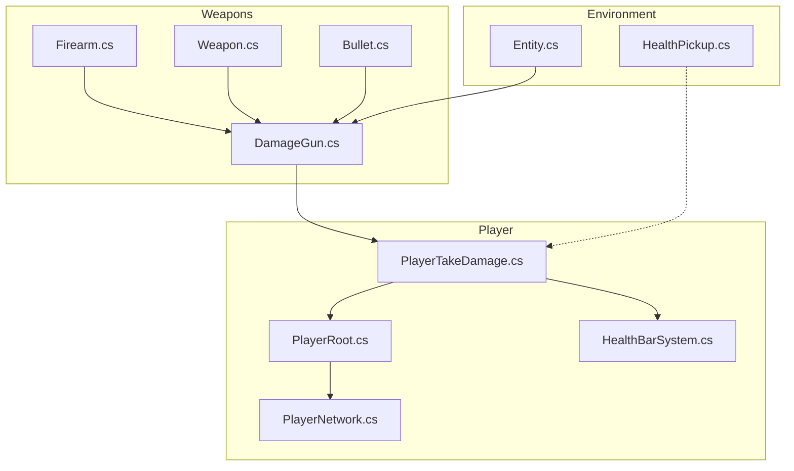
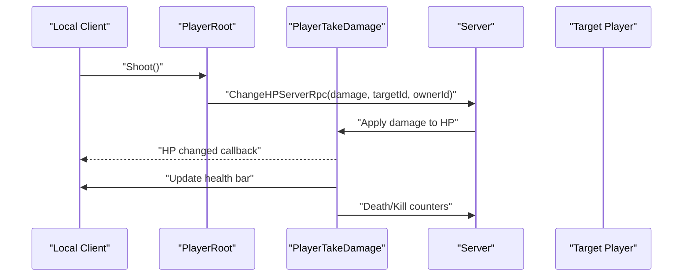
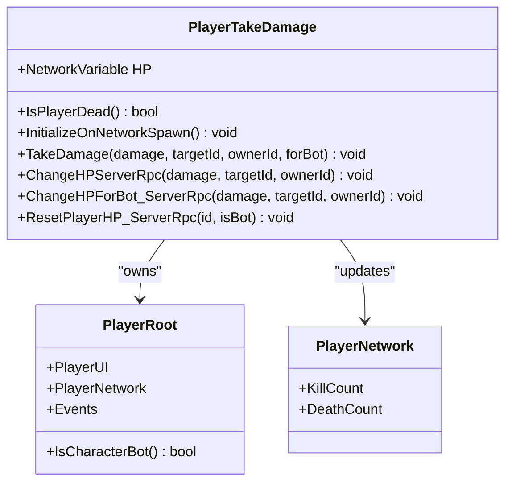
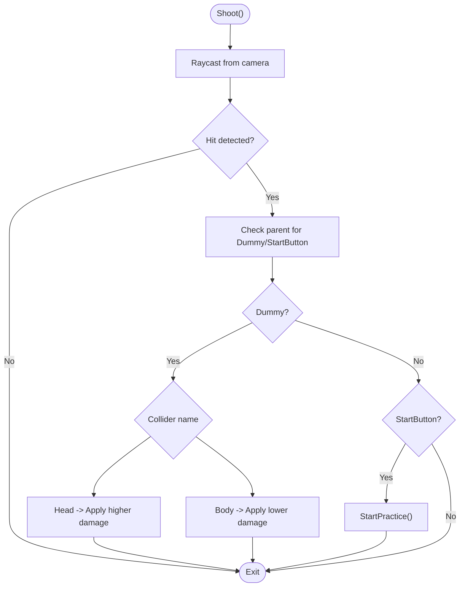
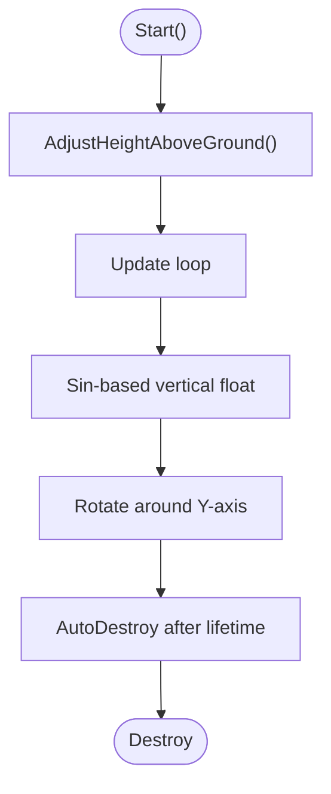
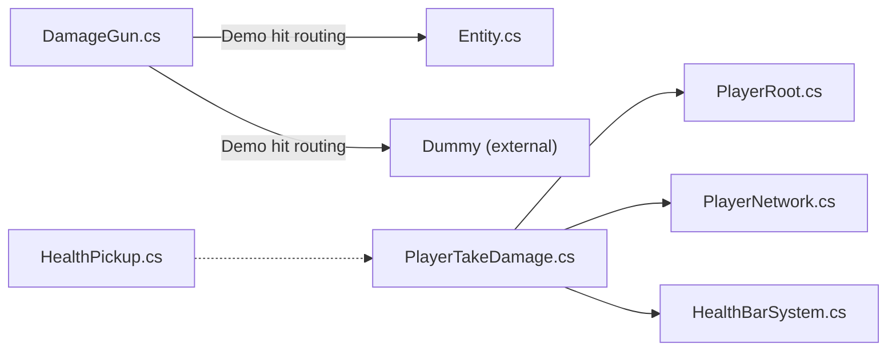

# Player Health & Damage System

<cite>
**Referenced Files in This Document**
- [PlayerTakeDamage.cs](file://Assets/FPS-Game/Scripts/Player/PlayerTakeDamage.cs)
- [DamageGun.cs](file://Assets/FPS-Game/Scripts/DamageGun.cs)
- [HealthPickup.cs](file://Assets/FPS-Game/Scripts/HealthPickup.cs)
- [HealthBarSystem.cs](file://Assets/FPS-Game/Scripts/HealthBarSystem.cs)
- [Entity.cs](file://Assets/FPS-Game/Scripts/Entity.cs)
- [Firearm.cs](file://Assets/FPS-Game/Scripts/Firearm.cs)
- [Weapon.cs](file://Assets/FPS-Game/Scripts/Weapon.cs)
- [PlayerRoot.cs](file://Assets/FPS-Game/Scripts/Player/PlayerRoot.cs)
- [PlayerNetwork.cs](file://Assets/FPS-Game/Scripts/Player/PlayerNetwork.cs)
- [Bullet.cs](file://Assets/FPS-Game/Scripts/Bullet.cs)
</cite>

## Table of Contents
1. [Introduction](#introduction)
2. [Project Structure](#project-structure)
3. [Core Components](#core-components)
4. [Architecture Overview](#architecture-overview)
5. [Detailed Component Analysis](#detailed-component-analysis)
6. [Dependency Analysis](#dependency-analysis)
7. [Performance Considerations](#performance-considerations)
8. [Troubleshooting Guide](#troubleshooting-guide)
9. [Conclusion](#conclusion)
10. [Appendices](#appendices)

## Introduction
This document explains the player health and damage system with a focus on damage calculation and health management. It covers:
- Hit detection and damage application via PlayerTakeDamage
- Weapon damage values, hit location modifiers, and categorization via DamageGun and related weapon scripts
- Health reduction mechanics, health bar synchronization, and health pickups
- Server-authoritative damage processing, prediction, and reconciliation for networked gameplay
- Health regeneration, damage over time, and environmental damage sources
- Troubleshooting guidance for common damage-related issues

## Project Structure
The health and damage system spans several scripts under the Scripts/Player and Scripts folders, along with weapon and entity systems:
- PlayerTakeDamage: Server-authoritative health tracking and damage application
- DamageGun: Hit detection and hit location routing
- HealthPickup: Floating health item with lifecycle
- HealthBarSystem: Health bar pooling and rendering
- Entity: Generic entity damage and bullet holes
- Firearm/Weapon: Weapon definitions and firing logic
- PlayerRoot/PlayerNetwork: Player state and networking hooks
- Bullet: Projectile behavior

**Diagram sources**
- [PlayerTakeDamage.cs](file://Assets/FPS-Game/Scripts/Player/PlayerTakeDamage.cs)
- [DamageGun.cs](file://Assets/FPS-Game/Scripts/DamageGun.cs)
- [HealthBarSystem.cs](file://Assets/FPS-Game/Scripts/HealthBarSystem.cs)
- [Entity.cs](file://Assets/FPS-Game/Scripts/Entity.cs)
- [Firearm.cs](file://Assets/FPS-Game/Scripts/Firearm.cs)
- [Weapon.cs](file://Assets/FPS-Game/Scripts/Weapon.cs)
- [Bullet.cs](file://Assets/FPS-Game/Scripts/Bullet.cs)
- [PlayerRoot.cs](file://Assets/FPS-Game/Scripts/Player/PlayerRoot.cs)
- [PlayerNetwork.cs](file://Assets/FPS-Game/Scripts/Player/PlayerNetwork.cs)
- [HealthPickup.cs](file://Assets/FPS-Game/Scripts/HealthPickup.cs)

**Section sources**
- [PlayerTakeDamage.cs](file://Assets/FPS-Game/Scripts/Player/PlayerTakeDamage.cs)
- [DamageGun.cs](file://Assets/FPS-Game/Scripts/DamageGun.cs)
- [HealthBarSystem.cs](file://Assets/FPS-Game/Scripts/HealthBarSystem.cs)
- [Entity.cs](file://Assets/FPS-Game/Scripts/Entity.cs)
- [Firearm.cs](file://Assets/FPS-Game/Scripts/Firearm.cs)
- [Weapon.cs](file://Assets/FPS-Game/Scripts/Weapon.cs)
- [Bullet.cs](file://Assets/FPS-Game/Scripts/Bullet.cs)
- [PlayerRoot.cs](file://Assets/FPS-Game/Scripts/Player/PlayerRoot.cs)
- [PlayerNetwork.cs](file://Assets/FPS-Game/Scripts/Player/PlayerNetwork.cs)
- [HealthPickup.cs](file://Assets/FPS-Game/Scripts/HealthPickup.cs)

## Core Components
- PlayerTakeDamage: Manages health via NetworkVariable, applies server RPCs for damage, handles death events, and resets health on respawn.
- DamageGun: Performs raycast hit detection and routes hits to targets based on collider names (head/body) for demo purposes.
- HealthPickup: Provides floating pickup visuals and lifecycle management.
- HealthBarSystem: Health bar pooling and camera-facing orientation for HUD.
- Entity: Generic entity damage handling and bullet hole placement.
- Firearm/Weapon: Defines weapon stats and firing logic (used by DamageGun in demos).
- PlayerRoot/PlayerNetwork: Player state and networking hooks used by PlayerTakeDamage.

**Section sources**
- [PlayerTakeDamage.cs](file://Assets/FPS-Game/Scripts/Player/PlayerTakeDamage.cs)
- [DamageGun.cs](file://Assets/FPS-Game/Scripts/DamageGun.cs)
- [HealthPickup.cs](file://Assets/FPS-Game/Scripts/HealthPickup.cs)
- [HealthBarSystem.cs](file://Assets/FPS-Game/Scripts/HealthBarSystem.cs)
- [Entity.cs](file://Assets/FPS-Game/Scripts/Entity.cs)
- [Firearm.cs](file://Assets/FPS-Game/Scripts/Firearm.cs)
- [Weapon.cs](file://Assets/FPS-Game/Scripts/Weapon.cs)
- [PlayerRoot.cs](file://Assets/FPS-Game/Scripts/Player/PlayerRoot.cs)
- [PlayerNetwork.cs](file://Assets/FPS-Game/Scripts/Player/PlayerNetwork.cs)

## Architecture Overview
The system follows a server-authoritative model:
- Clients trigger shooting actions
- Server validates hits and applies damage via RPCs
- Health updates propagate to clients and UI syncs automatically
- Visual effects and HUD update locally upon receiving state changes

**Diagram sources**
- [PlayerTakeDamage.cs](file://Assets/FPS-Game/Scripts/Player/PlayerTakeDamage.cs)
- [PlayerRoot.cs](file://Assets/FPS-Game/Scripts/Player/PlayerRoot.cs)

## Detailed Component Analysis

### PlayerTakeDamage: Health Management and Server RPCs
- NetworkVariable HP tracks health per player instance
- On change, updates local health bar for the owning client
- On zero health, triggers death events and increments kill/death counters
- Server RPCs apply damage and reset health on respawn
- Supports bots via separate RPC path

Key behaviors:
- Server validates target existence and alive state before applying damage
- Prevents negative HP and clamps to zero
- Increments kill/death counters on kill
- Triggers take-damage effects on the shooter’s client

**Diagram sources**
- [PlayerTakeDamage.cs](file://Assets/FPS-Game/Scripts/Player/PlayerTakeDamage.cs)
- [PlayerRoot.cs](file://Assets/FPS-Game/Scripts/Player/PlayerRoot.cs)
- [PlayerNetwork.cs](file://Assets/FPS-Game/Scripts/Player/PlayerNetwork.cs)

**Section sources**
- [PlayerTakeDamage.cs](file://Assets/FPS-Game/Scripts/Player/PlayerTakeDamage.cs)
- [PlayerRoot.cs](file://Assets/FPS-Game/Scripts/Player/PlayerRoot.cs)
- [PlayerNetwork.cs](file://Assets/FPS-Game/Scripts/Player/PlayerNetwork.cs)

### DamageGun: Hit Detection, Hit Location Modifiers, and Demo Routing
- Uses raycast from camera to detect hits up to a configured range
- Routes hits to demo targets based on collider names (e.g., Head vs Body)
- Demonstrates head/body multipliers by passing different damage values to the target

Important notes:
- This script is primarily a demo for hit registration and location modifiers
- Actual weapon damage values and scaling are handled elsewhere (e.g., Firearm/Weapon)
- For networked gameplay, replace demo routing with server RPC calls to PlayerTakeDamage

**Diagram sources**
- [DamageGun.cs](file://Assets/FPS-Game/Scripts/DamageGun.cs)

**Section sources**
- [DamageGun.cs](file://Assets/FPS-Game/Scripts/DamageGun.cs)

### HealthPickup: Floating Pickup Mechanics
- Implements floating and rotating visuals with lifetime-based auto-destruction
- Adjusts height above ground using raycast to avoid clipping
- Designed for collection-based health restoration

**Diagram sources**
- [HealthPickup.cs](file://Assets/FPS-Game/Scripts/HealthPickup.cs)

**Section sources**
- [HealthPickup.cs](file://Assets/FPS-Game/Scripts/HealthPickup.cs)

### HealthBarSystem: HUD Synchronization
- Maintains a pool of canvases for health bars
- Keeps health bars oriented toward the camera
- Exposes a method to show a pooled health bar

Integration:
- PlayerTakeDamage updates the health bar on HP change for the owning client

**Section sources**
- [HealthBarSystem.cs](file://Assets/FPS-Game/Scripts/HealthBarSystem.cs)
- [PlayerTakeDamage.cs](file://Assets/FPS-Game/Scripts/Player/PlayerTakeDamage.cs)

### Entity: Generic Damage and Bullet Holes
- Applies damage to generic entities and toggles visual states
- Places bullet holes at raycast hit points

Use in damage system:
- Can be extended to integrate with weapon damage values and hit locations
- Useful for environment-based interactions and demo scenarios

**Section sources**
- [Entity.cs](file://Assets/FPS-Game/Scripts/Entity.cs)

### Firearm and Weapon: Damage Values and Firing Logic
- Define weapon stats and firing behavior
- Integrate with DamageGun for demo hit routing
- In a real system, these would feed server RPCs for authoritative damage application

Note: This component is referenced conceptually for completeness of the weapon pipeline.

**Section sources**
- [Firearm.cs](file://Assets/FPS-Game/Scripts/Firearm.cs)
- [Weapon.cs](file://Assets/FPS-Game/Scripts/Weapon.cs)
- [DamageGun.cs](file://Assets/FPS-Game/Scripts/DamageGun.cs)

### Bullet: Projectile Behavior
- Handles projectile movement and potential hit detection
- Integrates with weapon systems and can trigger hit effects

**Section sources**
- [Bullet.cs](file://Assets/FPS-Game/Scripts/Bullet.cs)

## Dependency Analysis
- PlayerTakeDamage depends on PlayerRoot and PlayerNetwork for state and UI hooks
- HealthBarSystem is consumed by PlayerRoot’s UI layer
- DamageGun demonstrates hit routing but should delegate to PlayerTakeDamage in production
- HealthPickup is decoupled and can be integrated with inventory/health restoration systems

**Diagram sources**
- [DamageGun.cs](file://Assets/FPS-Game/Scripts/DamageGun.cs)
- [Entity.cs](file://Assets/FPS-Game/Scripts/Entity.cs)
- [PlayerTakeDamage.cs](file://Assets/FPS-Game/Scripts/Player/PlayerTakeDamage.cs)
- [PlayerRoot.cs](file://Assets/FPS-Game/Scripts/Player/PlayerRoot.cs)
- [PlayerNetwork.cs](file://Assets/FPS-Game/Scripts/Player/PlayerNetwork.cs)
- [HealthBarSystem.cs](file://Assets/FPS-Game/Scripts/HealthBarSystem.cs)
- [HealthPickup.cs](file://Assets/FPS-Game/Scripts/HealthPickup.cs)

**Section sources**
- [PlayerTakeDamage.cs](file://Assets/FPS-Game/Scripts/Player/PlayerTakeDamage.cs)
- [PlayerRoot.cs](file://Assets/FPS-Game/Scripts/Player/PlayerRoot.cs)
- [PlayerNetwork.cs](file://Assets/FPS-Game/Scripts/Player/PlayerNetwork.cs)
- [HealthBarSystem.cs](file://Assets/FPS-Game/Scripts/HealthBarSystem.cs)
- [DamageGun.cs](file://Assets/FPS-Game/Scripts/DamageGun.cs)
- [Entity.cs](file://Assets/FPS-Game/Scripts/Entity.cs)
- [HealthPickup.cs](file://Assets/FPS-Game/Scripts/HealthPickup.cs)

## Performance Considerations
- Server RPCs: Minimize redundant damage applications by checking alive state before applying
- Raycasts: Limit BulletRange and use appropriate layer masks to reduce hit checks
- Health bar updates: Debounce UI updates to avoid excessive layout passes
- Pooling: HealthBarSystem uses pooling to reduce instantiation overhead
- Prediction: For client-side prediction, apply temporary HP changes and reconcile with server authoritative values to prevent desync

## Troubleshooting Guide
Common issues and resolutions:
- Damage calculation errors
  - Verify server RPCs check target existence and alive state before applying damage
  - Ensure HP does not go below zero and counters increment only on successful kills
  - Confirm ownership checks align with RequireOwnership flags

- Health synchronization problems
  - Ensure HP change callbacks update only the owning client’s UI
  - Confirm HealthBarSystem canvases are pooled and reused properly

- Hit registration inconsistencies
  - Validate raycast origin and direction match the player’s camera
  - Use consistent collider naming for hit zones (Head/Body) and ensure parents are correctly identified
  - Replace demo hit routing with server RPC calls for authoritative damage application

- Damage prediction and reconciliation
  - Apply client-side predicted damage with rollback on server disagreement
  - Reconcile by re-applying server authoritative state after lag compensation

- Health regeneration and environmental damage
  - Implement periodic healing loops and environment-based damage sources as separate systems
  - Use triggers or timers to apply effects and keep them synchronized via server RPCs

**Section sources**
- [PlayerTakeDamage.cs](file://Assets/FPS-Game/Scripts/Player/PlayerTakeDamage.cs)
- [HealthBarSystem.cs](file://Assets/FPS-Game/Scripts/HealthBarSystem.cs)
- [DamageGun.cs](file://Assets/FPS-Game/Scripts/DamageGun.cs)

## Conclusion
The health and damage system centers on a robust server-authoritative model with clear client-server boundaries. PlayerTakeDamage encapsulates health logic and integrates with networking and UI. DamageGun currently demonstrates hit detection and routing; in production, it should delegate to server RPCs for authoritative damage. HealthPickup and HealthBarSystem provide complementary systems for health restoration and HUD feedback. Extending the system with weapon damage values, hit location modifiers, and environmental effects requires careful attention to prediction, reconciliation, and synchronization.

## Appendices
- Example references to code paths:
  - Server RPC for damage application: [PlayerTakeDamage.cs](file://Assets/FPS-Game/Scripts/Player/PlayerTakeDamage.cs)
  - Health bar update on HP change: [PlayerTakeDamage.cs](file://Assets/FPS-Game/Scripts/Player/PlayerTakeDamage.cs)
  - Demo hit routing by location: [DamageGun.cs](file://Assets/FPS-Game/Scripts/DamageGun.cs)
  - Floating health pickup lifecycle: [HealthPickup.cs](file://Assets/FPS-Game/Scripts/HealthPickup.cs)
  - Health bar pooling and orientation: [HealthBarSystem.cs](file://Assets/FPS-Game/Scripts/HealthBarSystem.cs)
  - Generic entity damage and bullet holes: [Entity.cs](file://Assets/FPS-Game/Scripts/Entity.cs)