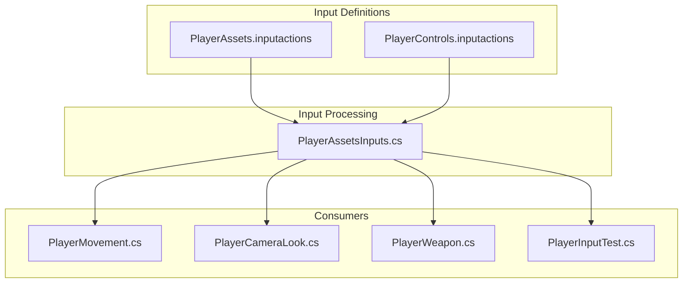
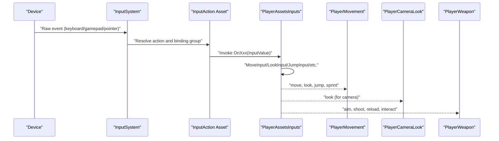
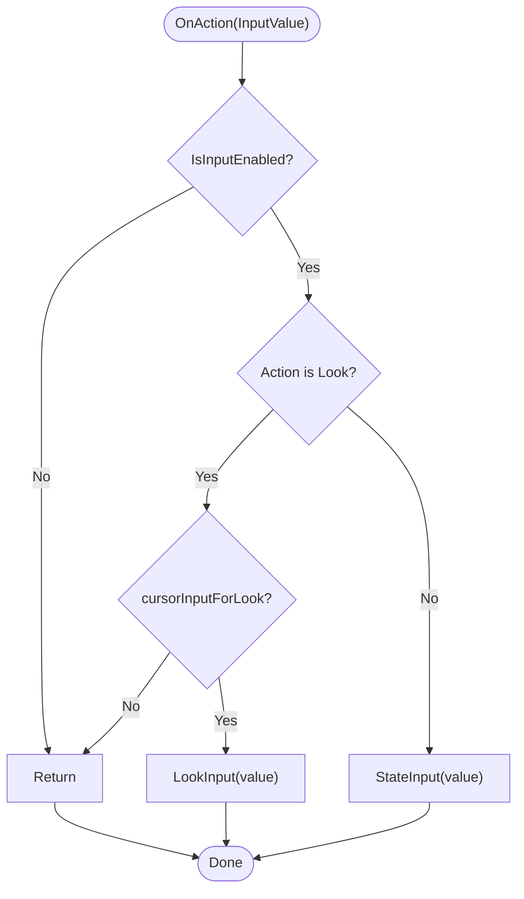
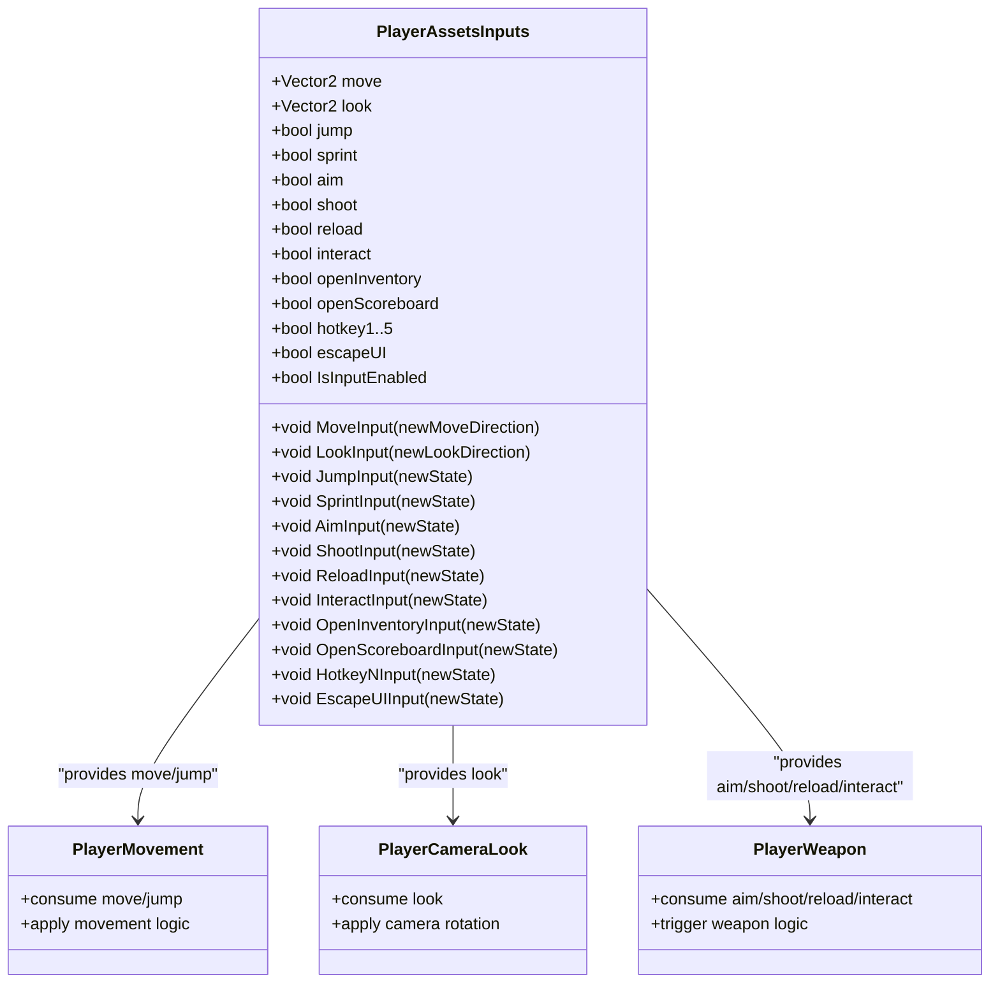
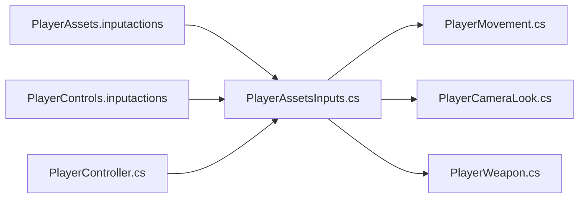

# Player Input & Controls

<cite>
**Referenced Files in This Document**
- [PlayerAssetsInputs.cs](file://Assets/FPS-Game/Scripts/Player/PlayerAssetsInputs.cs)
- [PlayerInputTest.cs](file://Assets/FPS-Game/Scripts/PlayerInputTest.cs)
- [PlayerAssets.inputactions](file://Assets/FPS-Game/InputActions/PlayerAssets.inputactions)
- [PlayerControls.inputactions](file://Assets/FPS-Game/InputActions/PlayerControls.inputactions)
- [PlayerMovement.cs](file://Assets/FPS-Game/Scripts/PlayerMovement.cs)
- [_PlayerMovement.cs](file://Assets/FPS-Game/Scripts/_PlayerMovement.cs)
- [PlayerCameraLook.cs](file://Assets/FPS-Game/Scripts/PlayerCameraLook.cs)
- [PlayerWeapon.cs](file://Assets/FPS-Game/Scripts/Player/PlayerWeapon.cs)
- [PlayerController.cs](file://Assets/FPS-Game/Scripts/Player/PlayerController.cs)
</cite>

## Table of Contents
1. [Introduction](#introduction)
2. [Project Structure](#project-structure)
3. [Core Components](#core-components)
4. [Architecture Overview](#architecture-overview)
5. [Detailed Component Analysis](#detailed-component-analysis)
6. [Dependency Analysis](#dependency-analysis)
7. [Performance Considerations](#performance-considerations)
8. [Troubleshooting Guide](#troubleshooting-guide)
9. [Conclusion](#conclusion)

## Introduction
This document explains the player input and control system built on Unity’s Input System. It focuses on how input actions are defined, bound, and processed; how control schemes detect devices and adapt behavior; and how input values drive movement, camera control, and weapon handling. It also covers input latency optimization, responsiveness tuning, accessibility features, platform-specific adaptations, and practical troubleshooting steps.

## Project Structure
The input system spans three main areas:
- Input definitions: Two InputAction assets define actions and bindings for player controls.
- Input processing: A dedicated script exposes normalized input values and manages cursor behavior.
- Consumption: Movement, camera, and weapon systems read from the input processor to execute gameplay logic.

**Diagram sources**
- [PlayerAssets.inputactions:1-534](file://Assets/FPS-Game/InputActions/PlayerAssets.inputactions#L1-L534)
- [PlayerControls.inputactions:1-232](file://Assets/FPS-Game/InputActions/PlayerControls.inputactions#L1-L232)
- [PlayerAssetsInputs.cs:1-240](file://Assets/FPS-Game/Scripts/Player/PlayerAssetsInputs.cs#L1-L240)
- [PlayerMovement.cs:1-120](file://Assets/FPS-Game/Scripts/PlayerMovement.cs#L1-L120)
- [PlayerCameraLook.cs:1-120](file://Assets/FPS-Game/Scripts/PlayerCameraLook.cs#L1-L120)
- [PlayerWeapon.cs:1-120](file://Assets/FPS-Game/Scripts/Player/PlayerWeapon.cs#L1-L120)
- [PlayerInputTest.cs:1-32](file://Assets/FPS-Game/Scripts/PlayerInputTest.cs#L1-L32)

**Section sources**
- [PlayerAssets.inputactions:1-534](file://Assets/FPS-Game/InputActions/PlayerAssets.inputactions#L1-L534)
- [PlayerControls.inputactions:1-232](file://Assets/FPS-Game/InputActions/PlayerControls.inputactions#L1-L232)
- [PlayerAssetsInputs.cs:1-240](file://Assets/FPS-Game/Scripts/Player/PlayerAssetsInputs.cs#L1-L240)

## Core Components
- Input Action assets define actions (Move, Look, Jump, Sprint, Aim, Shoot, RightSlash, Reload, Interact, OpenInventory, OpenScoreboard, Hotkeys 1–5, EscapeUI) and their bindings across device groups (KeyboardMouse, Gamepad).
- PlayerAssetsInputs processes raw InputSystem events into simple state variables consumed by gameplay systems. It supports enabling/disabling input, optional mouse look, and cursor locking behavior.
- Consumers read these inputs to update movement, camera rotation, and weapon actions.

Key capabilities:
- Action bindings for keyboard/mouse and gamepad.
- Control scheme detection via binding groups and device lists.
- Sensitivity and deadzone processors applied to sticks and pointer.
- Optional input enable/disable and cursor lock management.

**Section sources**
- [PlayerAssets.inputactions:1-534](file://Assets/FPS-Game/InputActions/PlayerAssets.inputactions#L1-L534)
- [PlayerAssetsInputs.cs:1-240](file://Assets/FPS-Game/Scripts/Player/PlayerAssetsInputs.cs#L1-L240)

## Architecture Overview
The Input System routes device events to InputAction maps, which call handler methods on a MonoBehaviour. PlayerAssetsInputs converts these into internal state fields. Movement, camera, and weapon systems poll these fields each frame or FixedUpdate to apply physics and animations.

**Diagram sources**
- [PlayerAssets.inputactions:1-534](file://Assets/FPS-Game/InputActions/PlayerAssets.inputactions#L1-L534)
- [PlayerAssetsInputs.cs:1-240](file://Assets/FPS-Game/Scripts/Player/PlayerAssetsInputs.cs#L1-L240)
- [PlayerMovement.cs:1-120](file://Assets/FPS-Game/Scripts/PlayerMovement.cs#L1-L120)
- [PlayerCameraLook.cs:1-120](file://Assets/FPS-Game/Scripts/PlayerCameraLook.cs#L1-L120)
- [PlayerWeapon.cs:1-120](file://Assets/FPS-Game/Scripts/Player/PlayerWeapon.cs#L1-L120)

## Detailed Component Analysis

### PlayerAssetsInputs.cs: Input Processor and Device Handling
Responsibilities:
- Receives InputSystem callbacks for each action (OnMove, OnLook, OnJump, OnSprint, OnAim, OnShoot, OnRightSlash, OnReload, OnInteract, OnOpenInventory, OnOpenScoreboard, OnHotkey1..5, OnEscapeUI).
- Applies IsInputEnabled and cursorInputForLook guards before updating state.
- Exposes MoveInput/LookInput/JumpInput/etc. to decouple consumers from InputSystem specifics.
- Manages cursor lock state on focus change.

Processing logic highlights:
- Early exit when input is disabled.
- Mouse look gated by cursorInputForLook flag.
- Look updates only when cursorInputForLook is true.
- Cursor lock toggled via SetCursorState based on application focus.

**Diagram sources**
- [PlayerAssetsInputs.cs:38-143](file://Assets/FPS-Game/Scripts/Player/PlayerAssetsInputs.cs#L38-L143)

**Section sources**
- [PlayerAssetsInputs.cs:1-240](file://Assets/FPS-Game/Scripts/Player/PlayerAssetsInputs.cs#L1-L240)

### InputActions: Actions, Bindings, and Control Schemes
Actions:
- Move (Value, Vector2), Look (Value, Vector2), Jump (PassThrough, Button), Sprint (PassThrough, Button), Aim (PassThrough, Button), Shoot (PassThrough, Button), RightSlash (PassThrough, Button), Reload (Button), Interact (Button), OpenInventory (Button), OpenScoreboard (Button), Hotkeys 1–5 (Buttons), EscapeUI (Button).

Bindings:
- Keyboard/Mouse:
  - Move via WASD keys and arrow keys composing a 2D vector.
  - Look via mouse delta with scaling and inversion processors.
  - Jump via Space; Sprint via Left Shift; Reload via R; Interact via E; OpenInventory via P; OpenScoreboard via Tab; EscapeUI via Escape; Hotkeys 1–5 via 1–5 keys; RightSlash via Right Mouse Button.
- Gamepad:
  - Move via left stick with a deadzone processor.
  - Look via right stick with inversion, deadzone, and scale processors.
  - Jump via South face button; Sprint via left trigger; Reload via default Reload action; Interact via default Interact action; OpenInventory/OpenScoreboard/EscapeUI via default actions; RightSlash via Right Mouse Button mapping included for parity.

Control schemes:
- KeyboardMouse: requires Keyboard and Mouse.
- Gamepad: optional XInput/DualShock variants.
- Xbox/PS4 schemes present but empty; binding groups are configured in the asset.

Sensitivity and deadzones:
- leftStick uses a deadzone processor.
- rightStick uses inversion, deadzone, and scale processors.
- Mouse delta uses invert/scale processors.

**Section sources**
- [PlayerAssets.inputactions:1-534](file://Assets/FPS-Game/InputActions/PlayerAssets.inputactions#L1-L534)

### InputActions: PlayerControls.inputactions
- Defines a smaller set of actions (Move, Look, Jump, Reload) suitable for a minimal gameplay map.
- Keyboard/Mouse bindings mirror the above with fewer actions.
- Useful for quick testing and simplified scenarios.

**Section sources**
- [PlayerControls.inputactions:1-232](file://Assets/FPS-Game/InputActions/PlayerControls.inputactions#L1-L232)

### Input Validation and Testing Utilities
- PlayerInputTest demonstrates capturing OnMove and OnLook values and logging pointer deltas. This pattern validates input reception and helps debug sensitivity and scaling.
- Use this script alongside InputActions assets to confirm that bindings resolve and values propagate.

Practical checks:
- Verify that OnMove produces a Vector2 and OnLook logs pointer deltas.
- Confirm that pressing mapped keys triggers the corresponding actions.

**Section sources**
- [PlayerInputTest.cs:1-32](file://Assets/FPS-Game/Scripts/PlayerInputTest.cs#L1-L32)

### Control Rebind Functionality
- The Input System supports runtime rebinding via PlayerInput actions. While the provided assets do not expose explicit rebind UI here, typical implementation involves:
  - Enumerating actions and bindings.
  - Detecting pending rebinds and prompting the user.
  - Applying new bindings to the current control scheme.
- For this project, ensure that the PlayerInput component is attached to the player and that the desired InputAction asset is assigned so that rebinding targets the correct map.

[No sources needed since this section describes general Input System rebinding patterns without analyzing specific files]

### Relationship Between Input and Gameplay Systems
- Movement:
  - PlayerAssetsInputs exposes move and jump states. Movement systems consume these to drive rigidbody forces or character controller inputs.
  - References show commented usage of GetPlayerAssetsInputs() and GetMoveInput() in movement and weapon scripts, indicating a centralized input accessor pattern.
- Camera:
  - Look input drives camera rotation. The camera script reads look values to adjust pitch/yaw.
- Weapon:
  - Aim, shoot, reload, and interact inputs are forwarded to weapon logic. Weapon scripts check these booleans to trigger animations and behaviors.

**Diagram sources**
- [PlayerAssetsInputs.cs:1-240](file://Assets/FPS-Game/Scripts/Player/PlayerAssetsInputs.cs#L1-L240)
- [PlayerMovement.cs:1-120](file://Assets/FPS-Game/Scripts/PlayerMovement.cs#L1-L120)
- [PlayerCameraLook.cs:1-120](file://Assets/FPS-Game/Scripts/PlayerCameraLook.cs#L1-L120)
- [PlayerWeapon.cs:1-120](file://Assets/FPS-Game/Scripts/Player/PlayerWeapon.cs#L1-L120)

**Section sources**
- [PlayerAssetsInputs.cs:1-240](file://Assets/FPS-Game/Scripts/Player/PlayerAssetsInputs.cs#L1-L240)
- [PlayerMovement.cs:1-120](file://Assets/FPS-Game/Scripts/PlayerMovement.cs#L1-L120)
- [PlayerCameraLook.cs:1-120](file://Assets/FPS-Game/Scripts/PlayerCameraLook.cs#L1-L120)
- [PlayerWeapon.cs:1-120](file://Assets/FPS-Game/Scripts/Player/PlayerWeapon.cs#L1-L120)

## Dependency Analysis
- Input definitions (InputAction assets) depend on Unity InputSystem and define expected control types and processors.
- PlayerAssetsInputs depends on Unity InputSystem callbacks and exposes simple state fields.
- Movement, camera, and weapon systems depend on PlayerAssetsInputs’ state fields.
- PlayerController holds a reference to the PlayerInput component, ensuring the InputSystem is active and mapped.

**Diagram sources**
- [PlayerAssets.inputactions:1-534](file://Assets/FPS-Game/InputActions/PlayerAssets.inputactions#L1-L534)
- [PlayerControls.inputactions:1-232](file://Assets/FPS-Game/InputActions/PlayerControls.inputactions#L1-L232)
- [PlayerAssetsInputs.cs:1-240](file://Assets/FPS-Game/Scripts/Player/PlayerAssetsInputs.cs#L1-L240)
- [PlayerMovement.cs:1-120](file://Assets/FPS-Game/Scripts/PlayerMovement.cs#L1-L120)
- [PlayerCameraLook.cs:1-120](file://Assets/FPS-Game/Scripts/PlayerCameraLook.cs#L1-L120)
- [PlayerWeapon.cs:1-120](file://Assets/FPS-Game/Scripts/Player/PlayerWeapon.cs#L1-L120)
- [PlayerController.cs:1-140](file://Assets/FPS-Game/Scripts/Player/PlayerController.cs#L1-L140)

**Section sources**
- [PlayerAssets.inputactions:1-534](file://Assets/FPS-Game/InputActions/PlayerAssets.inputactions#L1-L534)
- [PlayerControls.inputactions:1-232](file://Assets/FPS-Game/InputActions/PlayerControls.inputactions#L1-L232)
- [PlayerAssetsInputs.cs:1-240](file://Assets/FPS-Game/Scripts/Player/PlayerAssetsInputs.cs#L1-L240)
- [PlayerMovement.cs:1-120](file://Assets/FPS-Game/Scripts/PlayerMovement.cs#L1-L120)
- [PlayerCameraLook.cs:1-120](file://Assets/FPS-Game/Scripts/PlayerCameraLook.cs#L1-L120)
- [PlayerWeapon.cs:1-120](file://Assets/FPS-Game/Scripts/Player/PlayerWeapon.cs#L1-L120)
- [PlayerController.cs:1-140](file://Assets/FPS-Game/Scripts/Player/PlayerController.cs#L1-L140)

## Performance Considerations
- Minimize per-frame allocations by caching InputSystem references and avoiding repeated lookups.
- Keep InputAction maps lean; unnecessary actions increase polling overhead.
- Use processors judiciously:
  - Deadzones reduce noise on analog sticks.
  - Scale/invert processors should match intended sensitivity; avoid excessive scaling that increases jitter perception.
- Prefer FixedUpdate for physics-driven movement to ensure deterministic stepping.
- Disable input during menus or cutscenes to prevent accidental state changes.

[No sources needed since this section provides general guidance]

## Troubleshooting Guide
Common issues and resolutions:
- Input lag:
  - Verify processors (deadzones, scale, invert) are reasonable.
  - Ensure movement and camera updates occur in FixedUpdate or LateUpdate as appropriate.
  - Confirm IsInputEnabled is true when gameplay expects input.
- Control conflicts:
  - Check overlapping bindings in the InputAction asset. For example, ensure only one action binds to the same key/device.
  - Use distinct binding groups (KeyboardMouse vs Gamepad) to avoid ambiguity.
- Device recognition problems:
  - Confirm the active control scheme matches the connected device.
  - For Xbox/PS4 controllers, ensure the correct binding group is selected in the PlayerInput component.
- Cursor behavior:
  - If look does not respond, verify cursorInputForLook is enabled and the cursor is locked.
  - Application focus changes toggle cursor lock; ensure OnApplicationFocus invokes SetCursorState.

Validation steps:
- Use PlayerInputTest to log OnMove and OnLook values and confirm they reflect device input.
- Temporarily disable IsInputEnabled to test UI/menu input gating.

**Section sources**
- [PlayerAssetsInputs.cs:1-240](file://Assets/FPS-Game/Scripts/Player/PlayerAssetsInputs.cs#L1-L240)
- [PlayerInputTest.cs:1-32](file://Assets/FPS-Game/Scripts/PlayerInputTest.cs#L1-L32)

## Conclusion
The input system cleanly separates input definition, processing, and consumption. PlayerAssetsInputs centralizes InputSystem integration and exposes simple state fields consumed by movement, camera, and weapon systems. With carefully tuned processors, control schemes, and input gating, the system delivers responsive, accessible, and platform-appropriate controls. Use the provided assets and scripts as a foundation for testing, rebinding, and extending input behavior.