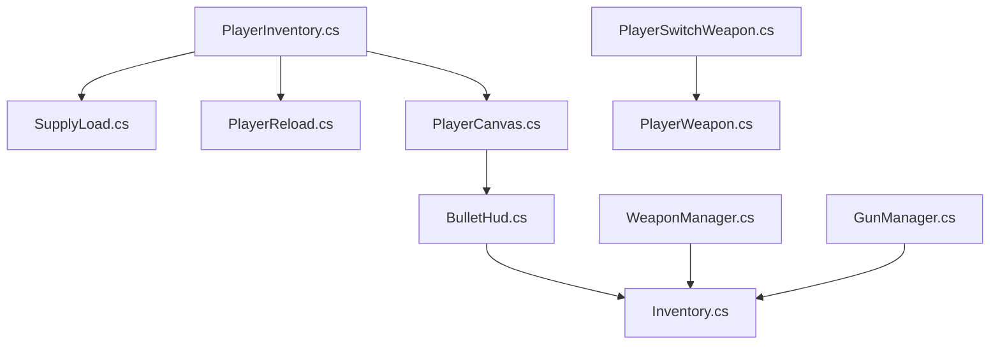
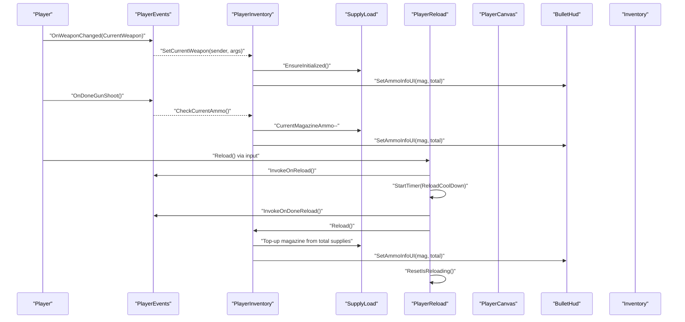
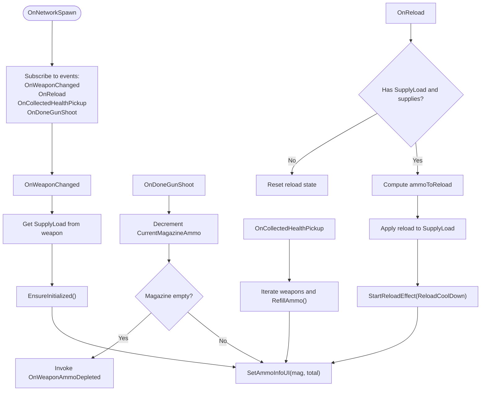
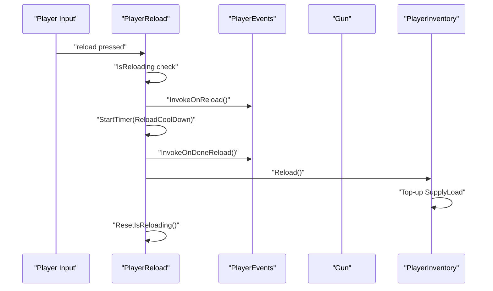
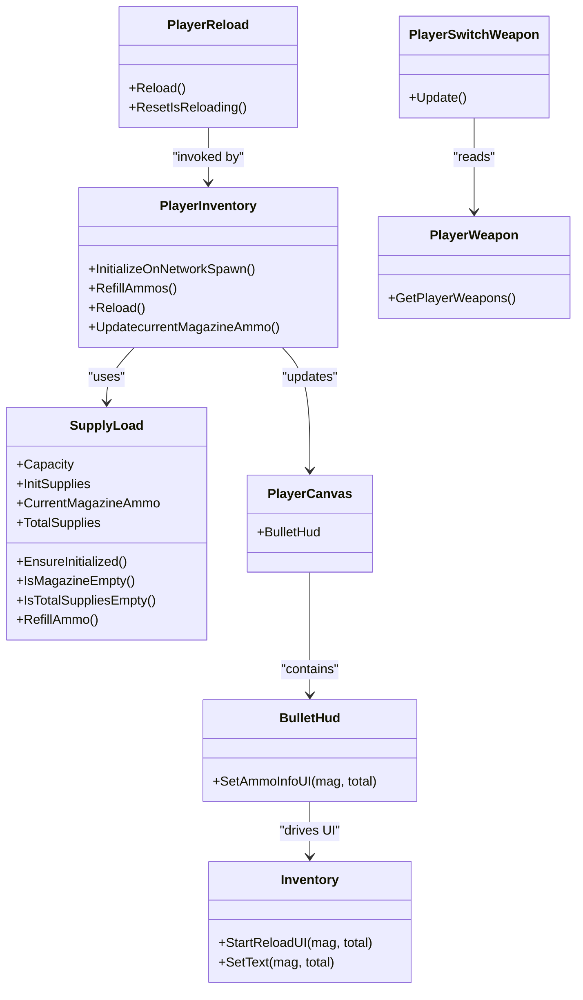

# Player Inventory & Equipment

<cite>
**Referenced Files in This Document**
- [PlayerInventory.cs](file://Assets/FPS-Game/Scripts/Player/PlayerInventory.cs)
- [SupplyLoad.cs](file://Assets/FPS-Game/Scripts/Player/SupplyLoad.cs)
- [PlayerReload.cs](file://Assets/FPS-Game/Scripts/Player/PlayerReload.cs)
- [PlayerCanvas.cs](file://Assets/FPS-Game/Scripts/Player/PlayerCanvas.cs)
- [BulletHud.cs](file://Assets/FPS-Game/Scripts/Player/PlayerCanvas/BulletHud.cs)
- [Inventory.cs](file://Assets/FPS-Game/Scripts/Inventory.cs)
- [PlayerSwitchWeapon.cs](file://Assets/FPS-Game/Scripts/PlayerSwitchWeapon.cs)
- [PlayerWeapon.cs](file://Assets/FPS-Game/Scripts/PlayerWeapon.cs)
- [WeaponManager.cs](file://Assets/FPS-Game/Scripts/WeaponManager.cs)
- [GunManager.cs](file://Assets/FPS-Game/Scripts/GunManager.cs)
- [PlayerEvents.cs](file://Assets/FPS-Game/Scripts/PlayerEvents.cs)
- [PlayerAssets.inputactions](file://Assets/FPS-Game/InputActions/PlayerAssets.inputactions)
</cite>

## Table of Contents
1. [Introduction](#introduction)
2. [Project Structure](#project-structure)
3. [Core Components](#core-components)
4. [Architecture Overview](#architecture-overview)
5. [Detailed Component Analysis](#detailed-component-analysis)
6. [Dependency Analysis](#dependency-analysis)
7. [Performance Considerations](#performance-considerations)
8. [Troubleshooting Guide](#troubleshooting-guide)
9. [Conclusion](#conclusion)
10. [Appendices](#appendices)

## Introduction
This document explains the player inventory and equipment system with a focus on item management and weapon handling. It covers how weapons are initialized, switched, reloaded, and how ammunition is tracked and synchronized to the UI. It also documents the event-driven architecture that connects weapon changes, reloading, and UI updates, along with practical examples from the codebase for inventory UI integration, weapon hotkey binding, and equipment loadout management. Finally, it provides guidance on persistence, item drops, balancing, and troubleshooting common issues such as duplication, equipment conflicts, and UI synchronization.

## Project Structure
The inventory and equipment system spans several scripts under the Player subsystem and supporting managers:
- PlayerInventory handles current weapon tracking, ammo consumption, refill, and UI sync.
- SupplyLoad defines the ammo model (capacity, initial supplies, magazine, total).
- PlayerReload manages reload triggers, timers, and audio feedback.
- PlayerCanvas aggregates HUD components including BulletHud.
- Inventory is the UI module for displaying ammo counts and reload animations.
- PlayerSwitchWeapon demonstrates hotkey-triggered weapon switching logic.
- PlayerWeapon exposes the player’s weapon collection.
- WeaponManager and GunManager are manager singletons for weapon-related assets.

**Diagram sources**
- [PlayerInventory.cs:1-138](file://Assets/FPS-Game/Scripts/Player/PlayerInventory.cs#L1-L138)
- [SupplyLoad.cs:1-41](file://Assets/FPS-Game/Scripts/Player/SupplyLoad.cs#L1-L41)
- [PlayerReload.cs:1-98](file://Assets/FPS-Game/Scripts/Player/PlayerReload.cs#L1-L98)
- [PlayerCanvas.cs:1-53](file://Assets/FPS-Game/Scripts/Player/PlayerCanvas.cs#L1-L53)
- [BulletHud.cs:1-13](file://Assets/FPS-Game/Scripts/Player/PlayerCanvas/BulletHud.cs#L1-L13)
- [Inventory.cs:1-79](file://Assets/FPS-Game/Scripts/Inventory.cs#L1-L79)
- [PlayerSwitchWeapon.cs:1-55](file://Assets/FPS-Game/Scripts/PlayerSwitchWeapon.cs#L1-L55)
- [PlayerWeapon.cs:1-25](file://Assets/FPS-Game/Scripts/PlayerWeapon.cs#L1-L25)
- [WeaponManager.cs:1-74](file://Assets/FPS-Game/Scripts/WeaponManager.cs#L1-L74)
- [GunManager.cs:1-15](file://Assets/FPS-Game/Scripts/GunManager.cs#L1-L15)

**Section sources**
- [PlayerInventory.cs:1-138](file://Assets/FPS-Game/Scripts/Player/PlayerInventory.cs#L1-L138)
- [SupplyLoad.cs:1-41](file://Assets/FPS-Game/Scripts/Player/SupplyLoad.cs#L1-L41)
- [PlayerReload.cs:1-98](file://Assets/FPS-Game/Scripts/Player/PlayerReload.cs#L1-L98)
- [PlayerCanvas.cs:1-53](file://Assets/FPS-Game/Scripts/Player/PlayerCanvas.cs#L1-L53)
- [BulletHud.cs:1-13](file://Assets/FPS-Game/Scripts/Player/PlayerCanvas/BulletHud.cs#L1-L13)
- [Inventory.cs:1-79](file://Assets/FPS-Game/Scripts/Inventory.cs#L1-L79)
- [PlayerSwitchWeapon.cs:1-55](file://Assets/FPS-Game/Scripts/PlayerSwitchWeapon.cs#L1-L55)
- [PlayerWeapon.cs:1-25](file://Assets/FPS-Game/Scripts/PlayerWeapon.cs#L1-L25)
- [WeaponManager.cs:1-74](file://Assets/FPS-Game/Scripts/WeaponManager.cs#L1-L74)
- [GunManager.cs:1-15](file://Assets/FPS-Game/Scripts/GunManager.cs#L1-L15)

## Core Components
- PlayerInventory: Tracks the current weapon, ensures SupplyLoad initialization, refills ammo, triggers reload logic, decrements magazine ammo, and synchronizes UI.
- SupplyLoad: Encapsulates weapon ammo state (Capacity, InitSupplies, CurrentMagazineAmmo, TotalSupplies) and provides refill and empty checks.
- PlayerReload: Listens for reload events, plays weapon-specific reload audio cues, starts a cooldown timer, and resets state.
- PlayerCanvas and BulletHud: Provide the HUD surface for ammo display and reload effects.
- Inventory: Drives the reload UI animation and text updates.
- PlayerSwitchWeapon: Demonstrates hotkey-triggered weapon switching logic (placeholder for active implementation).
- PlayerWeapon: Holds the player’s weapon collection.
- WeaponManager and GunManager: Singleton managers for weapon-related assets.

**Section sources**
- [PlayerInventory.cs:1-138](file://Assets/FPS-Game/Scripts/Player/PlayerInventory.cs#L1-L138)
- [SupplyLoad.cs:1-41](file://Assets/FPS-Game/Scripts/Player/SupplyLoad.cs#L1-L41)
- [PlayerReload.cs:1-98](file://Assets/FPS-Game/Scripts/Player/PlayerReload.cs#L1-L98)
- [PlayerCanvas.cs:1-53](file://Assets/FPS-Game/Scripts/Player/PlayerCanvas.cs#L1-L53)
- [BulletHud.cs:1-13](file://Assets/FPS-Game/Scripts/Player/PlayerCanvas/BulletHud.cs#L1-L13)
- [Inventory.cs:1-79](file://Assets/FPS-Game/Scripts/Inventory.cs#L1-L79)
- [PlayerSwitchWeapon.cs:1-55](file://Assets/FPS-Game/Scripts/PlayerSwitchWeapon.cs#L1-L55)
- [PlayerWeapon.cs:1-25](file://Assets/FPS-Game/Scripts/PlayerWeapon.cs#L1-L25)
- [WeaponManager.cs:1-74](file://Assets/FPS-Game/Scripts/WeaponManager.cs#L1-L74)
- [GunManager.cs:1-15](file://Assets/FPS-Game/Scripts/GunManager.cs#L1-L15)

## Architecture Overview
The system is event-driven and UI-centric:
- PlayerInventory listens to weapon change, reload, health pickup, and shooting completion events.
- SupplyLoad provides the ammo model and ensures initialization.
- PlayerReload coordinates reload timing and audio feedback.
- PlayerCanvas.BulletHud displays ammo counts and integrates with Inventory for reload visuals.
- PlayerSwitchWeapon reacts to hotkeys to switch weapons (placeholder logic present).

**Diagram sources**
- [PlayerInventory.cs:16-137](file://Assets/FPS-Game/Scripts/Player/PlayerInventory.cs#L16-L137)
- [PlayerReload.cs:34-98](file://Assets/FPS-Game/Scripts/Player/PlayerReload.cs#L34-L98)
- [PlayerCanvas.cs:1-53](file://Assets/FPS-Game/Scripts/Player/PlayerCanvas.cs#L1-L53)
- [BulletHud.cs:1-13](file://Assets/FPS-Game/Scripts/Player/PlayerCanvas/BulletHud.cs#L1-L13)
- [Inventory.cs:46-79](file://Assets/FPS-Game/Scripts/Inventory.cs#L46-L79)

## Detailed Component Analysis

### PlayerInventory.cs
Responsibilities:
- Subscribe to weapon change, reload, health pickup, and shooting completion events.
- Track the current weapon and its SupplyLoad.
- Refill all weapon ammo stacks when health pickups are collected.
- Trigger reload logic and synchronize UI.
- Decrement magazine ammo after shots and notify when empty.

Key behaviors:
- Ensures SupplyLoad initialization on weapon change.
- Refills ammo across all equipped weapons.
- Computes reload amounts and updates SupplyLoad totals/magazines.
- Invokes UI updates for ammo counts and reload effects.

**Diagram sources**
- [PlayerInventory.cs:16-137](file://Assets/FPS-Game/Scripts/Player/PlayerInventory.cs#L16-L137)
- [SupplyLoad.cs:21-41](file://Assets/FPS-Game/Scripts/Player/SupplyLoad.cs#L21-L41)
- [PlayerReload.cs:44-61](file://Assets/FPS-Game/Scripts/Player/PlayerReload.cs#L44-L61)
- [BulletHud.cs:9-12](file://Assets/FPS-Game/Scripts/Player/PlayerCanvas/BulletHud.cs#L9-L12)
- [Inventory.cs:46-79](file://Assets/FPS-Game/Scripts/Inventory.cs#L46-L79)

**Section sources**
- [PlayerInventory.cs:16-137](file://Assets/FPS-Game/Scripts/Player/PlayerInventory.cs#L16-L137)
- [SupplyLoad.cs:21-41](file://Assets/FPS-Game/Scripts/Player/SupplyLoad.cs#L21-L41)
- [PlayerReload.cs:44-61](file://Assets/FPS-Game/Scripts/Player/PlayerReload.cs#L44-L61)
- [BulletHud.cs:9-12](file://Assets/FPS-Game/Scripts/Player/PlayerCanvas/BulletHud.cs#L9-L12)
- [Inventory.cs:46-79](file://Assets/FPS-Game/Scripts/Inventory.cs#L46-L79)

### SupplyLoad.cs
Responsibilities:
- Define ammo capacity and initial supplies.
- Initialize magazine and total supplies on first use.
- Provide refill logic and empty-state checks.

Complexity:
- Initialization and refill are O(1).
- Empty checks are O(1).

**Section sources**
- [SupplyLoad.cs:1-41](file://Assets/FPS-Game/Scripts/Player/SupplyLoad.cs#L1-L41)

### PlayerReload.cs
Responsibilities:
- Listen for reload triggers and weapon changes.
- Manage reload state and cooldown timer.
- Play weapon-specific reload audio cues.
- Reset state on weapon change or completion.

**Diagram sources**
- [PlayerReload.cs:34-98](file://Assets/FPS-Game/Scripts/Player/PlayerReload.cs#L34-L98)
- [PlayerInventory.cs:45-93](file://Assets/FPS-Game/Scripts/Player/PlayerInventory.cs#L45-L93)

**Section sources**
- [PlayerReload.cs:1-98](file://Assets/FPS-Game/Scripts/Player/PlayerReload.cs#L1-L98)
- [PlayerInventory.cs:45-93](file://Assets/FPS-Game/Scripts/Player/PlayerInventory.cs#L45-L93)

### PlayerCanvas and BulletHud
Responsibilities:
- Aggregate HUD components (health bar, hit effects, weapon HUD, scope aim, crosshair).
- Provide AmmoInfo display and ReloadEffect integration.
- Inventory.cs drives reload UI animation and text updates.

**Section sources**
- [PlayerCanvas.cs:1-53](file://Assets/FPS-Game/Scripts/Player/PlayerCanvas.cs#L1-L53)
- [BulletHud.cs:1-13](file://Assets/FPS-Game/Scripts/Player/PlayerCanvas/BulletHud.cs#L1-L13)
- [Inventory.cs:1-79](file://Assets/FPS-Game/Scripts/Inventory.cs#L1-L79)

### PlayerSwitchWeapon.cs
Responsibilities:
- React to hotkeys to switch weapons.
- Placeholder logic exists for hotkeys 1–3; actual implementation is wired to the PlayerAssets input actions and PlayerWeapon collection.

**Section sources**
- [PlayerSwitchWeapon.cs:1-55](file://Assets/FPS-Game/Scripts/PlayerSwitchWeapon.cs#L1-L55)
- [PlayerWeapon.cs:1-25](file://Assets/FPS-Game/Scripts/PlayerWeapon.cs#L1-L25)
- [PlayerAssets.inputactions](file://Assets/FPS-Game/InputActions/PlayerAssets.inputactions)

### WeaponManager.cs and GunManager.cs
Responsibilities:
- Provide singleton access to weapon-related assets (e.g., grenades, explosive effects).
- Support asset management and pooling patterns (commented examples included).

**Section sources**
- [WeaponManager.cs:1-74](file://Assets/FPS-Game/Scripts/WeaponManager.cs#L1-L74)
- [GunManager.cs:1-15](file://Assets/FPS-Game/Scripts/GunManager.cs#L1-L15)

## Dependency Analysis
- PlayerInventory depends on SupplyLoad for ammo state and PlayerCanvas/BulletHud for UI updates.
- PlayerReload depends on Gun for reload duration and PlayerEvents for lifecycle hooks.
- Inventory depends on BulletHud for UI text and image updates.
- PlayerSwitchWeapon depends on PlayerAssets input actions and PlayerWeapon collection.

**Diagram sources**
- [PlayerInventory.cs:1-138](file://Assets/FPS-Game/Scripts/Player/PlayerInventory.cs#L1-L138)
- [SupplyLoad.cs:1-41](file://Assets/FPS-Game/Scripts/Player/SupplyLoad.cs#L1-L41)
- [PlayerReload.cs:1-98](file://Assets/FPS-Game/Scripts/Player/PlayerReload.cs#L1-L98)
- [PlayerCanvas.cs:1-53](file://Assets/FPS-Game/Scripts/Player/PlayerCanvas.cs#L1-L53)
- [BulletHud.cs:1-13](file://Assets/FPS-Game/Scripts/Player/PlayerCanvas/BulletHud.cs#L1-L13)
- [Inventory.cs:1-79](file://Assets/FPS-Game/Scripts/Inventory.cs#L1-L79)
- [PlayerSwitchWeapon.cs:1-55](file://Assets/FPS-Game/Scripts/PlayerSwitchWeapon.cs#L1-L55)
- [PlayerWeapon.cs:1-25](file://Assets/FPS-Game/Scripts/PlayerWeapon.cs#L1-L25)

**Section sources**
- [PlayerInventory.cs:1-138](file://Assets/FPS-Game/Scripts/Player/PlayerInventory.cs#L1-L138)
- [SupplyLoad.cs:1-41](file://Assets/FPS-Game/Scripts/Player/SupplyLoad.cs#L1-L41)
- [PlayerReload.cs:1-98](file://Assets/FPS-Game/Scripts/Player/PlayerReload.cs#L1-L98)
- [PlayerCanvas.cs:1-53](file://Assets/FPS-Game/Scripts/Player/PlayerCanvas.cs#L1-L53)
- [BulletHud.cs:1-13](file://Assets/FPS-Game/Scripts/Player/PlayerCanvas/BulletHud.cs#L1-L13)
- [Inventory.cs:1-79](file://Assets/FPS-Game/Scripts/Inventory.cs#L1-L79)
- [PlayerSwitchWeapon.cs:1-55](file://Assets/FPS-Game/Scripts/PlayerSwitchWeapon.cs#L1-L55)
- [PlayerWeapon.cs:1-25](file://Assets/FPS-Game/Scripts/PlayerWeapon.cs#L1-L25)

## Performance Considerations
- Event subscriptions are registered during network spawn and removed on disable to avoid leaks.
- UI updates are minimized by updating only when owner and not bot.
- Reload animations use a simple coroutine and fixed offsets for smoothness without heavy computations.
- SupplyLoad initialization occurs once per weapon to prevent repeated allocations.

[No sources needed since this section provides general guidance]

## Troubleshooting Guide
Common issues and resolutions:
- Item duplication: Verify that refill logic iterates only equipped weapons and does not double-count initial supplies. Ensure SupplyLoad refill computes deltas correctly.
- Equipment conflicts: Confirm that weapon switching resets reload state and updates SupplyLoad. Check that OnWeaponChanged sets the current weapon and initializes SupplyLoad.
- UI synchronization problems: Ensure SetAmmoInfoUI is invoked after every ammo change and reload completion. Validate that Inventory UI is enabled only when not bot and that reload animations reset properly.

**Section sources**
- [PlayerInventory.cs:32-43](file://Assets/FPS-Game/Scripts/Player/PlayerInventory.cs#L32-L43)
- [PlayerReload.cs:84-93](file://Assets/FPS-Game/Scripts/Player/PlayerReload.cs#L84-L93)
- [Inventory.cs:55-79](file://Assets/FPS-Game/Scripts/Inventory.cs#L55-L79)

## Conclusion
The inventory and equipment system centers on a clean separation of concerns: SupplyLoad encapsulates ammo state, PlayerInventory orchestrates weapon events and UI synchronization, PlayerReload manages reload timing and audio, and PlayerCanvas/BulletHud deliver the HUD. Hotkeys for weapon switching are present in the codebase and can be wired to the input actions and weapon collections. The system supports refill mechanics, reload animations, and event-driven updates, forming a robust foundation for weapon handling and player performance.

[No sources needed since this section summarizes without analyzing specific files]

## Appendices

### Inventory UI Integration Examples
- Setting ammo info UI: [SetAmmoInfoUI invocation:129-136](file://Assets/FPS-Game/Scripts/Player/PlayerInventory.cs#L129-L136)
- Starting reload UI animation: [StartReloadUI usage:46-53](file://Assets/FPS-Game/Scripts/Inventory.cs#L46-L53)
- Updating reload UI over time: [Update loop:55-79](file://Assets/FPS-Game/Scripts/Inventory.cs#L55-L79)

**Section sources**
- [PlayerInventory.cs:129-136](file://Assets/FPS-Game/Scripts/Player/PlayerInventory.cs#L129-L136)
- [Inventory.cs:46-79](file://Assets/FPS-Game/Scripts/Inventory.cs#L46-L79)

### Weapon Hotkey Binding Example
- Hotkey detection and placeholder logic: [Hotkey handling:17-54](file://Assets/FPS-Game/Scripts/PlayerSwitchWeapon.cs#L17-L54)
- Input actions definition: [PlayerAssets.inputactions](file://Assets/FPS-Game/InputActions/PlayerAssets.inputactions)

**Section sources**
- [PlayerSwitchWeapon.cs:17-54](file://Assets/FPS-Game/Scripts/PlayerSwitchWeapon.cs#L17-L54)
- [PlayerAssets.inputactions](file://Assets/FPS-Game/InputActions/PlayerAssets.inputactions)

### Equipment Loadout Management
- Initial weapon assignment and equip: [SetFirstWeapon and EquipWeapon:79-95](file://Assets/FPS-Game/Scripts/Player/WeaponHolder.cs#L79-L95)
- Hotkey-based weapon switching: [ChangeWeapon calls:97-143](file://Assets/FPS-Game/Scripts/Player/WeaponHolder.cs#L97-L143)

**Section sources**
- [Player/WeaponHolder.cs:79-143](file://Assets/FPS-Game/Scripts/Player/WeaponHolder.cs#L79-L143)

### Inventory Persistence, Item Drops, and Balancing
- Persistence: No explicit persistence logic was found in the referenced files. Consider serializing SupplyLoad state on player state changes or death/respawn events.
- Item drops: No dedicated drop mechanics were identified in the referenced files. Implement a drop handler that transfers SupplyLoad state to a world object on command.
- Balancing: Adjust Capacity and InitSupplies in SupplyLoad to balance gameplay difficulty and resource scarcity.

[No sources needed since this section provides general guidance]