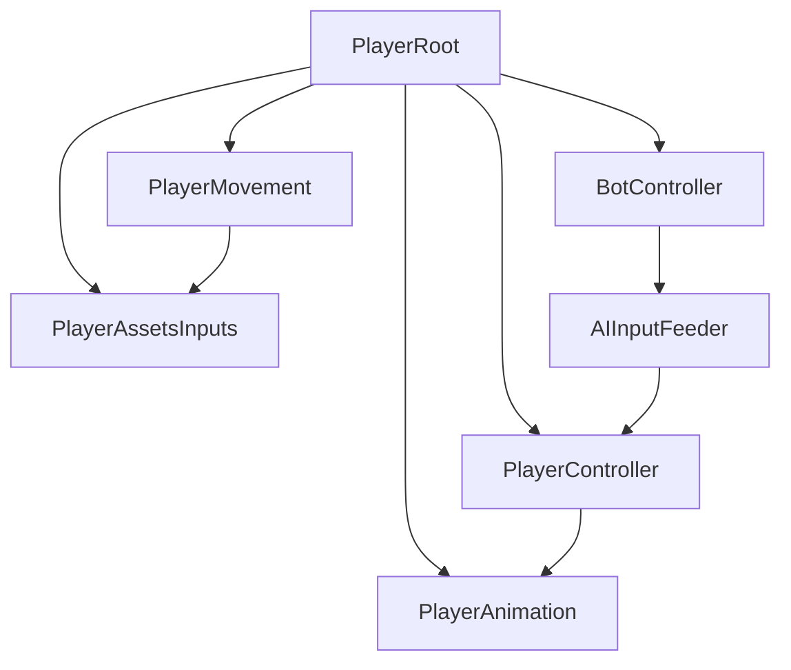
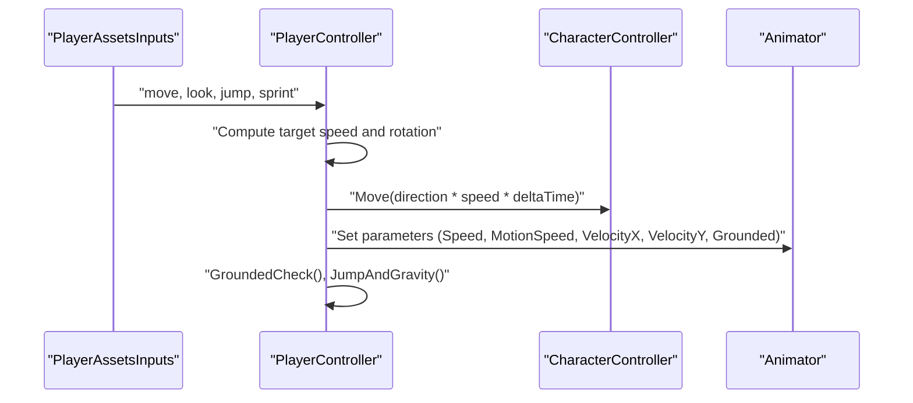
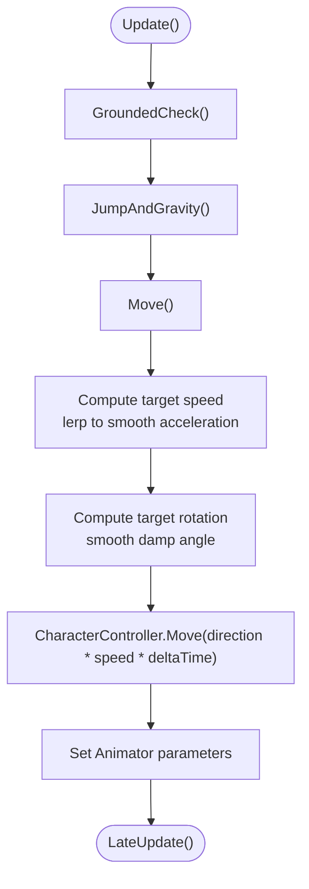
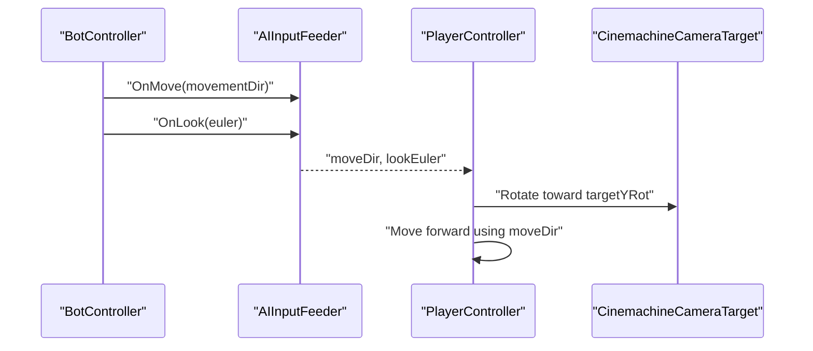
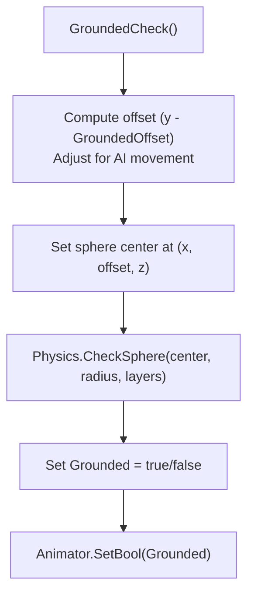
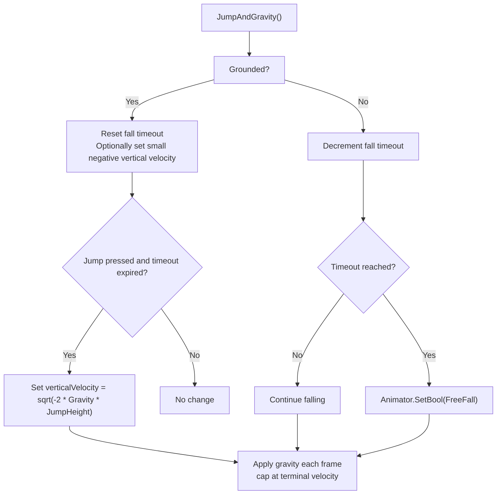
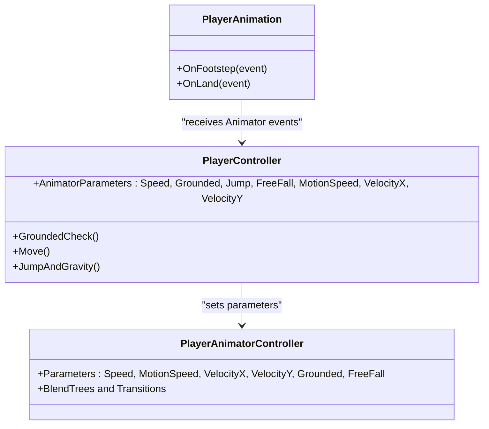
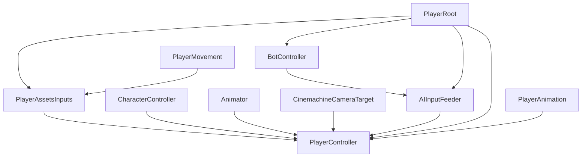

# Player Movement & Locomotion

<cite>
**Referenced Files in This Document**
- [PlayerController.cs](file://Assets/FPS-Game/Scripts/Player/PlayerController.cs)
- [PlayerAssetsInputs.cs](file://Assets/FPS-Game/Scripts/Player/PlayerAssetsInputs.cs)
- [PlayerRoot.cs](file://Assets/FPS-Game/Scripts/Player/PlayerRoot.cs)
- [PlayerAnimation.cs](file://Assets/FPS-Game/Scripts/Player/PlayerAnimation.cs)
- [PlayerMovement.cs](file://Assets/FPS-Game/Scripts/PlayerMovement.cs)
- [BotController.cs](file://Assets/FPS-Game/Scripts/Bot/BotController.cs)
- [AIInputFeeder.cs](file://Assets/FPS-Game/Scripts/Bot/AIInputFeeder.cs)
- [PlayerAnimator.controller](file://Assets/FPS-Game/Animations/StarterAssets/MainAni/PlayerAnimator.controller)
- [BotAnimator.controller](file://Assets/FPS-Game/Animations/BotAnimation/BotAnimator.controller)
</cite>

## Update Summary
**Changes Made**
- Updated rigidbody-based movement system documentation to reflect Unity Physics API evolution
- Added documentation for `linearDamping` and `linearVelocity` usage replacing deprecated `drag` and `velocity`
- Enhanced physics operations section with current Unity best practices
- Updated troubleshooting guide with new physics-related considerations

## Table of Contents
1. [Introduction](#introduction)
2. [Project Structure](#project-structure)
3. [Core Components](#core-components)
4. [Architecture Overview](#architecture-overview)
5. [Detailed Component Analysis](#detailed-component-analysis)
6. [Dependency Analysis](#dependency-analysis)
7. [Performance Considerations](#performance-considerations)
8. [Troubleshooting Guide](#troubleshooting-guide)
9. [Conclusion](#conclusion)

## Introduction
This document explains the player movement and locomotion system, focusing on the CharacterController-based movement used by human players and the dual-mode movement system that supports both human players and AI bots. It covers smooth movement interpolation, rotation dynamics, ground detection, jump and gravity handling, and synchronization with the Animator. It also documents movement parameters, input processing differences, collision detection, terminal velocity, and how movement states are synchronized in networked gameplay.

**Updated** The system now reflects Unity's Physics API evolution, utilizing modern properties like `linearDamping` and `linearVelocity` for improved performance and compatibility.

## Project Structure
The movement system spans several scripts under the Player and Bot namespaces:
- Human player movement: PlayerController handles movement, rotation, jumping, gravity, and Animator synchronization.
- Input pipeline: PlayerAssetsInputs captures input events and exposes normalized movement and look vectors.
- Root orchestration: PlayerRoot coordinates components and exposes shared references and events.
- Animation: PlayerAnimation bridges Animator events to audio feedback.
- AI movement: BotController orchestrates Behavior Designer tasks and feeds movement/look vectors to PlayerController via AIInputFeeder.
- Alternative movement model: PlayerMovement demonstrates a rigidbody-based movement system using Unity's modern Physics API with `linearDamping` and `linearVelocity`.

**Diagram sources**
- [PlayerRoot.cs:159-366](file://Assets/FPS-Game/Scripts/Player/PlayerRoot.cs#L159-L366)
- [PlayerAssetsInputs.cs:1-240](file://Assets/FPS-Game/Scripts/Player/PlayerAssetsInputs.cs#L1-L240)
- [PlayerController.cs:13-486](file://Assets/FPS-Game/Scripts/Player/PlayerController.cs#L13-L486)
- [PlayerAnimation.cs:1-50](file://Assets/FPS-Game/Scripts/Player/PlayerAnimation.cs#L1-L50)
- [BotController.cs:1-485](file://Assets/FPS-Game/Scripts/Bot/BotController.cs#L1-L485)
- [AIInputFeeder.cs:1-29](file://Assets/FPS-Game/Scripts/Bot/AIInputFeeder.cs#L1-L29)
- [PlayerMovement.cs:1-158](file://Assets/FPS-Game/Scripts/PlayerMovement.cs#L1-L158)

**Section sources**
- [PlayerRoot.cs:159-366](file://Assets/FPS-Game/Scripts/Player/PlayerRoot.cs#L159-L366)
- [PlayerAssetsInputs.cs:1-240](file://Assets/FPS-Game/Scripts/Player/PlayerAssetsInputs.cs#L1-L240)
- [PlayerController.cs:13-486](file://Assets/FPS-Game/Scripts/Player/PlayerController.cs#L13-L486)
- [PlayerAnimation.cs:1-50](file://Assets/FPS-Game/Scripts/Player/PlayerAnimation.cs#L1-L50)
- [BotController.cs:1-485](file://Assets/FPS-Game/Scripts/Bot/BotController.cs#L1-L485)
- [AIInputFeeder.cs:1-29](file://Assets/FPS-Game/Scripts/Bot/AIInputFeeder.cs#L1-L29)
- [PlayerMovement.cs:1-158](file://Assets/FPS-Game/Scripts/PlayerMovement.cs#L1-L158)

## Core Components
- PlayerController: Implements CharacterController-based movement, ground detection, jumping, gravity, rotation smoothing, and Animator parameter updates. It supports both human input and AI input via AIInputFeeder.
- PlayerAssetsInputs: Centralizes input capture and exposes normalized movement and look vectors, along with action flags (jump, sprint, aim, shoot).
- PlayerRoot: Provides component references, global events, and initialization ordering across the player hierarchy.
- PlayerAnimation: Bridges Animator events to audio playback and manages rig builder updates.
- BotController: Orchestrates Behavior Designer states and feeds movement/look vectors to PlayerController via AIInputFeeder.
- AIInputFeeder: Receives movement and look data from BotController and exposes them to PlayerController.
- PlayerMovement: Alternative rigidbody-based movement system using Unity's modern Physics API with `linearDamping` and `linearVelocity` for improved performance.

**Updated** The PlayerMovement system now utilizes Unity's current Physics API standards, replacing deprecated properties with modern equivalents.

**Section sources**
- [PlayerController.cs:13-486](file://Assets/FPS-Game/Scripts/Player/PlayerController.cs#L13-L486)
- [PlayerAssetsInputs.cs:1-240](file://Assets/FPS-Game/Scripts/Player/PlayerAssetsInputs.cs#L1-L240)
- [PlayerRoot.cs:159-366](file://Assets/FPS-Game/Scripts/Player/PlayerRoot.cs#L159-L366)
- [PlayerAnimation.cs:1-50](file://Assets/FPS-Game/Scripts/Player/PlayerAnimation.cs#L1-L50)
- [BotController.cs:1-485](file://Assets/FPS-Game/Scripts/Bot/BotController.cs#L1-L485)
- [AIInputFeeder.cs:1-29](file://Assets/FPS-Game/Scripts/Bot/AIInputFeeder.cs#L1-L29)
- [PlayerMovement.cs:1-158](file://Assets/FPS-Game/Scripts/PlayerMovement.cs#L1-L158)

## Architecture Overview
The movement system integrates input, physics, camera, and animation:
- Input path: PlayerAssetsInputs captures controller/mouse input and exposes normalized vectors and flags.
- Movement path: PlayerController reads input, computes target speed and rotation, applies smooth interpolation, moves the CharacterController, and updates Animator parameters.
- Ground detection: Sphere cast checks grounded state against configured layers and radius.
- Jump and gravity: Jump logic toggles grounded state and vertical velocity; gravity increases velocity until terminal velocity.
- AI path: BotController publishes movement and look vectors; AIInputFeeder relays them to PlayerController; PlayerController treats them similarly to human input.
- Animation: Animator parameters reflect grounded state, motion speed, and directional velocities; PlayerAnimation triggers footstep and landing sounds.

**Diagram sources**
- [PlayerAssetsInputs.cs:1-240](file://Assets/FPS-Game/Scripts/Player/PlayerAssetsInputs.cs#L1-L240)
- [PlayerController.cs:174-423](file://Assets/FPS-Game/Scripts/Player/PlayerController.cs#L174-L423)
- [PlayerAnimator.controller:171-213](file://Assets/FPS-Game/Animations/StarterAssets/MainAni/PlayerAnimator.controller#L171-L213)

**Section sources**
- [PlayerController.cs:174-423](file://Assets/FPS-Game/Scripts/Player/PlayerController.cs#L174-L423)
- [PlayerAssetsInputs.cs:1-240](file://Assets/FPS-Game/Scripts/Player/PlayerAssetsInputs.cs#L1-L240)
- [PlayerAnimator.controller:171-213](file://Assets/FPS-Game/Animations/StarterAssets/MainAni/PlayerAnimator.controller#L171-L213)

## Detailed Component Analysis

### Human Player Movement Mechanics
- Movement interpolation: Target speed is derived from sprint flag and MoveSpeed/SprintSpeed; smooth interpolation uses SpeedChangeRate and rounding to stabilize floating precision.
- Direction calculation: Movement direction is computed from normalized input and camera yaw; rotation smoothing uses SmoothDampAngle with RotationSmoothTime.
- Ground detection: A sphere cast at a position offset downward determines grounded state; radius and layer mask are configurable.
- Jump and gravity: Jump sets initial upward velocity; grounded resets vertical velocity near the ground; free fall state is signaled after a fall timeout; gravity accelerates until terminal velocity.
- Animator synchronization: Parameters include Speed, MotionSpeed, VelocityX, VelocityY, Grounded, Jump, and FreeFall.

**Diagram sources**
- [PlayerController.cs:174-292](file://Assets/FPS-Game/Scripts/Player/PlayerController.cs#L174-L292)
- [PlayerController.cs:361-423](file://Assets/FPS-Game/Scripts/Player/PlayerController.cs#L361-L423)

**Section sources**
- [PlayerController.cs:174-292](file://Assets/FPS-Game/Scripts/Player/PlayerController.cs#L174-L292)
- [PlayerController.cs:361-423](file://Assets/FPS-Game/Scripts/Player/PlayerController.cs#L361-L423)

### Dual-Mode Movement: Human vs AI
- Human mode: PlayerController reads PlayerAssetsInputs for movement and look; camera rotation is applied to Cinemachine target; model yaw aligns with camera.
- AI mode: BotController publishes movement and look vectors; AIInputFeeder relays them; PlayerController consumes them identically, rotating the camera target and moving forward at MoveSpeed when a direction is present.

**Diagram sources**
- [BotController.cs:122-171](file://Assets/FPS-Game/Scripts/Bot/BotController.cs#L122-L171)
- [AIInputFeeder.cs:1-29](file://Assets/FPS-Game/Scripts/Bot/AIInputFeeder.cs#L1-L29)
- [PlayerController.cs:294-348](file://Assets/FPS-Game/Scripts/Player/PlayerController.cs#L294-L348)

**Section sources**
- [BotController.cs:122-171](file://Assets/FPS-Game/Scripts/Bot/BotController.cs#L122-L171)
- [AIInputFeeder.cs:1-29](file://Assets/FPS-Game/Scripts/Bot/AIInputFeeder.cs#L1-L29)
- [PlayerController.cs:294-348](file://Assets/FPS-Game/Scripts/Player/PlayerController.cs#L294-L348)

### Movement Parameters and Tuning
- MoveSpeed: Base walking speed.
- SprintSpeed: Running speed multiplier effect.
- RotationSmoothTime: Smoothing duration for rotation interpolation.
- SpeedChangeRate: Rate controlling acceleration/deceleration towards target speed.
- JumpHeight, Gravity, JumpTimeout, FallTimeout: Jump dynamics and timing windows.
- GroundedOffset, GroundedRadius, GroundLayers: Ground detection geometry and layer filtering.
- TerminalVelocity: Maximum falling speed cap.

These parameters are declared and used in PlayerController and influence movement behavior, grounded detection, and jump/landing states.

**Section sources**
- [PlayerController.cs:15-55](file://Assets/FPS-Game/Scripts/Player/PlayerController.cs#L15-L55)

### Ground Detection and Collision Handling
- GroundedCheck performs a sphere cast at a position offset below the character, using GroundedRadius and GroundLayers. The offset is slightly adjusted for AI movement to avoid false positives.
- The grounded state is synchronized to the Animator's Grounded parameter.
- JumpAndGravity resets vertical velocity when grounded and applies gravity otherwise, enforcing terminal velocity.

**Diagram sources**
- [PlayerController.cs:174-189](file://Assets/FPS-Game/Scripts/Player/PlayerController.cs#L174-L189)

**Section sources**
- [PlayerController.cs:174-189](file://Assets/FPS-Game/Scripts/Player/PlayerController.cs#L174-L189)

### Jumping, Gravity, and Terminal Velocity
- On landing, vertical velocity is clamped to a small negative value to keep the character grounded.
- On jump initiation (grounded and within jump timeout), vertical velocity is set to the calculated upward impulse.
- While falling, a fall timeout disables jumping momentarily and toggles the FreeFall Animator state.
- Gravity continuously accelerates the character downward until terminal velocity is reached.

**Diagram sources**
- [PlayerController.cs:361-423](file://Assets/FPS-Game/Scripts/Player/PlayerController.cs#L361-L423)

**Section sources**
- [PlayerController.cs:361-423](file://Assets/FPS-Game/Scripts/Player/PlayerController.cs#L361-L423)

### Animator Parameters and Synchronization
- Parameters exposed by PlayerController include Speed, Grounded, Jump, FreeFall, MotionSpeed, VelocityX, and VelocityY.
- The PlayerAnimator controller blends animations based on these parameters:
  - Speed and MotionSpeed drive locomotion blend trees.
  - VelocityX and VelocityY encode strafe and forward/backward motion.
  - Grounded and FreeFall control transitions between states.
- PlayerAnimation forwards Animator events to audio playback for footsteps and landing.

**Diagram sources**
- [PlayerController.cs:163-172](file://Assets/FPS-Game/Scripts/Player/PlayerController.cs#L163-L172)
- [PlayerAnimator.controller:171-213](file://Assets/FPS-Game/Animations/StarterAssets/MainAni/PlayerAnimator.controller#L171-L213)
- [PlayerAnimation.cs:1-50](file://Assets/FPS-Game/Scripts/Player/PlayerAnimation.cs#L1-L50)

**Section sources**
- [PlayerController.cs:163-172](file://Assets/FPS-Game/Scripts/Player/PlayerController.cs#L163-L172)
- [PlayerAnimator.controller:171-213](file://Assets/FPS-Game/Animations/StarterAssets/MainAni/PlayerAnimator.controller#L171-L213)
- [PlayerAnimation.cs:1-50](file://Assets/FPS-Game/Scripts/Player/PlayerAnimation.cs#L1-L50)

### Alternative Movement Model (Rigidbody-Based) - Unity Physics API Evolution
**Updated** PlayerMovement demonstrates a rigidbody-based approach using Unity's modern Physics API:
- Uses a state machine (walking, sprinting, air) and applies forces to a rigidbody with optional air multiplier.
- Employs raycasting for ground detection and `linearDamping` to simulate friction when grounded, replacing the deprecated `drag` property.
- Includes a separate speed control method to cap horizontal velocity using `linearVelocity`, replacing the deprecated `velocity` property.
- Leverages `linearVelocity.magnitude` and `linearVelocity.y` for dynamic effects like bobbing and sway calculations.

The system now reflects Unity's Physics API evolution where `linearDamping` provides more accurate damping calculations and `linearVelocity` offers better performance than the legacy `velocity` property.

**Section sources**
- [PlayerMovement.cs:1-158](file://Assets/FPS-Game/Scripts/PlayerMovement.cs#L1-L158)

## Dependency Analysis
- PlayerController depends on:
  - PlayerAssetsInputs for movement and look vectors.
  - CharacterController for movement and collision.
  - Animator for state synchronization.
  - Cinemachine camera target for rotation.
  - AIInputFeeder for AI movement data.
- PlayerRoot aggregates and initializes these dependencies and exposes them to subsystems.
- BotController publishes movement/look data consumed by AIInputFeeder and relayed to PlayerController.
- PlayerAnimation listens to Animator events and triggers audio feedback.
- PlayerMovement depends on PlayerAssetsInputs and uses Unity's modern Physics API.

**Diagram sources**
- [PlayerController.cs:13-486](file://Assets/FPS-Game/Scripts/Player/PlayerController.cs#L13-L486)
- [PlayerRoot.cs:159-366](file://Assets/FPS-Game/Scripts/Player/PlayerRoot.cs#L159-L366)
- [BotController.cs:1-485](file://Assets/FPS-Game/Scripts/Bot/BotController.cs#L1-L485)
- [AIInputFeeder.cs:1-29](file://Assets/FPS-Game/Scripts/Bot/AIInputFeeder.cs#L1-L29)
- [PlayerAnimation.cs:1-50](file://Assets/FPS-Game/Scripts/Player/PlayerAnimation.cs#L1-L50)
- [PlayerMovement.cs:12-13](file://Assets/FPS-Game/Scripts/PlayerMovement.cs#L12-L13)

**Section sources**
- [PlayerController.cs:13-486](file://Assets/FPS-Game/Scripts/Player/PlayerController.cs#L13-L486)
- [PlayerRoot.cs:159-366](file://Assets/FPS-Game/Scripts/Player/PlayerRoot.cs#L159-L366)
- [BotController.cs:1-485](file://Assets/FPS-Game/Scripts/Bot/BotController.cs#L1-L485)
- [AIInputFeeder.cs:1-29](file://Assets/FPS-Game/Scripts/Bot/AIInputFeeder.cs#L1-L29)
- [PlayerAnimation.cs:1-50](file://Assets/FPS-Game/Scripts/Player/PlayerAnimation.cs#L1-L50)
- [PlayerMovement.cs:12-13](file://Assets/FPS-Game/Scripts/PlayerMovement.cs#L12-L13)

## Performance Considerations
- Prefer smooth damping with RotationSmoothTime to reduce jitter without over-smoothing.
- Use SpeedChangeRate to balance responsiveness and stability; higher rates increase CPU but improve feel.
- Limit ground check radius and layers to relevant geometry to minimize overlap checks.
- Avoid excessive Animator parameter updates; batch or throttle where appropriate.
- For AI, precompute rotations and directions to minimize per-frame branching in BotController.
- **Updated** When using rigidbody-based movement, leverage `linearDamping` and `linearVelocity` for better performance than deprecated `drag` and `velocity` properties.

## Troubleshooting Guide
Common issues and resolutions:
- Clipping through geometry
  - Verify GroundedRadius and GroundedOffset; ensure they intersect the ground plane without clipping into walls.
  - Confirm GroundLayers excludes unintended layers.
  - Check CharacterController step offset and skin settings.
- Rotation lag or snapping
  - Adjust RotationSmoothTime to a comfortable value; lower values reduce lag but may cause overshoot.
  - Ensure CinemachineCameraTarget rotation updates occur consistently in LateUpdate.
- Ground detection false positives/negatives
  - Increase GroundedRadius slightly if the character hops or detaches from ground.
  - Verify GroundedOffset places the sphere beneath the character's feet.
  - Confirm GroundLayers includes terrain and walkable surfaces.
- Terminal velocity feels too fast/slow
  - Adjust Gravity and/or TerminalVelocity to tune fall acceleration and cap.
- Animator mismatch (e.g., FreeFall not triggering)
  - Ensure FallTimeout is decremented and that the grounded state is reset upon contact.
  - Verify Animator controller conditions for FreeFall and Grounded transitions.
- **Updated** Physics API compatibility issues
  - Ensure rigidbody-based systems use `linearDamping` instead of `drag` for ground friction calculations.
  - Replace `velocity` with `linearVelocity` for physics operations to maintain compatibility with newer Unity versions.
  - Verify that speed control methods use `linearVelocity.magnitude` for accurate velocity magnitude calculations.

**Section sources**
- [PlayerController.cs:174-189](file://Assets/FPS-Game/Scripts/Player/PlayerController.cs#L174-L189)
- [PlayerController.cs:361-423](file://Assets/FPS-Game/Scripts/Player/PlayerController.cs#L361-L423)
- [PlayerAnimator.controller:240-264](file://Assets/FPS-Game/Animations/StarterAssets/MainAni/PlayerAnimator.controller#L240-L264)
- [PlayerMovement.cs:59-62](file://Assets/FPS-Game/Scripts/PlayerMovement.cs#L59-L62)
- [PlayerMovement.cs:137-144](file://Assets/FPS-Game/Scripts/PlayerMovement.cs#L137-L144)

## Conclusion
The movement system combines a robust CharacterController-based approach with a dual-mode input pipeline supporting both human and AI agents. It emphasizes smooth interpolation, precise ground detection, realistic jump/physics, and tight Animator synchronization. The system has been updated to reflect Unity's Physics API evolution, utilizing modern properties like `linearDamping` and `linearVelocity` for improved performance and future compatibility. Proper tuning of movement parameters and careful handling of ground checks and rotation smoothing yield responsive and reliable locomotion suitable for both single-player and networked environments.