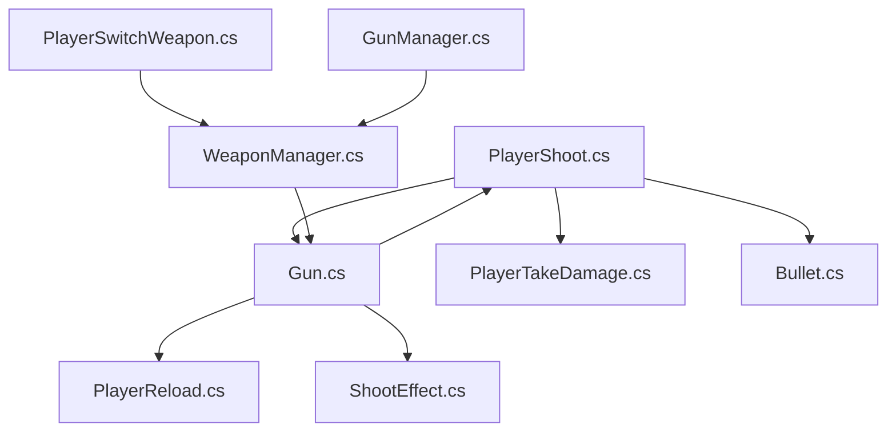
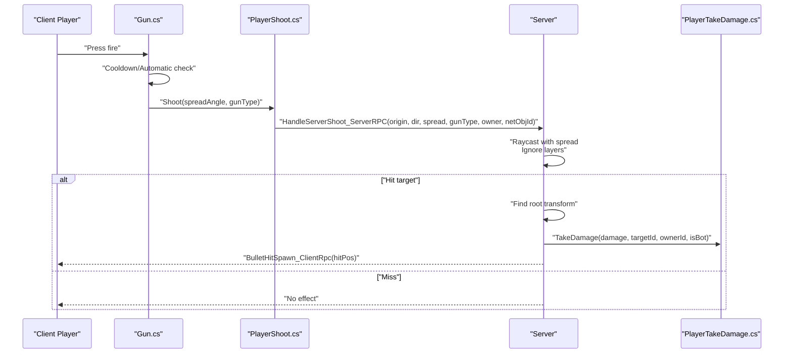
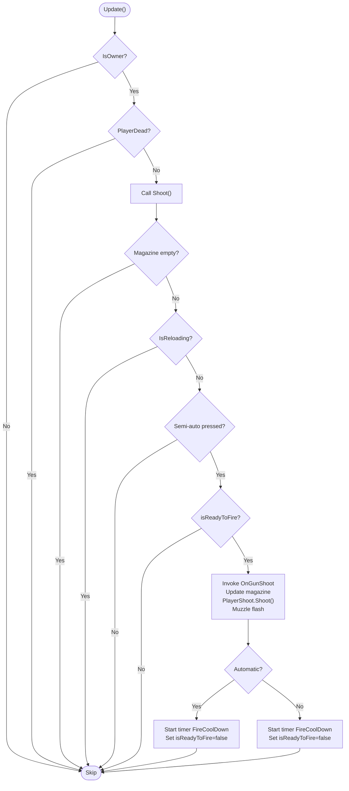
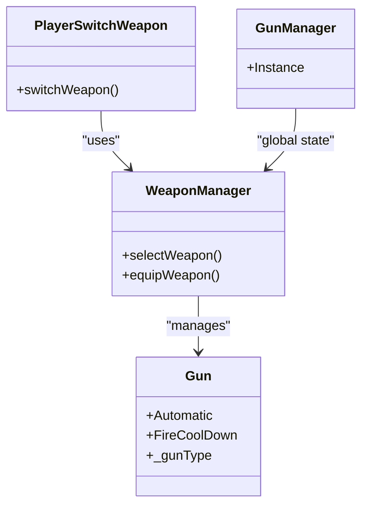
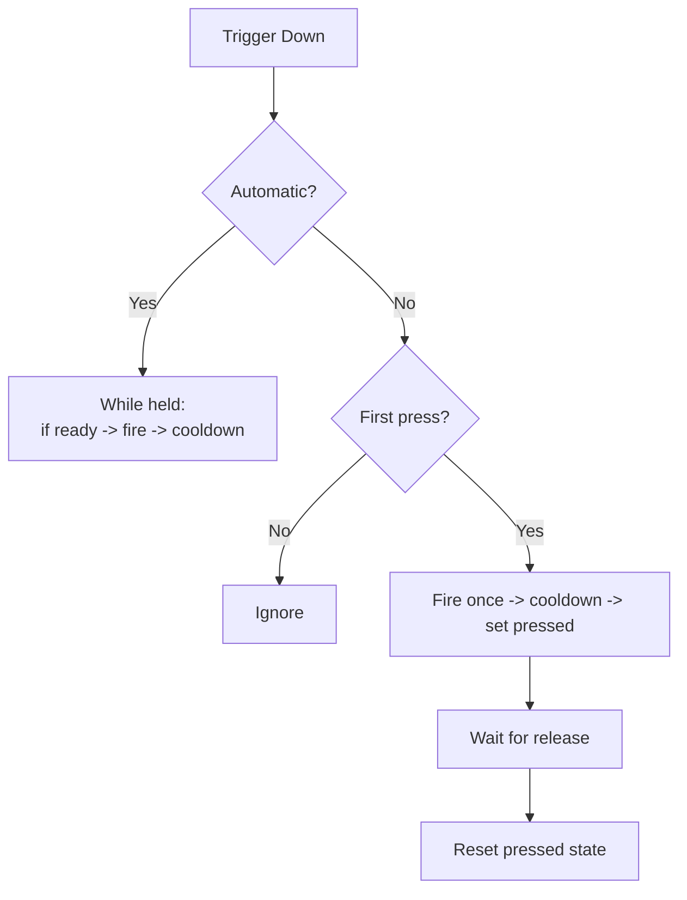
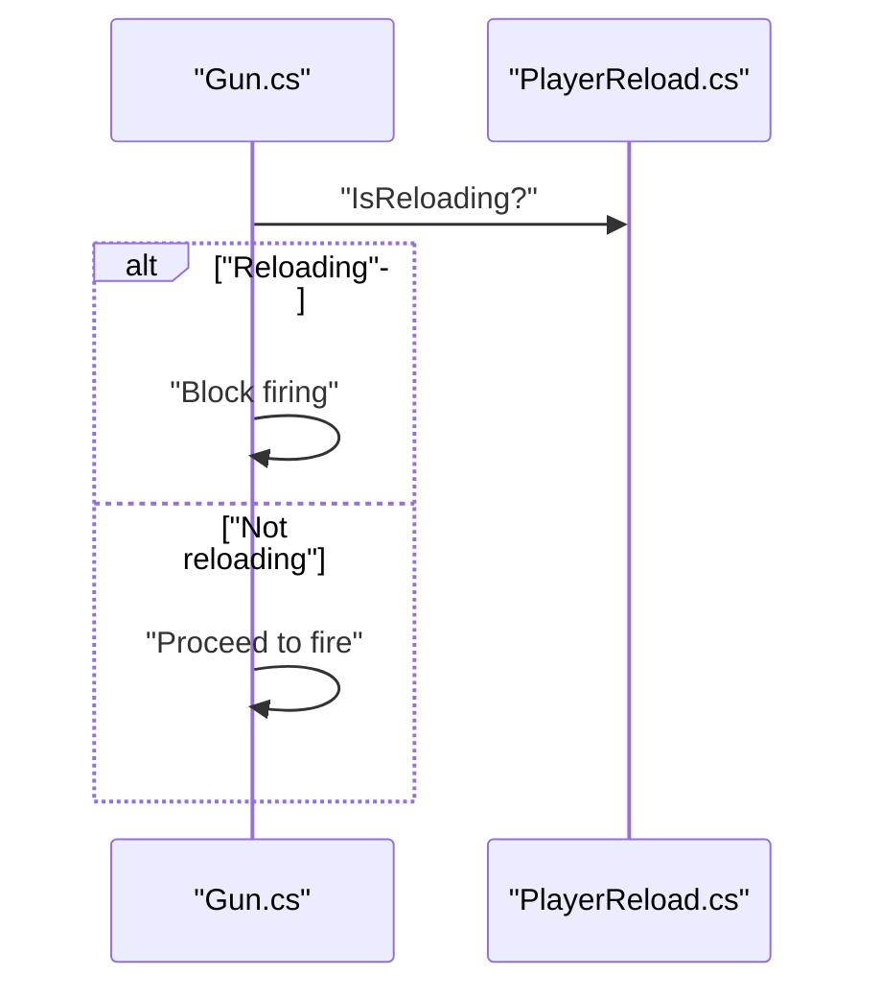
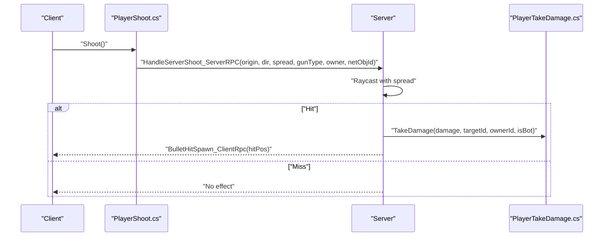
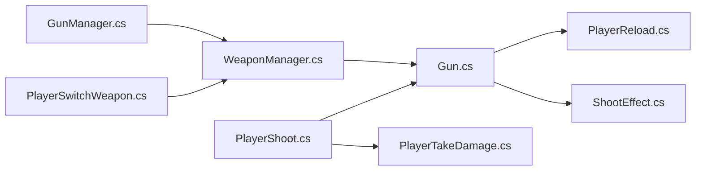

# Player Shooting System

<cite>
**Referenced Files in This Document**
- [PlayerShoot.cs](file://Assets/FPS-Game/Scripts/Player/PlayerShoot.cs)
- [Gun.cs](file://Assets/FPS-Game/Scripts/Player/Gun.cs)
- [__Gun.cs](file://Assets/FPS-Game/Scripts/__Gun.cs)
- [PlayerReload.cs](file://Assets/FPS-Game/Scripts/Player/PlayerReload.cs)
- [PlayerTakeDamage.cs](file://Assets/FPS-Game/Scripts/Player/PlayerTakeDamage.cs)
- [ShootEffect.cs](file://Assets/FPS-Game/Scripts/ShootEffect.cs)
- [Bullet.cs](file://Assets/FPS-Game/Scripts/Bullet.cs)
- [PlayerSwitchWeapon.cs](file://Assets/FPS-Game/Scripts/PlayerSwitchWeapon.cs)
- [WeaponManager.cs](file://Assets/FPS-Game/Scripts/WeaponManager.cs)
- [GunManager.cs](file://Assets/FPS-Game/Scripts/GunManager.cs)
</cite>

## Table of Contents
1. [Introduction](#introduction)
2. [Project Structure](#project-structure)
3. [Core Components](#core-components)
4. [Architecture Overview](#architecture-overview)
5. [Detailed Component Analysis](#detailed-component-analysis)
6. [Dependency Analysis](#dependency-analysis)
7. [Performance Considerations](#performance-considerations)
8. [Troubleshooting Guide](#troubleshooting-guide)
9. [Conclusion](#conclusion)

## Introduction
This document explains the player shooting system with a focus on weapon mechanics and projectile management. It covers trigger input handling, weapon state management, muzzle flash effects, weapon configuration, fire rate calculations, recoil/sway integration, bullet trajectory, weapon switching, automatic versus semi-automatic fire modes, and weapon reload integration. It also documents the relationship between shooting mechanics and the weapon manager for equipment handling, and addresses network synchronization of shooting events, hit detection, and damage calculation. Finally, it provides troubleshooting guidance for common shooting-related issues.

## Project Structure
The shooting system spans several scripts under the Player and shared systems:
- Player-side shooting orchestration and hit processing
- Gun weapon behavior and fire logic
- Reload and take-damage systems
- Effects and projectiles
- Equipment and weapon switching

**Diagram sources**
- [PlayerShoot.cs:1-162](file://Assets/FPS-Game/Scripts/Player/PlayerShoot.cs#L1-L162)
- [Gun.cs:1-451](file://Assets/FPS-Game/Scripts/Player/Gun.cs#L1-L451)
- [PlayerReload.cs](file://Assets/FPS-Game/Scripts/Player/PlayerReload.cs)
- [PlayerTakeDamage.cs](file://Assets/FPS-Game/Scripts/Player/PlayerTakeDamage.cs)
- [ShootEffect.cs](file://Assets/FPS-Game/Scripts/ShootEffect.cs)
- [Bullet.cs](file://Assets/FPS-Game/Scripts/Bullet.cs)
- [PlayerSwitchWeapon.cs](file://Assets/FPS-Game/Scripts/PlayerSwitchWeapon.cs)
- [WeaponManager.cs](file://Assets/FPS-Game/Scripts/WeaponManager.cs)
- [GunManager.cs](file://Assets/FPS-Game/Scripts/GunManager.cs)

**Section sources**
- [PlayerShoot.cs:1-162](file://Assets/FPS-Game/Scripts/Player/PlayerShoot.cs#L1-L162)
- [Gun.cs:1-451](file://Assets/FPS-Game/Scripts/Player/Gun.cs#L1-L451)

## Core Components
- PlayerShoot: Centralized client-to-server shooting logic, hit registration, and damage application. Handles spread, raycasting, hit area tagging, and client-side hit effects.
- Gun: Player weapon behavior controlling automatic/semi-automatic fire, cooldowns, audio, sway integration, and muzzle flash effects. Coordinates with reload and inventory systems.
- PlayerReload: Manages reloading state and integrates with Gun’s firing logic.
- PlayerTakeDamage: Applies damage to targets and handles death conditions.
- ShootEffect: Manages muzzle flash and related visual/audio feedback.
- Bullet: Projectile lifecycle and destruction logic.
- PlayerSwitchWeapon and WeaponManager: Equipment handling and weapon switching.
- GunManager: Singleton for global gun-related state.

**Section sources**
- [PlayerShoot.cs:20-162](file://Assets/FPS-Game/Scripts/Player/PlayerShoot.cs#L20-L162)
- [Gun.cs:6-451](file://Assets/FPS-Game/Scripts/Player/Gun.cs#L6-L451)
- [PlayerReload.cs](file://Assets/FPS-Game/Scripts/Player/PlayerReload.cs)
- [PlayerTakeDamage.cs](file://Assets/FPS-Game/Scripts/Player/PlayerTakeDamage.cs)
- [ShootEffect.cs](file://Assets/FPS-Game/Scripts/ShootEffect.cs)
- [Bullet.cs](file://Assets/FPS-Game/Scripts/Bullet.cs)
- [PlayerSwitchWeapon.cs](file://Assets/FPS-Game/Scripts/PlayerSwitchWeapon.cs)
- [WeaponManager.cs](file://Assets/FPS-Game/Scripts/WeaponManager.cs)
- [GunManager.cs:1-15](file://Assets/FPS-Game/Scripts/GunManager.cs#L1-L15)

## Architecture Overview
The shooting pipeline is owner-authoritative:
- Client triggers a shot locally and invokes a server RPC with the camera’s origin and forward direction, spread angle, weapon type, and owner identifiers.
- Server validates the shot, performs raycast hit detection, ignores configured layers, and applies damage to the hit target based on hit area and weapon type.
- Server broadcasts a client RPC to spawn a hit decal/particle effect at the impact point.
- Gun manages local fire rate, automatic/semi-auto toggling, audio, and muzzle flash.

**Diagram sources**
- [Gun.cs:106-179](file://Assets/FPS-Game/Scripts/Player/Gun.cs#L106-L179)
- [PlayerShoot.cs:68-146](file://Assets/FPS-Game/Scripts/Player/PlayerShoot.cs#L68-L146)

## Detailed Component Analysis

### PlayerShoot.cs: Trigger Input Handling, Weapon State, and Muzzle Flash Effects
- Initializes references to rifle/sniper/pistol configurations via the player’s weapon holder.
- Provides a local Shoot method that gathers the camera’s world position and forward vector and calls a server RPC with spread angle and gun type.
- Server RPC:
  - Generates spread by applying random Euler rotation to the shoot direction within the spread angle range.
  - Performs a raycast ignoring configured layers and spawns a hit decal/particle via client RPC on hit.
  - Determines hit area by tag checks and computes damage using weapon type and hit area.
  - Prevents self-hits by comparing shooter owner ID and network object ID against the target root.
  - Invokes TakeDamage on the target with appropriate target identifier and bot flag.
- Client RPC spawns a temporary hit effect and destroys it after a short delay.

Key behaviors:
- Spread application occurs on the server for fairness and to prevent client prediction exploits.
- Hit area determination relies on tags (Head/Torso/Leg) and weapon-specific damage values.
- Muzzle flash is handled by Gun.cs; PlayerShoot.cs focuses on hit effects.

**Section sources**
- [PlayerShoot.cs:20-33](file://Assets/FPS-Game/Scripts/Player/PlayerShoot.cs#L20-L33)
- [PlayerShoot.cs:68-77](file://Assets/FPS-Game/Scripts/Player/PlayerShoot.cs#L68-L77)
- [PlayerShoot.cs:80-146](file://Assets/FPS-Game/Scripts/Player/PlayerShoot.cs#L80-L146)
- [PlayerShoot.cs:148-162](file://Assets/FPS-Game/Scripts/Player/PlayerShoot.cs#L148-L162)

### Gun.cs: Weapon Configuration, Fire Rate, Recoil/Sway, and Muzzle Flash
- Holds weapon configuration: head/torso/leg damage values, gun type, FOV during aim, spread angle, and fire cooldown.
- Automatic vs semi-automatic:
  - Automatic mode: continuous fire within cooldown; sets a ready flag and starts a timer to reset readiness.
  - Semi-automatic mode: single fire per press with a press-state guard to avoid auto-firing on sustained input.
- Cooldown and timing:
  - Uses a timer system to enforce FireCoolDown and invoke events when firing completes.
- Aim pose transitions:
  - Subscribes to aim state changes and smoothly interpolates weapon position/rotation to idle or aim poses over a configurable duration.
  - Temporarily disables sway/bob during transitions and updates aim offsets afterward.
- Audio and muzzle flash:
  - Plays weapon audio via server RPC and propagates to clients.
  - Triggers muzzle flash effect through a dedicated component.
- Integration points:
  - Checks magazine emptiness and reload state before firing.
  - Updates current magazine ammo and invokes gun-shoot events.

**Diagram sources**
- [Gun.cs:407-421](file://Assets/FPS-Game/Scripts/Player/Gun.cs#L407-L421)
- [Gun.cs:106-179](file://Assets/FPS-Game/Scripts/Player/Gun.cs#L106-L179)

**Section sources**
- [Gun.cs:10-67](file://Assets/FPS-Game/Scripts/Player/Gun.cs#L10-L67)
- [Gun.cs:106-179](file://Assets/FPS-Game/Scripts/Player/Gun.cs#L106-L179)
- [Gun.cs:253-287](file://Assets/FPS-Game/Scripts/Player/Gun.cs#L253-L287)
- [Gun.cs:323-359](file://Assets/FPS-Game/Scripts/Player/Gun.cs#L323-L359)

### Weapon Switching and Equipment Handling
- PlayerSwitchWeapon coordinates weapon selection and visibility.
- WeaponManager maintains equipment state and interacts with Gun instances.
- GunManager is a singleton container for global gun-related state.

**Diagram sources**
- [PlayerSwitchWeapon.cs](file://Assets/FPS-Game/Scripts/PlayerSwitchWeapon.cs)
- [WeaponManager.cs](file://Assets/FPS-Game/Scripts/WeaponManager.cs)
- [GunManager.cs:1-15](file://Assets/FPS-Game/Scripts/GunManager.cs#L1-L15)
- [Gun.cs:24-49](file://Assets/FPS-Game/Scripts/Player/Gun.cs#L24-L49)

**Section sources**
- [PlayerSwitchWeapon.cs](file://Assets/FPS-Game/Scripts/PlayerSwitchWeapon.cs)
- [WeaponManager.cs](file://Assets/FPS-Game/Scripts/WeaponManager.cs)
- [GunManager.cs:1-15](file://Assets/FPS-Game/Scripts/GunManager.cs#L1-L15)

### Automatic vs Semi-Automatic Fire Modes
- Automatic:
  - Continuously fires while the trigger is held and cooldown allows.
  - Uses a ready-flag and a timer to reset readiness after each shot.
- Semi-automatic:
  - Fires on press and requires a release-then-press cycle to fire again.
  - Uses a press-state guard to prevent continuous fire on sustained input.

**Diagram sources**
- [Gun.cs:114-179](file://Assets/FPS-Game/Scripts/Player/Gun.cs#L114-L179)

**Section sources**
- [Gun.cs:114-179](file://Assets/FPS-Game/Scripts/Player/Gun.cs#L114-L179)

### Weapon Reload Integration
- Gun checks reload state and magazine emptiness before allowing shots.
- PlayerReload controls the reloading process; Gun integrates with it to block firing during reload.

**Diagram sources**
- [Gun.cs:108-109](file://Assets/FPS-Game/Scripts/Player/Gun.cs#L108-L109)
- [PlayerReload.cs](file://Assets/FPS-Game/Scripts/Player/PlayerReload.cs)

**Section sources**
- [Gun.cs:108-109](file://Assets/FPS-Game/Scripts/Player/Gun.cs#L108-L109)
- [PlayerReload.cs](file://Assets/FPS-Game/Scripts/Player/PlayerReload.cs)

### Network Synchronization, Hit Detection, and Damage Calculation
- Client-to-server:
  - Client gathers camera origin and forward vector and sends a server RPC with spread angle and gun type.
- Server-side:
  - Applies spread and raycasts ignoring configured layers.
  - Identifies hit area by tags and computes weapon-specific damage.
  - Prevents friendly fire/self-hits using owner and network object IDs.
  - Applies damage via TakeDamage on the target.
- Client-side hit effect:
  - Server RPC triggers a client RPC to instantiate a hit decal/particle at the impact location.

**Diagram sources**
- [PlayerShoot.cs:68-146](file://Assets/FPS-Game/Scripts/Player/PlayerShoot.cs#L68-L146)
- [PlayerTakeDamage.cs](file://Assets/FPS-Game/Scripts/Player/PlayerTakeDamage.cs)

**Section sources**
- [PlayerShoot.cs:68-146](file://Assets/FPS-Game/Scripts/Player/PlayerShoot.cs#L68-L146)

### Weapon-Specific Parameters: Spread, Accuracy, and Projectile Speed
- Spread:
  - Defined per weapon and applied as a random Euler rotation around the shoot direction on the server.
- Accuracy:
  - Controlled by spread angle; lower angles increase accuracy by reducing deviation.
- Projectile speed:
  - Not used in the current PlayerShoot/Gun pipeline; bullets are instantiated elsewhere and launched with rigidbody impulses.

Note: The legacy _Gun script demonstrates projectile speed and fire rate parameters but is superseded by the current Gun/PlayerShoot architecture.

**Section sources**
- [Gun.cs:18](file://Assets/FPS-Game/Scripts/Player/Gun.cs#L18)
- [PlayerShoot.cs:89-91](file://Assets/FPS-Game/Scripts/Player/PlayerShoot.cs#L89-L91)
- [__Gun.cs:36-38](file://Assets/FPS-Game/Scripts/__Gun.cs#L36-L38)

## Dependency Analysis
- PlayerShoot depends on Gun for spread angle and gun type, and on PlayerTakeDamage for applying damage.
- Gun depends on PlayerReload for reload state, PlayerShoot for invoking shooting events, and ShootEffect for muzzle flash.
- PlayerSwitchWeapon and WeaponManager coordinate weapon selection/equipment; GunManager provides a global state container.

**Diagram sources**
- [PlayerShoot.cs:20-33](file://Assets/FPS-Game/Scripts/Player/PlayerShoot.cs#L20-L33)
- [Gun.cs:69-73](file://Assets/FPS-Game/Scripts/Player/Gun.cs#L69-L73)
- [PlayerReload.cs](file://Assets/FPS-Game/Scripts/Player/PlayerReload.cs)
- [ShootEffect.cs](file://Assets/FPS-Game/Scripts/ShootEffect.cs)
- [PlayerSwitchWeapon.cs](file://Assets/FPS-Game/Scripts/PlayerSwitchWeapon.cs)
- [WeaponManager.cs](file://Assets/FPS-Game/Scripts/WeaponManager.cs)
- [GunManager.cs:1-15](file://Assets/FPS-Game/Scripts/GunManager.cs#L1-L15)

**Section sources**
- [PlayerShoot.cs:20-33](file://Assets/FPS-Game/Scripts/Player/PlayerShoot.cs#L20-L33)
- [Gun.cs:69-73](file://Assets/FPS-Game/Scripts/Player/Gun.cs#L69-L73)

## Performance Considerations
- Server-side raycasts: Keep spread angles reasonable to limit raycast cost; avoid unnecessary layers in the ignore mask.
- Cooldown timers: Prefer lightweight timers over frequent polling; ensure timers are reset properly to avoid accumulation.
- Audio propagation: Use server RPCs for weapon sounds to avoid redundant client-side playback.
- Effects: Destroy hit effects after a short delay to prevent memory leaks.
- Automatic fire: Limit burst sizes or implement burst cooldowns to reduce server load during sustained fire.

## Troubleshooting Guide
Common issues and resolutions:
- Input lag:
  - Verify that Gun runs only on the owner and that Update executes after input processing.
  - Ensure FireCoolDown and timer logic are not being reset prematurely.
- Weapon state synchronization:
  - Confirm that PlayerReload.IsReloading is respected before firing.
  - Ensure Automatic and press-state guards are functioning to prevent unintended auto-fire.
- Hit registration problems:
  - Validate that hit area tags (Head/Torso/Leg) match the target colliders.
  - Confirm that layersToIgnore excludes only intended layers and does not filter out targets.
  - Check that OwnerClientId and NetworkObjectId comparisons prevent self-hits.
- Muzzle flash and audio:
  - Ensure ShootEffect ActiveShootEffect is invoked on successful fire.
  - Verify PlayGunAudio_ServerRpc and StopGunAudio_ServerRpc propagate to clients.
- Projectile speed:
  - If using legacy bullet instantiation, confirm rigidbody impulse direction aligns with the muzzle forward vector.

**Section sources**
- [Gun.cs:108-109](file://Assets/FPS-Game/Scripts/Player/Gun.cs#L108-L109)
- [Gun.cs:114-179](file://Assets/FPS-Game/Scripts/Player/Gun.cs#L114-L179)
- [PlayerShoot.cs:95-146](file://Assets/FPS-Game/Scripts/Player/PlayerShoot.cs#L95-L146)
- [PlayerShoot.cs:148-162](file://Assets/FPS-Game/Scripts/Player/PlayerShoot.cs#L148-L162)

## Conclusion
The shooting system combines authoritative server-side hit detection with client-side feedback for a responsive and fair multiplayer experience. Gun.cs manages fire logic, cooldowns, and effects, while PlayerShoot.cs centralizes spread application, hit registration, and damage calculation. Integration with reload, take-damage, and equipment systems ensures cohesive gameplay. By tuning spread, fire rate, and cooldowns, developers can balance accuracy and lethality per weapon type. Proper synchronization and troubleshooting practices help maintain reliability across networked environments.