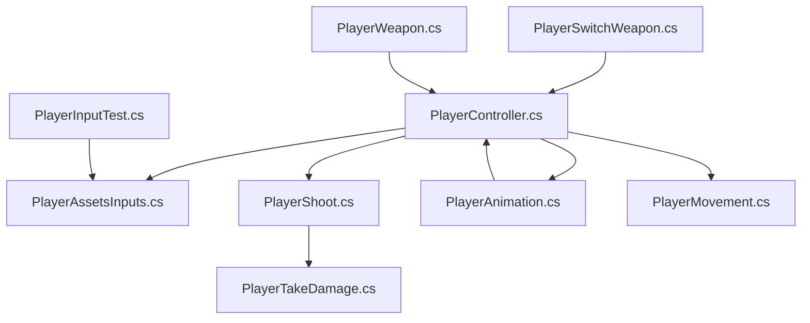
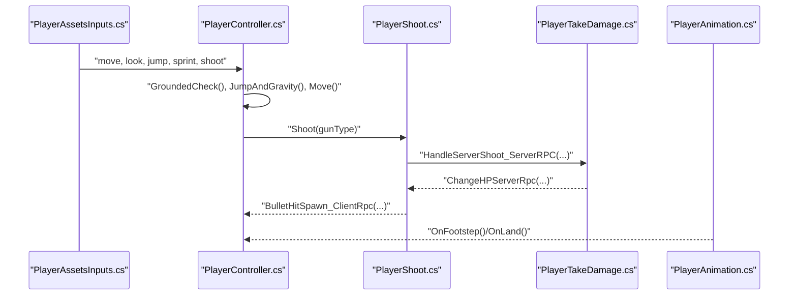
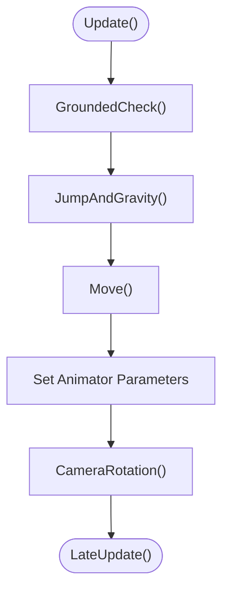
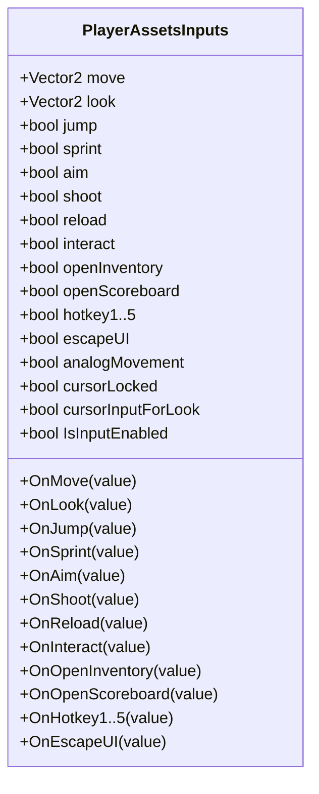
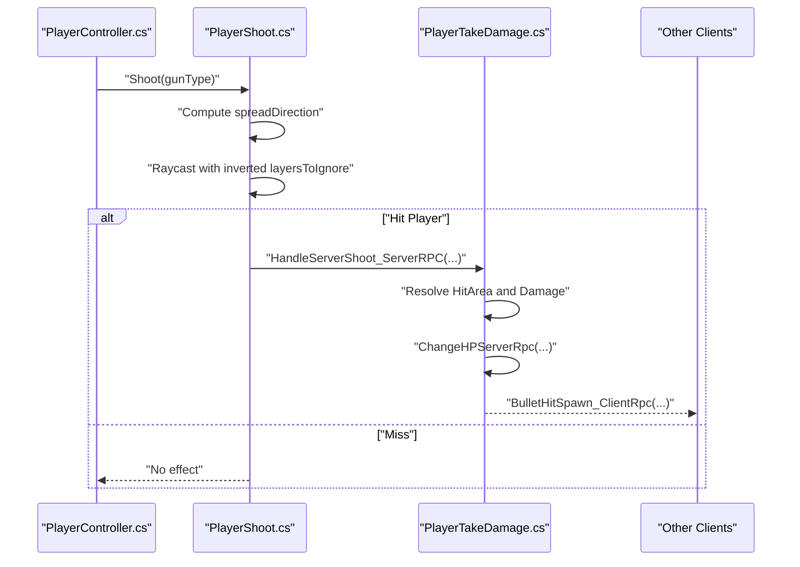
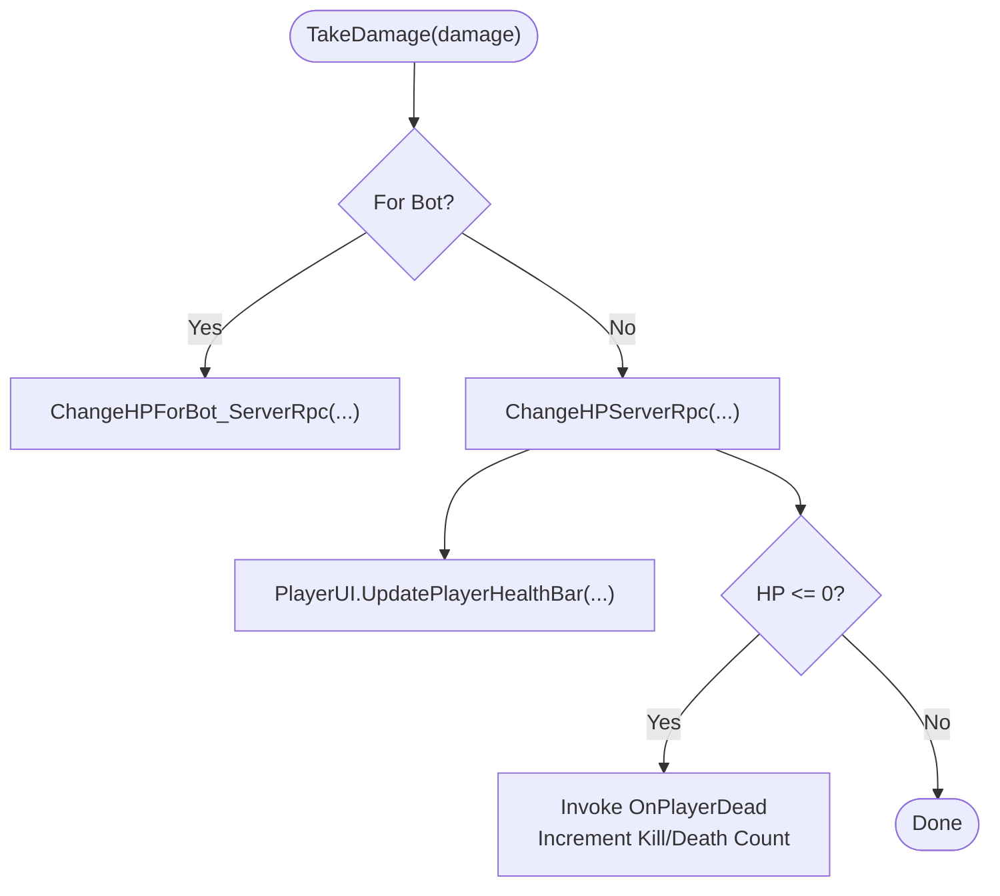
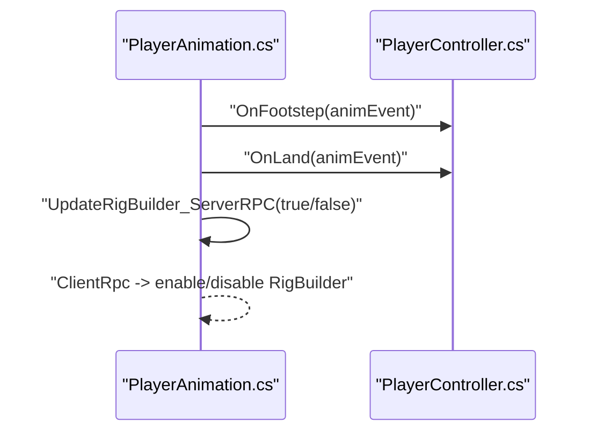
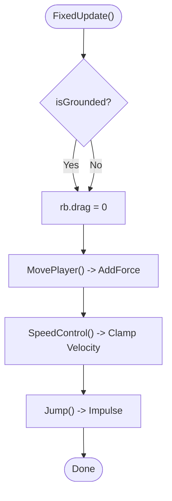
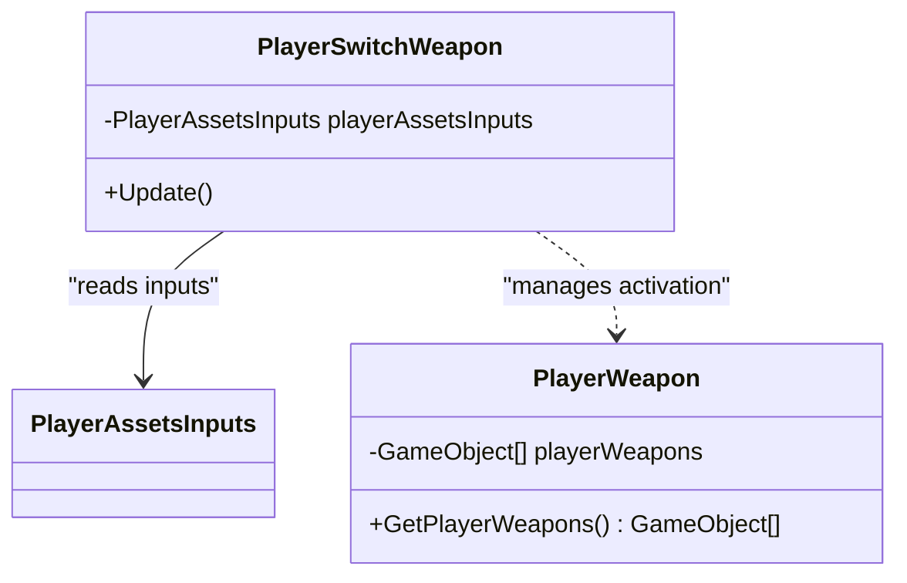
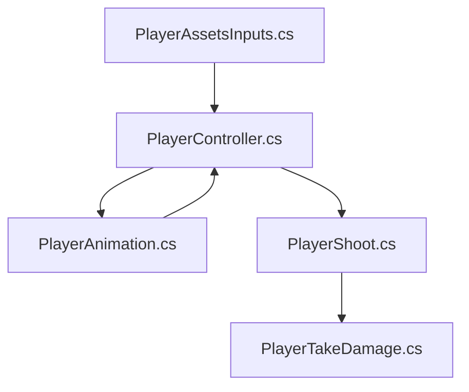

# Player System

<cite>
**Referenced Files in This Document**
- [PlayerController.cs](file://Assets/FPS-Game/Scripts/Player/PlayerController.cs)
- [PlayerAssetsInputs.cs](file://Assets/FPS-Game/Scripts/Player/PlayerAssetsInputs.cs)
- [PlayerShoot.cs](file://Assets/FPS-Game/Scripts/Player/PlayerShoot.cs)
- [PlayerTakeDamage.cs](file://Assets/FPS-Game/Scripts/Player/PlayerTakeDamage.cs)
- [PlayerAnimation.cs](file://Assets/FPS-Game/Scripts/Player/PlayerAnimation.cs)
- [PlayerMovement.cs](file://Assets/FPS-Game/Scripts/PlayerMovement.cs)
- [PlayerSwitchWeapon.cs](file://Assets/FPS-Game/Scripts/PlayerSwitchWeapon.cs)
- [PlayerWeapon.cs](file://Assets/FPS-Game/Scripts/PlayerWeapon.cs)
- [PlayerInputTest.cs](file://Assets/FPS-Game/Scripts/PlayerInputTest.cs)
</cite>

## Table of Contents
1. [Introduction](#introduction)
2. [Project Structure](#project-structure)
3. [Core Components](#core-components)
4. [Architecture Overview](#architecture-overview)
5. [Detailed Component Analysis](#detailed-component-analysis)
6. [Dependency Analysis](#dependency-analysis)
7. [Performance Considerations](#performance-considerations)
8. [Troubleshooting Guide](#troubleshooting-guide)
9. [Conclusion](#conclusion)
10. [Appendices](#appendices)

## Introduction
This document explains the comprehensive player controller implementation in the game, focusing on movement mechanics, locomotion, weapon handling, and damage calculation. It documents input processing, character physics, collision detection, and animation integration. It also covers configuration options for player attributes, weapon parameters, and movement settings, and outlines relationships with networking and UI systems. Practical examples are referenced from the actual codebase to illustrate movement states, weapon switching, shooting mechanics, and health management. Guidance is included for addressing common issues such as input lag, movement smoothing, and weapon recoil.

## Project Structure
The player system is implemented primarily under Assets/FPS-Game/Scripts/Player. Key modules include:
- PlayerController: Central locomotion, jumping, camera rotation, and animation integration for the player character.
- PlayerAssetsInputs: Input abstraction and event-driven input handling via the Input System.
- PlayerShoot: Shooting logic, hit detection, damage calculation, and server authoritative hit validation.
- PlayerTakeDamage: Health management, death events, and kill/death counters synchronized via Netcode for GameObjects.
- PlayerAnimation: Animation parameter updates and rig builder toggling for owner and non-owner instances.
- PlayerMovement: Alternative movement implementation using forces and drag for rigidbody-based movement.
- PlayerSwitchWeapon and PlayerWeapon: Weapon inventory and switching scaffolding.
- PlayerInputTest: A minimal input test script demonstrating Input System integration.

**Diagram sources**
- [PlayerController.cs:1-486](file://Assets/FPS-Game/Scripts/Player/PlayerController.cs#L1-L486)
- [PlayerAssetsInputs.cs:1-240](file://Assets/FPS-Game/Scripts/Player/PlayerAssetsInputs.cs#L1-L240)
- [PlayerShoot.cs:1-162](file://Assets/FPS-Game/Scripts/Player/PlayerShoot.cs#L1-L162)
- [PlayerTakeDamage.cs:1-124](file://Assets/FPS-Game/Scripts/Player/PlayerTakeDamage.cs#L1-L124)
- [PlayerAnimation.cs:1-50](file://Assets/FPS-Game/Scripts/Player/PlayerAnimation.cs#L1-L50)
- [PlayerMovement.cs:1-158](file://Assets/FPS-Game/Scripts/PlayerMovement.cs#L1-L158)
- [PlayerSwitchWeapon.cs:1-55](file://Assets/FPS-Game/Scripts/PlayerSwitchWeapon.cs#L1-L55)
- [PlayerWeapon.cs:1-25](file://Assets/FPS-Game/Scripts/PlayerWeapon.cs#L1-L25)
- [PlayerInputTest.cs:1-32](file://Assets/FPS-Game/Scripts/PlayerInputTest.cs#L1-L32)

**Section sources**
- [PlayerController.cs:1-486](file://Assets/FPS-Game/Scripts/Player/PlayerController.cs#L1-L486)
- [PlayerAssetsInputs.cs:1-240](file://Assets/FPS-Game/Scripts/Player/PlayerAssetsInputs.cs#L1-L240)
- [PlayerShoot.cs:1-162](file://Assets/FPS-Game/Scripts/Player/PlayerShoot.cs#L1-L162)
- [PlayerTakeDamage.cs:1-124](file://Assets/FPS-Game/Scripts/Player/PlayerTakeDamage.cs#L1-L124)
- [PlayerAnimation.cs:1-50](file://Assets/FPS-Game/Scripts/Player/PlayerAnimation.cs#L1-L50)
- [PlayerMovement.cs:1-158](file://Assets/FPS-Game/Scripts/PlayerMovement.cs#L1-L158)
- [PlayerSwitchWeapon.cs:1-55](file://Assets/FPS-Game/Scripts/PlayerSwitchWeapon.cs#L1-L55)
- [PlayerWeapon.cs:1-25](file://Assets/FPS-Game/Scripts/PlayerWeapon.cs#L1-L25)
- [PlayerInputTest.cs:1-32](file://Assets/FPS-Game/Scripts/PlayerInputTest.cs#L1-L32)

## Core Components
- PlayerAssetsInputs: Provides input events for movement, look, jump, sprint, aim, shoot, reload, inventory, scoreboard, interact, hotkeys, and escape UI. It supports enabling/disabling input and manages cursor lock state.
- PlayerController: Implements CharacterController-based movement, smooth rotation, grounded checks, gravity/jumping, camera rotation, and animation blending. It integrates with PlayerAssetsInputs and delegates shooting to PlayerShoot.
- PlayerShoot: Handles raycasting from the camera, applies weapon and hit area damage scaling, validates self-hit, and invokes server-side damage logic via ServerRpc.
- PlayerTakeDamage: Manages NetworkVariable HP, handles respawn/reset RPCs, updates UI health bar, and tracks kills/deaths via NetworkVariables on PlayerNetwork.
- PlayerAnimation: Updates animator parameters and toggles rig builder for owner/non-owner instances, relaying audio events to PlayerController.
- PlayerMovement: Alternative rigidbody-based movement with force application, drag control, and grounded raycast.
- PlayerSwitchWeapon and PlayerWeapon: Provide weapon inventory and switching hooks for hotkeys.
- PlayerInputTest: Demonstrates Input System usage with OnMove/OnLook callbacks.

**Section sources**
- [PlayerAssetsInputs.cs:1-240](file://Assets/FPS-Game/Scripts/Player/PlayerAssetsInputs.cs#L1-L240)
- [PlayerController.cs:1-486](file://Assets/FPS-Game/Scripts/Player/PlayerController.cs#L1-L486)
- [PlayerShoot.cs:1-162](file://Assets/FPS-Game/Scripts/Player/PlayerShoot.cs#L1-L162)
- [PlayerTakeDamage.cs:1-124](file://Assets/FPS-Game/Scripts/Player/PlayerTakeDamage.cs#L1-L124)
- [PlayerAnimation.cs:1-50](file://Assets/FPS-Game/Scripts/Player/PlayerAnimation.cs#L1-L50)
- [PlayerMovement.cs:1-158](file://Assets/FPS-Game/Scripts/PlayerMovement.cs#L1-L158)
- [PlayerSwitchWeapon.cs:1-55](file://Assets/FPS-Game/Scripts/PlayerSwitchWeapon.cs#L1-L55)
- [PlayerWeapon.cs:1-25](file://Assets/FPS-Game/Scripts/PlayerWeapon.cs#L1-L25)
- [PlayerInputTest.cs:1-32](file://Assets/FPS-Game/Scripts/PlayerInputTest.cs#L1-L32)

## Architecture Overview
The player system follows a modular, Netcode-for-GameObjects (NFGO) architecture:
- Ownership-driven logic: Movement, shooting, and damage are executed locally when IsOwner is true.
- Centralized input: PlayerAssetsInputs exposes input events consumed by PlayerController.
- Server-authoritative damage: PlayerShoot performs raycast and delegates damage via ServerRpc to PlayerTakeDamage.
- Animation and audio: PlayerAnimation updates animator parameters and triggers audio events handled by PlayerController.
- Optional rigidbody movement: PlayerMovement offers an alternative movement model using forces and drag.

**Diagram sources**
- [PlayerAssetsInputs.cs:1-240](file://Assets/FPS-Game/Scripts/Player/PlayerAssetsInputs.cs#L1-L240)
- [PlayerController.cs:1-486](file://Assets/FPS-Game/Scripts/Player/PlayerController.cs#L1-L486)
- [PlayerShoot.cs:1-162](file://Assets/FPS-Game/Scripts/Player/PlayerShoot.cs#L1-L162)
- [PlayerTakeDamage.cs:1-124](file://Assets/FPS-Game/Scripts/Player/PlayerTakeDamage.cs#L1-L124)
- [PlayerAnimation.cs:1-50](file://Assets/FPS-Game/Scripts/Player/PlayerAnimation.cs#L1-L50)

## Detailed Component Analysis

### PlayerController: Movement, Locomotion, and Animation
- Movement and rotation:
  - Uses CharacterController.Move for displacement.
  - Smooths rotation toward input direction using smooth damping.
  - Applies speed change rate and input magnitude for motion speed blending.
- Grounded detection:
  - Performs a sphere cast at a configurable offset and radius against a GroundLayers mask.
  - Updates animator grounded flag and resets vertical velocity when grounded.
- Jumping and gravity:
  - Implements jump height and gravity with terminal velocity.
  - Enforces jump timeout and fall timeout to prevent sticky jumps.
- Camera rotation:
  - Adjusts yaw/pitch of CinemachineCameraTarget with clamping and optional overrides.
  - Respects device type for delta-time multiplier.
- Animation integration:
  - Sets animator parameters for speed, motion speed, grounded, jump, free fall, and velocity blends.
  - Delegates footstep and landing audio to PlayerAnimation, which calls PlayerController’s audio handlers.
- Bot mode:
  - Supports AI-driven movement and rotation using external AI input feeder.

**Diagram sources**
- [PlayerController.cs:174-292](file://Assets/FPS-Game/Scripts/Player/PlayerController.cs#L174-L292)
- [PlayerController.cs:361-423](file://Assets/FPS-Game/Scripts/Player/PlayerController.cs#L361-L423)
- [PlayerController.cs:425-460](file://Assets/FPS-Game/Scripts/Player/PlayerController.cs#L425-L460)

**Section sources**
- [PlayerController.cs:1-486](file://Assets/FPS-Game/Scripts/Player/PlayerController.cs#L1-L486)

### PlayerAssetsInputs: Input Processing
- Exposes input fields for move, look, jump, sprint, aim, shoot, reload, interact, inventory, scoreboard, hotkeys, and escape UI.
- Provides OnMove, OnLook, OnJump, OnSprint, OnAim, OnShoot, OnReload, OnInteract, OnOpenInventory, OnOpenScoreboard, OnHotkey1..5, and OnEscapeUI handlers.
- Supports enabling/disabling input and managing cursor lock state.

**Diagram sources**
- [PlayerAssetsInputs.cs:1-240](file://Assets/FPS-Game/Scripts/Player/PlayerAssetsInputs.cs#L1-L240)

**Section sources**
- [PlayerAssetsInputs.cs:1-240](file://Assets/FPS-Game/Scripts/Player/PlayerAssetsInputs.cs#L1-L240)

### PlayerShoot: Shooting Mechanics and Damage Calculation
- Determines weapon-specific damage based on hit area (head, torso, leg) and gun type (rifle, sniper, pistol).
- Casts a ray from the camera with random spread within a given angle.
- Ignores a configurable layer mask to avoid hitting unintended targets.
- Prevents friendly fire by checking shooter identity and network object ID.
- Invokes client RPC to spawn hit effects and server RPC to apply damage.

**Diagram sources**
- [PlayerShoot.cs:68-146](file://Assets/FPS-Game/Scripts/Player/PlayerShoot.cs#L68-L146)
- [PlayerTakeDamage.cs:58-83](file://Assets/FPS-Game/Scripts/Player/PlayerTakeDamage.cs#L58-L83)

**Section sources**
- [PlayerShoot.cs:1-162](file://Assets/FPS-Game/Scripts/Player/PlayerShoot.cs#L1-L162)
- [PlayerTakeDamage.cs:1-124](file://Assets/FPS-Game/Scripts/Player/PlayerTakeDamage.cs#L1-L124)

### PlayerTakeDamage: Health Management and Networking
- Maintains NetworkVariable HP and subscribes to HP changes to update UI and trigger events.
- Resets HP on respawn via ServerRpc.
- Increments kill/death counters on server and logs debug info.
- Handles bot-specific HP changes and resets.

**Diagram sources**
- [PlayerTakeDamage.cs:46-83](file://Assets/FPS-Game/Scripts/Player/PlayerTakeDamage.cs#L46-L83)
- [PlayerTakeDamage.cs:106-123](file://Assets/FPS-Game/Scripts/Player/PlayerTakeDamage.cs#L106-L123)

**Section sources**
- [PlayerTakeDamage.cs:1-124](file://Assets/FPS-Game/Scripts/Player/PlayerTakeDamage.cs#L1-L124)

### PlayerAnimation: Animation Integration
- Initializes on network spawn and updates animator parameters for owner instances.
- Toggles rig builder on death/respawn via ServerRpc/ClientRpc.
- Relays animation events to PlayerController for audio playback.

**Diagram sources**
- [PlayerAnimation.cs:1-50](file://Assets/FPS-Game/Scripts/Player/PlayerAnimation.cs#L1-L50)
- [PlayerController.cs:469-484](file://Assets/FPS-Game/Scripts/Player/PlayerController.cs#L469-L484)

**Section sources**
- [PlayerAnimation.cs:1-50](file://Assets/FPS-Game/Scripts/Player/PlayerAnimation.cs#L1-L50)
- [PlayerController.cs:469-484](file://Assets/FPS-Game/Scripts/Player/PlayerController.cs#L469-L484)

### PlayerMovement: Alternative Movement Model
- Uses forces applied to a Rigidbody along the camera-forward/right axes.
- Adjusts drag based on grounded state and clamps horizontal speed.
- Includes a movement state enum (walking, sprinting, crouching, air) and jump mechanics.

**Diagram sources**
- [PlayerMovement.cs:65-158](file://Assets/FPS-Game/Scripts/PlayerMovement.cs#L65-L158)

**Section sources**
- [PlayerMovement.cs:1-158](file://Assets/FPS-Game/Scripts/PlayerMovement.cs#L1-L158)

### PlayerSwitchWeapon and PlayerWeapon: Weapon Handling
- PlayerSwitchWeapon listens to hotkey inputs and can be extended to activate weapons and update UI.
- PlayerWeapon stores a list of player weapons and exposes a getter for iteration.

**Diagram sources**
- [PlayerSwitchWeapon.cs:1-55](file://Assets/FPS-Game/Scripts/PlayerSwitchWeapon.cs#L1-L55)
- [PlayerWeapon.cs:1-25](file://Assets/FPS-Game/Scripts/PlayerWeapon.cs#L1-L25)

**Section sources**
- [PlayerSwitchWeapon.cs:1-55](file://Assets/FPS-Game/Scripts/PlayerSwitchWeapon.cs#L1-L55)
- [PlayerWeapon.cs:1-25](file://Assets/FPS-Game/Scripts/PlayerWeapon.cs#L1-L25)

### PlayerInputTest: Input System Example
- Demonstrates OnMove and OnLook callbacks with Input System, applying forces to a Rigidbody in FixedUpdate.

**Section sources**
- [PlayerInputTest.cs:1-32](file://Assets/FPS-Game/Scripts/PlayerInputTest.cs#L1-L32)

## Dependency Analysis
- PlayerController depends on PlayerAssetsInputs for input, CharacterController for movement, Animator for animations, and PlayerShoot for shooting.
- PlayerShoot depends on PlayerRoot.WeaponHolder for weapon stats and PlayerTakeDamage for applying damage.
- PlayerTakeDamage depends on NetworkManager for player lookup and PlayerNetwork for counters.
- PlayerAnimation depends on PlayerController for audio events and PlayerRoot for UI updates.

**Diagram sources**
- [PlayerAssetsInputs.cs:1-240](file://Assets/FPS-Game/Scripts/Player/PlayerAssetsInputs.cs#L1-L240)
- [PlayerController.cs:1-486](file://Assets/FPS-Game/Scripts/Player/PlayerController.cs#L1-L486)
- [PlayerShoot.cs:1-162](file://Assets/FPS-Game/Scripts/Player/PlayerShoot.cs#L1-L162)
- [PlayerTakeDamage.cs:1-124](file://Assets/FPS-Game/Scripts/Player/PlayerTakeDamage.cs#L1-L124)
- [PlayerAnimation.cs:1-50](file://Assets/FPS-Game/Scripts/Player/PlayerAnimation.cs#L1-L50)

**Section sources**
- [PlayerController.cs:1-486](file://Assets/FPS-Game/Scripts/Player/PlayerController.cs#L1-L486)
- [PlayerShoot.cs:1-162](file://Assets/FPS-Game/Scripts/Player/PlayerShoot.cs#L1-L162)
- [PlayerTakeDamage.cs:1-124](file://Assets/FPS-Game/Scripts/Player/PlayerTakeDamage.cs#L1-L124)
- [PlayerAnimation.cs:1-50](file://Assets/FPS-Game/Scripts/Player/PlayerAnimation.cs#L1-L50)
- [PlayerAssetsInputs.cs:1-240](file://Assets/FPS-Game/Scripts/Player/PlayerAssetsInputs.cs#L1-L240)

## Performance Considerations
- Movement smoothing:
  - Use RotationSmoothTime and SpeedChangeRate to balance responsiveness and stability.
  - Clamp speed using SpeedControl to prevent velocity spikes.
- Grounded detection:
  - Optimize GroundedRadius and GroundedOffset to reduce false positives.
- Shooting:
  - Limit raycasts to necessary layers via layersToIgnore to minimize Physics.Raycast cost.
  - Consider reducing spread angle or frequency for performance-sensitive builds.
- Animation:
  - Keep animator parameters minimal and avoid excessive layer weight transitions.
- Networking:
  - Minimize ServerRpc/ClientRpc calls by batching UI updates and limiting hit effect spawns.

[No sources needed since this section provides general guidance]

## Troubleshooting Guide
- Input lag:
  - Verify IsInputEnabled is true and cursorInputForLook is configured correctly in PlayerAssetsInputs.
  - Ensure camera rotation uses the correct device delta multiplier in PlayerController.
- Movement smoothing:
  - Adjust RotationSmoothTime and SpeedChangeRate in PlayerController to reduce jitter.
  - Confirm GroundedRadius and GroundedOffset are appropriate for the character capsule.
- Weapon recoil:
  - Implement spread mechanics in PlayerShoot and animate muzzle or camera shake via PlayerAnimation.
  - Consider adding RecoilIntensity and RecoilRecovery parameters to PlayerController.
- Friendly fire:
  - Ensure shooter identity checks compare OwnerClientId and NetworkObjectId to prevent self-damage.
- Health updates:
  - Confirm HP NetworkVariable subscriptions and UI updates occur only for the local owner in PlayerTakeDamage.

**Section sources**
- [PlayerAssetsInputs.cs:1-240](file://Assets/FPS-Game/Scripts/Player/PlayerAssetsInputs.cs#L1-L240)
- [PlayerController.cs:1-486](file://Assets/FPS-Game/Scripts/Player/PlayerController.cs#L1-L486)
- [PlayerShoot.cs:1-162](file://Assets/FPS-Game/Scripts/Player/PlayerShoot.cs#L1-L162)
- [PlayerTakeDamage.cs:1-124](file://Assets/FPS-Game/Scripts/Player/PlayerTakeDamage.cs#L1-L124)

## Conclusion
The player system combines robust input handling, authoritative networking, and integrated animation to deliver responsive first-person movement and combat. PlayerController orchestrates locomotion and camera behavior, PlayerAssetsInputs centralizes input, PlayerShoot enforces server-authoritative damage, and PlayerTakeDamage manages health and scoring. Extensions for weapon recoil, smoother movement, and UI feedback are straightforward given the modular design.

[No sources needed since this section summarizes without analyzing specific files]

## Appendices

### Configuration Options Reference
- Movement settings (PlayerController):
  - MoveSpeed, SprintSpeed, RotationSmoothTime, SpeedChangeRate, GroundedOffset, GroundedRadius, GroundLayers.
- Jumping and gravity (PlayerController):
  - JumpHeight, Gravity, JumpTimeout, FallTimeout, TerminalVelocity.
- Camera settings (PlayerController):
  - CinemachineCameraTarget, TopClamp, BottomClamp, CameraAngleOverride, LockCameraPosition.
- Audio settings (PlayerController):
  - LandingAudioClip, FootstepAudioClips[], FootstepAudioVolume.
- Input settings (PlayerAssetsInputs):
  - analogMovement, cursorLocked, cursorInputForLook, IsInputEnabled.

**Section sources**
- [PlayerController.cs:15-44](file://Assets/FPS-Game/Scripts/Player/PlayerController.cs#L15-L44)
- [PlayerAssetsInputs.cs:29-36](file://Assets/FPS-Game/Scripts/Player/PlayerAssetsInputs.cs#L29-L36)

### Example References
- Movement states and speed control:
  - [PlayerController.cs:191-211](file://Assets/FPS-Game/Scripts/Player/PlayerController.cs#L191-L211)
- Shooting mechanics and hit validation:
  - [PlayerShoot.cs:68-146](file://Assets/FPS-Game/Scripts/Player/PlayerShoot.cs#L68-L146)
- Damage calculation by weapon and hit area:
  - [PlayerShoot.cs:35-65](file://Assets/FPS-Game/Scripts/Player/PlayerShoot.cs#L35-L65)
- Health management and respawn:
  - [PlayerTakeDamage.cs:46-83](file://Assets/FPS-Game/Scripts/Player/PlayerTakeDamage.cs#L46-L83)
- Animation parameter updates:
  - [PlayerController.cs:285-286](file://Assets/FPS-Game/Scripts/Player/PlayerController.cs#L285-L286)
- RigidBody movement alternative:
  - [PlayerMovement.cs:124-145](file://Assets/FPS-Game/Scripts/PlayerMovement.cs#L124-L145)