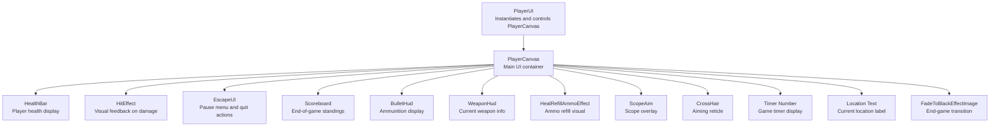
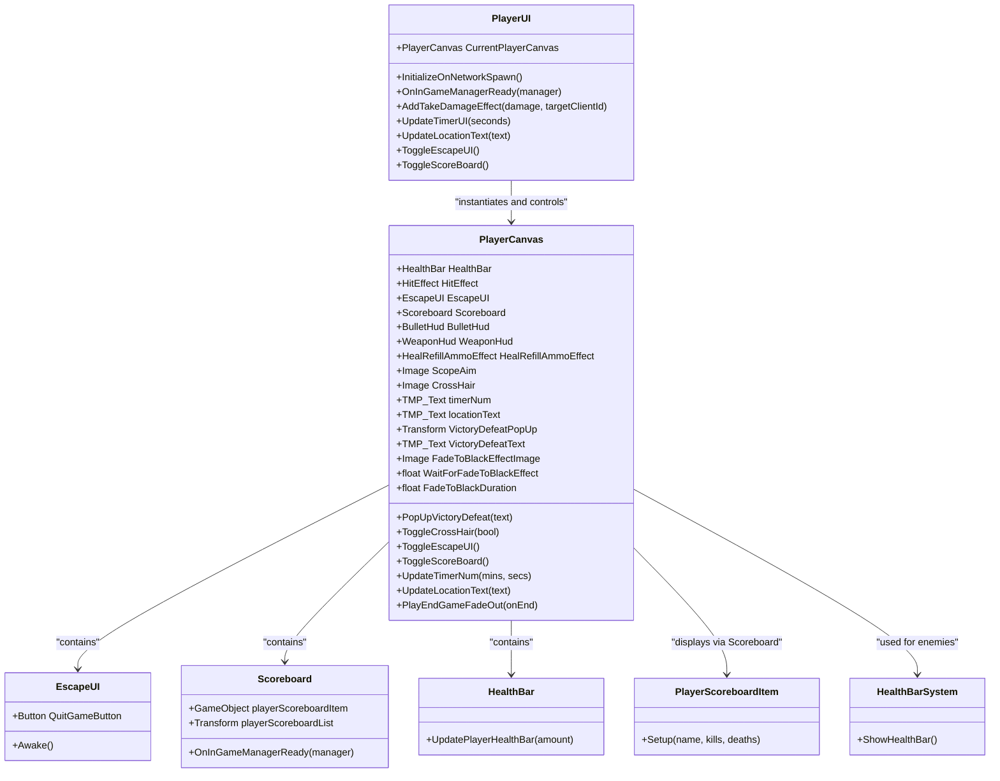
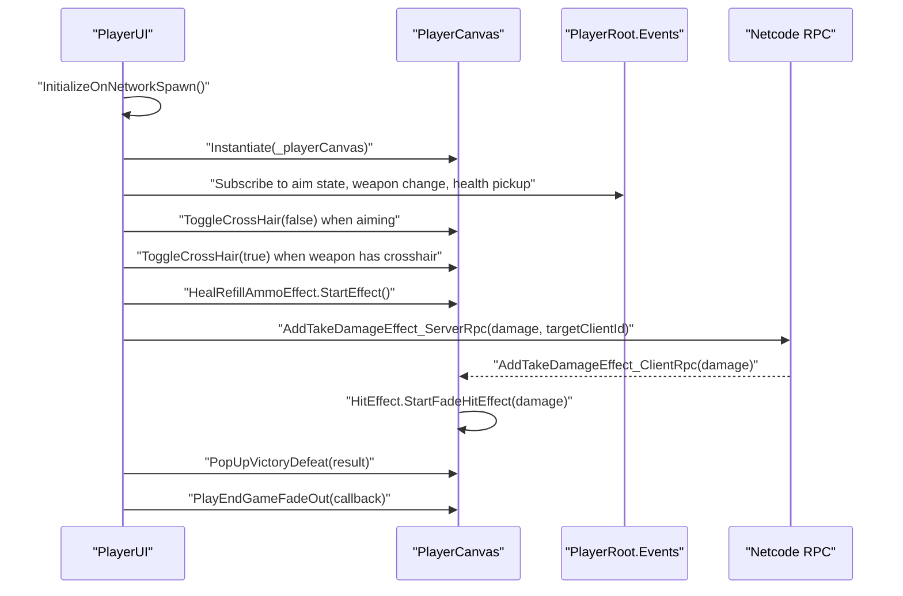
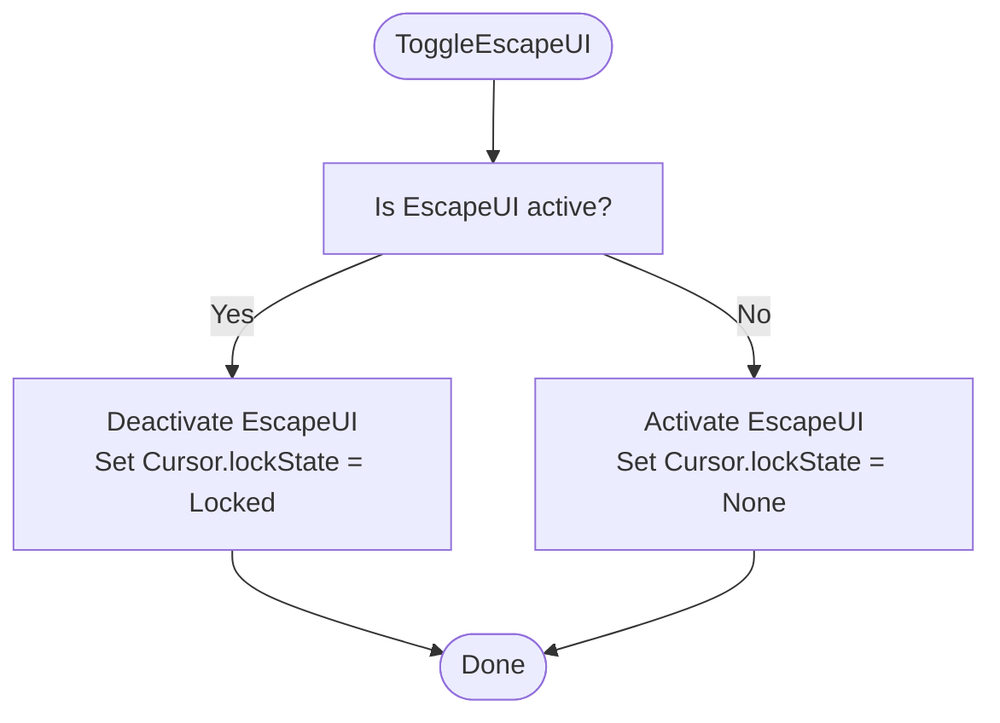
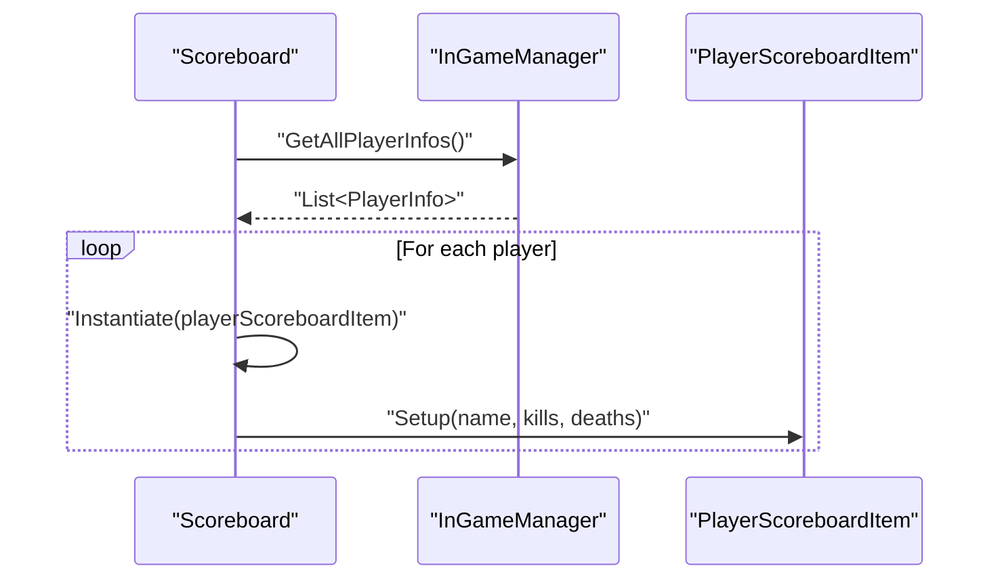
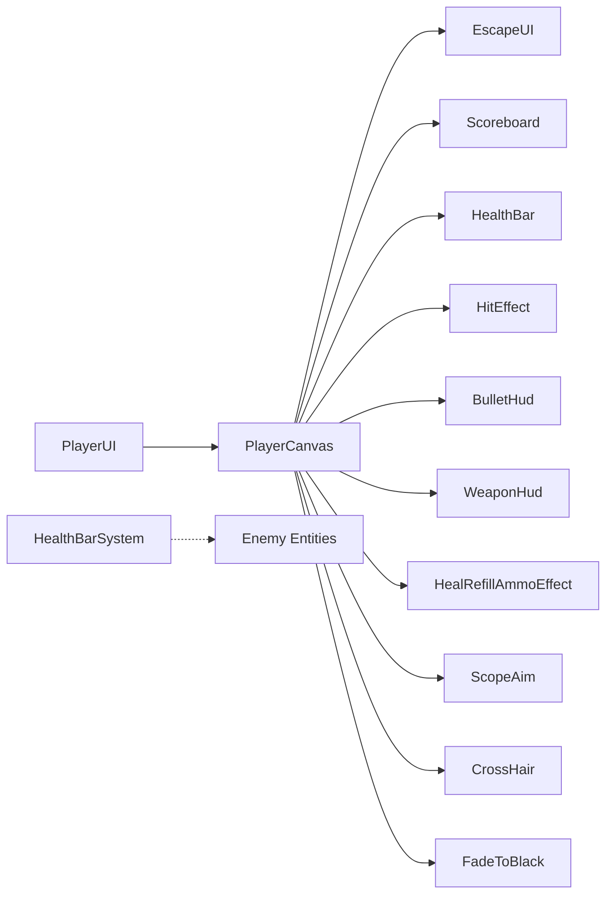

# Player UI

<cite>
**Referenced Files in This Document**
- [PlayerUI.cs](file://Assets/FPS-Game/Scripts/Player/PlayerUI.cs)
- [PlayerCanvas.cs](file://Assets/FPS-Game/Scripts/Player/PlayerCanvas.cs)
- [EscapeUI.cs](file://Assets/FPS-Game/Scripts/Player/PlayerCanvas/EscapeUI.cs)
- [Scoreboard.cs](file://Assets/FPS-Game/Scripts/Scoreboard.cs)
- [PlayerScoreboardItem.cs](file://Assets/FPS-Game/Scripts/PlayerScoreboardItem.cs)
- [HealthBar.cs](file://Assets/FPS-Game/Scripts/Player/HealthBar.cs)
- [HealthBarSystem.cs](file://Assets/FPS-Game/Scripts/HealthBarSystem.cs)
- [UIManager.cs](file://Assets/FPS-Game/Scripts/UIManager.cs)
</cite>

## Table of Contents
1. [Introduction](#introduction)
2. [Project Structure](#project-structure)
3. [Core Components](#core-components)
4. [Architecture Overview](#architecture-overview)
5. [Detailed Component Analysis](#detailed-component-analysis)
6. [Dependency Analysis](#dependency-analysis)
7. [Performance Considerations](#performance-considerations)
8. [Troubleshooting Guide](#troubleshooting-guide)
9. [Conclusion](#conclusion)

## Introduction
This document describes the Player UI system in the FPS game, focusing on how the player interface is structured, instantiated, and controlled during gameplay. It covers the main UI controller, the canvas container, escape menu, scoreboard, health indicators, and related effects. The system integrates with the game's networking layer to synchronize UI updates across clients and provides visual feedback for hits, ammo refill, and end-game transitions.

## Project Structure
The Player UI system is organized around a central controller that instantiates and manages a player-specific UI canvas. The canvas contains sub-components for health, hit effects, crosshair/scope visibility, escape menu, scoreboard, and end-game fade-out. Supporting systems handle health bar pooling and global UI management.

**Diagram sources**
- [PlayerUI.cs:6-64](file://Assets/FPS-Game/Scripts/Player/PlayerUI.cs#L6-L64)
- [PlayerCanvas.cs:7-26](file://Assets/FPS-Game/Scripts/Player/PlayerCanvas.cs#L7-L26)

**Section sources**
- [PlayerUI.cs:6-64](file://Assets/FPS-Game/Scripts/Player/PlayerUI.cs#L6-L64)
- [PlayerCanvas.cs:7-26](file://Assets/FPS-Game/Scripts/Player/PlayerCanvas.cs#L7-L26)

## Core Components
- PlayerUI: The primary controller for player UI behavior. It spawns the PlayerCanvas for the local player, subscribes to game events, toggles UI elements, handles escape menu and scoreboard, and coordinates networked UI effects like hit feedback and end-game transitions.
- PlayerCanvas: The main UI container holding all visible elements (health, hit effect, crosshair, scope, timer, location, escape UI, scoreboard, fade-to-black effect).
- EscapeUI: Handles the pause menu and quit action, invoking a quit event to shut down the game cleanly.
- Scoreboard and PlayerScoreboardItem: Display end-of-game player statistics in a scrollable list.
- HealthBar and HealthBarSystem: Manage player health visuals and a pooled health bar system for enemy entities.
- UIManager: Placeholder for global UI management utilities.

**Section sources**
- [PlayerUI.cs:6-203](file://Assets/FPS-Game/Scripts/Player/PlayerUI.cs#L6-L203)
- [PlayerCanvas.cs:7-91](file://Assets/FPS-Game/Scripts/Player/PlayerCanvas.cs#L7-L91)
- [EscapeUI.cs:5-19](file://Assets/FPS-Game/Scripts/Player/PlayerCanvas/EscapeUI.cs#L5-L19)
- [Scoreboard.cs:4-46](file://Assets/FPS-Game/Scripts/Scoreboard.cs#L4-L46)
- [PlayerScoreboardItem.cs:8-27](file://Assets/FPS-Game/Scripts/PlayerScoreboardItem.cs#L8-L27)
- [HealthBar.cs:6-14](file://Assets/FPS-Game/Scripts/Player/HealthBar.cs#L6-L14)
- [HealthBarSystem.cs:5-62](file://Assets/FPS-Game/Scripts/HealthBarSystem.cs#L5-L62)
- [UIManager.cs:7-33](file://Assets/FPS-Game/Scripts/UIManager.cs#L7-L33)

## Architecture Overview
The Player UI architecture follows a controller-canvas-subcomponents pattern with event-driven updates and network synchronization. The PlayerUI controller initializes the PlayerCanvas for the local player, listens to game events (aim state, weapon change, health pickup, timer), and triggers UI animations and effects. The PlayerCanvas exposes methods to toggle visibility of various UI elements and manage end-game transitions.

**Diagram sources**
- [PlayerUI.cs:6-203](file://Assets/FPS-Game/Scripts/Player/PlayerUI.cs#L6-L203)
- [PlayerCanvas.cs:7-91](file://Assets/FPS-Game/Scripts/Player/PlayerCanvas.cs#L7-L91)
- [EscapeUI.cs:5-19](file://Assets/FPS-Game/Scripts/Player/PlayerCanvas/EscapeUI.cs#L5-L19)
- [Scoreboard.cs:4-46](file://Assets/FPS-Game/Scripts/Scoreboard.cs#L4-L46)
- [PlayerScoreboardItem.cs:8-27](file://Assets/FPS-Game/Scripts/PlayerScoreboardItem.cs#L8-L27)
- [HealthBar.cs:6-14](file://Assets/FPS-Game/Scripts/Player/HealthBar.cs#L6-L14)
- [HealthBarSystem.cs:5-62](file://Assets/FPS-Game/Scripts/HealthBarSystem.cs#L5-L62)

## Detailed Component Analysis

### PlayerUI Controller
Responsibilities:
- Instantiates the PlayerCanvas for the local player (owner and human character).
- Subscribes to game events to update UI state (aim state, weapon change, health pickup).
- Toggles escape UI and scoreboard based on input.
- Coordinates end-of-game UI pop-ups and fade-out transitions.
- Synchronizes hit effects across the network using ServerRpc/ClientRpc.

Key behaviors:
- Network initialization ensures only the local player creates the canvas and subscribes to events.
- Aim state changes hide or show the crosshair depending on whether the current weapon has a crosshair component.
- Health pickup triggers a visual effect on the HUD.
- End-of-game logic determines victory/defeat based on max kill count and current player ID, then triggers a fade-out sequence.

**Diagram sources**
- [PlayerUI.cs:20-64](file://Assets/FPS-Game/Scripts/Player/PlayerUI.cs#L20-L64)
- [PlayerUI.cs:103-126](file://Assets/FPS-Game/Scripts/Player/PlayerUI.cs#L103-L126)
- [PlayerCanvas.cs:33-42](file://Assets/FPS-Game/Scripts/Player/PlayerCanvas.cs#L33-L42)

**Section sources**
- [PlayerUI.cs:20-64](file://Assets/FPS-Game/Scripts/Player/PlayerUI.cs#L20-L64)
- [PlayerUI.cs:103-126](file://Assets/FPS-Game/Scripts/Player/PlayerUI.cs#L103-L126)

### PlayerCanvas Container
Responsibilities:
- Holds references to all UI subcomponents (health bar, hit effect, crosshair, scope, timer, location, escape UI, scoreboard, fade-to-black image).
- Provides methods to toggle visibility of crosshair, escape UI, and scoreboard.
- Updates timer display and location text.
- Manages end-game fade-out with a coroutine that lerps alpha over time.

Notable features:
- ToggleEscapeUI switches the cursor lock mode along with enabling/disabling the escape UI panel.
- FadeToBlackRoutine performs a smooth transition to black using unscaled time to avoid slowdown artifacts.

**Diagram sources**
- [PlayerCanvas.cs:44-53](file://Assets/FPS-Game/Scripts/Player/PlayerCanvas.cs#L44-L53)

**Section sources**
- [PlayerCanvas.cs:27-91](file://Assets/FPS-Game/Scripts/Player/PlayerCanvas.cs#L27-L91)

### EscapeUI
Responsibilities:
- Provides a quit button that triggers a quit event.
- Ensures the quit button is always visible for the local player, regardless of lobby/host checks.

Integration:
- The quit button invokes a shared event that shuts down the game on all clients.

**Section sources**
- [EscapeUI.cs:9-19](file://Assets/FPS-Game/Scripts/Player/PlayerCanvas/EscapeUI.cs#L9-L19)

### Scoreboard and PlayerScoreboardItem
Responsibilities:
- Scoreboard displays a list of players with their names, kills, and deaths.
- PlayerScoreboardItem renders individual rows with formatted text.
- The scoreboard is populated when the InGameManager provides player info and is cleared when disabled.

**Diagram sources**
- [Scoreboard.cs:20-31](file://Assets/FPS-Game/Scripts/Scoreboard.cs#L20-L31)
- [PlayerScoreboardItem.cs:20-25](file://Assets/FPS-Game/Scripts/PlayerScoreboardItem.cs#L20-L25)

**Section sources**
- [Scoreboard.cs:4-46](file://Assets/FPS-Game/Scripts/Scoreboard.cs#L4-L46)
- [PlayerScoreboardItem.cs:8-27](file://Assets/FPS-Game/Scripts/PlayerScoreboardItem.cs#L8-L27)

### Health Bar Systems
Responsibilities:
- HealthBar: Updates the fill amount of the player's health UI element.
- HealthBarSystem: Manages a pool of canvases for enemy health bars, rotating them to face the camera and reusing inactive instances.

Considerations:
- The pooling reduces instantiation overhead for many enemies.
- The system rotates visible canvases to always face the player camera.

**Section sources**
- [HealthBar.cs:6-14](file://Assets/FPS-Game/Scripts/Player/HealthBar.cs#L6-L14)
- [HealthBarSystem.cs:5-62](file://Assets/FPS-Game/Scripts/HealthBarSystem.cs#L5-L62)

### UIManager
Responsibilities:
- Placeholder for global UI management utilities.
- Currently commented out but can be extended to manage shared UI elements.

**Section sources**
- [UIManager.cs:7-33](file://Assets/FPS-Game/Scripts/UIManager.cs#L7-L33)

## Dependency Analysis
The Player UI system exhibits clear separation of concerns:
- PlayerUI depends on PlayerCanvas and PlayerRoot events to orchestrate UI behavior.
- PlayerCanvas aggregates subcomponents and exposes simple methods for toggling and updating UI elements.
- EscapeUI and Scoreboard are tightly coupled to PlayerCanvas and rely on shared events for quit and data updates.
- HealthBarSystem is decoupled from PlayerUI and operates independently for enemy health visuals.

**Diagram sources**
- [PlayerUI.cs:6-64](file://Assets/FPS-Game/Scripts/Player/PlayerUI.cs#L6-L64)
- [PlayerCanvas.cs:7-26](file://Assets/FPS-Game/Scripts/Player/PlayerCanvas.cs#L7-L26)
- [HealthBarSystem.cs:16-33](file://Assets/FPS-Game/Scripts/HealthBarSystem.cs#L16-L33)

**Section sources**
- [PlayerUI.cs:6-64](file://Assets/FPS-Game/Scripts/Player/PlayerUI.cs#L6-L64)
- [PlayerCanvas.cs:7-26](file://Assets/FPS-Game/Scripts/Player/PlayerCanvas.cs#L7-L26)
- [HealthBarSystem.cs:16-33](file://Assets/FPS-Game/Scripts/HealthBarSystem.cs#L16-L33)

## Performance Considerations
- Use of pooling for enemy health bars reduces GC pressure and improves frame stability when many enemies are present.
- Using unscaled time in the fade-to-black routine prevents visual glitches during slowdown scenarios.
- Event subscriptions are scoped to the local player to minimize unnecessary work on remote clients.
- Crosshair visibility toggling avoids redundant UI updates by checking weapon type before changing state.

## Troubleshooting Guide
Common issues and resolutions:
- Escape UI does not toggle: Verify that the input flag is being reset after toggling and that PlayerCanvas.ToggleEscapeUI is called.
- Crosshair not appearing: Ensure the current weapon has a crosshair component so PlayerUI can enable it.
- Health pickup effect not playing: Confirm that the heal refill effect component is assigned in PlayerCanvas and that the event is firing.
- End-game fade not working: Check that the fade image is assigned and that the duration/wait times are configured properly.
- Quit button not functional: Ensure the EscapeUI quit button is enabled and that the quit event is invoked to trigger shutdown on all clients.

**Section sources**
- [PlayerUI.cs:184-202](file://Assets/FPS-Game/Scripts/Player/PlayerUI.cs#L184-L202)
- [PlayerCanvas.cs:39-48](file://Assets/FPS-Game/Scripts/Player/PlayerCanvas.cs#L39-L48)
- [EscapeUI.cs:14-18](file://Assets/FPS-Game/Scripts/Player/PlayerCanvas/EscapeUI.cs#L14-L18)

## Conclusion
The Player UI system provides a modular, event-driven interface tailored to the player’s perspective. It integrates seamlessly with the game’s networking model to synchronize visual feedback and state changes across clients. The canvas-based architecture allows for easy extension and maintenance, while pooling and performance-conscious timing ensure smooth gameplay.