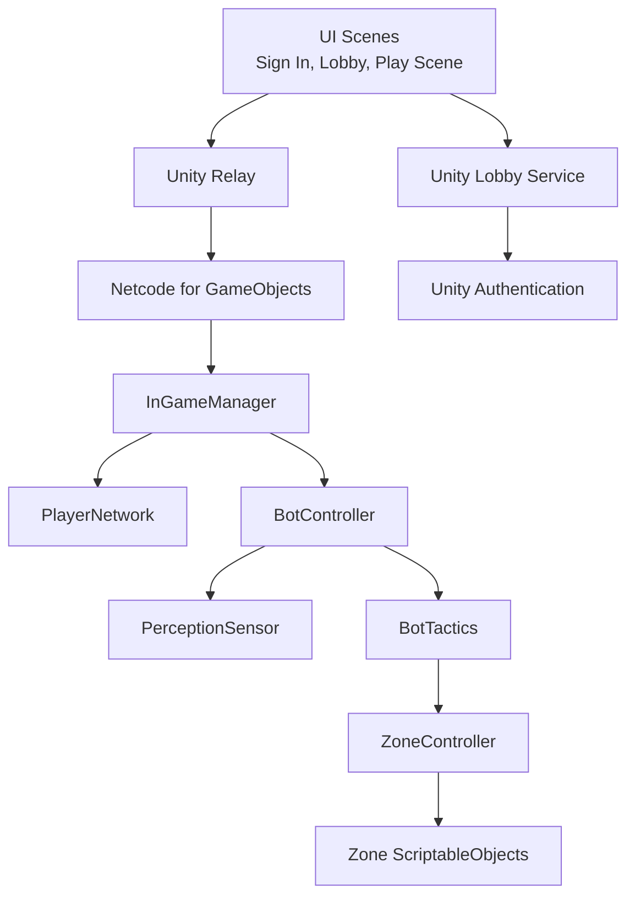
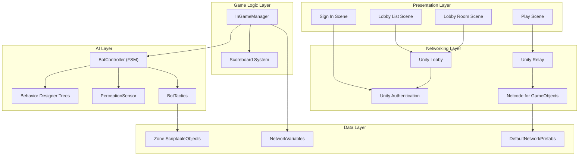
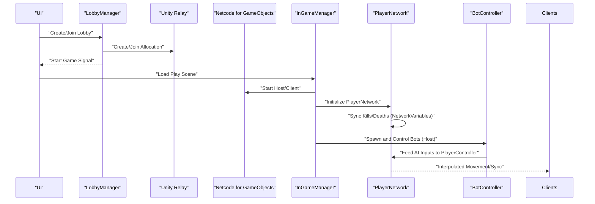
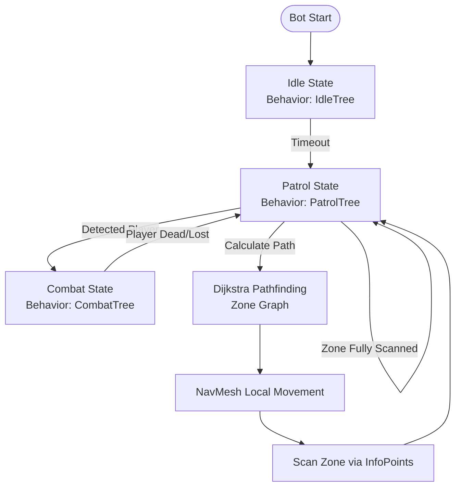
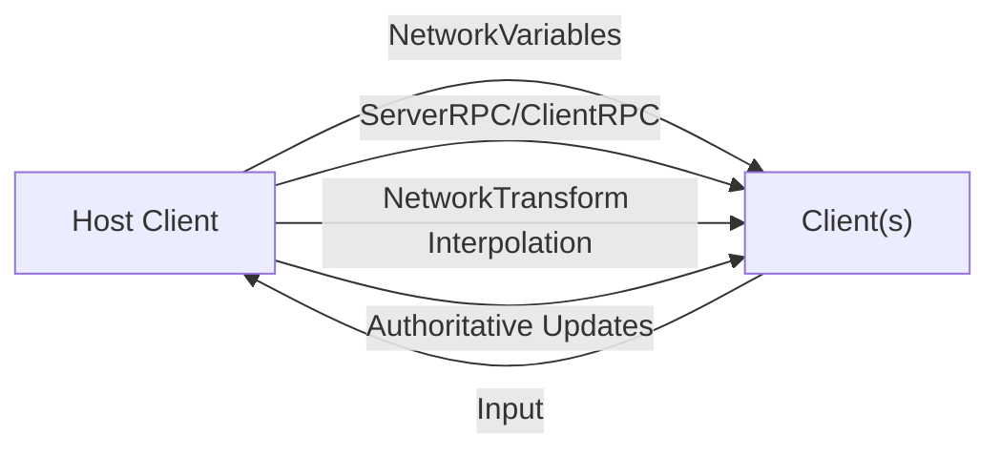
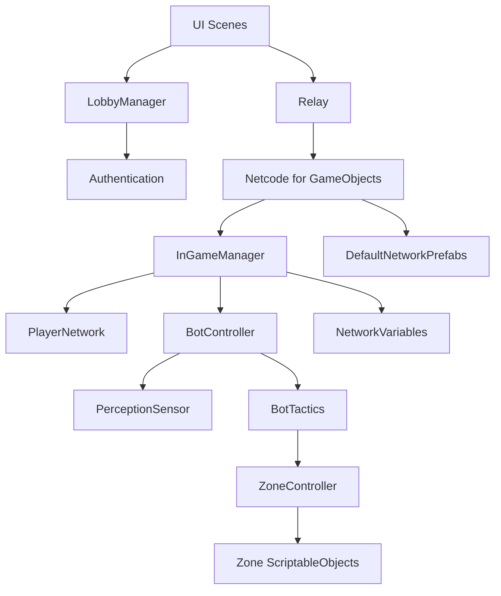

# Introduction & Background

<cite>
**Referenced Files in This Document**
- [README.md](file://README.md)
- [WIKI.md](file://WIKI.md)
- [NetcodeForGameObjects.asset](file://ProjectSettings/NetcodeForGameObjects.asset)
- [DefaultNetworkPrefabs.asset](file://Assets/DefaultNetworkPrefabs.asset)
- [LobbyManager.cs](file://Assets/FPS-Game/Scripts/Lobby Script/Lobby/Scripts/LobbyManager.cs)
- [InGameManager.cs](file://Assets/FPS-Game/Scripts/System/InGameManager.cs)
- [PlayerNetwork.cs](file://Assets/FPS-Game/Scripts/Player/PlayerNetwork.cs)
- [BotController.cs](file://Assets/FPS-Game/Scripts/Bot/BotController.cs)
- [PerceptionSensor.cs](file://Assets/FPS-Game/Scripts/Bot/PerceptionSensor.cs)
- [BlackboardLinker.cs](file://Assets/FPS-Game/Scripts/Bot/BlackboardLinker.cs)
- [ZoneController.cs](file://Assets/FPS-Game/Scripts/System/ZoneController.cs)
- [Zone.cs](file://Assets/FPS-Game/Scripts/System/Zone.cs)
</cite>

## Table of Contents
1. [Introduction](#introduction)
2. [Project Structure](#project-structure)
3. [Core Components](#core-components)
4. [Architecture Overview](#architecture-overview)
5. [Detailed Component Analysis](#detailed-component-analysis)
6. [Dependency Analysis](#dependency-analysis)
7. [Performance Considerations](#performance-considerations)
8. [Troubleshooting Guide](#troubleshooting-guide)
9. [Conclusion](#conclusion)

## Introduction
This document presents the introduction and background for a graduation thesis project centered on a server-authoritative 3D multiplayer first-person shooter (FPS) game. The project demonstrates a scalable multiplayer architecture integrating Unity Gaming Services (UGS), Netcode for GameObjects (NGO), and AI-controlled bots operating under a unified host authority. It synthesizes academic rigor with practical game development outcomes, offering both conceptual overviews for readers unfamiliar with multiplayer architectures and technical depth for experienced developers.

Academic motivation
- Scalable multiplayer architecture: The project explores client-host topologies, server-authoritative state management, and network synchronization to support both human players and AI bots. It evaluates trade-offs between latency, fairness, and consistency in distributed game environments.
- AI bot integration: The system integrates AI bots that are fully controlled by the host and synchronized across clients. This ensures deterministic behavior and balanced gameplay, enabling reproducible evaluations of bot performance and tactical behaviors.
- Real-world applicability: By leveraging modern Unity services (Relay, Lobby, Authentication) and NGO, the project showcases a production-ready pipeline for matchmaking, connectivity, and real-time synchronization—key building blocks for live-service FPS games.

Historical context
- Multiplayer FPS evolution: The genre has long emphasized competitive balance, low-latency responsiveness, and fair play. Server-authoritative models emerged to mitigate client-side manipulation and maintain consistent game state across heterogeneous networks.
- Unity’s networking evolution: Unity’s networking stack has evolved from early solutions to robust, modern services. The project leverages NGO for deterministic synchronization, Unity Relay for serverless connectivity, and Unity Lobby for matchmaking, reflecting current industry best practices for cross-platform, low-latency multiplayer.

Educational value
- Demonstrates layered architecture: The project organizes systems into presentation, networking, game logic, AI, and data layers, enabling modular understanding and extensibility.
- Practical examples:
  - Lobby and matchmaking workflows: Creating, joining, and starting games via Unity Lobby and Relay.
  - Server-authoritative gameplay: Damage calculation, scoring, and state updates executed on the host.
  - AI bot orchestration: FSM–Behavior Tree hybrid architecture for bot decision-making, perception, and tactical movement.
  - Spatial reasoning: Zone-based pathfinding combining graph-level Dijkstra and local NavMesh navigation.

Real-world relevance
- Live-service considerations: The project addresses practical challenges such as latency differences, client interpolation, and fairness in host-governed environments.
- Extensibility: The modular design supports adding new game modes, bots, and AI behaviors, aligning with iterative development practices in live-service games.

## Project Structure
The project is organized around a layered architecture with clear separation of concerns:
- Presentation layer: UI scenes for sign-in, lobby browsing/joining, and in-game HUD/scoreboard.
- Networking layer: Unity Relay, Unity Lobby, and NGO for transport, matchmaking, and synchronization.
- Game logic layer: Server-authoritative session management, scoring, and lifecycle control.
- AI layer: Hybrid FSM–Behavior Tree system with perception, tactics, and spatial reasoning.
- Data layer: ScriptableObjects for zone data, NetworkVariables for synchronized stats, and player metadata.

**Diagram sources**
- [WIKI.md](file://WIKI.md)
- [LobbyManager.cs](file://Assets/FPS-Game/Scripts/Lobby Script/Lobby/Scripts/LobbyManager.cs)
- [InGameManager.cs](file://Assets/FPS-Game/Scripts/System/InGameManager.cs)
- [PlayerNetwork.cs](file://Assets/FPS-Game/Scripts/Player/PlayerNetwork.cs)
- [BotController.cs](file://Assets/FPS-Game/Scripts/Bot/BotController.cs)
- [PerceptionSensor.cs](file://Assets/FPS-Game/Scripts/Bot/PerceptionSensor.cs)
- [ZoneController.cs](file://Assets/FPS-Game/Scripts/System/ZoneController.cs)
- [Zone.cs](file://Assets/FPS-Game/Scripts/System/Zone.cs)

**Section sources**
- [WIKI.md](file://WIKI.md)
- [README.md](file://README.md)

## Core Components
- Lobby and matchmaking: Managed via Unity Lobby APIs for creating, querying, and starting sessions, coordinated with Relay join codes.
- Relay connectivity: Serverless allocation and join flows enable peer-to-peer transport with DTLS encryption.
- NGO synchronization: NetworkVariables for kills/deaths, RPCs for authoritative actions, and NetworkTransform interpolation.
- In-game session management: Central coordinator for timers, scoring, spawning, and end-of-match procedures.
- AI bot system: FSM states (Idle, Patrol, Combat) driven by Behavior Designer trees, with perception and tactical scanning.
- Spatial reasoning: Zone graph with InfoPoints and PortalPoints, enabling Dijkstra pathfinding and NavMesh-based local movement.

**Section sources**
- [WIKI.md](file://WIKI.md)
- [LobbyManager.cs](file://Assets/FPS-Game/Scripts/Lobby Script/Lobby/Scripts/LobbyManager.cs)
- [InGameManager.cs](file://Assets/FPS-Game/Scripts/System/InGameManager.cs)
- [PlayerNetwork.cs](file://Assets/FPS-Game/Scripts/Player/PlayerNetwork.cs)
- [BotController.cs](file://Assets/FPS-Game/Scripts/Bot/BotController.cs)
- [PerceptionSensor.cs](file://Assets/FPS-Game/Scripts/Bot/PerceptionSensor.cs)
- [ZoneController.cs](file://Assets/FPS-Game/Scripts/System/ZoneController.cs)
- [Zone.cs](file://Assets/FPS-Game/Scripts/System/Zone.cs)

## Architecture Overview
The system follows a layered architecture with explicit responsibilities and clear data/control flows. The server-authoritative design centralizes game logic and state updates, while NGO handles deterministic synchronization and Relay/Lobby provide connectivity and matchmaking.

**Diagram sources**
- [WIKI.md](file://WIKI.md)
- [NetcodeForGameObjects.asset](file://ProjectSettings/NetcodeForGameObjects.asset)
- [DefaultNetworkPrefabs.asset](file://Assets/DefaultNetworkPrefabs.asset)
- [LobbyManager.cs](file://Assets/FPS-Game/Scripts/Lobby Script/Lobby/Scripts/LobbyManager.cs)
- [InGameManager.cs](file://Assets/FPS-Game/Scripts/System/InGameManager.cs)
- [PlayerNetwork.cs](file://Assets/FPS-Game/Scripts/Player/PlayerNetwork.cs)
- [BotController.cs](file://Assets/FPS-Game/Scripts/Bot/BotController.cs)
- [PerceptionSensor.cs](file://Assets/FPS-Game/Scripts/Bot/PerceptionSensor.cs)
- [ZoneController.cs](file://Assets/FPS-Game/Scripts/System/ZoneController.cs)
- [Zone.cs](file://Assets/FPS-Game/Scripts/System/Zone.cs)

## Detailed Component Analysis

### Server-Authoritative Gameplay Flow
This sequence illustrates the end-to-end flow from lobby start to in-game authoritative updates and synchronized state across clients.

**Diagram sources**
- [WIKI.md](file://WIKI.md)
- [LobbyManager.cs](file://Assets/FPS-Game/Scripts/Lobby Script/Lobby/Scripts/LobbyManager.cs)
- [InGameManager.cs](file://Assets/FPS-Game/Scripts/System/InGameManager.cs)
- [PlayerNetwork.cs](file://Assets/FPS-Game/Scripts/Player/PlayerNetwork.cs)
- [BotController.cs](file://Assets/FPS-Game/Scripts/Bot/BotController.cs)

**Section sources**
- [WIKI.md](file://WIKI.md)
- [LobbyManager.cs](file://Assets/FPS-Game/Scripts/Lobby Script/Lobby/Scripts/LobbyManager.cs)
- [InGameManager.cs](file://Assets/FPS-Game/Scripts/System/InGameManager.cs)
- [PlayerNetwork.cs](file://Assets/FPS-Game/Scripts/Player/PlayerNetwork.cs)
- [BotController.cs](file://Assets/FPS-Game/Scripts/Bot/BotController.cs)

### AI Bot Decision Loop
The bot decision flow combines FSM states with Behavior Designer tasks, perception events, and tactical scanning.

**Diagram sources**
- [WIKI.md](file://WIKI.md)
- [BotController.cs](file://Assets/FPS-Game/Scripts/Bot/BotController.cs)
- [PerceptionSensor.cs](file://Assets/FPS-Game/Scripts/Bot/PerceptionSensor.cs)
- [BlackboardLinker.cs](file://Assets/FPS-Game/Scripts/Bot/BlackboardLinker.cs)
- [ZoneController.cs](file://Assets/FPS-Game/Scripts/System/ZoneController.cs)
- [Zone.cs](file://Assets/FPS-Game/Scripts/System/Zone.cs)

**Section sources**
- [WIKI.md](file://WIKI.md)
- [BotController.cs](file://Assets/FPS-Game/Scripts/Bot/BotController.cs)
- [PerceptionSensor.cs](file://Assets/FPS-Game/Scripts/Bot/PerceptionSensor.cs)
- [BlackboardLinker.cs](file://Assets/FPS-Game/Scripts/Bot/BlackboardLinker.cs)
- [ZoneController.cs](file://Assets/FPS-Game/Scripts/System/ZoneController.cs)
- [Zone.cs](file://Assets/FPS-Game/Scripts/System/Zone.cs)

### Networking and Synchronization
This diagram highlights the synchronization of player identities, stats, and authoritative actions across the network.

**Diagram sources**
- [WIKI.md](file://WIKI.md)
- [PlayerNetwork.cs](file://Assets/FPS-Game/Scripts/Player/PlayerNetwork.cs)
- [InGameManager.cs](file://Assets/FPS-Game/Scripts/System/InGameManager.cs)
- [NetcodeForGameObjects.asset](file://ProjectSettings/NetcodeForGameObjects.asset)
- [DefaultNetworkPrefabs.asset](file://Assets/DefaultNetworkPrefabs.asset)

**Section sources**
- [WIKI.md](file://WIKI.md)
- [PlayerNetwork.cs](file://Assets/FPS-Game/Scripts/Player/PlayerNetwork.cs)
- [InGameManager.cs](file://Assets/FPS-Game/Scripts/System/InGameManager.cs)
- [NetcodeForGameObjects.asset](file://ProjectSettings/NetcodeForGameObjects.asset)
- [DefaultNetworkPrefabs.asset](file://Assets/DefaultNetworkPrefabs.asset)

## Dependency Analysis
The project exhibits strong cohesion within layers and deliberate coupling between subsystems:
- Presentation depends on Unity Services for authentication and lobby management.
- Networking couples tightly to NGO and Relay, with Lobby providing session orchestration.
- Game logic coordinates player and bot lifecycle, scoring, and end-of-match procedures.
- AI depends on perception, tactics, and spatial data structures for decision-making.
- Data relies on ScriptableObjects and NetworkVariables for persistent and synchronized state.

**Diagram sources**
- [WIKI.md](file://WIKI.md)
- [LobbyManager.cs](file://Assets/FPS-Game/Scripts/Lobby Script/Lobby/Scripts/LobbyManager.cs)
- [InGameManager.cs](file://Assets/FPS-Game/Scripts/System/InGameManager.cs)
- [PlayerNetwork.cs](file://Assets/FPS-Game/Scripts/Player/PlayerNetwork.cs)
- [BotController.cs](file://Assets/FPS-Game/Scripts/Bot/BotController.cs)
- [PerceptionSensor.cs](file://Assets/FPS-Game/Scripts/Bot/PerceptionSensor.cs)
- [ZoneController.cs](file://Assets/FPS-Game/Scripts/System/ZoneController.cs)
- [Zone.cs](file://Assets/FPS-Game/Scripts/System/Zone.cs)
- [NetcodeForGameObjects.asset](file://ProjectSettings/NetcodeForGameObjects.asset)
- [DefaultNetworkPrefabs.asset](file://Assets/DefaultNetworkPrefabs.asset)

**Section sources**
- [WIKI.md](file://WIKI.md)
- [LobbyManager.cs](file://Assets/FPS-Game/Scripts/Lobby Script/Lobby/Scripts/LobbyManager.cs)
- [InGameManager.cs](file://Assets/FPS-Game/Scripts/System/InGameManager.cs)
- [PlayerNetwork.cs](file://Assets/FPS-Game/Scripts/Player/PlayerNetwork.cs)
- [BotController.cs](file://Assets/FPS-Game/Scripts/Bot/BotController.cs)
- [PerceptionSensor.cs](file://Assets/FPS-Game/Scripts/Bot/PerceptionSensor.cs)
- [ZoneController.cs](file://Assets/FPS-Game/Scripts/System/ZoneController.cs)
- [Zone.cs](file://Assets/FPS-Game/Scripts/System/Zone.cs)
- [NetcodeForGameObjects.asset](file://ProjectSettings/NetcodeForGameObjects.asset)
- [DefaultNetworkPrefabs.asset](file://Assets/DefaultNetworkPrefabs.asset)

## Performance Considerations
- Latency and fairness: Host-governed environments can introduce imbalance when host and clients differ significantly in latency. Strategies include prioritizing authoritative actions, minimizing unnecessary RPCs, and optimizing interpolation.
- Synchronization overhead: NetworkVariables and RPCs should be scoped to essential data to reduce bandwidth and CPU usage.
- AI pathfinding cost: Dijkstra on zone graphs and NavMesh sampling should be bounded and cached where appropriate to avoid frame-time spikes.
- Perception and scanning: FOV and raycast filtering should be tuned to reduce unnecessary computations during scanning routines.

## Troubleshooting Guide
Common issues and mitigation strategies:
- Lobby polling and heartbeat: Ensure periodic heartbeat and polling are active to keep sessions alive and responsive.
- Relay allocation failures: Verify internet connectivity and that join codes are propagated correctly across clients.
- NetworkVariable desync: Confirm authoritative updates occur on the host and that clients subscribe to relevant variables.
- Bot control desync: Validate that AI input feeding occurs consistently and that Behavior Designer variables are bound correctly.

**Section sources**
- [WIKI.md](file://WIKI.md)
- [LobbyManager.cs](file://Assets/FPS-Game/Scripts/Lobby Script/Lobby/Scripts/LobbyManager.cs)
- [InGameManager.cs](file://Assets/FPS-Game/Scripts/System/InGameManager.cs)
- [PlayerNetwork.cs](file://Assets/FPS-Game/Scripts/Player/PlayerNetwork.cs)
- [BotController.cs](file://Assets/FPS-Game/Scripts/Bot/BotController.cs)
- [PerceptionSensor.cs](file://Assets/FPS-Game/Scripts/Bot/PerceptionSensor.cs)
- [BlackboardLinker.cs](file://Assets/FPS-Game/Scripts/Bot/BlackboardLinker.cs)

## Conclusion
This project advances the state of educational and practical multiplayer FPS development by demonstrating a server-authoritative architecture with AI bot integration, modern Unity services, and robust synchronization. It provides a solid foundation for evaluating scalability, fairness, and performance in live-service contexts, while offering clear pathways for extending gameplay modes, AI behaviors, and spatial reasoning systems.