# Key Features & Capabilities

<cite>
**Referenced Files in This Document**
- [README.md](file://README.md)
- [Firearm.cs](file://Assets/FPS-Game/Scripts/Firearm.cs)
- [Weapon.cs](file://Assets/FPS-Game/Scripts/Weapon.cs)
- [Player/WeaponHolder.cs](file://Assets/FPS-Game/Scripts/Player/WeaponHolder.cs)
- [Player/PlayerTakeDamage.cs](file://Assets/FPS-Game/Scripts/Player/PlayerTakeDamage.cs)
- [Melees.cs](file://Assets/FPS-Game/Scripts/Melees.cs)
- [Scoreboard.cs](file://Assets/FPS-Game/Scripts/Scoreboard.cs)
- [PlayerScoreboardItem.cs](file://Assets/FPS-Game/Scripts/PlayerScoreboardItem.cs)
- [Player/PlayerCanvas.cs](file://Assets/FPS-Game/Scripts/Player/PlayerCanvas.cs)
- [Bot/PerceptionSensor.cs](file://Assets/FPS-Game/Scripts/Bot/PerceptionSensor.cs)
- [Bot/BlackboardLinker.cs](file://Assets/FPS-Game/Scripts/Bot/BlackboardLinker.cs)
- [Bot/BotTactics.cs](file://Assets/FPS-Game/Scripts/Bot/BotTactics.cs)
- [Bot/WaypointPath.cs](file://Assets/FPS-Game/Scripts/Bot/WaypointPath.cs)
- [TacticalAI/Data/ZoneData.cs](file://Assets/FPS-Game/Scripts/TacticalAI/Data/ZoneData.cs)
- [TacticalAI/Data/InfoPoint.cs](file://Assets/FPS-Game/Scripts/TacticalAI/Data/InfoPoint.cs)
</cite>

## Table of Contents
1. [Introduction](#introduction)
2. [Project Structure](#project-structure)
3. [Core Components](#core-components)
4. [Architecture Overview](#architecture-overview)
5. [Detailed Component Analysis](#detailed-component-analysis)
6. [Dependency Analysis](#dependency-analysis)
7. [Performance Considerations](#performance-considerations)
8. [Troubleshooting Guide](#troubleshooting-guide)
9. [Conclusion](#conclusion)

## Introduction
This document presents the complete feature set of the server-authoritative 3D multiplayer FPS game, focusing on the map system, character models, movement synchronization, comprehensive weapon system, server-authoritative damage and match loop, hybrid FSM-BT AI architecture, hierarchical pathfinding, and zone-based spatial reasoning. It synthesizes the repository’s documented capabilities and highlights the systems that enable a fair, scalable, and engaging competitive experience.

## Project Structure
The project is organized around a Unity-based architecture with clear separation of concerns:
- Systems for networking, player movement, and weapon handling under the Scripts folder
- AI subsystems (perception, tactics, behavior binding) under Bot and TacticalAI
- UI and HUD systems for match loop and scoreboard
- Assets for models, animations, prefabs, and scenes supporting the Italy-inspired Counter-Strike style map

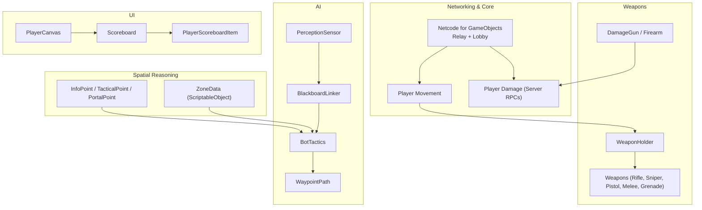

**Section sources**
- [README.md:62-84](file://README.md#L62-L84)

## Core Components
- Map and Environment: Italy-inspired Counter-Strike style map with zone partitioning and InfoPoints/TacticalPoints/PortalPoints baked as ScriptableObjects for spatial reasoning.
- Character Models and Movement: Fully humanoid models with movement synchronization (idle, walk, run, jump) across the network.
- Weapon System: Rifles, Sniper, Pistols, Melee, and Grenades with shooting, aiming, reloading, and weapon switching.
- Server-Authoritative Damage: Hit detection and damage application executed via ServerRpc to prevent cheating.
- Match Loop: Scoreboard, timers, and end-game fade-out; win/loss conditions coordinated by the in-game manager.
- Hybrid AI: FSM–Behavior Tree architecture with perception, tactics, and hierarchical pathfinding.

**Section sources**
- [README.md:62-84](file://README.md#L62-L84)

## Architecture Overview
The system integrates Unity Networking (Netcode for GameObjects) with a server-authoritative model. The AI subsystems use Behavior Designer trees bound to a blackboard, while spatial reasoning leverages ScriptableObject zone data and point types.

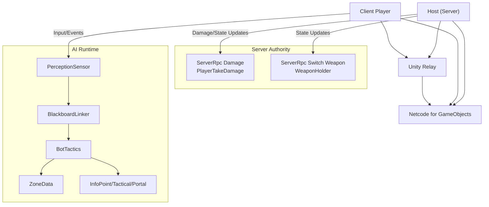

**Diagram sources**
- [README.md:26-32](file://README.md#L26-L32)
- [Player/PlayerTakeDamage.cs:46-124](file://Assets/FPS-Game/Scripts/Player/PlayerTakeDamage.cs#L46-L124)
- [Player/WeaponHolder.cs:50-95](file://Assets/FPS-Game/Scripts/Player/WeaponHolder.cs#L50-L95)
- [Bot/PerceptionSensor.cs:10-62](file://Assets/FPS-Game/Scripts/Bot/PerceptionSensor.cs#L10-L62)
- [Bot/BlackboardLinker.cs:54-113](file://Assets/FPS-Game/Scripts/Bot/BlackboardLinker.cs#L54-L113)
- [Bot/BotTactics.cs:17-76](file://Assets/FPS-Game/Scripts/Bot/BotTactics.cs#L17-L76)
- [TacticalAI/Data/ZoneData.cs:30-122](file://Assets/FPS-Game/Scripts/TacticalAI/Data/ZoneData.cs#L30-L122)
- [TacticalAI/Data/InfoPoint.cs:8-40](file://Assets/FPS-Game/Scripts/TacticalAI/Data/InfoPoint.cs#L8-L40)

## Detailed Component Analysis

### Map System and Spatial Reasoning
- Zone-based spatial reasoning uses ScriptableObject ZoneData containing InfoPoints, TacticalPoints, and PortalPoints. Zones are connected via portal pairs with traversal costs.
- InfoPoint tracks visibility indices to adjacent points, enabling tactical scanning and area coverage.
- The Tactics module computes scan ranges, selects best points, and signals completion events to drive AI behavior.

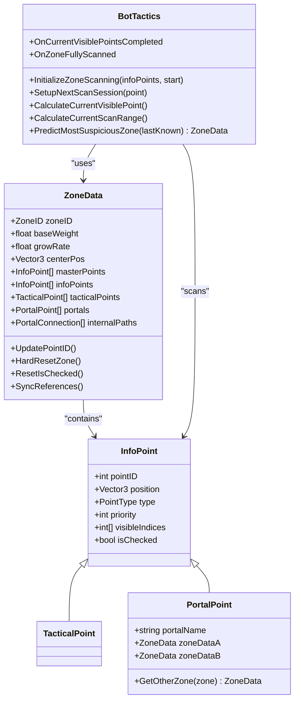

**Diagram sources**
- [TacticalAI/Data/ZoneData.cs:30-122](file://Assets/FPS-Game/Scripts/TacticalAI/Data/ZoneData.cs#L30-L122)
- [TacticalAI/Data/InfoPoint.cs:8-40](file://Assets/FPS-Game/Scripts/TacticalAI/Data/InfoPoint.cs#L8-L40)
- [Bot/BotTactics.cs:17-76](file://Assets/FPS-Game/Scripts/Bot/BotTactics.cs#L17-L76)

**Section sources**
- [TacticalAI/Data/ZoneData.cs:30-122](file://Assets/FPS-Game/Scripts/TacticalAI/Data/ZoneData.cs#L30-L122)
- [TacticalAI/Data/InfoPoint.cs:8-40](file://Assets/FPS-Game/Scripts/TacticalAI/Data/InfoPoint.cs#L8-L40)
- [Bot/BotTactics.cs:114-196](file://Assets/FPS-Game/Scripts/Bot/BotTactics.cs#L114-L196)

### Character Models and Movement Synchronization
- Movement synchronization covers idle, walk, run, and jump states across the network.
- The weapon holder component manages weapon mounting, scaling, and initial equipment assignment for bots and human players.

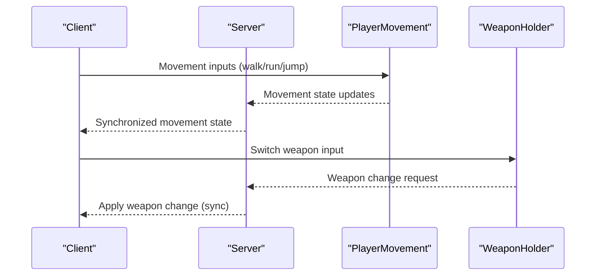

**Section sources**
- [README.md:63-69](file://README.md#L63-L69)
- [Player/WeaponHolder.cs:50-95](file://Assets/FPS-Game/Scripts/Player/WeaponHolder.cs#L50-L95)

### Comprehensive Weapon System
- Weapon types include Rifle, Sniper, Pistol, Melee, and Grenade.
- Core mechanics: shooting, aiming, reloading, and weapon switching are integrated with server-authoritative damage and effects.

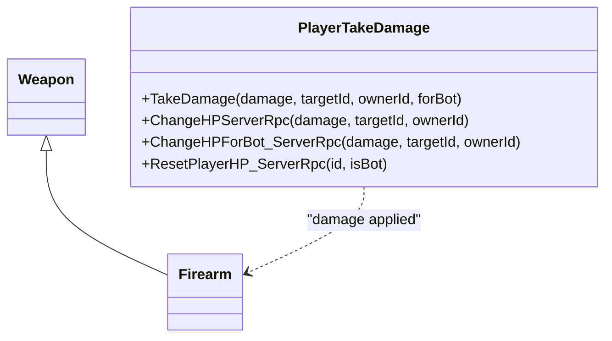

**Diagram sources**
- [Weapon.cs:5-18](file://Assets/FPS-Game/Scripts/Weapon.cs#L5-L18)
- [Firearm.cs:5-18](file://Assets/FPS-Game/Scripts/Firearm.cs#L5-L18)
- [Player/PlayerTakeDamage.cs:46-124](file://Assets/FPS-Game/Scripts/Player/PlayerTakeDamage.cs#L46-L124)

**Section sources**
- [README.md:66-69](file://README.md#L66-L69)
- [Firearm.cs:5-18](file://Assets/FPS-Game/Scripts/Firearm.cs#L5-L18)
- [Player/PlayerTakeDamage.cs:46-124](file://Assets/FPS-Game/Scripts/Player/PlayerTakeDamage.cs#L46-L124)

### Server-Authoritative Damage System
- Damage is processed via ServerRpc to ensure fairness and prevent cheating. Effects (hit indicators) are broadcast to clients.
- Melee attacks use ServerRpc to check hits and apply damage deterministically.

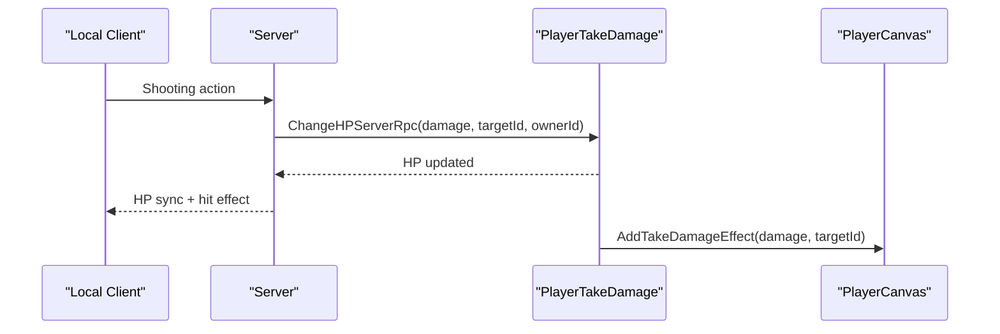

**Diagram sources**
- [Player/PlayerTakeDamage.cs:46-83](file://Assets/FPS-Game/Scripts/Player/PlayerTakeDamage.cs#L46-L83)
- [Player/PlayerCanvas.cs:50-91](file://Assets/FPS-Game/Scripts/Player/PlayerCanvas.cs#L50-L91)

**Section sources**
- [README.md:69](file://README.md#L69)
- [Player/PlayerTakeDamage.cs:46-124](file://Assets/FPS-Game/Scripts/Player/PlayerTakeDamage.cs#L46-L124)

### Melee Weapons and Grenades
- Melee system includes slash hit detection using ServerRpc to resolve hits and damage.
- Grenade mechanics are represented in the inventory and weapon manager systems.

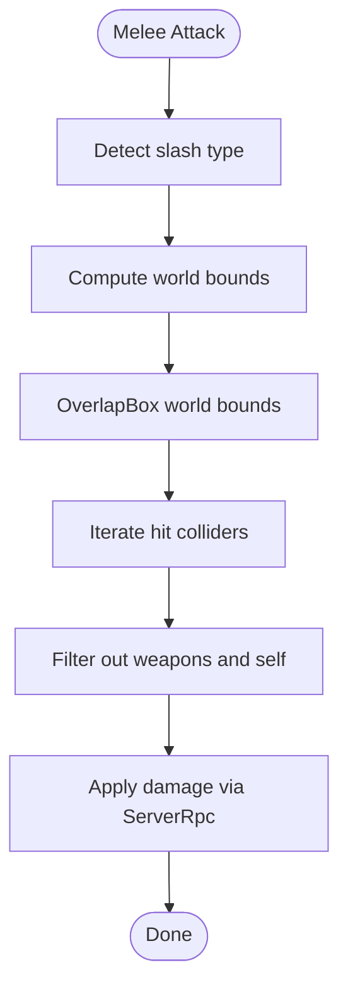

**Diagram sources**
- [Melees.cs:95-130](file://Assets/FPS-Game/Scripts/Melees.cs#L95-L130)

**Section sources**
- [README.md:66-69](file://README.md#L66-L69)
- [Melees.cs:95-130](file://Assets/FPS-Game/Scripts/Melees.cs#L95-L130)

### Fully Playable Match Loop and Scoreboard
- The match loop includes a timer, location text, and end-game fade-out.
- Scoreboard displays player names, kills, and deaths, populated from in-game manager data.

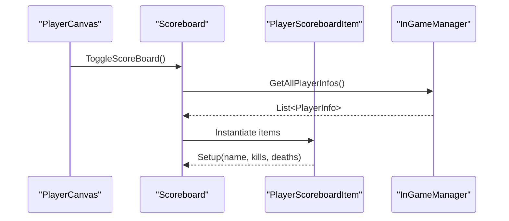

**Diagram sources**
- [Player/PlayerCanvas.cs:50-91](file://Assets/FPS-Game/Scripts/Player/PlayerCanvas.cs#L50-L91)
- [Scoreboard.cs:20-46](file://Assets/FPS-Game/Scripts/Scoreboard.cs#L20-L46)
- [PlayerScoreboardItem.cs:20-26](file://Assets/FPS-Game/Scripts/PlayerScoreboardItem.cs#L20-L26)

**Section sources**
- [README.md:70-72](file://README.md#L70-L72)
- [Player/PlayerCanvas.cs:50-91](file://Assets/FPS-Game/Scripts/Player/PlayerCanvas.cs#L50-L91)
- [Scoreboard.cs:20-46](file://Assets/FPS-Game/Scripts/Scoreboard.cs#L20-L46)
- [PlayerScoreboardItem.cs:20-26](file://Assets/FPS-Game/Scripts/PlayerScoreboardItem.cs#L20-L26)

### Hybrid FSM–Behavior Tree AI Architecture
- Perception sensor detects players within FOV/range, tracks last-known positions, and triggers lost-sight events.
- Blackboard linker binds Behavior Designer trees to runtime state, exposing vectors, booleans, and tactical data.
- Tactics module orchestrates scanning, prediction, and completion signaling to drive BT tasks.

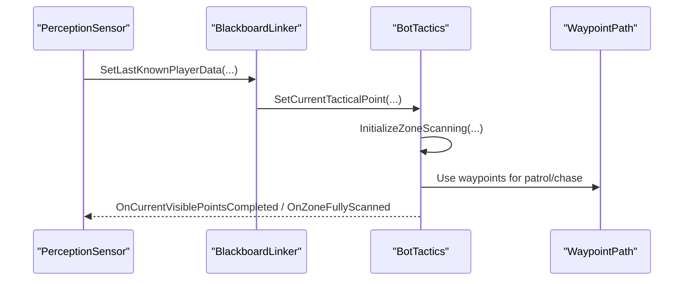

**Diagram sources**
- [Bot/PerceptionSensor.cs:10-62](file://Assets/FPS-Game/Scripts/Bot/PerceptionSensor.cs#L10-L62)
- [Bot/BlackboardLinker.cs:54-113](file://Assets/FPS-Game/Scripts/Bot/BlackboardLinker.cs#L54-L113)
- [Bot/BotTactics.cs:70-196](file://Assets/FPS-Game/Scripts/Bot/BotTactics.cs#L70-L196)
- [Bot/WaypointPath.cs:33-39](file://Assets/FPS-Game/Scripts/Bot/WaypointPath.cs#L33-L39)

**Section sources**
- [README.md:73-75](file://README.md#L73-L75)
- [Bot/PerceptionSensor.cs:129-178](file://Assets/FPS-Game/Scripts/Bot/PerceptionSensor.cs#L129-L178)
- [Bot/BlackboardLinker.cs:119-188](file://Assets/FPS-Game/Scripts/Bot/BlackboardLinker.cs#L119-L188)
- [Bot/BotTactics.cs:70-196](file://Assets/FPS-Game/Scripts/Bot/BotTactics.cs#L70-L196)

### Hierarchical Pathfinding and Zone-Based Spatial Reasoning
- Strategic level: Dijkstra-style pathfinding between zones using ZoneData and PortalConnections.
- Local level: Unity NavMesh for precise movement within zones.
- InfoPoints and TacticalPoints guide scanning and tactical positioning.

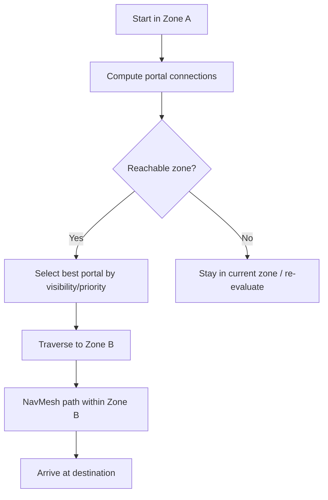

**Diagram sources**
- [TacticalAI/Data/ZoneData.cs:13-27](file://Assets/FPS-Game/Scripts/TacticalAI/Data/ZoneData.cs#L13-L27)
- [TacticalAI/Data/InfoPoint.cs:26-40](file://Assets/FPS-Game/Scripts/TacticalAI/Data/InfoPoint.cs#L26-L40)
- [Bot/BotTactics.cs:198-237](file://Assets/FPS-Game/Scripts/Bot/BotTactics.cs#L198-L237)

**Section sources**
- [README.md:76-83](file://README.md#L76-L83)
- [TacticalAI/Data/ZoneData.cs:13-27](file://Assets/FPS-Game/Scripts/TacticalAI/Data/ZoneData.cs#L13-L27)
- [TacticalAI/Data/InfoPoint.cs:26-40](file://Assets/FPS-Game/Scripts/TacticalAI/Data/InfoPoint.cs#L26-L40)
- [Bot/BotTactics.cs:198-237](file://Assets/FPS-Game/Scripts/Bot/BotTactics.cs#L198-L237)

## Dependency Analysis
- AI perception depends on camera transforms and FOV calculations to detect targets and maintain last-known positions.
- Blackboard linking synchronizes Behavior Designer variables with runtime state, enabling BT tasks to consume tactical data.
- ZoneData and InfoPoint structures are the backbone of spatial reasoning, referenced by tactics and pathfinding.

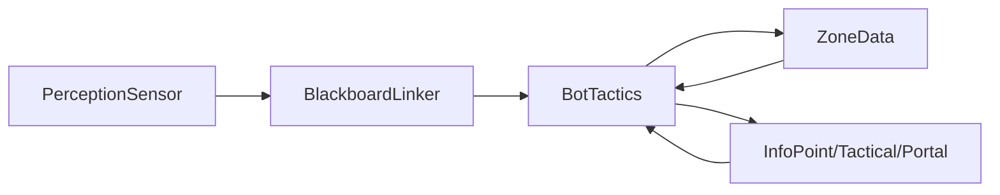

**Diagram sources**
- [Bot/PerceptionSensor.cs:10-62](file://Assets/FPS-Game/Scripts/Bot/PerceptionSensor.cs#L10-L62)
- [Bot/BlackboardLinker.cs:54-113](file://Assets/FPS-Game/Scripts/Bot/BlackboardLinker.cs#L54-L113)
- [Bot/BotTactics.cs:17-76](file://Assets/FPS-Game/Scripts/Bot/BotTactics.cs#L17-L76)
- [TacticalAI/Data/ZoneData.cs:30-122](file://Assets/FPS-Game/Scripts/TacticalAI/Data/ZoneData.cs#L30-L122)
- [TacticalAI/Data/InfoPoint.cs:8-40](file://Assets/FPS-Game/Scripts/TacticalAI/Data/InfoPoint.cs#L8-L40)

**Section sources**
- [Bot/PerceptionSensor.cs:10-62](file://Assets/FPS-Game/Scripts/Bot/PerceptionSensor.cs#L10-L62)
- [Bot/BlackboardLinker.cs:54-113](file://Assets/FPS-Game/Scripts/Bot/BlackboardLinker.cs#L54-L113)
- [Bot/BotTactics.cs:17-76](file://Assets/FPS-Game/Scripts/Bot/BotTactics.cs#L17-L76)
- [TacticalAI/Data/ZoneData.cs:30-122](file://Assets/FPS-Game/Scripts/TacticalAI/Data/ZoneData.cs#L30-L122)
- [TacticalAI/Data/InfoPoint.cs:8-40](file://Assets/FPS-Game/Scripts/TacticalAI/Data/InfoPoint.cs#L8-L40)

## Performance Considerations
- Server-authoritative damage reduces client-side prediction errors and network overhead by centralizing hit registration.
- Zone-based spatial reasoning minimizes global visibility checks by scoping scanning to InfoPoints and TacticalPoints.
- Behavior Designer blackboard updates occur only when necessary to reduce variable churn in BT trees.

[No sources needed since this section provides general guidance]

## Troubleshooting Guide
- If damage does not decrement or kills are not tracked, verify ServerRpc invocation paths and target ownership resolution.
- If AI does not scan or move, confirm ZoneData references are synced and InfoPoint isChecked flags are cleared/reset appropriately.
- If weapon switching appears inconsistent, ensure WeaponHolder initializes first weapon and invokes weapon changed events after spawn.

**Section sources**
- [Player/PlayerTakeDamage.cs:46-124](file://Assets/FPS-Game/Scripts/Player/PlayerTakeDamage.cs#L46-L124)
- [TacticalAI/Data/ZoneData.cs:79-121](file://Assets/FPS-Game/Scripts/TacticalAI/Data/ZoneData.cs#L79-L121)
- [Player/WeaponHolder.cs:79-95](file://Assets/FPS-Game/Scripts/Player/WeaponHolder.cs#L79-L95)

## Conclusion
The game delivers a robust, server-authoritative FPS foundation with a comprehensive weapon system, fair damage mechanics, and a hybrid FSM–BT AI architecture. The hierarchical pathfinding and zone-based spatial reasoning enable intelligent, scalable bot behavior on the Italy-inspired map. Together, these features form a competitive, extensible multiplayer FPS framework suitable for further enhancements such as advanced combat behaviors, UI polish, and additional game modes.