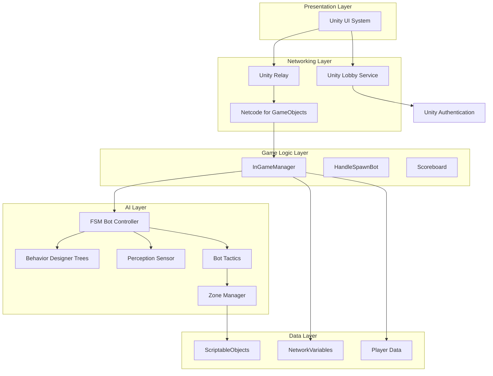
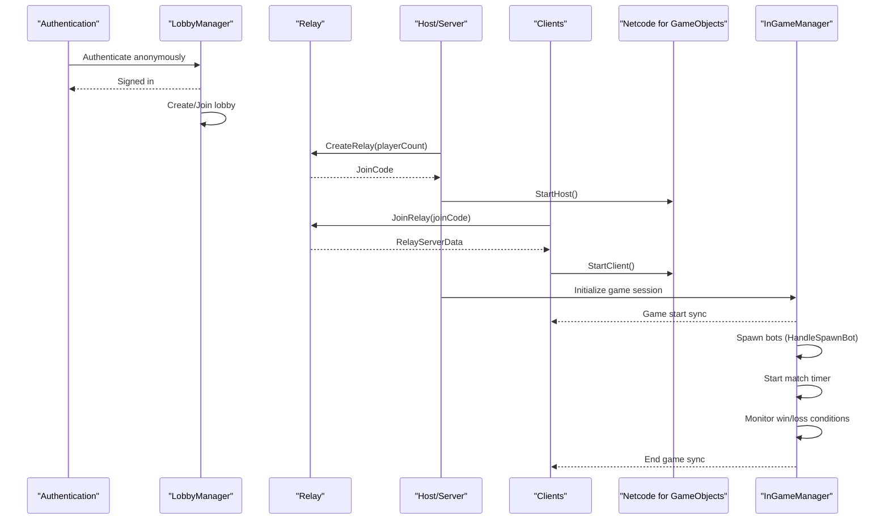
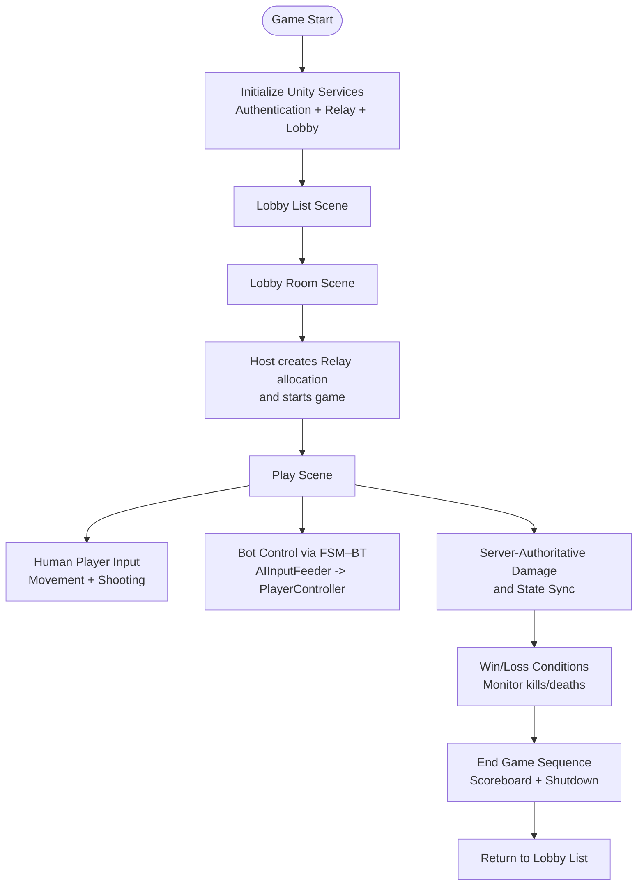
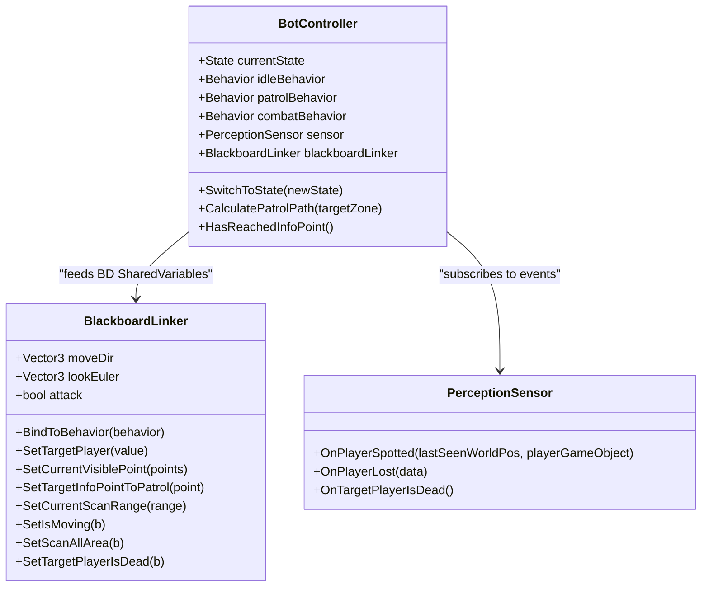
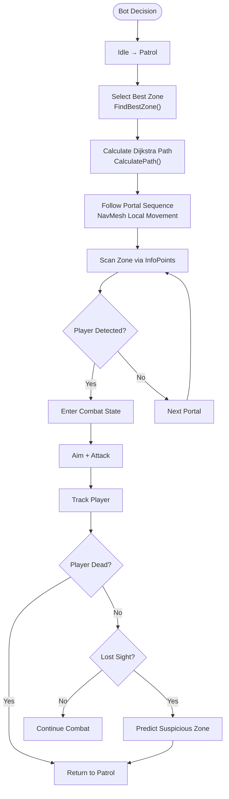
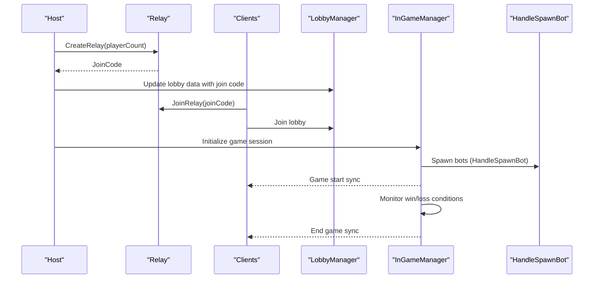
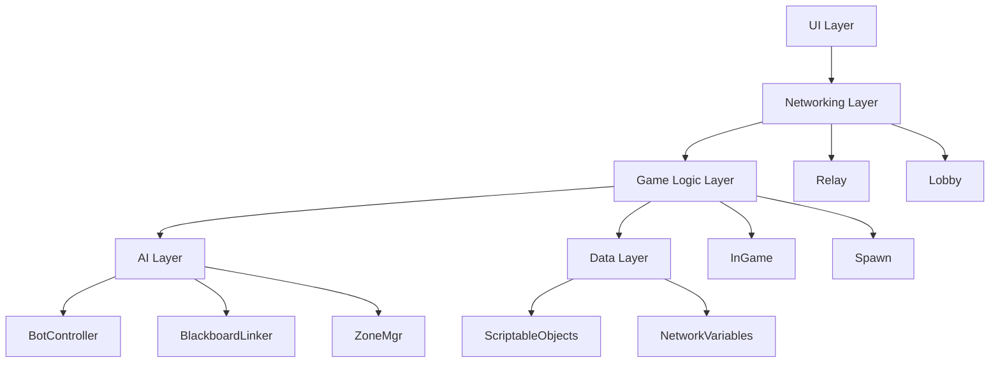

# Project Overview

<cite>
**Referenced Files in This Document**
- [README.md](file://README.md)
- [WIKI.md](file://WIKI.md)
- [InGameManager.cs](file://Assets/FPS-Game/Scripts/System/InGameManager.cs)
- [LobbyManager.cs](file://Assets/FPS-Game/Scripts/Lobby Script/Lobby/Scripts/LobbyManager.cs)
- [Relay.cs](file://Assets/FPS-Game/Scripts/Lobby Script/Lobby/Scripts/Relay.cs)
- [PlayerController.cs](file://Assets/FPS-Game/Scripts/Player/PlayerController.cs)
- [BotController.cs](file://Assets/FPS-Game/Scripts/Bot/BotController.cs)
- [BlackboardLinker.cs](file://Assets/FPS-Game/Scripts/Bot/BlackboardLinker.cs)
- [ZoneManager.cs](file://Assets/FPS-Game/Scripts/TacticalAI/Core/ZoneManager.cs)
- [ZoneController.cs](file://Assets/FPS-Game/Scripts/System/ZoneController.cs)
- [HandleSpawnBot.cs](file://Assets/FPS-Game/Scripts/System/HandleSpawnBot.cs)
</cite>

## Table of Contents
1. [Introduction](#introduction)
2. [Project Structure](#project-structure)
3. [Core Components](#core-components)
4. [Architecture Overview](#architecture-overview)
5. [Detailed Component Analysis](#detailed-component-analysis)
6. [Dependency Analysis](#dependency-analysis)
7. [Performance Considerations](#performance-considerations)
8. [Troubleshooting Guide](#troubleshooting-guide)
9. [Conclusion](#conclusion)

## Introduction
This project is a server-authoritative 3D multiplayer FPS game built as a graduation thesis, demonstrating a scalable multiplayer architecture with AI bot integration using Unity and Unity Gaming Services. The system integrates:
- Unity Relay for serverless connectivity
- Netcode for GameObjects (NGO) for real-time synchronization
- Unity Lobby for matchmaking and session management
- Behavior Designer for AI behavior trees
- A hybrid Finite State Machine – Behavior Tree (FSM–BT) architecture for bot decision-making
- Zone-based spatial reasoning and hierarchical pathfinding combining graph-based and navigation mesh approaches

The goal is to design, implement, and evaluate a robust multiplayer FPS architecture that supports both human players and network-synchronized AI agents, ensuring fairness and consistency across all clients.

**Section sources**
- [README.md:26-32](file://README.md#L26-L32)
- [README.md:49-58](file://README.md#L49-L58)

## Project Structure
The project is organized around a layered architecture with clear separation of concerns:
- Presentation Layer: Unity UI for authentication, lobby, HUD, and scoreboard
- Networking Layer: Unity Relay + Lobby Service + NGO (Netcode)
- Game Logic Layer: Server-Authoritative game session management
- AI Layer: Hybrid FSM–Behavior Tree + Zone-Based Spatial AI
- Data Layer: ScriptableObjects + NetworkVariables + Player Data

**Diagram sources**
- [WIKI.md:66-96](file://WIKI.md#L66-L96)
- [InGameManager.cs:66-139](file://Assets/FPS-Game/Scripts/System/InGameManager.cs#L66-L139)

**Section sources**
- [WIKI.md:31-62](file://WIKI.md#L31-L62)

## Core Components
This section introduces the primary building blocks of the system and their roles in achieving a server-authoritative architecture with AI bot integration.

- InGameManager: Central coordinator for all in-game subsystems, manages game lifecycle, tracks characters, provides NavMesh pathfinding service for bots, coordinates win/loss conditions, and aggregates player information for the scoreboard.
- LobbyManager: Handles lobby creation, joining, heartbeats, polling, and game start coordination across all players via Unity Lobby Service.
- Relay: Manages Unity Relay allocations, join codes, and transport configuration for host and client connections.
- PlayerController: Dual-mode movement controller supporting both human input and AI input for bots, with server-authoritative gravity and jumping.
- BotController: Implements a hybrid FSM–Behavior Tree architecture with three states (Idle, Patrol, Combat), orchestrating Behavior Designer tasks and perception sensors.
- BlackboardLinker: Bridges C# blackboard data to Behavior Designer SharedVariables, enabling seamless data exchange between AI logic and behavior trees.
- ZoneManager: Provides graph-based pathfinding using Dijkstra’s algorithm on zone-level portals and integrates Unity NavMesh for local movement within zones.
- HandleSpawnBot: Spawns AI bots on the host, assigns unique IDs, and ensures network synchronization.

**Section sources**
- [InGameManager.cs:66-139](file://Assets/FPS-Game/Scripts/System/InGameManager.cs#L66-L139)
- [LobbyManager.cs:13-71](file://Assets/FPS-Game/Scripts/Lobby Script/Lobby/Scripts/LobbyManager.cs#L13-L71)
- [Relay.cs:10-71](file://Assets/FPS-Game/Scripts/Lobby Script/Lobby/Scripts/Relay.cs#L10-L71)
- [PlayerController.cs:13-140](file://Assets/FPS-Game/Scripts/Player/PlayerController.cs#L13-L140)
- [BotController.cs:62-110](file://Assets/FPS-Game/Scripts/Bot/BotController.cs#L62-L110)
- [BlackboardLinker.cs:54-113](file://Assets/FPS-Game/Scripts/Bot/BlackboardLinker.cs#L54-L113)
- [ZoneManager.cs:9-61](file://Assets/FPS-Game/Scripts/TacticalAI/Core/ZoneManager.cs#L9-L61)
- [HandleSpawnBot.cs:6-25](file://Assets/FPS-Game/Scripts/System/HandleSpawnBot.cs#L6-L25)

## Architecture Overview
The system follows a client-host topology with server-authoritative game logic. Unity Relay provides serverless connectivity, while Netcode for GameObjects handles real-time synchronization. Unity Lobby manages matchmaking and session lifecycle. The AI layer uses a hybrid FSM–Behavior Tree approach with zone-based spatial reasoning and hierarchical pathfinding.

**Diagram sources**
- [WIKI.md:555-677](file://WIKI.md#L555-L677)
- [LobbyManager.cs:545-569](file://Assets/FPS-Game/Scripts/Lobby Script/Lobby/Scripts/LobbyManager.cs#L545-L569)
- [Relay.cs:26-50](file://Assets/FPS-Game/Scripts/Lobby Script/Lobby/Scripts/Relay.cs#L26-L50)

**Section sources**
- [WIKI.md:551-590](file://WIKI.md#L551-L590)

## Detailed Component Analysis

### Server-Authoritative Gameplay Flow
The game enforces server-authoritative logic for critical systems like damage calculation and win/loss conditions, ensuring fairness and preventing cheating. Human players control their characters locally, while AI bots are fully controlled by the host and synchronized across all clients.

**Diagram sources**
- [WIKI.md:592-677](file://WIKI.md#L592-L677)
- [PlayerController.cs:142-156](file://Assets/FPS-Game/Scripts/Player/PlayerController.cs#L142-L156)
- [BotController.cs:230-275](file://Assets/FPS-Game/Scripts/Bot/BotController.cs#L230-L275)

**Section sources**
- [WIKI.md:634-655](file://WIKI.md#L634-L655)
- [PlayerController.cs:294-348](file://Assets/FPS-Game/Scripts/Player/PlayerController.cs#L294-L348)

### Hybrid FSM–Behavior Tree AI System
The AI system combines a finite state machine with behavior trees to balance structured state control with flexible behavior execution. The FSM manages high-level states (Idle, Patrol, Combat), while Behavior Designer tasks implement detailed behaviors such as scanning, seeking, aiming, and attacking.

**Diagram sources**
- [BotController.cs:62-110](file://Assets/FPS-Game/Scripts/Bot/BotController.cs#L62-L110)
- [BlackboardLinker.cs:54-113](file://Assets/FPS-Game/Scripts/Bot/BlackboardLinker.cs#L54-L113)
- [WIKI.md:262-427](file://WIKI.md#L262-L427)

**Section sources**
- [WIKI.md:262-324](file://WIKI.md#L262-L324)
- [BotController.cs:230-275](file://Assets/FPS-Game/Scripts/Bot/BotController.cs#L230-L275)
- [BlackboardLinker.cs:190-221](file://Assets/FPS-Game/Scripts/Bot/BlackboardLinker.cs#L190-L221)

### Zone-Based Spatial Reasoning and Hierarchical Pathfinding
The system employs a zone-based spatial reasoning approach with hierarchical pathfinding:
- Strategic level: Dijkstra’s algorithm computes paths between zones using portal connections
- Local level: Unity NavMesh handles precise movement within individual zones
- Zone data is serialized as ScriptableObjects and baked in the Unity Editor for runtime evaluation

**Diagram sources**
- [WIKI.md:678-750](file://WIKI.md#L678-L750)
- [ZoneManager.cs:415-440](file://Assets/FPS-Game/Scripts/TacticalAI/Core/ZoneManager.cs#L415-L440)
- [BotController.cs:331-355](file://Assets/FPS-Game/Scripts/Bot/BotController.cs#L331-L355)

**Section sources**
- [WIKI.md:429-505](file://WIKI.md#L429-L505)
- [ZoneManager.cs:389-403](file://Assets/FPS-Game/Scripts/TacticalAI/Core/ZoneManager.cs#L389-L403)
- [ZoneController.cs:13-18](file://Assets/FPS-Game/Scripts/System/ZoneController.cs#L13-L18)

### Practical Integration Examples
- Unity Services Integration: Authentication, Relay, and Lobby are initialized and used to coordinate game sessions. The host creates a Relay allocation and starts the game, while clients join via the generated join code.
- Game Flow: The complete lifecycle spans Sign In, Lobby List, Lobby Room, Game Start, Match Play, and Match End, with server-authoritative state synchronization and AI bot control.
- AI Bot Control: Bots are spawned by the host, controlled via FSM–BT, and synchronized across all clients. Their movement and actions are fed into PlayerController through AIInputFeeder.

**Diagram sources**
- [WIKI.md:592-677](file://WIKI.md#L592-L677)
- [LobbyManager.cs:545-569](file://Assets/FPS-Game/Scripts/Lobby Script/Lobby/Scripts/LobbyManager.cs#L545-L569)
- [HandleSpawnBot.cs:27-58](file://Assets/FPS-Game/Scripts/System/HandleSpawnBot.cs#L27-L58)

**Section sources**
- [WIKI.md:551-590](file://WIKI.md#L551-L590)
- [Relay.cs:26-70](file://Assets/FPS-Game/Scripts/Lobby Script/Lobby/Scripts/Relay.cs#L26-L70)

## Dependency Analysis
The system exhibits clear layering and minimal coupling between components:
- Presentation Layer depends on Networking Layer for authentication and lobby management
- Networking Layer depends on Unity Gaming Services (Relay, Lobby, Authentication)
- Game Logic Layer orchestrates AI and data synchronization
- AI Layer depends on Zone Manager and Behavior Designer
- Data Layer persists zone and player data via ScriptableObjects and NetworkVariables

**Diagram sources**
- [WIKI.md:31-62](file://WIKI.md#L31-L62)
- [InGameManager.cs:66-139](file://Assets/FPS-Game/Scripts/System/InGameManager.cs#L66-L139)

**Section sources**
- [InGameManager.cs:94-139](file://Assets/FPS-Game/Scripts/System/InGameManager.cs#L94-L139)
- [BotController.cs:62-110](file://Assets/FPS-Game/Scripts/Bot/BotController.cs#L62-L110)

## Performance Considerations
- Server-Authoritative Damage: Ensures deterministic outcomes and prevents cheating, reducing client-side prediction overhead.
- Hierarchical Pathfinding: Combines strategic graph-based pathfinding with local NavMesh navigation to minimize computational cost.
- Network Synchronization: Uses NGO for efficient state synchronization, reducing bandwidth and latency impact.
- AI Decision-Making: Behavior Designer tasks are bound to SharedVariables to avoid frequent cross-thread updates.

[No sources needed since this section provides general guidance]

## Troubleshooting Guide
Common issues and resolutions:
- Authentication Failures: Verify Unity Services initialization and anonymous sign-in completion before proceeding to lobby operations.
- Relay Connection Issues: Ensure internet connectivity and correct join code usage; confirm Relay allocation creation on the host.
- Lobby Polling Errors: Handle lobby accessibility exceptions and reinitialize lobby polling when necessary.
- Bot Spawning Problems: Confirm bot count limits and unique ID generation; verify network spawn order and ownership.
- Pathfinding Failures: Validate zone and portal configurations; ensure NavMesh sampling succeeds for positions.

**Section sources**
- [LobbyManager.cs:186-204](file://Assets/FPS-Game/Scripts/Lobby Script/Lobby/Scripts/LobbyManager.cs#L186-L204)
- [Relay.cs:45-49](file://Assets/FPS-Game/Scripts/Lobby Script/Lobby/Scripts/Relay.cs#L45-L49)
- [HandleSpawnBot.cs:29-34](file://Assets/FPS-Game/Scripts/System/HandleSpawnBot.cs#L29-L34)
- [ZoneManager.cs:173-182](file://Assets/FPS-Game/Scripts/TacticalAI/Core/ZoneManager.cs#L173-L182)

## Conclusion
This project demonstrates a robust server-authoritative 3D multiplayer FPS architecture with integrated AI bot control, leveraging Unity and Unity Gaming Services. The hybrid FSM–Behavior Tree AI system, combined with zone-based spatial reasoning and hierarchical pathfinding, provides a scalable foundation for future enhancements. The layered architecture ensures clear separation of concerns, while server-authoritative logic guarantees fairness and consistency across all clients.

[No sources needed since this section summarizes without analyzing specific files]