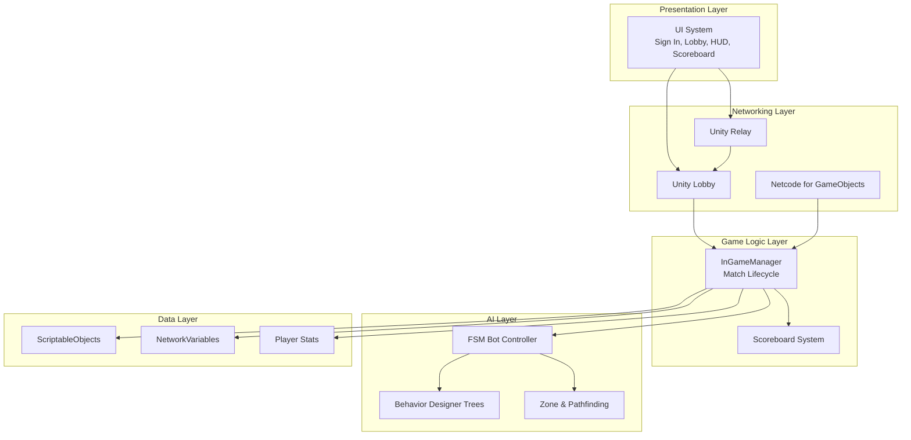
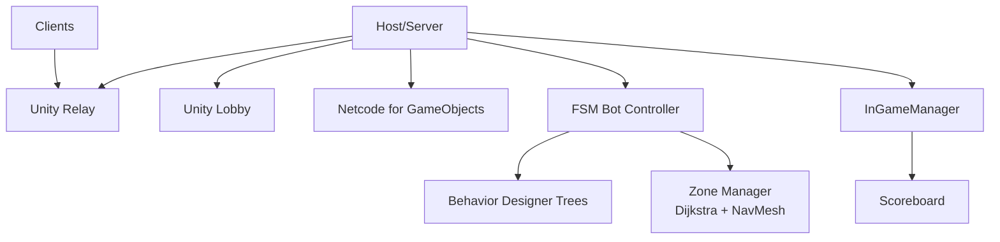
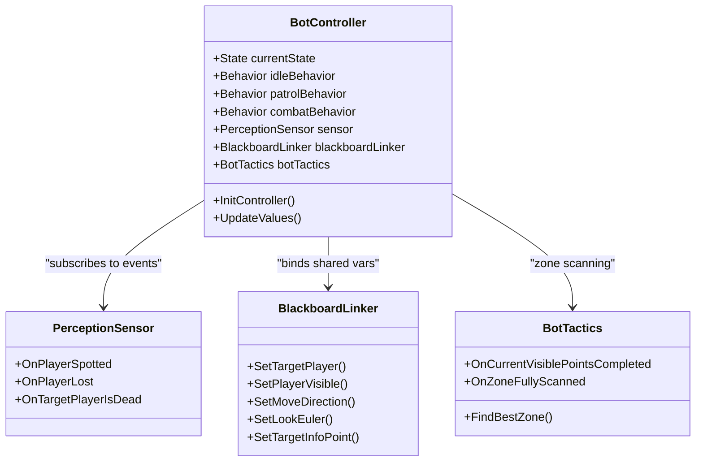
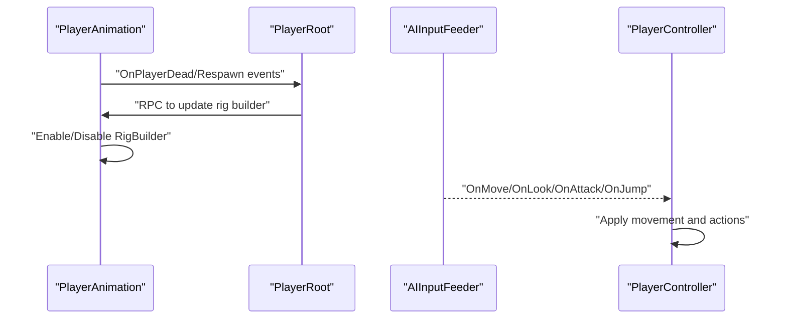
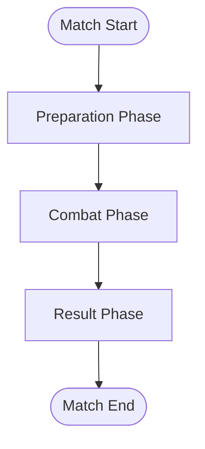

# Project Status & Progress

<cite>
**Referenced Files in This Document**
- [README.md](file://README.md)
- [CLEANUP_SUMMARY.md](file://CLEANUP_SUMMARY.md)
- [WIKI.md](file://WIKI.md)
- [ProjectSettings.asset](file://ProjectSettings/ProjectSettings.asset)
- [ProjectVersion.txt](file://ProjectSettings/ProjectVersion.txt)
- [BotController.cs](file://Assets/FPS-Game/Scripts/Bot/BotController.cs)
- [PlayerAnimation.cs](file://Assets/FPS-Game/Scripts/Player/PlayerAnimation.cs)
- [TimePhaseCounter.cs](file://Assets/FPS-Game/Scripts/System/TimePhaseCounter.cs)
</cite>

## Table of Contents
1. [Introduction](#introduction)
2. [Project Structure](#project-structure)
3. [Core Components](#core-components)
4. [Architecture Overview](#architecture-overview)
5. [Detailed Component Analysis](#detailed-component-analysis)
6. [Dependency Analysis](#dependency-analysis)
7. [Performance Considerations](#performance-considerations)
8. [Troubleshooting Guide](#troubleshooting-guide)
9. [Conclusion](#conclusion)
10. [Appendices](#appendices)

## Introduction
This document summarizes the current status and development progress of the multiplayer FPS game following successful completion of the graduation thesis. It highlights milestone achievements, the extensive cleanup performed to remove unused assets and dependencies, current limitations, and the roadmap for future enhancements. It also provides metrics on project size reduction and remaining technical debt, and outlines the project’s readiness for continuation or adaptation by other developers.

## Project Structure
The project is organized around a layered architecture with clear separation between presentation, networking, game logic, AI, and data layers. The repository contains production-ready scenes, scripts, prefabs, animations, assets, and documentation. The cleanup removed numerous unused third-party packages, demo/test files, and orphaned meta files, leaving only essential dependencies required for core gameplay.

**Diagram sources**
- [WIKI.md](file://WIKI.md)
- [README.md](file://README.md)

**Section sources**
- [README.md](file://README.md)
- [CLEANUP_SUMMARY.md](file://CLEANUP_SUMMARY.md)
- [WIKI.md](file://WIKI.md)

## Core Components
- Networking and Multiplayer System: Implements lobby creation/join, relay allocation, and NGO-based synchronization for players and bots.
- Player System: Handles movement, shooting, inventory, and animations with server-authoritative damage.
- AI Bot System: Hybrid FSM–Behavior Tree architecture with perception, tactics, and zone-based pathfinding.
- Game Session Management: Controls match phases, timers, and end-of-match logic.
- UI/UX: Basic menus and HUD present; further improvements planned.

**Section sources**
- [WIKI.md](file://WIKI.md)
- [README.md](file://README.md)

## Architecture Overview
The system follows a server-authoritative design using Unity Relay, Unity Lobby, and Netcode for GameObjects. The AI layer integrates Behavior Designer tasks with a hybrid FSM–BT approach and a zone-based spatial reasoning system. The architecture is documented with diagrams and detailed subsystem descriptions.

**Diagram sources**
- [WIKI.md](file://WIKI.md)

**Section sources**
- [WIKI.md](file://WIKI.md)

## Detailed Component Analysis

### Bot Controller and AI Behavior
The bot controller manages FSM states (Idle, Patrol, Combat) and coordinates Behavior Designer tasks. It integrates with perception sensors, blackboard linking, and tactics for zone scanning and pathfinding.

**Diagram sources**
- [BotController.cs](file://Assets/FPS-Game/Scripts/Bot/BotController.cs)

**Section sources**
- [BotController.cs](file://Assets/FPS-Game/Scripts/Bot/BotController.cs)
- [WIKI.md](file://WIKI.md)

### Player Animation and Movement
Player animation integrates with networked character rigs and handles footstep/landing events. Movement logic is dual-mode supporting both human input and AI input via an AI input feeder.

**Diagram sources**
- [PlayerAnimation.cs](file://Assets/FPS-Game/Scripts/Player/PlayerAnimation.cs)
- [BotController.cs](file://Assets/FPS-Game/Scripts/Bot/BotController.cs)

**Section sources**
- [PlayerAnimation.cs](file://Assets/FPS-Game/Scripts/Player/PlayerAnimation.cs)
- [BotController.cs](file://Assets/FPS-Game/Scripts/Bot/BotController.cs)

### Match Timer and Phases
The match timer advances through preparation, combat, and result phases. The result phase triggers end-of-match logic and scoreboard population.

**Diagram sources**
- [TimePhaseCounter.cs](file://Assets/FPS-Game/Scripts/System/TimePhaseCounter.cs)

**Section sources**
- [TimePhaseCounter.cs](file://Assets/FPS-Game/Scripts/System/TimePhaseCounter.cs)

## Dependency Analysis
The project maintains only essential dependencies post-cleanup:
- Behavior Designer: Core AI behavior tree system
- TextMesh Pro: Text rendering
- FPS-Game: Main game content (scripts, scenes, prefabs, assets)
- Resources: Runtime asset loading
- Editor: Editor scripts
- Gizmos: Behavior Designer icons
- InputActions: Unity Input System actions
- DefaultNetworkPrefabs.asset: NGO configuration
- UniversalRenderPipelineGlobalSettings.asset: URP rendering settings

Impact of cleanup:
- Removed ~15 unused third-party packages
- Eliminated demo/test scenes and orphaned meta files
- Reduced project size and improved organization
- Maintained full functionality without breaking changes

**Section sources**
- [CLEANUP_SUMMARY.md](file://CLEANUP_SUMMARY.md)
- [README.md](file://README.md)

## Performance Considerations
- UI/UX remains basic and requires improvement for menus, HUD, and lobby navigation.
- Player character animations need polishing for natural movement and effects.
- Network latency differences between host and clients cause gameplay imbalance.
- AI bot movement sometimes appears unnatural in tight spaces; perception behaviors are mechanical and need human-like variation.
- Consider optimizing asset loading and reducing unnecessary runtime logs for smoother performance.

[No sources needed since this section provides general guidance]

## Troubleshooting Guide
Common issues and resolutions:
- Missing dependencies: Verify Behavior Designer, TextMesh Pro, and NGO configurations remain intact.
- Scene loading problems: Ensure production scenes (SignIn, LobbyList, LobbyRoom, PlayScene) are present and correctly referenced.
- Network synchronization: Confirm NGO prefabs and relay settings are configured as retained during cleanup.
- AI behavior anomalies: Review Behavior Designer tasks and blackboard linkage for proper variable binding.

Verification checklist:
- All scenes verified: SignIn, LobbyList, LobbyRoom, PlayScene
- Core systems verified: Networking, Player, AI Bot, Zone, Game Session
- No compile errors and no missing references

**Section sources**
- [CLEANUP_SUMMARY.md](file://CLEANUP_SUMMARY.md)

## Conclusion
The project has successfully completed its graduation thesis phase and is now in a clean, maintainable state. The cleanup removed unused assets and dependencies while preserving full functionality. Current limitations center on UI/UX polish, animation quality, network latency, and AI behavior refinement. The roadmap includes UI improvements, additional game modes, animation enhancements, and advanced AI behaviors. The project is ready for continuation or adaptation by other developers, with comprehensive documentation and a streamlined asset base.

[No sources needed since this section summarizes without analyzing specific files]

## Appendices

### Academic Recognition and Completion Status
- Completed and closed after successful Graduation Thesis defense.
- Only minor refinements and bug fixes remain.

**Section sources**
- [README.md](file://README.md)

### Technology Stack and Environment
- Unity 2022.3+ recommended
- Netcode for GameObjects, Unity Relay, Unity Lobby
- Behavior Designer for AI
- Universal Render Pipeline

**Section sources**
- [ProjectSettings.asset](file://ProjectSettings/ProjectSettings.asset)
- [ProjectVersion.txt](file://ProjectSettings/ProjectVersion.txt)
- [WIKI.md](file://WIKI.md)