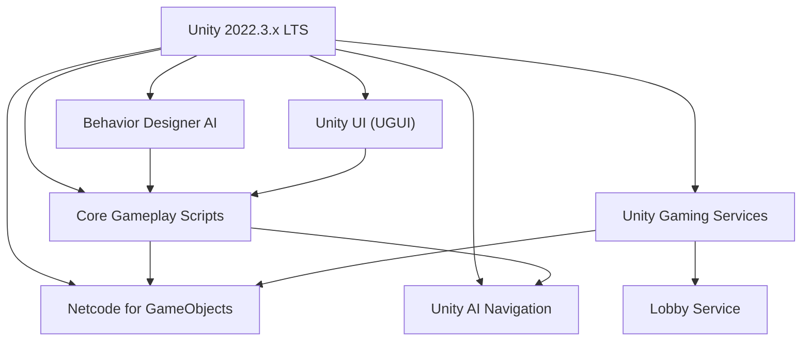
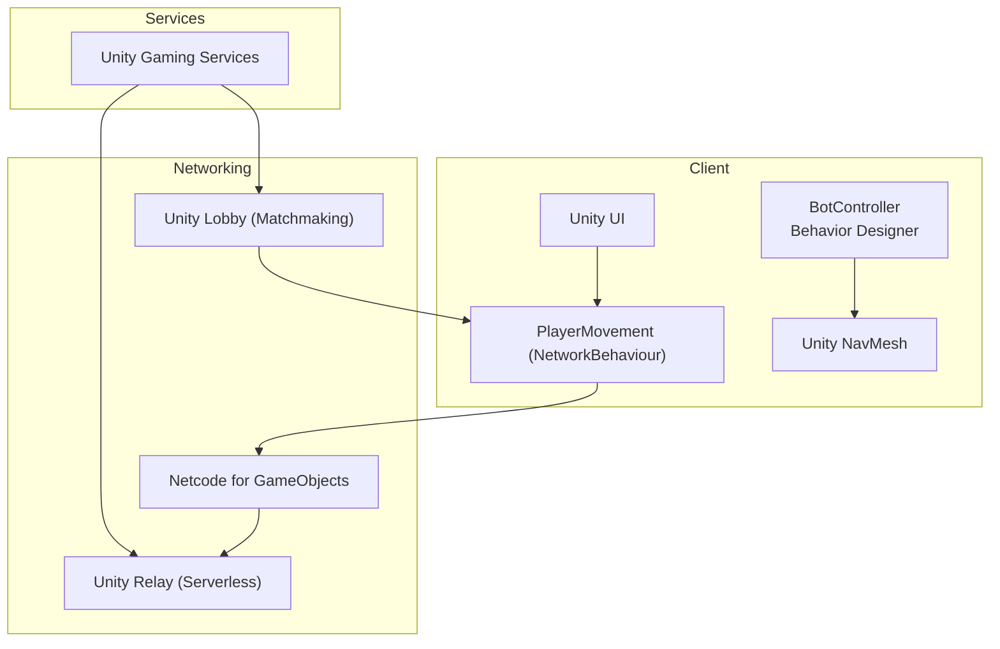
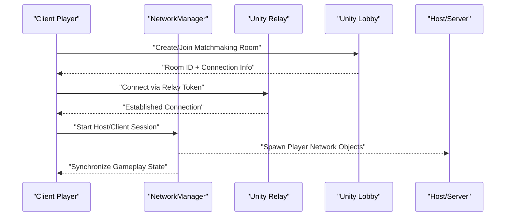
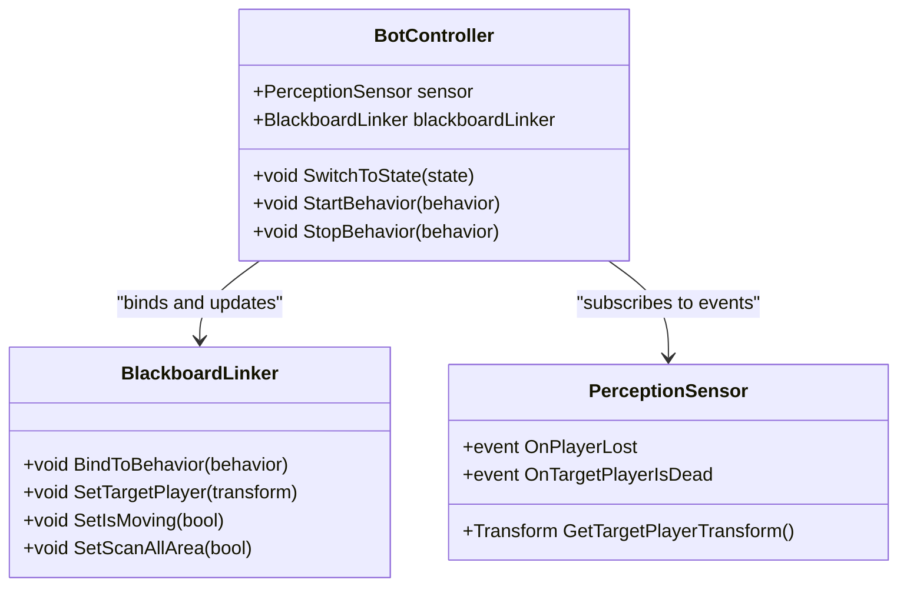
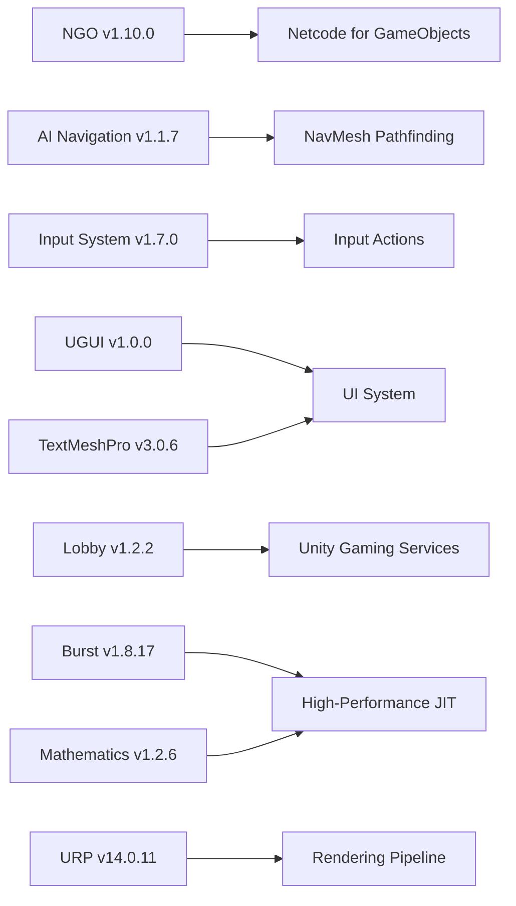
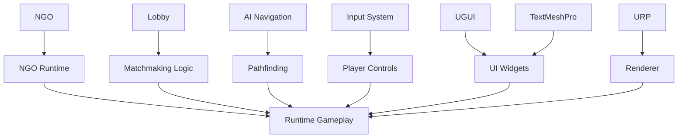

# Technology Stack

<cite>
**Referenced Files in This Document**
- [ProjectVersion.txt](file://ProjectSettings/ProjectVersion.txt)
- [NetcodeForGameObjects.asset](file://ProjectSettings/NetcodeForGameObjects.asset)
- [DefaultNetworkPrefabs.asset](file://Assets/DefaultNetworkPrefabs.asset)
- [manifest.json](file://Packages/manifest.json)
- [BotController.cs](file://Assets/FPS-Game/Scripts/Bot/BotController.cs)
- [PlayerMovement.cs](file://Assets/FPS-Game/Scripts/PlayerMovement.cs)
- [NetworkManager.prefab](file://Assets/FPS-Game/Prefabs/System/NetworkManager.prefab)
- [LobbyManager.prefab](file://Assets/FPS-Game/Prefabs/System/LobbyManager.prefab)
- [LobbyManager.cs](file://Assets/FPS-Game/Scripts/Lobby Script/Lobby/Scripts/LobbyManager.cs)
</cite>

## Table of Contents
1. [Introduction](#introduction)
2. [Project Structure](#project-structure)
3. [Core Components](#core-components)
4. [Architecture Overview](#architecture-overview)
5. [Detailed Component Analysis](#detailed-component-analysis)
6. [Dependency Analysis](#dependency-analysis)
7. [Performance Considerations](#performance-considerations)
8. [Troubleshooting Guide](#troubleshooting-guide)
9. [Conclusion](#conclusion)

## Introduction
This document presents the technology stack powering the multiplayer FPS game. It covers the core engine and language, networking, AI and pathfinding, UI systems, third-party integrations, and configuration. It also outlines version compatibility, licensing considerations, rationale for technology selection, development environment requirements, build pipeline considerations, and deployment targets.

## Project Structure
The project is a Unity 2022.3.x application configured for a multiplayer FPS experience. The repository includes:
- Core gameplay assets, prefabs, scenes, and scripts under Assets/FPS-Game
- Third-party assets and packages integrated via Unity Package Manager
- Networking configuration and default network prefabs
- AI and bot behavior components
- UI and lobby systems

**Section sources**
- [ProjectVersion.txt:1-3](file://ProjectSettings/ProjectVersion.txt#L1-L3)
- [manifest.json:1-66](file://Packages/manifest.json#L1-L66)

## Core Components
- Unity Engine 2022.3.45f1 (LTS): Provides the core runtime, rendering, physics, animation, input system, and networking stack.
- C# Programming Language: Used extensively for gameplay logic, networking, AI, and UI systems.
- .NET Framework/.NET Runtime: Supported by Unity’s .NET 4.x equivalent in 2022.3.x, enabling modern C# features and async/await patterns.

Why Unity 2022.3 LTS was chosen:
- Long-term support and stability for multiplayer development
- Mature Netcode for GameObjects (NGO) and Unity Gaming Services integration
- Strong asset pipeline and cross-platform build targets

**Section sources**
- [ProjectVersion.txt:1-3](file://ProjectSettings/ProjectVersion.txt#L1-L3)

## Architecture Overview
The game architecture centers around:
- Client-authoritative gameplay with server reconciliation via NGO
- Behavior Designer-driven AI with shared blackboard integration
- Unity UI for menus, HUD, and lobby interfaces
- Unity AI Navigation (NavMesh) for pathfinding
- Unity Gaming Services for matchmaking (Lobby) and relay connectivity

**Diagram sources**
- [PlayerMovement.cs:5-158](file://Assets/FPS-Game/Scripts/PlayerMovement.cs#L5-L158)
- [BotController.cs:62-485](file://Assets/FPS-Game/Scripts/Bot/BotController.cs#L62-L485)
- [manifest.json:19-25](file://Packages/manifest.json#L19-L25)

## Detailed Component Analysis

### Networking Stack: Netcode for GameObjects (NGO), Relay, and Lobby
- Netcode for GameObjects (NGO) v1.10.0 is enabled and configured with default network prefabs. The project includes a DefaultNetworkPrefabs asset and a NetworkManager prefab for runtime instantiation.
- Unity Relay provides serverless connectivity for NAT traversal and low-latency connections.
- Unity Lobby enables matchmaking and room management.

**Diagram sources**
- [NetcodeForGameObjects.asset:1-18](file://ProjectSettings/NetcodeForGameObjects.asset#L1-L18)
- [DefaultNetworkPrefabs.asset:1-72](file://Assets/DefaultNetworkPrefabs.asset#L1-L72)
- [NetworkManager.prefab](file://Assets/FPS-Game/Prefabs/System/NetworkManager.prefab)
- [manifest.json:19-25](file://Packages/manifest.json#L19-L25)

**Section sources**
- [NetcodeForGameObjects.asset:1-18](file://ProjectSettings/NetcodeForGameObjects.asset#L1-L18)
- [DefaultNetworkPrefabs.asset:1-72](file://Assets/DefaultNetworkPrefabs.asset#L1-L72)
- [manifest.json:19-25](file://Packages/manifest.json#L19-L25)

### AI System: Behavior Designer, Blackboard Linker, NavMesh
- Behavior Designer integrates with runtime behaviors and a C# blackboard adapter (BlackboardLinker) to synchronize state between C# logic and BD SharedVariables.
- Unity NavMesh supports pathfinding for bots and tactical movement, including patrol routing and scanning zones.

**Diagram sources**
- [BotController.cs:62-485](file://Assets/FPS-Game/Scripts/Bot/BotController.cs#L62-L485)

**Section sources**
- [BotController.cs:62-485](file://Assets/FPS-Game/Scripts/Bot/BotController.cs#L62-L485)

### Unity UI System
- The UI system is used for menus, HUD, chat, and lobby screens. It integrates with gameplay scripts to show scores, health, and controls.

[No sources needed since this section provides general guidance]

### Third-Party Integrations and Package Dependencies
- Unity AI Navigation v1.1.7: Enables NavMesh baking and pathfinding.
- Unity Input System v1.7.0: Handles input actions and device abstraction.
- Unity UI (UGUI) v1.0.0: Core UI framework.
- Unity TextMeshPro v3.0.6: Rich text rendering for UI.
- Unity Gaming Services: Includes Lobby (v1.2.2) and related services.
- Burst v1.8.17 and Math (mathematics) v1.2.6: Performance and math libraries.
- Cinemachine v2.10.1: Cinematic camera orchestration.
- Shader Graph and Universal Render Pipeline (URP) v14.0.11: Rendering pipeline and shader authoring.

**Diagram sources**
- [manifest.json:5-30](file://Packages/manifest.json#L5-L30)

**Section sources**
- [manifest.json:1-66](file://Packages/manifest.json#L1-L66)

### Development Environment Requirements
- Unity Hub and Unity Editor 2022.3.45f1 (LTS)
- Visual Studio or Rider for C# development
- Git for version control
- Optional: Visual Studio Code with Unity extensions

[No sources needed since this section provides general guidance]

### Build Pipeline Considerations
- Configure URP settings and platform-specific build targets (Windows, macOS, Linux, Android, iOS)
- Enable IL2CPP scripting backend for mobile and console builds
- Configure Netcode build settings and define networking symbols
- Package and deploy with Unity Cloud Build or local CI/CD

[No sources needed since this section provides general guidance]

### Deployment Targets
- Desktop: Windows, macOS, Linux
- Mobile: Android, iOS
- Console: PlayStation, Xbox, Nintendo Switch (via Unity’s platform support)

[No sources needed since this section provides general guidance]

## Dependency Analysis
The project exhibits clear separation of concerns:
- Networking depends on NGO and Unity Gaming Services
- AI depends on Behavior Designer and NavMesh
- UI depends on UGUI and TextMeshPro
- Input depends on Input System
- Rendering depends on URP

**Diagram sources**
- [manifest.json:5-30](file://Packages/manifest.json#L5-L30)

**Section sources**
- [manifest.json:1-66](file://Packages/manifest.json#L1-L66)

## Performance Considerations
- Use Burst and Math libraries for compute-intensive tasks
- Optimize NavMesh baking and agent settings
- Minimize network serialization overhead with NGO
- Prefer URP’s GPU instancing and batching
- Profile input latency and frame timing

[No sources needed since this section provides general guidance]

## Troubleshooting Guide
- Networking
  - Verify NGO is enabled and DefaultNetworkPrefabs is present
  - Confirm NetworkManager prefab is instantiated at runtime
- AI
  - Ensure Behavior Designer behaviors are assigned and bound via BlackboardLinker
  - Validate NavMesh is baked and agents have valid destinations
- UI
  - Confirm UGUI canvas and event system are initialized
  - Check TextMeshPro fonts and materials are included
- Services
  - Validate Unity Gaming Services credentials and service activation

**Section sources**
- [NetcodeForGameObjects.asset:1-18](file://ProjectSettings/NetcodeForGameObjects.asset#L1-L18)
- [DefaultNetworkPrefabs.asset:1-72](file://Assets/DefaultNetworkPrefabs.asset#L1-L72)
- [BotController.cs:62-485](file://Assets/FPS-Game/Scripts/Bot/BotController.cs#L62-L485)

## Conclusion
The technology stack leverages Unity 2022.3 LTS with Netcode for GameObjects, Behavior Designer, Unity AI Navigation, and Unity Gaming Services to deliver a robust multiplayer FPS experience. The modular architecture, combined with URP and UGUI, ensures maintainability, performance, and cross-platform readiness. Adhering to the outlined environment, build, and deployment practices will streamline development and release cycles.