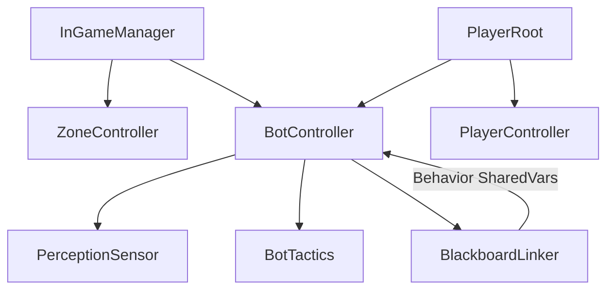
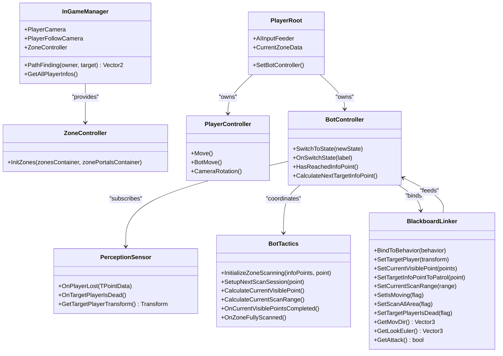
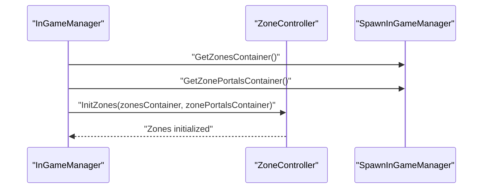
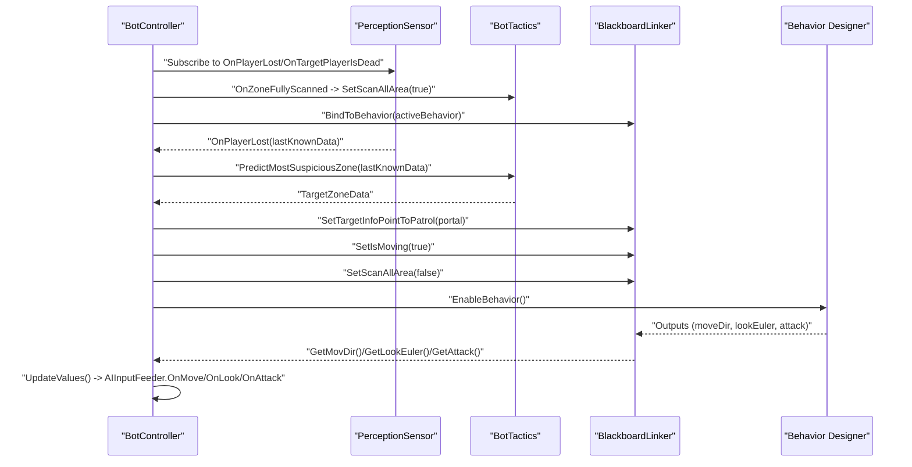
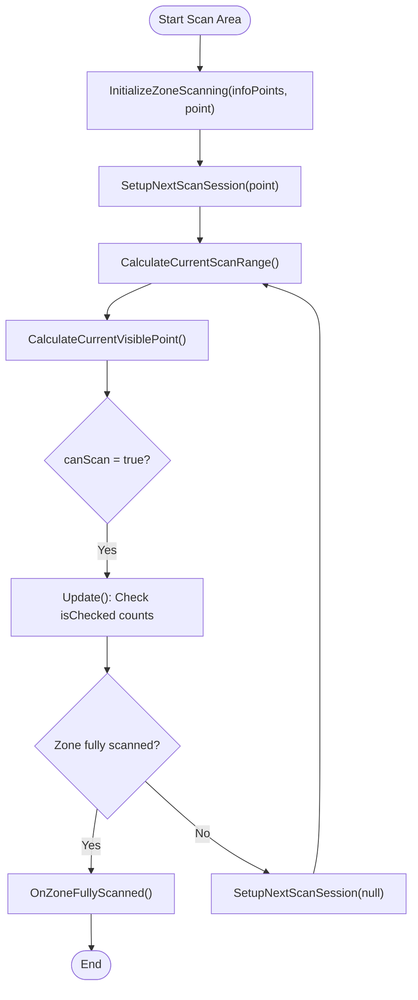
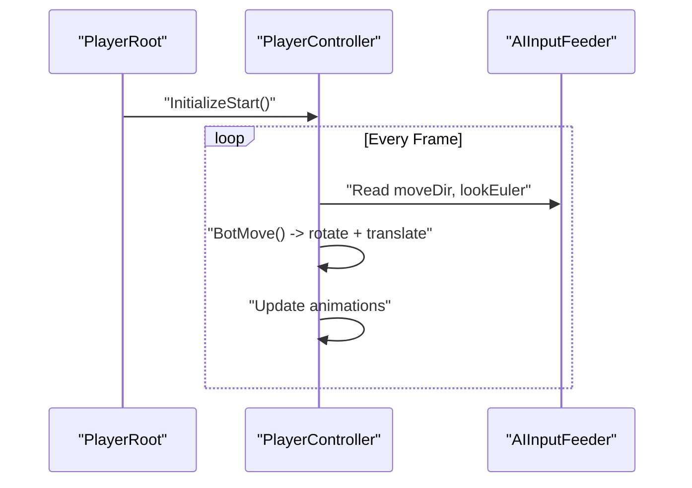
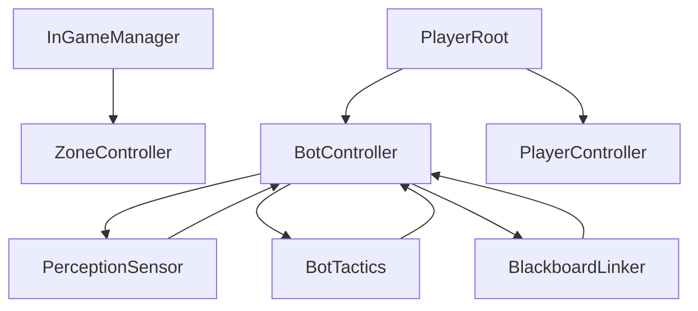

# Component Interactions

<cite>
**Referenced Files in This Document**
- [InGameManager.cs](file://Assets/FPS-Game/Scripts/System/InGameManager.cs)
- [BotController.cs](file://Assets/FPS-Game/Scripts/Bot/BotController.cs)
- [BlackboardLinker.cs](file://Assets/FPS-Game/Scripts/Bot/BlackboardLinker.cs)
- [PerceptionSensor.cs](file://Assets/FPS-Game/Scripts/Bot/PerceptionSensor.cs)
- [BotTactics.cs](file://Assets/FPS-Game/Scripts/Bot/BotTactics.cs)
- [ZoneController.cs](file://Assets/FPS-Game/Scripts/System/ZoneController.cs)
- [PlayerController.cs](file://Assets/FPS-Game/Scripts/Player/PlayerController.cs)
- [PlayerRoot.cs](file://Assets/FPS-Game/Scripts/Player/PlayerRoot.cs)
</cite>

## Table of Contents
1. [Introduction](#introduction)
2. [Project Structure](#project-structure)
3. [Core Components](#core-components)
4. [Architecture Overview](#architecture-overview)
5. [Detailed Component Analysis](#detailed-component-analysis)
6. [Dependency Analysis](#dependency-analysis)
7. [Performance Considerations](#performance-considerations)
8. [Troubleshooting Guide](#troubleshooting-guide)
9. [Conclusion](#conclusion)

## Introduction
This document explains the orchestrated interactions among the central InGameManager, the BotController finite-state machine (FSM) integrated with Behavior Designer, the ZoneController spatial reasoning system, and the PlayerController gameplay components. It focuses on event-driven communication, data binding via BlackboardLinker, observer-style event propagation, lifecycle management, and inter-component dependency resolution. Sequence diagrams illustrate key scenarios: bot state transitions, zone scanning, and player actions.

## Project Structure
The system centers around a networked game manager coordinating subsystems:
- InGameManager: orchestrates global systems, camera, navigation, zones, and RPC-based player info exchange.
- BotController: FSM that selects and runs Behavior Designer trees, coordinates perception and tactics, and feeds inputs to the player avatar.
- BlackboardLinker: bidirectional bridge between C# state and Behavior Designer shared variables.
- PerceptionSensor: detects players, tracks last-known positions, and triggers loss-of-sight events.
- BotTactics: computes tactical scanning ranges and visibility sessions per zone.
- ZoneController: initializes and exposes zone/portals containers for spatial navigation.
- PlayerController: handles player movement, camera, and animations; supports bot-mode input feeding.
- PlayerRoot: aggregates subsystems under a single networked root and manages initialization order.

**Diagram sources**
- [InGameManager.cs:66-128](file://Assets/FPS-Game/Scripts/System/InGameManager.cs#L66-L128)
- [ZoneController.cs:8-18](file://Assets/FPS-Game/Scripts/System/ZoneController.cs#L8-L18)
- [BotController.cs:62-110](file://Assets/FPS-Game/Scripts/Bot/BotController.cs#L62-L110)
- [BlackboardLinker.cs:54-90](file://Assets/FPS-Game/Scripts/Bot/BlackboardLinker.cs#L54-L90)
- [PerceptionSensor.cs:10-46](file://Assets/FPS-Game/Scripts/Bot/PerceptionSensor.cs#L10-L46)
- [BotTactics.cs:17-58](file://Assets/FPS-Game/Scripts/Bot/BotTactics.cs#L17-L58)
- [PlayerRoot.cs:159-200](file://Assets/FPS-Game/Scripts/Player/PlayerRoot.cs#L159-L200)
- [PlayerController.cs:13-140](file://Assets/FPS-Game/Scripts/Player/PlayerController.cs#L13-L140)

**Section sources**
- [InGameManager.cs:66-128](file://Assets/FPS-Game/Scripts/System/InGameManager.cs#L66-L128)
- [ZoneController.cs:8-18](file://Assets/FPS-Game/Scripts/System/ZoneController.cs#L8-L18)
- [BotController.cs:62-110](file://Assets/FPS-Game/Scripts/Bot/BotController.cs#L62-L110)
- [BlackboardLinker.cs:54-90](file://Assets/FPS-Game/Scripts/Bot/BlackboardLinker.cs#L54-L90)
- [PerceptionSensor.cs:10-46](file://Assets/FPS-Game/Scripts/Bot/PerceptionSensor.cs#L10-L46)
- [BotTactics.cs:17-58](file://Assets/FPS-Game/Scripts/Bot/BotTactics.cs#L17-L58)
- [PlayerRoot.cs:159-200](file://Assets/FPS-Game/Scripts/Player/PlayerRoot.cs#L159-L200)
- [PlayerController.cs:13-140](file://Assets/FPS-Game/Scripts/Player/PlayerController.cs#L13-L140)

## Core Components
- InGameManager
  - Singleton orchestrator with NetworkBehaviour lifecycle.
  - Initializes subsystems (time phase, kill checker, health pickup generator, lobby relay checker, spawn/bot handlers, waypoints, zone controller).
  - Exposes camera references and provides NavMesh pathfinding helper.
  - Implements RPC to broadcast player stats to clients.
- BotController
  - FSM with Idle, Patrol, and Combat states.
  - Integrates Behavior Designer behaviors and binds BlackboardLinker values.
  - Coordinates perception events and tactics updates to drive movement and scanning.
- BlackboardLinker
  - Bidirectional adapter between C# state and Behavior Designer shared variables.
  - Publishes movement, look, and attack signals to active Behavior.
  - Subscribes to Behavior outputs to feed runtime state back to C#.
- PerceptionSensor
  - Detects nearest player within FOV/distance and obstacles.
  - Emits OnPlayerLost with last-known position and fires OnTargetPlayerIsDead when the target dies.
- BotTactics
  - Computes current visible points, scan ranges, and completion flags.
  - Triggers events when a scanning session completes or a zone is fully scanned.
- ZoneController
  - Initializes zones and portals containers from spawn manager.
  - Provides spatial reasoning helpers for patrol/chase targeting.
- PlayerController
  - Handles player movement, jumping, gravity, camera rotation, and animations.
  - Supports bot-mode movement driven by AIInputFeeder.
- PlayerRoot
  - Aggregates subsystems and manages initialization order across awake/start/network boundaries.
  - Tracks current zone data for pathfinding and spatial logic.

**Section sources**
- [InGameManager.cs:66-232](file://Assets/FPS-Game/Scripts/System/InGameManager.cs#L66-L232)
- [BotController.cs:62-485](file://Assets/FPS-Game/Scripts/Bot/BotController.cs#L62-L485)
- [BlackboardLinker.cs:54-332](file://Assets/FPS-Game/Scripts/Bot/BlackboardLinker.cs#L54-L332)
- [PerceptionSensor.cs:10-407](file://Assets/FPS-Game/Scripts/Bot/PerceptionSensor.cs#L10-L407)
- [BotTactics.cs:17-456](file://Assets/FPS-Game/Scripts/Bot/BotTactics.cs#L17-L456)
- [ZoneController.cs:8-163](file://Assets/FPS-Game/Scripts/System/ZoneController.cs#L8-L163)
- [PlayerController.cs:13-486](file://Assets/FPS-Game/Scripts/Player/PlayerController.cs#L13-L486)
- [PlayerRoot.cs:159-366](file://Assets/FPS-Game/Scripts/Player/PlayerRoot.cs#L159-L366)

## Architecture Overview
The system follows a centralized coordinator pattern:
- InGameManager initializes and wires subsystems, exposing shared services (zones, cameras, pathfinding).
- BotController acts as the primary orchestrator for AI behavior, delegating perception, tactics, and spatial decisions to supporting components.
- BlackboardLinker mediates data binding between C# state and Behavior Designer trees.
- PlayerRoot encapsulates player subsystems and exposes AI input feeding for bot mode.

**Diagram sources**
- [InGameManager.cs:66-128](file://Assets/FPS-Game/Scripts/System/InGameManager.cs#L66-L128)
- [BotController.cs:62-110](file://Assets/FPS-Game/Scripts/Bot/BotController.cs#L62-L110)
- [BlackboardLinker.cs:54-113](file://Assets/FPS-Game/Scripts/Bot/BlackboardLinker.cs#L54-L113)
- [PerceptionSensor.cs:10-62](file://Assets/FPS-Game/Scripts/Bot/PerceptionSensor.cs#L10-L62)
- [BotTactics.cs:17-76](file://Assets/FPS-Game/Scripts/Bot/BotTactics.cs#L17-L76)
- [ZoneController.cs:8-18](file://Assets/FPS-Game/Scripts/System/ZoneController.cs#L8-L18)
- [PlayerRoot.cs:159-200](file://Assets/FPS-Game/Scripts/Player/PlayerRoot.cs#L159-L200)
- [PlayerController.cs:13-140](file://Assets/FPS-Game/Scripts/Player/PlayerController.cs#L13-L140)

## Detailed Component Analysis

### InGameManager Orchestration
- Lifecycle: Ensures singleton instance, instantiates cameras, and resolves subsystems by type lookup.
- Spatial and Navigation: Initializes ZoneController with zones/portals containers and exposes PathFinding for NavMesh-based movement vectors.
- Networking: Broadcasts player stats via ServerRpc/ClientRpc and raises OnGameEnd to signal end-of-match.

**Diagram sources**
- [InGameManager.cs:110-127](file://Assets/FPS-Game/Scripts/System/InGameManager.cs#L110-L127)
- [ZoneController.cs:13-18](file://Assets/FPS-Game/Scripts/System/ZoneController.cs#L13-L18)

**Section sources**
- [InGameManager.cs:66-128](file://Assets/FPS-Game/Scripts/System/InGameManager.cs#L66-L128)
- [InGameManager.cs:141-194](file://Assets/FPS-Game/Scripts/System/InGameManager.cs#L141-L194)

### BotController FSM and Behavior Designer Integration
- States: Idle, Patrol, Combat.
- Behavior activation: Starts/stops Behavior Designer trees and binds BlackboardLinker to shared variables.
- Input feeding: Updates AIInputFeeder with look/move/attack signals based on current state and BlackboardLinker outputs.
- Patrol logic: Calculates patrol path via ZoneManager, sets target portal, and toggles scanning flags.
- Scanning coordination: Delegates scanning to BotTactics and updates BlackboardLinker with scan ranges and visible points.

**Diagram sources**
- [BotController.cs:101-171](file://Assets/FPS-Game/Scripts/Bot/BotController.cs#L101-L171)
- [BotController.cs:230-275](file://Assets/FPS-Game/Scripts/Bot/BotController.cs#L230-L275)
- [BotController.cs:356-379](file://Assets/FPS-Game/Scripts/Bot/BotController.cs#L356-L379)
- [BlackboardLinker.cs:86-113](file://Assets/FPS-Game/Scripts/Bot/BlackboardLinker.cs#L86-L113)
- [PerceptionSensor.cs:48-62](file://Assets/FPS-Game/Scripts/Bot/PerceptionSensor.cs#L48-L62)
- [BotTactics.cs:239-283](file://Assets/FPS-Game/Scripts/Bot/BotTactics.cs#L239-L283)

**Section sources**
- [BotController.cs:62-485](file://Assets/FPS-Game/Scripts/Bot/BotController.cs#L62-L485)
- [BlackboardLinker.cs:54-332](file://Assets/FPS-Game/Scripts/Bot/BlackboardLinker.cs#L54-L332)
- [PerceptionSensor.cs:10-107](file://Assets/FPS-Game/Scripts/Bot/PerceptionSensor.cs#L10-L107)
- [BotTactics.cs:17-283](file://Assets/FPS-Game/Scripts/Bot/BotTactics.cs#L17-L283)

### Zone Scanning Workflow
- Initialization: BotTactics receives master points and initial info point; calculates scan range.
- Visibility: Computes visible points from current info point and toggles scanning flag.
- Completion: Emits events when current visible points are processed or when the zone is fully scanned.

**Diagram sources**
- [BotTactics.cs:70-92](file://Assets/FPS-Game/Scripts/Bot/BotTactics.cs#L70-L92)
- [BotTactics.cs:125-196](file://Assets/FPS-Game/Scripts/Bot/BotTactics.cs#L125-L196)
- [BotTactics.cs:114-123](file://Assets/FPS-Game/Scripts/Bot/BotTactics.cs#L114-L123)
- [BotTactics.cs:239-283](file://Assets/FPS-Game/Scripts/Bot/BotTactics.cs#L239-L283)

**Section sources**
- [BotTactics.cs:17-456](file://Assets/FPS-Game/Scripts/Bot/BotTactics.cs#L17-L456)

### PlayerController Gameplay and Bot Mode
- Player movement: Handles ground detection, gravity, movement, and animations.
- Camera rotation: Supports toggle and device-specific input handling.
- Bot mode: Reads AIInputFeeder for move direction and look Euler angles to simulate autonomous movement.

**Diagram sources**
- [PlayerRoot.cs:209-230](file://Assets/FPS-Game/Scripts/Player/PlayerRoot.cs#L209-L230)
- [PlayerController.cs:294-348](file://Assets/FPS-Game/Scripts/Player/PlayerController.cs#L294-L348)

**Section sources**
- [PlayerController.cs:13-486](file://Assets/FPS-Game/Scripts/Player/PlayerController.cs#L13-L486)
- [PlayerRoot.cs:159-366](file://Assets/FPS-Game/Scripts/Player/PlayerRoot.cs#L159-L366)

## Dependency Analysis
- Centralized dependencies
  - InGameManager depends on ZoneController and spawn managers to initialize spatial containers.
  - BotController depends on PerceptionSensor, BotTactics, BlackboardLinker, and PlayerRoot for state and input feeding.
  - BlackboardLinker depends on Behavior Designer shared variables and GlobalVariables for cross-tree data exchange.
  - PlayerRoot aggregates subsystems and exposes AIInputFeeder for bot movement.
- Event-driven coupling
  - PerceptionSensor emits OnPlayerLost and OnTargetPlayerIsDead; BotController subscribes and reacts by recalculating patrol zones and scanning.
  - BotTactics emits completion events; BotController updates scanning flags and targets.
  - InGameManager broadcasts player stats via RPC; PlayerRoot listens and toggles camera rotation on end-of-game.

**Diagram sources**
- [InGameManager.cs:110-127](file://Assets/FPS-Game/Scripts/System/InGameManager.cs#L110-L127)
- [BotController.cs:101-110](file://Assets/FPS-Game/Scripts/Bot/BotController.cs#L101-L110)
- [PerceptionSensor.cs:23-61](file://Assets/FPS-Game/Scripts/Bot/PerceptionSensor.cs#L23-L61)
- [BotTactics.cs:52-53](file://Assets/FPS-Game/Scripts/Bot/BotTactics.cs#L52-L53)
- [BlackboardLinker.cs:86-113](file://Assets/FPS-Game/Scripts/Bot/BlackboardLinker.cs#L86-L113)
- [PlayerRoot.cs:159-200](file://Assets/FPS-Game/Scripts/Player/PlayerRoot.cs#L159-L200)
- [PlayerController.cs:13-140](file://Assets/FPS-Game/Scripts/Player/PlayerController.cs#L13-L140)

**Section sources**
- [InGameManager.cs:66-128](file://Assets/FPS-Game/Scripts/System/InGameManager.cs#L66-L128)
- [BotController.cs:62-110](file://Assets/FPS-Game/Scripts/Bot/BotController.cs#L62-L110)
- [PerceptionSensor.cs:10-62](file://Assets/FPS-Game/Scripts/Bot/PerceptionSensor.cs#L10-L62)
- [BotTactics.cs:17-76](file://Assets/FPS-Game/Scripts/Bot/BotTactics.cs#L17-L76)
- [BlackboardLinker.cs:54-113](file://Assets/FPS-Game/Scripts/Bot/BlackboardLinker.cs#L54-L113)
- [PlayerRoot.cs:159-200](file://Assets/FPS-Game/Scripts/Player/PlayerRoot.cs#L159-L200)
- [PlayerController.cs:13-140](file://Assets/FPS-Game/Scripts/Player/PlayerController.cs#L13-L140)

## Performance Considerations
- Behavior Designer tree activation/deactivation: Prefer minimal tree switching and reuse behaviors where possible to reduce overhead.
- PerceptionSensor raycasts: Limit FOV sampling and obstacle checks; cache camera transforms and masks.
- NavMesh pathfinding: Use PathFinding judiciously; batch path requests and avoid recalculating on every frame.
- BlackboardLinker updates: Avoid frequent shared variable writes; coalesce updates per frame.
- Zone scanning: Compute scan ranges and visible points only when needed; debounce event emissions.

## Troubleshooting Guide
- No behavior activation
  - Ensure BlackboardLinker.BindToBehavior is called after enabling the Behavior component.
  - Verify behavior name matches expected cases ("IdleTree", "PatrolTree", "CombatTree").
- Missing player detection
  - Confirm PerceptionSensor has a valid target camera transform and obstacle mask.
  - Check InGameManager.OnAnyPlayerDied subscription and targetPlayerRoot equality.
- Scanning not triggering
  - Verify BotTactics events fire and BotController sets scan flags accordingly.
  - Ensure BlackboardLinker.SetCurrentScanRange and SetTargetInfoPointToPatrol are invoked.
- Bot movement not applied
  - Confirm PlayerRoot.AIInputFeeder is enabled and receiving moveDir/lookEuler/attack values.
  - Validate BotController.UpdateValues publishes to AIInputFeeder.

**Section sources**
- [BlackboardLinker.cs:86-113](file://Assets/FPS-Game/Scripts/Bot/BlackboardLinker.cs#L86-L113)
- [PerceptionSensor.cs:48-62](file://Assets/FPS-Game/Scripts/Bot/PerceptionSensor.cs#L48-L62)
- [BotTactics.cs:239-283](file://Assets/FPS-Game/Scripts/Bot/BotTactics.cs#L239-L283)
- [BotController.cs:117-171](file://Assets/FPS-Game/Scripts/Bot/BotController.cs#L117-L171)
- [PlayerRoot.cs:209-230](file://Assets/FPS-Game/Scripts/Player/PlayerRoot.cs#L209-L230)

## Conclusion
The system integrates a central coordinator (InGameManager), an FSM-driven AI controller (BotController), a Behavior Designer bridge (BlackboardLinker), perception and tactics (PerceptionSensor, BotTactics), spatial reasoning (ZoneController), and player gameplay (PlayerController, PlayerRoot). Event-driven communication, data binding, and lifecycle hooks enable robust orchestration across game flow, bot state transitions, spatial scanning, and player actions.